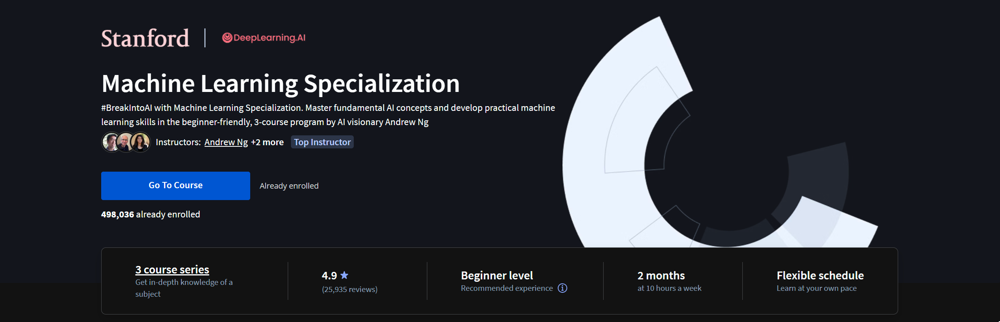

# Machine Learning Specialization

This repository contains information about the Machine Learning [specialization](https://www.coursera.org/specializations/machine-learning-introduction) offered by Coursera.

## Courses

[1. Supervised Machine Learning: Regression and Classification](https://github.com/mvarrone/machine-learning-specialization/tree/master/course_1-sup-ML-reg-classif)

[2. Advanced Learning Algorithms](https://github.com/mvarrone/machine-learning-specialization/tree/master/course_2-advanced-learning-algorithms)

[3. Unsupervised Learning, Recommenders and Reinforcement Learning](https://github.com/mvarrone/machine-learning-specialization/tree/master/course_3-unsupervised-learning)

## About the specialization

The Machine Learning Specialization is a foundational online program created in collaboration between *DeepLearning.AI* and *Stanford Online*. 
In this beginner-friendly program, you will learn the fundamentals of machine learning and how to use these techniques to build real-world AI applications. 

This Specialization is taught by *Andrew Ng*, an AI visionary who has led critical research at Stanford University and groundbreaking work at Google Brain, Baidu, and Landing.AI to advance the AI field.

This 3-course Specialization is an updated and expanded version of Andrew’s pioneering Machine Learning course, rated 4.9 out of 5 and taken by over 4.8 million learners since it launched in 2012. 

It provides a broad introduction to modern machine learning, including supervised learning (multiple linear regression, logistic regression, neural networks, and decision trees), unsupervised learning (clustering, dimensionality reduction, recommender systems), and some of the best practices used in Silicon Valley for artificial intelligence and machine learning innovation (evaluating and tuning models, taking a data-centric approach to improving performance, and more.)

By the end of this Specialization, you will have mastered key concepts and gained the practical know-how to quickly and powerfully apply machine learning to challenging real-world problems. If you’re looking to break into AI or build a career in machine learning, the new Machine Learning Specialization is the best place to start.

### Applied Learning Project

By the end of this Specialization, you will be ready to:

#### Course 1

• Build machine learning models in Python using popular machine learning libraries NumPy and scikit-learn.

• Build and train supervised machine learning models for prediction and binary classification tasks, including linear regression and logistic regression.

#### Course 2

• Build and train a neural network with TensorFlow to perform multi-class classification.

• Apply best practices for machine learning development so that your models generalize to data and tasks in the real world.

• Build and use decision trees and tree ensemble methods, including random forests and boosted trees.

#### Course 3

• Use unsupervised learning techniques for unsupervised learning: including clustering and anomaly detection.

• Build recommender systems with a collaborative filtering approach and a content-based deep learning method.

• Build a deep reinforcement learning model.

## Professors

- [Andrew Ng: Instructor, Founder, DeepLearning.AI & Co-founder, Coursera](https://www.coursera.org/instructor/andrewng)
- [Eddy Shyu: Curriculum Architect, Curriculum Product Manager, DeepLearning.AI](https://www.linkedin.com/in/eddy-shyu/)
- [Aarti Bagul: Curriculum Engineer](https://www.coursera.org/instructor/~77736236)
- [Geoff Ladwig: Curriculum Engineer, DeepLearning.AI](https://www.coursera.org/instructor/geoff-ladwig)