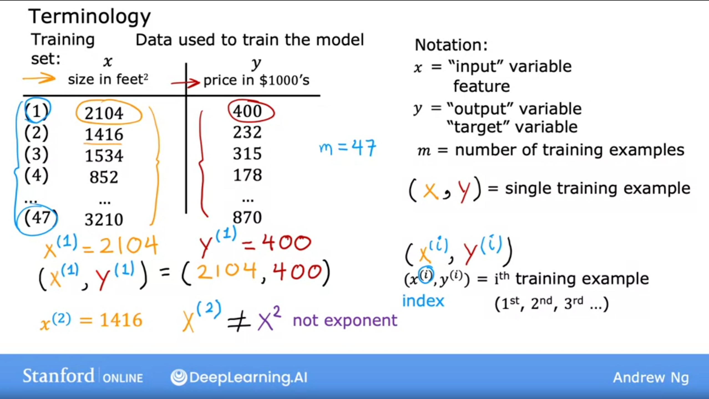

## 1st ML Model: Linear Regression (Supervised Learning)

- It is probably the most widely used learning algorithm in the world today
- It means fitting a straight line to the data (data contains right answers)
- It is called regression model because it predicts numbers (like price in dollars)
- Any supervised learning model that predicts a number is addressing what is called a regression problem
- Linear regression is one example of a regression model. But there are other models for addressing regression problems too.

Just a little reminder: 
- Classification model predicts categories and there is a small number of possible outputs whereas a regression model predicts numbers from an infinite amount of numbers that the model could output.

- Terminology:

    - Training set: Data used to train the model
    - Test set: Data used to test the model once it is trained
    - x: input variable, feature or input feature
    - y: output variable, target or target variable (Right answers)
    - Training example: Each row in a dataset
    - m: Total number of training examples
    - (x, y): A single training example
    - (x^(i), y^(i)): ith training example. ^ denotes superscript (This is not exponentiation)
        - Example: The 1st example has i = 1, so:
            (x^(1), y^(1)) = (2104, 400)

    

## Overview

- In supervised learning, a training data set includes both the input features (size of the house, for example) and the output targets (price of the house)
- Model learns from the output targets which are the right answers for the data
- To train the model you feed the training set both the input features and the output targets to your learning algorithm. 
- Then your supervised learning algorithm will produce some function f. Historically, this function f was called hypothesis.
- The job with this function f is to take a new input x and output an estimate or prediction which called y-hat. So, y-hat is the estimate or prediction for y.
- Function f is called "the model", x is called "the input, feature or input feature" and the output of the model is "the prediction y-hat".
- So, to repeat one more time: y is the target while y-hat is an estimated value of y (which it may or may not be the actual true value)

## How to represent the function f? What is the math formula used to compute f?

- f is a straight line
- It can be written as: $y = fw,b(x) = wx + b$
- w and b are numbers and the values chosen for w and b will determine the prediction y-hat based on the input feature x
- An alternative to write this function could be: $y = f(x) = wx + b$
- This is called "Linear regression with one variable". Also called "Univariate linear regression"

- Cost function: 
    - One of the most important things you have to do is construct a cost function. The idea of a cost function is one of the most universal and important ideas in machine learning and is used in both linear regression and in training many of the most advanced AI models in the world

## Optional Lab n°2: Model representation
