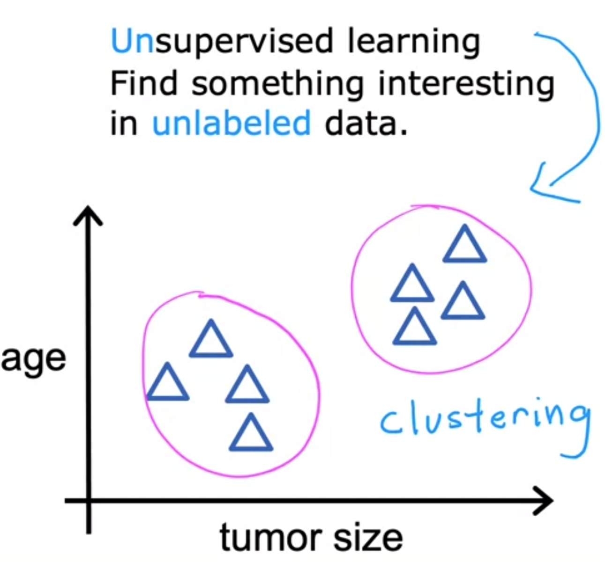
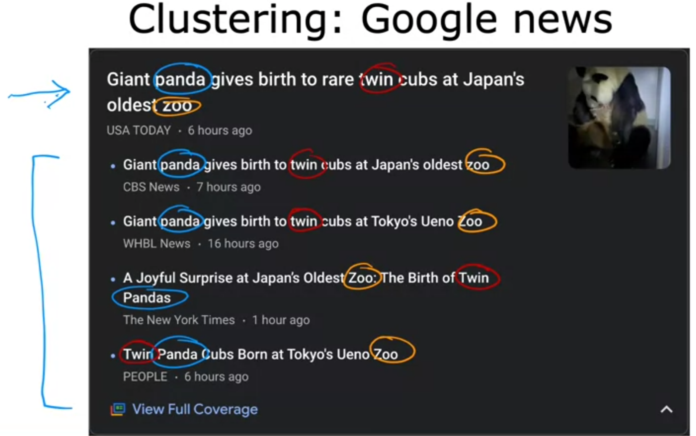
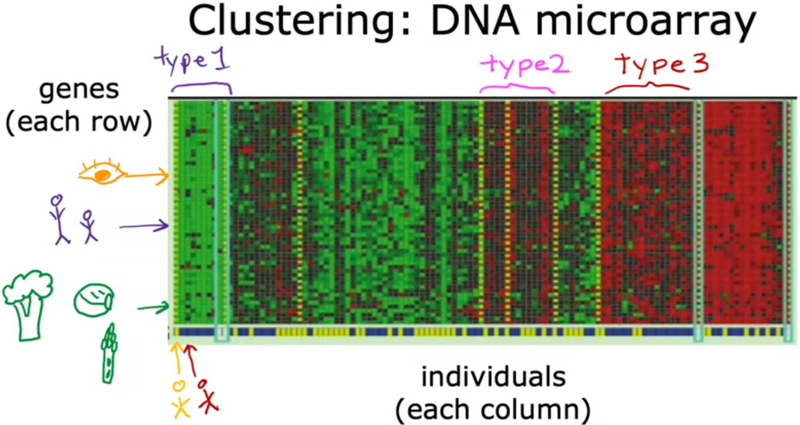
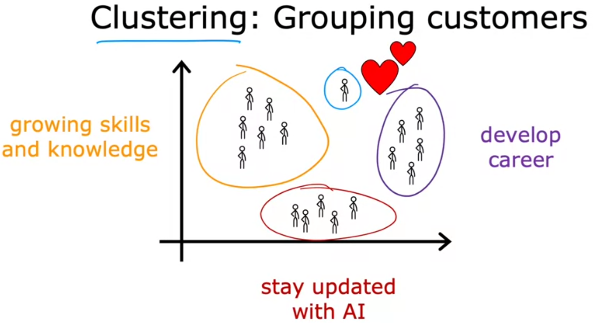

# Introduction

# What is Machine Learning?

> Field of study that gives computers the ability to learn without being explicitly programmed.
>
> -- <cite>Arthur Samuel (1959)</cite>

## Brief information about Arthur Samuel

- Arthur Lee Samuel (December 5, 1901 – July 29, 1990) was an American pioneer in the field of computer gaming and artificial intelligence. He popularized the term "machine learning" in 1959. 

- The Samuel Checkers-playing Program was among the world's first successful self-learning programs, and as such a very early demonstration of the fundamental concept of artificial intelligence (AI).

- He was also a senior member in the TeX community who devoted much time giving personal attention to the needs of users and wrote an early TeX manual in 1983.

Source: *[Wikipedia](https://en.wikipedia.org/wiki/Arthur_Samuel_(computer_scientist))*

- Samuel's claim to fame was that back in the 1950s: He wrote a checkers playing program. 

- The amazing thing about this program was that Arthur Samuel himself wasn't a very good checkers player. What he did was he had programmed the computer to play maybe tens of thousands of games against itself. 

- And by watching what social support positions tend to lead to wins and what positions tend to lead to losses the checkers plane program learned over time what are good or bad suport position.

- By trying to get a good and avoid bad positions, this program learned to get better and better at playing checkers.

- Because the computer had the patience to play tens of thousands of games against itself it was able to get so much checkers playing experience that eventually it became a better checkers player than also Samuel himself. 

Source: *Andrew Ng, Coursera ML Specialization*

## Machine Learning algorithms

1) Supervised learning
    - It is the type of ML that is used most in many real-world applications and has seen the most rapid advancements and innovation.
    - 1st and 2nd courses in this specialization focus in this type
2) Unsupervised learning
    - 3rd course in this specialization focus in this type

3) Recommender systems
    - Widely used nowadays

4) Reinforcement learning

## Important advice by the instructor

> The other thing we are going to spend a lot of time on in this specialization is practical advice for applying learning algorithms.
This is something I feel pretty strongly about. Teaching about learning algorithms is like giving someone a set of tools and equally important, so even more important to making sure you have great tools is making sure you know how to apply them because like is it is somewhere where it gives you a state-of-the-art hammer or a state-of-the-art hand drill and say good luck: Now you have all the tools you need to build a three-story house. It doesn't really work like that. And so too, in machine learning, making sure you have the tools is really important and so is making sure that you know how to apply the tools of machine learning effectively. So, that's what you get in this class, the tools as well as the skills to apply them effectively.
>
> -- <cite>Andrew Ng</cite>

## 1. Supervised Learning

Machine learning is creating tremendous economic value today. I think 99 percent of the economic value created by machine learning today is through one type of machine learning, which is called supervised learning.

- Supervised machine learning or more commonly, supervised learning, refers to algorithms that learn x to y or input to output mappings. 

- The key characteristic of supervised learning is that you give your learning algorithm examples to learn from

- That includes the right answers, whereby right answer, I mean, the correct label y for a given input x, and is by seeing correct pairs of input x and desired output label y that the learning algorithm eventually learns to take just the input alone without the output label and gives a reasonably accurate prediction or guess of the output

#### Some applications of Supervised Learning:

## 1.1 Regression

- It is a particular type of Supervised Learning in which we try to predict a number from infinitely many possible numbers, such as house prices for example.
- It is about learning input, output, or x to y mappings.

## 1.2 Classification
- In this type of SL, we are trying to predict only a small number of possible outputs or categories. Example: We could try to classify as a benign or malignant tumor in case we are dealing with Breast Cancer
- Terms *class* and *category* are used interchangeably when referring to output
- So, to summarize classification algorithms predict categories. Categories don't have to be numbers. It could be non numeric: 
    - For example:
        - It can predict whether a picture is that of a cat or a dog
        - It can predict if a tumor is benign or malignant. 
        - Categories can also be numbers like 0, 1 or 0, 1, 2.
- What makes classification different from regression when you're interpreting the numbers is that classification predicts a small finite limited set of possible output categories such as 0, 1 and 2 but not all possible numbers in between like 0.5 or 1.7.
-  You can also use more than one input value to predict an output: For example, instead of just knowing the tumor size, say you also have each patient's age in years, thickness of the tumor clump, uniformity of the cell size, uniformity of the cell shape and so on.

## Recap
- Supervised Learning maps input x to output y, where the learning algorithm learns from the quote right answers. 
- The two major types of supervised learning are regression and classification. 

    - In a **Regression** application like predicting prices of houses, the learning algorithm has to predict numbers from infinitely many possible output numbers.
    - Whereas in **Classification** the learning algorithm has to make a prediction of a category, all of a small set of possible outputs.

Question:

Supervised learning is when we give our learning algorithm the right answer y  for each example to learn from.  Which is an example of supervised learning?

Answer: Spam filtering

For instance, emails labeled as "spam" or "not spam" are examples used for training a supervised learning algorithm. The trained algorithm will then be able to predict with some degree of accuracy whether an unseen email is spam or not.

## 2. Unsupervised Learning
- After Supervised Learning, the most widely used form of Machine Learning is Unsupervised Learning
- We call it unsupervised because we are not trying to supervise the algorithm to give some right answer for every input.
- Considering the previous Breast Cancer example, now we are not asked to diagnose whether the tumor is benign or malignant, because we are not given any labels *y* in the dataset. Instead, the task is to find some structure/pattern or just find something interesting in the unlabeled data.
- We ask our algorithm to figure out all by itself what is interesting, or what patterns/structures that might be in this data

## 2.1 Clustering Algorithm
- This is a particular type of Unsupervised Learning called a Clustering Algorithm. Because it places the unlabeled data into different clusters and this turns out to be used in many applications. It groups similar data points together.

    

 - With this particular data set shown in the image, an Unsupervised Learning algorithm might decide that the data can be assigned to two different groups/clusters

## Real-world applications of the Clustering Algorithm

- Example 1: Clustering news: 

    Every day, Google News looks at hundreds of thousands of news articles on the Internet and groups related stories together into clusters by finding articles that mention similar words, for example. Clustering algorithm figures out on his own which word suggest that certain articles are in the same group.
        
    

    There is not an employee at Google News who is telling the algorithm to find articles that the word panda, twins and zoo to put them in the same cluster. It is not feasible to people doing this every single day for all the topics that news covers.

    Instea, the algorithm has to figure out on his own without supervision, what are the clusters of news articles every day.

- Example 2: Clustering Genetic or DNA data:

    

    Based on an example like this one, clustering algorithm has to find some structure to group individuals into different categories.

    We are not telling the algorithm in advance, that there is a type one person with certain characteristics or a type two person with certain characteristics. 
    Instead, what we are saying is here is a bunch of data. I don't know what the different types of people are but can you automatically find structure into data and automatically figure out whether the major types of individuals are since we are not giving the algorithm the right answer for the examples in advance.
    
- Example 3: Clustering customers

    

    Many companies have huge databases of customer information.
    
    Given this data, we could try to perform an algorithm able to automatically group  customers into different market segments so that a company can serve more efficiently its customers.

    Concretely, DeepLearning.AI team did some research to better understand its community and why different individuals take these classes, subscribe to the batch weekly newsletter or attend AI events. 

    Market segmentation found a few distinct groups of individuals: 
    
    - One group's primary motivation is seeking knowledge to grow their skills.
    - A second group's primary motivation is looking for a way to develop their career (maybe people want to get a promotion, a new job or make some career progression)
    - Another group wants to stay updated on how AI impacts their field of work.
    - Another small group wants something totally different than the other three categories.

## Supervised vs Unsupervised Learning comparison:
    Supervised Learning:
        - Data comes with both inputs x and output labels y

    Unsupervised Learning: 
        - Data comes with only inputs x but no output labels y.
        - Algorithm has to find streucture/pattern/something interesting in the data

## 2.2 Anomaly detection
- Used to detect unusual events/data points.
- It turns out to be really important for fraud detection in the financial system where unusual events/unusual transactions could be signs of fraud for many other applications.

## 2.3 Dimensionality reduction
- It lets you take a big dataset and almost magically compress it to a much smaller dataset while losing as little information as possible.

## Instructor explains what Jupyter Notebooks are and how to use them

#### Next, we are invited to try the first optional lab called "Python and Jupyter Notebooks" which corresponds to the *C1_W1_Lab01_Python_Jupyter_Soln.ipynb* file in the *Optional Lab 1 - Python and Jupyter Notebooks* folder

## [Optional Lab 1 - Python and Jupyter Notebooks](./Optional%20Lab%201%20-%20Python%20and%20Jupyter%20Notebooks/)