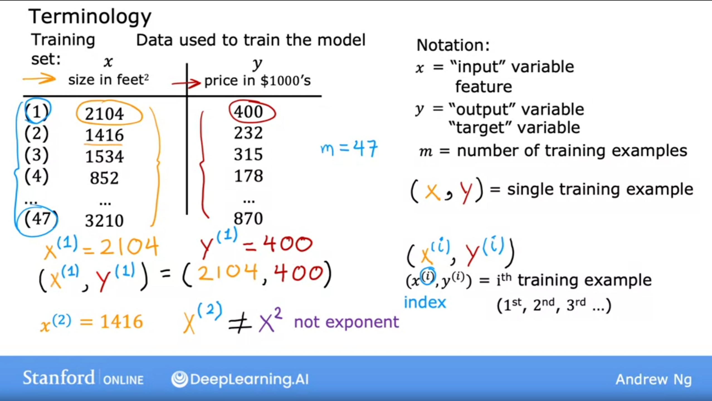
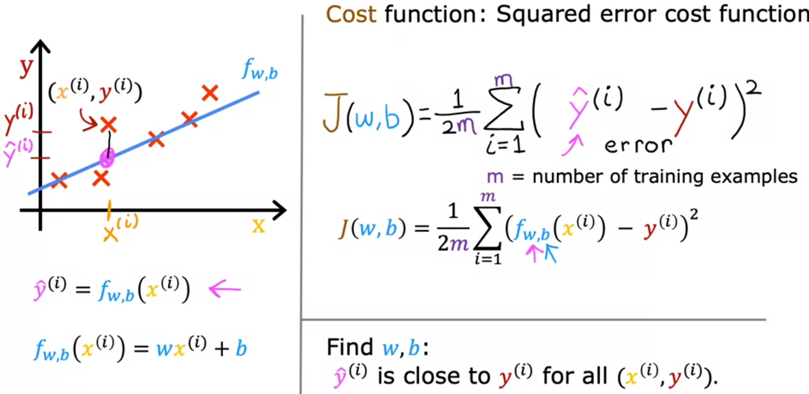
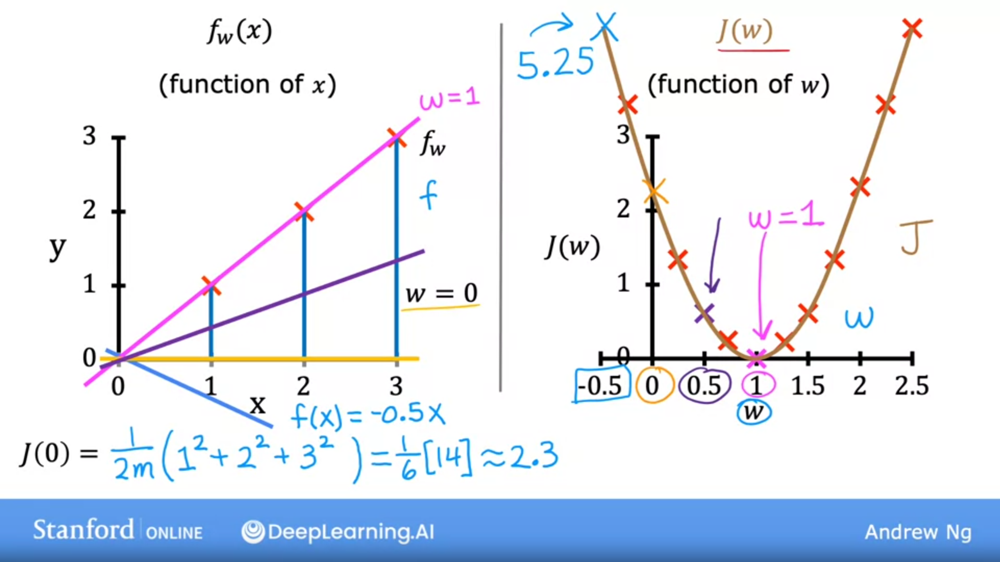
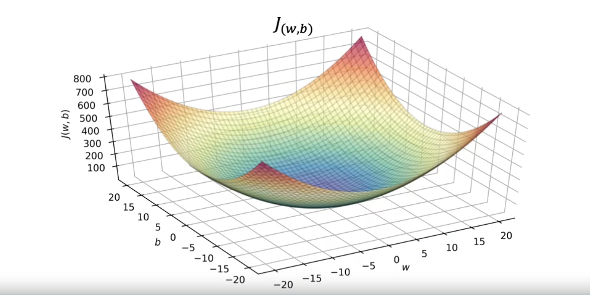
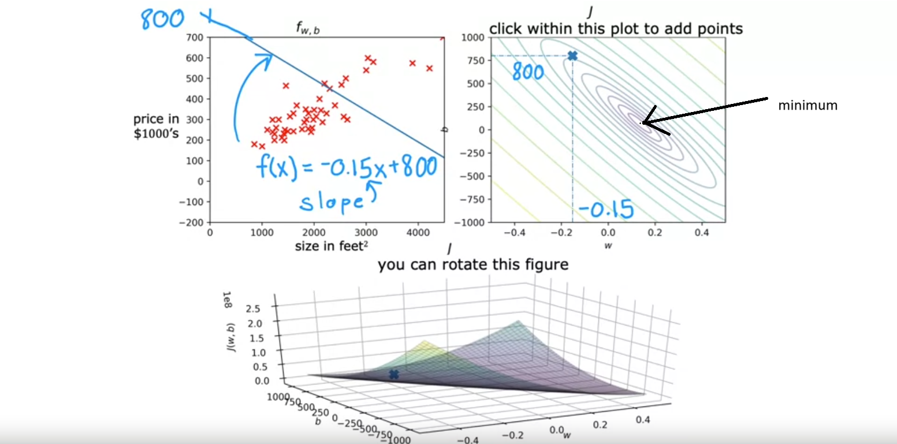

## 1st ML Model: Linear Regression (Supervised Learning)

- It is probably the most widely used learning algorithm in the world today
- It means fitting a straight line to the data (data contains right answers)
- It is called regression model because it predicts numbers (like price in dollars)
- Any supervised learning model that predicts a number is addressing what is called a regression problem
- Linear regression is one example of a regression model. But there are other models for addressing regression problems too.

Just a little reminder: 
- Classification model predicts categories and there is a small number of possible outputs whereas a regression model predicts numbers from an infinite amount of numbers that the model could output.

- Terminology:

    - Training set: Data used to train the model
    - Test set: Data used to test the model once it is trained
    - x: input variable, feature or input feature
    - y: output variable, target or target variable (Right answers)
    - Training example: Each row in a dataset
    - m: Total number of training examples
    - (x, y): A single training example
    - $(x^{(i)}$, $y^{(i)})$: $i_{th}$ training example. ^ denotes superscript (This is not exponentiation)
        - Example: The 1st example has i = 1, so:
            $(x^{(1)}$, $y^{(1)}) = (2104, 400)$

## Overview

- In supervised learning, a training data set includes both the input features (size of the house, for example) and the output targets (price of the house)
- Model learns from the output targets which are the right answers for the data
- To train the model you feed the training set both the input features and the output targets to your learning algorithm. 
- Then your supervised learning algorithm will produce some function f. Historically, this function f was called hypothesis.
- The job with this function f is to take a new input x and output an estimate or prediction which called y-hat. So, y-hat is the estimate or prediction for y.
- Function f is called "the model", x is called "the input, feature or input feature" and the output of the model is "the prediction y-hat".
- So, to repeat one more time: y is the target while y-hat is an estimated value of y (which it may or may not be the actual true value)

## How to represent the function f? What is the math formula used to compute f?

- f is a straight line
- It can be written as: $y = f_{w,b}(x) = wx + b$
- w and b are numbers they will determine the prediction, y-hat, based on the input feature x
- An alternative to write this function could be: $y = f(x) = wx + b$ because of simplicity
- This is called "Linear regression with one variable". Also called "Univariate linear regression"

## Cost function

- One of the most important things you have to do is construct a cost function.
- The idea of a cost function is one of the most universal and important ideas in machine learning and is used in both linear regression and in training many of the most advanced AI models in the world.
- Cost function tells us how well the model is doing so that we can try to get it to do better.
- Cost is a measure of how well our model is predicting the target price of the house

## Cost function J formula

Terminology (again):
- Given $y = f_{w,b}(x) = wx + b$, w and b are called the parameters of the model. In Machine Learning, parameters of the model are the variables you can adjust during training in order to improve the model.
- Sometimes, we can hear the parameters w and b referred to as coefficients or as weights.
- The question is how do you find values for w and b so that the prediction $yhat^{(i)}$ is close to the true target $y^{(i)}$ for many or maybe all training examples $(x^{(i)}$, $y^{(i)})$. To answer that question, let's first take a look at how to measure how well a line fits the training data. To do that, we're going to construct a cost function.
- The cost function takes the prediction $\hat{y}^{(i)}$ and compares it to the target y by taking $\hat{y}$ minus y. This difference is called the error. Here, we are measuring how far off to prediction is from the target.
- Next, let's compute the square of this error. The fact that the cost function J squares the loss ensures that the 'error surface' is convex like a soup bowl. It will always have a minimum that can be reached by following the gradient in all dimensions. Cost function J, in this case, is a convex function.
- Also, we are going to want to compute this term for all of the different training examples *(i)* in the training set.
- Finally, we want to measure the error across the entire training set. In particular, let's sum up the squared errors like this: We will sum from i=1 up to m, where m = number of training examples.
- Also, we compute the average squared error (instead of the total squared error) by dividing by m
- By convention, the cost function that ML people use actually divides by 2 times m. This extra division is just meant to make some of our later calculations look neater but the cost function still works whether you include this division by 2 or not.
- Letter J is assigned to the cost function which is also called the "Squared error cost function"
- Eventually, we are going to want to find values of w and b that make the cost function small.

- So, the equation for the cost function with one variable is:
$$J(w,b) = \frac{1}{2m} \sum\limits_{i = 1}^{m} (\hat{y}^{(i)} - y^{(i)})^2 $$ 
or
$$J(w,b) = \frac{1}{2m} \sum\limits_{i = 1}^{m} (f_{w,b}(x^{(i)}) - y^{(i)})^2 $$ 

where 
$$\hat{y}^{(i)} = f_{w,b}(x^{(i)}) = wx^{(i)} + b $$

Finally, we have the Cost function *J(w, b)* defined as:
$$J(w,b) = \frac{1}{2m} \sum\limits_{i = 1}^{m} (wx^{(i)} + b - y^{(i)})^2 $$ 

- m = number of training examples
- $f_{w,b}(x^{(i)})$ is our prediction $\hat{y}^{(i)}$ for example $i$ using parameters $w,b$.  
- $(f_{w,b}(x^{(i)}) -y^{(i)})^2$ is the squared difference between the target value and the prediction.   
- These differences are summed over all the $m$ examples and divided by `2m` to produce the cost, $J(w,b)$.  

## Cost function intuition

- The goal of Linear Regression is to find the parameters *w* and *b* that results in the smallest possible value for the cost function *J*.
- We can say that when the cost function *J* is relatively small or closer to zero. It means the model fits the data better compared to other choices for *w* and *b*.
- The goal is to find a model 𝑓𝑤,𝑏(𝑥)=𝑤𝑥+𝑏 with parameters 𝑤,𝑏 which will accurately predict house values given an input 𝑥. The cost is a measure of how accurate the model is on the training data.
- The cost equation

    $$J(w,b) = \frac{1}{2m} \sum\limits_{i = 1}^{m} (f_{w,b}(x^{(i)}) - y^{(i)})^2 $$ 

    shows that if 𝑤 and 𝑏 can be selected such that the predictions 𝑓𝑤,𝑏(𝑥) match the target data 𝑦, then the $(f_{w,b}(x^{(i)}) - y^{(i)})^2 $
    term will be zero and the cost J minimized.

## Visualizing the cost function: J(w) and J(w,b)

* For b = 0

    We are taking *b=0* in order to do some simplifications and taking *w=0*, *w=1* and *w=0.5* in order to plot *J(w)*

In the image shown above, we are plotting 

$$ f_{w}(x^{(i)}) = wx^{(i)} \tag{left} $$

and 

$$ J(w) = \frac{1}{2m} \sum\limits_{i = 1}^{m} (f_{w}(x^{(i)}) - y^{(i)})^2 \tag{right} $$ 

* For *b!=0*
    
    $$ f_{w,b}(x^{(i)}) = wx^{(i)}+b $$

    and 

    $$ J(w,b) = \frac{1}{2m} \sum\limits_{i = 1}^{m} (f_{w,b}(x^{(i)}) - y^{(i)})^2 \tag{below} $$ 

In this case, our 2D *J(w,b)* plot turns into a 3D surface plot as the one shown below:

Instead of using 3D surface plots, we can also use 2D contour plots to graph *J(w,b)* where we have some ellipses representing horizontal slices of this 3D surface and get all the points that they are at same height. We can find the minimum value at the center of the smallest concentric ellipse/oval.

## Gradient descent

- In Linear Regression, rather than having to manually try to read a contour plot for the best value for w and b, which isn't really a good procedure and also won't work once we get to more complex machine learning models, what we really want is an efficient algorithm that you can write in code for automatically finding the values of parameters w and b they give you the best fit line that minimizes the cost function J. 
- There is an algorithm for doing this called **Gradient Descent** which is one of the most important algorithms in Machine Learning. 
- Gradient descent and variations on gradient descent are used to train, not just linear regression, but some of the biggest and most complex models in all of AI.

## [Optional Lab 2 - Model representation](./Optional%20Lab%202%20-%20Model%20representation/)

## [Optional Lab 3 - Cost Function](./Optional%20Lab%203%20-%20Cost%20Function/)

## [Optional Lab 3b - Cost Function Intuition](./Optional%20Lab%203b%20-%20Cost%20Function%20Intuition/)