## Gradient descent

- It is used all over the place in Machine Learning: not just for linear regression but for training, for example, some of the most advanced neural network models, also called Deep Learning models.
- It is an algorithm that you can use to try to minimize any function, not just a cost function for Linear Regression.
- It applies to more general functions, including other cost functions that work with models that have more than two parameters.
-  With the gradient descent algorithm, what you are going to do is, you will keep on changing the parameters w and b a bit every time to try to reduce the cost j of w, b until hopefully j settles at or near a minimum.
- For linear regression with the squared error cost function, you always end up with a bow shape or a hammock shape.

## Implementing Gradient descent algorithm

The model has 2 parameters: w and b

## About updating w

- On each step, w parameter is updated to the old value of w minus alpha times d over dw of the cost function J(w,b)

$$ w = w - \alpha \frac{\partial J(w,b)}{\partial w} \tag{1} $$

- What this expression is saying is: Update your parameter *w* by taking the current value of *w* and adjusting it a small amount, which is the expression on the right, minus Alpha times the derivative term

- Unpacking this previous expression:

    - Equal sign ( *=* ): This is the assignment operator. It assigns the right value of the expression to the variable *w*
    - $ \alpha  $: Greek alphabet Alpha. Alpha is called the learning rate. It is usually a small positive number between 0 and 1 (say, 0.01). What Alpha does is basically controls how big of a step you take downhill.
        - If Alpha is very large, then that corresponds to a very aggressive gradient descent procedure where you are trying to take huge steps downhill.
        - If Alpha is very small, then you would be taking small baby steps downhill.
        - It is important how to choose a good learning rate Alpha
    - Derivative term of J, cost function $ \frac{\partial J(w,b)}{\partial w} $:
        It tells in which **direction** you want to take your baby step. In combination with the learning rate Alpha, it also determines the size of the steps you want to take downhill.

## About updating b

- On each step, b parameter is also updated. In this case, b is updated to the old value of b minus alpha times d over db of the cost function J(w,b)

    Note: derivative term in this case is slightly different: It is d over db

$$ b = b - \alpha \frac{\partial J(w,b)}{\partial b} \tag{2} $$

## Convergence

For the gradient descent algorithm, we are going to repeat these 2 steps until the algorithm converges.
By convergence, I mean, that you reach the point at a local minimum where the parameters *w* and *b* no longer change much with each additional step that you take.

This can be expressed as:

$$\begin{align*} \text{repeat}&\text{ until convergence:} \; \lbrace \newline
\;  w &= w -  \alpha \frac{\partial J(w,b)}{\partial w} \tag{3}  \; \newline 
 b &= b -  \alpha \frac{\partial J(w,b)}{\partial b}  \newline \rbrace
\end{align*}$$

where parameters $w$, $b$ are updated simultaneously.

## Importance of updating w and b simultaneously

- One important detail is that for Gradient descent you want to simultaneously update w and b, meaning you want to update both parameters at the same time.
- What I mean by that, is that in the previous expression (3), you are going to update w from the old w to a new w, and you are also updating b from its oldest value to a new value of b.
- The way to implement this is:
    1) To compute the right side of both expressions for w and b and store its values in temporary variables (tmp_w and tmp_b, for example)
    2) Then simultaneously at the same time update w and b to the new values by assigning those temporary variables to w and b variables.

    This correct way of updating both parameters looks like the following image:
        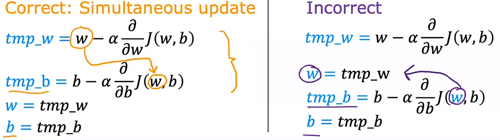

## Gradient descent intuition

- What we are going to focus on now is get more intuition about what this learning rate and what this derivative are doing and why when multiplied together results in updates to parameters w and b that make sense.

## About the derivative terms in expressions of w and b

- They are not just a derivative. They are partial derivatives.

- In order to do this let's use a slightly simpler example where we work on minimizing just one parameter. Let's say that you have a cost function J of just one parameter w where w is a number. This means the gradient descent now looks like this: w is updated to w minus the learning rate Alpha times d over dw of J(w). You're trying to minimize the cost J by adjusting the parameter w.

    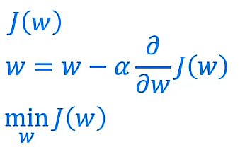

- So, this is like our previous example where we had temporarily set *b=0*. With one parameter w instead of two (w and b) you can look at two-dimensional graphs of the cost function j, instead of three dimensional graphs. 

- Let's look at what gradient descent does on just the function J(w) that looks like this:

    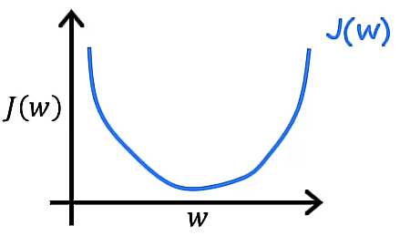

    Note here on the horizontal axis we have the parameter w and on the vertical axis we have the cost J(w).
    Now let's initialize Gradient descent with some starting values for w. 
    Specifically, we are going to analize 2 different values for w.

- Case 1:

    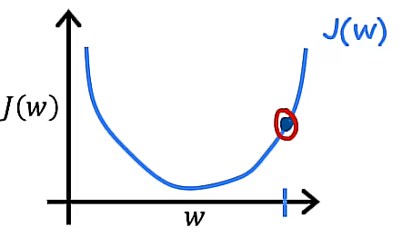

    Lets take a point like the shown in the image above.

    For this case, the derivative term is a positive number because the tangent line at that point has a positive slope. So, the updated w is going to be equal to w minus the learning rate times some positive number. Recall the learning rate Alpha is always a positive number. So, if you take w minus a positive number, you will end up with a new value for w that is smaller. So, on the graph, it means you are moving to the left.

    > Quick overview (1st case): Set a value for w -> Tangent line at that point has a positive slope -> Derivative term is positive  -> **w decreases** -> On the graph, it means the point moves to the left (w is on the horizontal axis) -> **Function cost J(w) decreases**

    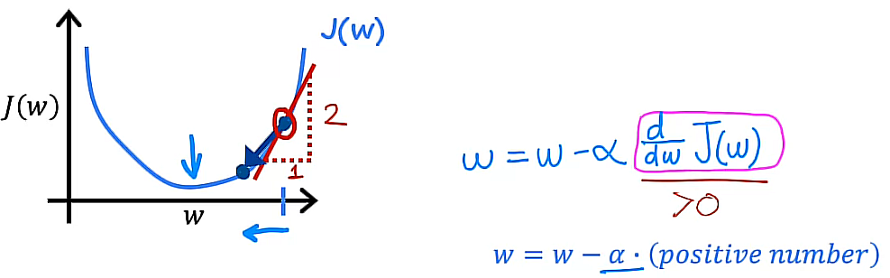

- Case 2:

    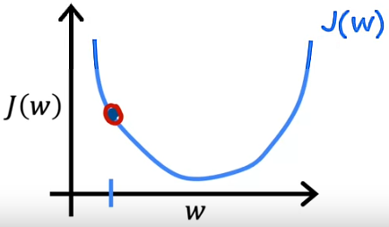

    Now, let's assume a point on the left.

    For this another case, the derivative term is a negative number because the tangent line at that point has a negative slope. So, the updated w is going to be equal to w minus the learning rate times some negative number. Recall the learning rate Alpha is always a positive number. So, you end up with w plus a positive number. If you take w plus a positive number, you will end up with a new value for w that is greater. So, on the graph, it means you are moving to the right.

    > Quick overview (2nd case): Set a value for w -> Tangent line at that point has a negative slope -> Derivative term is negative  -> **w increases** -> On the graph, it means the point moves to the right (w is on the horizontal axis) -> **Function cost J(w) decreases as well**

    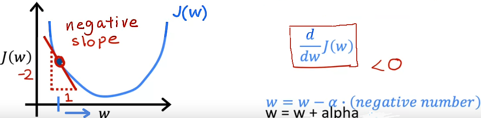

In both cases, Gradient descent is doing what expected: getting closer to the minimum.

## About the learning rate Alpha $ \alpha $

- The choice of the learning rate, alpha $ \alpha $, will have a huge impact on the efficiency of your implementation of Gradient descent. 

- If alpha $ \alpha $ is chosen poorly then Gradient descent may not even work at all.

- If $ \alpha $ is too small, then Gradient descent decreases the cost function J but it may be a slow process.
- If $ \alpha $ is too large, then Gradient descent may
    - Overshoot: Never reach the minimum
    - Fail to converge: Diverge

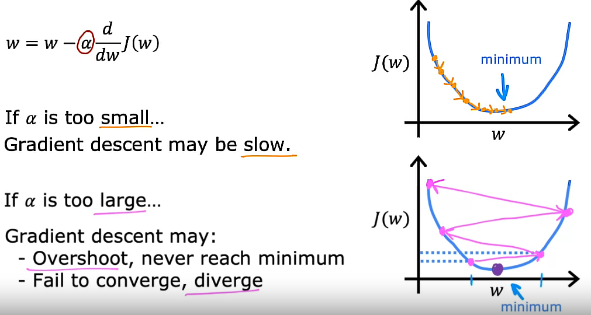

## Gradient descent and a local minimum

- So, if your parameters have brought you to a local minumum, then further Gradient descent steps to absolutely nothing. It does not change the parameters which is what you want because it keeps the solution at that local minimum due the slope at that point is equal to 0 and the derivative term is equal to 0 as well. 

    So, w is not being updated anymore. In that case, w is equal to w minus alpha times 0. So, we have w equals w.

    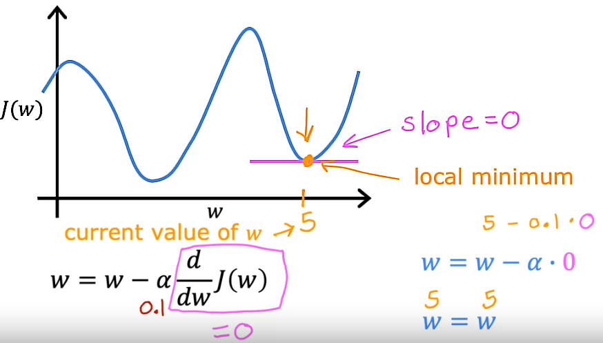
    In the image shown above, cost function J is not a squared error function cost but it worths show it here because we have more than one minimum to analyze

    This also explains why Gradient descent can reach a local minimum even with a fixed learning rate alpha

    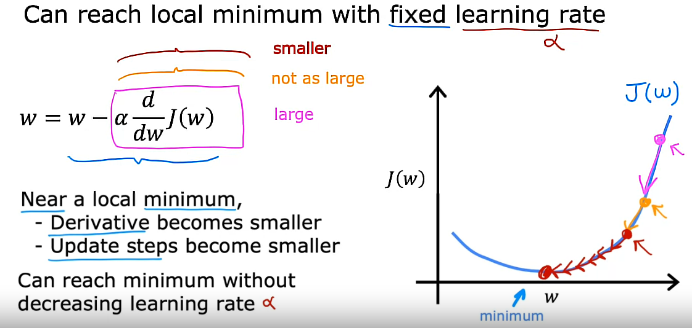

## To recap:

- As we get nearer a local minimum, GD will automatically take smaller steps. And that is because as we approach the local minimum, the derivative automatically gets smaller and that means the update steps also automatically gets smaller even if the learning rate alpha is kept at some fixed value.

So, this is the Gradient descent algorithm:

- We can use it to try to minimize any cost function J, not just the mean squared error cost function that we are using for Linear Regression.

## Linear Regression algorithm

- Putting together Gradient descent with the Cost function J will give us our first learning algorithm: Linear Regression algorithm

## Gradient descent for Linear Regression

- Previously, we took a look at the Linear Regression model and then the cost function J, and then the Gradient descent algorithm. 

- Now, we are going to pull out together and use the squared error cost function for the Linear Regression model with Gradient descent: This will allow us to train the Linear Regression model to fit a straight line to a training data.

- We need to calculate both partial derivatives (one for w and one for b)

    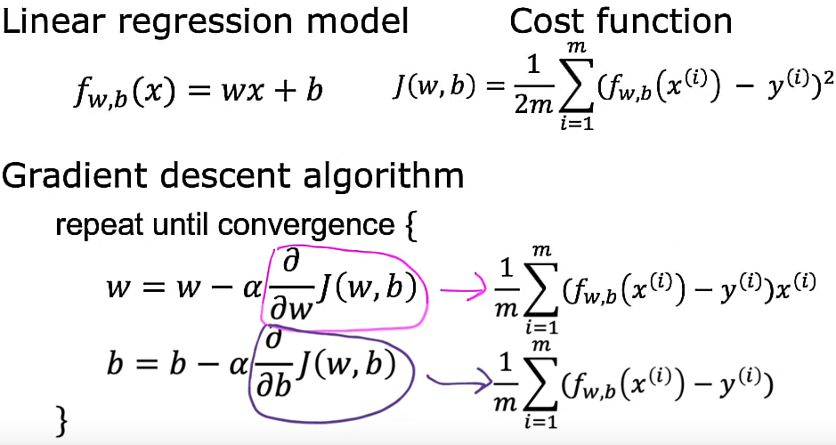

## About the derivative term for w:

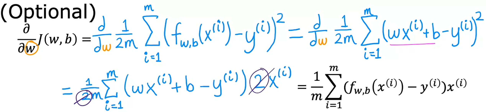

- We can see that this is why we had to find the cost function J with the (1/2m) earlier this week is because it makes the partial derivative neater. It cancels out the two that appears from computing the derivative.

## About the derivative term for b:

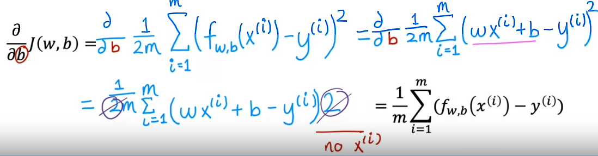

## Completing Gradient descent algorithm

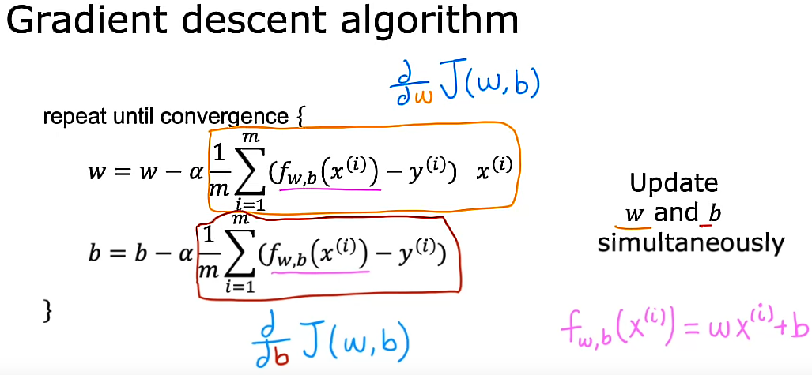

## Gradient descent when facing more than one local minimum

- One issue we saw with Gradient descent is that it can lead to a local minimum instead of a global minimum where the global minimum means the point that has the lowest possible value for the cost function J of all possible points.

- In the next image we can recall a previous surface plot that looks like an outdoor park with a few hills. This cost function has more than one local minimum. Depending on where you initialize the parameters w and b, you can end up at different local minima.

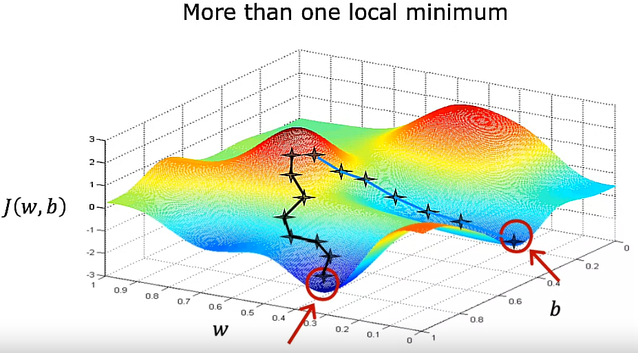

## Gradient descent when facing a convex cost function J

- But it turns out when you are using a squared error cost function with Linear Regression, the cost function does not and will never have multiple local minima. It has a single global minimum because of its bowl shape. The technical term for it is that this cost function J is a convex function.

- Informally, a convex function is a bowl shaped function and it cannot have any local minima other than the single global minimum. So, when we implement Gradient descent on a convex function, one nice property is that so as long as your learning rate alpha is chosen properly it will always converge to the global minimum.

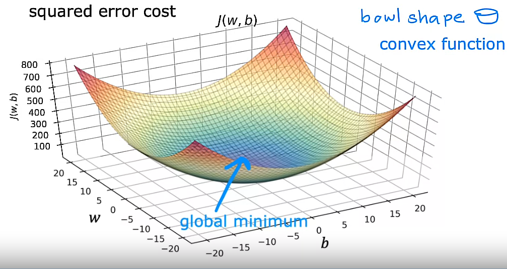

## Running gradient descent for Linear Regression

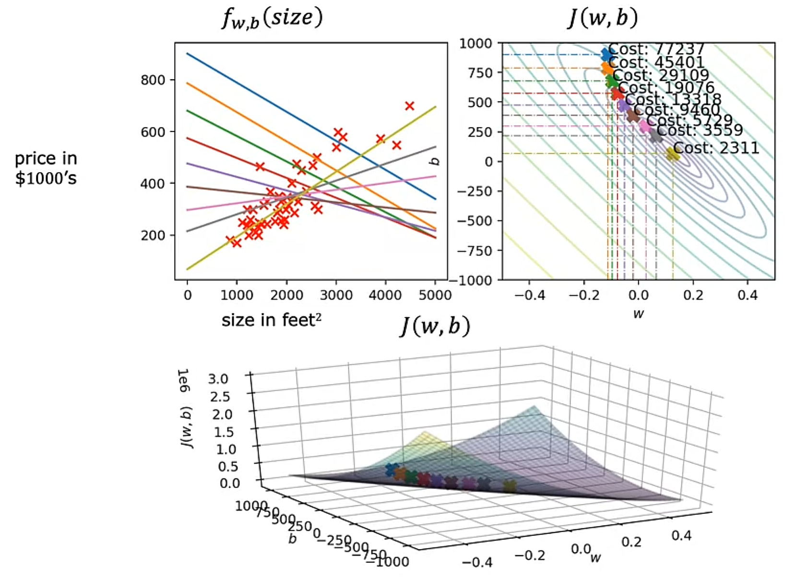

- This is how Gradient descent looks like when running it using multiple steps. 
- We can see how the straight line changes as we parameters w and b are being updated> Through every step, cost function J(w,b) is being minimized until it gets its smallest possible value. That is the minimum global for this model.
- Once the model is well trained, we can make some predictions in order to obtain, in this case, the price of a house.

## Batch gradient descent

- To be more precise, this Gradient descent process is called **Batch gradient descent**: The term batch gradient descent refers to the fact that on every step of the gradient descent we are looking at **all of the training examples**, instead of just a subset of the training data.

- There are other implementations of Gradient descent, but we are going to use the batch one for Linear Regression

## Optional Lab 4: Gradient descent