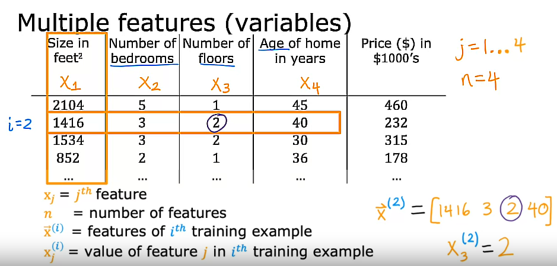
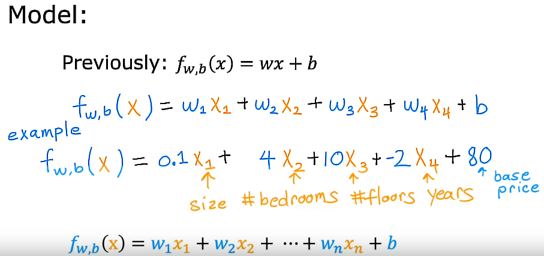
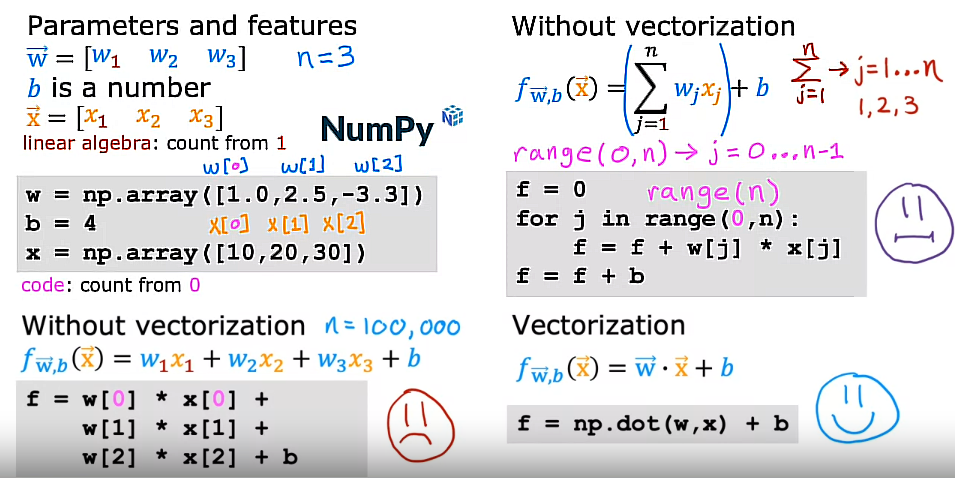
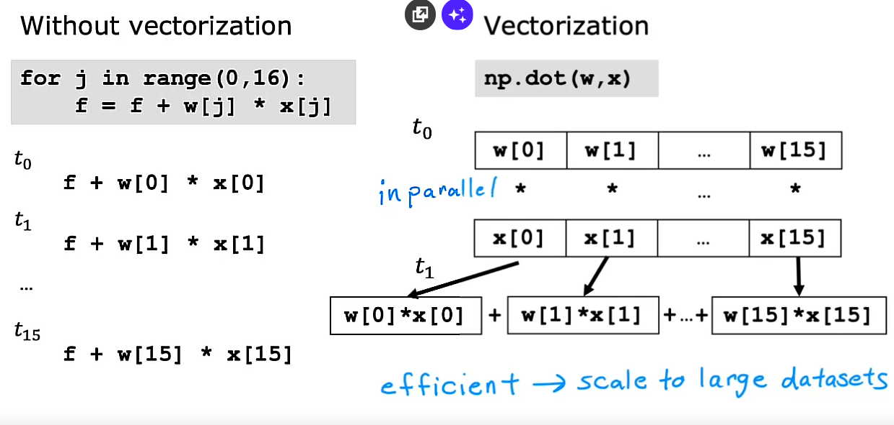
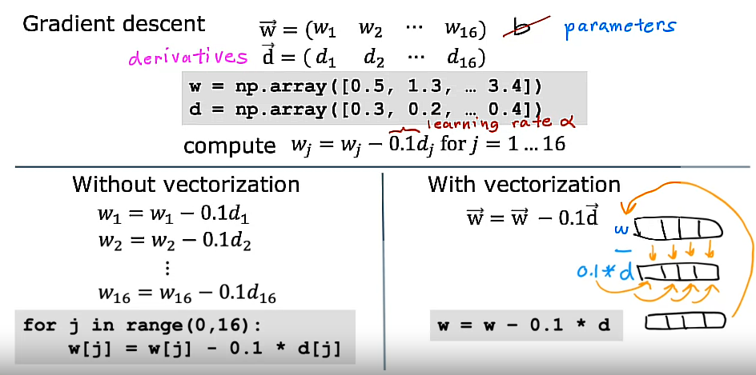
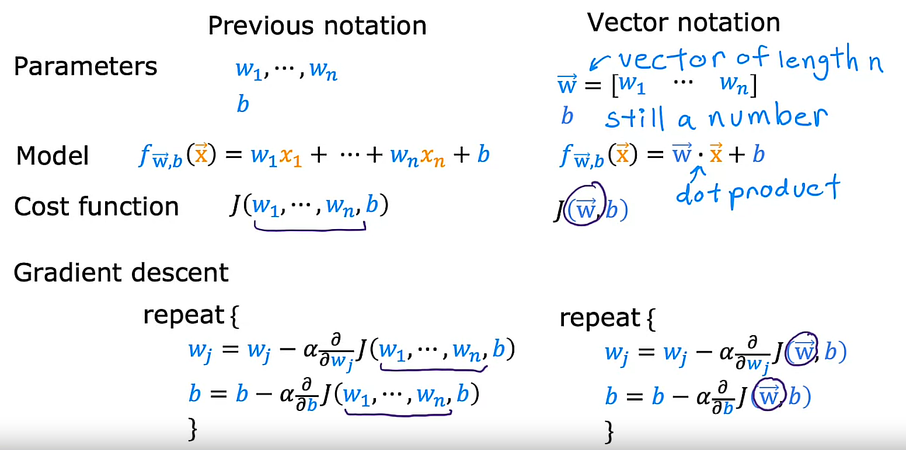
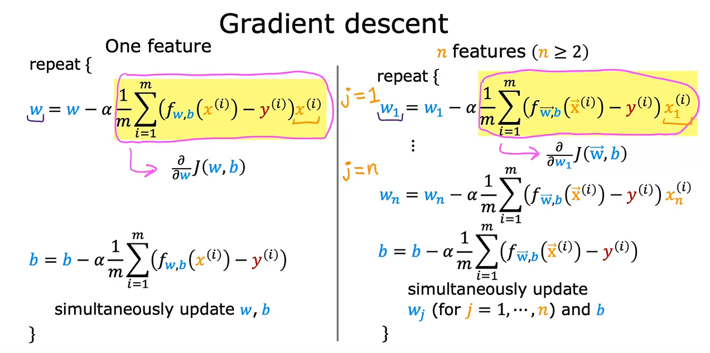

## Multiple features

## Multiple linear regression

If we would like to add more inputs to the Linear Regression model, then our function f(x) would follow this next expression:

$$ f_{\vec{w},b}(\vec{x}) = \vec{w} . \vec{x} + b = w_{1}x_{1} + w_{2}x_{2} + ... + w_{n}x_{n} + b$$

where

$$ {\vec{w}} = [w_{1} w_{2} ... w_{n}] $$ 

with *w* as a vector

$$ {\vec{x}} = [x_{1} x_{2} ... x_{n}] $$

with *x* as a vector

and *b* still a number

## Notation

* Instead of only having one input feature x representing the size of the house in squared feet, now we have more input features x like the number of bedrooms, number of floor and the age of the home. Our target is still the price of the house.

 
 Note: This model is called multiple linear regression. This is in contrast to univariate regression, which has just one feature, just like we learnt before.

 This is not called multivariate regression. This term refers to something else.

 ## Vectorization (Part 1)

 - When you are implementing a learning algorithm, using vectorization will both make (a) your code shorter and also (b) make it run much more efficiently.

- Learning how to write vectorized code will allow you to also take advantage of modern numerical linear algebra libraries, as well as maybe even GPU (Graphics Processing Unit) hardware. This is hardware objectively designed to speed up computer graphics in your computer, but it turns out that can be used when you write vectorized code to also help you execute your code much more quickly.

## Vectorization example

- Taking advantage of *Numpy* library, we can use *np.dot()* method to implement vectorization.

$$ f = np.dot(w,x) + b $$

- The reason that the vectorized implementation is much faster is, **behind the scenes**, the *NumPy dot()* function is able to use parallel hardware in your computer and this is true whether you're running this on a normal computer (that is on a normal computer CPU) or if you are using a GPU, a Graphics Processor Unit, that is often used to accelerate machine learning jobs.
- The ability of the NumPy dot function to use parallel hardware makes it much more efficient than the for loop or the sequential calculation shown in the following image:

 ## Vectorization (Part 2): *np.dot()* function behind the scenes

- The *without vectorization* method calculates these computations one step at a time, one step after another, 

- In contrast, using *vectorization* with *np.dot()* means you are implementing it in the computer hardware of the computer. The computer can get all the values of vectors w and x and in a single-step, it multiplies each pair of w and x with each other all at the same time in parallel. Then after that, the computer takes these 16 numbers and uses specialized hardware to add them altogether very efficiently rather than needing to carry out distinct additions one after another to add up these 16 numbers

- This means that codes with vectorization can perform calculations in much less time than in codes without vectorization.

- This matters more when you are running algorithms on large data sets or trying to train large models, which is often the case with Nachine Learning.

- That's why being able to vectorize implementations of learning algorithms, has been a key step to getting learning algorithms to run efficiently, and therefore scale well to large datasets that many modern machine learning algorithms now have to operate on.

## Optional lab 5: Python, NumPy and vectorization

- So, vectorization provides a large speed up in this example. This is because NumPy makes better use of available data parallelism in the underlying hardware. GPU's and modern CPU's implement Single Instruction, Multiple Data (SIMD) pipelines allowing multiple operations to be issued in parallel. This is critical in Machine Learning where the data sets are often very large.

## Gradient descent for multiple linear regression

### Recap

### Gradient descent for multiple regression

## An alternative way for finding w and b for Linear Regression: The Normal Equation

-  Whereas it turns out gradient descent is a great method for minimizing the cost function J to find w and b, there is one other algorithm that works only for Linear Regression and pretty much none of the other algorithms you see in this specialization for solving for w and b and this other method does not need an iterative gradient descent algorithm.

- Called the normal equation method, it turns out to be possible to use an advanced linear algebra library to just solve for w and b all in one goal without iterations

## Disadvantages of using the Normal Equation method

1) Unlike Gradient Descent, it **is not generalized to other learning algorithms**, such as the Logistic regression algorithm, the neural networks or other algorithms.

2) It is also **quite slow if the number of features is too large (>10 000)**: 

    Almost no Machine Learning practitioners should implement the Normal Equation method themselves but if you are using a mature Machine Learning library and call Linear Regression, there is a chance that on the backend, it will be using it to solve for w and b. 

    Some Machine Learning libraries may use this complicated method in the backeend to solve for *w* and *b*. But for most learning algorithms, including how you implement Linear Regression yourself, Gradient Descent offers a better way to get the job done.

## Optional lab 6: Multiple linear regression
