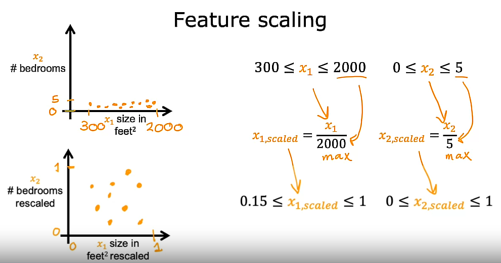

## Feature scaling (Part 1/2)

- Let's take a look at some techniques that make Gradient Descent work much better:

    In this case, we will see a technique called **Feature scaling** that will enable Gradient Descent to run much faster. 
    
    Let's start by taking a look at the relationship between the size of a feature that is how big are the numbers for that feature and the size of its associated parameter. 
    
    ## Example:
    
    As a concrete example, let's predict the price of a house using 2 features: $x_{1}$ (the size of the house) and $x_{2}$ (the number of bedrooms). Let's say that $x_{1}$ typically ranges from 300 to 2000 square feet and $x_{2}$ in the dataset ranges from 0 to 5 bedrooms. 
    
    So, for this example, $x_{1}$ takes on a relatively **large range of values** and $x_{2}$ takes on a relatively **small range of values**.
    
    Now, let's take an example of a house that has a size of 2000 square feet has 5 bedrooms and a price of 500k or $500,000 dollars. For this one training example, what do you think are reasonable values for the size of parameters $w_{1}$ and $w_{2}$? 
    
    Well, let's look at 2 possible set of parameters. 
    
    a) Say $w_{1}$ is 50 and $w_{2}$ is 0.1 and *b* is 50 for the purposes of discussion.

    - So, in this case, the estimated price, in thousands of dollars, is 100k or $100,000 dollars plus 0.5 k plus 50 k which is slightly over $100,000 dollars. So, that's clearly very far from the actual price of $500,000 dollars and so **this is not a very good set of parameter choices for $w_{1}$ and $w_{2}$**
    
    Now, let's take a look at the another possibility: 
    
    b) Say $w_{1}$ and $w_{2}$ were the other way around: $w_{1}$ is 0.1 and $w_{2}$ is 50 and *b* is still also 50. 
    
    - In this choice of $w_{1}$ and $w_{2}$, $w_{1}$ is relatively **small** and $w_{2}$ is relatively **large**: 50 is much bigger than 0.1. 
    
    So, here the predicted price is 0.1 times 2000 plus 50 times 5 plus 50: The first term becomes 200k, the second term becomes 250k and then plus 50. 
    
    **So, this version of the model predicts a price of $500,000 dollars which is a much more reasonable estimate and happens to be the same price as the true price of the house.**

    ## Conclusions

    1) So, hopefully you might notice that when a possible range of values of a feature is **large**, like the size in square feet (which goes all the way up to 2000), it is more likely that a good model will learn to choose a relatively **small** parameter value, like 0.1. 
    
    2) Likewise, when the possible values of the feature are **small**, like the number of bedrooms, then a reasonable value for its parameters will be relatively **large**, like 50. 

    
## Relating to Gradient Descent

- So how does this relate to Gradient Descent? Well, let's take a look at the *scatter plot* of the features where the size square feet is the horizontal axis $x_{1}$ and the number of bedrooms $x_{2}$ is on the vertical axis. If you plot the training data, you notice that the horizontal axis is on a much larger scale or much larger range of values compared to the vertical axis.

Next, let's look at how the cost function J(w, b) might look in a *contour plot*. You might see a *contour plot* where the horizontal axis has a much narrower range, say between 0 and 1, whereas the vertical axis takes on much larger values, say between 10 and 100. So, the contours form ovals or ellipses and they are short on one side and longer on the other. And this is because a very small change to $w_{1}$ can have a very large impact on the estimated price and that's a very large impact on the cost function J(w, b) because $w_{1}$ tends to be multiplied by a very large number, the size in square feet. 

    
In contrast, it takes a much larger change in $w_{2}$ in order to change the predictions much. And thus, small changes to $w_{2}$, don't change the cost function J(w, b) nearly as much. 

    
So, where does this leave us? This is what might end up happening if you were to run Gradient Descent, if you were to use your training data as is. Because the contours are so tall and skinny, Gradient Descent may end up **bouncing back and forth** for a long time before it can finally find **its way to the global minimum**. 
    
 

## Scaling the features

In situations like this, a useful thing to do is to **scale the features**: This means performing some transformation of your training data so that $x_{1}$ say might now range from 0 to 1 and $x_{2}$ might also range from 0 to 1. So, the data points now look more like the next image shown below and you might notice that the scale of the plot on the bottom is now quite different than the one on top. 

 
    
The key point is that the rescaled **$x_{1}$ and $x_{2}$ are both now taking comparable ranges of values to each other**. 

And if you run Gradient Descent on a cost function J(w, b) to find on this rescaled $x_{1}$ and $x_{2}$ using this transformed data, then the contours will look more like the next image shown below: more like circles and less tall and skinny and now, Gradient Descent can find a **much more direct path to the global minimum**.

 

## Recap

- So, to recap, when you have different features that take on very different ranges of values, it can cause Gradient Descent to run slowly but re scaling the different features so they all take on comparable range of values because speed up Gradient Descent significantly. How do you actually do this? Let's take a look at that in the next Part.

## Feature scaling (Part 2/2): 3 possible implementations

- Let's look at how you can implement Feature Scaling to take features that take on very different ranges of values and skill them to have comparable ranges of values to each other.

## 1. Using the maximum value of the range

- Basically, this implementation divides every value of a feature by the maximum value of the range

- It can be calculated applying the following formula:

$$
x_{1, scaled} = \frac{x_{1}}{max(x_{1})}
$$

## Example

- If a feature $x_{1}$ ranges from 3 to 2000

$$
3 \leq x_{1} \leq 2000
$$

One way to get a scaled version of $x_{1}$ is to take each original $x_{1}$ value and divide by 2000, the **maximum of the range**.

So, the scaled $x_{1, scaled}$ will range, in this case, from 0.15 up to 1

$$
0.15 \leq x_{1, scaled} \leq 1
$$

- Similarly, for another feature $x_{2}$, since $x_{2}$ ranges from 0 to 5

$$
0 \leq x_{2} \leq 5
$$

You can calculate a scaled version of $x_{2}$, denoted as $x_{2, scaled}$, by taking each original $x_{2}$ and dividing by 5, which is again the maximum value of this feature. 

So, the scaled feature $x_{2, scaled}$ will now range from 0 to 1. 

$$
0 \leq x_{2, scaled} \leq 1
$$

Now, if you plot the scaled versions, $x_{1, scaled}$ and $x_{2, scaled}$ on a graph it might look like the following image:

 

## 2. Using the mean normalization

- What this implementation means is to perform a re-scale of all of the features so that all of them are **centered around zero**

So, whereas in the previous implementation (dividing by the maximium value) they only had values greater than 0, now they have both negative and positive values that may be usually between -1 and +1. 

- So, to calculate the mean normalization of a feature $x_{1}$ we must find the average of it, also called the mean of $x_{1}$, on the training set. This is denoted as $\mu_{1}$, with this being the Greek alphabets $\mu$. 

## Example

You may find that the average of feature 1, $\mu_{1} = 600$ square feet. 

So, let's take each $x_{1}$, subtract the mean $\mu_{1}$, and then let's divide by the difference **maximum** minus **minimum**, which is 2000 minus 300, in this case. 

By doing this, you get the normalized $x_{1}$ to range from -0.18 to 0.82

$$
-0.18 \leq x_{1} \leq 0.82
$$

Similarly, to mean normalized $x_{2}$, you can calculate the average of feature 2. 

For instance, let say $\mu_{2} = 2.3$. Then, you can take each $x_{2}$, subtract $\mu_{2}$ and divide by 5 minus 0. Again, the max is 5 and 0 is the min. The mean normalized $x_{2}$ now ranges from -0.46 to 0.54

$$
-0.46 \leq x_{2} \leq 0.54
$$

If you plot the training data using the mean normalized $x_{1}$ and $x_{2}$, it might look like the image shown below:

 

## 3. Using the Z-score normalization

- To implement a Z-score normalization, you first need to calculate the mean $\mu$ as well as the standard deviation $\sigma$ of each feature.

- Then, to Z-score normalize a feature $x_{1}$, we can apply the next formula:

$$
x_{1} = \frac{x_{1} - \mu_{1}}{\sigma_{1}}
$$

## Example

### Calculating Z-score normalization for feature 1

For instance, maybe feature 1 $x_{1}$ has a standard deviation $\sigma_{1} = 450$ and mean $\mu_{1} = 600$

What you may find is that the Z-score normalized $x_{1}$ now ranges from -0.67 to 3.1

$$
-0.67 \leq x_{1} \leq 3.1
$$

### Calculating Z-score normalization for feature 2

Similarly, if you calculate the second feature's standard deviation $\sigma_{2} = 1.4$ and $\mu_{2} = 2.3$, then the Z-score normalized by $x_{2}$ might now range from -1.6 to 1.9

$$
-1.6 \leq x_{2} \leq 1.9
$$

If you plot the training data on the normalized $x_{1}$ and $x_{2}$ on a graph, it might look like the following image:

 

## Aim for Feature Scaling

As a rule of thumb, when performing Feature Scaling, you might want to aim for getting the features to range from maybe anywhere around -1 to somewhere around +1 for each feature x but these values, -1 and +1, can be a little bit loose. 

$$
-1 \leq x_{j} \leq 1 \; \text{for each feature}\; x_{j}
$$

## When to re-scale and when not

### No need for re-scaling

- If the features range from -3 to +3 or -0.3 to +0.3, all of these are completely OK.
- If you have a feature $x_{1}$ that winds up being between 0 and 3, that's not a problem: You can re-scale it if you want, but if you don't want to re-scale it, it should work okay too. 
- If you have a different feature, $x_{2}$, whose values are between -2 and +0.5: again, that's okay, no harm re-scaling it, but it might be okay if you leave it alone as well. 

### Re-scale needed

- If another feature, like $x_{3}$, ranges from -100 and +100, then this takes on a very different range of **too large values**, say something from around -1 to +1, you are probably better off re-scaling this feature $x_{3}$ so that it ranges from something closer to -1 to +1.
- Similarly, if you have a feature $x_{4}$ that takes on really small values, say between -0.001 and +0.001, then these **values are so small** which means you may want to re-scale it as well. 

- Finally, what if your feature $x_{5}$, such as measurements of a hospital patients by the temperature ranges from 98.6 to 105 degrees Fahrenheit? In this case, these values are around 100, which is actually **pretty large compared to other scale features**, and this will actually cause gradient descent to run more slowly. In this case, feature re-scaling will likely help. 

## Some advice on rescaling

There's almost never any harm to carrying out feature Re-scaling: When in doubt, I encourage you to just carry it out. 
With this little technique, you'll often be able to get gradient descent to run much faster.

## Next video

With or without Feature Scaling, when you run Gradient Descent, how can you check if Gradient Descent is really working? If it is finding you the global minimum or something close to it. In the next video, let's take a look at how to recognize if Gradient Descent is converging, and then in the video after that, this will lead to discussion of how to choose a good learning rate $\alpha$ for Gradient Descent.

## Checking Gradient Descent for convergence

When running Gradient Descent, how can you tell if it is converging? That is, whether it's helping you to find parameters close to the global minimum of the cost function J(w, b).

As a reminder, here's the Gradient Descent rule. One of the key choices is the choice of the learning rate alpha $\alpha$. Let's see 2 options to make sure that Gradient Descent is working well.

## Option 1: Analyze the Learning curve: A plot of J(w, b) vs number of iterations

- Recall that the job of Gradient Descent is to find parameters *w* and *b* that hopefully minimize the cost function J(w, b).

What I'll often do is plot the cost function J, which is calculated on the training set, and I plot the value of J(w, b) at each iteration of Gradient Descent. Remember that each iteration means after each simultaneous update of the parameters w and b. 

This curve is also called a learning curve. Note that there are a few different types of learning curves used in machine learning, and you see some of the types later in this course as well. 

From the image shown above, (a, pink color) if you look at the 1st point (pink color) on the curve, this means that after you have run Gradient Descent for 100 iterations meaning 100 simultaneous updates of the parameters, you have some learned values for w and b. If you compute the cost J(w, b) for those values of w and b, the ones you got after 100 iterations, you get a certain value for the cost function J(w, b). 

Also, we have this point (b, purple color) that corresponds to the value of J for the parameters that you got after 200 iterations of gradient descent. 

Looking at this graph helps you to see how your cost J changes after each iteration of gradient descent. We can see that the value for the cost function J(w, b) is decreasing more and more as we continue iterating this algorithm.

- If gradient descent is working properly, then the cost J(w, b) should **decrease after every single iteration**
- If the cost function J(w, b) ever increases after one iteration, that means either 
    - alpha $\alpha$ is chosen poorly (and it usually means alpha is too large)
    - Or there could be a bug in the code. 
    
Another useful thing that this part can tell you is that if you look at this curve, by the time you reach maybe 300 iterations also the cost function J(w, b) is leveling off and is no longer decreasing much. By 400 iterations, it looks like the curve has flattened out. This means that Gradient Descent has more or less **converged** because the curve is no longer decreasing. Looking at this learning curve, you can try to spot whether or not gradient descent is converging. 

Note: The number of iterations that Gradient Descent takes a conversion can vary a lot between different applications: In one application, it may converge after just 30 iterations. For a different application, it could take 1,000 or 100,000 iterations. It turns out to be very difficult to tell in advance how many iterations gradient descent needs to converge, which is why you can create a graph like this, a learning curve. Try to find out when you can start training your particular model. 

## Option 2: Automatic convergence test

Another way to decide when your model is done training is with an *automatic convergence test*.

Let's set epsilon $\epsilon$ to be a variable representing a small number, such as 0.001 or 10^-3. 

If the cost function J(w, b) decreases by less than this number epsilon $\epsilon$ on one iteration, then you're likely on this flattened part of the curve that you see on the previuos plot and you can declare **convergence**. 

Remember, convergence, hopefully in the case that you found parameters w and b that are close to the minimum possible value of J. 

I usually find that choosing the right threshold epsilon is pretty difficult. So, I actually tend to look at graphs like the one shown in the Option 1 rather than rely on automatic convergence tests (Option 2)

## Choosing the learning rate alpha $\alpha$

- Your learning algorithm will run much better with an appropriate choice of a learning rate alpha $\alpha$
- If it is too small: it will run very slowly and if it is too large: it may not even converge

Let's take a look at how you can choose a good learning rate alpha $\alpha$ for your model.

## Situation 1:

Concretely, if you plot the cost function J(w, b) for a number of iterations and notice that the costs sometimes goes up and sometimes goes down, you should take that as a clear sign that gradient descent is not working properly: This could mean that (a) there is a bug in the code or (a) sometimes it could mean that your learning rate alpha is too large.

So, here is an illustration of what might be happening: 

The vertical axis is a cost function J(w, b) and the horizontal axis represents a parameter like maybe $w_{1}$. If **the learning rate alpha $\alpha$ is too big**, then if you start off here, your update step may overshoot the minimum and end up here, and in the next update step here, your gain overshooting so you end up here and so on. That's why the cost can sometimes go up instead of decreasing. 

## How to fix it

To fix this, you can use a smaller learning rate. Then your updates may start here and go down a little bit and down a bit, and we will hopefully consistently decrease until it reaches the global minimum. 

## Situation 2:

- Sometimes you may see that the cost function J(w, b) consistently increases after each iteration, like the curve shown in the image below: 

This is also likely due to a **learning rate alpha $\alpha$ that is too large**

## How to fix it

It could be addressed by choosing a smaller learning rate alpha $\alpha$. But learning rates like this could also be a sign of a possible broken code:

For example, if I wrote my code so that $w_{1}$ gets updated as:

$$ w_{1} = w_{1} + \alpha * d_{1} $$

This could result in the cost consistently increasing at each iteration because having the derivative term moves your cost J further from the global minimum instead of closer. 

So remember, you want to use a minus sign, so the code should be updated as:

$$ w_{1} = w_{1} - \alpha * d_{1} $$

## Debugging tip for a correct implementation of Gradient Descent

One debugging tip for a correct implementation of gradient descent is that with a small enough learning rate $\alpha$, the cost function J(w, b) should decrease on every single iteration. 

So, if gradient descent isn't working, one thing I often do and I hope you find this tip useful too is just set $\alpha$ to be a very small number and see if that causes the cost to decrease on every iteration.

If even with $\alpha$ set to a very small number, the cost function J(w, b) does not decrease on every single iteration, but instead sometimes increases, then that usually means there is a bug somewhere in the code.

Note that setting alpha $\alpha$ to be really small is meant here as a debugging step and a very small value of alpha is not going to be the most efficient choice for actually training your learning algorithm. 

Note: One important trade-off is that if your learning rate is too small, then gradient descent can take a lot of iterations to converge. 

## Some values for $\alpha$ to try

So when I am running gradient descent, I will usually try a range of values for the learning rate alpha $\alpha$

So, I may start by trying a learning rate of 0.001 and I may also try learning rate as 10 times as large say 0.01 and 0.1 and so on. 

For each choice of Alpha, you might run gradient descent just for a handful of iterations and plot the cost function J as a function of the number of iterations and after trying a few different values, you might then pick the value of Alpha that seems to decrease the learning rate rapidly, but also consistently. 

In fact, what I actually do is try a range of values like this: After trying 0.001, I will then increase the learning rate 3 times to 0.003 and after that, I'll try 0.01, which is again about 3 times as large as 0.003. 

So, these are roughly trying out gradient descents with each value of Alpha being roughly three 3 bigger than the previous value. 

What I'll do is try a range of values until I found the value of that's too small and then also make sure I've found a value that's too large. I'll slowly try to pick the largest possible learning rate, or just something slightly smaller than the largest reasonable value that I found. 

When I do that, it usually gives me a good learning rate for my model. 

## Next video

Now, there are couple more ideas that you can use to make multiple linear regression much more powerful. That is choosing custom features, which will also allow you to fit curves, not just a straight line to your data. Let's take a look at that in the next video.