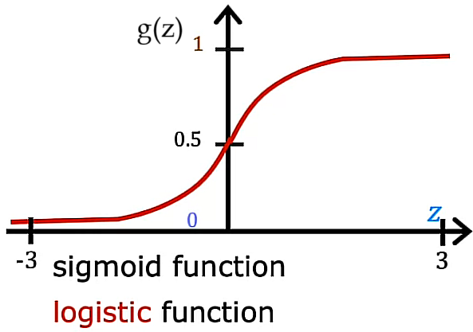
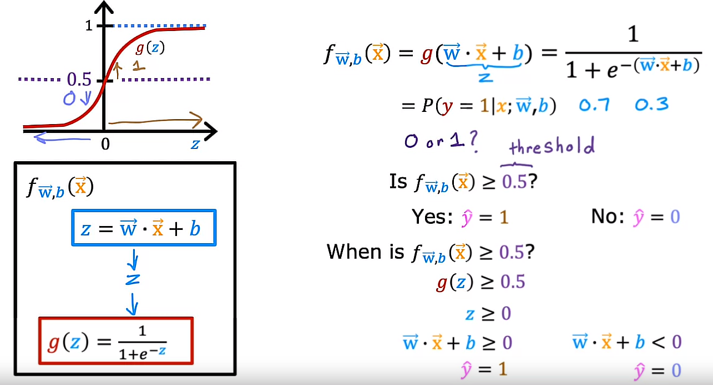
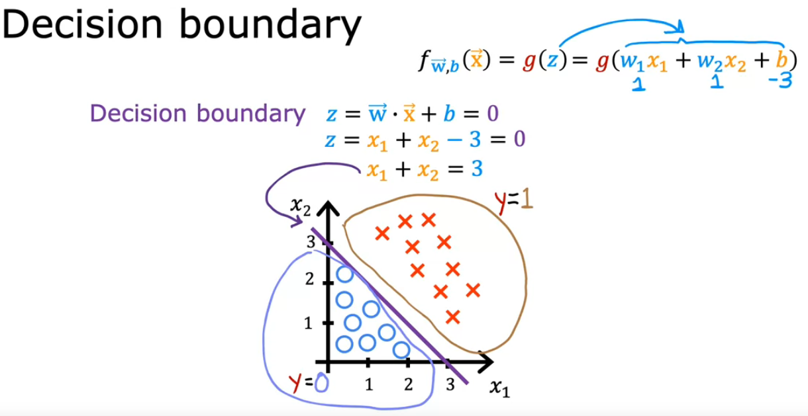
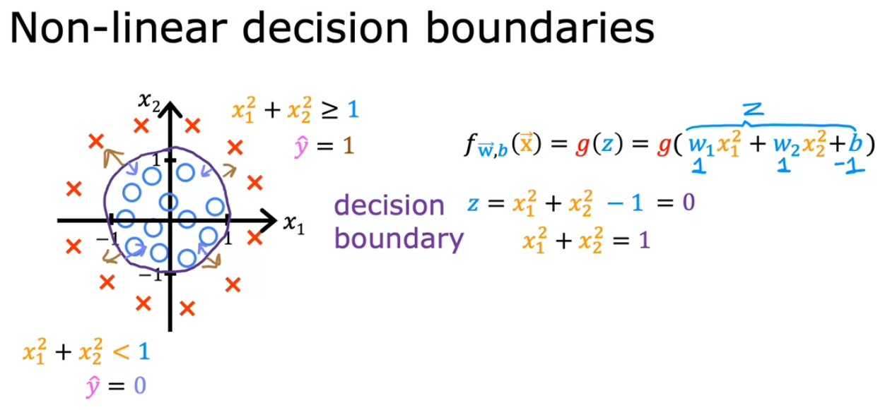
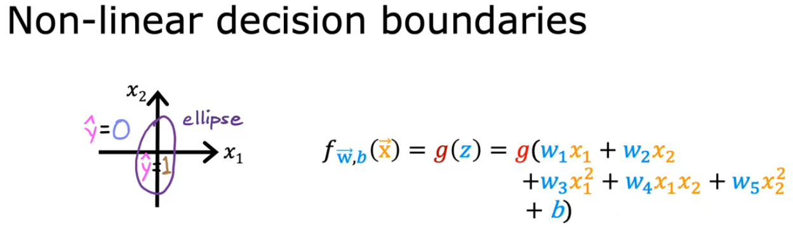
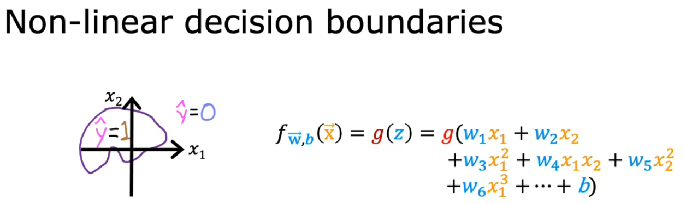

## Motivations

Last week you learned about Linear Regression, which predicts a number. 

This week, you will learn about Classification where the output variable *y* can take on only one of a small handful of possible values instead of any number in an infinite range of numbers. It turns out that Linear Regression is not a good algorithm for classification problems.

The type of classification problems where there are only 2 possible outputs is called binary classification where the word **binary** refers to there being only 2 possible classes/categories. 

In these problems I will use the terms *class* and *category* relatively interchangeably. They mean basically the same thing. By convention we can refer to these two classes or categories in a few common ways. 

We often designate clauses as *no* or *yes* or sometimes equivalently *false* or *true* or very commonly using the numbers 0 or 1 following the common convention in Computer Science with 0 denoting false and 1 denoting true. 

One of the terminologies commonly used is to call the false or 0 class the negative class and the true or the 1 class, the positive class. 

For example, for spam classification, an email that is not spam may be referred to as a negative example because the output to the question of "Is this email a spam?" the output is no or 0.

In contrast, an email that has spam might be referred to as a positive training example because the answer to is it spam is yes or true or 1. 

To be clear, negative and positive. Do not necessarily mean bad vs good or evil vs good. It's just that negative and positive examples are used to convey the concepts of absence or zero or false vs the presence or true or one of something you might be looking for. 

Logistic Regression is an algorithm where the output value of the outcome will always be between 0 and 1. 

By the way, one thing confusing about the name Logistic Regression is that even though it has the word of Regression in it is actually used for Classification problems. Don't be confused by the name which was given for historical reasons. It's actually used to solve binary classification problems with output label *y* is either 0 or 1.

## Optional Lab 10 - Classification

## Logistic Regression

### Sigmoid function/Logistic function

* It outputs values between 0 and 1

* We can use *g(z)* to define the Sigmoid function as follows:

$$ g(z) = \frac{1}{1 + e^{-z}} $$

where 0 < g(z) < 1

- In case *z* is a large positive number, then g(z) $\approx$ 1
- In case *z* is a large negative number, then g(z) $\approx$ 0
- In case *z=0*, then g(z)=0.5

### Building the Logistic Regression algorithm (Step 1/2)

We define *z* as follows:

$$ z = \vec{w}.\vec{x} + b $$

The Logistic Regression model is defined as:

$$ f_{\vec{w}, b}(\vec{x}) = g(z) = g(\vec{w}.\vec{x} + b) = \frac{1}{1 + e^{-(\vec{w}.\vec{x} + b)}} $$

What the Logistic Regression model is it inputs inputs a set of features $ \vec{X} $ and outputs a number between 0 and 1

### Interpretation of Logistic Regression output

We can think of Logistic Regression's output by thinking of it as outputting the probability that the class or the label *y* will be equal to 1 given a certain input x

### Example

Considering *x* is the tumor size and *y* is either 0 or 1, if you have a patient come in and he/she has a tumor of a certain size x, and if based on this input x, the model outputs 0.7, then what that means is that the model is predicting/the model thinks there's a 70 percent chance that the true label *y* would be equal to 1 for this patient. In other words, the model is telling us that it thinks the patient has a 70 percent chance of the tumor turning out to be malignant

So, in this case, what is the chance of *y* being equal to 0? Well, 30 % chance due to 

$$ P(y=0) + P(y=1) = 1 $$

### Notation

$$ f_{\vec{w}, b}(\vec{x}) = P(y=1 | \vec{x}; \vec{w}, b) $$

We can read it as *"the probability that y is 1, given the input feature X with parameters w and b"*

## Optional lab 11: Sigmoid function and logistic regression

## Decision boundary

Given we know that

$$ f_{\vec{w}, b}(\vec{x}) = P(y=1 | \vec{x}; \vec{w}, b) $$

outputs a number like maybe a 0.7 or 0.3 we would like to the algorithm learn to predict if the value of *y* is going to be 0 or 1? 

Well, one thing you might do is set a **threshold** above which you predict y is 1, or you set $ \hat{y} $ to prediction to be equal to 1 and below which you might say $ \hat{y} $, the prediction, is going to be equal to 0.

A common choice would be to pick a **threshold of 0.5**  so that:

a) If $ f_{\vec{w}, b}(\vec{x}) >= 0.5 $, then predict y is 1. We write that prediction as $ \hat{y} = 1 $

b) If $ f_{\vec{w}, b}(\vec{x}) < 0.5 $, then predict y is 0, or in other words, the prediction $ \hat{y} = 0 $

So, when is $ f_{\vec{w}, b}(\vec{x}) >= 0.5 ? $
$$ g(z) >= 0.5 $$
$$ z >= 0 $$
$$ \vec{w}.\vec{x} + b >= 0 $$
$$ \hat{y} = 1 $$

Conversely, when is $ f_{\vec{w}, b}(\vec{x}) < 0.5 ? $
$$ g(z) < 0.5 $$
$$ z < 0 $$
$$ \vec{w}.\vec{x} + b < 0 $$
$$ \hat{y} = 0 $$

### Decision boundary

It is represented as follows:

$$ z = \vec{w}.\vec{x} + b = 0 $$

It a situation where we it is neutral about whether $ y=0 $ or $ y=1 $

### Linear decision boundary

### Non-linear decision boundary: Circle

### Non-linear decision boundary: Ellipse

### Non-linear decision boundary: A more complex decision boundary

 With polynomial features, you can get very complex decision boundaries. In other words, Logistic Regression can learn to fit pretty complex data

 ## Optional lab 12: Decision boundary