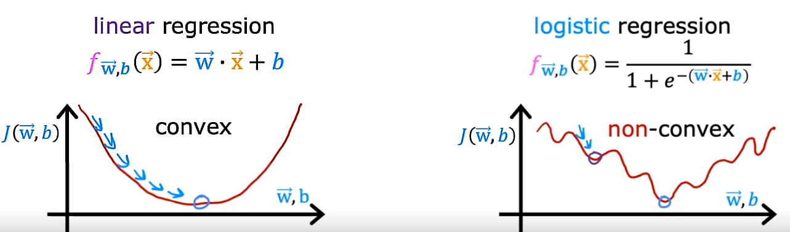
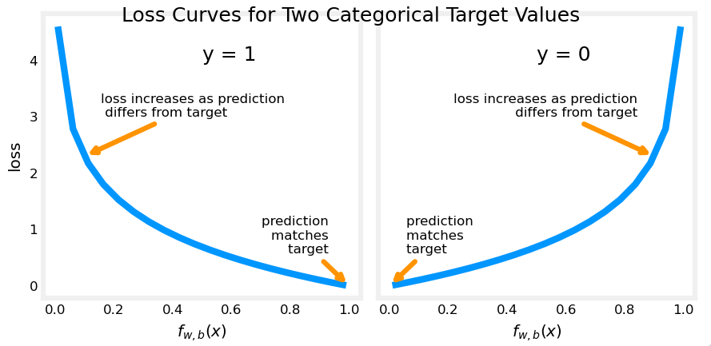

## Cost function for logistic regression

We need to remember that the cost function gives you a way to measure how well a specific set of parameters fits the training data and thereby gives you a way to try to choose better parameters.

## The need to find a new Cost function J(w, b)
The squared error cost function (previously used in Linear Regression) is not an ideal cost function for Logistic Regression due to the non-linear nature of the model that results in a “wiggly”, non-convex cost function with many potential local minima.

## The new cost function J(w, b) and a new concept: Loss L

In order to build a new Cost function J(w, b) to be used in Logistic Regression, we are going to use the previously defined Cost function J(w, b) used in Linear Regression but changing a little bit its definition:

We define a new concept as the Loss L on a single training example:

$$L(f_{\vec{w}, b}(\vec{x}^{(i)}), y^{(i)}) = \frac{1}{2}(f_{\vec{w}, b}(\vec{x}^{(i)}) - y^{(i)})^2$$

Of course, the Loss L is a function of the **prediction $f_{\vec{w}, b}(\vec{x}^{(i)})$** of the learning algorithm as well as the **true label y**

The new cost function J(w, b) is defined as:

$$J(\vec{w}, b) = \frac{1}{m} \sum\limits_{i=1}^{m}L$$
$$J(\vec{w}, b) = \frac{1}{m} \sum\limits_{i=1}^{m}L(f_{\vec{w}, b}(\vec{x}^{(i)}), y^{(i)})$$
$$J(\vec{w}, b) = \frac{1}{m} \sum\limits_{i=1}^{m}\frac{1}{2}(f_{\vec{w}, b}(\vec{x}^{(i)}) - y^{(i)})^2$$

The Loss function L tell us how well we are doing on that example.

> Note: The Loss function *L* is applied to each training example. Instead, the Cost function *J(w, b)* is applied to the entire dataset in order to get a measure of how well we are doing.

## Definition of the Loss function L used in Logistic Regression

$$L(f_{\vec{w}, b}(\vec{x}^{(i)}), y^{(i)}) = 
     \begin{cases}
       \text{-log(}f_{\vec{w}, b}(\vec{x}^{(i)})\text{)} &\quad\text{if }y^{(i)}=1 \\
       \text{-log(1-}f_{\vec{w}, b}(\vec{x}^{(i)})\text{)} &\quad\text{if }y^{(i)}=0 \\
     \end{cases}$$

## Why does this definition of the Loss function L makes sense?

a) Let's consider the case of $y^{(i)}=1$ and plot what this function looks like:

*f* is the output of the logistic regression, thus, it is always between 0 and 1

* If the algorithm predicts a probability close to 1 and the true label is 1, then the loss is very small (It is pretty much 0): We are very close to the answer

* If the algorithm predicts 0.5 and the true label is 1, then the loss is higher but not that high

* If the algorithm predicts 0.1 (there is only 10% chance of the tumor being malignant) but y is 1 (It is really malignant), then the loss is much higher

> Note: So, when $y^{(i)}=1$, the loss function L incentivizes/nurtures/helps push the algorithm to make more accurate predictions because the loss is lowest when it predicts values close to 1.

b) Now, let's consider the case of $y^{(i)}=0$ and plot what this function looks like:

* If $f_{\vec{w}, b}(\vec{x}^{(i)})$ is 0 or very close to 0, the loss L is also going to be a very small which means that if the true label is 0 and the model's prediction is very close to 0, well we nearly got it right, so the loss is appropriately very close to 0.

* The larger the value of $f_{\vec{w}, b}(\vec{x}^{(i)})$ gets, the bigger the Loss L because the prediction is further from the true label 0.In fact, as that prediction approaches 1, the loss actually approaches infinity

Going back to the tumor prediction example this says if the model predicts that the patient's tumor is almost certain to be malignant, say, 99.9 percent chance of malignancy, that turns out to actually not be malignant, so y equals 0 then we penalize the model with a very high loss.

> Note: The further the prediction $f_{\vec{w}, b}(\vec{x}^{(i)})$ is away from the true value of the target $y^{(i)}$, the higher the loss L.

In fact, if $f_{\vec{w}, b}(\vec{x}^{(i)})$ approaches 0, the loss L actually goes really large and in fact approaches infinity

When the true label is 1 ($y^{(i)}=1$), the algorithm is strongly incentivized not to predict something to0 close to 0

## Recap

With this choice of Loss function L, the overall cost function will be convex and thus we can reliably use Gradient Descent to take us to the global minimum

Proving that this function is convex, it is beyond the scope of this course

You may remember that the cost function J(w, b) is a function of the entire training set and is, therefore, the average or 1 over m times the sum of the loss function L on the individual training examples. 

So, the cost on a certain set of parameters, w and b, is equal to 1 over m times the sum of all the training examples of the loss on the training examples. If you can find the value of the parameters, w and b, that minimizes the cost function J, then you'd have a pretty good set of values for the parameters w and b for logistic regression

## Optional Lab 13: Logistic loss