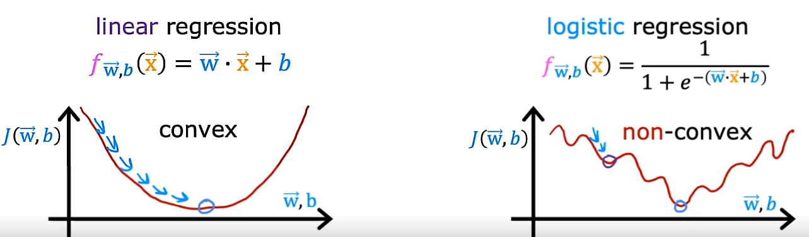
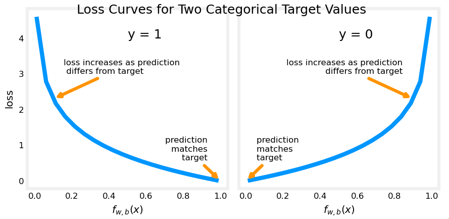
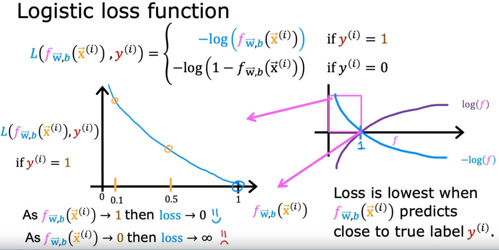
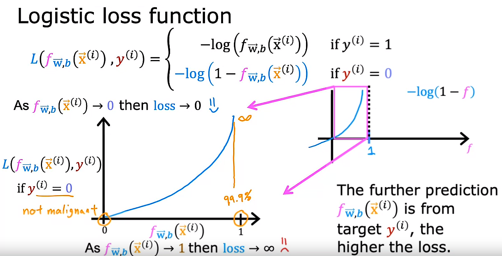
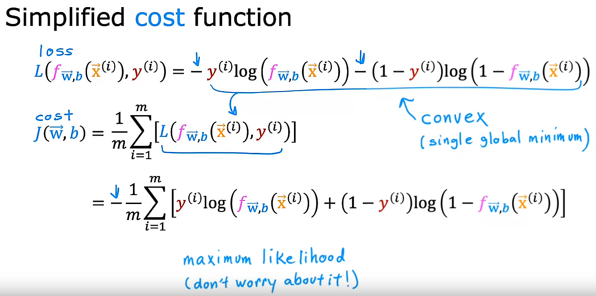

## Cost function for logistic regression

We need to remember that the cost function J(W, b) gives you a way to measure how well a specific set of parameters fits the training data and thereby gives you a way to try to choose better parameters.

## Recalling Squared Error Cost Function for Linear Regression

Recall for **Linear** Regression we have used the **squared error cost function**:
The equation for the squared error cost with one variable is:
  $$J(w,b) = \frac{1}{2m} \sum\limits_{i = 0}^{m-1} (f_{w,b}(x^{(i)}) - y^{(i)})^2 \tag{1}$$ 
 
where 
  $$f_{w,b}(x^{(i)}) = wx^{(i)} + b \tag{2}$$

Recall, the squared error cost had the nice property that following the derivative of the cost leads to the minimum.

## The need to find a new Cost function J(w, b)
The squared error cost function (previously used in Linear Regression) is not an ideal cost function for Logistic Regression due to the non-linear nature of the model that results in a “wiggly”, non-convex cost function with many potential local minima.

That cost function J(w, b) worked well for linear regression: It is natural to consider it for logistic regression as well. However, $f_{wb}(x)$ now has a non-linear component, the sigmoid function:   $f_{w,b}(x^{(i)}) = sigmoid(wx^{(i)} + b )$

## The new cost function J(w, b) and a new concept: Loss L

Logistic regression requires a cost function more suitable to its non-linear nature. This starts with a Loss function

In order to build a new Cost function J(w, b) to be used in Logistic Regression, we are going to need the previously defined Linear Regression's Cost function J(w, b) and need to change a little bit its definition:

Recall the Linear Regression's Cost function J(w, b):

$$J(w,b) = \frac{1}{2m} \sum\limits_{i = 1}^{m} (f_{w,b}(x^{(i)}) - y^{(i)})^2 $$

Changing it a little bit:

$$J(w,b) = \frac{1}{m} \sum\limits_{i = 1}^{m} \frac{1}{2}(f_{w,b}(x^{(i)}) - y^{(i)})^2 $$

We define a new concept as the Loss L on a single training example:

$$L(f_{\vec{w}, b}(\vec{x}^{(i)}), y^{(i)}) = \frac{1}{2}(f_{\vec{w}, b}(\vec{x}^{(i)}) - y^{(i)})^2$$

Of course, the Loss L is a function of the **prediction $f_{\vec{w}, b}(\vec{x}^{(i)})$** of the learning algorithm as well as the **true label y**

The new cost function J(w, b) is defined as:

$$J(\vec{w}, b) = \frac{1}{m} \sum\limits_{i=1}^{m}L$$

$$J(\vec{w}, b) = \frac{1}{m} \sum\limits_{i=1}^{m}L(f_{\vec{w}, b}(\vec{x}^{(i)}), y^{(i)})$$

$$J(\vec{w}, b) = \frac{1}{m} \sum\limits_{i=1}^{m}\frac{1}{2}(f_{\vec{w}, b}(\vec{x}^{(i)}) - y^{(i)})^2$$

The Loss function L tell us how well we are doing on that example.

> Note: The Loss function *L* is applied to each training example. Instead, the Cost function *J(w, b)* is applied to the entire dataset in order to get a measure of how well we are doing.

> **Definition Note:**   In this course, these definitions are used:  
**Loss** is a measure of the difference of a single example to its target value while the  
**Cost** is a measure of the losses over the training set

## Definition of the Loss function L used in Logistic Regression

$$\begin{equation}
  \text{Loss L}(f_{\mathbf{w},b}(\mathbf{x}^{(i)}), y^{(i)}) = \begin{cases}
    - \log\left(f_{\mathbf{w},b}\left( \mathbf{x}^{(i)} \right) \right) & \text{if $y^{(i)}=1$}\\
    - \log \left( 1 - f_{\mathbf{w},b}\left( \mathbf{x}^{(i)} \right) \right) & \text{if $y^{(i)}=0$}
  \end{cases}
\end{equation}$$

*  $f_{\mathbf{w},b}(\mathbf{x}^{(i)})$ is the model's prediction, while $y^{(i)}$ is the target value.

*  $f_{\mathbf{w},b}(\mathbf{x}^{(i)}) = g(\mathbf{w} \cdot\mathbf{x}^{(i)}+b)$ where function $g$ is the sigmoid function.

The defining feature of this loss function L is the fact that it uses 2 separate curves: One for the case when the target is zero ($y=0$) and another for when the target is one ($y=1$). Combined, these curves provide the behavior useful for a loss function, namely, being zero when the prediction matches the target and rapidly increasing in value as the prediction differs from the target.

Consider the curves below:

## Why does this definition of the Loss function L makes sense?

a) Let's consider the case of $y^{(i)}=1$ and plot what this function looks like:

*f* is the output of the logistic regression, thus, it is always between 0 and 1

* If the algorithm predicts a probability close to 1 and the true label is 1, then the loss is very small (It is pretty much 0): We are very close to the answer

* If the algorithm predicts 0.5 and the true label is 1, then the loss is higher but not that high

* If the algorithm predicts 0.1 (there is only 10% chance of the tumor being malignant) but y is 1 (It is really malignant), then the loss is much higher

> Note: So, when $y^{(i)}=1$, the loss function L incentivizes/nurtures/helps push the algorithm to make more accurate predictions because the loss is lowest when it predicts values close to 1.

b) Now, let's consider the case of $y^{(i)}=0$ and plot what this function looks like:

* If $f_{\vec{w}, b}(\vec{x}^{(i)})$ is 0 or very close to 0, the loss L is also going to be a very small which means that if the true label is 0 and the model's prediction is very close to 0, well we nearly got it right, so the loss is appropriately very close to 0.

* The larger the value of $f_{\vec{w}, b}(\vec{x}^{(i)})$ gets, the bigger the Loss L because the prediction is further from the true label 0.In fact, as that prediction approaches 1, the loss actually approaches infinity

Going back to the tumor prediction example this says if the model predicts that the patient's tumor is almost certain to be malignant, say, 99.9 percent chance of malignancy, that turns out to actually not be malignant, so y equals 0 then we penalize the model with a very high loss.

> Note: The further the prediction $f_{\vec{w}, b}(\vec{x}^{(i)})$ is away from the true value of the target $y^{(i)}$, the higher the loss L.

In fact, if $f_{\vec{w}, b}(\vec{x}^{(i)})$ approaches 0, the loss L actually goes really large and in fact approaches infinity

When the true label is 1 ($y^{(i)}=1$), the algorithm is strongly incentivized not to predict something to0 close to 0

## Recap

With this choice of Loss function L, the overall cost function will be convex and thus we can reliably use Gradient Descent to take us to the global minimum

Proving that this function is convex, it is beyond the scope of this course

You may remember that the cost function J(w, b) is a function of the entire training set and is, therefore, the average or 1 over m times the sum of the loss function L on the individual training examples. 

So, the cost on a certain set of parameters, w and b, is equal to 1 over m times the sum of all the training examples of the loss on the training examples. If you can find the value of the parameters, w and b, that minimizes the cost function J, then you'd have a pretty good set of values for the parameters w and b for logistic regression

## Optional Lab 13: Logistic loss

## Simplified Cost Function for Logistic Regression

We have defined the Loss function L as follows:

* $\text{Loss L}(f_{\mathbf{w},b}(\mathbf{x}^{(i)}), y^{(i)})$ is the cost for a single data point, which is:

$$\begin{equation}
  \text{Loss L}(f_{\mathbf{w},b}(\mathbf{x}^{(i)}), y^{(i)}) = 
  \begin{cases}
    - \log\left(f_{\mathbf{w},b}\left( \mathbf{x}^{(i)} \right) \right) & \text{if $y^{(i)}=1$}\\
    - \log \left( 1 - f_{\mathbf{w},b}\left( \mathbf{x}^{(i)} \right) \right) & \text{if $y^{(i)}=0$}
  \end{cases}
\end{equation}$$

where
*  $f_{\mathbf{w},b}(\mathbf{x}^{(i)})$ is the model's prediction, while $y^{(i)}$ is the target value.

*  $f_{\mathbf{w},b}(\mathbf{x}^{(i)}) = g(\mathbf{w} \cdot\mathbf{x}^{(i)}+b)$ where function $g$ is the sigmoid function.

We can have the Loss function L rewritten in an equivalent manner to be easier to implement in code

  $$\text{Loss L}(f_{\mathbf{w},b}(\mathbf{x}^{(i)}), y^{(i)}) = -y^{(i)} \log\left(f_{\mathbf{w},b}\left( \mathbf{x}^{(i)} \right) \right) - \left( 1 - y^{(i)}\right) \log \left( 1 - f_{\mathbf{w},b}\left( \mathbf{x}^{(i)} \right) \right)$$

If $y^{(i)}=1$, then:

$$L(f_{\mathbf{w},b}(\mathbf{x}^{(i)}), y^{(i)}) = - \log\left(f_{\mathbf{w},b}\left( \mathbf{x}^{(i)} \right) \right)$$

If $y^{(i)}=0$, then:

$$L(f_{\mathbf{w},b}(\mathbf{x}^{(i)}), y^{(i)}) = - \log \left( 1 - f_{\mathbf{w},b}\left( \mathbf{x}^{(i)} \right) \right)$$

Recall the cost function J(w, b) is defined as:

$$J(\vec{w}, b) = \frac{1}{m} \sum\limits_{i=1}^{m}L(f_{\vec{w}, b}(\vec{x}^{(i)}), y^{(i)})$$

Combining both Loss function L and the Cost function J(w, b) we have:

$$J(\vec{w}, b) = -\frac{1}{m} \sum\limits_{i=1}^{m}[y^{(i)} \log\left(f_{\mathbf{w},b}\left( \mathbf{x}^{(i)} \right) \right) + \left( 1 - y^{(i)}\right)\log \left( 1 - f_{\mathbf{w},b}\left( \mathbf{x}^{(i)} \right) \right) ]$$

And this is the cost function that pretty much everyone uses to train Logistic Regression.

You might be wondering, why do we choose this particular function when there could be tons of other costs functions we could have chosen? Although we won't have time to go into great detail on this in this class, I'd just like to mention that this particular cost function is derived from **statistics** using a **statistical principle called maximum likelihood estimation**, which is an idea from statistics on how to efficiently find parameters for different models. This cost function has the nice property that it is **convex**

## Optional lab 14: Cost function for logistic regression