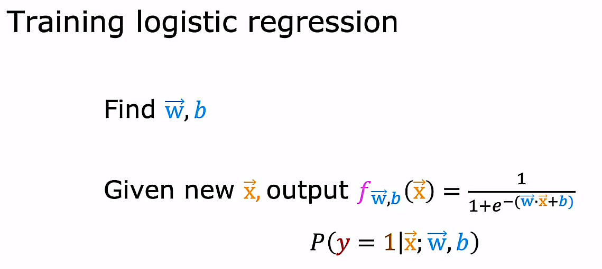
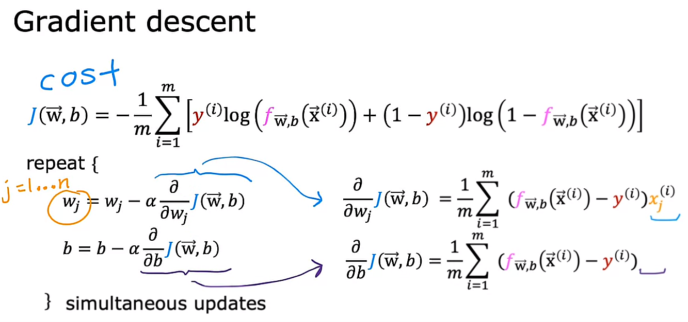
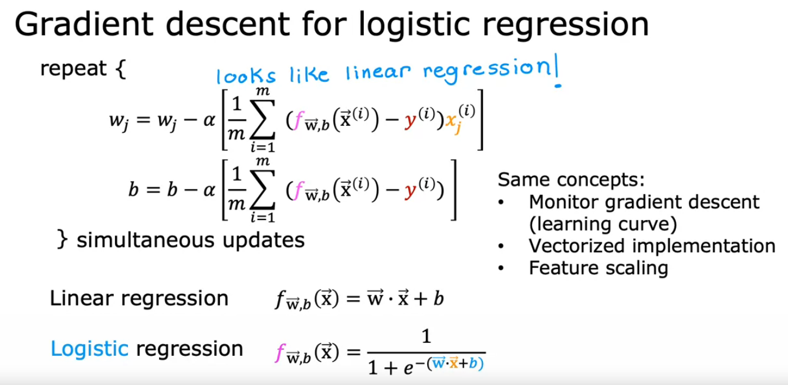

## Gradient Descent Implementation

To fit the parameters of a Logistic Regression model, we are going to try to find the values of the parameters *w* and *b* that minimize the cost function J(w, b) and we will again apply Gradient Descent to do this. 

## Gradient descent

## Almost same logic for the gradient descent

Even though the equations look the same for both Linear and Logistic Regression, there is huge difference between them. This is, the definition of the f(x) function is not the same. 

## [Optional Lab 15 - Gradient descent for logistic regression](./Optional%20Lab%2015%20-%20Gradient%20descent%20for%20logistic%20regression/)

## [Optional Lab 16 - Logistic regression with scikit-learn](./Optional%20Lab%2016%20-%20Logistic%20regression%20with%20scikit-learn/)