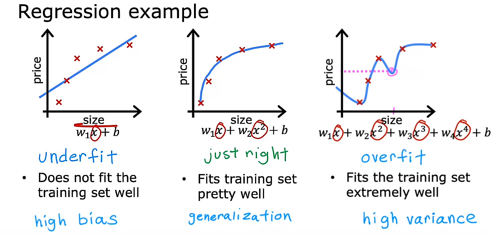
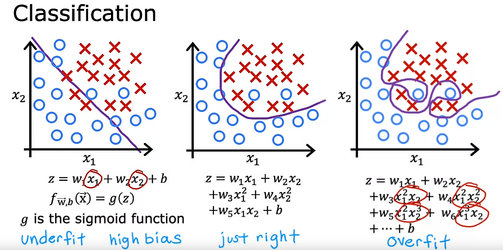
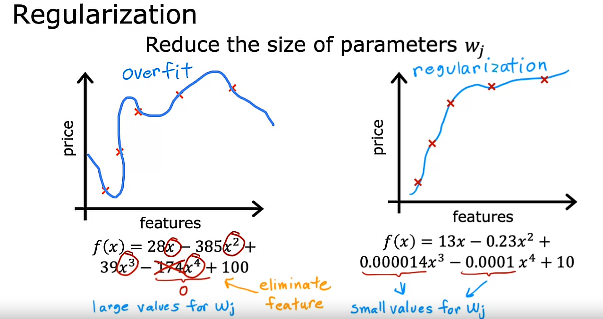
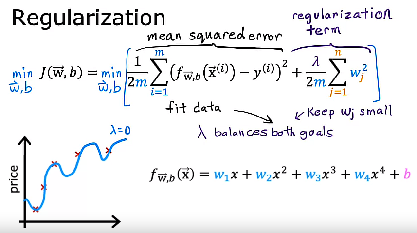
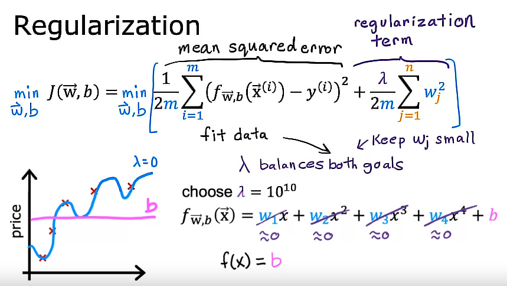
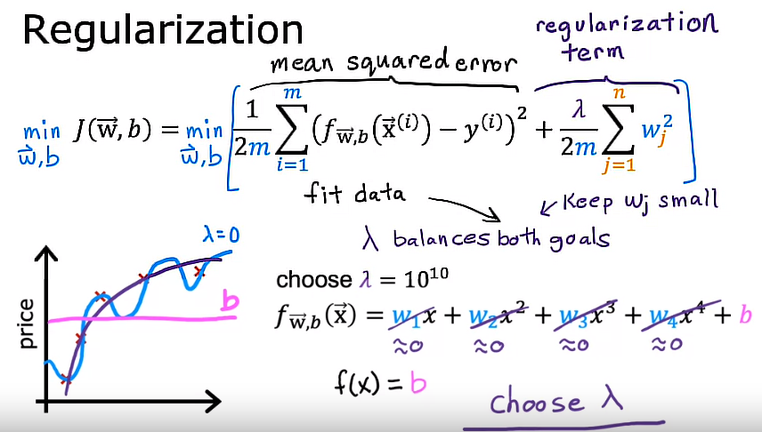
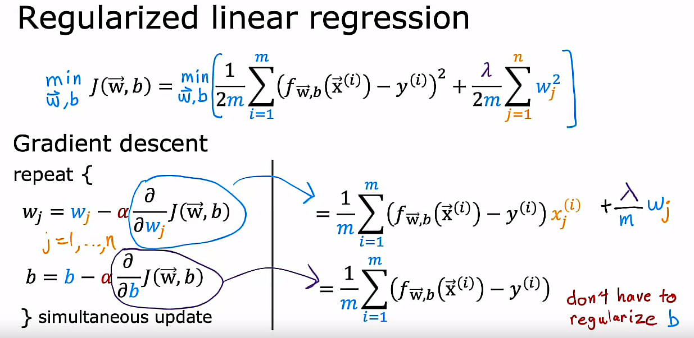
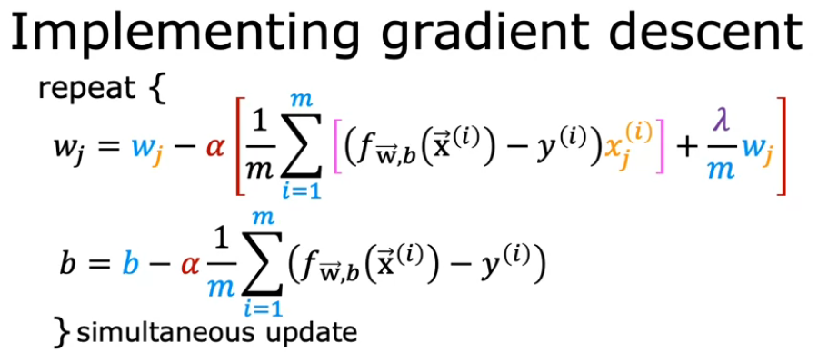
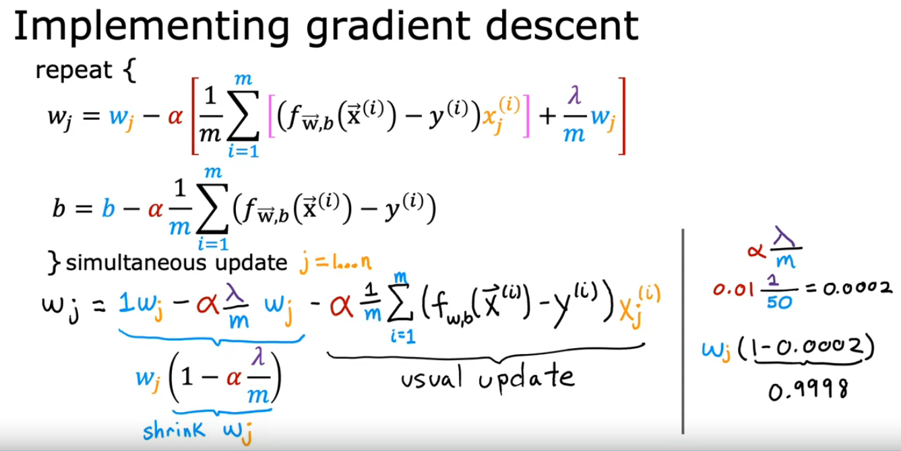
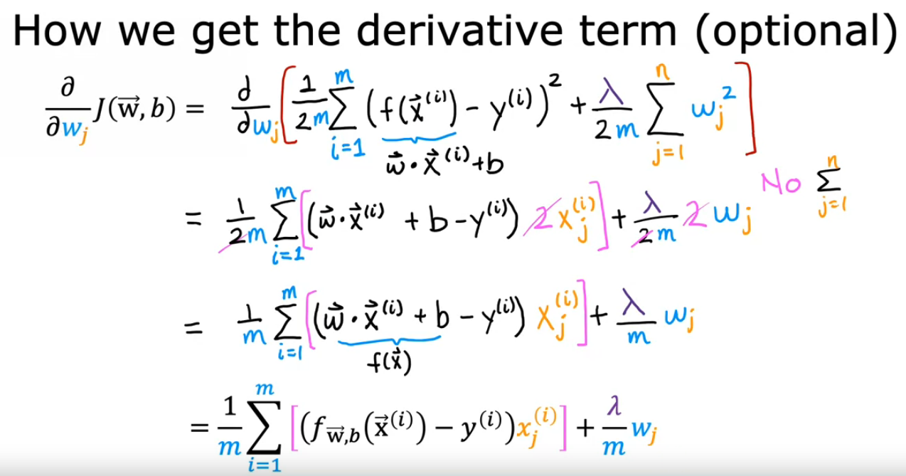

## The problem of overfitting

Sometimes in an application, Logistic Regression can run into a problem called *overfitting*, which can cause it to perform poorly.

Our goal when creating a model is to be able to use the model to predict outcomes correctly for new examples. A model which does this is said to generalize well. 

When a model fits the training data well but does not work well with new examples that are not in the training set we say this is an example of Overfitting (high variance)

## Overfitting (high variance)

Overfitting occurs when a model learns the training data too well, capturing noise or random fluctuations that are not representative of the true underlying pattern in the data. This can lead to poor performance on new, unseen data because the model's learned behavior is too specific to the training examples.

The intuition behind overfitting or high-variance is that the algorithm is trying very hard to fit every single training example. It turns out that if your training set were just even a little bit different, then the function that the algorithm fits could end up being totally different.

If two different machine learning engineers were to fit this fourth-order polynomial model, to just slightly different datasets, they couldn't end up with totally different predictions or highly variable predictions. That's why we say the algorithm has high variance.

## Underfitting (high bias)

Underfitting, on the other hand, happens when a model is too simple to capture the underlying structure of the data. It fails to learn the patterns in the training data and performs poorly both on the training set and on new data. This often occurs when the model is too basic or lacks the capacity to represent the complexity of the data.

## Generalization (just right: there is neither underfit nor overfit)

Generalization refers to the ability of a model to perform well on new, unseen data that it hasn't been trained on. A model that generalizes well is able to make accurate predictions or classifications on examples it hasn't encountered before. Generalization is a desirable property in machine learning, as it indicates that the model has learned the underlying patterns in the data rather than just memorizing the training examples.

## Underfitting, Generalization and Overfitting for Regression

## Underfitting, Generalization and Overfitting for Classification

## Addressing overfitting

There are some ways in order to addressing overfitting:

## 1. Collect more data

One way to address this problem is to collect more training data: If the training set is larger, then the learning algorithm will learn to fit a function that is less wiggly.

Disadvantage: The problem may be that getting more data is not always an option

## 2. Feature selection

A second option for addressing overfitting is to see if you can use fewer features:

It turns out that if you have a lot of features but don't have enough training data, then your learning algorithm may also overfit to your training set.

Now, instead of using all features, if could pick just a subset of the most useful and relevant ones. By doing it,you may find that your model no longer overfits as badly. Choosing the most appropriate set of features to use is sometimes also called Feature selection. 

Disadvantage: One disadvantage of Feature Selection is that by using only a subset of the features, the algorithm is throwing away some of the information that you have about the houses

Note: Later in Course 2, you will also see some algorithms for automatically choosing the most appropriate set of features to use for our prediction task

## 3. Regularization

Regularization is a way to more gently reduce the impacts of some of the features without doing something as harsh as eliminating it outright. What regularization does is encourage the learning algorithm to shrink the values of the parameters without necessarily demanding that the parameter is set to exactly 0.

So what regularization does is it lets you keep all of your features, but they just prevents the features from having an overly large effect, which is what sometimes can cause overfitting. By the way, by convention, we normally just reduce the size of the $w_{j}$ parameters, that is $w_{1}$ through $w_{n}$. It doesn't make a huge difference whether you regularize the parameter *b* as well, you could do so if you want or not if you don't. In practice, it should make very little difference whether you also regularize b or not

This is a very useful technique for training learning algorithms including neural networks specifically.

Example:

It turns out that even if you fit a higher order polynomial the shown in the image below, so long as you can get the algorithm to use smaller parameter values: $w_{1}$, $w_{2}$, $w_{3}$, $w_{4}$ you end up with a curve that ends up fitting the training data much better.

## Optional lab 17: Overfitting

## Cost function with regularization

regularization tries to make the parameter values $w_{1}$ through $w_{n}$ small in order to reduce overfitting

The idea behind regularization is that if there are smaller values for the parameters, then that's a bit like having a simpler model, maybe one with fewer features which is less prone to overfitting

The way regularization tends to be implemented is to penalize all of the features, or more precisely, penalize all the $w_{j}$ parameters.

It is possible to show that this will usually result in fitting a smoother, simpler, less wiggly function prone to overfit.

So, we penalize all of the features a bit and shrink all of them by adding a new term to the cost function J(w, b). This new term includes the Greek alphabet lambda $\lambda$ resulting in the following expression:

$$J(w,b) = \frac{1}{2m}\sum\limits_{i = 1}^{m} (f_{w,b}(x^{(i)}) - y^{(i)})^2+\frac{\lambda}{2m}\sum\limits_{j = 1}^{n}w_{j}^2$$ 

where 

* lambda $\lambda$: Greek alphabet. It is called a regularization parameter. $\lambda > 0$

Similar to picking a learning rate $\alpha$, now we also have to choose a number for lambda $\lambda$

By convention, we also divide lambda $\lambda$ by *2m*, so both the first and the second term in the cost function J(w, b) equation are scaled by $\frac{1}{2m}$.
It turns out that by scaling both terms the same way, it becomes a little bit easier to choose a good value for lambda $\lambda$.

In particular, you will find that even if your training set size growths (say you find more training examples), so m, the training set size is bigger, the same value of lambda $\lambda$ that you have previously picked is also more likely to continue to work if you have this extra scaling by *2m*

Also, by the way, by convention we are not going to penalize the parameter *b* for being large. In practice, it makes very little difference whether you do or not

And some machine learning engineers and actually some learning algorithm implementations will also include lambda over 2m times the b squared term but this makes very little difference in practice and the more common convention is to regularize only the parameters *w* rather than the parameter *b*.

$$J(w,b) = \frac{1}{2m}[\sum\limits_{i = 1}^{m} (f_{w,b}(x^{(i)}) - y^{(i)})^2 + \frac{\lambda}{2m}\sum\limits_{j = 1}^{n}w_{j}^2 + \frac{\lambda}{2m}b^2]$$ 

>Note: Again, this cost function J(w, b) that also regularizes the parameter *b* is not commonly used in ML

## Summary

So, to summarize:

In this modified cost function

$$J(w,b) = \frac{1}{2m}\sum\limits_{i = 1}^{m} (f_{w,b}(x^{(i)}) - y^{(i)})^2+\frac{\lambda}{2m}\sum\limits_{j = 1}^{n}w_{j}^2$$ 

we want to minimize the original cost, which is the mean squared error cost plus additionally, the second term which is called the regularization term. 

$$min_{w, b} J(w,b) = min_{w, b}[\frac{1}{2m}\sum\limits_{i = 1}^{m} (f_{w,b}(x^{(i)}) - y^{(i)})^2+\frac{\lambda}{2m}\sum\limits_{j = 1}^{n}w_{j}^2]$$ 

And so this new cost function trades off 2 goals that you might have. 

1. Trying to minimize the first term encourages the algorithm to fit the training data well by minimizing the squared differences of the predictions and the actual values.

2. And about to try to minimize the second term: The algorithm also tries to keep the parameters $w_{j}$ small, which will tend to reduce overfitting.

>Note: The value of lambda $\lambda$ that you choose specifies the relative importance or the relative trade off or how you balance between these two goals.

## Analyzing lambda $\lambda$ values 

Let's take a look at what different values of lambda $\lambda$ will cause your learning algorithm to do. 

For it, let's use the housing price prediction example using linear regression.
So, $f(x)$ is the linear regression model. 

### 1st case: $\lambda=0$

If lambda was set to be 0, then you would not be using the regularization term at all because the regularization term is multiplied by 0. And so if lambda was 0, you end up fitting the overly wiggly, overly complex curve and it **overfits**. So that was one extreme of if lambda was 0. 

### 2nd case: $\lambda=\text{large number}$

Let's now look at the other extreme. If you said lambda to be a really, really, really large number, say lambda equals 10 to the power of 10. In this case, you are placing a very heavy weight on the regularization term. And the only way to minimize this is to be sure that all the values of w are pretty much very close to 0. 
So if lambda is very, very large, the learning algorithm will choose $w_{1}$, $w_{2}$, $w_{3}$ and $w_{4}$ to be extremely close to 0 and thus $f(x)$ is basically equal to *b* and so the learning algorithm fits a horizontal straight line and **underfits**. 

To recap:

>Note: If lambda is 0, this model will **overfit** 

>Note: If lambda is enormous like 10 to the power of 10, this model will **underfit**

And so what you want is some value of lambda that is in between that more appropriately balances these first and second terms of trading off, minimizing the mean squared error and keeping the parameters small. 

### 3rd case: $\lambda=\text{a not too small and not too large number}$

And when the value of lambda is not too small and not too large, but just right, then hopefully you end up able to fit a 4th order polynomial, keeping all of these features, but with a function that looks like the image below:

For a model that includes the regularization parameter $\lambda$, increasing its value reduces overfitting by reducing the size of the parameters $w_{n}$. For some parameters that are near zero, this reduces the effect of the associated features.

## Regularized linear regression

So, let's implement Gradient Descent for Linear Regression using a regularization term:

We need to remember that we are going to regularize only the $w_{j}$ parameters. 
We are not going to regularize the parameter *b*. So, the only changes are applied to the derivative of the cost function J over $w_{j}$ as shown in the image below:

So, the final gradient descent implementation looks like the following image shown below:

Parameters $w_{j}$

$$w_{j} = w_{j} -  \alpha \frac{\partial J(w,b)}{\partial w_{j}}$$

Derivative term of the cost function J(w, b) over $w_{j}$ without regularization:

$$\frac{\partial J(w,b)}{\partial w_{j}} = \frac{1}{m} \sum\limits_{i = 1}^{m} (f_{w,b}(x^{(i)}) - y^{(i)})x_{j}^{(i)}$$

Derivative term of the cost function J(w, b) over $w_{j}$ applying regularization:

$$\frac{\partial J(w,b)}{\partial w_{j}} = \frac{1}{m}\sum\limits_{i = 1}^{m}[(f_{w,b}(x^{(i)}) - y^{(i)})x_{j}^{(i)}]+\frac{\lambda}{m}w_{j}$$

So, the final $w_{j}$ parameters for a regularized Linear Regression model are defined as follows:

$$w_{j}=w_{j} - \alpha [\frac{1}{m}\sum\limits_{i = 1}^{m}[(f_{w,b}(x^{(i)}) - y^{(i)})x_{j}^{(i)}]+\frac{\lambda}{m}w_{j}] \text{ for j=1..n}$$

## (Optional) A deeper intuition on what this $w_{j}$ formula is actually doing
### 1. Another view on why regularization has an effect of shrinking the parameters $w_{j}$

As can be seen above, after operating the expression for the $w_{j}$ parameters, we can observe that every $w_{j}$ parameter is being affected by a factor.

This factor, when there is no regularization applied ($\lambda$=0), does not make any change on every $w_{j}$ parameter. 

But instead, when the regularization is being applied through the lambda $\lambda$ parameter ($\lambda$!=0), it shrinks every $w_{j}$ parameter by making them smaller due to this factor is always a number minor than 1. It is minor than 1 because alpha $\alpha$, lambda $\lambda$ and *m* (the amount of training examples) are always positive numbers.
What I mean is that, in this case, every $w_{j}$ parameter is going to be multiplied by factor which is a number greather than 0 and minor than 1. That makes every $w_{j}$ parameter smaller.

$$w_{j}=w_{j}(1-\alpha\frac{\lambda}{m}) - \alpha \frac{1}{m}\sum\limits_{i = 1}^{m}(f_{w,b}(x^{(i)}) - y^{(i)})x_{j}^{(i)} \text{ for j=1..n}$$

### 2. How these derivatives are derived

This is why this expression is used to compute the gradient in regularized linear regression

## Regularized logistic regression

