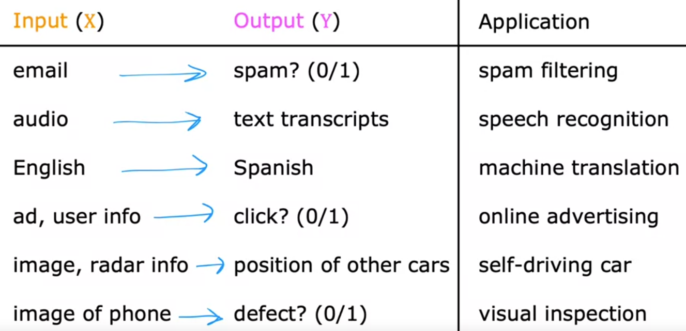

# Introduction

# What is Machine Learning?

> Field of study that gives computers the ability to learn without being explicitly programmed.
>
> -- <cite>Arthur Samuel (1959)</cite>

## Brief information about Arthur Samuel

- Arthur Lee Samuel (December 5, 1901 – July 29, 1990) was an American pioneer in the field of computer gaming and artificial intelligence. He popularized the term "machine learning" in 1959. 

- The Samuel Checkers-playing Program was among the world's first successful self-learning programs, and as such a very early demonstration of the fundamental concept of artificial intelligence (AI).

- He was also a senior member in the TeX community who devoted much time giving personal attention to the needs of users and wrote an early TeX manual in 1983.

Source: *[Wikipedia](https://en.wikipedia.org/wiki/Arthur_Samuel_(computer_scientist))*

- Samuel's claim to fame was that back in the 1950s: He wrote a checkers playing program. 

- The amazing thing about this program was that Arthur Samuel himself wasn't a very good checkers player. What he did was he had programmed the computer to play maybe tens of thousands of games against itself. 

- And by watching what social support positions tend to lead to wins and what positions tend to lead to losses the checkers plane program learned over time what are good or bad suport position.

- By trying to get a good and avoid bad positions, this program learned to get better and better at playing checkers.

- Because the computer had the patience to play tens of thousands of games against itself it was able to get so much checkers playing experience that eventually it became a better checkers player than also Samuel himself. 

Source: *Andrew Ng, Coursera ML Specialization*

## Machine Learning algorithms

1) Supervised learning
    - It is the type of ML that is used most in many real-world applications and has seen the most rapid advancements and innovation.
    - 1st and 2nd courses in this specialization focus in this type
2) Unsupervised learning
    - 3rd course in this specialization focus in this type

3) Recommender systems
    - Widely used nowadays

4) Reinforcement learning

## Important advice by the instructor

> The other thing we are going to spend a lot of time on in this specialization is practical advice for applying learning algorithms.
This is something I feel pretty strongly about. Teaching about learning algorithms is like giving someone a set of tools and equally important, so even more important to making sure you have great tools is making sure you know how to apply them because like is it is somewhere where it gives you a state-of-the-art hammer or a state-of-the-art hand drill and say good luck: Now you have all the tools you need to build a three-story house. It doesn't really work like that. And so too, in machine learning, making sure you have the tools is really important and so is making sure that you know how to apply the tools of machine learning effectively. So, that's what you get in this class, the tools as well as the skills to apply them effectively.
>
> -- <cite>Andrew Ng</cite>

## 1. Supervised Learning

Machine learning is creating tremendous economic value today. I think 99 percent of the economic value created by machine learning today is through one type of machine learning, which is called supervised learning.

- Supervised machine learning or more commonly, supervised learning, refers to algorithms that learn x to y or input to output mappings. 

- The key characteristic of supervised learning is that you give your learning algorithm examples to learn from

- That includes the right answers, whereby right answer, I mean, the correct label y for a given input x, and is by seeing correct pairs of input x and desired output label y that the learning algorithm eventually learns to take just the input alone without the output label and gives a reasonably accurate prediction or guess of the output

#### Some applications of Supervised Learning:

