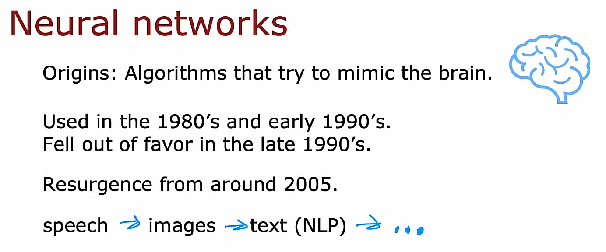

## Welcome

### Topics for this 2nd course

In this course, you'll learn about **neural networks, also called deep learning algorithms**, as well as **decision trees**. These are some of the most powerful and widely used machine learning algorithms and you'd get to implement them and get them to work for yourself. 

Also, one of the things you see in this course is **practical advice on how to build machine learning systems**. This part of the material is quite unique to this course.   When you're building a practical machine learning system, there are a lot of decisions you have to make such as should you spend more time collecting data or should you buy a much bigger GPU to build a much bigger neural network? 
With some of the tips that you learn in this course, I hope you to be able to make more systematic and better decisions about how to build practical working machine learning applications.

### Week 1 summary

In Week 1, we'll go over neural networks and how to carry out inference or prediction. If you were to go to the Internet and download the parameters of a neural network that someone else had trained and whose parameters that posted on the Internet, then to use that neural network to make predictions would be called inference, and you learned how neural networks work, and how to do inference in this week. 

### Week 2 summary

In Week 2, you'll learn how to train your own neural network. In particular, if you have a training set of labeled examples, X and Y, how do you train the parameters of a neural network for yourself? 

### Week 3 summary

In Week 3, we'll then go into practical advice for building machine learning systems and I'll share with you some tips that I think even highly paid engineers building machine learning systems very successfully today don't really always manage to consistently apply and I think that will help you build systems yourself efficiently and quickly. 

### Week 4 summary

Then, in the final week of this course, you learn about decision trees. While decision trees don't get as much buzz in the media, there's local less hype about decision trees compared to neural networks. They are also one of the widely used and very powerful learning algorithms that I think there's a good chance you end up using yourself if you end up building an application. With that, let's jump into neural networks and we're going to start by taking a quick look at how the human brain, that is how the biological brain works

## Neurons and the brain

## Demand Prediction

## Example: Recognizing Images

## Forum

[DeepLearning.AI Community](https://community.deeplearning.ai)

