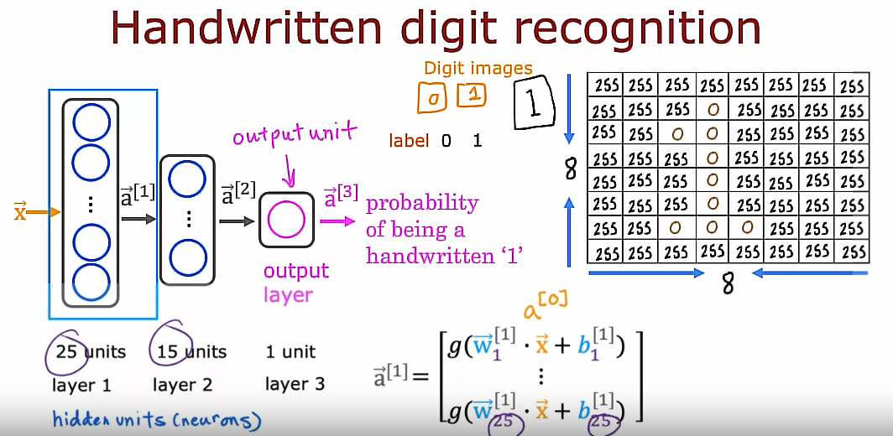

## Neural network layer

Superscript notation denotes the *layer number*

Subscript notation denotes the *neuron number*

Every layer inputs a vector of numbers and applies a bunch of logistic regression units to it, and then computes another vector of numbers that then gets passed from layer to layer until you get to the final output layers computation, which is the prediction of the neural network. Then you can either threshold at 0.5 or not to come up with the final prediction

## More complex neural networks

In the above example, we say this neural network has 4 layers: 3 hidden layers and the final output layer: We don't count the input layer

### Quiz: Fill all of the superscripts and subscripts for Layer 3, unit 2

### General notation for layers and units

In the context of a neural network, g has another name which is also called the *activation function* because g outputs this activation value. When I say activation function, I mean this function g here. So far, the only activation function you've seen, this is a sigmoid function but next week, we'll look at when other functions, then the sigmoid function can be plugged in place of g as well.

The activation function is just that function that outputs these activation values.

## Inference: making predictions (forward propagation)

Neural network inference using the forward propagation algorithm

### Computing $\vec{a}^{[1]}$

### Computing $\vec{a}^{[2]}$

### Computing $\vec{a}^{[3]}$

### Forward propagation algorithm

It is called forward propagation because we are propagating the activations of the neurons (making computations) in the forward direction from left to right. 

This is in contrast to a different algorithm called back/backward propagation which is used for learning

This type of neural network architecture where you have more hidden units initially and then the number of hidden units decreases as you get closer to the output layer, it is also a pretty typical choice when choosing neural network architectures

## Optional Lab 1: Neurons and Layers
