## TensorFlow implementation: Inference in Code

### Example 1: Making inference for coffee roasting (Problem description)

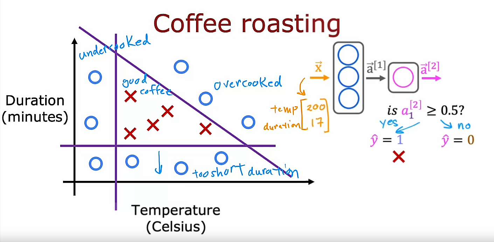

### Example 1: Making inference for coffee roasting (TensorFlow implementation)

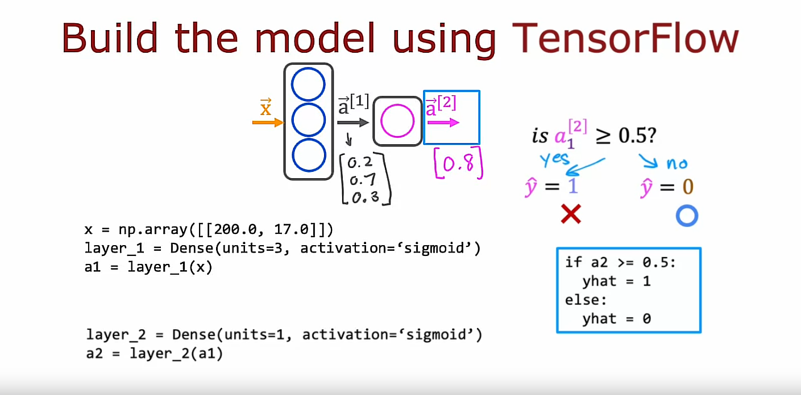

*Dense* is another name for the layers of a sneural network. There are other type of layers as well (covered later on the course)

> Note: That's how you do inference in the neural network using TensorFlow. There are some additional details that I didn't go over here, such as how to load the TensorFlow library and how to also load the parameters *w* and *b* of the neural network (we'll go over that in the lab)

These are the key steps for forward propagation in how you compute a1 and a2 and optionally, threshold a2

### Example 2: Making inference for the previous digit classification (TensorFlow implementation)

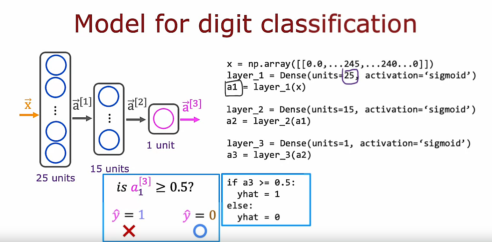

In this example, $\vec{X}$ is numpy array meaning a list of the pixel intensity values

> Note: One thing I briefly alluded to is the structure of the numpy arrays. TensorFlow treats data in a certain way that is important to get right. In the next video, let's take a look at how TensorFlow handles data.

## Data in TensorFlow

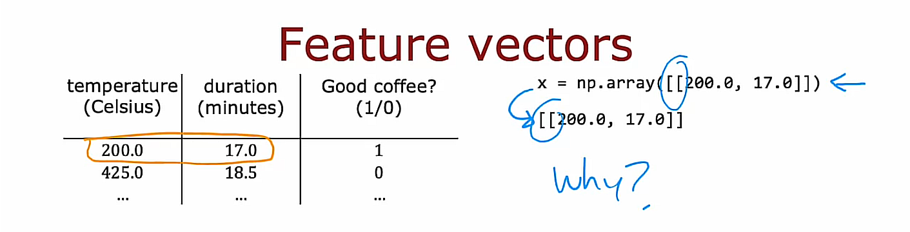

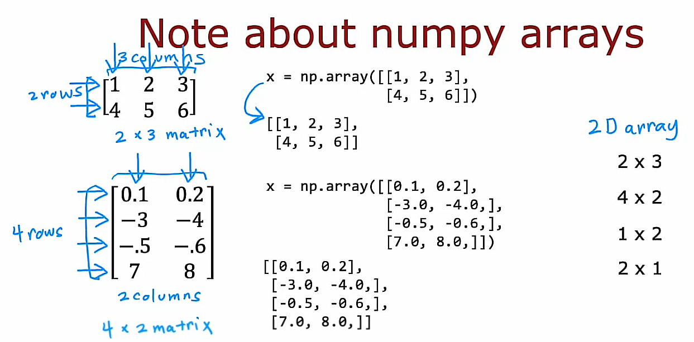

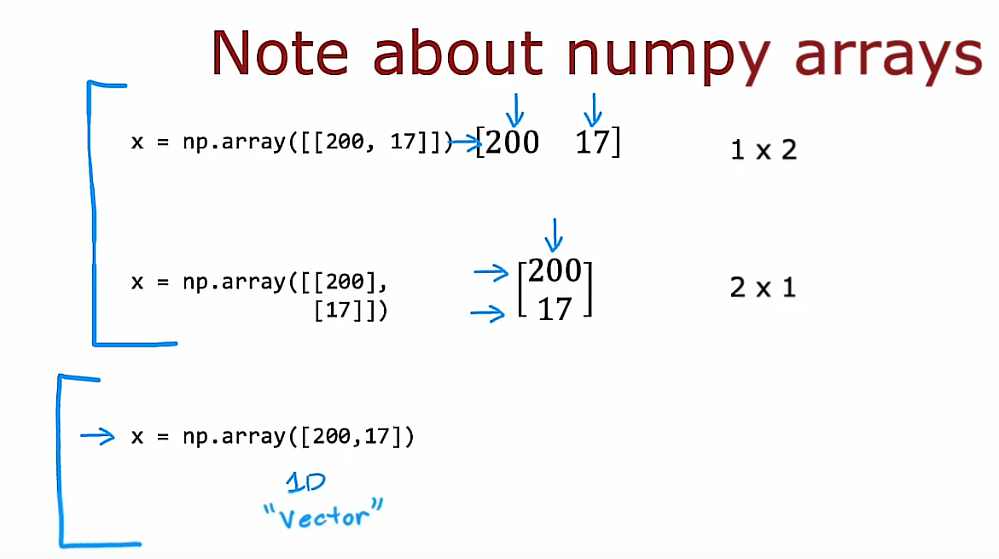

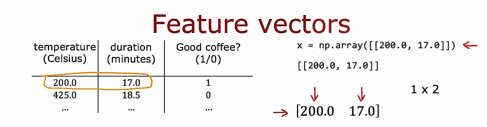

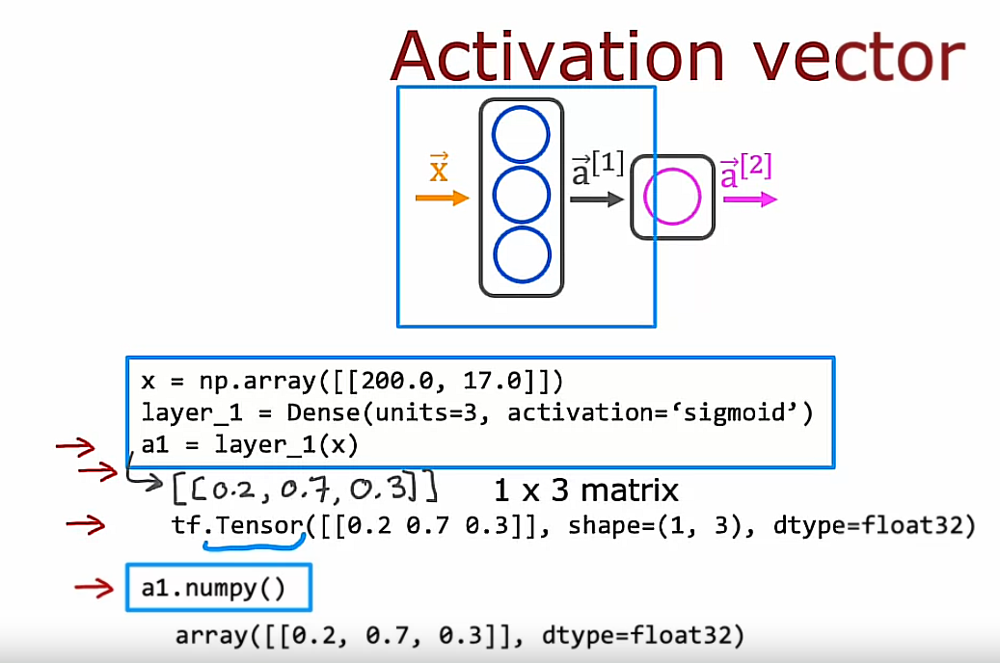

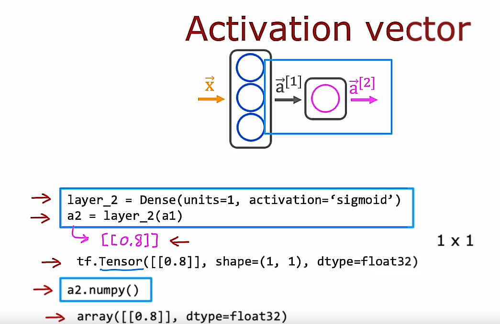

## Building a neural network

### Previous explicit way of carrying out forward propagation

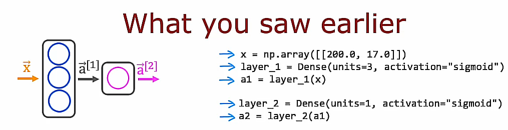

This was implemented as one layer of computation at the time

```python
x = np.array([[200.0, 17.0]])
layer_1 = Dense(units=3, activation="sigmoid")
a1 = layer_1(x)

layer_2 = Dense(units=1, activation="sigmoid")
a2 = layer_2(a1)
```

### TensorFlow way of implementing forward propagation

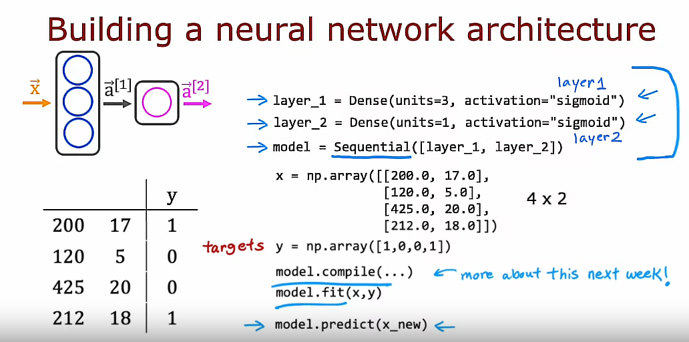

Instead of manually taking the data and passing it to layer 1 and then taking the activations from layer 1 and pass it to layer 2, we can instead tell TensorFlow that we would like to take layer 1 and layer 2 and string them together to form a neural network using Sequential

```python
layer_1 = Dense(units=3, activation="sigmoid")
layer_2 = Dense(units=1, activation="sigmoid")
model = Sequential([layer_1, layer_2])

x = np.array([[200.0, 17.0],
              [120.0, 5.0],    # Input Features x: 4x2 Matrix
              [425.0, 20.0],
              [212.0, 18.0]])

y = np.array([1,0,0,1]) # Target labels y: 1D Array of length 4

# Train this neural network
model.compile(...) # We will talk more about its parameters later
model.fit(x,y) # It tells TensorFlow to take this neural network that was created by sequentially string together layers 1 and 2 and to train it on the data x and y: We will talk more about this later. 

# Make inference (forward prop) on a new example say x_new (2 features: Temperature and Duration, x1 and x2)
x_new = np.array(...) # x_new = np.array([[210.0, 18.0]])
model.predict(x_new) # It carries out forward propagation and carries an inference using this neural network compiled using Sequential. It will output the corresponding value of $\vec{a}^{[2]}$ given x_new
```

### Simplified TensorFlow way of implementing forward propagation

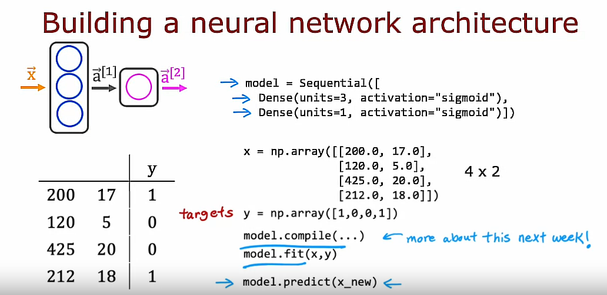

By convention, we dont explicitly assign layers to variables but instead we declare layers inside Sequential.

```python
model = Sequential([
    Dense(units=3, activation="sigmoid"),
    Dense(units=1, activation="sigmoid")])

x = np.array([[200.0, 17.0],
              [120.0, 5.0],    # Features x: 4x2 Matrix
              [425.0, 20.0],
              [212.0, 18.0]])

y = np.array([1,0,0,1]) # Target labels y: 1D Array of length 4

# Train this neural network
model.compile(...) # We will talk more about its parameters later
model.fit(x,y) # It tells TensorFlow to take this neural network that was created by sequentially string together layers 1 and 2 and to train it on the data x and y: We will talk more about this later. 

# Make inference (forward prop) on a new example say x_new (2 features: Temperature and Duration, x1 and x2)
x_new = np.array(...) # x_new = np.array([[210.0, 18.0]])
model.predict(x_new) # It carries out forward propagation and carries an inference using this neural network compiled using Sequential. It will output the corresponding value of $\vec{a}^{[2]}$ given x_new
```

## Redo this for the previous digit classification example

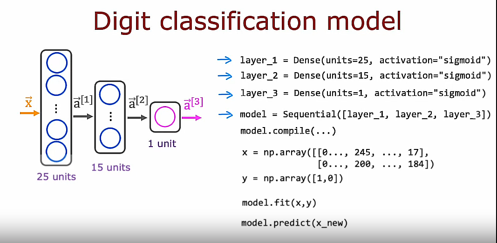

We had:

```python
layer_1 = Dense(units=25, activation="sigmoid")
layer_2 = Dense(units=15, activation="sigmoid")
layer_3 = Dense(units=1, activation="sigmoid")

model = Sequential([layer_1, layer_2, layer_3])

x = np.array([[0..., 245, ..., 17],
              [0..., 200, ..., 184]])

y = np.array([1,0])

model.compile(...)
model.fit(x,y)

#x_new = np.array(...)
model.predict(x_new)
```

## Simplified way

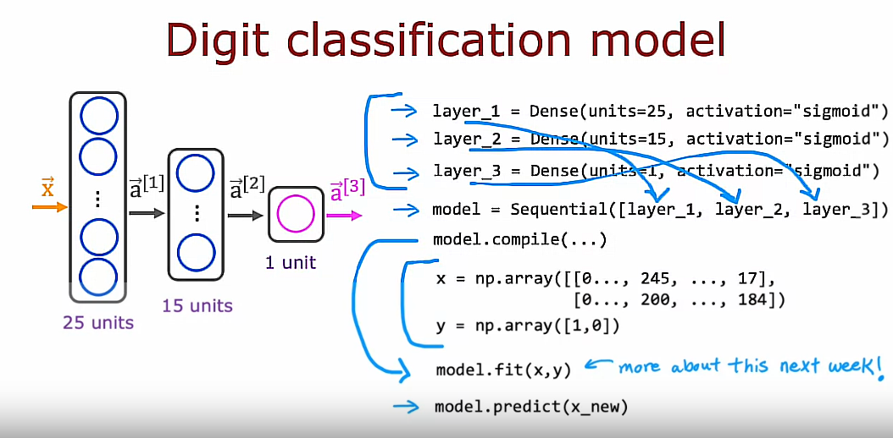

```python
model = Sequential([
    Dense(units=25, activation="sigmoid"),
    Dense(units=15, activation="sigmoid"),
    Dense(units=1, activation="sigmoid")])

x = np.array([[0..., 245, ..., 17],
              [0..., 200, ..., 184]])

y = np.array([1,0])

model.compile(...)
model.fit(x,y)

#x_new = np.array(...)  # x_new = np.array([[210.0, 18.0]])
model.predict(x_new)
```

## Optional Lab 2: Coffee Roasting in Tensorflow
