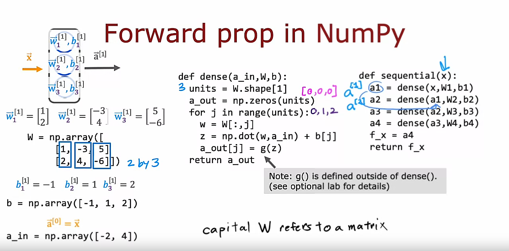

## Forward prop in a single layer

If you had to implement forward propagation yourself from scratch in python, how would you go about doing so?

### How to implement forward propagation in a single layer

Let's look at how you would take an input feature vector $\vec{X}$ and implement forward prop to get this output vector $\vec{a}^{[2]}$


```python
x = np.array([200, 17]) # Numpy 1D array
```

## About $\vec{a}^{[1]}$ we need to calculate:

1. $a^{[1]}_1$: This is the 1st activation value of $\vec{a}^{[1]}$

2. $a^{[1]}_2$

3. $a^{[1]}_3$

Let's start
---

### 1. $a^{[1]}_1$
$a^{[1]}_1 = g(\vec{w}^{[1]}_1 \cdot \vec{x} + b^{[1]}_1)$

```python
w1_1 = np.array([1, 2])
b1_1 = np.array([-1])
z1_1 = np.dot(w1_1, x) + b1_1
a1_1 = sigmoid(z1_1)
```

### 2. $a^{[1]}_2$
$a^{[1]}_2 = g(\vec{w}^{[1]}_2 \cdot \vec{x} + b^{[1]}_2)$

```python
w1_2 = np.array([-3, 4])
b1_2 = np.array([1])
z1_2 = np.dot(w1_2, x) + b1_2
a1_2 = sigmoid(z1_2)
```

### 3. $a^{[1]}_3$
$a^{[1]}_3 = g(\vec{w}^{[1]}_3 \cdot \vec{x} + b^{[1]}_3)$

```python
w1_3 = np.array([5, -6])
b1_3 = np.array([2])
z1_3 = np.dot(w1_3, x) + b1_3
a1_3 = sigmoid(z1_3)
```

Finally, we can define $\vec{a}^{[1]}$ as follows:

```python
a1 = np.array([a1_1, a1_2, a1_3])
```

## About $\vec{a}^{[2]}$ we need to calculate:

1. $a^{[2]}_1$: This is the 1st (and the only one) activation value of $\vec{a}^{[2]}$

Let's start
---

### 1. $a^{[2]}_1$
$a^{[2]}_1 = g(\vec{w}^{[2]}_1 \cdot \vec{a}^{[1]} + b^{[2]}_1)$

```python
w2_1 = np.array([-7, 8, 9])
b2_1 = np.array([3])
z2_1 = np.dot(w2_1, a1) + b2_1
a2_1 = sigmoid(z2_1)
```

## Check if this is correct

Finally, we can define $\vec{a}^{[2]}$ as follows:

```python
a2 = np.array([a2_1])
```

## Recap


That is how you implement forward prop using just python and numpy.

Now, there are a lot of expressions in this page of code that you just saw. Let's, in the next video, look at how you can simplify this to implement forward prop for a more general neural network, rather than hard coding it for every single neuron like we just did. So let's go see that in the next video.

## General implementation of forward propagation



> Note 1: Function g() is defined outside of dense() function

> Note 2: Under the notational conventions from Linear Algebra is to use uppercase or capital alphabet when it is referring to a matrix and lowercase to referr to vectors and scalars. So, that is why we are using uppercase W to referr to the W matrix

```math
$$\vec{w}^{[1]}_{1} = \begin{bmatrix} 1  \\ 2 \end{bmatrix} \quad \vec{w}^{[1]}_{2} = \begin{bmatrix} -3 \\ 4 \end{bmatrix} \quad \vec{w}^{[1]}_{3} = \begin{bmatrix} 5  \\ -6 \end{bmatrix}$$
```

```math
$$b^{[1]}_{1} = -1 \quad b^{[1]}_{2} = 1 \quad b^{[1]}_{3} = 2$$
```

$$\vec{a}^{[0]} = \vec{x}$$

## Code

```python
W = np.array([
    [1, -3, 5],
    [2, 4, -6]])

b = np.array([-1, 1, 2])
a_in = np.array([-2, 4]) 
```

```python
def g(z):
    pass # To be implemented later
```

```python
def dense(a_in, W, b):
    units = W.shape[1] # W.shape[0] for row size, W.shape[1] for column size
    a_out = np.zeros(units)
    for j in range(units):
        w = W[:, j]
        z = np.dot(w, a_in) + b[j]
        a_out[j] = g(z)
    return a_out
```

```python
def sequential(x):
    a1 = dense(x, W1, b1)
    a2 = dense(a1, W2, b2)
    a3 = dense(a2, W3, b3)
    a4 = dense(a3, W4, b4)
    f_x = a4
    return f_x
```

You now know how to implement forward prop yourself from scratch

## Optional Lab 3: CoffeeRoastingNumPy