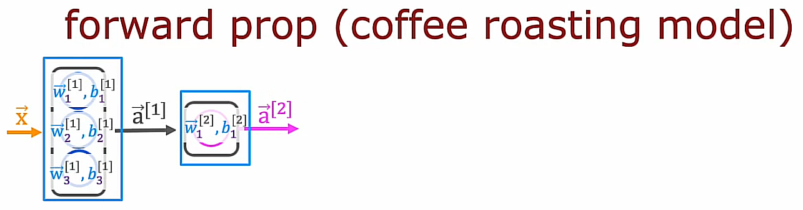
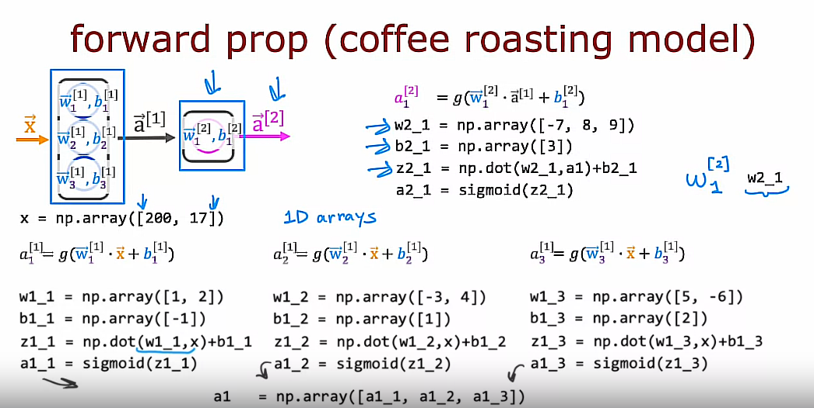

## Forward prop in a single layer

If you had to implement forward propagation yourself from scratch in python, how would you go about doing so?

### How to implement forward propagation in a single layer

Let's look at how you would take an input feature vector $x$ and implement forward prop to get this output $\vec{a}^{[2]}$



```python
x = np.array([200, 17]) # Numpy 1D array
```

## About $\vec{a}^{[1]}$ we need to calculate:

1. $a^{[1]}_1$: This is the 1st activation value of $\vec{a}^{[1]}$

2. $a^{[1]}_2$

3. $a^{[1]}_3$

Start
---

### 1. $a^{[1]}_1$
$a^{[1]}_1 = g(\vec{w}^{[1]}_1 \cdot \vec{x} + b^{[1]}_1)$

```python
w1_1 = np.array([1, 2])
b1_1 = np.array([-1])
z1_1 = np.dot(w1_1, x) + b1_1
a1_1 = sigmoid(z1_1)
```

### 2. $a^{[1]}_2$
$a^{[1]}_2 = g(\vec{w}^{[1]}_2 \cdot \vec{x} + b^{[1]}_2)$

```python
w1_2 = np.array([-3, 4])
b1_2 = np.array([1])
z1_2 = np.dot(w1_2, x) + b1_2
a1_2 = sigmoid(z1_2)
```

### 3. $a^{[1]}_3$
$a^{[1]}_3 = g(\vec{w}^{[1]}_3 \cdot \vec{x} + b^{[1]}_3)$

```python
w1_3 = np.array([5, -6])
b1_3 = np.array([2])
z1_3 = np.dot(w1_3, x) + b1_3
a1_3 = sigmoid(z1_3)
```

Finally, we have $\vec{a}^{[1]}$ as follows:

```python
a1 = np.array([a1_1, a1_2, a1_3])
```

## About $\vec{a}^{[2]}$ we need to calculate:

1. $a^{[2]}_1$: This is the 1st (and the only one) activation value of $\vec{a}^{[2]}$

Start
---

### 1. $a^{[2]}_1$
$a^{[2]}_1 = g(\vec{w}^{[2]}_1 \cdot \vec{a}^{[1]} + b^{[2]}_1)$

```python
w2_1 = np.array([-7, 8, 9])
b2_1 = np.array([3])
z2_1 = np.dot(w2_1, a1) + b2_1
a2_1 = sigmoid(z2_1)
```

## Check if this is correct

Finally, we have $\vec{a}^{[2]}$ as follows:

```python
a2 = np.array([a2_1])
```

## Recap



That is how you implement forward prop using just python and numpy.

Now, there are a lot of expressions in this page of code that you just saw. Let's, in the next video, look at how you can simplify this to implement forward prop for a more general neural network, rather than hard coding it for every single neuron like we just did. So let's go see that in the next video.

## General implementation of forward propagation

