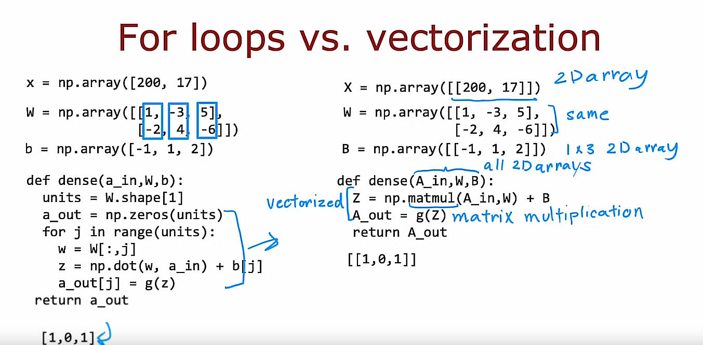
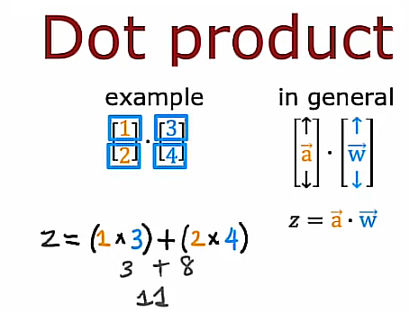
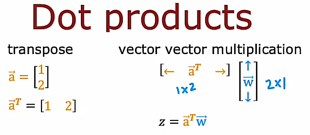
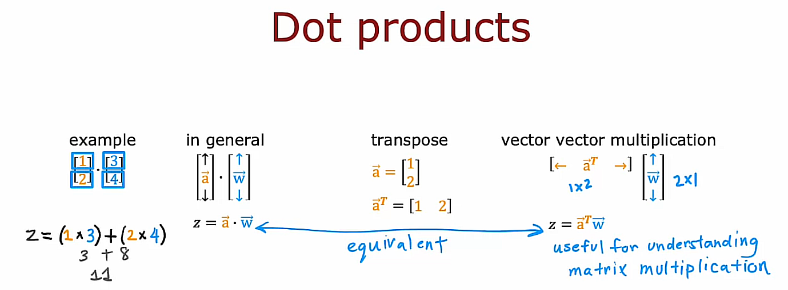
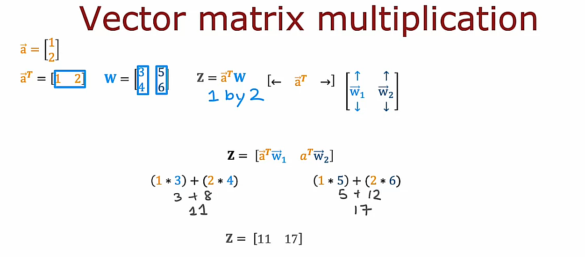
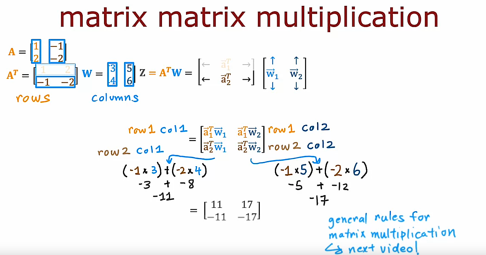
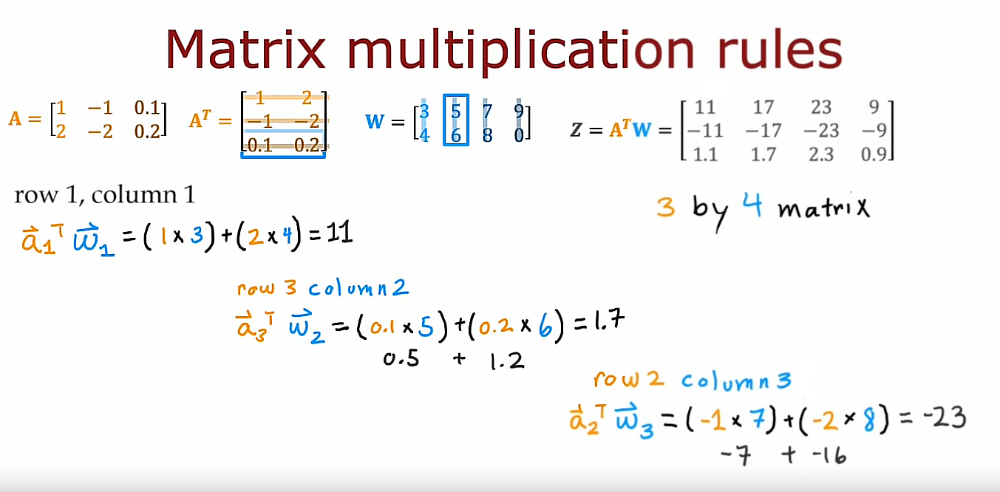
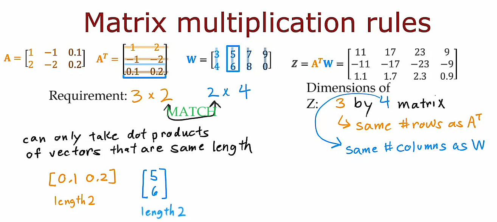
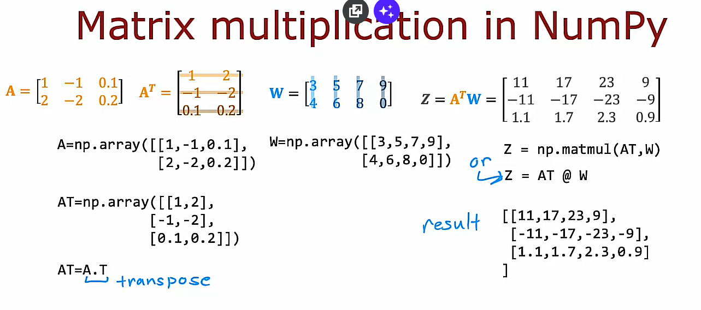
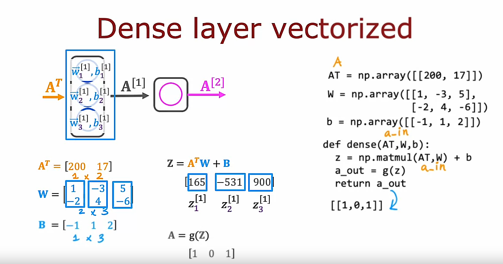

# Vectorization (optional)

## 1. How neural networks are implemented efficiently

One of the reasons that deep learning researchers have been able to scale up neural networks, and thought really large neural networks over the last decade, is because neural networks can be vectorized.

They can be implemented very efficiently using matrix multiplications and it turns out that parallel computing hardware, including GPUs but also some CPU functions, are very good at doing very large matrix multiplications.

In this video, we'll take a look at how these vectorized implementations of neural networks work. Without these ideas, I don't think deep learning would be anywhere near a success and scale today

## Vectorization of code using $np.matmul()$



### Non-vectorized implementation 

### See [1-non-vectorized-code.ipynb](https://github.com/mvarrone/machine-learning-specialization/blob/master/course_2-advanced-learning-algorithms/week1/10-Vectorization%20(optional)/Own%20labs%20-%20Vectorization/1-non-vectorized-code.ipynb)

On the left, is the code we developed previously of how to implement forward propagation in a single layer

For this code, X is the input, W the weights of the 1st, 2nd and 3rd neurons and we have the parameters b. Result of this implementation is [1, 0, 1]

### Vectorized implementation

### See [2-vectorized-code.ipynb](https://github.com/mvarrone/machine-learning-specialization/blob/master/course_2-advanced-learning-algorithms/week1/10-Vectorization%20(optional)/Own%20labs%20-%20Vectorization/2-vectorized-code.ipynb)

On the right, is a vectorized implementation of this code.

For this new code, X is a 2D array like in TensorFlow, W is the same as before, B is also a 1x3 2D array and all of the functions steps can be replaced with just a couple of lines of code. 

Now, we can use $np.matmul()$ Numpy function to carry out matrix multiplication. Result of this implementation is [[1, 0, 1]]

## Recap 

This turns out to be a very efficient implementation of one step of forward propagation through a dense layer in the neural network. 

This is code for a vectorized implementation of forward prop in a neural network

## 2. Matrix multiplication

A matrix is just a block or a 2D array of numbers

### 2.1 - Vector-vector multiplication

### 2.1.1 - The dot product



If $z$ is the dot product between $\vec{a}$ and $\vec{w}$, then you compute $z$ by multiplying the first element together and then the second elements together and the third and so on and then adding up all of these products.

$$z=\vec{a} \cdot \vec{w}$$

### Dot Product Explanation

#### Definition

The dot product of two vectors **a** and **b** in an $n$-dimensional space is defined as:

```math
\mathbf{a} \cdot \mathbf{b} = \sum_{i=1}^{n} a_i b_i
```

where:

```math
\mathbf{a} = \begin{bmatrix} a_1 \\ a_2 \\ \vdots \\ a_n \end{bmatrix}
```

```math
\mathbf{b} = \begin{bmatrix} b_1 \\ b_2 \\ \vdots \\ b_n \end{bmatrix}
```

The dot product is:

$\mathbf{a} \cdot \mathbf{b} = a_1 b_1 + a_2 b_2 + ... + a_n b_n$

#### Calculation

- For two-dimensional vectors, $\vec{a}$ and $\vec{b}$:

```math
\mathbf{a} = \begin{bmatrix} a_1 \\ a_2 \end{bmatrix}, \quad \mathbf{b} = \begin{bmatrix} b_1 \\ b_2 \end{bmatrix}
```

The dot product is:

$$\mathbf{a} \cdot \mathbf{b} = a_1 b_1 + a_2 b_2$$

- For three-dimensional vectors, $\vec{a}$ and $\vec{b}$:

```math
\mathbf{a} = \begin{bmatrix} a_1 \\ a_2 \\ a_3 \end{bmatrix}, \quad \mathbf{b} = \begin{bmatrix} b_1 \\ b_2 \\ b_3 \end{bmatrix}
```

The dot product is:

$$\mathbf{a} \cdot \mathbf{b} = a_1 b_1 + a_2 b_2 + a_3 b_3$$

#### Geometric Interpretation

The dot product can also be interpreted geometrically. It is related to the magnitudes of the vectors and the cosine of the angle between them:

```math
\mathbf{a} \cdot \mathbf{b} = \|\mathbf{a}\| \|\mathbf{b}\| \cos \theta
```

Where:
- $ \|\mathbf{a} \|$ is the magnitude (length) of $\vec{a}$
- $ \|\mathbf{b} \|$ is the magnitude (length) of $\vec{b}$
- $\theta$ is the angle between $\vec{a}$ and $\vec{b}$

#### Properties

1. **Commutativity**:
   $\mathbf{a} \cdot \mathbf{b} = \mathbf{b} \cdot \mathbf{a}$

2. **Distributivity**:
   $\mathbf{a} \cdot (\mathbf{b} + \mathbf{c}) = \mathbf{a} \cdot \mathbf{b} + \mathbf{a} \cdot \mathbf{c}$

3. **Scalar Multiplication**:
   $(c\mathbf{a}) \cdot \mathbf{b} = c(\mathbf{a} \cdot \mathbf{b})$
   Where $c$ is a scalar

4. **Orthogonality**:
   If $\mathbf{a} \cdot \mathbf{b} = 0$ , then $\mathbf{a}$ and $\mathbf{b}$ are orthogonal (perpendicular)

### Example

Given vectors $\mathbf{a} = \begin{bmatrix} 1 \\ 2 \\ 3 \end{bmatrix}$ and $\mathbf{b} = \begin{bmatrix} 4 \\ 5 \\ 6 \end{bmatrix}$, then

$\mathbf{a} \cdot \mathbf{b} = 1 \cdot 4 + 2 \cdot 5 + 3 \cdot 6 = 4 + 10 + 18 = 32$

Therefore, the dot product of $\mathbf{a}$ and $\mathbf{b}$ is 32

### 2.1.2 - The Transpose

There is an equivalent way of writing a dot product: Transpose

The transpose of the $\vec{a}$ means you take a vector and lay its elements on the side (turn from a column vector into a row vector)



$$z=\mathbf{\vec{a}}^T \vec{w}$$

### Both ways are equivalent



### 2.2 - Vector-matrix multiplication



Now, let's look at vector matrix multiplication, which is when you take a vector and you multiply it by a matrix. Here again is the vector a 1, 2 and a transpose is a laid on the side, so rather than this think of this as a 2x1 matrix it becomes a 1x2 matrix. 

Let me now create a 2x2 matrix W with these four elements: 3, 4, 5 and 6. 

It turns out that Z is going to be a 1x2 matrix:

- To compute the 1st value of Z we're going to take a transpose, 1, 2 here and multiply that by the 1st column of W, that's 3, 4. To compute the first element of Z, you end up with 1 x 3 + 2 x 4, which is equal to 11, and so the first element of Z is 11. 

- To compute the 2nd element of Z: We multiply a transpose by the 2nd column of W. To do that computation, you have 1 x 5 + 2 x 6, which is equal to 17. 

Z is equal to this 1x2 matrix: 11 and 17

$$Z = [\text{11 17}]$$

### 2.3 - Matrix-matrix multiplication

Advice from the instructor:

One way I encourage you to think of matrices, at least there is useful for neural network implementations, is if you see a **matrix**, think of the **columns** of the matrix and if you see the **transpose of a matrix**, think of the **rows** of that matrix as being grouped together



## Matrix multiplication rules

### Example



## Requirement for multiplying matrices together



One requirement in order to multiply 2 matrices together is that the number of columns of the 1st matrix to be multiplied must match the number of rows of the 2nd matrix

And that's because you can only take dot products between vectors that are the same length.

So you can take the dot product between a vector with two numbers. And that's because you can take the inner product between the vector of length 2 only with another vector of length 2. You can't take the inner product between vector of length 2 with a vector of length 3, for example.

## Observation

The dimensions of Z is equal to the number of rows of the 1st matrix by the number of columns of the 2nd matrix

## Matrix multiplication code

Without further ado, let's jump into the vectorized implementation of a neural network. Hopefully, *matmul*, a function from the Numpy library that computes matrix multiplication, will make more sense now.



```python
# Define the A matrix
A = np.array([[1, -1, 0.1],[2, -2, 0.2]]) # Numpy 2D array

# Calculate transpose of A
AT = np.array([[1, 2],[-1, -2], [0.1, 0.2]]) # Numpy 2D array. Hardcoding tranpose of A
AT = A.T # How to calculate the transpose of A, denoted as AT

# Define the W matrix
W = np.array([[3, 5, 7, 9],[4, 6, 8, 0]]) # Numpy 2D array

# Multiply both matrices
Z_method_1 = np.matmul(AT, W) # Method 1: using matmul
Z_method_2 = AT @ W # Method 2: Using the @ operator
```

The results for *Z_method_1* and *Z_method_2* are the same: 

      [
         [11,17,23,9],
         [-11,-17,-23,-9],
         [1.1,1.7,2.3,0.9]
      ]

## Coffee Roasting example



### Implementing forward prop in a neural network in Python

```python
AT = np.array([[200, 17]])

W = np.array([[1, -3, 5],
               [-2, 4, -6]])

b = np.array([[-1, 1, 2]])

def g(z):
   pass # To be implemented later

def dense(AT, W, b):
   z = np.matmul(AT, W) + b
   a_out = g(z)
   return a_out

result = dense(AT, W, b)
print(result)
```

The result is: 

      [[1, 0, 1]]

## Programming Assignment: Practice Lab: Neural Networks for Binary Classification
