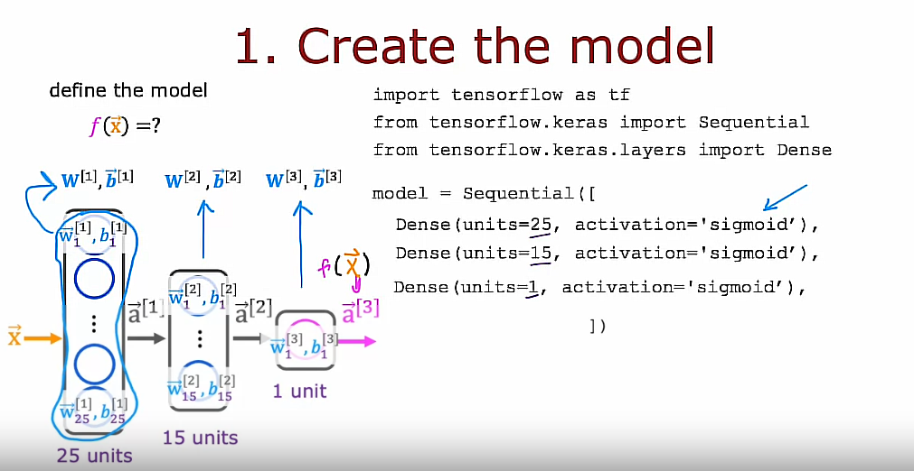
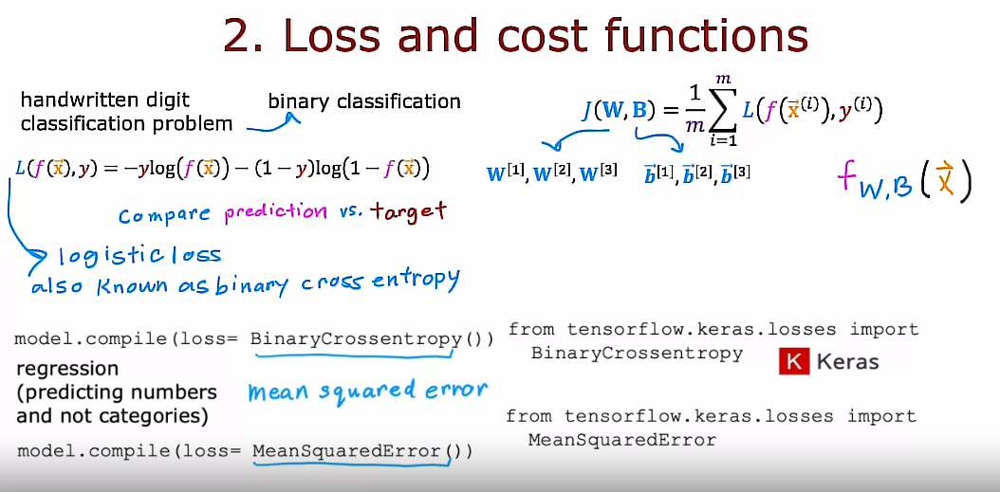
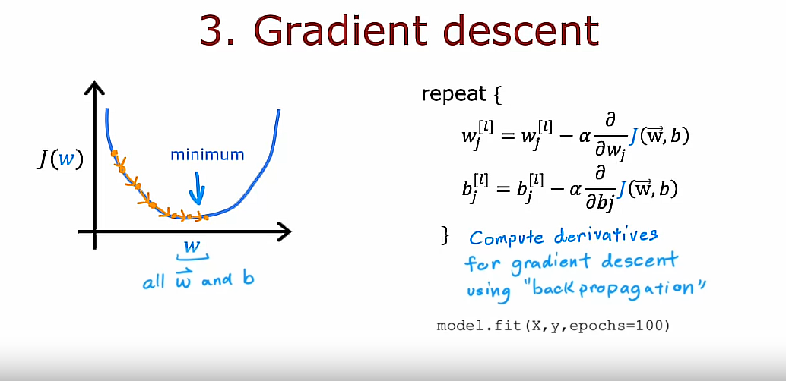
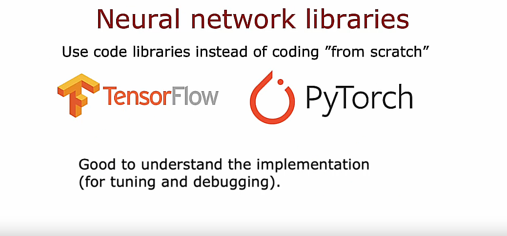

## TensorFlow implementation

Last week you learned how to carry out inference in the neural network. This week, we're going to go over the training of a neural network.


## Steps to train a neural network

- Step 1 is to specify the model, which tells TensorFlow how to compute for the inference. 

- Step 2 compiles the model using a specific loss function. The key step in asking TensorFlow to compile the model is to specify what is the loss function you want to use. In this case we'll use something that goes by the binary crossentropy loss function

- Step 3 is to train the model. Then having specified the loss function, the third step is to call the fit function, which tells TensorFlow to fit the model that you specified in step 1 using the loss of the cost function that you specified in step 2 to the dataset X, Y

That's how you can train a neural network in TensorFlow

As usual, I hope that you people are not just call these lines of code to train the model, but that you also understand what's actually going on behind these lines of code, so you don't just call it without really understanding what's going on. I think this is important because when you're running a learning algorithm, if it doesn't work initially, having that conceptual mental framework of what's really going on will help you debug whenever things don't work the way you expect

## Epoch concept

Back in the first course, when we talked about Gradient Descent, we had to decide how many steps to run Gradient Descent or how long to run Gradient Descent, so *epoch* is a technical term for how many steps of a learning algorithm like gradient descent you may want to run

## Training Details

### Model training steps


## 1. Recall the training of a Logistic Regression model

Let's recall how you had trained a logistic regression model in the previous course.

### Step 1: Define the model

Step 1 of building a Logistic Regression model was you would specify how to compute the output given the input feature $\vec{X}$ and the parameters $w$ and $b$ 

In the first course, we said the Logistic Regression function predicts $f(x) = g(z)$, the sigmoid function. 

If $$z = np.dot(w, x) + b$$ then $$f(x) = \frac{1}{1+np.exp(-z)}$$

So, those first steps were to specify what is the input to output function of Logistic Regression and that depends on both the input $x$ and the parameters of the model, $w$ and $b$

### Step 2: Specify the loss and cost functions

The second step we had to do to train the Logistic Regression model was to specify the loss function and also the cost function. 

### Loss function

So, you may recall that the loss function said, if Logistic Regression outputs $f(x)$ and the ground truth label (the actual label in a training set) was $y$, then the loss on that **single** training example was defined as follows: $$loss = -y * np.log(f(x)) - (1-y) * np.log(1-f(x))$$

So, this was a measure of how well is Logistic Regression doing on a single training example $(x, y)$

### Cost function
Given this definition of a loss function, we then defined the cost function: The cost function was a function of the parameters $w$ and $b$, and that was just the average that is taking **an average over all M training examples of the loss function** computed on the *M* training examples, $x_1, y_1$ through $x_m, y_m$

We have defined the cost function $J(\vec{w}, b)$ as:

$$J(\vec{w}, b) = \frac{1}{m}\sum_{i=1}^{m}L(f_{\vec{w}, b}(\vec{x}^{(i)}), y^{(i)})$$

#### Little reminder on the difference between loss and cost terms

And remember that in the convention we are using is that the **loss function L(f_x, y)** is a function of the output of the learning algorithm ($f_x$) and the ground truth label ($y$) as computed over a **single training example** whereas the **cost function $J(w, b)$** is **an average of the loss function computed over your entire training set**. 

### Step 3: Train on data to minimize $J(w, b)$

Then, the third and final step to train a Logistic Regression model was to use an algorithm, specifically Gradient Descent, to minimize that cost function $J(w, b)$ to minimize it as a function of the parameters $w$ and $b$. 

And, we minimized the cost $J(w, b)$ as a function of the parameters using Gradient Descent where both parameters $w$ and $b$ were updated as follows:

$$w = w - alpha * \frac{dJ(w, b)}{dw}$$

$$b = b - alpha * \frac{dJ(w, b)}{db}$$

## Recap

So, lets recap these 3 steps: 

- Step 1: Specifying how to compute the outputs given the input X and parameters $w$ and $b$
- Step 2: Specify loss $L$ and cost $J$
- Step 3: Minimize the cost function $J$

The same 3 steps is how we can train a neural network in TensorFlow

Now let's look at how these three steps map to training a neural network. 

## 2. Neural network

### Step 1: Define the model

Step one is specify how to compute the output given the input $x$ and parameters $w$ and $b$: that's done with this code snippet which should be familiar from last week of specifying the neural network and this was actually enough to specify the computations needed in forward propagation or for the inference algorithm for example. 

```python
model = Sequential([
    Dense(...),
    Dense(...),
    Dense(...)
])
```

### Step 2: Specify the loss and cost functions. Compile the model

The second step is to compile the model and to tell it what loss you want to use

```python
model.compile(loss=BinaryCrossentropy())
```

which is the Binary Cross Entropy loss function.

And once you specify this loss taking an average over the entire training set also gives you the cost function for the neural network

### Step 3: Train on data to minimize $J(w, b)$

Step three is to call a function to try to minimize the cost as a function of the parameters of the neural network

```python
model.fit(X, y, epochs=100)
```

Let's look in greater detail in these three steps in the context of training a neural network

## Step 1: Define the model



The first step, again, is to specify how to compute the output given the input $\vec{X}$ and parameters $w$ and $b$

```python
import tensorflow as tf
from tensorflow.keras import Sequential
from tensorflow.keras.layers import Dense

model = Sequential([
    Dense(units=25, activation='sigmoid'),
    Dense(units=15, activation='sigmoid'),
    Dense(units=1, activation='sigmoid')
])
```

This code snippet specifies the entire architecture of the neural network. It tells you that there are 25 hidden units in the first hidden layer, then the 15 in the next one, and then one output unit and that we're using the sigmoid activation value

Based on this code snippet, we know also what are the parameters $\vec{W}^{[1]}$, $b^{[1]}$ through the first layer, parameters of the second layer $\vec{W}^{[2]}$, $b^{[2]}$ and parameters of the third layer $\vec{W}^{[3]}$, $b^{[3]}$

This code snippet specifies the entire architecture of the neural network and therefore tells TensorFlow everything it needs in order to compute the output $\vec{a}^{[3]}$ or $f(\vec{x})$ as a function of the input $\vec{X}$ and the parameters, here we have written $\vec{W}^{[l]}$, $b^{[l]}$ where $l$ meaning the number of the layer

## Step 2: Specify the loss and cost functions. Compile the model



 In the second step, you have to specify what is the loss function. That will also define the cost function we use to train the neural network.
 
 For the handwritten digit classification problem where images are either of a 0 or a 1 the most common by far loss function to use is the same loss function as what we had for Logistic Regression:
 
 $$\text{loss }L(f(\vec{x}), y) = -y * np.log(f(x)) - (1-y) * np.log(1-f(x))$$
 
where $y$ is the ground truth label, sometimes also called the target label $y$, and $f(x)$ is now the output of the neural network. 

In TensorFlow, this is called the *binary cross-entropy loss function*. Where does that name come from? Well, it turns out in statistics this function is called the cross-entropy loss function, so that's what cross-entropy means, and the word binary just reemphasizes or points out that this is a binary classification problem because each image is either a 0 or a 1. 

The syntax needed here is to ask TensorFlow to compile the neural network using this loss function as shown below:

```python
from tensorflow.keras.losses import BinaryCrossentropy

model.compile(loss=BinaryCrossentropy())
```

Another historical note: *Keras* was originally a library that had developed independently of TensorFlow. It is actually a totally separate project from TensorFlow but eventually it got merged into TensorFlow. 

Having specified the loss with respect to a single training example, TensorFlow knows that the cost you want to minimize is then the average, taking the average over all m training examples of the loss on all of the training examples. Optimizing this cost function will result in fitting the neural network to your binary classification data. 

## Regression problems

In case you want to solve a regression problem rather than a classification problem you can also tell TensorFlow to compile your model using a different loss function.

```python
from tensorflow.keras.losses import MeanSquaredError

model.compile(loss=MeanSquaredError())
```

For example, if you have a regression problem and if you want to minimize the squared error loss, the loss with respect to if your learning algorithm outputs $f(x)$ with a target or ground truth label of $y$, that's a half of the squared error, then you can use this loss function in TensorFlow, which is to use the maybe more intuitively named **mean squared error loss function**. 

Then TensorFlow will try to minimize the mean squared error. 

## Cost function $J(W, B)$

$$J(W, B) = \frac{1}{m}\sum_{i=1}^{m}L(f(\vec{x}^{(i)}), y^{(i)})$$

In this expression, I'm using J of capital W comma capital B to denote the cost function. 

The cost function is a function of all the parameters into the neural network. 

So, you can think of capital W as including $W^{[1]}$, $W^{[2]}$, $W^{[3]}$ (all the W parameters and the entire neural network) and B as including $\vec{b}^{[1]}$, $\vec{b}^{[2]}$ and $\vec{b}^{[3]}$.

So, if you are optimizing the cost function with respect to w and b, if we tried to optimize it with respect to all of the parameters in the neural network. 

And up on top as well, I had written $f(x)$ as the output of the neural network, but we can also write $f_{W, B}(\vec{x})$ if we want to emphasize that the output of the neural network as a function of x depends on all the parameters in all the layers of the neural network. So, that's the loss function and the cost function.

## Step 3: Gradient Descent



Finally, you will ask TensorFlow to minimize the cost function. 

You might remember the Gradient Descent algorithm from the first course. 

If you're using Gradient Descent to train the parameters of a neural network, then you are repeatedly, for every layer $l$ and for every unit $j$, updating $w_{j}^{[l]}$ according to the following expression shown below:

$$w_{j}^{[l]} = w_{j}^{[l]} - \alpha * \frac{d}{dw_j}J(\vec{w}, b)$$

Similarly, we are updating $b_{j}^{[l]}$ for the parameters $b$ as well as follows next:

$$b_{j}^{[l]} = b_{j}^{[l]} - \alpha * \frac{d}{db_j}J(\vec{w}, b)$$

After doing, say, 100 iterations of Gradient Descent, hopefully, you get to a good value of the parameters. 

In order to use Gradient Descent, the key thing you need to compute is these partial derivative terms. And what TensorFlow does, and, in fact, what is standard in neural network training, is to use an algorithm called **backpropagation** in order to compute these partial derivative terms. 

TensorFlow can do all of these things for you. It implements backpropagation all within this function called *fit*. All you have to do is call 

```python
model.fit(X, y, epochs=100)
```

as your training set, and tell it to do so for 100 iterations or 100 epochs. 

## Better algorithm than Gradient Descent

In fact, what you see later is that TensorFlow can use an algorithm that is even a little bit faster than Gradient Descent, and you'll see more about that later this week as well. 

## About relying on libraries



Now, I know that we're relying heavily on the TensorFlow library in order to implement a neural network. One pattern I've seen across multiple ideas is as the technology evolves, libraries become more mature, and most engineers will use libraries rather than implement code from scratch. 

When deep learning was younger and less mature, many developers, including me, were implementing things from scratch using Python or C++ or some other library. But today, deep learning libraries have matured enough that most developers will use these libraries, and, in fact, most commercial implementations of neural networks today use a library like TensorFlow or PyTorch. But as I've mentioned, it's still useful to understand how they work under the hood so that if something unexpected happens, which still does with today's libraries, you have a better chance of knowing how to fix it. 

Now that you know how to train a basic neural network, also called a **multilayer perceptron**, there are some things you can change about the neural network that will make it even more powerful. 

In the next video, let's take a look at how you can swap in different activation functions as an alternative to the sigmoid activation function we've been using. This will make your neural networks work even much better

