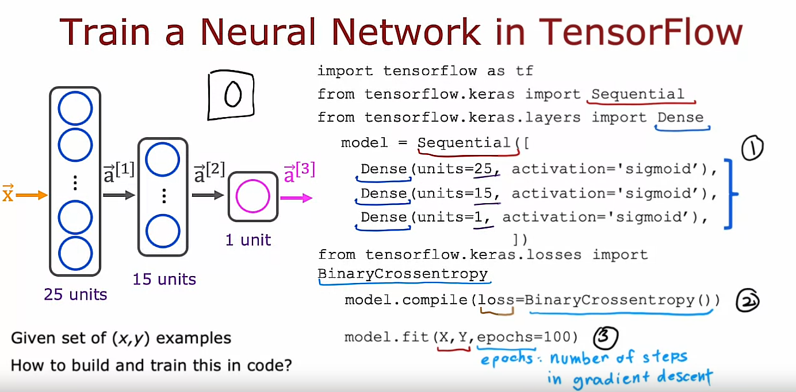

## TensorFlow implementation

Last week you learned how to carry out inference in the neural network. This week, we're going to go over the training of a neural network.



## Steps to train a neural network

- Step 1 is to specify the model, which tells TensorFlow how to compute for the inference. 

- Step 2 compiles the model using a specific loss function. The key step in asking TensorFlow to compile the model is to specify what is the loss function you want to use. In this case we'll use something that goes by the binary crossentropy loss function

- Step 3 is to train the model. Then having specified the loss function, the third step is to call the fit function, which tells TensorFlow to fit the model that you specified in step 1 using the loss of the cost function that you specified in step 2 to the dataset X, Y

That's how you can train a neural network in TensorFlow

As usual, I hope that you people are not just call these lines of code to train the model, but that you also understand what's actually going on behind these lines of code, so you don't just call it without really understanding what's going on. I think this is important because when you're running a learning algorithm, if it doesn't work initially, having that conceptual mental framework of what's really going on will help you debug whenever things don't work the way you expect

## Epoch concept

Back in the first course, when we talked about Gradient Descent, we had to decide how many steps to run Gradient Descent or how long to run Gradient Descent, so *epoch* is a technical term for how many steps of a learning algorithm like gradient descent you may want to run

## Training Details

### Model training steps


## 1. Recall the training of a Logistic Regression model

Let's recall how you had trained a logistic regression model in the previous course.

### Step 1: Define the model

Step 1 of building a Logistic Regression model was you would specify how to compute the output given the input feature $\vec{X}$ and the parameters $w$ and $b$ 

In the first course, we said the Logistic Regression function predicts $f(x) = g(z)$, the sigmoid function. 

If $$z = np.dot(w, x) + b$$ then $$f_x = \frac{1}{1+np.exp(-z)}$$

So, those first steps were to specify what is the input to output function of Logistic Regression and that depends on both the input $x$ and the parameters of the model, $w$ and $b$

### Step 2: Specify the loss and cost functions

The second step we had to do to train the Logistic Regression model was to specify the loss function and also the cost function. 

### Loss function

So, you may recall that the loss function said, if Logistic Regression outputs $f(x)$ and the ground truth label (the actual label in a training set) was $y$, then the loss on that **single** training example was defined as follows: $$loss = -y * np.log(f_x) - (1-y) * np.log(1-f_x)$$

So, this was a measure of how well is Logistic Regression doing on a single training example $(x, y)$

### Cost function
Given this definition of a loss function, we then defined the cost function: The cost function was a function of the parameters $w$ and $b$, and that was just the average that is taking **an average over all M training examples of the loss function** computed on the *M* training examples, $x_1, y_1$ through $x_m, y_m$

We have defined the cost function $J(\vec{w}, b)$ as:

$$J(\vec{w}, b) = \frac{1}{m}\sum_{i=1}^{m}L(f_{\vec{w}, b}(\vec{x}^{(i)}), y^{(i)})$$

#### Little reminder on the difference between loss and cost terms

And remember that in the convention we are using is that the **loss function L(f_x, y)** is a function of the output of the learning algorithm ($f_x$) and the ground truth label ($y$) as computed over a **single training example** whereas the **cost function $J(w, b)$** is **an average of the loss function computed over your entire training set**. 

### Step 3: Train on data to minimize $J(w, b)$

Then, the third and final step to train a Logistic Regression model was to use an algorithm, specifically Gradient Descent, to minimize that cost function $J(w, b)$ to minimize it as a function of the parameters $w$ and $b$. 

And, we minimized the cost $J(w, b)$ as a function of the parameters using Gradient Descent where both parameters $w$ and $b$ were updated as follows:

$$w = w - alpha * \frac{dJ(w, b)}{dw}$$

$$b = b - alpha * \frac{dJ(w, b)}{db}$$

## Recap

So, lets recap these 3 steps: 

- Step 1: Specifying how to compute the outputs given the input X and parameters $w$ and $b$
- Step 2: Specify loss $L$ and cost $J$
- Step 3: Minimize the cost function $J$

The same 3 steps is how we can train a neural network in TensorFlow

Now let's look at how these three steps map to training a neural network. 

## 2. Neural network

### Step 1: Define the model

Step one is specify how to compute the output given the input x and parameters W and B: that's done with this code snippet which should be familiar from last week of specifying the neural network and this was actually enough to specify the computations needed in forward propagation or for the inference algorithm for example. 

```python
model = Sequential([
    Dense(...),
    Dense(...),
    Dense(...)
])
```

### Step 2: Compile the model

The second step is to compile the model and to tell it what loss you want to use

```python
model.compile(loss=BinaryCrossentropy())
```

which is the Binary Cross Entropy loss function.

And once you specify this loss taking an average over the entire training set also gives you the cost function for the neural network

### Step 3: Train on data to minimize $J(w, b)$

Step three is to call a function to try to minimize the cost as a function of the parameters of the neural network

```python
model.fit(X, y, epochs=100)
```