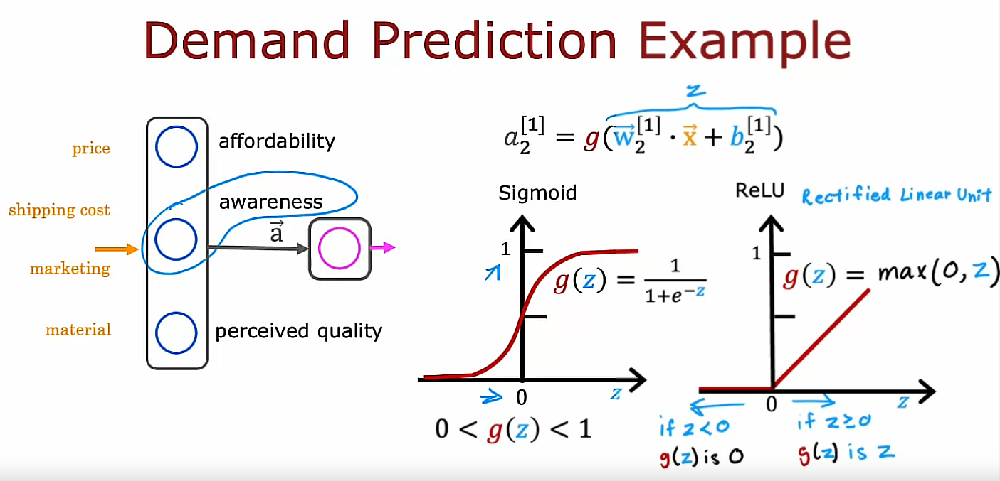
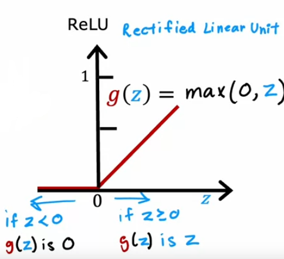
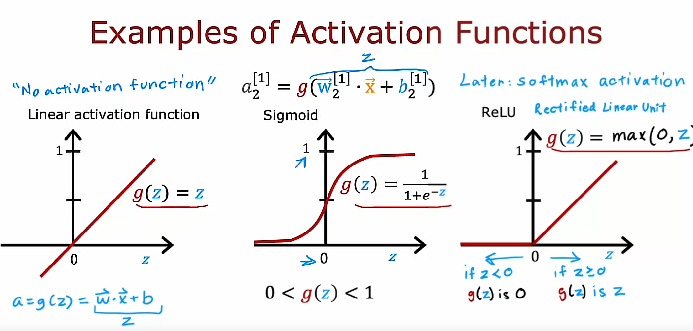
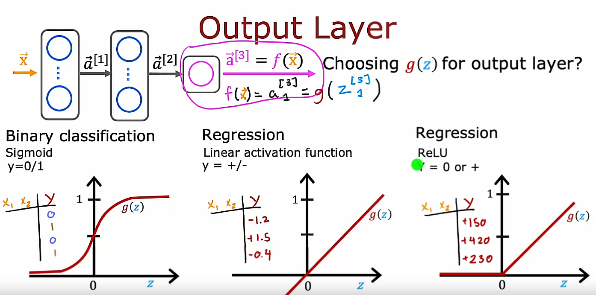
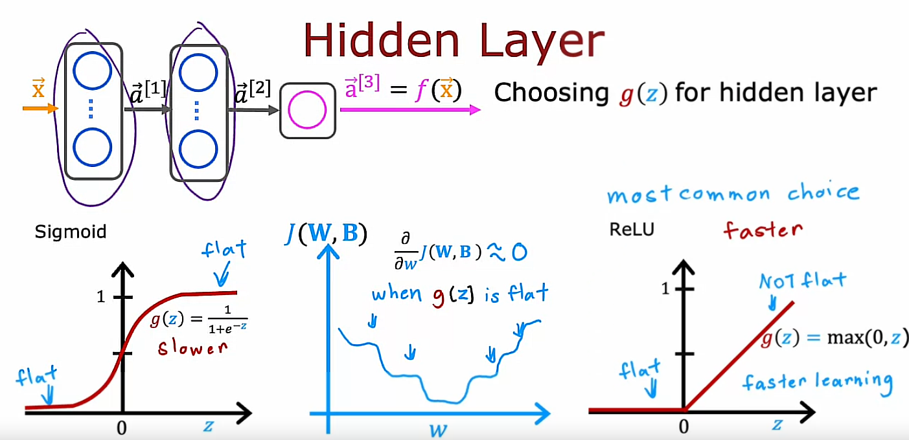
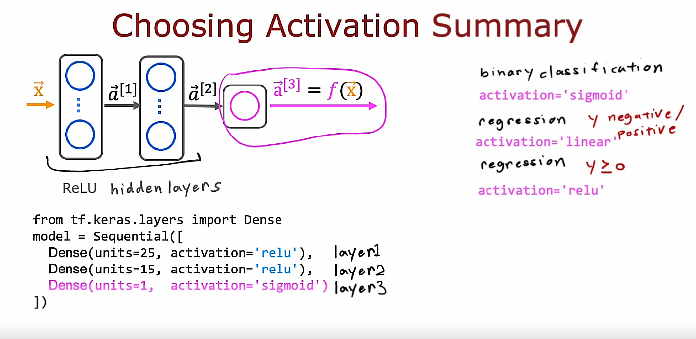
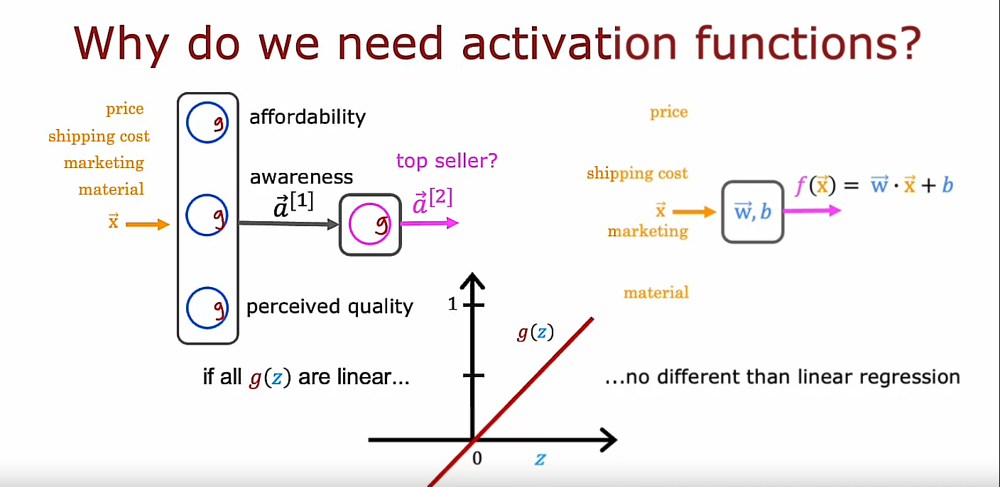
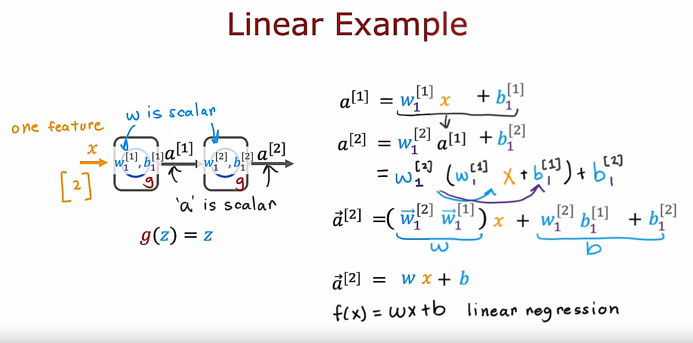
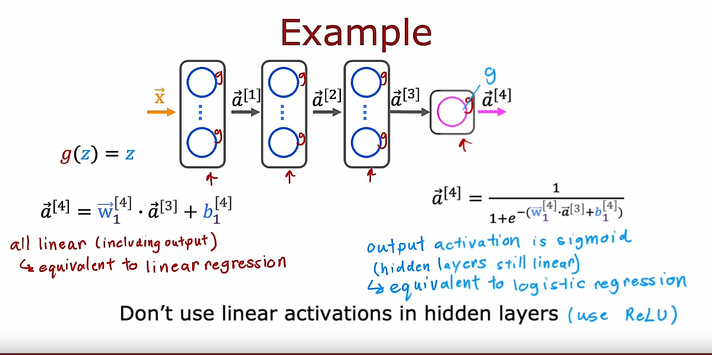

## Alternatives to the sigmoid activation

Recall the demand prediction example from last week where given price, shipping cost, marketing and material you would try to predict if something is highly affordable, if there's good awareness and high perceived quality and based on that try to predict it was a top seller. 

But this assumes that awareness is maybe binary is either people are aware or they are not. But it seems like the degree to which possible buyers are aware of the t-shirt you're selling may not be binary: they can be a little bit aware, somewhat aware, extremely aware or it could have gone completely viral. 

So, rather than modeling awareness as a binary number 0, 1, that you try to estimate the probability of awareness or rather than modeling awareness is just a number between 0 and 1. Maybe awareness should be any non negative number because there can be any non negative value of awareness going from 0 up to very very large numbers.

So, whereas previously we had used this equation 

$$a_2^{[1]} = g(z) = g(\vec{w}_2^{[1]} \cdot \vec{x} + b_2^{[1]})$$

to calculate the activation of that 2nd hidden unit in layer 1 estimating awareness where g was the sigmoid function and just goes between 0 and 1. 

If you want to allow $a_{2}^{[1]}$ to potentially take on much larger positive values we can instead swap in a different activation function.

## Another activation function: ReLU

It turns out that a very common choice of activation function in neural networks is this function shown below: 

It goes like this:

- If $z<0$, then $g(z) = 0$ to the left of 0
- If $z>=0$, then there is a straight line 45° to the right of 0, meaning $g(z)=z$. 

The mathematical equation for this activation function is denoted as:

$$g(z) = max(0, z)$$

And if $a_{2}^{[1]}$ is g(z) for this value of z, then a, the deactivation value cannot take on 0 or any non negative value.

This activation function has a name: It goes by the name ReLU with this funny capitalization and ReLU stands for **Rectified Linear Unit**.

More generally you have a choice of what to use for g(z) and sometimes we'll use a different choice than the sigmoid activation function.

## Another activation function: Linear activation function

Here are the most commonly used activation functions. 

You saw the sigmoid activation function, g(z) equals this sigmoid function. On the last slide, we just looked at the ReLU or Rectified Linear unit $g(z) = max(0, z)$. 

There's one other activation function which is worth mentioning, which is called the Linear activation function, which is just $$g(z) = z$$

Sometimes if you use the linear activation function, people will say we are not using any activation function because if a is g(z) where g(z) equals z, then a is just equal to this w.x plus b z. 

And so it's as if there was no g in there at all. So, when you are using this linear activation function g(z) sometimes people say, well, we are not using any activation function. Although in this class, I will refer to using the linear activation function rather than no activation function. 

But if you hear someone else use that terminology, that is what they mean. It just refers to the linear activation function. 

And these three are probably by far the most commonly used activation functions in neural networks. Later this week, we will touch on the fourth one called the **softmax activation function** but with these activation functions you will be able to build a rich variety of powerful neural networks. 

So when building a neural network for each neuron, do you want to use the sigmoid activation function or the ReLU activation function? Or a linear activation function? 

How do you choose between these different activation functions? Let's take a look at that in the next video.

## Choosing activation functions

Let's take a look at how you can choose the activation function for different neurons in your neural network. First, we will start with the output layer and then we will go and look at the choice of the activation function also for the hidden layers of your neural network

### 1. Choosing activation functions for the output layer

We'll start with some guidance for how to choose it for the output layer

You can choose different activation functions for different neurons in your neural network, and when considering the activation function for the output layer, it turns out that there'll often be one fairly natural choice, depending on what is the target or the ground truth label $y$. 

### 1.1 Binary classification problems ($y$ might be 0 or 1): Sigmoid activation function

Specifically, if you are working on a classification problem where $y$ is either 0 or 1, so a binary classification problem, then the **Sigmoid activation function** will almost always be the most natural choice, because then the neural network learns to predict the probability that $y$ is equal to 1, just like we had for Logistic Regression. My recommendation is, if you're working on a binary classification problem, use sigmoid at the output layer. 

### 1.1.1 An exception

Well, the one exception that you do use a Sigmoid activation function in the output layer if you have a binary classification problem. So, why is that? Well, there are a few reasons. 

1. First, if you compare the ReLU and the sigmoid activation functions, the ReLU is a bit faster to compute because it just requires computing $max(0, z)$ whereas the sigmoid requires taking an exponentiation and then a inverse and so on, and so it's a little bit less efficient. 

2. But, the second reason which turns out to be even more important is that the ReLU function goes flat only in one part of the graph; here on the left is completely flat, whereas the sigmoid activation function, it goes flat in two places. It goes flat to the left of the graph and it goes flat to the right of the graph. 

### 1.2 Regression problems with $y$ taking positive or negative values: Linear activation function

Alternatively, if you're solving a regression problem, then you might choose a different activation function. 

For example, if you are trying to predict how tomorrow's stock price will change compared to today's stock price, well, it can go up or down, and so in this case $y$ would be a number that can be either positive or negative, and in that case I would recommend you use the **Linear activation function**. 

Why is that? Well, that's because then the outputs of your neural network, $f(x)$, which is equal to $\vec{a}^{[3]}$ in the example above, would be g applied to z^3 and with the linear activation function, $g(z)$ can take on either positive or negative values. So $y$ can be positive or negative, use a linear activation function. 

### 1.3 Regression problems with $y$ only taking non-negative values: ReLU activation function

Finally, if $y$ can only take on non-negative values, such as if you're predicting the price of a house, that can never be negative, then the most natural choice will be the **ReLU activation function** because as you see here, this activation function only takes on non-negative values, either 0 or positive values. 

## Brief summary

In choosing the activation function to use for your output layer, usually depending on what is the label $y$ you're trying to predict, there'll be one fairly natural choice. 
In fact, the guidance on this slide is how I pretty much always choose my activation function as well for the output layer of a neural network. 

### 2. Choosing activation functions for the hidden layers

How about the hidden layers of a neural network? 

### 2.1 Default activation function for hidden layers: ReLU

It turns out that the **ReLU activation function** is by far the most common choice in how neural networks are trained by many practitioners today. 

Even though we had initially described neural networks using the Sigmoid activation function, and in fact, in the early history of the development of neural networks, people used Sigmoid activation functions in many places, the field has evolved to use ReLU much more often and Sigmoids hardly ever. 

If you're using gradient descent to train a neural network, then when you have a function that is flat in a lot of places, gradient descent would be really slow. 

I know that gradient descent optimizes the cost function $J(w, b)$ rather than optimizes the activation function, but the activation function is a piece of what goes into computing, and that results in more places in the cost function $J(w, b)$ that are flats as well and with a small gradient and it slows down learning. 

I know that that was just an intuitive explanation but researchers have found that using the ReLU activation function can cause your neural network to learn a bit faster as well, which is why for most practitioners if you're trying to decide what activation functions to use with hidden layer, the ReLU activation function has become now by far the most common choice. 

## Summary 

To summarize, here's what I recommend in terms of how you choose the activation functions for your neural network. 

### Output layer 

For the output layer:

- Use a Sigmoid activation function, if you have a binary classification problem ($y=0$ or $y=1$)
- Use a Linear activation function, if $y$ is a number that can take on positive or negative values
- Use a ReLU activation function, if $y$ can take on only positive values or zero positive values or non-negative values ($y>=0$)

### Hidden layers 

For the hidden layers:

I would recommend just using **ReLU as a default activation function**, and in TensorFlow, this is how you would implement it. 

Parameter *activation* in Dense function can take, at least, the following values:

- relu
- sigmoid
- linear

With this richer set of activation functions, you'll be well-positioned to build much more powerful neural networks than just once using only the sigmoid activation function. 

## Other activation functions

By the way, if you look at the research literature, you sometimes hear of authors using even other activation functions, such as the **tan(h)** activation function or the **LeakyReLU** activation function or the **swish** activation function.

Every few years, researchers sometimes come up with another interesting activation function, and sometimes they do work a little bit better. 

But I think for the most part, and for the vast majority of applications what you learned about in this video would be good enough. Of course, if you want to learn more about other activation functions, feel free to look on the Internet, and there are just a small handful of cases where these other activation functions could be even more powerful as well. 

With that, I hope you also enjoy practicing these ideas, these activation functions in the optional labs and in the practice labs

## Why do we need activation functions?

Let's take a look at why neural networks need activation functions and why they just don't work if we were to use the linear activation function in every neuron in the neural network

Recall this demand prediction example. 

What would happen if we were to use a linear activation function for all of the nodes in this neural network? 

It turns out that this big neural network will become no different than just linear regression model. So, this would defeat the entire purpose of using a neural network because it would then just not be able to fit anything more complex than the linear regression model that we learned about in the first course.

Let's illustrate this with a simpler example. 

Let's look at the example of a neural network where the input x is just a number and we have one hidden unit with parameters $w_{1}^{[1]}$ and $b_{1}^{[1]}$ that outputs $a^{[1]}$, which is here, just a number, and then the second layer is the output layer and it has also just one output unit with parameters $w_{1}^{[2]}$ and $b_{1}^{[2]}$ and then output $a^{[2]}$, which is also just a number, just a scalar, which is the output of the neural network $f(x)$.

Let's see what this neural network would do if we were to use the linear activation function $g(z)=z$ everywhere

So, to compute $a^{[1]}$ as a function of $x$, the neural network will use $a^{[1]} = g(w_{1}^{[1]} * x + b_{1}^{[1]})$

But $g(z)=z$

So, this is just $a^{[1]} = w_{1}^{[1]} * x + b_{1}^{[1]}$

Then $a^{[2]} = w_{1}^{[2]} * a^{[1]} + b_{1}^{[2]}$ because $g(z)=z$

Let me take this expression for $a^{[1]}$ and substitute it in there.

So, that becomes w2 times w1 x plus b1 plus b2.

If we simplify, this becomes w2, w1 times x plus w2, b1 plus b2. 

It turns out that if I were to set $w$ as follows:

$$w = w_{1}^{[2]} * w_{1}^{[1]}$$

and set $b$ as follows:

$$b = w_{1}^{[2]} * b_{1}^{[1]} + b_{1}^{[2]}$$

then what we've just shown is that $a^{[2]}$

$$a^{[2]} = w x + b$$

So, $a^{[2]}$ is just a linear function of the input x

$$f(x) = w x + b \text{ Linear Regression}$$

So, rather than using a neural network with one hidden layer and one output layer, we might as well have just used a Linear Regression model.

If you're familiar with Linear Algebra, this result comes from the fact that a linear function of a linear function is itself a linear function. This is why having multiple layers in a neural network doesn't let the neural network compute any more complex features or learn anything more complex than just a linear function. 

So, in the general case, if you had a neural network with multiple layers like this and say you were to use a linear activation function for all of the hidden layers and also use a linear activation function for the output layer, then it turns out this model will compute an output that is completely equivalent to **Linear Regression**. The output $a^{[4]}$ can be expressed as a linear function of the input features x plus b.

Or alternatively, if we were to still use a linear activation function for all the hidden layers, for these three hidden layers here, but we were to use a Logistic activation function for the output layer, then it turns out you can show that this model becomes equivalent to **Logistic Regression**, and $a^{[4]}$, in this case, can be expressed as 1 over 1 plus e to the negative wx plus b for some values of w and b.
So, this big neural network doesn't do anything that you can't also do with Logistic Regression.

## Instructor's piece of advice

That's why a common rule of thumb is don't use the linear activation function in the hidden layers of the neural network. In fact, I recommend typically using the ReLU activation function should do just fine. So that's why a neural network needs activation functions other than just the linear activation function everywhere. 

## Recap

So far, you've learned to build neural networks for binary classification problems where $y$ is either 0 or 1 as well as for regression problems where $y$ can take negative or positive values, or maybe just positive and non-negative values. 

In the next video, I'd like to share with you a generalization of what you've seen so far for classification. In particular, when $y$ doesn't just take on 2 values, but may take on 3 or 4 or 10 or even more categorical values.

Let's take a look at how you can build a neural network for that type of classification problem.