## Multiclass classification

Multiclass classification refers to classification problems where you can have more than just two possible output labels, so not just 0 or 1.

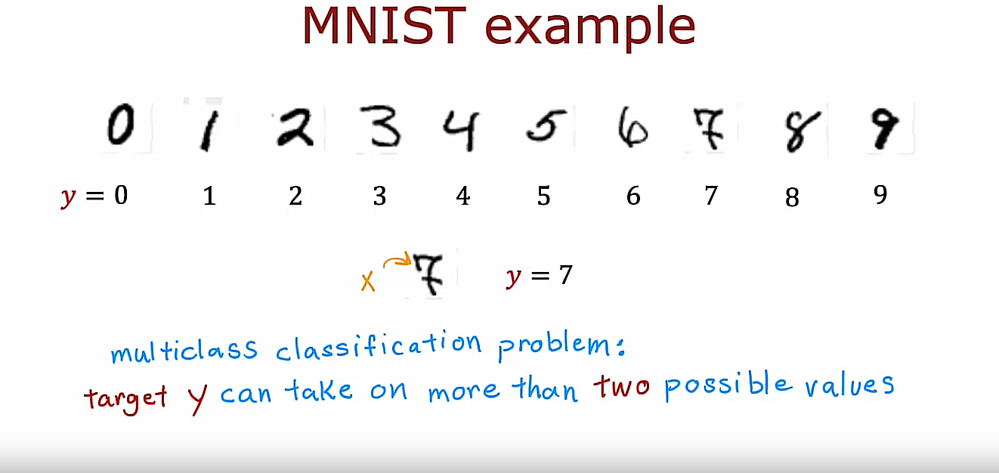

### Recalling the handwritten digit classification problem

For the handwritten digit classification problems we've looked at so far, we were just trying to distinguish between the handwritten digits 0 and 1. But if you're trying, for example, to read protocols or zip codes in an envelope, there are actually 10 possible digits you might want to recognize.

### Recalling the patient's diseases classification problem

Or alternatively, in the first course you saw the example if you're trying to classify whether patients may have any of three or five different possible diseases. That too would be a multiclass classification problem.

### Another example: Visual defect inspection classification problem

One thing I've worked on a lot is visual defect inspection of parts manufacturer in the factory where you might look at the picture of a pill that a pharmaceutical company has manufactured and try to figure out does it have a scratch effect or discoloration defects or a chip defect and this would again be multiple classes of multiple different types of defects that you could classify this pill is having. 

So, a multiclass classification problem is still a classification problem in that $y$ can take on only a small number of discrete categories. It is not any number, but now $y$ can take on more than just two possible values.

## Example

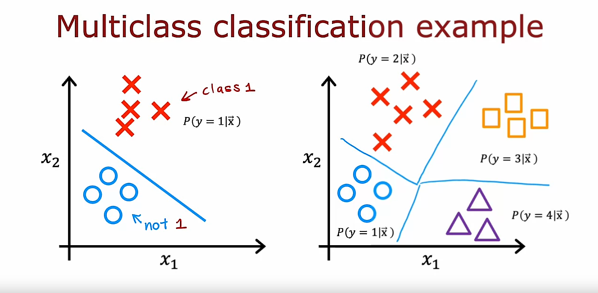

So, whereas previously for binary classification you may have had a data set like this one


with features $x_1$ and $x_2$ in which case Logistic Regression would fit the model to estimate what is the probability of $y$ being 1 given the features $x$ denoted as:

$$P(y=1|\vec{x})$$

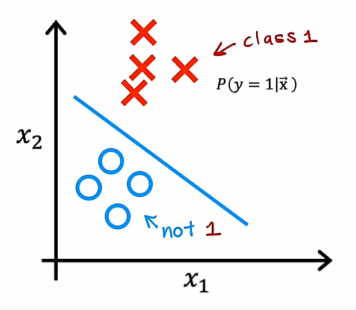

because $y$ was either 0 or 1, instead with multiclass classification problems you would instead have a data set that maybe looks like the following:

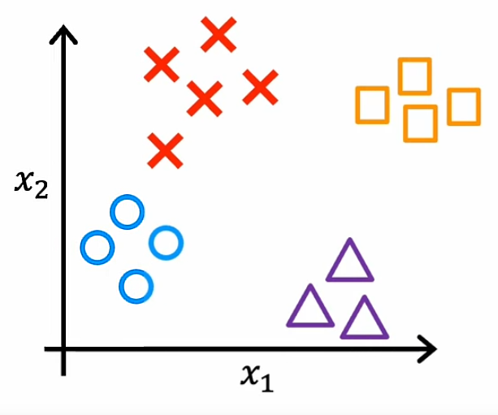

where we have 4 classes where the Os represents one class, the xs represent another class, the triangles represent the third class and the squares represent the fourth class. 

And instead of just estimating the chance of y being equal to 1, well, now we want to estimate what's the chance that y is equal to 1, or what's the chance that y is equal to 2? Or what's the chance that y is equal to 3, or the chance of y being equal to 4? 

$$P(y=1|\vec{x})$$
$$P(y=2|\vec{x})$$
$$P(y=3|\vec{x})$$
$$P(y=4|\vec{x})$$

And it turns out that the algorithm you will learn about in the next video can learn a decision boundary that maybe looks like this:

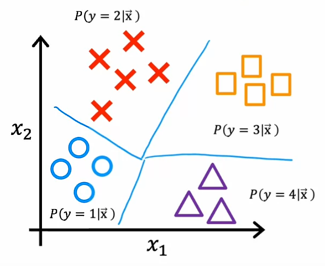

Now, we can see it divides the space exploded next to into four categories rather than just two categories. 

So that's the definition of the multiclass classification problem. 

In the next video, we'll look at the softmax regression algorithm which is a generalization of the logistic regression algorithm and using that you'll be able to carry out multiclass classification problems. And after that we'll take softmax regression and fit it into a new neural network so that you'll also be able to train a neural network to carry out multiclass classification problems

## Softmax regression algorithm

The softmax regression algorithm is a generalization of logistic regression, which is a binary classification algorithm to the multiclass classification contexts

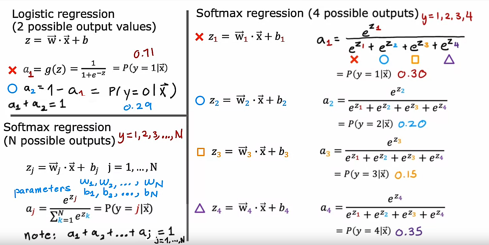

## How to specify the cost function for softmax regression

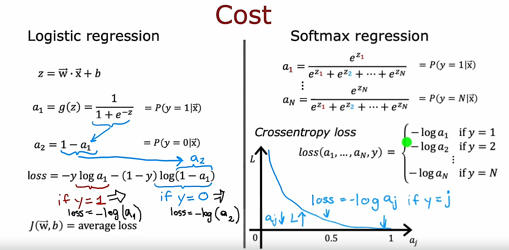

Notice that in the loss function used for Softmax Regression $y$ can take on only one value in each training example. And so you end up computing

$$loss = -log(a_j)$$

only for one value of $a_j$, which is whatever was the actual value of $y=j$ in that particular training example.

For example, if $y=2$, you will **only** end up computing $loss = -log(a_2)$ and **not** any of the other terms.

## Neural Network with Softmax output

In order to build a Neural Network that can carry out multi class classification, we're going to take the Softmax regression model and put it into essentially the output layer of a Neural Network

### Previuos handwritten digit recognition example for 2 classes
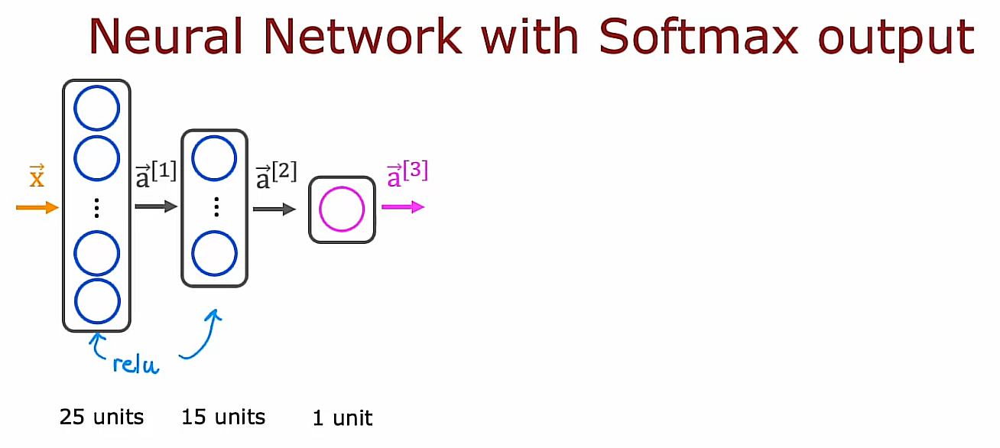

### Current handwritten digit recognition example for 10 classes
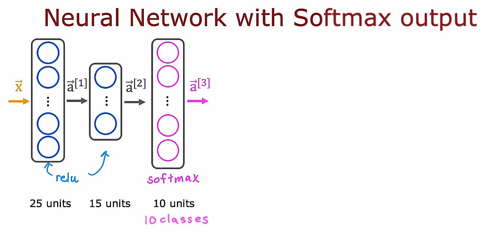

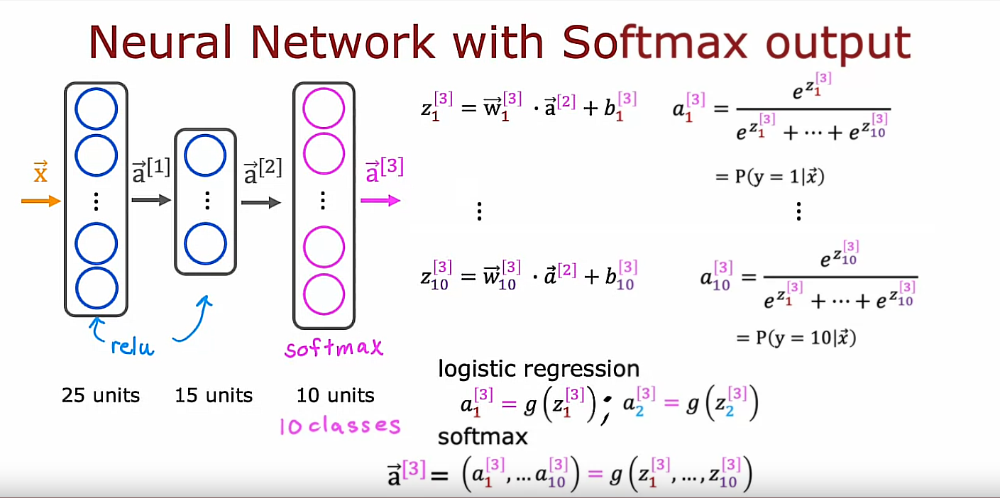

I do want to mention that the Softmax layer, sometimes also called the Softmax activation function, it is a little bit unusual in one respect compared to the other activation functions we've seen so far, like sigmoid, ReLU and linear, which is that when we're looking at sigmoid or ReLU or linear activation functions, $a_1$ was a function of $Z_1$ and $a_2$ was a function of $Z_2$ and only $Z_2$ 

In other words, to obtain the activation values, we could apply the activation function g be it sigmoid or ReLU or something else element-wise to $Z_1$ and $Z_2$ and so on to get $a_1$, $a_2$, $a_3$ and $a_4$

But with the Softmax activation function, notice that $a_1$ is a function of $Z_1$ and $Z_2$ and $Z_3$ all the way up to $Z_{10}$. 

So each of these activation values depends on all of the values of $Z$. 

And this is a property that's a bit unique to the Softmax output or the Softmax activation function or stated differently if you want to compute $a_1$ through $a_{10}$, that is a function of $Z_1$ all the way up to $Z_{10}$ simultaneously. This is unlike the other activation functions we've seen so far

## Implementation in TensorFlow

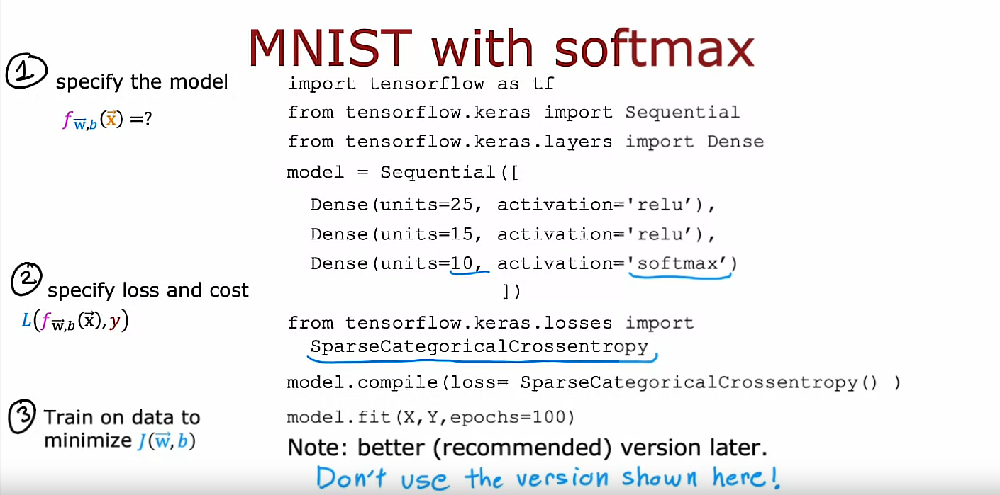

The cost function that you saw in the last video for multi class classification, Tensorflow calls that the **SparseCategoricalCrossentropy** function

Whereas for logistic regression we had the **BinaryCrossentropy** function, here we are using the SparseCategoricalCrossentropy function. 

What **sparse categorical** refers to is that you are still classifying $y$ into categories. So it's categorical. This takes on values from 1 to 10. 

**Sparse** refers to that $y$ can only take on one of these 10 values. So each image is either 0 or 1 or 2 or so on up to 9. You're not going to see a picture that is simultaneously the number two and the number seven so sparse refers to that each digit is only one of these categories. 

## TensorFlow code (Not recommended version)

If you use the code shown below, you can train a neural network on a multi class classification problem but if you use it exactly as written there, it will work but there is a better version of it that makes Tensorflow work better being able to compute these probabilities much more accurately (It will be covered in the next video)

```python
import tensorflow as tf

from tensorflow.keras import Sequential
from tensorflow.keras.layers import Dense
from tensorflow.keras.losses import SparseCategoricalCrossentropy

model = Sequential([
    Dense(units=25, activation='relu'),
    Dense(units=15, activation='relu'),
    Dense(units=10, activation='softmax')
    ])

model.compile(loss=SparseCategoricalCrossentropy())

model.fit(X, Y, epochs=100)
```

## Improved implementation of softmax

### Showing that exists a numerical roundoff error

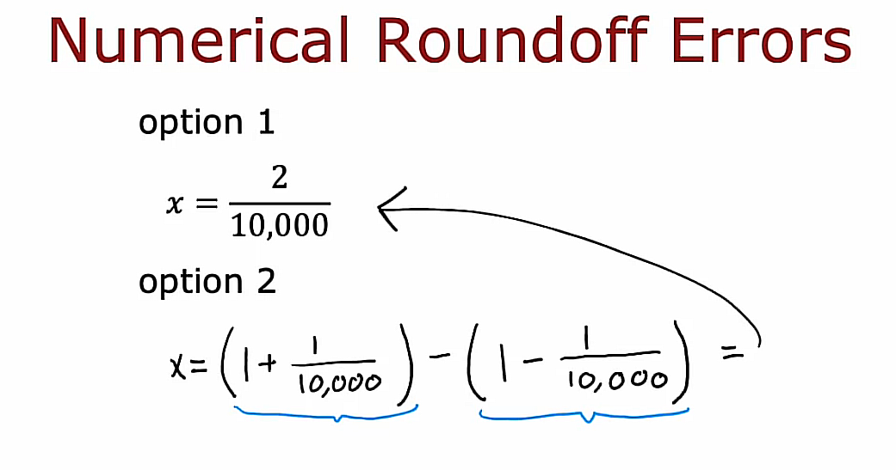

### Showing that exists a numerical roundoff error on a Jupyter Notebook

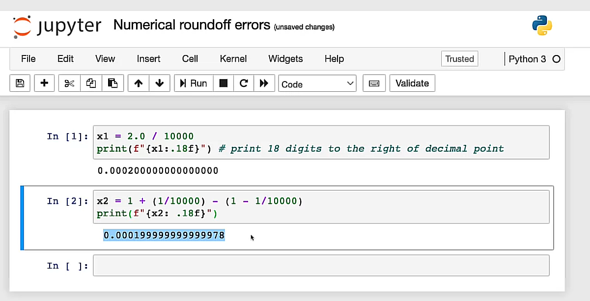

## Logistic Regression

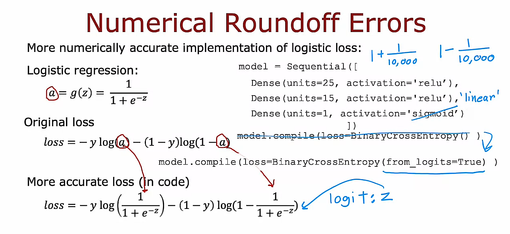

In case you're wondering what the **logits** are, it's basically this number $z$. TensorFlow will compute $z$ as an intermediate value but it can rearrange terms to make this become computed more accurately

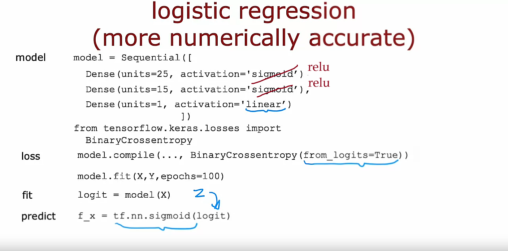

> Note: In the image shown above, you can see there is a typo repeated twice. The correct activation functions are *relu* and not *sigmoid* for the 1st and 2nd layers

Changes needed to get a better version of Tensorflow implementation code:

1. Change the output layer from *sigmoid* to *linear*
2. Add parameter *from_logits=True* to the *BinaryCrossentropy()* function
3. After fitting the model, compute *logit = model(X)* and then apply *tf.nn.sigmoid(logit)* to obtain the predictions

## Softmax

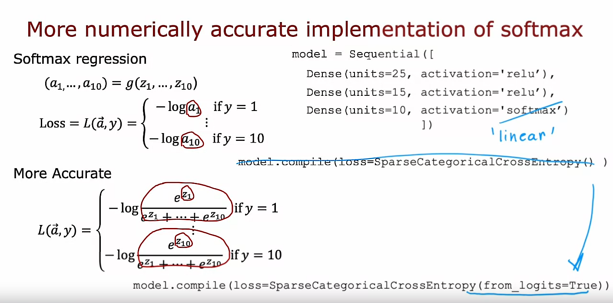

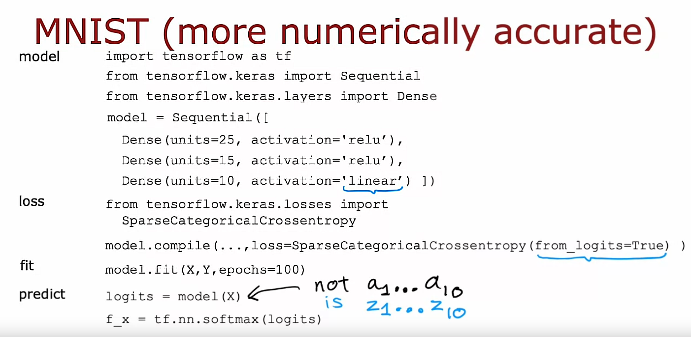

Changes needed to get a better version of Tensorflow implementation code:

1. Change the output layer from *softmax* to *linear*
2. Add parameter *from_logits=True* to the *SparseCategoricalCrossentropy()* function
3. After fitting the model, compute *logits = model(X)* and then apply *tf.nn.softmax(logits)* to obtain the predictions

## TensorFlow code (Recommended version)

```python
import tensorflow as tf

from tensorflow.keras import Sequential
from tensorflow.keras.layers import Dense
from tensorflow.keras.losses import SparseCategoricalCrossentropy

model = Sequential([
    Dense(units=25, activation='relu'),
    Dense(units=15, activation='relu'),
    Dense(units=10, activation='linear')
    ])

model.compile(..., loss=SparseCategoricalCrossentropy(from_logits=True))

model.fit(X, Y, epochs=100)

logits = model(X)

f_x = tf.nn.softmax(logits)
```

## Summary

You now know how to do multi-class classification with a softmax output layer and also how to do it in a numerically stable way

Before wrapping up **multi-class classification**, I want to share with you one other type of classification problem called a **multi-label classification** problem

## Classification with multiple outputs (Optional)

You've learned about multi-class classification, where the output label $y$ can be any one of two or potentially many more than two possible categories but there is a different type of classification problem called a multi-label classification problem, which is where associate of each image, they could be multiple labels

## Example

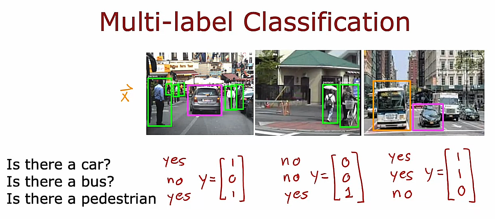

If you're building a self-driving car or maybe a driver assistance system, then given a picture of what's in front of your car, you may want to ask questions like:

- Is there a car or at least one car?
- or is there a bus? 
- or is there a pedestrian or are there any pedestrians? 

After analyzing the 3 photos shown above, we have:
- In the left photo: there is a car, there is no bus, and there is at least one pedestrian 
- In the middle photo: There are no cars, no buses and yes to pedestrians
- In the right photo: There is a car, there is a bus and there are no pedestrians

 These are examples of multi-label classification problems because associated with a single input image $\vec{X}$ are 3 different labels corresponding to whether or not there are any cars, buses, or pedestrians in the image
 
In this case, the target of the $y$ is actually a vector of 3 numbers, and this is as distinct from multi-class classification, where for say handwritten digit classification, $y$ was just a single number, even if that number could take on 10 different possible values.

## How to build a neural network for a multi-label classification problem?

One way to go about it is to just treat this as 3 completely separate machine learning problems:

You could build one neural network to decide if there are any cars, a second neural network could be one to detect buses and a third one to detect pedestrians. That's actually not an unreasonable approach. 

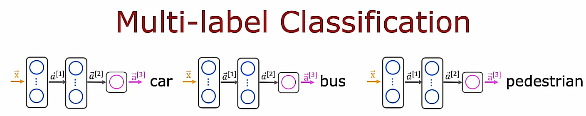

### Another approach

But there's another way to do this, which is to train a single neural network to simultaneously detect all 3 of cars, buses and pedestrians, which is, if your neural network architecture, looks like this,

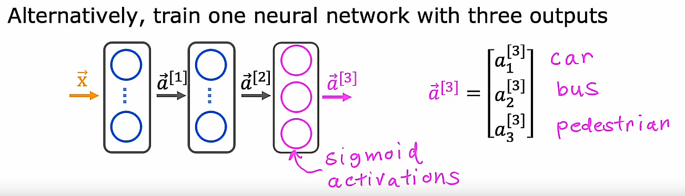

In this new approach, there's an input $\vec{X}$, a first hidden layer that outputs $\vec{a}^{[1]}$, a second hidden layer that outputs $\vec{a}^{[2]}$, and then the final output layer, in this case, will have 3 output neurons and that one will output $\vec{a}^{[3]}$, which is going to be a vector of three numbers. 

Because we're solving three binary classification problems you can use a sigmoid activation function for each of these three nodes in the output layer.

And so $\vec{a}^{[3]}$ in this case will be $a_1^{[3]}$, $a_2^{[3]}$ and $a_3^{[3]}$ corresponding to whether or not the learning algorithm thinks there is a car, a bus and/or pedestrians in the image

## Optional Lab 5 - Softmax

## Optional Lab 6 - Multiclass