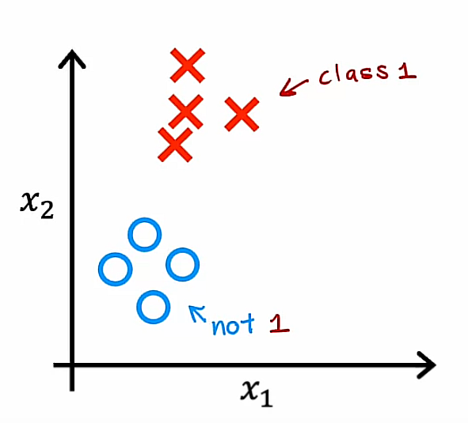

## Multiclass classification

Multiclass classification refers to classification problems where you can have more than just two possible output labels, so not just 0 or 1.

### Recalling the handwritten digit classification problem

For the handwritten digit classification problems we've looked at so far, we were just trying to distinguish between the handwritten digits 0 and 1. But if you're trying, for example, to read protocols or zip codes in an envelope, there are actually 10 possible digits you might want to recognize.

### Recalling the patient's diseases classification problem

Or alternatively, in the first course you saw the example if you're trying to classify whether patients may have any of three or five different possible diseases. That too would be a multiclass classification problem.

### Another example: Visual defect inspection classification problem

One thing I've worked on a lot is visual defect inspection of parts manufacturer in the factory where you might look at the picture of a pill that a pharmaceutical company has manufactured and try to figure out does it have a scratch effect or discoloration defects or a chip defect and this would again be multiple classes of multiple different types of defects that you could classify this pill is having. 

So, a multiclass classification problem is still a classification problem in that $y$ can take on only a small number of discrete categories. It is not any number, but now $y$ can take on more than just two possible values.

## Example

So, whereas previously for binary classification you may have had a data set like this one

with features $x_1$ and $x_2$ in which case Logistic Regression would fit the model to estimate what is the probability of $y$ being 1 given the features $x$ denoted as:

$$P(y=1|\vec{x})$$

because $y$ was either 0 or 1, instead with multiclass classification problems you would instead have a data set that maybe looks like the following:

where we have 4 classes where the Os represents one class, the xs represent another class, the triangles represent the third class and the squares represent the fourth class. 

And instead of just estimating the chance of y being equal to 1, well, now we want to estimate what's the chance that y is equal to 1, or what's the chance that y is equal to 2? Or what's the chance that y is equal to 3, or the chance of y being equal to 4? 

$$P(y=1|\vec{x})$$
$$P(y=2|\vec{x})$$
$$P(y=3|\vec{x})$$
$$P(y=4|\vec{x})$$

And it turns out that the algorithm you will learn about in the next video can learn a decision boundary that maybe looks like this:

Now, we can see it divides the space exploded next to into four categories rather than just two categories. 

So that's the definition of the multiclass classification problem. 

In the next video, we'll look at the softmax regression algorithm which is a generalization of the logistic regression algorithm and using that you'll be able to carry out multiclass classification problems. And after that we'll take softmax regression and fit it into a new neural network so that you'll also be able to train a neural network to carry out multiclass classification problems

## Softmax

