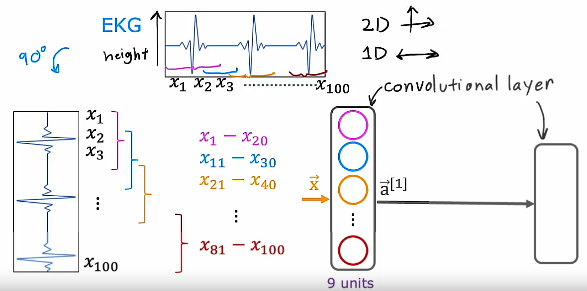

## Advanced Optimization

Gradient descent is an optimization algorithm that is widely used in machine learning and was the foundation of many algorithms like Linear Regression and Logistic /Regression and early implementations of neural networks. 

But it turns out that there are now some other optimization algorithms for minimizing the cost function that are even better than Gradient descent. 

We will take a look at an algorithm that can help to train a neural network much faster than Gradient descent: It is called *Adam algorithm*

### Recalling Gradient descent algoritm


Let's recall that the expression for one step of Gradient descent for the parameter $w$:

$$w_j = w_j - \alpha \frac{\partial }{\partial w_j}J(\vec{w}, b)$$

How can we make this work even better? In this example, we have plotted the Cost function J using a contour plot comprising these ellipsis. We know the minimum of this cost function is at the center of this ellipsis. 

Now, if you were to start Gradient descent down here (marked on graph as "start"), if $\alpha$ is small then one step of gradient descent may take you a little bit in that direction. Then another step, then another step, then another step, then another step, and you notice that every single step of gradient descent is pretty much going in the same direction. In that case, if you see this you might wonder, why don't we make $\alpha$ bigger?

Can we have an algorithm to automatically increase the value of $\alpha$? They just make it take bigger steps and get to the minimum faster. There's an algorithm called the Adam algorithm that can do that. 

Depending on how gradient descent is proceeding, sometimes you wish you had a bigger learning rate $\alpha$ and sometimes you wish you had a smaller learning rate $\alpha$.

The Adam algorithm can adjust the learning rate $\alpha$ automatically.

### Adam algorithm

Adam stands for **Ada**ptive **m**oment estimation


### Increasing $\alpha$
If it sees that the learning rate $\alpha$ is too small and we are just taking tiny little steps in a similar direction over and over, we should just make the learning rate $\alpha$ bigger. 

### Decreasing $\alpha$
In contrast taking a look at the same cost function J if we were starting here and have a relatively big learning rate $\alpha$, then maybe one step of gradient descent takes us here, in the second step takes us here, third step, and the fourth step, and the fifth step, and the sixth step, and if you see Gradient descent doing this, is oscillating back and forth. You'd be tempted to say, well, why don't we make the learning rate $\alpha$ smaller? The Adam algorithm can also do that automatically, and with a smaller learning rate, you can then take a more smooth path toward the minimum of the cost function. 


But interestingly, the Adam algorithm does not use a single global learning rate $\alpha$: Instead, it uses a different learning rate for **every single parameter** of your model. 

If you have parameters $w_1$ through $w_{10}$ as well as b, then it actually has 11 learning rate parameters

It would have $\alpha_1$, $\alpha_2$, all the way through $\alpha_{10}$ for $w_1$ to $w_{10}$, as well as $\alpha_{11}$ for the parameter $b$.

$$w_1 = w_1 - \alpha_1 \frac{\partial }{\partial w_1}J(\vec{w}, b)$$
$$...$$
$$w_{10} = w_{10} - \alpha_{10} \frac{\partial }{\partial w_{10}}J(\vec{w}, b)$$
$$b = b - \alpha_{11} \frac{\partial }{\partial b}J(\vec{w}, b)$$

## Adam algorithm's intuition


The intuition behind the Adam algorithm is:

- If a parameter $w_j$ or $b$ seems to keep on moving in roughly the same direction, let's increase the learning rate $\alpha$ for that parameter. Let's go faster in that direction. 

- Conversely, if a parameter keeps oscillating back and forth, then let's not have it keep on oscillating or bouncing back and forth. Let's reduce $\alpha_j$ for that parameter a little bit. 

The details of how Adam does this is a bit complicated and beyond the scope of this course, but if you take some more advanced deep learning courses later, you may learn more about the details of this Adam algorithm but in code this is how you implement it.


The model is exactly the same as before and the way you compile the model is very similar to what we had before except that we now added one extra argument to the *compile* function. This is the place where we specify that the **optimizer** you want to use is Adam by using: $$tf.keras.optimizers.Adam()$$ 

```python
...

model.compile(optimizer=tf.keras.optimizers.Adam(learning_rate=1e-3), loss=...)

...
```

The Adam optimization algorithm needs some initial default value for the learning rate $\alpha$

## Piece of advice for choosing this global learning rate value

In this example, I've set that initial learning rate to be $\alpha=10^{-3}$ but when using the Adam algorithm in practice, it's worth trying a few values for this default global learning rate. Try some larger and some smaller values to see what gives you the fastest learning performance.

Compared to the original gradient descent algorithm that you had learned in the previous course though, the Adam algorithm is more robust to the exact choice of learning rate that you pick because it can adapt the learning rate a bit automatically. Though there's still way tuning this parameter little bit to see if you can get somewhat faster learning.

It typically works much faster than gradient descent, and it has become a de-facto standard in how practitioners train their neural networks. If you're trying to decide what learning algorithm to use, what optimization algorithm to use to train your neural network a safe choice would be to just use the Adam optimization algorithm, and most practitioners today will use Adam rather than the optional gradient descent algorithm

## Additional Layer Types

### Recalling the Dense layer, an already known layer 

All the neural network layers with you so far have been the **Dense** layer type in which every neuron in the layer gets as its inputs all the activations from the previous layer

And it turns out that just using the Dense layer type you can actually build some pretty powerful learning algorithms.


In the Dense layer that we've been using the activation of a neuron in say the 2nd hidden layer is a function of **every single activation value** from the previous layer of $\vec{a}^{[1]}$

### New layer type: Convolutional Layer


But it turns out that for some applications, someone designing a neural network may choose to use a different type of layer. One other layer type that you may see in some work is called a convolutional layer.

For a convolutional layer, each neuron takes as input a subset of the vector that is fed into that layer.

Let me illustrate this with an example. So what I'm showing on the left is the input X. Which is a handwritten digit nine. And what I'm going to do is construct a hidden layer which will compute different activations as functions of this input image $\vec{X}$. 

But here's something I can do: For the first hidden unit, which I've drawn in blue rather than saying this neuron can look at all the pixels in this image I might say this neuron can only look at the pixels in this little rectangular region. Second neuron, which I'm going to illustrate in magenta is also not going to look at the entire input image X instead, it's only going to look at the pixels in a limited region of the image. And so on for the 3rd neuron and the 4th neuron and so on and so forth. Down to the last neuron which may be looking only at that region of the image.

### Benefits of using a Convolutional layer

So why might you want to do this? Why won't you let every neuron look at **all** the pixels but instead look at only **some** of the pixels?

Some of the benefits are: 

1. Faster computation: It speeds up computation
2. A neural network that uses this type of layer can need less training data or alternatively, it can also be less prone to overfitting. 

This is the type of layer where each neuron only looks at a region of the input image

### Author of Convolutional layers
It was a researcher John Macoun who had figured out a lot of the details of how to get convolutional layers to work and popularized their use. 

## More details: Convolutional Neural Network (CNN)


Let me illustrate in more detail a convolutional layer. 

If you have multiple convolutional layers in a neural network sometimes that's called a Convolutional Neural Network (CNN).

To illustrate the convolutional layer of convolutional neural network on this slide I'm going to use instead of a 2D image input I'm going to use a 1D input and the motivating example I'm going to use is classification of EKG signals or electrocardiograms. 

So if you put two electrodes on your chest you will record the voltages that look like this 


That graph correspond to your heartbeat. This is actually something that my Stanford research group did research on. We were actually reading EKG signals that actually looked like this to try to diagnose if patients may have a heart issue. 

So, an EKG signal and electocardiogram (called ECG in some places and EKG in others) it is just a list of numbers corresponding to the height of the surface at different points in time. So you may have say 100 numbers corresponding to the height of this curve at 100 different points of time. And the learning tosses, given this time series, given this EKG signal, to classify say whether this patient has a heart disease or some diagnosable heart conditions. 

## Building the convolutional neural network
Here's what the convolutional neural network might do. So I'm going to take the EKG signal and rotate it 90 degrees to lay it on the side and so we have here 100 inputs $x_1$, $x_2$, all the way through $x_{100}$


## 1st hidden layer
### Designing the 1st hidden unit
And when I construct the first hidden layer, instead of having the first hidden unit take as input all 100 numbers, let me have the first hidden unit look at only $x_1$ through $x_{20}$. So that corresponds to looking at just a small window of the EKG signal (Pink color on the image)


### Designing the 2nd hidden unit
For the second hidden unit, shown in a different color blue, we will look at $x_{11}$ through $x_{30}$, so looks at a different window in this EKG signal (Blue color on the image)


### Designing the 3rd hidden unit
And the third hidden unit looks at another window: $x_{21}$ through $x_{40}$ 


### Designing the final hidden unit
And for the final hidden unit in this example, we will look at $x_{81}$ through $x_{100}$ so it looks like a small window towards the end of this EKG time series. 


So, this is a convolutional layer because each unit in this layer looks at only a limited window of the input. Now, this 1st layer of the neural network has 9 units. Activations from this layer are $\vec{a}^{[1]}$. The next layer can also be a convolutional layer.



## 2nd hidden layer
### Designing the 1st hidden unit
So, in the second hidden layer, let me architect my first unit not to look at all 9 activations from the previous layer, but to look at say just the first 5 activations from the previous layer. This is from $a_1^{[1]}$ to $a_5^{[1]}$ 


### Designing the 2nd hidden unit
And then my second unit in this second hidden layer may look at just another 5 numbers, say from $a_3^{[1]}$ to $a_7^{[1]}$


### Designing the 3rd and final hidden unit
And the third and final hidden unit in this layer will only look at $a_5^{[1]}$ through $a_9^{[1]}$


## Final output layer: A Sigmoid layer

And then maybe finally these activations $\vec{a}^{[2]}$ gets inputs to a Sigmoid unit that does look at all 3 of these values of $\vec{a}^{[2]}$ in order to make a binary classification regarding the presence or absence of heart disease $\vec{a}^{[3]}$


## Summary

So, this is the example of a neural network with the 1st hidden layer being a convolutional layer, the 2nd hidden layer also being a convolutional layer and then the output layer being a Sigmoid layer. 

And it turns out that with convolutional layers you have many architecture choices such as:

- How big is the window of inputs that a single neuron should look at? 
and 
- How many neurons should each layer have?

And by choosing those architectural parameters effectively, you can build new versions of neural networks that can be even more effective than the Dense layer for some applications. 

I hope that you find this additional intuition that neural networks can have other types of layers as well to be useful. And in fact, if you sometimes hear about the latest cutting edge architectures like a transformer model or an LSTM or an attention model, a lot of this research in neural networks even today pertains to researchers trying to invent new types of layers for neural networks and plugging these different types of layers together as building blocks to form even more complex and hopefully more powerful neural networks
