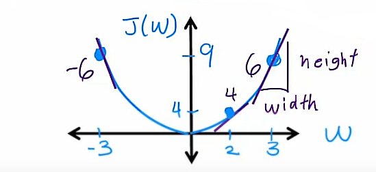
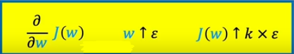
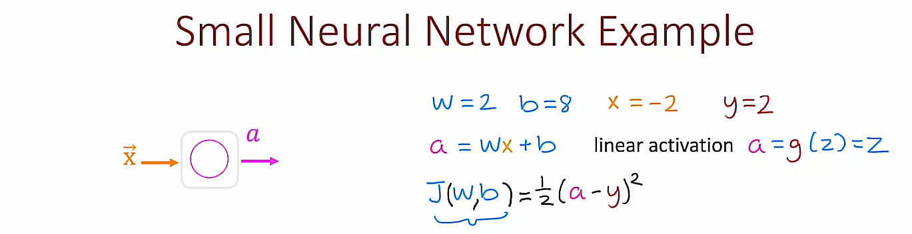
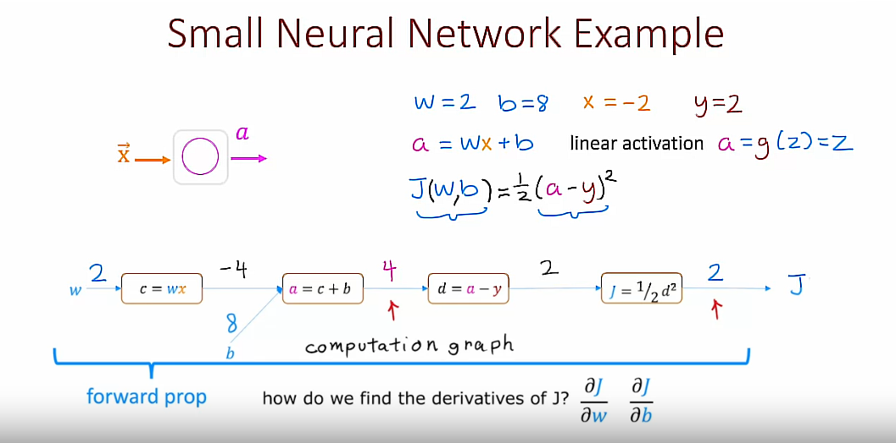
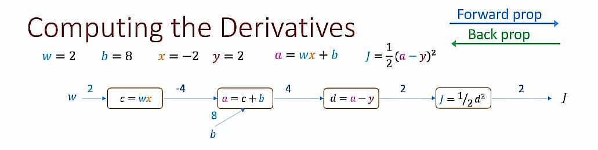

## 1. What is a derivative? (Optional)

You've seen how in TensorFlow you can specify a neural network architecture to compute the output $y$ as a function of the input $\vec{X}$ and also specify a cost function, and TensorFlow will then automatically use back propagation to compute derivatives and use Gradient descent or Adam to train the parameters of a neural network. 

The backpropagation algorithm, which computes derivatives of your cost function with respect to the parameters, is a key algorithm in neural network learning. 

But how does it actually work?

In this and in the next few optional videos, we will try to take a look at how backpropagation computes derivatives.

## Derivative example


Having the cost function $J(w)=w^2$ (assuming $b$=0) 

Say $w$=3, then $J(3)=3^2=9$

### Example 1: $\epsilon = 0.001$

If we increase $w$ by a tiny amount $\epsilon = 0.001$, how does $J(w)$ change?

$$\hat{w}=w + \epsilon$$
$$\hat{w}=3 + 0.001$$
$$\hat{w}=3.001$$

Then

$$J(\hat{w})=(\hat{w})^2=3.001^2=9.006001$$

So, 

$$k=\frac{J(\hat{w})-J(w)}{\epsilon}=\frac{9.006001-9}{0.001}=\frac{0.006001}{0.001}=6.001$$

Finally, 

$$k=\frac{\partial }{\partial w}J(w)=6$$

What does it mean?

It means that if we increase the value of $w$ by a tiny amount $\epsilon$, then J(w) also increases and by roughly an amount of 6 times $\epsilon$

### Example 2: $\epsilon = 0.002$

If we increase $w$ by a tiny amount $\epsilon = 0.002$, how does $J(w)$ change?

$$\hat{w}=w + \epsilon$$
$$\hat{w}=3 + 0.002$$
$$\hat{w}=3.002$$

Then

$$J(\hat{w})=(\hat{w})^2=3.002^2=9.012004$$

So, 

$$k=\frac{J(\hat{w})-J(w)}{\epsilon}=\frac{9.012004-9}{0.002}=\frac{0.012004}{0.002}=6.002$$

Finally, 

$$k=\frac{\partial }{\partial w}J(w)=6$$

What does it mean?

In this case what we conclude is that if $w$ goes up by 0.002 then $J(w)$ goes up by roughly 6 times 0.002. It goes up roughly to 9.012, and this 0.012 is roughly 6 times 0.002

>Note: Once again, we see this 6:1 ratio between how much $w$ goes up vs how much $J(w)$ goes up. That's why the derivative of $J(w)$ with respect to $w$ is equal to 6

## Informal Definition of Derivative


You might remember when implementing Gradient descent you will repeatedly use this rule to update the parameter $w_j$:

$$w_j=w_j - \alpha\frac{\partial }{\partial w_j}J(\vec{w}, b)$$

where $\alpha$ is the learning rate

What does Gradient descent do? 

Notice that:

- If the derivative term is small, then this update step will make a small update to the parameter $w_j$

    whereas

- If this derivative term is large, this will result in a big change to the parameter $w_j$

All of this makes sense because this is essentially saying that if the derivative is small, this means that changing $w$ doesn't make a big difference to the value of $J$ and so let's not bother to make a huge change to $w_j$

But if the derivative is large, that means that even a tiny change the $w_j$ can make a big difference in how much you can change or decrease the cost function $J(w)$ so, in that case, let's make a bigger change to $w_j$, because doing so will actually make a big difference to how much we can reduce the cost function $J$.

## More derivative examples


### Example 3: $\epsilon = 0.001$ and $w=-3$

If we increase $w=-3$ by a tiny amount $\epsilon = 0.001$, how does $J(w)$ change?

$$\hat{w}=w + \epsilon$$
$$\hat{w}=-3 + 0.001$$
$$\hat{w}=-2.999$$

Then

$$J(\hat{w})=(\hat{w})^2=(-2.999)^2=8.994001$$

So, 

$$k=\frac{J(\hat{w})-J(w)}{\epsilon}=\frac{8.994001-9}{0.001}=\frac{-0.005999}{0.001}=-5.999\approx-6$$

Finally, 

$$k=\frac{\partial }{\partial w}J(w)=-6$$

What does it mean?

In this case what we conclude is that if $w=-3$ goes up by a tiny amount $\epsilon=0.001$, then $J(w)=w^2$:

- goes up by roughly -6 times $\epsilon$. This can be expressed as: J(w) $&uarr;$ -6 $\epsilon$

    or, which is the same,

- goes down by roughly 6 times $\epsilon$. This can be expressed as: J(w) $&darr;$ 6 $\epsilon$

### About the $J(w)$ vs $w$ plot



If you've taken a class in Calculus at some point, you may recognize that the derivatives corresponds to the slope of a line that just touches the function $J(w)$ at this point, say where $w=3$. Also, the slope of this line at this specific point can be calculated as $slope=\frac{height}{width}$

It turns out to be equal to $slope=6$ when $w=3$. Also, the slope of this line turns out to be $slope=4$ when $w=2$ and the slope of this line turns out to be $slope=-6$ when $w=-3$

It turns out in Calculus, the slope of these lines correspond to the derivative of the function

## Even more derivative examples (Part 1/2)


### Using Sympy

#### Example 1: $J(w)=w^2$


#### Code
```python
import sympy

J, w = sympy.symbols('J,w')

J = w**2 
# J = w**3
# J = w 
# J = 1/w

dJ_dw = sympy.diff(J, w)

subs = dJ_dw.subs([(w, 2)])
```

#### Example 2: $J(w)=\frac{1}{w}$


## Even more derivative examples (Part 2/2)




I hope that with these examples you have a sense of what the derivative of $J(w)$ with respect to $w$ means. It just as if $w$ goes up by $\epsilon$, how much does $J(w)$ go up? Answer is: It goes up by some constant $k$ times $\epsilon$. This constant $k$ is the derivative. The value of $k$ will depend both on what is the function $J(w)$ as well as what is the value of $w$

### About derivative notation


#### For one variable
$$\frac{d}{dw}J(w)$$

#### For multiple variables
$$\frac{\partial }{\partial w_i}J(w_1, w_2, ..., w_n)$$

2 more simplified abbreviated forms of this expression from above:

$$\frac{\partial J}{\partial w_i} \quad \frac{\partial }{\partial w_i}J$$

## Summary

I hope that gives you a sense of what are derivatives: It's just if $w$ goes up by a little amount $\epsilon$, how much does $J(w)$ change as a consequence?

Next, let's take a look at how you can compute derivatives in a neural network. To do so, we need to take a look at something called a *computation graph*

## 2. Computation graph (Optional)

The computation graph is a key idea in Deep Learning, and it is also how programming frameworks like TensorFlow automatic compute derivatives of your neural networks. Let's take a look at how it works

### Example
Let me illustrate the concept of a computation graph with a small neural network example. 


This neural network has just 1 layer, which is also the output layer, and just 1 unit in the output layer. 

It takes as inputs $\vec{X}$, applies a Linear activation function and outputs the activation $a$. More specifically this output is expressed as: $$a=wx + b \quad \text{Linear activation}$$

$$a=g(z)=z$$

This is basically Linear Regression but expressed as a neural network with 1 output unit.

Given the output, the Cost function $J(w, b)$ is then 

$$J(w, b)=\frac{1}{2}(a-y)^2$$

where 
- $a$ is the predicted value
- $y$ is the actual observed value

For this small example, we are only going to have a single training example $(m=1)$, where the training example is:

- The input $x=-2$
- The ground truth output value $y=2$

    | # | x | y |
    |---|---|---|
    | 1 | -2| 2 |

- The parameters of this network are:
    - $w=2$ 
    - $b=8$

What I would like to do is show how the computation of the Cost function $J(w, b)$ can be computed step by step using a *computation graph*. Just as a reminder, when learning, we like to view the Cost function $J(w, b)$ as a function of the parameters $w$ and $b$



## Computation graph for the cost function J(w, b)

Let's take the computation of $J(w, b)$ and break it down into individual steps. 

### 1st step: Compute $c=wx$
First, you have the parameter $w$ that is an input to the Cost function $J(w, b)$ and then we first need to compute $wx$. Let me just call that $c=wx$.

Also, we have $w=2$ and $x=-2$ and so $$c=wx$$ $$c=2*(-2)$$ $$c=-4$$

### 2nd step: Compute $a=wx+b=c+b$
The next step is then to compute $a=wx+b=c+b$. This needs to input $b$, the other parameter that is input to the Cost function $J(w, b)$ $$a=wx+b$$ $$a=c+b$$ $$a=-4+8$$ $$a=4$$
This is starting to build up a computation graph in which the steps we need to compute the Cost function $J(w, b)$ are broken down into smaller steps. 

### 3rd step: Compute $d=a-y$
The next step is to then compute $d=a-y$

We have $y=2$ and $a=4$ so $$d=a-y$$ $$d=4-2$$ $$d=2$$

### 4th step: Compute Cost function J(w, b)
Then finally, we compute J, the cost function as $$J(w, b)=\frac{1}{2}(a-y)^2$$ or $$J(w, b)=\frac{1}{2}d^2$$
We have $d=2$ so, 

$$J(w, b)=\frac{1}{2}2^2$$
$$J(w, b)=2$$

What we've just done is build up a computation graph. This is a graph, not in a sense of plots with $x$ and $y$ axes but this is the other sense of the word graph using computer science, which is that this is a set of nodes that is connected by edges or connected by arrows in this case

So, this computation graph shows the **forward prop** step of how we compute the output $a$ of the neural network. But then also go further than that so also compute the value of the cause function $J(w, b)$ 



The question now is, how do we find the derivative of $J$ with respect to the parameters $w$ and $b$? 

$$\frac{\partial J}{\partial w} \quad \text{and } \frac{\partial J}{\partial b}$$

Let's take a look at that next.



Here's the computation graph from the previous slide and we've completed forward propagation where we've computed that $J$, the cost function $J=2$ through all these steps going from left to right (forward prop) in the computation graph. 

## Backward Propagation (backprop)
What we'd like to do now is compute the derivative of $J$ with respect to $w$ and the derivative of $J$ with respect to $b$. It turns out that whereas forward prop was a left to right calculation, computing the derivatives will be a right to left calculation, which is why it's called **backprop**, was going backwards from right to left. 

### Backprop 1st step
The final computation nodes of this graph is this one over here, which computes J equals 1/2 of d squared. The first step of backprop will ask if the value of d, which was the input to this node where the change a little bit. How much does the value of j change? Specifically, will ask if d were to go up by a little bit, say 0.001, and that'll be our value of Epsilon in this case, how would the value of j change? It turns out in this case if d goes from 2-2.01, then j goes from 2-2.02.