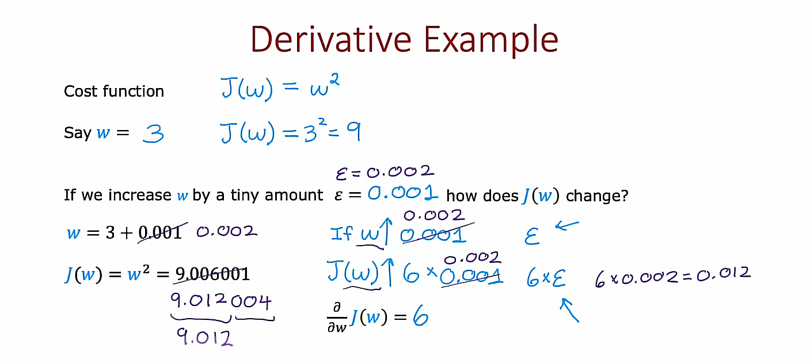
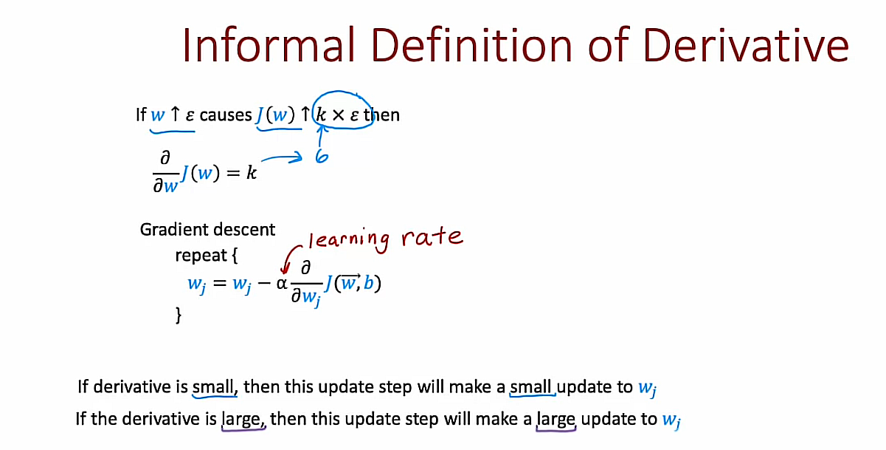
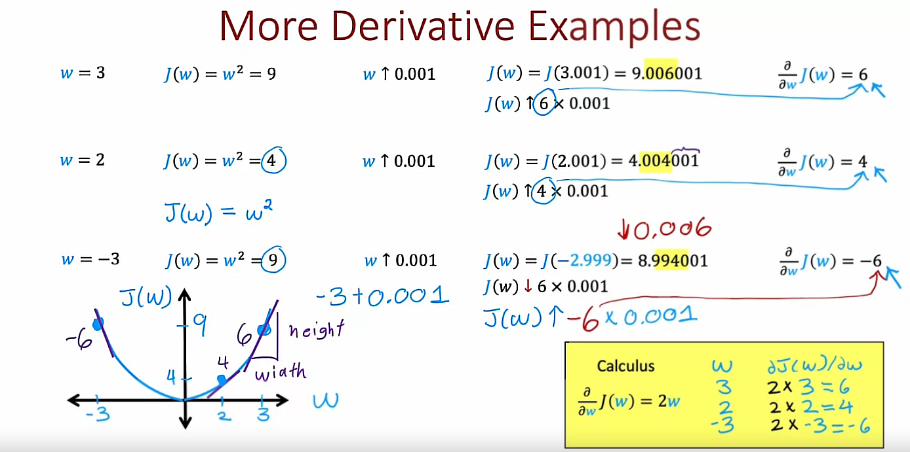
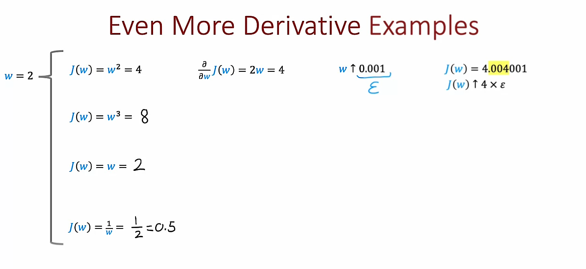
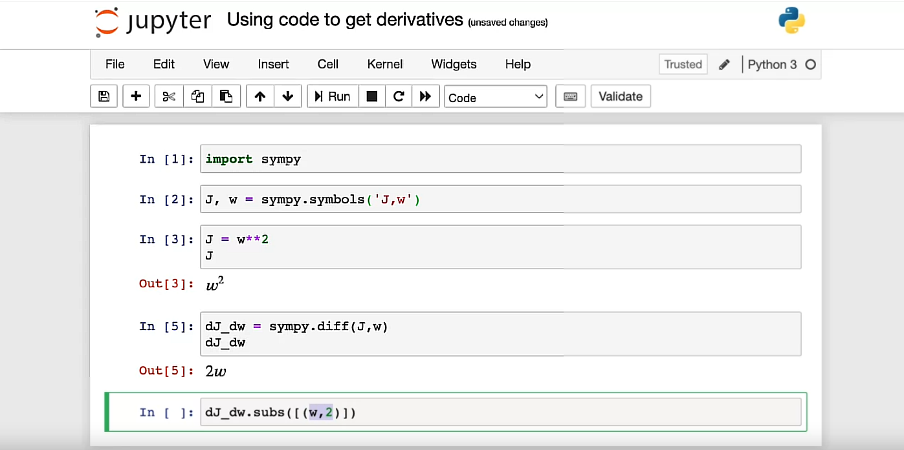
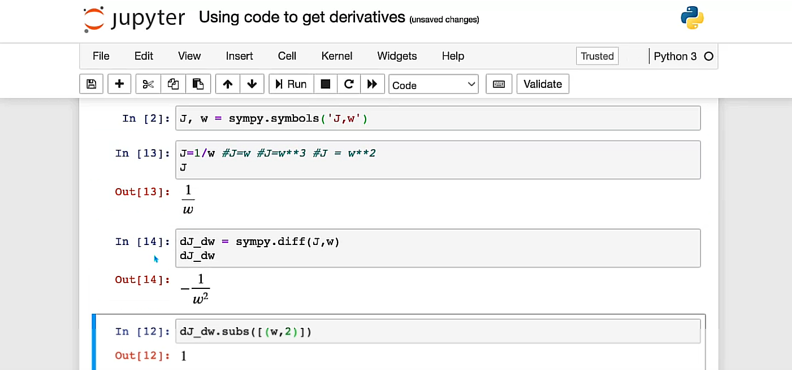
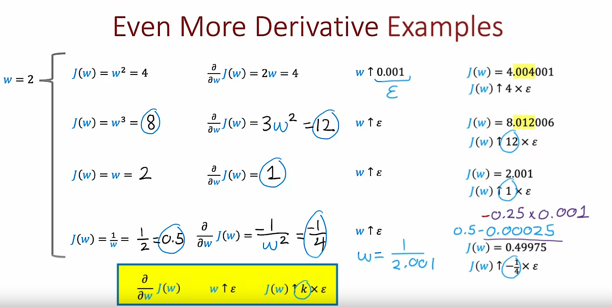
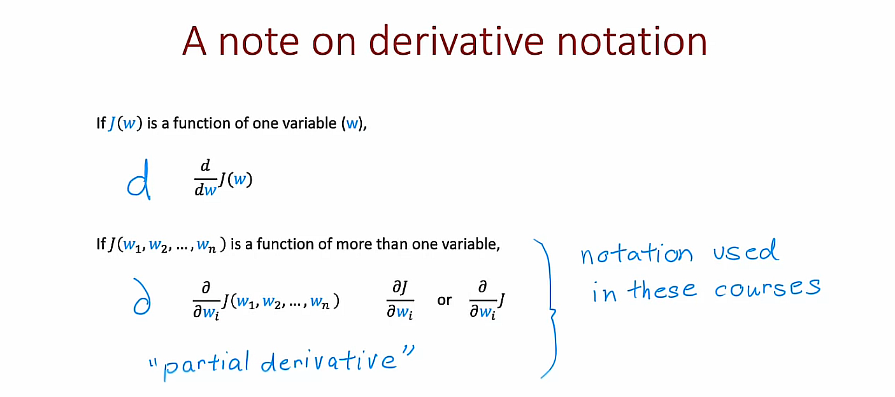

## 1. What is a derivative? (Optional)

You've seen how in TensorFlow you can specify a neural network architecture to compute the output y as a function of the input x, and also specify a cost function, and TensorFlow will then automatically use back propagation to compute derivatives and use gradient descent or Adam to train the parameters of a neural network. 

The backpropagation algorithm, which computes derivatives of your cost function with respect to the parameters, is a key algorithm in neural network learning. But how does it actually work?









### Using Sympy

#### Example 1: $J(w)=w^2$


#### Code
```python
import sympy

J, w = sympy.symbols('J,w')

J = w**2 
# J = w**3
# J = w 
# J = 1/w

dJ_dw = sympy.diff(J, w)

subs = dJ_dw.subs([(w, 2)])
```

#### Example 2: $J(w)=\frac{1}{w}$




### About derivative notation


#### For one variable
$$\frac{d}{dw}J(w)$$

#### For multiple variables
$$\frac{\partial }{\partial w_i}J(w_1, w_2, ..., w_n)$$

## 2. Computation graph (Optional)
