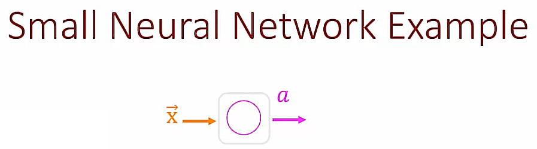
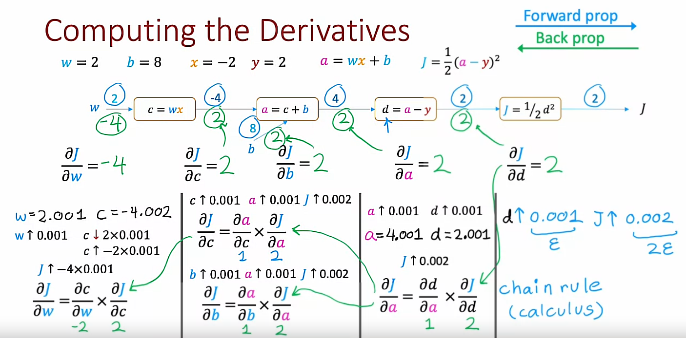
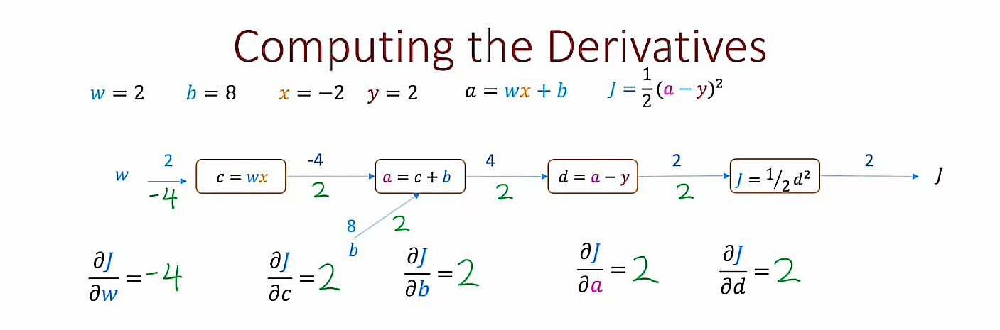
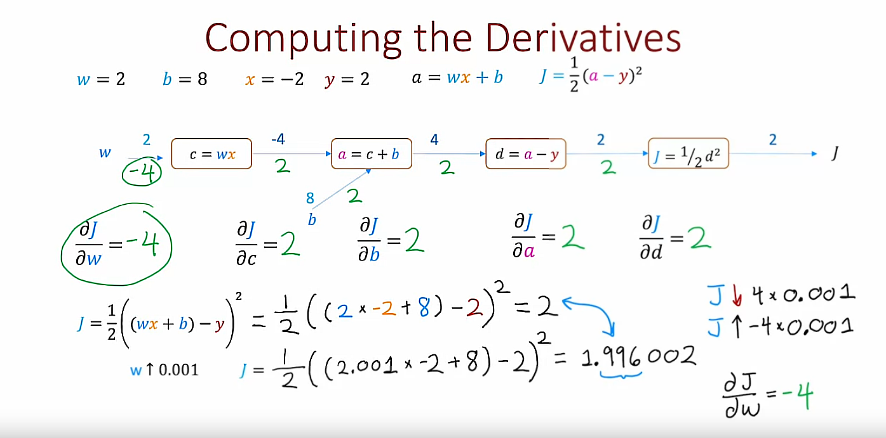
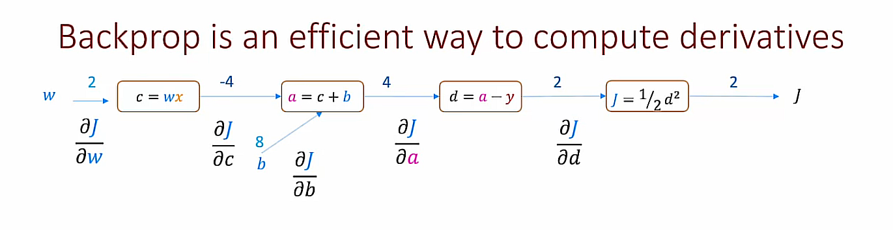
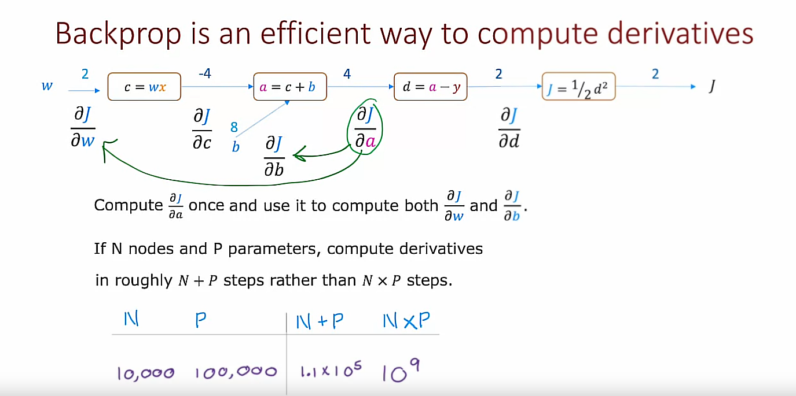
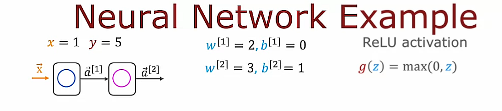
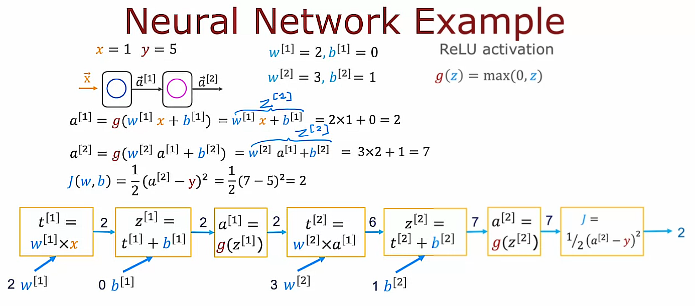
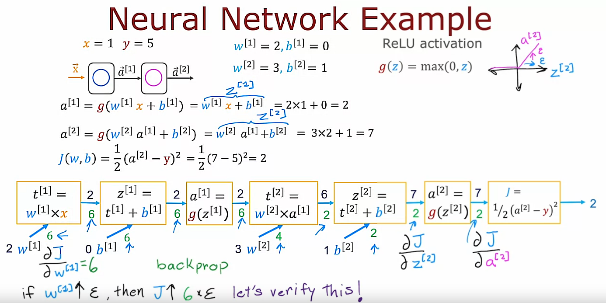
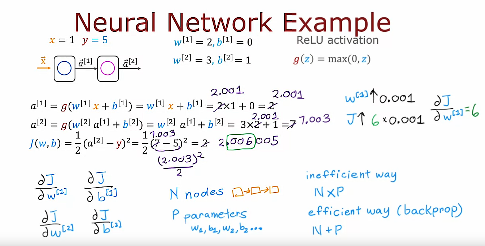

## 1. What is a derivative? (Optional)

You've seen how in TensorFlow you can specify a neural network architecture to compute the output $y$ as a function of the input $\vec{X}$ and also specify a cost function, and TensorFlow will then automatically use back propagation to compute derivatives and use Gradient descent or Adam to train the parameters of a neural network. 

The backpropagation algorithm, which computes derivatives of your cost function with respect to the parameters, is a key algorithm in neural network learning. 

But how does it actually work?

In this and in the next few optional videos, we will try to take a look at how backpropagation computes derivatives.

## Derivative example


Having the cost function $J(w)=w^2$ (assuming $b$=0) 

Say $w$=3, then $J(3)=3^2=9$

### Example 1: $\epsilon = 0.001$

If we increase $w$ by a tiny amount $\epsilon = 0.001$, how does $J(w)$ change?

$$ \hat{w}=w + \epsilon $$

$$\hat{w}=3 + 0.001$$

$$\hat{w}=3.001$$

Then

$$J(\hat{w})=(\hat{w})^2=3.001^2=9.006001$$

So, 

$$k=\frac{J(\hat{w})-J(w)}{\epsilon}=\frac{9.006001-9}{0.001}=\frac{0.006001}{0.001}=6.001$$

Finally, 

$$k=\frac{\partial }{\partial w}J(w)=6$$

What does it mean?

It means that if we increase the value of $w$ by a tiny amount $\epsilon$, then J(w) also increases and by roughly an amount of 6 times $\epsilon$

### Example 2: $\epsilon = 0.002$

If we increase $w$ by a tiny amount $\epsilon = 0.002$, how does $J(w)$ change?

$$\hat{w}=w + \epsilon$$
$$\hat{w}=3 + 0.002$$
$$\hat{w}=3.002$$

Then

$$J(\hat{w})=(\hat{w})^2=3.002^2=9.012004$$

So, 

$$k=\frac{J(\hat{w})-J(w)}{\epsilon}=\frac{9.012004-9}{0.002}=\frac{0.012004}{0.002}=6.002$$

Finally, 

$$k=\frac{\partial }{\partial w}J(w)=6$$

What does it mean?

In this case what we conclude is that if $w$ goes up by 0.002 then $J(w)$ goes up by roughly 6 times 0.002. It goes up roughly to 9.012, and this 0.012 is roughly 6 times 0.002

>Note: Once again, we see this 6:1 ratio between how much $w$ goes up vs how much $J(w)$ goes up. That's why the derivative of $J(w)$ with respect to $w$ is equal to 6

## Informal Definition of Derivative


You might remember when implementing Gradient descent you will repeatedly use this rule to update the parameter $w_j$:

$$w_j=w_j - \alpha\frac{\partial }{\partial w_j}J(\vec{w}, b)$$

where $\alpha$ is the learning rate

What does Gradient descent do? 

Notice that:

- If the derivative term is small, then this update step will make a small update to the parameter $w_j$

    whereas

- If this derivative term is large, this will result in a big change to the parameter $w_j$

All of this makes sense because this is essentially saying that if the derivative is small, this means that changing $w$ doesn't make a big difference to the value of $J$ and so let's not bother to make a huge change to $w_j$

But if the derivative is large, that means that even a tiny change the $w_j$ can make a big difference in how much you can change or decrease the cost function $J(w)$ so, in that case, let's make a bigger change to $w_j$, because doing so will actually make a big difference to how much we can reduce the cost function $J$.

## More derivative examples


### Example 3: $\epsilon = 0.001$ and $w=-3$

If we increase $w=-3$ by a tiny amount $\epsilon = 0.001$, how does $J(w)$ change?

$$\hat{w}=w + \epsilon$$
$$\hat{w}=-3 + 0.001$$
$$\hat{w}=-2.999$$

Then

$$J(\hat{w})=(\hat{w})^2=(-2.999)^2=8.994001$$

So, 

$$k=\frac{J(\hat{w})-J(w)}{\epsilon}=\frac{8.994001-9}{0.001}=\frac{-0.005999}{0.001}=-5.999\approx-6$$

Finally, 

$$k=\frac{\partial }{\partial w}J(w)=-6$$

What does it mean?

In this case what we conclude is that if $w=-3$ goes up by a tiny amount $\epsilon=0.001$, then $J(w)=w^2$:

- goes up by roughly -6 times $\epsilon$. This can be expressed as: J(w) $&uarr;$ -6 $\epsilon$

    or, which is the same,

- goes down by roughly 6 times $\epsilon$. This can be expressed as: J(w) $&darr;$ 6 $\epsilon$

### About the $J(w)$ vs $w$ plot


If you've taken a class in Calculus at some point, you may recognize that the derivatives corresponds to the slope of a line that just touches the function $J(w)$ at this point, say where $w=3$. Also, the slope of this line at this specific point can be calculated as $slope=\frac{height}{width}$

It turns out to be equal to $slope=6$ when $w=3$. Also, the slope of this line turns out to be $slope=4$ when $w=2$ and the slope of this line turns out to be $slope=-6$ when $w=-3$

It turns out in Calculus, the slope of these lines correspond to the derivative of the function

## Even more derivative examples (Part 1/2)


### Using Sympy

#### Example 1: $J(w)=w^2$


#### Code
```python
import sympy

J, w = sympy.symbols('J,w')

J = w**2 
# J = w**3
# J = w 
# J = 1/w

dJ_dw = sympy.diff(J, w)

subs = dJ_dw.subs([(w, 2)])
```

#### Example 2: $J(w)=\frac{1}{w}$


## Even more derivative examples (Part 2/2)


I hope that with these examples you have a sense of what the derivative of $J(w)$ with respect to $w$ means. It just as if $w$ goes up by $\epsilon$, how much does $J(w)$ go up? Answer is: It goes up by some constant $k$ times $\epsilon$. This constant $k$ is the derivative. The value of $k$ will depend both on what is the function $J(w)$ as well as what is the value of $w$

### About derivative notation


#### For one variable
$$\frac{d}{dw}J(w)$$

#### For multiple variables
$$\frac{\partial }{\partial w_i}J(w_1, w_2, ..., w_n)$$

2 more simplified abbreviated forms of this expression from above:

$$\frac{\partial J}{\partial w_i} \quad \frac{\partial }{\partial w_i}J$$

## Summary

I hope that gives you a sense of what are derivatives: It's just if $w$ goes up by a little amount $\epsilon$, how much does $J(w)$ change as a consequence?

Next, let's take a look at how you can compute derivatives in a neural network. To do so, we need to take a look at something called a *computation graph*

## 2. Computation graph (Optional)

The computation graph is a key idea in Deep Learning, and it is also how programming frameworks like TensorFlow automatic compute derivatives of your neural networks. Let's take a look at how it works

### Example
Let me illustrate the concept of a computation graph with a small neural network example. 



This neural network has just 1 layer, which is also the output layer, and just 1 unit in the output layer. 

It takes as inputs $\vec{X}$, applies a Linear activation function and outputs the activation $a$. More specifically this output is expressed as: $$a=wx + b \quad \text{Linear activation}$$

$$a=g(z)=z$$

This is basically Linear Regression but expressed as a neural network with 1 output unit.

Given the output, the Cost function $J(w, b)$ is then 

$$J(w, b)=\frac{1}{2}(a-y)^2$$

where 
- $a$ is the predicted value
- $y$ is the actual observed value

For this small example, we are only going to have a single training example $(m=1)$, where the training example is:

- The input $x=-2$
- The ground truth output value $y=2$

    | # | x | y |
    |---|---|---|
    | 1 | -2| 2 |

- The parameters of this network are:
    - $w=2$ 
    - $b=8$

What I would like to do is show how the computation of the Cost function $J(w, b)$ can be computed step by step using a *computation graph*. Just as a reminder, when learning, we like to view the Cost function $J(w, b)$ as a function of the parameters $w$ and $b$


## Computation graph for the cost function J(w, b)

Let's take the computation of $J(w, b)$ and break it down into individual steps. 

### 1st step: Compute $c=wx$
First, you have the parameter $w$ that is an input to the Cost function $J(w, b)$ and then we first need to compute $wx$. Let me just call that $c=wx$.

Also, we have $w=2$ and $x=-2$ and so $$c=wx$$ $$c=2*(-2)$$ $$c=-4$$

### 2nd step: Compute $a=wx+b=c+b$
The next step is then to compute $a=wx+b=c+b$. This needs to input $b$, the other parameter that is input to the Cost function $J(w, b)$ $$a=wx+b$$ $$a=c+b$$ $$a=-4+8$$ $$a=4$$
This is starting to build up a computation graph in which the steps we need to compute the Cost function $J(w, b)$ are broken down into smaller steps. 

### 3rd step: Compute $d=a-y$
The next step is to then compute $d=a-y$

We have $y=2$ and $a=4$ so $$d=a-y$$ $$d=4-2$$ $$d=2$$

### 4th step: Compute Cost function J(w, b)
Then finally, we compute J, the cost function as $$J(w, b)=\frac{1}{2}(a-y)^2$$ or $$J(w, b)=\frac{1}{2}d^2$$
We have $d=2$ so, 

$$J(w, b)=\frac{1}{2}2^2$$
$$J(w, b)=2$$

What we've just done is build up a computation graph. This is a graph, not in a sense of plots with $x$ and $y$ axes but this is the other sense of the word graph using computer science, which is that this is a set of nodes that is connected by edges or connected by arrows in this case

So, this computation graph shows the **forward prop** steps of how we compute the output $a$ of the neural network. But then also go further than that so also compute the value of the cost function $J(w, b)$ 


The question now is, how do we find the derivative of $J$ with respect to the parameters $w$ and $b$? 

$$\frac{\partial J}{\partial w} \quad \text{and } \frac{\partial J}{\partial b}$$

Let's take a look at that next.


Here's the computation graph from the previous slide and we've completed forward propagation where we've computed that $J$, the cost function $J=2$ through all these steps going from left to right (forward prop) in the computation graph. 

## Backward Propagation (backprop)
What we'd like to do now is compute the derivative of $J$ with respect to $w$ and the derivative of $J$ with respect to $b$. 

$$\frac{\partial J}{\partial w} \quad \text{and} \quad \frac{\partial J}{\partial b}$$

It turns out that whereas forward prop was a left to right calculation, computing the derivatives will be a right to left calculation, which is why it's called **backprop**, was going backwards from right to left. 

The final computation node of this graph is this one over here, which computes $$J(w, b)=\frac{1}{2}d^2$$

## Backward Propagation (backprop)
### Backprop: 1st step
The first step of backprop will ask if the value of $d$, which was the input to this node where the change a little bit, How much does the value of $J$ change? Specifically, it will ask if $d$ were to go up by a little bit, say 0.001, and that'll be our value of $\epsilon$ in this case, how would the value of $J$ change? It turns out in this case if $d$ goes from $d=2$ to $d=2.001$, then $J$ goes from $J=2$ to $J=2.002$

So, if $d$ goes up by $\epsilon$, then $J$ goes up by roughly 2 x $\epsilon$ which can be expressed as: 

If $d$ $&uarr;$ $\epsilon$, $J(w)$ $&uarr;$ 2 $\epsilon$

We conclude that the derivative of $J$ with respect to this value $d$ that is inputted this final node is equal to 2:

$$\frac{\partial J}{\partial d} = 2$$

So, the first step of backprop would be to fill in this value 2 over here, where this value is the derivative of $J$ with respect to this input value $d$. We know if $d$ changes a little bit, $J$ changes by twice as much because this derivative is equal to 2. 

### Backprop: 2nd step
The next step is to look at the node before that and ask what is the derivative of $J$ with respect to $a$? 

$$\frac{\partial J}{\partial a} = ?$$

To answer that, we have to ask, if $a$ goes up by $\epsilon=0.001$, how does that change $J$? 

If $a$ $&uarr;$ $\epsilon=0.001$, how does $J$ change? 

Well, we know that if $a$ goes up by $\epsilon=0.001$, $d$ is just $d=a-y$ and $y=2$

If $a$ becomes $a=4.001$, $d$ which is $d=a-y$ becomes into $d=4.001-2$, so $d$ becomes $d=2.001$

So, $a$ goes up by 0.001, $d$ also goes up by 0.001. 

But we'd already concluded previously that the $d$ goes up by 0.001, $J$ goes up by twice as much. 

Now we know if $a$ goes up by 0.001, $d$ goes up by 0.001, then $J$ goes up roughly by two times 0.001

This tells us that the derivative of $J$ with respect to $a$ is also equal to two.

$$\frac{\partial J}{\partial a} = 2$$

So I'm going to fill in that value over here. That this is the derivative of $J$ with respect to $a$. Just as this was the derivative of $J$ respect to $d$ 

#### Chain rule for this 2nd step
If you've taken a Calculus class before and if you've heard of the chain rule, you might recognize that this step of computation that I just did is actually relying on the chain rule for Calculus. If you're not familiar with the chain rule, don't worry about it. You won't need to know it for the rest of these videos. 

But if you have seen the chain rule, you might recognize that the derivative of $J$ with respect to $a$ is asking how much does $d$ change respect to $a$ times the derivative of $J$ with respect to $d$ which can be expressed as:

$$\frac{\partial J}{\partial a} = \frac{\partial d}{\partial a} * \frac{\partial J}{\partial d}$$

And does little calculation on top showed that the partial of $d$ with respect to $a$ is 1:

$$\frac{\partial d}{\partial a} = 1$$

and we showed previously that the derivative of $J$ with respect to $d$ is equal to 2:

$$\frac{\partial J}{\partial d} = 2$$

Finally, this is why the derivative of $J$ with respect to $a$ is 

$$\frac{\partial J}{\partial a} = 1 * 2 = 2$$

That's the value we got before entering this chain rule section

But again, if you're not familiar with the chain rule, don't worry about it. The logic that we just went through here is why we know $J$ goes up by twice as much as $a$ does and that's why this derivative term is equal to 2. 

### Backprop: 3rd step
The next step then is to keep on going right to left as we do in backprop

And we will ask how much does a little change in $c$ cause $J$ to change? and we will ask how much does a little  change in $b$ cause $J$ to change? What we need to figure out can be expressed as follows:

$$\frac{\partial J}{\partial c} = ? \quad \text{and} \quad \frac{\partial J}{\partial b} = ?$$

The way we figure that out is to ask what if $c$ goes up by a little amount $\epsilon=0.001$, how much does $a$ change? 

Well, $a=c+b$. So, it turns out that if $c$ ends up being $c=-3.999$, then $a$, which is $a=-3.999 + 8$, becomes $a=4.001$. And if $c$ goes up by $\epsilon$, $a$ goes up by $\epsilon$. This can be expressed as follows:

$$\frac{\partial a}{\partial c} = 1$$

We know if $a$ up by $\epsilon$, then because the derivative of $J$ with respect to $a$ is 2:

$$\frac{\partial J}{\partial a} = 2 \quad \text{Previously calculated on step 2}$$

we know that this in turn causes $J$ to go up by 2 $\epsilon$. 

We can conclude that if $c$ goes up by a little bit, $J$ goes up by twice as much and we know this because we know the derivative of $J$ with respect to $a$ is 2. 

So, this allows us to conclude that the derivative of $J$ with respect to $c$ is also equal to 2.

$$\frac{\partial J}{\partial c} = 2$$

I'm going to fill in that value over here. 

#### Chain rule for this 3rd step
Again, only if you're familiar with Chain rule, another way to write this is as the derivative of $J$ respect to $c$ is the derivative of $a$ respect to $c$ times the derivative of $J$ respect to $a$

$$\frac{\partial J}{\partial c} = \frac{\partial a}{\partial c} * \frac{\partial J}{\partial a}$$

$$\frac{\partial J}{\partial c} = 1 * 2$$

$$\frac{\partial J}{\partial c} = 2$$

### Chain rule: Same for $\frac{\partial J}{\partial b}$

By a similar calculation, if $b$ goes up by 0.001, then $a$ also goes up by 0.001 and $J$ goes up by 2 times 0.001, which is why this derivative is also equal to 2. 

We filled in here the derivative of $J$ respect to $b$, and here the derivative of $J$ respect to $c$. 

$$\frac{\partial J}{\partial b} = \frac{\partial a}{\partial b} * \frac{\partial J}{\partial a}$$

$$\frac{\partial J}{\partial b} = 1 * 2$$

$$\frac{\partial J}{\partial b} = 2$$

### Backprop: 4th step
Now one final step: What is the derivative of $J$ with respect to $w$? 

$$\frac{\partial J}{\partial w} = ?$$

So, when $w$ goes up by $\epsilon=0.001$, what happens? 

If $w$ were $w=2.001$, $c$ which is $c=wx$, becomes $c=-2(2.001)$,  so it becomes $c=-4.002$

And so if $w$ goes up by epsilon, $c$ goes down by 2 times 0.001, or equivalently $c$ goes up by -2 times 0.001

And we know that if $c$ goes up by -2 times 0.001 because the derivative of $J$ with respect to $c$ is 2, this means that $J$ will go up by -4 times 0.001 because if $c$ goes up by a certain amount, $J$ changes by 2 times as much, so -2 times this is -4 times this. 

This allows us to conclude that if $w$ goes up by 0.001, $J$ goes up by -4 times 0.001.

And so, the derivative of $J$ with respect to $w$ is -4.

$$\frac{\partial J}{\partial w} = -4$$

#### Chain rule for this 4th step
Once again, the Chain rule calculation, if you're familiar with it, is this. 

It is the derivative of $c$ respect to $w$ times the derivative of $J$ with respect to $c$. 

$$\frac{\partial J}{\partial w} = \frac{\partial c}{\partial w} * \frac{\partial J}{\partial c}$$

$$\frac{\partial J}{\partial w} = -2 * 2$$

$$\frac{\partial J}{\partial w} = -4$$

## Wrap up
To wrap up what we've just done this manually carry out backprop in this computation graph

Whereas forward prop was a left-to-right computation where we had $w=2$ that allowed us to compute $c$, then we had $b$ and that allowed us to compute $a$ and then $d$ and then $J$, backprop instead went from right-to-left and we would first compute the derivative of $J$ with respect to $d$ and then go back to compute the derivative of $J$ with respect to $a$, then the derivative of $J$ with respect to $b$, then the derivative of $J$ with respect to $c$ and finally the derivative of $J$ with respect to $w$. 

So that's why backprop is a right-to-left computation, whereas forward prop was a left-to-right computation.

| #  | Forward Prop | Backward Prop                     |
|----|--------------|-----------------------------------|
| 1  | $$w$$        | $$\frac{\partial J}{\partial d}$$ |
| 2  | $$c$$        | $$\frac{\partial J}{\partial a}$$ |
| 3  | $$b$$        | $$\frac{\partial J}{\partial b}$$ |
| 4  | $$a$$        | $$\frac{\partial J}{\partial c}$$ |
| 5  | $$d$$        | $$\frac{\partial J}{\partial w}$$ |
| 6  | $$J$$        |                                   |




## Double-checking the computations we just did 





## Why do we use the backprop algorithm to compute derivatives?



One thing that makes backprop efficient is that when we do the right-to-left calculation, we had to compute this term, the derivative of $J$ with respect to $a$, just once

$$\frac{\partial J}{\partial a}$$

This quantity is then used to compute both the derivative of $J$ with respect to $w$ and the derivative of $J$ with respect to $b$

$$\frac{\partial J}{\partial w} \quad \text{and} \quad \frac{\partial J}{\partial b}$$

It turns out that if a computation graph has $N$ nodes and $P$ parameters (in this case, we have $N=2$ parameters: $w$ and $b$), this procedure allows us to compute all the derivatives of $J$ with respect to all the parameters in roughly $N + P$ steps rather than $N * P$ steps

## Example
If you have a neural network with $N=10,000$ nodes and maybe $P=100,000$ parameters (this would not be considered even a very large neural network by modern standards) being able to compute the derivatives in $10,000 + 100,0000 = 110,000$ steps is much better than meeting $10,000 * 100,0000 = 1,000,000,000$ which would be a billion steps

The backpropagation algorithm done using the computation graph gives you a very efficient way to compute all the derivatives. That's why it is such a key idea in how Deep Learning algorithms are implemented today.



## Larger neural network example (Optional)



### Forward prop



### Back prop



### Verification



And I hope that you now have an intuition for when you use a program frameworks, like Tensorflow, to train a neural network. What's actually happening under the hood and how is using the computation graph to efficiently compute derivatives for you. 

Many years ago, before the rise of frameworks like TensorFlow and PyTorch, researchers used to have to manually use Calculus to compute the derivatives of the neural networks that they wanted to train

And so in modern program frameworks you can specify forward prop and have it take care of backprop for you.

Many years ago, researchers used to write down the neural network by hand, manually use Calculus to compute the derivatives and then implement a bunch of equations that they had laboriously derived on paper to implement backprop. 

Thanks to the computation graph and these techniques for automatically carrying out derivative calculations. It is sometimes called *autodiff*, for automatic differentiation. This process of researchers manually using Calculus to take derivatives is no longer really done. At least, I've not had to do this for many years now myself, because of autodiff. 

So, many years ago, to use neural networks, the bar for the amount of calculus you have to know actually used to be higher but because of automatic differentiation algorithms, usually based on the computation graph, you can now implement a neural network and get derivatives computed for you easier than before. So, maybe with the maturing of neural networks, the amount of calculus you need to know in order to get these algorithms work, has actually gone down

## Optional Lab 7 - Derivatives

## Optional Lab 8 - Back propagation
