# Deciding what to try next

The efficiency of how quickly you can get a machine learning system to work well will depend on a large part on how well you can repeatedly make good decisions about what to do next in the course of a machine learning project. 

## Some advices on how to build ML systems

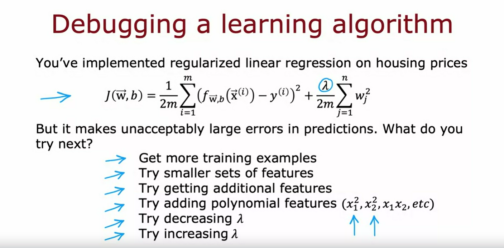

Let's start with an example, say you've implemented regularized linear regression to predict housing prices, so you have the usual cost function $J(w, b)$ for your learning algorithm, squared error plus this regularization term.

But if you train the model and find that it makes unacceptably large errors in its predictions, what do you try next? When you're building a machine learning algorithm, there are usually a lot of different things you could try. 

For example, you could decide to get more training examples since it seems having more data should help, or maybe you think maybe you have too many features, so you could try a smaller set of features. Or maybe you want to get additional features, such as finally additional properties of the houses to toss into your data, and maybe that'll help you to do better. Or you might take the existing features $x_1$, $x_2$, and so on, and try adding polynomial features $x_1^2$, $x_2^2$, $x_1x_2$, and so on. Or you might wonder if the value of $\lambda$ lambda is chosen well, and you might say, maybe it's too big, I want to decrease it. Or you may say, maybe it's too small, I want to try increasing it. 

On any given machine learning application, it will often turn out that some of these things could be fruitful and some of them not.

The key to being effective at how you build a machine learning algorithm will be if you can find a way to make good choices about where to invest your time.

## ML Diagnostic 

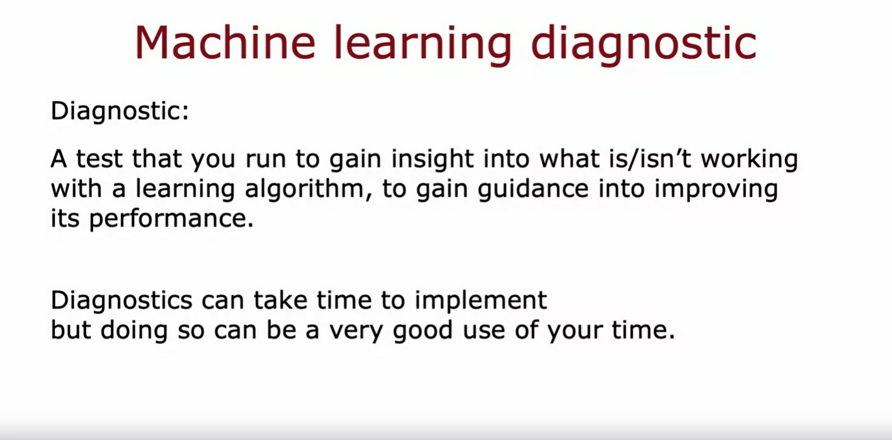

In this week, you'll learn about how to carry out a set of diagnostic. 

By diagnostic, I mean a test that you can run to gain insight into what is or isn't working with a learning algorithm to gain guidance into improving its performance. 

Some of these diagnostics will tell you things like: Is it worth weeks, or even months collecting more training data? Because if it is, then you can then go ahead and make the investment to get more data, which will hopefully lead to improved performance, or if it isn't then running that diagnostic could have saved you months of time.

One thing you see this week as well, is that diagnostics can take time to implement, but running them can be a very good use of your time. 

This week we'll spend a lot of time talking about different diagnostics you can use to give you guidance on how to improve your learning algorithm's performance

But first, let's take a look at how to evaluate the performance of your learning algorithm. Let's go to do that in the next video.

# Evaluating a model

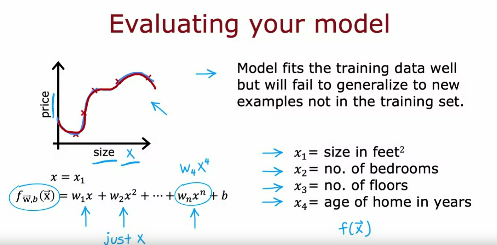

Having a systematic way to evaluate performance will also hope paint a clearer path for how to improve its performance.

Let's take the example of learning to predict housing prices as a function of the size. 

Let's say you've trained the model to predict housing prices as a function of the size x. And for the model that is a fourth order polynomial. So features $x$, $x^2$, $x^3$ and $x^4$. Because we fit a 4th order polynomial to a training set with five data points, this fits the training data really well. But, we don't like this model very much because even though the model fits the training data well, we think it will fail to generalize to new examples that aren't in the training set.

So, when you are predicting prices, just a single feature at the size of the house, you could plot the model like this and we could see that the curve is very wiggly so we know this is probably isn't a good model.

But if you were fitting this model with even more features, say we had $x_1$ the size of house, $x_2$ the number of bedrooms, $x_3$ the number of floors of the house and also $x_4$ the age of the home in years, then it becomes much harder to plot f because f is now a function of $x_1$ through $x_4$. And how do you plot a four dimensional function?

So in order to tell if your model is doing well, especially for applications where you have more than one or two features, which makes it difficult to plot $f(x)$ we need some more systematic way to evaluate how well your model is doing.

# Technique: Split the data into 2 subsets

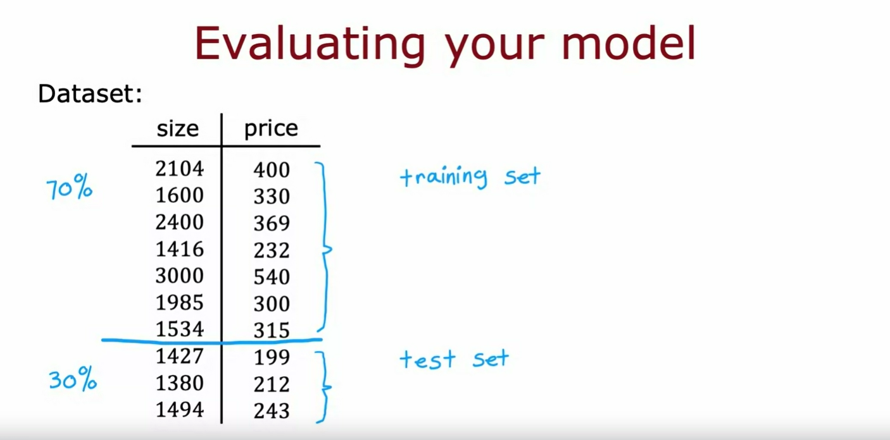

Here's a technique that you can use. Rather than taking all your data to train the parameters $w$ and $b$ of the model, you can instead split the training set into two subsets. 

Let's put 70% of the data into the first part and I'm going to call that the **training set** and for the second part of the data, let's say 30% of it, I'm going to put into it a **test set**. 

And what we're going to do is train the models parameters on the training set on this first 70% or so of the data, and then we'll test its performance on this test set. 

## Notation

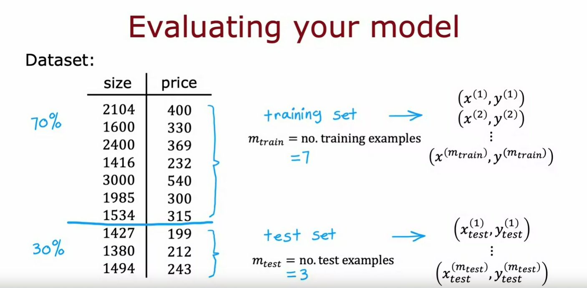

### Training set
In notation, I'm going to use $(x^{(1)}, y^{(1)})$ same as before, to denote the training examples from 1 through $(x^{(m_{train})}, y^{(m_{train})})$

$m_{train}$ is a number of training examples which in this small dataset is 7. So the subscript train just emphasizes we're looking at the training set portion of the data

### Test set
And for the test set, I'm going to use the notation $(x_{test}^{(1)}, y_{test}^{(1)})$ to denote the first test example, and this goes all the way to $(x_{test}^{(m_{test})}, y_{test}^{(m_{test})})$ is the number of test examples, which in this case is 3.

$m_{test}$ is a number of test examples which in this small dataset is 3. So the subscript test just emphasizes we're looking at the test set portion of the data

And it's not uncommon to split your dataset according to maybe a 70/30 split or 80/20 split with most of your data going into the training set, and then a smaller fraction going into the test set.

## Evaluating the model

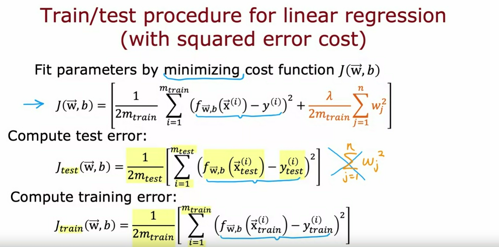

So, in order to train a model and evaluate it, this is what it would look like if you're using linear regression with a squared error cost.

Start off by fitting the parameters by minimizing the cost function $J(w, b)$. So this is the usual cost function: minimize over w,b of this square error cost plus regularization term lambda over 2m times sum of the $w_j^2$.

### Computing the test error

And then to tell how well this model is doing, you would compute $J_{test}(w, b)$ which is equal to the average error on the test set, and that's just equal to 1/2 times $m_{test}$. That's the number of test examples. And then of sum overall the examples from $i=1$ to the number of test examples $i=m_{test}$ of the squared error on each of the test examples like so. 

So, it's a prediction on the ith test example input minus the actual price of the house on the ith test example squared. 

> NOTE: Notice that the test error formula $J_{test}(w, b)$ does not include that regularization term. And this will give you a sense of how well your learning algorithm is doing. 

### Computing the training error

One of the quantities that's often useful to compute as well as is the training error, which is a measure of how well your learning algorithm is doing on the training set.

So, let me define $J_{train}(w, b)$ to be equal to the average over the training set. 1 over to 2m, or 1/2 m subscript train of sum over your training set of this squared error term. 

> NOTE: And once again, $J_{train}(w, b)$ does not include the regularization term unlike the cost function that you are minimizing to fit the parameters

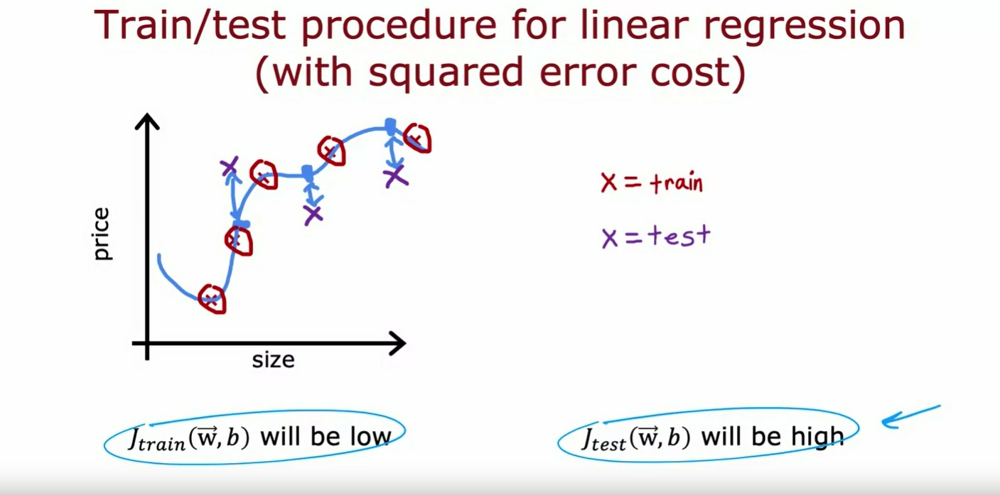

So, in the model like what we saw earlier in this video, $J_{train}(w, b)$ will be low because the average error on your training examples will be zero or very close to zero. So $J_{train}(w, b)$ will be very close to zero.

But if you have a few additional examples in your test set that the algorithm had not trained on, then those test examples, might look like these (purple crosses). And there's a large gap between what the algorithm is predicting as the estimated housing price and the actual value of those housing prices.

And so, $J_{test}(w, b)$ will be high. So, seeing that $J_{test}(w, b)$ is high on this model gives you a way to realize that even though it does great on the training set, is actually not so good at generalizing to new examples to new data points that were not in the training set. 

So, that was regression with squared error cost.

## Procedure for a classification problem

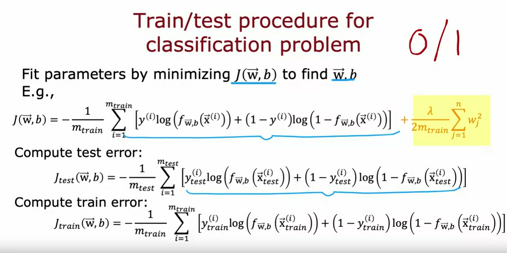

Now, let's take a look at how you apply this procedure to a classification problem. 

For example, if you are classifying between handwritten digits that are either 0 or 1. So, same as before, you fit the parameters by minimizing the cost function to find the parameters $w$ and $b$. 

For example, if you were training Logistic Regression, then this would be the cost function $J(w, b)$ where this is the usual logistic loss function, and then plus also the regularization term.

### Computing the test error

And to compute the test error, $J_{test}(w, b)$ is then the average over your test examples, that's that 30% of your data that wasn't in the training set of the logistic loss on your test set

### Computing the training error

And the training error you can also compute it using this new formula. It is the average logistic loss on your training data that the algorithm was using to minimize the cost function $J(w, b)$

Well, what I described here will work OK for figuring out if your learning algorithm is doing well by seeing how it was doing in terms of test error. 

## Another definition: Misclassified fractions for the test and training sets

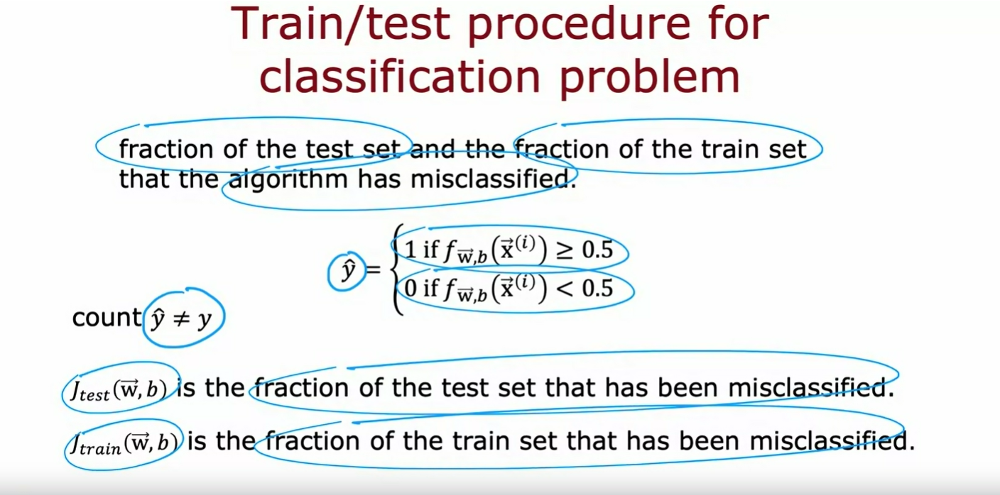

When applying machine learning to classification problems, there's actually one other definition of $J_{test}(w, b)$ and $J_{train}(w, b)$ that is maybe even more commonly used which is instead of using the logistic loss to compute the test error and the training error to instead measure what is the fraction of the test set and the fraction of the training set that the algorithm has misclassified. 

So, specifically on the test set, you can have the algorithm make a prediction 1 or 0 on every test example. So, recall $\hat{y}$ we would predict as 1 if $f(x)$ is greater than equal 0.5, and 0 if it's less than 0.5. 

And you can then count up in the test set the fraction of examples where $\hat{y}$ is not equal to the actual ground truth label **y** in the test set.

So concretely, if you are classifying handwritten digits 0 or 1, a binary classification task, then $J_{test}$ would be the fraction of that test set where 0 was classified as 1 or 1 was classified as 0. 

And similarly, $J_{train}$ is a fraction of the training set that has been misclassified. 

Taking a dataset and splitting it into a training set and a separate test set gives you a way to systematically evaluate how well your learning algorithm is doing. 

By computing both $J_{test}$ and $J_{train}$ you can now measure how was doing on the *test set* and on the *training set* 

This procedure is one step to what you'll be able to automatically choose what model to use for a given machine learning application. For example, if you're trying to predict housing prices, should you fit a straight line to your data, or fit a second order polynomial, or third order fourth order polynomial? It turns out that with one further refinement to the idea you saw in this video, you'll be able to have an algorithm help you to automatically make that type of decision well. Let's take a look at how to do that in the next video.

## Model selection and training/cross validation/test sets

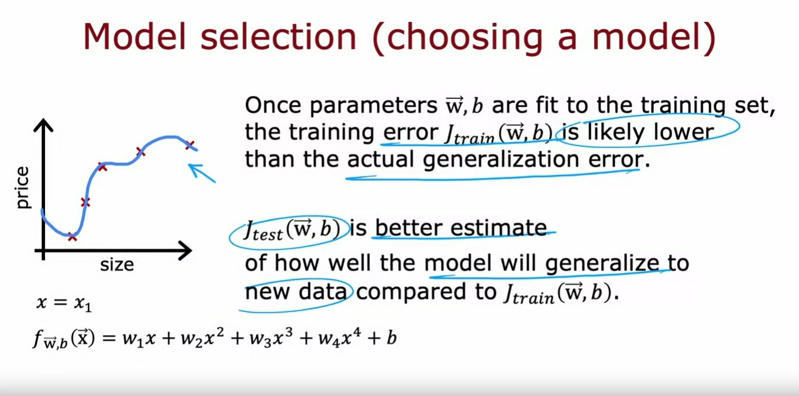

In the last video, you saw how to use the test set to evaluate the performance of a model. Let's make one further refinement to that idea in this video, which allows you to use the technique, to automatically choose a good model for your machine learning algorithm.

One thing we've seen is that once the model's parameters $w$ and $b$ have been fit to the training set, the training error may not be a good indicator of how well the algorithm will do or how well it will generalize to new examples that were not in the training set, and in particular, for this example, the training error will be pretty much zero and that's likely much lower than the actual generalization error, and by that I mean the average error on new examples that were not in the training set. 

What you saw on the last video is that $J_{test}$ the performance of the algorithm on examples, is not trained on, that will be a better indicator of how well the model will likely do on new data. And by that I mean other data that's not in the training set.

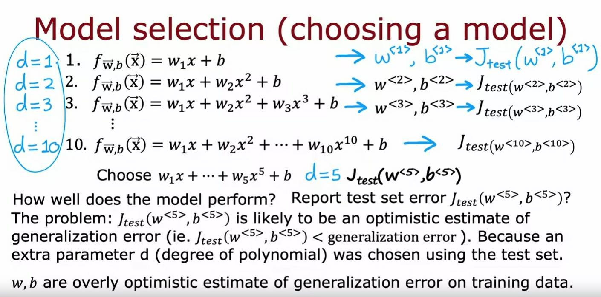

Let's take a look at how this affects how we might use a test set to choose a model for a given machine learning application. 

So, if fitting a function to predict housing prices or some other regression problem, one model you might consider is to fit a linear model like this:

See 1. $f_{w, b}(x) = w_{1}x + b$

## d=1 (1st order polynomial)

This is a first-order polynomial and we're going to use $d=1$ on this slide to denote fitting a one or first-order polynomial. If you were to fit a model like this to your training set, you get some parameters, $w$ and $b$, and you can then compute $J_{test}$ to estimate how well does this generalize to new data. On this slide, I'm going to use $w^{<1>}, b^{<1>}$ to denote that these are the parameters you get if you were to fit a first order polynomial, a degree one, $d=1$ polynomial, $J_{test}(w^{<1>}, b^{<1>})$

## d=2 (2nd order polynomial)

Now, you might also consider fitting a second-order polynomial or quadratic model, so this is the model: 

See 2. $f_{w, b}(x) = w_{1}x + w_{2}x^2 + b$

If you were to fit this to your training set, you would get some parameters, $w^{<2>}, b^{<2>}$ and you can then similarly evaluate those parameters on your test set and get $J_{test}(w^{<2>}, b^{<2>})$ and this will give you a sense of how well the second-order polynomial does. 

## d=3 (3rd order polynomial)

You can go on to try $d=3$, that's a third order or a degree three polynomial that looks like this: See 3. 

and fit parameters and similarly get $J_{test}(w^{<3>}, b^{<3>})$

## d=10 (10th order polynomial)

You might keep doing this until, say you try up to a 10th order polynomial and you end up with $J_{test}(w^{<10>}, b^{<10>})$ that gives you a sense of how well the 10th order polynomial is doing. 

One procedure you could try, this turns out not to be the best procedure, but one thing you could try is, look at all of these $J_{test}$ and see which one gives you the lowest value. 

## Suppose the lowest value for d=5 (5th order polynomial)

Say, you find that, $J_{test}$ for the fifth order polynomial for $w^{<5>}, b^{<5>}$ turns out to be the lowest. If that's the case, then you might decide that the fifth order polynomial $d=5$ does best, and choose that model for your application. 

If you want to estimate how well this model performs, one thing you could do, but this turns out to be a slightly flawed procedure, is to report the test set error, $J_{test}(w^{<5>}, b^{<5>})$. 

The reason this procedure is flawed is $J_{test}(w^{<5>}, b^{<5>})$ is likely to be an optimistic estimate of the generalization error. In other words, it is likely to be lower than the actual generalization error, and the reason is, in the procedure we talked about on this slide with basic fits, one extra parameter, which is $d$, the degree of polynomial, and we chose this parameter using the test set.

On the previous slide, we saw that if you were to fit $w, b$ to the training data, then the training data would be an overly optimistic estimate of generalization error. It turns out too, that if you want to choose the parameter $d$ using the test set, then the test set $J_{test}$ is now an overly optimistic, that is lower than actual estimate of the generalization error. 

The procedure on this particular slide is flawed and I don't recommend using this. 

Instead, if you want to automatically choose a model, such as decide what degree polynomial to use here's how you modify the training and testing procedure in order to carry out model selection. 

Whereby model selection, I mean choosing amongst different models, such as these 10 different models that you might contemplate using for your machine learning application

## New set: Cross validation set

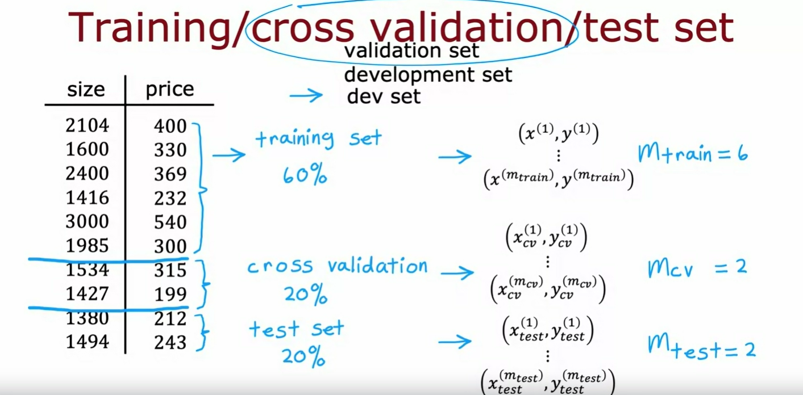

The way we'll modify the procedure is instead of splitting your data into just 2 subsets

- the training set 
- the test set

we're going to split your data into 3 different subsets, which we're going to call

- the training set
- the **cross-validation set**
- the test set

So, using our example from before of these 10 training examples, we might split it into putting 60 percent of the data into the **training set** and so the notation we'll use for the training set portion will be the same as before, except that now $m_{train}=6$, the number of training examples will be six and we might put 20 percent of the data into the **cross-validation set** and the notation I'm going to use is $x_{cv}^{(1)}$, $y_{cv}^{(1)}$ for the first cross-validation example.

So, *cv* stands for cross-validation, all the way down to $x_{cv}^{(m_{cv})}$, $y_{cv}^{(m_{cv})}$ where here, $m_{cv}=2$ in this example and is the number of cross-validation examples. 

Then, finally we have the **test set** same as before, so $x_{test}^{(1)}$ through $x_{test}^{(m_{test})}$ and $y_{test}^{(1)}$ through $y_{test}^{(m_{test})}$, where $m_{test}=2$, the number of test examples.

We'll see you on the next slide how to use the cross-validation set. The way we'll modify the procedure is you've already seen the training set and the test set and we're going to introduce a new subset of the data called the cross-validation set. 

The name cross-validation refers to that this is an extra dataset that we're going to use *to check or cross check the validity* or really *the accuracy of different models*. 

I dont think it's a great name, but that is what people in machine learning have gotten to call this extra dataset. You may also hear people call this the **validation set** for short, it's just fewer syllables than cross-validation or in some applications, people also call this the **development set**. It means basically the same thing or for short sometimes you hear people call this the **dev set**, but all of these terms mean the same thing as cross-validation set. I personally use the term dev set the most often because it's the shortest, fastest way to say it but cross-validation is pretty used a little bit more often by machine learning practitioners.

## Formulas for each set error

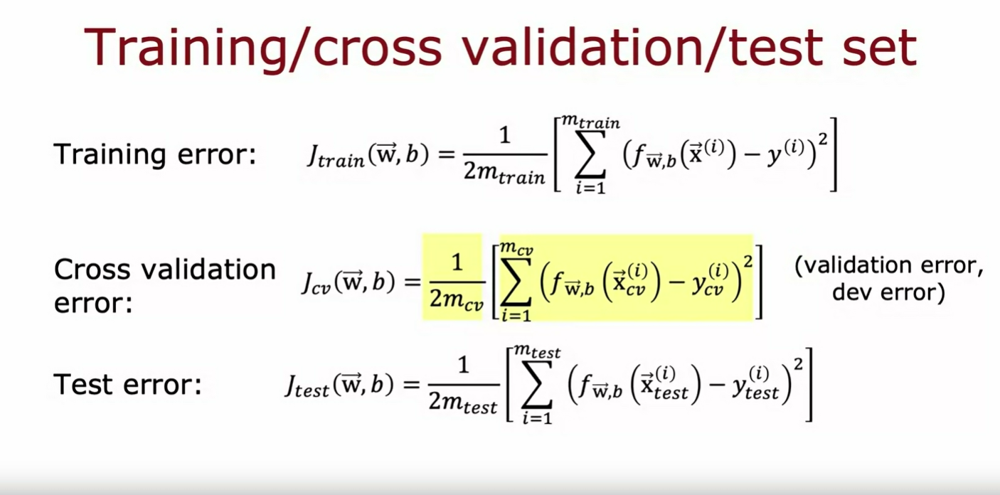

Onto these three subsets of the data (training set, cross-validation set and test set), you can then compute the training error, the cross-validation error and the test error using these three formulas shown in the image above.

Whereas usual, none of these terms include the regularization term that is included in the training objective, and this new term in the middle, the cross-validation error is just the average over your $m_{cv}$ cross-validation examples of the average say, squared error. And this term, in addition to being called **cross-validation error**, is also commonly called the **validation error** for short, or even the **development set error**, or the **dev error**. 

Armed with these three measures of learning algorithm performance, this is how you can then go about carrying out model selection.

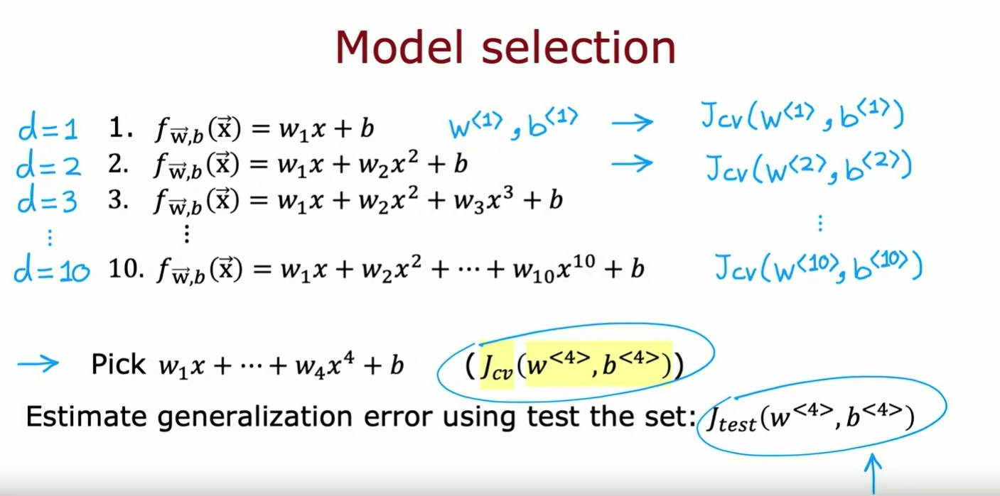

You can, with the 10 models, same as earlier on this slide, with $d=1$, $d=2$, all the way up to a 10th degree or the 10th order polynomial, you can then fit the parameters $w_1$, $b_1$ but instead of evaluating this on your **test set**, you will instead evaluate these parameters on your **cross-validation sets** and compute $J_{cv}(w^{<1>}, b^{<1>})$, and similarly, for the second model, we get $J_{cv}(w^{<2>}, b^{<2>})$ and all the way down to $J_{cv}(w^{<10>}, b^{<10>})$

Then, in order to choose a model, you will look at which model has the *lowest cross-validation error*, and concretely, let's say that $J_{cv}(w^{<4>}, b^{<4>})$ is the lowest, then what that means is you pick this fourth-order polynomial as the model you will use for this application.

Finally, if you want to report out an estimate of the generalization error of how well this model will do on new data, you will do so using that third subset of your data, the **test set** and you report out $J_{test}(w^{<4>}, b^{<4>})$. 

You notice that throughout this entire procedure, you had fit these parameters using the **training set**, you then chose the parameter $d$ or chose the degree of polynomial using the cross-validation set and so up until this point, you've not fit any parameters, either $w$ or $b$ or $d$ to the test set and that's why $J_{test}$ in this example will be a fair estimate of the generalization error of this model thus parameters $w_4$, $b_4$. 

This gives a better procedure for model selection and it lets you automatically make a decision like what order polynomial to choose for your linear regression model.

## Model selection for other types of models: Neural network architecture

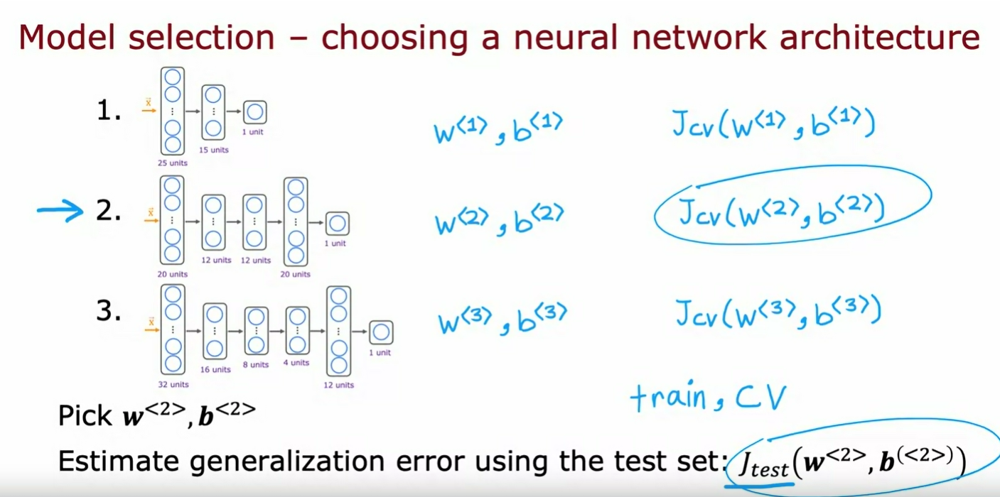

This model selection procedure also works for choosing among other types of models, for example, choosing a neural network architecture. 

If you are fitting a model for handwritten digit recognition, you might consider three models like the ones shown in the picture above, maybe even a larger set of models than just 3 but here are a few different neural networks of small, somewhat larger, and then even larger. 

To help you decide how many layers do the neural network have and how many hidden units per layer should you have, you can then train all three of these models and end up with parameters $w_1, b_1$ for the first model, $w_2, b_2$ for the second model and $w_3, b_3$ for the third model and you can then evaluate the neural networks performance using $J_{cv}$, using your cross-validation set.

Since this is a classification problem, $J_{cv}$ the most common choice would be to compute this as the fraction of cross-validation examples that the algorithm has misclassified. You would compute this using all 3 models and then *pick the model with the lowest cross validation error*.

If, in this example, the 2nd model architecture has the lowest cross validation error, you will then pick the second neural network and use parameters trained on this model and finally, if you want to report out an estimate of the generalization error, you then use the test set to estimate how well the neural network that you just chose will do.

It's considered best practice in machine learning that if you have to make decisions about your model, such as *fitting parameters* or *choosing the model architecture*, such as neural network architecture or degree of polynomial if you're fitting a linear regression, *to make all those decisions only using your training set and your cross-validation set*, **and to not look at the test set at all while you're still making decisions regarding your learning algorithm**. 

It's only after you've come up with one model as your final model to only then evaluate it on the test set and because you haven't made any decisions using the test set, that ensures that your test set is a fair and not overly optimistic estimate of how well your model will generalize to new data. 

That's model selection and this is actually a very widely used procedure. I use this all the time to automatically choose what model to use for a given machine learning application. Earlier this week, I mentioned running diagnostics to decide how to improve the performance of a learning algorithm. Now that you have a way to evaluate learning algorithms and even automatically choose a model, let's dive more deeply into examples of some diagnostics. 

**The most powerful diagnostic** that I know of and that I used for a lot of machine learning applications is one called **bias and variance**. Let's take a look at what that means in the next video.

## [Optional Lab 7 - Model Evaluation and Selection](./Optional%20Lab%207%20-%20Model%20Evaluation%20and%20Selection/)