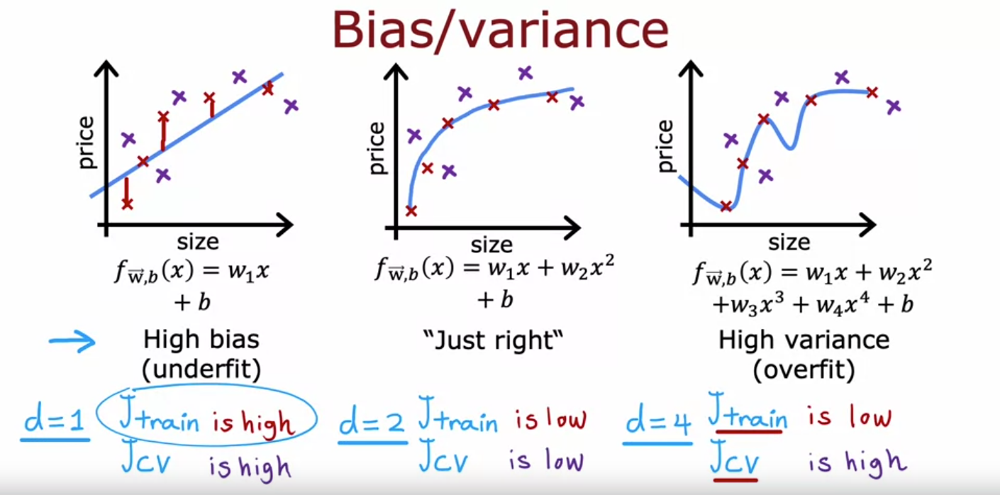
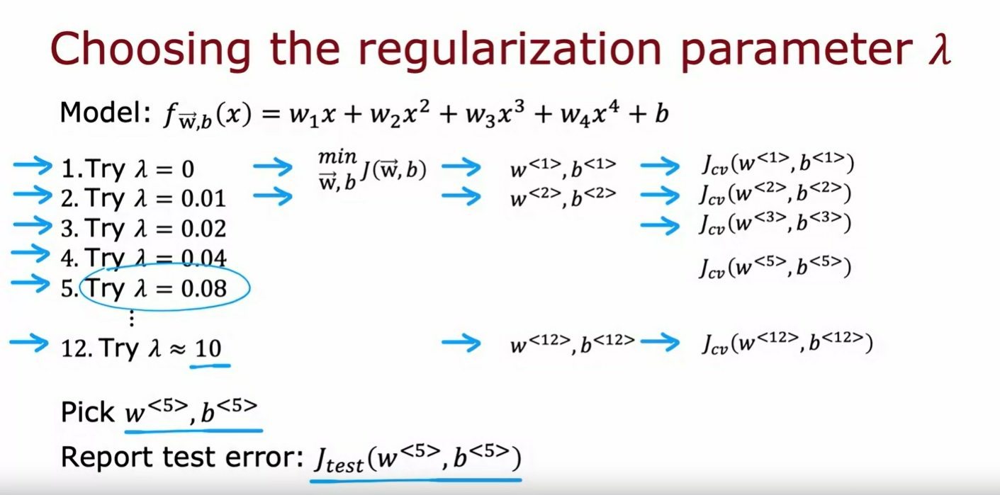

## Diagnosing bias and variance

The typical workflow of developing a machine learning system is that you have an idea and you train the model, and you almost always find that it doesn't work as well as you wish yet. 

A key to the process of building a machine learning system is how to decide what to do next in order to improve his performance. I've found across many different applications that **looking at the bias and variance** of a learning algorithm gives you very good guidance on what to try next.

Let's take a look at what this means. You might remember this example from the first course on Linear Regression where given this dataset, if you were to fit a straight line to it, it doesn't do that well. 

We said that this algorithm has high bias or that it underfits this dataset. If you were to fit a fourth-order polynomial, then it has high-variance or it overfits. In the middle if you fit a quadratic polynomial, then it looks pretty good. Then I said that was just right. Because this is a problem with just a single feature $x$, we could plot the function $f$ and look at it like this but if you had more features, you can't plot $f$ and visualize whether it's doing well as easily. 

## Systematic way of diagnose 
Instead of trying to look at plots like this, a more systematic way to diagnose or to find out if your algorithm has high bias or high variance will be **to look at the performance of your algorithm on the training set and on the cross validation set**. 

### 1st case: High bias - Underfitting

In particular, let's look at the example on the left. 

#### Performance on the training set

If you were to compute $J_{train}$, how well does the algorithm do on the training set? Not that well. I'd say  $J_{train}$ here would be high because there are actually pretty large errors between the examples and the actual predictions of the model. 

#### Performance on the cross validation set

How about $J_{cv}$? 

$J_{cv}$ would be if we had a few new examples that the algorithm had not previously seen. Here the algorithm also doesn't do that well on examples that it had not previously seen, so $J_{cv}$ will also be high. 

#### Description

One characteristic of an algorithm with high bias, something that is under fitting, is that it's not even doing that well on the training set. 
When $J_{train}$ is high, that is your strong indicator that this algorithm has high bias. 

### 2nd case: High variance - Overfitting

Let's now look at the example on the right. 

#### Performance on the training set

If you were to compute $J_{train}$ we could ask how well is this doing on the training set? Well, it's actually doing great on the training set. It is fitting the training data really well. So, $J_{train}$ here will be low

#### Performance on the cross validation set

But if you were to evaluate this model on other houses not in the training set, then you find that $J_{cv}$, the cross-validation error, will be quite high. 

#### Description

A characteristic signature or a characteristic Q that your algorithm has high variance will be of $J_{cv}$ is much higher than $J_{train}$. 
In other words, it does much better on data it has seen than on data it has not seen. 

This turns out to be a strong indicator that your algorithm has high variance. 

Again, the point of what we're doing is that I'm computing $J_{train}$ and $J_{cv}$ and seeing 

- if $J_{train}$ is high 

    or

- if $J_{cv}$ is much higher than $J_{train}$

This gives you a sense, even if you can't plot the function $f$, of whether your algorithm has high bias or high variance. 

### 3rd case: Just right

Finally, the case in the middle

#### Performance on the training set

If you look at $J_{train}$, it's pretty low, so this is doing quite well on the training set. 

#### Performance on the cross validation set

If you were to look at a few new examples, like those from, say, your cross-validation set, you find that $J_{cv}$ is also pretty low. 

The fact of $J_{train}$ not being too high indicates this doesn't have a high bias problem and also the fact of $J_{cv}$ not being much worse than $J_{train}$ indicates that it doesn't have a high variance problem either which is why the quadratic model seems to be a pretty good one for this application. 

### Summary 

To summarize 

- when $d=1$, for a linear polynomial, $J_{train}$ was high and $J_{cv}$ was also high
- when $d=4$, $J_{train}$ was low but $J_{cv}$ is high
- when $d=2$, both were pretty low

Let's now take a different view on bias and variance. 

In particular, based on this new slide I'd like to show you how $J_{train}$ and $J_{cv}$ vary as a function of the degree of the polynomial you're fitting

So, let me draw a figure where the horizontal axis, $d$, will be the degree of polynomial that we're fitting to the data.

Over on the left we'll correspond to a small value of $d$, like $d=1$, which corresponds to fitting a straight line. 

Over to the right we'll correspond to, say, $d=4$ or even higher values of d. where fitting this high order polynomial.

So if you were to plot $J_{train}(w, b)$ as a function of $d$, the degree of polynomial, ($J_{train}(w, b)$ vs $d$) what you find is that as you fit a higher and higher degree polynomial, here I'm assuming we're not using regularization, but as you fit a higher and higher order polynomial, the training error will tend to go down because when you have a very simple linear function, it doesn't fit the training data that well, when you fit a quadratic function or third order polynomial or fourth-order polynomial, it fits the training data better and better.
So, as the degree of polynomial increases, $J_{train}$ will typically go down. 

Next, let's look at $J_{cv}$, which is how well does it do on data that it did not get to fit to? What we saw was when $d=1$, when the degree of polynomial was very low, $J_{cv}$ was pretty high because it underfits, so it didn't do well on the cross validation set. 

Here on the right as well, when the degree of polynomial is very large, say $d=4$, it doesn't do well on the cross-validation set either, and so it's also high. 

But if $d$ was in-between say, a second-order polynomial ($d=2$) then it actually did much better. 

And so if you were to vary the degree of polynomial, you'd actually get a curve that looks like this, which comes down and then goes back up where 

- if the degree of polynomial is too low then it underfits and so doesn't do on the cross validation set

    and 

- if the degree of polynomial is too high then it overfits and also doesn't do well on the cross validation set. 

Is only if it's somewhere in the middle, that is just right, which is why the second-order polynomial in our example ends up with a lower cross-validation error and neither high bias nor high-variance problems.

To summarize, how do you diagnose bias and variance in your learning algorithm? 

## Diagnosing high bias

If your learning algorithm has high bias or it has underfitted data, the key indicator will be if $J_{train}$ is high. And so that corresponds to this leftmost portion of the curve, which is where $J_{train}$ is high. 
And usually you have $J_{train}$ and $J_{cv}$ will be close to each other. 

## Diagnosing high variance

How do you diagnose if you have high variance? Well, the key indicator for high-variance will be if $J_{cv}$ is much greater than $J_{train}$.
This rightmost portion of the plot is where $J_{cv}$ is much greater than $J_{train}$. And usually $J_{train}$ will be pretty low but the key indicator is whether $J_{cv}$ is much greater than $J_{train}$. That's what happens when we had fit a very high order polynomial to this small dataset. 

## Diagnosing the fact of having high bias and high variance at the same time

And even though we've just seen bias and variance, it turns out, in some cases, is possible to simultaneously have high bias and have high-variance. You won't see this happen that much for Linear Regression, but it turns out that if you're training a neural network, there are some applications where unfortunately you have high bias and high variance. 

One way to recognize that situation will be if $J_{train}$ is high, so you're not doing that well on the training set, but even worse, the cross-validation error is again, even much larger than the training set. 

The notion of high bias and high variance, it doesn't really happen for Linear models applied to 1D but to give intuition about what it looks like, it would be as if for part of the input you had a very complicated model that overfit, so it overfits to part of the inputs. But then for some reason, for other parts of the input, it doesn't even fit the training data well, and so it underfits for part of the input. 

In this example, which looks artificial because it's a single feature input, we fit the training set really well and we overfit in part of the input, and we don't even fit the training data well, and we underfit the part of the input and that's how in some applications you can unfortunate end up with both high bias and high variance. 

The indicator for that will be if the algorithm does poorly on the training set, and it even does much worse than on the training set. 

For most learning applications, you probably have primarily a high bias or high variance problem rather than having both at the same time but it is possible sometimes they're both at the same time. 

I know that there's a lot of process, there are a lot of concepts on the slides, but the key takeaways are:

- high bias means is not even doing well on the training set

    and

- high variance means it does much worse on the cross validation set than on the training set

Whenever I'm training a machine learning algorithm, I will almost always try to figure out to what extent the algorithm has a high bias or underfitting vs a high-variance when overfitting problem. 

This will give good guidance, as we'll see later this week, on how you can improve the performance of the algorithm. But first, let's take a look at how regularization effects the bias and variance of a learning algorithm because that will help you better understand when you should use regularization. Let's take a look at that in the next video.

## Regularization and bias/variance

You saw in the last video how different choices of the degree of polynomial $d$ affects the bias in variance of your learning algorithm and therefore its overall performance. 

In this video, let's take a look at how regularization, specifically the choice of the regularization parameter lambda $\lambda$ affects the bias and variance and therefore the overall performance of the algorithm. 

This, it turns out, will be helpful for when you want to choose a good value of lambda $\lambda$ of the regularization parameter for your algorithm. 

Let's take a look. In this example, I'm going to use a fourth-order polynomial, but we're going to fit this model using regularization where here the value of lambda $\lambda$ is the regularization parameter that controls how much you trade-off keeping the parameters $w$ small vs fitting the training data well. 

## Case 1: when $\lambda$ is very large
Let's start with the example of setting lambda $\lambda$ to be a very large value. Say $\lambda=10 000$. 

If you were to do so, you would end up fitting a model that looks roughly like this (a horizontal line). Because if lambda $\lambda$ were very large, then the algorithm is highly motivated to keep these parameters $w$ very small and so you end up with $w_1$, $w_2$, etc really all of these parameters will be very close to zero. 

And so the model ends up being $f(x)\approx b$, a constant value, which is why you end up with a model like this. This model clearly has high bias and it underfits the training data because it doesn't even do well on the training set and $J_{train}$ is large. 

## Case 2: when $\lambda$ is very small or 0
Let's take a look at the other extreme. Let's say you set Lambda $\lambda$ to be a very small value. With a small value of Lambda $\lambda$, in fact, let's go to extreme of setting Lambda $\lambda$ equals zero. 

With that choice of Lambda $\lambda$, there is no regularization, so we're just fitting a fourth-order polynomial with no regularization and you end up with that curve that you saw previously that overfits the data. 

What we saw previously was when you have a model like this, $J_{train}$ is small, but $J_{cv}$ is much larger than $J_{train}$. For $J_{cv}$ is large this indicates we have high variance and it overfits this data. 

## Case 3: Some intermediate value for $\lambda$
It would be if you have some intermediate value of Lambda $\lambda$, not really large as 10,000 but not so small as zero that hopefully you get a model that looks like this, that is just right and fits the data well with small $J_{train}$ and small $J_{cv}$.

## Cross validation set helps to decide

If you are trying to decide what is a good value of Lambda $\lambda$ to use for the regularization parameter, cross-validation gives you a way to do so as well. 

Let's take a look at how we could do so. Just as a reminder, the problem we're addressing is if you're fitting a fourth-order polynomial, so that's the model and you're using regularization, how can you choose a good value of Lambda $\lambda$?

This would be procedure similar to what you had seen for choosing the degree of polynomial $d$ using cross-validation. Specifically, let's say we try to fit a model using $\lambda = 0$ and so we would minimize the cost function using $\lambda = 0$ and end up with some parameters $w_1, b_1$ and you can then compute the cross-validation error, $J_{cv}(w^{<1>}, b^{<1>})$. 

Now let's try a different value of Lambda $\lambda$. Let's say you try Lambda $\lambda$ equals $\lambda = 0.01$. Then again, minimizing the cost function gives you a second set of parameters $w_2, b_2$ and you can also see how well that does on the cross-validation set, and so on. 

Let's keep trying other values of Lambda $\lambda$ and in this example, I'm going to try doubling it to $\lambda = 0.02$ and so that will give you $J_{cv}(w^{<3>}, b^{<3>})$, and so on. 

Then let's double again and double again. After doubling a number of times, you end up with Lambda $\lambda$ approximately equal to $\lambda = 10$, and that will give you parameters $w_{12}, b_{12}$, and $J_{cv}(w^{<12>}, b^{<12>})$.

And by trying out a large range of possible values for Lambda $\lambda$, fitting parameters using those different regularization parameters, and then evaluating the performance on the cross-validation set, you can then try to pick what is the best value for the regularization parameter lambda.

Quickly, if in this example, you find that $J_{cv}(w^{<5>}, b^{<5>})$ has the lowest value of all of these different cross-validation errors, you might then decide to pick this value for Lambda $\lambda$, and so use $w_5, b_5$ as the chosen parameters. And finally, if you want to report out an estimate of the generalization error, you would then report out the test set error, $J_{test}(w^{<5>}, b^{<5>})$

## How the training and cross validation error vary as function of Lambda $\lambda$

To further hone intuition about what this algorithm is doing, let's take a look at how training error and cross validation error vary as a function of the parameter Lambda $\lambda$. 

In this figure, I've changed the x-axis again. Notice that the x-axis here is annotated with the value of the regularization parameter Lambda $\lambda$

### Case: $\lambda=0$

If we look at the extreme of $\lambda=0$ here on the left, that corresponds to not using any regularization, and so that's where we wound up with this very wiggly curve with Lambda $\lambda$ was small or it was even zero.

And in that case, we have a high variance model, and so $J_{train}$ is going to be small and $J_{cv}$ is going to be large because it does great on the training data but does much worse on the cross validation data. 

### Case: $\lambda=10 000$, a large value

This other extreme on the right with very large values of Lambda $\lambda$, lets say Lambda $\lambda = 10000$ ends up with fitting a model that looks like the right bottom graph with a horizontal blue line, $f(x) \approx b$). This has high bias, it underfits the data, and it turns out $J_{train}$ will be high and $J_{cv}$ will be high as well. 

## How $J_{train}$ varies as a function of Lambda $\lambda$

Spoiler: As $\lambda$ increases, $J_{train}$ increases as well

In fact, if you were to look at how $J_{train}$ varies as a function of Lambda $\lambda$, you find that $J_{train}$ will go up like the image shown above because in the optimization cost function, the larger Lambda $\lambda$ is the more the algorithm is trying to keep $w_{j}^2$ small that is, the more weight is given to this regularization term, and thus the less attention is paying to actually doing well on the training set. This term on the left is $J_{train}$, so the most trying to keep the parameters small, the less good a job it does on minimizing the training error. 

So, that's why as Lambda $\lambda$ increases, the training error $J_{train}$ will tend to increase like so. 

## How $J_{cv}$ varies as a function of Lambda $\lambda$

Spoiler: There is some intermediate value for $\lambda$ which makes $J_{cv}$ the lowest value you can obtain

Now, how about the cross-validation error? It turns out the cross-validation error will look like the image above

Because we've seen that if Lambda $\lambda$ is too small or too large, then it doesn't do well on the cross-validation set. It either overfits here on the left or underfits here on the right. There'll be some intermediate value of Lambda $\lambda$ that causes the algorithm to perform best. 

And what cross-validation is doing is, it's trying out a lot of different values of Lambda $\lambda$. This is what we saw on the last slide: try Lambda $\lambda = 0$, Lambda $\lambda = 0.01$, $\lambda = 0.02$. Try a lot of different values of Lambda $\lambda$ and evaluate the cross-validation error in a lot of these different points, and then hopefully pick a value that has low cross validation error, and this will hopefully correspond to a good model for your application. 

## Comparing diagrams

We are comparing the diagram discussed from the last lecture vs this new one:

* Previous lecture: $J_{train}$ and $J_{cv}$ vs $d$ (the degree of polynomial)

* Current lecture: $J_{train}$ and $J_{cv}$ vs $\lambda$ (the regularization parameter)

If you compare this diagram to the one that we had in the previous video, where the horizontal axis was the degree of polynomial $d$, these two diagrams look a little bit not mathematically and not in any formal way, but they look a little bit like mirror images of each other, and that's because when you're fitting a degree of polynomial, the left part of this curve corresponded to underfitting and high bias, the right part corresponded to overfitting and high variance whereas in this one, high-variance was on the left and high bias was on the right. 

But that's why these two images are a little bit like mirror images of each other. But in both cases, cross-validation, evaluating different values can help you choose a good value of $d$ or a good value of Lambda $\lambda$. 

That's how the choice of regularization parameter Lambda $\lambda$ affects the bias and variance and overall performance of your algorithm, and you've also seen how you can use cross-validation to make a good choice for the regularization parameter Lambda $\lambda$. 

### Summary

Now, so far, we've talked about how having a high training set error, high $J_{train}$ is indicative of high bias and how having a high cross-validation error of $J_{cv}$, specifically if it's much higher than $J_{train}$, how that's indicative of variance problem. 

But what does these words "high" or "much higher" actually mean? Let's take a look at that in the next video where we'll look at how you can look at the numbers $J_{train}$ and $J_{cv}$ and judge if it's high or low, and it turns out that one further refinement of these ideas, that is, establishing a baseline level of performance we're learning algorithm will make it much easier for you to look at these numbers, $J_{train}$, $J_{cv}$, and judge if they are high or low. Let's take a look at what all this means in the next video.

## Establishing a baseline level of performance

Let's look at some concrete numbers for what $J_{train}$ and $J_{cv}$ might be, and see how you can judge if a learning algorithm has high bias or high variance. 

For the examples in this video, I'm going to use as a running example the application of speech recognition which is something I've worked on multiple times over the years. Let's take a look.

A lot of users doing web search on a mobile phone will use speech recognition rather than type on the tiny keyboards on our phones because speaking to a phone is often faster than typing. 

Typical audio that's a web search engine we get would be like this, "What is today's weather?" Or like this, "Coffee shops near me." It's the job of the speech recognition algorithms to output the transcripts whether it's today's weather or coffee shops near me. 

Now, if you were to train a speech recognition system and measure the training error, and the training error means what's the percentage of audio clips in your training set that the algorithm does not transcribe correctly in its entirety. 

Let's say the training error for this dataset is 10.8 % meaning that it transcribes it perfectly for 89.2 % of your training set, but makes some mistake in 10.8 % of your training set and if you were to also measure your speech recognition algorithm's performance on a separate cross-validation set, let's say it gets 14.8 % error. 

If you were to look at these numbers it looks like the training error is really high, it got 10 % wrong, and then the cross-validation error is higher but getting 10 % of even your training set wrong that seems pretty high. 

It seems like that 10 % error would lead you to conclude it has high bias because it's not doing well on your training set, but it turns out that when analyzing speech recognition it's useful to also measure one other thing which is **what is the human level of performance?**.

In other words, how well can even humans transcribe speech accurately from these audio clips? Concretely, let's say that you measure how well fluent speakers can transcribe audio clips and you find that human level performance achieves 10.6 % error. 

Why is human level error so high? It turns out that for web search, there are a lot of audio clips that sound like this, "I'm going to navigate to [inaudible]."

There's a lot of noisy audio where really no one can accurately transcribe what was said because of the noise in the audio. If even a human makes 10.6 % error, then it seems difficult to expect a learning algorithm to do much better. 

In order to judge if the training error is high, it turns out to be more useful to see if the training error is much higher than a human level of performance, and in this example it does just 0.2 % worse than humans.

Given that humans are actually really good at recognizing speech I think if I can build a speech recognition system that achieves 10.6 % error matching human performance I'd be pretty happy, so it's just doing a little bit worse than humans. 

But in contrast, the gap or the difference between $J_{cv}$ and $J_{train}$ is much larger. There's actually a 4 % gap there. So, whereas previously we had said maybe 10.8 % error means this is high bias when we benchmark it to human level performance, we see that the algorithm is actually doing quite well on the training set, but the bigger problem is the cross-validation error is much higher than the training error which is why I would conclude that this algorithm actually has more of a variance problem than a bias problem.

## Baseline level of performance

It turns out when judging if the training error is high is often useful to establish a baseline level of performance, and by **baseline level of performance** I mean **what is the level of error you can reasonably hope your learning algorithm to eventually get to**

One common way to establish a baseline level of performance is to measure how well humans can do on this task because humans are really good at understanding speech data, or processing images or understanding texts.

1. **Human level performance** is often a good benchmark when you are using unstructured data such as: audio, images, or texts. 

2. Another way to estimate a baseline level of performance is if there's some **competing algorithm**, maybe a previous implementation that someone else has implemented or even a competitor's algorithm to establish a baseline level of performance if you can measure that.

3. Or sometimes you might **guess based on prior experience**. If you have access to this baseline level of performance that is, what is the level of error you can reasonably hope to get to or what is the desired level of performance that you want your algorithm to get to?

Then, when judging if an algorithm has high bias or variance, you would look at the baseline level of performance, the training error and the cross-validation error. 

The two key quantities to measure are then:

1. What is the **difference between training error and the baseline level** that you hope to get to: This is 0.2, and if this is large then you would say you have a high bias problem. 

2. You will then also look at this **gap between your training error and your cross-validation error**, and if this is high then you will conclude you have a high variance problem. And that's why in this example we concluded we have a high variance problem whereas let's look at the second example. 

If the baseline level of performance; that is human level performance, and training error, and cross validation error look like this, then this first gap is 4.4 % and so there's actually a big gap. The training error is much higher than what humans can do and what we hope to get to whereas the cross-validation error is just a little bit bigger than the training error and so if your training error and cross validation error look like this, I will say this algorithm has high bias. 

By looking at these numbers, training error and cross validation error, you can get a sense intuitively or informally of the degree to which your algorithm has a high bias or high variance problem. 

### Summary 

Just to summarize, this gap between these first two numbers gives you a sense of whether you have a high bias problem and the gap between these two numbers gives you a sense of whether you have a high variance problem. 

Sometime,s the baseline level of performance could be 0 %: If your goal is to achieve perfect performance than the baseline level of performance it could be zero %, but for some applications like the speech recognition application where some audio is just noisy then the baseline level of a performance could be much higher than zero and the method described on this slide will give you a better read in terms of whether your algorithm suffers from bias or variance. 

#### Having both high bias and high variance

By the way, it is possible for your algorithms to have high bias and high variance. Concretely, if you get numbers like these (see 3rd column in the picture above), then the gap between the baseline and the training error is large. That would be a 4.4 %, and the gap between training error and cross validation error is also large. This is 4.7 %. 

If it looks like this you will conclude that your algorithm has high bias and high variance, although hopefully this won't happen that often for your learning applications. 

To summarize, we've seen that looking at whether your training error is large is a way to tell if your algorithm has high bias but on applications where the data is sometimes just noisy and is infeasible or unrealistic to ever expect to get a zero error then it's useful to establish this baseline level of performance so rather than just asking is my training error a lot, you can ask is my training error large relative to what I hope I can get to eventually, such as, is my training large relative to what humans can do on the task? 

That gives you a more accurate read on how far away you are in terms of your training error from where you hope to get to. 

Then similarly, looking at whether your cross-validation error is much larger than your training error, gives you a sense of whether or not your algorithm may have a high variance problem as well. In practice, this is how I often will look at these numbers to judge if my learning algorithm has a high bias or high variance problem. 

Now, to further hone our intuition about how a learning algorithm is doing, there's one other thing that I found useful to think about which is the learning curve. Let's take a look at what that means in the next video.

## Learning curves

Learning curves are a way to help understand how your learning algorithm is doing as a function of the amount of experience it has, where by experience, I mean, for example, the number of training examples it has. 

Let's take a look. Let me plot the learning curves for a model that fits a second-order polynomial quadratic function like so and I'm going to plot both $J_{cv}$, the cross-validation error, as well as $J_{train}$ the training error.

On this figure, the horizontal axis is going to be $m_{train}$ that is the training set size or the number of examples that the algorithm can learn from and on the vertical axis I'm going to plot the error. By error, I mean either $J_{cv}$ or $J_{train}$. 

### Analyzing the cross validation error

Let's start by plotting the cross-validation error. It will look something like this. That's what $J_{cv}(w, b)$ will look like. It is maybe no surprise that as $m_{train}$, the training set size, gets bigger then you learn a better model and so the cross-validation error ($J_{cv}$) goes down. 

### Analyzing the training error

Now, let's plot $J_{train}(w, b)$ or what the training error looks like as the training set size gets bigger. It turns out that the training error will actually look like this. That as the training set size gets bigger, the training set error actually increases. 

Let's take a look at why this is the case: 

- We'll start with an example of when you have just a single training example. Well, if you were to fit a quadratic model to this, you can fit easiest straight line or a curve and your training error will be zero. 

- How about if you have two training examples like this? Well, you can again fit a straight line and achieve zero training error. 

- In fact, if you have three training examples, the quadratic function can still fit this very well and get pretty much zero training error, 

- but now, if your training set gets a little bit bigger, say you have four training examples, then it gets a little bit harder to fit all four examples perfectly and you may get a curve that looks like this, fits it pretty well, but you're a little bit off in a few places here and there and so when you have increased the training set size to four the training error has actually gone up a little bit. 

- How about we have five training examples. Well again, you can fit it pretty well, but it gets even a little bit harder to fit all of them perfectly and We haven't even larger training sets it just gets harder and harder to fit every single one of your training examples perfectly. 

To recap, when you have a very small number of training examples like one or two or even three, is relatively easy to get zero or very small training error, but when you have a larger training set is harder for quadratic function to fit all the training examples perfectly which is why **as the training set gets bigger, the training error increases because it's harder to fit all of the training examples perfectly**

>NOTE: Notice one other thing about these curves, which is the cross-validation error will be typically higher than the training error, this is $J_{cv}$ > $J_{train}$, because you fit the parameters to the training set and so you expect to do at least a little bit better or when $m$ is small maybe even a lot better on the training set than on the cross validation set. 

Let's now take a look at what the learning curves will look like for an algorithm with high bias versus one with high variance

### Analyzing the learning curve for a algorithm with high bias

Let's start at the high bias or the underfitting case. 

Recall that an example of high bias would be if you're fitting a linear function to a curve that looks like this. 

### High bias case: Analyzing the training error

If you were to plot the training error, then the training error will go up like so as you'd expect. 

In fact, this curve of training error may start to flatten out. We call it plateau, meaning flatten out after a while. That's because as you get more and more training examples when you're fitting the simple linear function, your model doesn't actually change that much more. It's fitting a straight line and even as you get more and more and more examples, there's just not that much more to change, which is why the average training error flattens out after a while. 

### High bias case: Analyzing the cross validation error

Similarly, your cross-validation error will come down and also flattened out after a while, which is why $J_{cv}$ again is higher than $J_{train}$, but $J_{cv}$ will tend to look like that. It's because beyond a certain point, even as you get more and more and more examples, not much is going to change about the straight line you're fitting. It's just a too simple model to be fitting into this much data. Which is why both of these curves, $J_{cv}$, and $J_{train}$ tend to flatten after a while. 

### High bias case: Analyzing the baseline level of performance

If you had a measure of that baseline level of performance, such as human-level performance, then they'll tend to be a value that is lower than your $J_{train}$ and your $J_{cv}$. So, human-level performance may look like this and there's a big gap between the baseline level of performance and $J_{train}$ which was our indicator for this algorithm having high bias that is, one could hope to be doing much better if only we could fit a more complex function than just a straight line. 

Now, one interesting thing about this plot is you can ask, what do you think will happen if you could have a much bigger training set? What would it look like if we could increase even further than the right of this plot, you can go further to the right as follows? Well, you can imagine if you were to extend both of these curves to the right, they'll both flatten out and both of them will probably just continue to be flat like that and No matter how far you extend to the right of this plot, these two curves they will never somehow find a way to dip down to this human level performance or just keep on being flat like this, pretty much forever no matter how large the training set gets. 

> IMPORTANT: So, that gives this conclusion, maybe a little bit surprising: that if a learning algorithm has high bias, getting more training data will not by itself hope that much. 

I know that we're used to thinking that having more data is good, but if your algorithm has high bias, then if the only thing you do is throw more training data at it, that by itself will not ever let you bring down the error rate that much. It's because of this really, no matter how many more examples you add to this figure, the straight linear fitting just isn't going to get that much better. That's why before investing a lot of effort into collecting more training data, it's worth checking if your learning algorithm has high bias, because if it does, then you probably need to do some other things other than just throw more training data at it. 

### Analyzing the learning curve for a algorithm with high variance

Let's now take a look at what the learning curve looks like for a learning algorithm with high variance

You might remember that if you were to fit the fourth-order polynomial with small lambda, say, or even lambda equals zero, then you get a curve that looks like this, and even though it fits the training data very well, it doesn't generalize. 

Let's now look at what a learning curve might look like in this high variance scenario. 

### High variance case: Analyzing the training/cv error

$J_{train}$ will be going up as the training set size increases, so you get a curve that looks like this, and $J_{cv}$ will be much higher, so your cross-validation error is much higher than your training error and the fact there's a huge gap here is what I can tell you that this high-variance is doing much better on the training set than it's doing on your cross-validation set.

### High variance case: Analyzing the baseline level of performance

If you were to plot a baseline level of performance, such as human level performance, you may find that it turns out to be here, that $J_{train}$ can sometimes be even lower than the human level performance or maybe human level performance is a little bit lower than this. 

But when you're over fitting the training set, you may be able to fit the training set so well to have an unrealistically low error, such as zero error in this example over here, which is actually better than how well humans will actually be able to predict housing prices or whatever the application you're working on. 

But again, the signal for high variance is whether $J_{cv}$ is much higher than $J_{train}$ and when you have high variance then increasing the training set size could help a lot, and in particular, if we could extrapolate these curves to the right, increase $m_{train}$, then the training error will continue to go up, but then the cross-validation error hopefully will come down and approach $J_{train}$. 

So, in this scenario, it might be possible just by increasing the training set size ($m_{train}$) to lower the cross-validation error and to get your algorithm to perform better and better, and this is unlike the high bias case, where if the only thing you do is get more training data, that won't actually help you learn your algorithm performance much. 

### Summary

To summarize, if a learning algorithm suffers from high variance, then getting more training data is indeed likely to help because extrapolating to the right of this curve, you see that you can expect $J_{cv}$ to keep on coming down. 

In this example, just by getting more training data, allows the algorithm to go from relatively high cross-validation error to get much closer to human level performance. You can see that if you were to add a lot more training examples and continue to fill the fourth-order polynomial, then you can just get a better fourth order polynomial fit to this data than this very wiggly curve up on top. 

So, if you're building a machine learning application, you could plot the learning curves if you want, that is, you can take different subsets of your training sets, and even if you have, say, 1,000 training examples, you could train a model on just 100 training examples and look at the training error and cross-validation error, then train a model on 200 examples, holding out 800 examples and just not using them for now, and plot $J_{train}$ and $J_{cv}$ and so on the repeats and plot out what the learning curve looks like. 

If we were to visualize it that way, then that could be another way for you to see if your learning curve looks more like a high bias or high variance one. 

One downside of the plotting learning curves like this is something I've done, but one downside is, it is computationally quite expensive to train so many different models using different size subsets of your training set, so in practice, it isn't done that often, but nonetheless, I find that having this mental visual picture in my head of what the training set looks like, sometimes that helps me to think through what I think my learning algorithm is doing and whether it has high bias or high variance. 

I know we've gone through a lot about bias and variance, let's go back to our earlier example of if you've trained a model for housing price prediction, how does bias and variance help you decide what to do next? Let's go back to that earlier example, which I hope will now make a lot more sense to you. Let's do that in the next video.

## Deciding what to try next revisited

You've seen how by looking at $J_{train}$ and $J_{cv}$, that is the training error and the cross-validation error, or maybe even plotting a learning curve you can try to get a sense of whether your learning algorithm has high bias or high variance. 

This is the procedure I routinely do when I'm training a learning algorithm more often look at the training error and cross-validation error to try to decide if my algorithm has high bias or high variance. 

It turns out this will help you make better decisions about what to try next in order to improve the performance of your learning algorithm. 

Let's look at an example. 

This is actually the example that you have seen earlier. If you've implemented regularized linear regression on predicting housing prices, but your algorithm makes unacceptably large errors in its predictions, what do you try next? 

These were the six ideas that we had when we had looked over this slide earlier: Getting more training examples, try small set of features, additional features, and so on. 

It turns out that each of these six items either helps fix a high variance or a high bias problem. 

In particular, if your learning algorithm has high bias, three of these techniques will be useful and if your learning algorithm has high variance then a different three of these techniques will be useful. 

1. First one is **get more training examples**: We saw in the last video that if your algorithm has high bias, then if the only thing we do is get more training data, that by itself probably won't help that much. But in contrast, if your algorithm has high variance, say it was overfitting to a very small training set, then getting more training examples will help a lot. So, this first option of getting more training examples **helps to fix a high variance problem**

2. How about trying a **smaller set of features**? Sometimes if your learning algorithm has too many features, then it gives the algorithm too much flexibility to fit very complicated models. This is a little bit like if you had $x, x^2, x^3, x^4, x^5$ and so on. If only you were to eliminate a few of these, then your model won't be so complex and won't have such high variance. So, if you suspect that your algorithm has a lot of features that are not actually relevant or helpful to predicting housing price, or if you suspect that you had even somewhat redundant features, then **eliminating or reducing the number of features will help reduce the flexibility of your algorithm to overfit the data**. This is a tactic that will **help you to fix high variance**

3. **Getting additional features**: that's just adding additional features is the opposite of going to a smaller set of features. This will **help you to fix a high bias problem**. As a concrete example, if you're trying to predict the price of the house just based on the size, but it turns out that the price of house also really depends on the number of bedrooms and on the number of floors and on the age of the house, then the algorithm will never do that well unless you add in those additional features. That's a high bias problem because you just can't do that well on the training set when you know only the size. It is only when you tell the algorithm how many bedrooms are there, how many floors are there, what's the age of the house that it finally has enough information to even do better on the training set. Adding additional features is a way to fix a high bias problem. 

4. **Adding polynomial features** is a little bit like adding additional features. So, if your linear functions, three-line can fit the training set that well, then adding additional polynomial features can help you do better on the training set, and helping you do better on the training set is a way **to fix a high bias problem**. 

5. **Decreasing the Lambda $\lambda$ value** means to use a lower value for the regularization parameter. That means we're going to pay less attention to the regularization term and pay more attention to the original cost function  J term to try to do better on the training set. Again, that **helps you to fix a high bias problem**

6. Finally, **increasing the Lambda $\lambda$ value**, well that's the opposite of this, but that says you're overfitting the data. Increasing Lambda will make sense if is overfitting the training set, just putting too much attention to fit the training set, but at the expense of generalizing to new examples, and so increasing Lambda would force the algorithm to fit a smoother function, maybe a less wiggly function and use this **to fix a high variance problem**

The takeaways I hope you have are:

### Takeaways on high variance

If you find that your algorithm has high variance, then the 2 main ways to fix that are:
1. either get more training data/training examples
    
    or

2. simplify your model and by simplify the model I mean:

    a) either get a smaller set of features
    
    or 

    b) increase the regularization parameter Lambda $\lambda$ so your algorithm has less flexibility to fit very complex, very wiggly curves. 
      
### Takeaways on high bias

Conversely, if your algorithm has high bias, then that means is not doing well even on the training set. 

If that's the case, the main fixes are to make your model more powerful or to give them more flexibility to fit more complex or more wiggly functions. 

Some ways to do that are:

- to give it additional features
- add these polynomial features
- to decrease the regularization parameter Lambda. 

>NOTE: 
Anyway, in case you're wondering if you should fix high bias by reducing the training set size, that doesn't actually help: If you reduce the training set size, you will fit the training set better but that tends to worsen your cross-validation error and the performance of your learning algorithm, so don't randomly throw away training examples just to try to fix a high bias problem. 

One of my PhD students from Stanford, many years after he'd already graduated from Stanford, once said to me that while he was studying at Stanford, he learned about bias and variance and felt like he got it, he understood it. But that subsequently, after many years of work experience in a few different companies, he realized that bias and variance is one of those concepts that takes a short time to learn, but takes a lifetime to master. Those were his exact words. 

Bias and variance is one of those very powerful ideas. When I'm training learning algorithms, I almost always try to figure out if it is high bias or high variance. But the way you go about addressing that systematically is something that you will keep on getting better at through repeated practice. 

But you'll find that understanding these ideas will help you be much more effective at how you decide what to try next when developing a learning algorithm.

Later this week in the practice labs and practice quizzes will have also additional opportunities to go over these ideas so that you can get additional practice where thinking about bias and variance of different learning algorithms. 

Before moving on, bias and variance also are very useful when thinking about how to train a neural network. In the next video, let's take a look at these concepts applied to neural network training

## Bias/variance and neural networks

