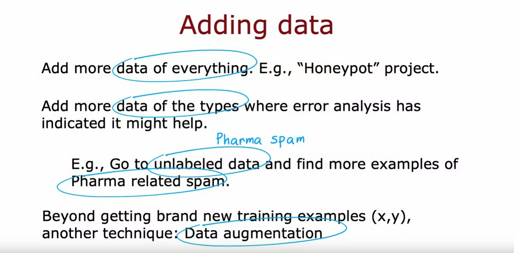

## Iterative loop of ML development

In the next few videos, I'd like to share with you what is like to go through the process of developing a machine learning system so that when you are doing so yourself, hopefully, you'd be in a position to make great decisions at many stages of the machine learning development process. 

Let's take a look first at the iterative loop of machine learning development. 

This is what developing a machine learning model will often feel like. 

1. First, you decide on what is the overall architecture of your system. That means choosing your machine learning model as well as deciding what data to use, maybe picking the hyperparameters, and so on. 

2. Then, given those decisions, you would implement and train a model. As I've mentioned before, when you train a model for the first time, it will almost never work as well as you want it to. 

3. The next step that I recommend then is to implement or to look at a few diagnostics, such as looking at the bias and variance of your algorithm as well as something we'll see in the next video called error analysis. Based on the insights from the diagnostics, you can then make decisions like do you want to make your neural network bigger or change the Lambda regularization parameter, or maybe add more data or add more features or subtract features.

4. Then you go around this loop again with your new choice of architecture, and it will often take multiple iterations through this loop until you get to the performance that you want. 

### Example

Let's look at an example of building an email spam classifier

I think many of us passionately hate email spam and this is a problem that I worked on years ago and also was involved in starting an anti-spam conference once years ago. 

The example on the left is what a highly spammy email might look like: Deal of the week, buy now, Rolex watches. Spammers will sometimes deliberately misspell words like these, watches, medicine, and mortgages in order to try to trip up a spam recognizer. 

In contrast, this email on the right is an actual email I once got from my younger brother Alfred about getting together for Christmas. 

How do you build a classifier to recognize spam versus non-spam emails?

One way to do so would be to train a supervised learning algorithm where the input features $x$ will be the features of an email and the output label $y$ will be one or zero depending on whether it's spam or non-spam. 

This application is an example of text classification because you're taking a text document that is an email and trying to classify it as either spam or non-spam. One way to construct the features of the email would be to say, take the top 10,000 words in the English language or in some other dictionary and use them to define features $x_1$, $x_2$ through $x_{10000}$.

For example, given this email on the right, if the list of words we have is a, Andrew, buy, deal, discount and so on, then given the email on the right, we would set these features to be say 0 or 1, depending on whether or not that word appears. The word *a* does not appear, the word *Andrew* does appear, the word *buy* does appear, *deal* does, *discount* does not, and so on, and so you can construct 10,000 features of this email. 
There are many ways to construct a feature vector. 

Another way would be to let these numbers not just be 1 or 0, but actually, count the number of times a given word appears in the email. If *buy* appears twice, maybe you want to set this to 2, but setting into just 1 or 0 it actually works decently well. Given these features, you can then train a classification algorithm such as a logistic regression model or a neural network to predict $y$ given these features $x$

After you've trained your initial model, if it doesn't work as well as you wish, you will quite likely have multiple ideas for improving the learning algorithm's performance. 

1. For example, is always tempting to collect more data. In fact, I have friends that have worked on very large-scale honeypot projects. These are projects that create a large number of fake email addresses and tries to deliberately to get these fake email addresses into the hands of spammers so that when they send spam email to these fake emails well we know these are spam email messages and so this is a way to get a lot of spam data.

2. Or you might decide to work on developing more sophisticated features based on the email routing. Email routing refers to the sequence of compute service. Sometimes around the world that the email has gone through all this way to reach you and emails actually have what's called email header information. That is information that keeps track of how the email has traveled across different servers, across different networks to find its way to you. Sometimes the path that an email has traveled can help tell you if it was sent by a spammer or not.

3. Or you might work on coming up with more sophisticated features from the email body that is the text of the email. In the features I talked about last time, discounting and discount may be treated as different words, and maybe they should be treated as the same words. 

4. Or you might decide to come up with algorithms to detect misspellings or deliberate misspellings like watches, medicine, and mortgage and this too could help you decide if an email is spammy. 

So, given all of these and possibly even more ideas, how can you decide which of these ideas are more promising to work on? Because choosing the more promising path forward can speed up your project easily 10 times compared to if you were to somehow choose some of the less promising directions. For example, we've already seen that if your algorithm has high bias rather than high variance, then spending months and months on a honeypot project may not be the most fruitful direction. But if your algorithm has high variance, then collecting more data could help a lot.

Doing the iterative loop of Machine Learning development, you may have many ideas for how to modify the model or the data, and it will be coming up with different diagnostics that could give you a lot of guidance on what choices for the model or data, or other parts of the architecture could be most promising to try. 

In the last several videos, we've already talked about bias and variance. 

In the next video, I'd like to start describing to you the error analysis process, which has a second key set of ideas for gaining insight about what architecture choices might be fruitful. That's the iterative loop of machine learning development and using the example of building a spam classifier let's take a look at what error analysis looks like. Let's do that in the next video.

## Error analysis

### Run a diagnostic

1. Bias and variance
2. Error analysis

In terms of the most important ways to help you run diagnostics to choose what to try next to improve your learning algorithm performance, I would say bias and variance is probably the most important idea and error analysis would probably be second on my list. Let's take a look at what this means.

Concretely, let's say you have m_cv equals 500 cross validation examples and your algorithm misclassifies 100 of these 500 cross validation examples. The error analysis process just refers to manually looking through these 100 examples and trying to gain insights into where the algorithm is going wrong.

Specifically, what I will often do is find a set of examples that the algorithm has misclassified examples from the cross validation set and try to group them into common teams or common properties or common traits. 

For example, if you notice that quite a lot of the misclassified spam emails are pharmaceutical sales, trying to sell medicines or drugs then I will actually go through these examples and count up by hand how many emails that are misclassified are pharmaceutical spam and say there are 21 emails that are pharmaceutical spam. 

Or if you suspect that deliberate misspellings may be tripping over your spam classifier then I will also go through and just count up how many of these examples that it misclassified had a deliberate misspelling. Let's say I find three out of a 100. 

Or looking through the email routing info I find seven has unusual email routing and 18 emails trying to steal passwords or phishing emails. Spam is sometimes also, instead of writing the spam message in the email body they instead create an image and then writes to spam the message inside an image that appears in the email. This makes it a little bit harder for learning algorithm to figure out what's going on. Maybe some of those emails are these embedded image spam. 

If you end up with these counts then that tells you that pharmaceutical spam and emails trying to steal passwords or phishing emails seem to be huge problems whereas deliberate misspellings, well, it is a problem it is a smaller one. 

In particular, what this analysis tells you is that even if you were to build really sophisticated algorithms to find deliberate misspellings it will only solve three out of 100 of your misclassified examples so the net impact seems like it may not be that large. Doesn't mean it's not worth doing? But when you're prioritizing what to do, you might therefore decide not to prioritizes this as highly. 

By the way, I'm telling the story because I once actually spent a lot of time building algorithms to find deliberate misspellings and spam emails only much later to realize that the net impact was actually quite small. This is one example where I wish I'd done more careful error analysis before spending a lot of time myself trying to find these deliberate misspellings. 

Just a couple of notes on this process:

1. These categories can be overlapping: Or in other words they're not mutually exclusive. For example, there can be a pharmaceutical spam email that also has unusual routing or a password that has deliberate misspellings and is also trying to carry out the phishing attack so one email can be counted in multiple categories. 

2. And in this example, I had said that the algorithm misclassified as 100 examples and we'll look at all 100 examples manually: If you have a larger cross validation set, say we had 5,000 cross validation examples and if the algorithm misclassified say 1,000 of them then you may not have the time depending on the team size and how much time you have to work on this project , you may not have the time to manually look at all 1,000 examples that the algorithm misclassifies. In that case, I will often sample randomly a subset of usually around a 100, maybe a couple 100 examples because that's the amount that you can look through in a reasonable amount of time. And hopefully looking through maybe around a 100 examples will give you enough statistics about whether the most common types of errors and therefore where maybe most fruitful to focus your attention. 

After this analysis, if you find that a lot of errors are pharmaceutical spam emails then this might give you some ideas or inspiration for things to do next: 

1. For example, you may decide to collect more data but not more data of everything, but just try to find more data of pharmaceutical spam emails so that the learning algorithm can do a better job recognizing these pharmaceutical spam

2. Or you may decide to come up with some new features that are related to say specific names of drugs or specific names of pharmaceutical products of the spammers are trying to sell in order to help your learning algorithm become better at recognizing this type of pharma spam. 

Then again this might inspire you to make specific changes to the algorithm relating to detecting phishing emails:

1. For example, you might look at the URLs in the email and write special code to come with extra features to see if it's linking to suspicious URLs. 

2. Or again, you might decide to get more data of phishing emails specifically in order to help your learning algorithm do a better job of recognizing them. 

So, the point of this error analysis is by manually examining a set of examples that your algorithm is misclassifying or mislabeling. Often this will create inspiration for what might be useful to try next and sometimes it can also tell you that certain types of errors are sufficiently rare that they aren't worth as much of your time to try to fix.

So, returning to this list, a bias variance analysis should tell you if collecting more data is helpful or not. 

Based on our error analysis in the example we just went through, it looks like more sophisticated email features could help but only a bit whereas more sophisticated features to detect pharma spam or phishing emails could help a lot and these detecting misspellings would not help nearly as much.

In general I found both the bias variance diagnostic as well as carrying out this form of error analysis to be really helpful to screening or to deciding which changes to the model are more promising to try on next. 

Now, one limitation of error analysis is that it's much easier to do for problems that humans are good at. You can look at the email and say you think is a spam email, why did the algorithm get it wrong? 

Error analysis can be a bit harder for tasks that even humans aren't good at. For example, if you're trying to predict what ads someone will click on a website, well, I can't predict what someone will click on so error analysis there actually tends to be more difficult but when you apply error analysis to problems that you can, it can be extremely helpful for focusing attention on the more promising things to try and that in turn can easily save you months of otherwise fruitless work.

In the next video, I'd like to dive deeper into the problem of adding data. When you train a learning algorithm, sometimes you decide there's high variance and you want to get more data for it and some techniques they can make how you add data much more efficient. Let's take a look at that so that hopefully you'll be armed with some good ways to get more data for your learning application.

## Adding data

In this video, I'd like to share with you some tips for adding data or collecting more data or sometimes even creating more data for your machine learning application. 

Just a heads up that this and the next few videos will seem a little bit like a grab bag of different techniques and I apologize if it seems a little bit grab baggy and that's because machine learning applications are different. Machine learning is applied to so many different problems and for some humans are great at creating labels and for some you can get more data and for some you can't. 

And that's why different applications actually sometimes call for slightly different techniques but I hope in this in the next few videos to share with you some of the techniques that are found to be most useful for different applications, although not every one of them will apply for every single application but I hope many of them would be useful for many of the applications that you'll be working on as well 

But let's take a look at some tips for how to add data for your application. 

### Technique to add data: 1. Get more data of everything

When training machine learning algorithms, it feels like always we wish we had even more data almost all the time. And so sometimes it's tempting to let's just get more data of everything. But, trying to get more data of all types can be slow and expensive. 

### Technique to add data: 2. Only get more data of the types where needed

Instead, an alternative way of adding data might be to focus on adding more data of the types where analysis has indicated it might help. 

In the previous slide we saw if error analysis reviewed that pharma spam was a large problem, then you may decide to have a more targeted effort not to get more data everything under the sun but to stay focused on getting more examples of pharma spam and with a more modest cost this could let you add just the emails you need to hope your learning algorithm get smarter on recognizing pharma spam.

And so one example of how you might do this is, if you have a lot of unlabeled email data, say emails sitting around that no one has bothered to label yet as spam or non-spam, you may able to ask your labors to quickly skim through the unlabeled data and find more examples specifically a pharma related spam.

And this could boost your learning algorithm's performance much more than just trying to add more data of all sorts of emails. 

#### Conclusion of techniques 1 and 2

But the more general pattern I hope you take away from this is, if you have some ways to add more data of everything that's okay, nothing wrong with that, but if error analysis has indicated that there are certain subsets of the data that the algorithm is doing particularly poorly on and that you want to improve performance on, then getting more data of just the types where you wanted to do better (say more examples of pharmaceutical spam or more examples of phishing spam or something else) that could be a more efficient way to add just a little bit of data but boost your algorithm's performance by quite a lot. 

### Technique to add data: 3. Data augmentation

Beyond getting your hands on brand new training examples (x, y) there's another technique that's widely used especially for images and audio data that can increase your training set size significantly: This technique is called *Data augmentation* and what we're going to do is take an existing training example to create a new training example

#### Data augmentation on an Optical Character Recognition (OCR) problem

For example, if you're trying to recognize the letters from A to Z for an OCR (Optical Character Recognition) problem. So not just the digits 0-9 but also the letters from A to Z. 

Given an image like this, you might decide to create a new training example 

- by rotating the image a bit or 
- by enlarging the image a bit or 
- by shrinking a little bit or 
- by changing the contrast of the image

And these are examples of distortions to the image that don't change the fact that this is still the letter A

And for some letters but not others you can also **take the mirror image of the letter** and it still looks like the letter A but this only applies to some letters.

But these would be ways of taking a training example (x, y) and applying a **distortion or transformation to the input x** in order to come up with another example that has the same label. By doing this you're telling the algorithm that the letter A rotated a bit or enlarged a bit or shrunk a little bit it is still the letter A. 

Creating additional examples like this holds the learning algorithm do a better job learning how to recognize the letter A.

##### Using a grid on top of the input *x*

For a more advanced example of data augmentation you can also take the letter A and place a grid on top of it. By introducing random warping of this grid, you can take the letter A and introduce warpings of it to create a much richer library of examples of the letter A. 

This process of distorting these examples then has turned here one image of one example into training examples that you can feed to the learning algorithm to hope it learn more robustly what is the letter A.

#### Data augmentation on a Speech Recognition problem

This idea of data augmentation also works for speech recognition. 

Let's say for a voice search application, you have an original audio clip that sounds like this. >> What is today's weather. >> 

One way you can apply data augmentation to speech data would be to take noisy background audio like this, for example, this is what the sound of a crowd sounds like (*Sounds a noisy audio*)

And it turns out that if you take these two audio clips, the first one and the crowd noise and you add them together, then you end up with an audio clip that sounds like this. >> What is today's weather. >> And you just created an audio clip that sounds like someone saying what's the weather today but they're saying it around the noisy crowd in the background. 

Or in fact if you were to take a different background noise, say someone in the car, this is what background noise of a car sounds like (*Sounds a noisy audio*)

And you want to add the original audio clip to the car noise, then you get this. >> What is today's weather. >> And it sounds like the original audio clip, but as if the speaker was saying it from a car. 

And the more advanced data augmentation step would be if you make the original audio sound like you're recording it on a bad cell phone connection like this (*Sounds a noisy audio*)

And so we've seen how you can take one audio clip and turn it into three training examples here, one with crowd background noise, one with car background noise and one as if it was recorded on a bad cell phone connection. 

And the times I worked on speech recognition systems, this was actually a really critical technique for increasing **artificially** the size of the training data I had to build a more accurate speech recognizer. 

> [!TIP]
One tip for data augmentation is that the changes or the distortions you make to the data should be representative of the types of noise or distortions in the test set. 

So, for example, if you take the letter A and warp it like this, this still looks like examples of letters you might see out there that you would like to recognize. 

Or for audio adding background noise or bad cellphone connection if that's representative of what you expect to hear in the test set, then this will be helpful ways to carry out data augmentation on your audio data.

In contrast, it is usually not that helpful to add purely random/meaningless noise to your data: For example, you have taken the letter A and I've added per pixel noise where if $x_i$ is the intensity or the brightness of pixel i, if I were to just add noise to each pixel, they end up with images that look like this. But if to the extent that this isn't that representative of what you see in the test set because you don't often get images like this in the test set this is actually going to be less helpful. 

So one way to think about data augmentation is how can you modify or warp or distort or make more noise in your data but in a way so that what you get is still quite similar to what you have in your test set because that's what the learning algorithm will ultimately end up doing well on. 

### Technique to add data: 4. Data synthesis

Now, whereas data augmentation takes an existing training example and modifies it to create another training example there's one other technique which is data synthesis in which you make up brand new examples from scratch not by modifying an existing example but by creating brand new examples

So, take the example of photo OCR: Photo OCR or Photo Optical Character Recognition refers to the problem of looking at an image like this and automatically having a computer read the text that appears in this image. So there's a lot of text in this image.

How can you train an OCR algorithm to read text from an image like this?

Well, when you look closely at what the letters in this image looks like they actually look like this. So this is real data from a photo OCR task. And one key step with the photo OCR task is to be able to look at the little image like this and recognize the letter at the middle. So this has T in the middle, this has the letter L in the middle, this has the letter C in the middle and so on. 

So one way to create artificial data for this task is if you go to your computer's text editor, you find that it has a lot of different fonts and what you can do is take these fonts and basically type of random text in your text editor and screenshotted using different colors and different contrasts and very different fonts and you get *synthetic data* like that on the right.

The images on the left were real data from real pictures taken out in the world and the images on the right are synthetically generated using fonts on the computer and it actually looks pretty realistic. 

So, with synthetic data generation like this you can generate a very large number of images or examples for your photo OCR task. It can be a lot of work to write the code to generate realistic looking synthetic data for a given application. But when you spend the time to do so, it can sometimes help you generate a very large amount of data for your application and give you a huge boost to your algorithm's performance.

Synthetic data generation has been used most probably for computer vision tasks and less for other applications. Not that much for audio tasks as well.

All the techniques you've seen in this video relate to finding ways to engineer the data used by your system. 

In the way that machine learning has developed over the last several decades, many decades, most machine learning researcher's attention was on the **conventional model-centric approach** and here's what I mean: A machine learning system or an AI system includes both code to implement your algorithm or your model, as well as the data that you train the algorithm model. And over the last few decades, most researchers doing machine learning research would download the dataset and hold the data fixed while they focus on improving the code or the algorithm or the model.

Thanks to that paradigm of Machine Learning research, I find that today the algorithm we have access to such as Linear Regression, Logistic Regression, Neural Networks, also Decision Trees we should see next week there are algorithms that already very good and will work well for many applications. 

And so sometimes it can be more fruitful to spend more of your time taking a **data-centric approach** in which you focus on engineering the data used by your algorithm. And this can be anything from collecting more data (collecting more data just on pharmaceutical spam if that's what error analysis told you to do) to using data augmentation to generate more images or more audio or using data synthesis to just create more training examples. 

And sometimes that focus on the data can be an efficient way to help your learning algorithm improve its performance. 

## Summary

So, I hope that this video gives you a set of tools to be efficient and effective in how you add more data to get your learning algorithm to work better.

Now, there are also some applications where you just don't have that much data and it's really hard to get more data. It turns out that there's a technique called *Transfer Learning* which could apply in that setting to give your learning algorithm performance a huge boost. 

And the key idea is to take data from a totally different barely related tasks but using a neural network there's sometimes ways to use that data from a very different tasks to get your algorithm to do better on your application. It doesn't apply to everything but when it does it can be very powerful. Let's take a look in the next video and how Transfer Learning works

## Transfer Learning: using data from a different task

For an application where you don't have that much data, transfer learning is a wonderful technique that lets you use data from a different task to help on your application. 

This is one of those techniques that I use very frequently. Let's take a look at how it works 

### Example

Let's say you want to recognize the handwritten digits from zero through nine but you don't have that much labeled data of these handwritten digits. Here's what you can do. Say you find a very large dataset of one million images of pictures of cats, dogs, cars, people, and so on, a thousand classes. You can then start by training a neural network on this large dataset of a million images with a thousand different classes and train the algorithm to take as input an image X, and learn to recognize any of these 1,000 different classes. 

In this process, you end up learning parameters for the first layer of the neural network $W^{[1]}, b^{[1]}$, for the second layer $W^{[2]}, b^{[2]}$, and so on, $W^{[3]}, b^{[3]}$, $W^{[4]}, b^{[4]}$ and $W^{[5]}, b^{[5]}$ for the output layer. 

To apply transfer learning, what you do is then make a copy of this neural network where you would keep the parameters $W^{[1]}, b^{[1]}$, $W^{[2]}, b^{[2]}$, $W^{[3]}, b^{[3]}$, and $W^{[4]}, b^{[4]}$ but for the last layer, you would eliminate the output layer and replace it with a much smaller output layer with just 10 rather than 1,000 output units. 

These 10 output units will correspond to the classes zero, one, through nine that you want your neural network to recognize. Notice that the parameters $W^{[5]}, b^{[5]}$ can't be copied over because the dimension of this layer has changed, so you need to come up with new parameters $W^{[5]}, b^{[5]}$ that you need to train from scratch rather than just copy it from the previous neural network. 

In transfer learning, what you can do is use the parameters from the first four layers, really all the layers except the final output layer as a starting point for the parameters and then run an optimization algorithm such as Gradient Descent or the Adam optimization algorithm with the parameters initialized using the values from this neural network up on top. 

In detail, there are two options for how you can train this neural networks parameters. 

1. Option 1 is you only train the output layers parameters: So, you would take the parameters $W^{[1]}, b^{[1]}$, $W^{[2]}, b^{[2]}$ through $W^{[4]}, b^{[4]}$ as the values from on top and just hold them fix and don't even bother to change them and use an algorithm like Stochastic Gradient Descent or the Adam optimization algorithm to only update $W^{[5]}, b^{[5]}$ to lower the usual cost function that you use for learning to recognize these digits zero to nine from a small training set of these digits zero to nine

2. Option 2 would be to train all the parameters in the network including $W^{[1]}, b^{[1]}$, $W^{[2]}, b^{[2]}$ all the way through $W^{[5]}, b^{[5]}$ but the first four layers parameters would be initialized using the values that you had trained on top. 

If you have a very small training set then Option 1 might work a little bit better but if you have a training set that's a little bit larger then Option 2 might work a little bit better. 

This algorithm is called *Transfer learning* because the intuition is by learning to recognize cats, dogs, cows, people, and so on it will hopefully, have learned some plausible sets of parameters for the earlier layers for processing image inputs. And then by transferring these parameters to the new neural network, the new neural network starts off with the parameters in a much better place so that we have just a little bit of further learning. 

Hopefully, it can end up at a pretty good model. These two steps of first training on a large dataset and then tuning the parameters further on a smaller dataset go by the name of **supervised pre-training** for this step on top: That's when you train the neural network on a very large dataset of say a million images of not quite the related task. 

And then the second step is called **fine tuning** where you take the parameters that you had initialized or gotten from supervised pre-training and then run Gradient Descent further to fine tune the weights to suit the specific application of handwritten digit recognition that you may have. 

If you have a small dataset, even tens or hundreds or thousands or just tens of thousands of images of the handwritten digits being able to learn from these million images of a not quite related task can actually help your learning algorithm's performance a lot. 

One nice thing about Transfer Learning as well is maybe you don't need to be the one to carry out supervised pre-training: For a lot of neural networks, there will already be researchers that they have already trained a neural network on a large image and will have posted a trained neural networks on the Internet, freely licensed for anyone to download and use. 

What that means is rather than carrying out the first step yourself, you can just download the neural network that someone else may have spent weeks training and then replace the output layer with your own output layer and carry out either Option 1 or Option 2 to fine tune a neural network that someone else has already carried out supervised pre-training on and just do a little bit of fine tuning to quickly be able to get a neural network that performs well on your task. 

Downloading a pre-trained model that someone else has trained and provided for free is one of those techniques where by building on each other's work on machine learning community we can all get much better results by the generosity of other researchers that have pre-trained and posted their neural networks online. 

But why does transfer learning even work? How can you possibly take parameters obtained by recognizing cats, dogs, cars, and people and use that to help you recognize something as different as handwritten digits?

Here's some intuition behind it. 

If you are training a neural network to detect, say, different objects from images, then the first layer of a neural network may learn to detect edges in the image. We think of these as somewhat low-level features in the image which is to detect edges. Each of these squares is a visualization of what a single neuron has learned to detect as learn to group together pixels to find edges in an image.

The next layer of the neural network then learns to group together edges to detect corners. And so each of these is a visualization of what one neuron may have learned to detect, must learn to detect simple shapes like corner like shapes like this. 

The next layer of the neural network may have learned to detect some are more complex, but still generic shapes like basic curves or smaller shapes like these. 

And that's why by learning on detecting lots of different images, you're teaching the neural network to detect edges, corners, and basic shapes. That's why by training a neural network to detect things as diverse as cats, dogs, cars and people, you're helping it to learn to detect these pretty generic features of images and finding edges, corners, curves, basic shapes, this is useful for many other computer vision tasks, such as recognizing handwritten digits. 

One restriction of pre-training though is that the image type $x$ has to be the same for the pre-training and fine-tuning steps. If the final task you want to solve is a computer vision task, then the pre-training step also has been a neural network trained on the same type of input, namely an image of the desired dimensions. 

Conversely, if your goal is to build a speech recognition system to process audio, then a neural network pre-trained on images probably won't do much good on audio. Instead, you want a neural network pre-trained on audio data, there you then fine tune on your own audio dataset and the same for other types of applications. You can pre-train a neural network on text data and if your application has a same feature input x of text data, then you can fine tune that neural network on your own data.

To summarize, these are the two steps for transfer learning. 

1. Step 1 is download the neural network with parameters that have been pre-trained on a large dataset with the same input type as your application. That input type could be images, audio, texts, or something else, or if you don't want to download the neural network, maybe you can train your own. But in practice, if you're using images, say, is much more common to download someone else's pre-trained neural network. 

2. Then further train or fine tune the network on your own data. I found that if you can get a neural network pre-trained on a large dataset, say a million images, then sometimes you can use a much smaller dataset, maybe a thousand images, maybe even smaller, to fine tune the neural network on your own data and get pretty good results. I'd sometimes train neural networks on as few as 50 images that were quite well using this technique, when it has already been pre-trained on a much larger dataset. 

This technique isn't panacea., you can't get every application to work just on 50 images, but it does help a lot when the dataset you have for your application isn't that large. 

By the way, if you've heard of advanced techniques in the news like GPT-3 or BERTs or neural networks pre-trained on ImageNet, those are actually examples of neural networks that they have someone else's pre-trained on a very large image datasets or text dataset, they can then be fine tuned on other applications. If you haven't heard of GPT-3, or BERTs, or ImageNet, don't worry about it, but if you have those have been successful applications of transfer learning in the machine learning literature. 

One of the things I like about transfer learning is just that one of the ways that the machine learning community has shared ideas and code, and even parameters, with each other because thanks to the researchers that have pre-trained large neural networks and posted the parameters on the internet freely for anyone else to download and use. 

This empowers anyone to take models that they have pre-trained, to fine tune on potentially much smaller dataset. In machine learning, all of us end up often building on the work of each other and that open sharing of ideas, of codes, of trained parameters is one of the ways that the machine learning community, all of us collectively manage to do much better work than any single person by themselves can. 

I hope that you joining the machine learning community will someday maybe find a way to contribute back to this community as well. That's it for pre-training. I hope you find this technique useful. In the next video, I'd like to share with you some thoughts on the full cycle of a machine learning project. When building a machine learning system, whether all the steps that are worth thinking about. Let's take a look at that in the next video

