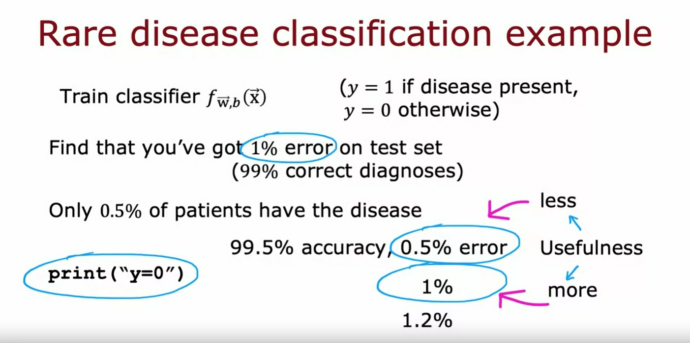
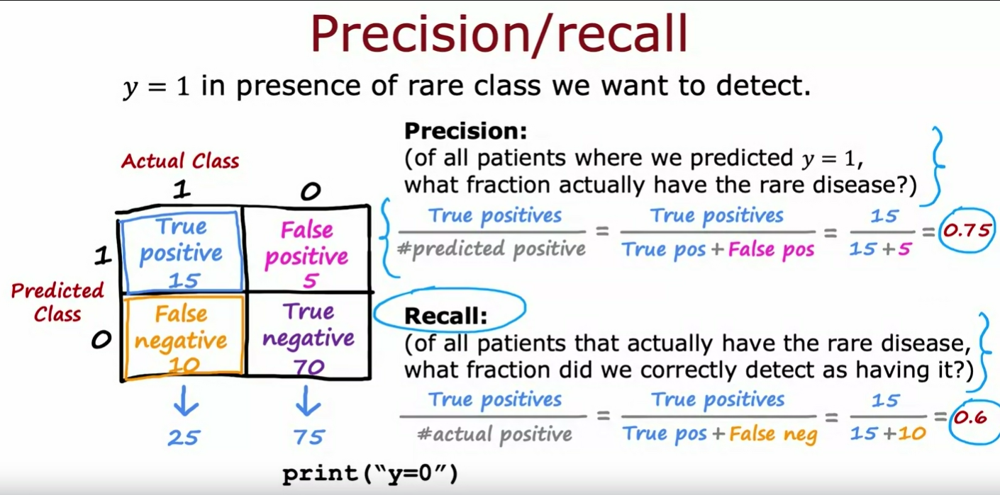
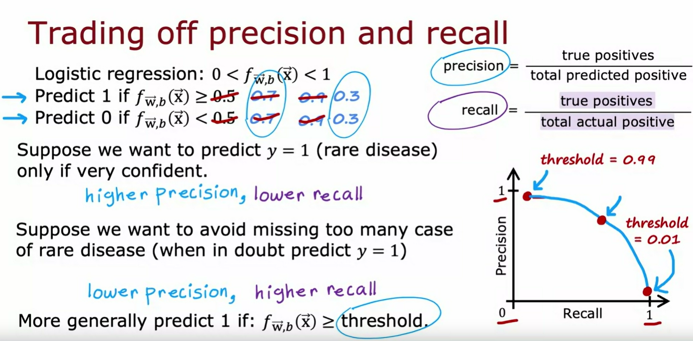
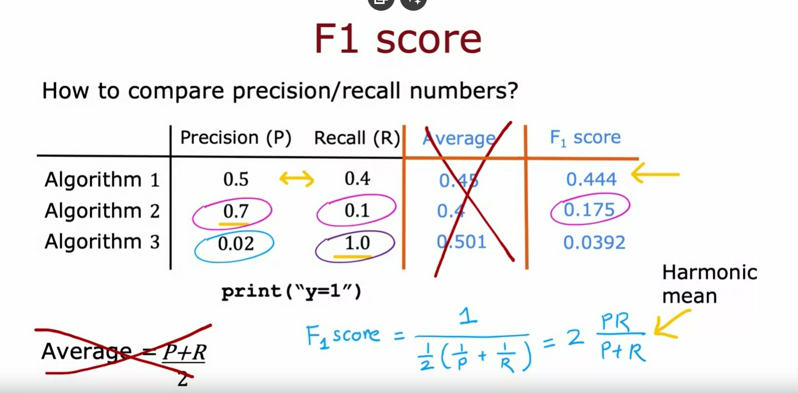

## Error metrics for skewed datasets



If you're working on a Machine Learning application where the ratio of positive to negative examples is very skewed, very far from 50-50, then it turns out that the usual error metrics like **accuracy** don't work that well. Let's start with an example. 

Let's say you're training a binary classifier to detect a rare disease in patients based on lab tests or based on other data from the patients. 

So, $y=1$ if the disease is present and $y=0$ otherwise and suppose you find that you've achieved 1% error on the test set, so you have a 99 % correct diagnosis. This seems like a great outcome. 

But it turns out that if this is a rare disease, so $y=1$ very rarely, then this may not be as impressive as it sounds. 

Specifically, if it is a rare disease and if only 0.5 % of the patients in your population have the disease, then if instead you wrote the program that just said

```python 
print("y=0")
```

It predicts $y=0$ all the time this very simple even non-learning algorithm, because it just says $y=0$ all the time, this will actually have 99.5 % accuracy or 0.5 % error. 

This really dumb algorithm outperforms your learning algorithm which had 1 % error, much worse than 0.5 % error. But I think a piece of software that just prints $y=0$ is not a very useful diagnostic tool. 

What this really means is that you can't tell if getting 1 % error is actually a good result or a bad result. 

In particular, if you have one algorithm that achieves 99.5 % accuracy, different one that achieves 99.2 % accuracy, different one that achieves 99.6 % accuracy it's difficult to know which of these is actually the best algorithm because if you have an algorithm that achieves 0.5 % error and a different one that achieves 1 % error and a different one that achieves 1.2 % error, it's difficult to know which of these is the best algorithm because the one with the lowest error may be a not particularly useful prediction like this that always predicts $y=0$ and never ever diagnose any patient as having this disease and quite possibly an algorithm that has 1 % error, but that at least diagnosis some patients as having the disease could be more useful than just printing $y=0$ all the time

## New error metrics: Precision / Recall



When working on problems with skewed data sets, we usually use a different error metric rather than just classification error to figure out how well your learning algorithm is doing. 

In particular, a common pair of error metrics are **Precision and Recall**, which we'll define on the slide. 

### Confusion Matrix (CM)

In this example, $y=1$ will be the rare class, such as the rare disease that we may want to detect and in particular to evaluate a learning algorithm's performance with one rare class it's useful to construct what's called a **Confusion Matrix (CM)**, which is a two-by-two matrix or a two-by-two table that looks like this. 

On the axis on top, I'm going to write the actual class, which could be one or zero and on the vertical axis, I'm going to write the predicted class, which is what did your learning algorithm predicts on a given example, one or zero? 

To evaluate your algorithm's performance on the cross-validation set or the test set say, we will then count up how many examples was the actual class 1 and the predicted class 1? Maybe you have 100 cross-validation examples and on 15 of them, the learning algorithm had predicted one and the actual label was also one. 

Over here you would count up the number of examples in C or cross-validation set where the actual class was zero and your algorithm predicted one. Maybe you've five examples there and here predicted Class 0, actual Class 1 so you have 10 examples and let's say 70 examples with predicted Class 0 and actual Class 0. 

In this example, the skew isn't as extreme as what I had on the previous slide because in these 100 examples in your cross-validation set, we have a total of 25 examples where the actual class was one and 75 where the actual class was zero by adding up these numbers vertically. 

You'll notice also that I'm using different colors to indicate these four cells in the table. I'm actually going to give names to these four cells. 

#### True positive (TP)

    When the actual class is one and the predicted class is one, we're going to call that a true positive because you predicted positive and it was true there's a positive example. 

#### True negative (TN)

    In this cell on the lower right, where the actual class is zero and the predicted class is zero, we will call that a true negative because you predicted negative and it was true. It really was a negative example. 

#### False positive (FP)

    This cell on the upper right is called a false positive because the algorithm predicted positive, but it was false. It's not actually positive, so this is called a false positive. 

#### False negative (FN)

    This cell is called the number of false negatives because the algorithm predicted zero but it was false, it wasn't actually negative. The actual class was one. 

Having divided the classifications into these four cells, two common metrics you might compute are then the Precision and Recall. Here's what they mean. 

### Precision

The Precision of the learning algorithm computes of all the patients where we predicted $y=1$, what fraction actually has the rare disease. In other words, Precision is defined as the number of true positives divided by the number classified as positive. In other words, of all the examples you predicted as positive, what fraction did we actually get right. 

$$ \text{Precision =} \frac{TP}{\text {No. of predicted positives}} $$

Another way to write this formula would be true positives divided by true positives plus false positives because it is by summing this cell (TP) and this cell (FP) that you end up with the total number that was predicted as positive.

$$ \text{Precision =} \frac{TP}{TP + FP} $$

In this example, the numerator, true positives (TP), would be 15 divided by 15 plus 5, and so that's 15 over 20 or three-quarters, 0.75. So we say that this algorithm has a Precision of 75 % because of all the things it predicted as positive, of all the patients that it thought has this rare disease, it was right 75 % of the time. 

$$ \text{Precision =} \frac{15}{15 + 5} = \frac{15}{20} = \frac{3}{4} = 0.75 $$

### Recall

The second metric that is useful to compute is Recall and Recall asks: Of all the patients that actually have the rare disease, what fraction did we correctly detect as having it? 

Recall is defined as the number of true positives divided by the number of actual positives. 

$$ \text{Recall =} \frac{TP}{\text {No. of actual positives}} $$

Alternatively, we can write that as number of true positives divided by the number of true positives plus the number of false negatives because it's by summing up this upper-left cell (TP) and this lower-left cell (FN) that you get the number of actual positive examples. 

$$ \text{Recall =} \frac{TP}{TP + FN} $$

In our example, this would be 15 divided by 15 plus 10, which is 15 over 25, which is 0.6 or 60 %. 

$$ \text{Recall =} \frac{15}{15 + 10} = \frac{15}{25} = \frac{3}{5} = 0.6 $$

So, this learning algorithm would have 0.75 Precision and 0.60 Recall. 

You notice that this will help you detect if the learning algorithm is just printing $y=0$ all the time because if it predicts zero all the time, then the numerator of both of these quantities would be zero. It has no true positives and the Recall metric in particular helps you detect if the learning algorithm is predicting zero all the time because if your learning algorithm just prints $y=0$, then the number of true positives will be zero because it never predicts positive, and so the Recall will be equal to zero divided by the number of actual positives, which is equal to zero.

In general, a learning algorithm with either zero Precision or zero Recall is not a useful algorithm. 

But just as a side note, if an algorithm actually predicts zero all the time, Precision actually becomes undefined because it's actually zero over zero. 

But in practice, if an algorithm doesn't predict even a single positive, we just say that Precision is also equal to zero. 

But we'll find that computing both Precision and Recall makes it easier to spot if an algorithm is both reasonably accurate in that: 

- when it says a patient has a disease there's a good chance the patient has a disease, such as 0.75 chance in this example

- and also making sure that of all the patients that have the disease, it's helping to diagnose a reasonable fraction of them, such as here it's finding 60 % of them
  
So, when you have a rare class looking at Precision and Recall and making sure that both numbers are decently high, that hopefully helps reassure you that your learning algorithm is actually useful. 

The term Recall was motivated by this observation that if you have a group of patients or population of patients, then Recall measures, of all the patients that have the disease, how many would you have accurately diagnosed as having it. 

### Summary 

So, when you have skewed classes or a rare class that you want to detect, Precision and Recall helps you tell if your learning algorithm is making good predictions or useful predictions. 

Now that we have these metrics for telling how well your learning algorithm is doing, in the next video, let's take a look at how to trade-off between Precision and Recall to try to optimize the performance of your learning algorithm

## Trading off precision and recall



In the ideal case, we would like for learning algorithms that have high precision and high recall. 

High precision would mean that if a diagnosis of patients have that rare disease, probably the patient does have it and it's an accurate diagnosis and high recall means that if there's a patient with that rare disease, probably the algorithm will correctly identify that they do have that disease. 

But it turns out that in practice there's often a trade-off between precision and recall. In this video, we'll take a look at that trade-off and how you can pick a good point along that trade-off. 

So, here are the definitions from the last video on precision and recall, I'll just write them here. Well, you recall precision is the number of true positives divided by the total number that was predicted positive, and recall is the number of true positives divided by the total actual number of positives. 

If you're using logistic regression to make predictions, then the logistic regression model will output numbers between 0 and 1. We would typically threshold the output of logistic regression at 0.5 and predict 1 if $f(x) >= 0.5$ and predict 0 if $f(x) < 0.5$

### Setting a higher threshold
#### Spoiler: By setting a higher threshold, we will end up having a algorithm with

- higher precision
- lower recall

Suppose we want to predict that $y=1$, that is the rare disease is present, only if we're very confident. 

So, if our philosophy is, whenever we predict that the patient has a disease, we may have to send them for possibly invasive and expensive treatment. So, if the consequences of the disease aren't that bad, even if left not treated aggressively, then we may want to predict $y=1$ only if we're very confident. 

In that case, we may choose to set a higher threshold where we will predict $y=1$ only if $f(x) >= 0.7$, so this is saying we'll predict $y=1$ only we're at least 70 percent sure rather than just 50 percent sure and so this number also becomes 0.7. 

Notice that these two numbers have to be the same because it's just depending on whether it's greater than or equal to or less than this number that you predict 1 or 0. 

And by raising this threshold, you predict $y=1$ only if you're pretty confident and what that means is that precision will increase because whenever you predict one, you're more likely to be right so raising the thresholds will result in higher precision, but it also results in lower recall because we're now predicting one less often and so of the total number of patients with the disease, we're going to correctly diagnose fewer of them. 

So, by raising this threshold to 0.7, you end up with higher precision but lower recall. And in fact, if you want to predict $y=1$ only if you are very confident, you can even raise this higher to 0.9 and that results in an even higher precision and so whenever you predict the patient has the disease, you're probably right and this will give you a very high precision but the recall will go even further down. 

### Setting a lower threshold
#### Spoiler: By setting a lower threshold, we will end up having a algorithm with

- lower precision
- higher recall

On the flip side, suppose we want to avoid missing too many cases of the rare disease, so if what we want is when in doubt predict $y=1$. 

This might be the case where if treatment is not too invasive or painful or expensive but leaving a disease untreated has much worse consequences for the patient.

In that case, you might say, when in doubt in the interests of safety let's just predict that they have it and consider them for treatment because untreated cases could be quite bad. 

If for your application, that is the better way to make decisions, then you would take this threshold instead lower it, say, set it to 0.3. 

In that case, you predict 1 so long as you think there's maybe a 30 percent chance or better of the disease being present and you predict 0 only if you're pretty sure that the disease is absent. 

As you can imagine, the impact on precision and recall will be opposite to what you saw up here and lowering this threshold will result in lower precision because we're now looser, we're more willing to predict one even if we aren't sure but to result in higher recall because of all the patients that do have that disease, we're probably going to correctly identify more of them. 

### Precision-Recall graph (Trade-offs between them)

More generally, we have the flexibility to predict 1 only if f is above some threshold and by choosing this threshold, we can make different trade-offs between precision and recall. It turns out that for most learning algorithms, there is a trade-off between precision and recall. 

Precision and recall both go between 0 and 1 and if you were to set a very high threshold, say a threshold of 0.99, then you enter with very high precision, but lower recall and as you reduce the value of this threshold, you then end up with a curve that trades off precision and recall until eventually, if you have a very low threshold, so the threshold equals 0.01, then you end up with very low precision but relatively high recall. 

Sometimes by plotting this curve, you can then try to pick a threshold which corresponds to picking a point on this curve that balances the cost of false positives and false negatives or that balances the benefits of high precision and high recall. 

So, plotting precision and recall for different values of the threshold allows you to pick a point that you want. Notice that picking the threshold is not something you can really do with cross-validation because it's up to you to specify the best points. 

For many applications, manually picking the threshold to trade-off precision and recall will be what you end up doing

### Another metric: F1 score (or Harmonic mean between Precision and Recall)



It turns out that if you want to automatically trade-off precision and recall rather than have to do so yourself, there is another metric called the *F1 score* that is sometimes used to automatically combine Precision and Recall to help you pick the best value or the best trade-off between the two. 

One challenge with Precision and Recall is you're now evaluating your algorithms using two different metrics, so if you've trained three different algorithms and the precision-recall numbers look like this, is not that obvious how to pick which algorithm to use. 

If there was an algorithm that's better on precision and better on recall, then you probably want to go with that one.

But in this example, Algorithm 2 has the highest precision, but Algorithm 3 has the highest recall, and Algorithm 1 trades off the two in-between, and so no one algorithm is obviously the best choice. 

In order to help you decide which algorithm to pick, it may be useful to find a way to combine precision and recall into a single score, so you can just look at which algorithm has the highest score and maybe go with that one. 

#### Bad way to combine Precision and Recall: Taking the average of them

One way you could combine precision and recall is to take the average, this turns out not to be a good way, so I don't really recommend this but if we were to take the average, you get 0.45, 0.4, and 0.5. But it turns out that computing the average and picking the algorithm with the highest average between precision and recall doesn't work that well because this algorithm has very low precision, and in fact, this corresponds maybe to an algorithm that actually does print $y=1$ and diagnosis all patients as having the disease, that's why recall is perfect but the precision is really low so algorithm 3 is actually not a particularly useful algorithm, even though the average between precision and recall is quite high. So, let's not use the average between precision and recall. 

#### Good way to combine Precision and Recall: F1 score

Instead, the most common way of combining Precision and Recall is to compute something called the F1 score, and the F1 score is a way of combining P and R precision and recall but that gives more emphasis to whichever of these values is lower because it turns out if an algorithm has very low precision or very low recall is pretty not that useful. 

So, the F1 score is a way of computing an average of sorts that pays more attention to whichever is lower. 

The formula for computing F1 score is the following: you're going to compute one over P and one over R, and average them, and then take the inverse of that. Rather than averaging P and R Precision and Recall we're going to average one over P and one over R, and then take one over that.

$$ \text{F$_1$ score = } \frac{1}{\frac{1}{2}(\frac{1}{P}+\frac{1}{R})} $$

If you simplify this equation it can also be computed as follows:

$$ \text{F$_1$ score = } 2\frac{P*R}{P+R}$$

but by averaging one over P and one over R this gives a much greater emphasis to if either P or R turns out to be very small. 

If you were to compute the F1 score for these three algorithms, you'll find that the F1 score for Algorithm 1 is 0.444, and for the second algorithm is 0.175 (you notice that 0.175 is much closer to the lower value than the higher value) and for the third algorithm is 0.0392

F1 score gives away to trade-off precision and recall, and in this case, it will tell us that maybe the first algorithm is better than the second or the third algorithms

By the way, in math, this equation is also called the **harmonic mean of P and R**, and the harmonic mean is a way of taking an average that emphasizes the smaller values more. 

But for the purposes of this class, you don't need to worry about that terminology of the harmonic mean. 

### Summary

Congratulations on getting to the last video of this week and thank you also for sticking with me through these two optional videos. In this week, you've learned a lot of practical tips/practical advice for how to build a machine learning system, and by applying these ideas, I think you'd be very effective at building machine learning algorithms. 

Next week, we'll come back to talk about another very powerful machine learning algorithm. In fact, of the advanced techniques that why we use in many commercial production settings, I think at the top of the list would be neural networks and decision trees. So, next week we'll talk about decision trees, which I think will be another very powerful technique that you're going to use to build many successful applications as well. I look forward to seeing you next week.

## Programming Assignment: Practice Lab: Advice for Applying Machine Learning