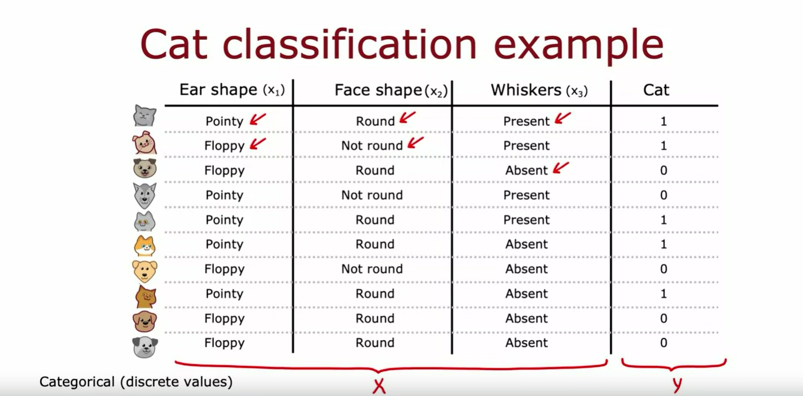
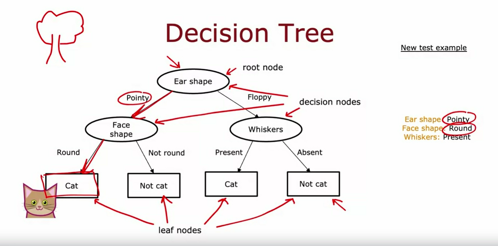
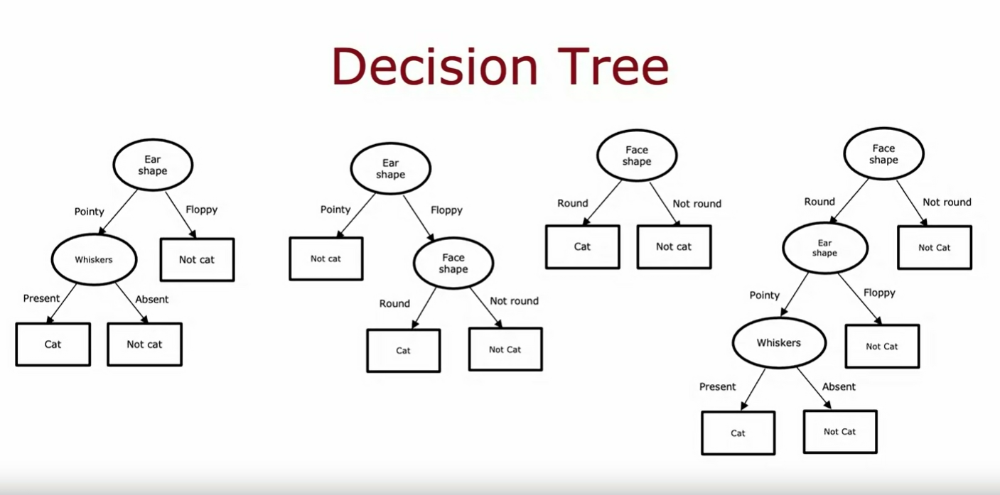
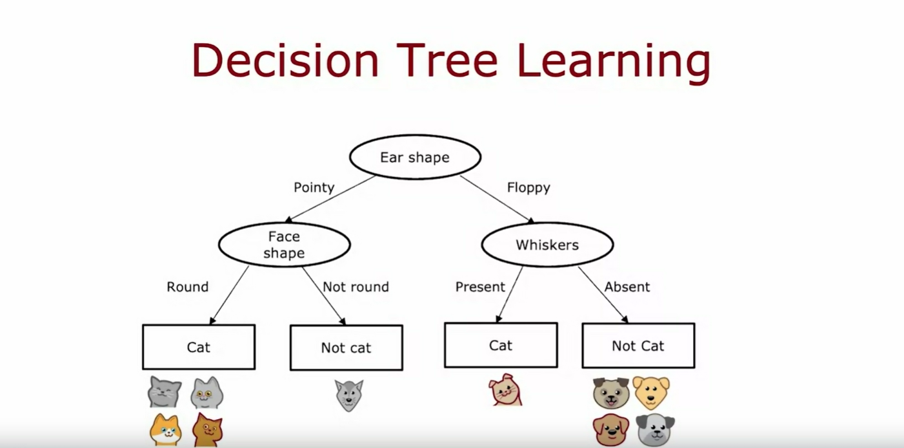
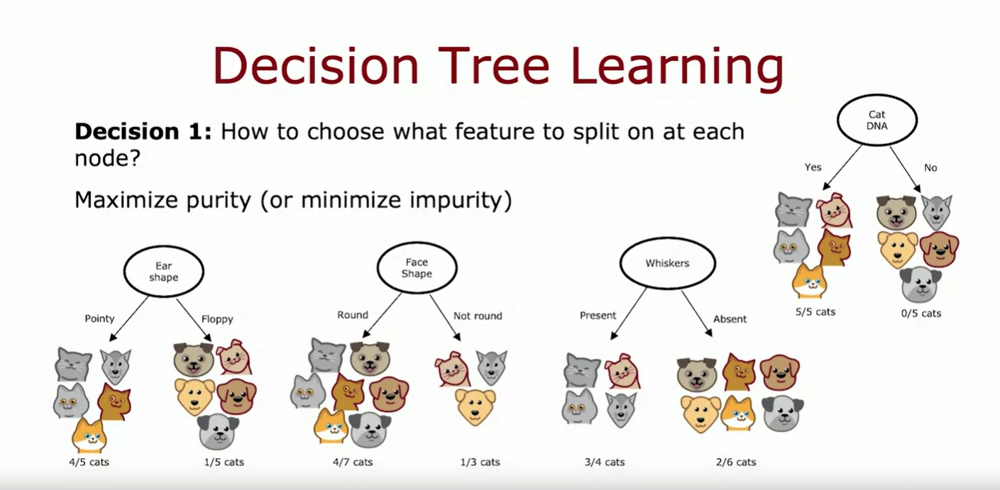
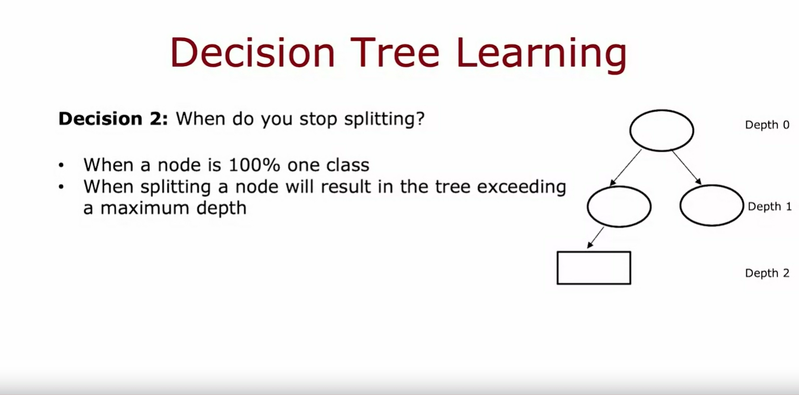

## Decision tree model

Welcome to the final week of this course on Advanced Learning Algorithms. 

One of the learning algorithms that is very powerful, widely used in many applications, also used by many to win machine learning competitions is *Decision trees and tree ensembles* 

Despite all the successes of decision trees, they somehow haven't received that much attention in academia, and so you may not hear about decision trees nearly that much, but it is a tool well worth having in your toolbox. 

In this week, we'll learn about decision trees and you'll see how to get them to work for yourself. Let's dive in. 

### Example: Cat classification

To explain how decision trees work, I'm going to use as a running example this week a cat classification example. You are running a cat adoption center and given a few features, you want to train a classifier to quickly tell you if an animal is a cat or not. 

I have here 10 training examples and associated with each of these 10 examples, we're going to have features regarding the animal's ear shape, face shape, whether it has whiskers, and then the ground truth label that you want to predict if this animal is a cat. 

The first example has pointy ears, round face, whiskers are present, and it is a cat. The second example has floppy ears, the face shape is not round, whiskers are present, and yes, that is a cat, and so on for the rest of the examples. 

This dataset has five cats and five dogs in it. The input features $X$ are these three columns, and the target output that you want to predict, $y$, is this final column of, is this a cat or not? 

In this example, the features X take on categorical values. In other words, the features take on just a few discrete values. Ear shapes are either pointy or floppy, the face shape is either round or not round and whiskers are either present or absent. 

And this is a binary classification task because the labels are also one or zero. For now, each of the features $X_1$, $X_2$ and $X_3$ take on only two possible values. We'll talk about features that can take on more than two possible values, as well as continuous-valued features later in this week

### Decision tree

What is a decision tree? Here's an example of a model that you might get after training a decision tree learning algorithm on the data set that you just saw.

The model that is output by the learning algorithm looks like a tree, and a picture like this is what computer scientists call a tree. If it looks nothing like the biological trees that you see out there to you, it's okay, don't worry about it. We'll go through an example to make sure that this computer science definition of a tree makes sense to you as well. 

Every one of these ovals or rectangles is called a node in the tree. The way this model works is if you have a new test example: she has a cat where the ear-shaped has pointy, face shape is round, and whiskers are present then the way this model will look at this example and make a classification decision is will start with this example at this topmost node of the tree, this is called the root node of the tree, and we will look at the feature written inside, which is ear shape. Based on the value of the ear shape of this example we'll either go left or go right. The value of the ear-shape with this example is pointy, and so we'll go down the left branch of the tree, like so, and end up at this oval node over here. We then look at the face shape of this example, which turns out to be round, and so we will follow this arrow down over here and the algorithm will make a inference that it thinks this is a cat and you get to this node and the algorithm will make a prediction that this is a cat. 

What I've shown on this slide is one specific decision tree model. To introduce a bit more terminology, this top-most node in the tree is called the root node. All of these nodes, that is, all of these oval shapes, but excluding the boxes at the bottom, all of these are called decision nodes. They're decision nodes because they look at a particular feature and then based on the value of the feature, cause you to decide whether to go left or right down the tree. Finally, these nodes at the bottom, these rectangular boxes are called leaf nodes and they make a prediction. 

If you haven't seen computer scientists' definitions of trees before, it may seem non-intuitive that the root of the tree is at the top and the leaves of the tree are down at the bottom. Maybe one way to think about this is this is more akin to an indoor hanging plant, which is why the roots are up top, and then the leaves tend to fall down to the bottom of the tree. 

### More decision tree examples

In this slide, I've shown just one example of a decision tree.Here are a few others. 

This is a different decision tree for trying to classify *cat vs not cat*.

In this tree, to make a classification decision, you would again start at this topmost root node and depending on their ear shape of an example, you'd go either left or right. If the ear shape is pointy, then you look at the whiskers feature, and depending on whether whiskers are present or absent, you go left or right to gain and classify cat versus not cat. 

Just for fun, here's a second example of a decision tree, here's a third one, and here's a fourth one. Among these different decision trees, some will do better and some will do worse on the training sets or on the cross-validation and the test sets. 

So, the job of the decision tree learning algorithm is, out of all possible decision trees, to try to pick one that hopefully does well on the training set, and then also ideally generalizes well to new data such as your cross-validation and test sets as well. 

So, it seems like there are lots of different decision trees one could build for a given application. How do you get an algorithm to learn a specific decision tree based on a training set? Let's take a look at that in the next video

## Learning Process

The process of building a decision tree given a training set has a few steps. In this video, let's take a look at the overall process of what you need to do to build a decision tree. 

### Step 1 building a decision tree
#### Selecting the feature to be used in the root node

Given a training set of 10 examples of cats and dogs like you saw in the last video, the first step of decision tree learning is, we have to decide what feature to use at the root node that is the first node at the very top of the decision tree. 

Via an algorithm that we'll talk about in the next few videos let's say that we decided to pick as the feature and the root node, the ear shape feature. 

What that means is we will decide to look at all of our training examples, all ten examples shown here, I split them according to the value of the ear shape feature. 

In particular, let's pick out the five examples with pointy ears and move them over down to the left and let's pick the five examples with floppy ears and move them down to the right. 

### Step 2 building a decision tree
#### Decide what feature to use next

The second step is focusing just on the left part or sometimes called the left branch of the decision tree to decide what nodes to put over there. In particular, what feature that we want to split on or what feature do we want to use next. 

Via an algorithm that again, we'll talk about later this week let's say you decide to use the face shape feature there. What we'll do now is take these five examples and split these five examples into two subsets based on their value of the face shape. 

So, we'll take the four examples out of these five with a round face shape and move them down to the left and the one example with a not round face shape and move it down to the right. 

Finally, we notice that these four examples are all cats (four of four them are cats) and rather than splitting further, were created a leaf node that makes a prediction that things that get down to that node of cats and over here we notice that none of the examples zero of the one examples are cats or alternative 100 percent of the examples here are dogs. 

We can create a leaf node here that makes a prediction of not cat. 

### Step 3 building a decision tree
#### Same process for the right branch

Having done this on the left part or the left branch of this decision tree, we now repeat a similar process on the right part or the right branch of this decision tree and focus attention on just these five examples, which contains one cat and four dogs. 

We would have to pick some feature over here to use the split these five examples further. If we end up choosing the whiskers feature, we would then split these five examples based on where the whiskers are present or absent, like so. 

You notice that one out of one examples on the left for cats and zeros out of four are cats. Each of these nodes is completely pure, meaning that is, all cats or not cats and there's no longer a mix of cats and dogs. 

And so we can create these leaf nodes, making a cat prediction on the left and a not cat prediction here on the right. 

This is a process of building a decision tree. Through this process, there were a couple of key decisions that we had to make at various steps during the algorithm. Let's talk through what those key decisions were and we'll keep on session of the details of how to make these decisions in the next few videos

## Key decisions on building the tree
### 1st key decision: Choose a feature to split on at each node

The first key decision was, how do you choose what features to use to split on at each node? At the root node, as well as on the left branch and the right branch of the decision tree, we had to decide if there were a few examples at that node comprising a mix of cats and dogs. 

Do you want to split on the ear-shaped feature or the facial feature or the whiskers feature? We'll see in the next video, that decision trees will choose what feature to split on in order to try to maximize purity. 

#### Purity concept

By purity, I mean, you want to get to what subsets, which are as close as possible to all cats or all dogs. 

For example, if we had a feature that said, does this animal have cat DNA, we don't actually have this feature but if we did, we could have split on this feature at the root node, which would have resulted in five out of five cats in the left branch and zero of the five cats in the right branch. 

Both these left and right subsets of the data are completely pure, meaning that there's only one class, either cats only or not cats only in both of these left and right sub-branches, which is why the cat DNA feature if we had this feature would have been a great feature to use. 

But with the features that we actually have, we had to decide, what is the split on ear shape which result in four out of five examples on the left being cats, and one of the five examples on the right being cats or face shape where it resulted in the four of the seven on the left and one of the three on the right, or whiskers, which resulted in three out four examples being cast on the left and two out of six being not cats on the right. 

The decision tree learning algorithm has to choose between ear-shaped, face shape, and whiskers. Which of these features results in the greatest purity of the labels on the left and right sub branches? Because it is if you can get to a highly pure subsets of examples, then you can either predict cat or predict not cat and get it mostly right. 

The next video on entropy, we'll talk about how to estimate impurity and how to minimize impurity. The first decision we have to make when learning a decision tree is how to choose which feature to split on on each node

### 2nd key decision: Decide when to stop splitting

The second key decision you need to make when building a decision tree is to decide when do you stop splitting.

#### 1. When a node is 100 % one class

The criteria that we use just now was stop splitting until I know there's either 100 percent all cats or a 100 percent of dogs or not cats because at that point is seems natural to build a leaf node that just makes a classification prediction. 

#### 2. When splitting a node will result in the tree exceeding a maximum depth

Alternatively, you might also decide to stop splitting when splitting a node further will result in the tree exceeding the maximum depth where the maximum depth that you allow the tree to grow to is a parameter that you could just decide. 

In decision tree, the depth of a node is defined as the number of hops that it takes to get from the root node that is denoted the very top to that particular node. 

So, the root node takes zero hops to get to itself and is at Depth 0, the notes below it are at depth one and in those below it would be at Depth 2. 

If you had decided that the maximum depth of the decision tree is say two, then you would decide not to split any nodes below this level so that the tree never gets to Depth 3. 

##### Why to set a limit the depth of the decision tree 

1. One reason you might want to limit the depth of the decision tree is to make sure for us the tree doesn't get too big and unwieldy 
2. and second by keeping the tree small, it makes it less prone to overfitting.

#### 3. When improvements in purity score are below a threshold

Another criteria you might use to decide to stop splitting might be if the improvements in the purity score, which you see in a later video, are below a certain threshold. 

So, if splitting a node results in minimum improvements to purity or you see later is actually decreases in impurit but if the gains are too small, they might not bother. Again, both to keep the trees smaller and to reduce the risk of overfitting. 

#### 4. When the number of examples in a node is below a threshold

Finally, if the number of examples in a node is below a certain threshold, then you might also decide to stop splitting. 

For example, if at the root node we have split on the face shape feature, then the right branch will have had just three training examples with one cat and two dogs and rather than splitting this into even smaller subsets, if you decided not to split further set of examples with just three of your examples, then you will just create a decision node and because there are mainly dogs, 2 out three adults here, this would be a node and this makes a prediction of not cat. 

Again, one reason you might decide this is not worth splitting on is to keep the tree smaller and to avoid overfitting. 

## Summary 

When I look at decision tree learning algorithms myself, sometimes I feel like, boy, there's a lot of different pieces and lots of different things going on in this algorithm.

Part of the reason it might feel is in the evolution of decision trees. There was one researcher that proposed a basic version of decision trees and then a different researcher said, oh, we can modify this thing this way, such as his new criteria for splitting. Then a different researcher comes up with a different thing like, oh, maybe we should stop splitting when it reaches a certain maximum depth. Over the years, different researchers came up with different refinements to the algorithm. As a result of that, it does work really well but we look at all the details of how to implement a decision tree. It feels a lot of different pieces such as why there's so many different ways to decide when to stop splitting. 

If it feels like a somewhat complicated, messy algorithm to you, it does to me too. But these different pieces, they do fit together into a very effective learning algorithm and what you learn in this course is the key, most important ideas for how to make it work well, and then at the end of this week, I'll also share with you some guidance, some suggestions for how to use open source packages so that you don't have to have too complicated the procedure for making all these decisions like how do I decide to stop splitting? You really get these algorithms to work well for yourself. 

But I want to reassure you that if this algorithm seems complicated and messy, it frankly does to me too, but it does work well. 

Now, the next key decision that I want to dive more deeply into is how do you decide how to split a node. In the next video, let's take a look at this definition of entropy, which would be a way for us to measure purity, or more precisely, impurity in a node. Let's go on to the next video

