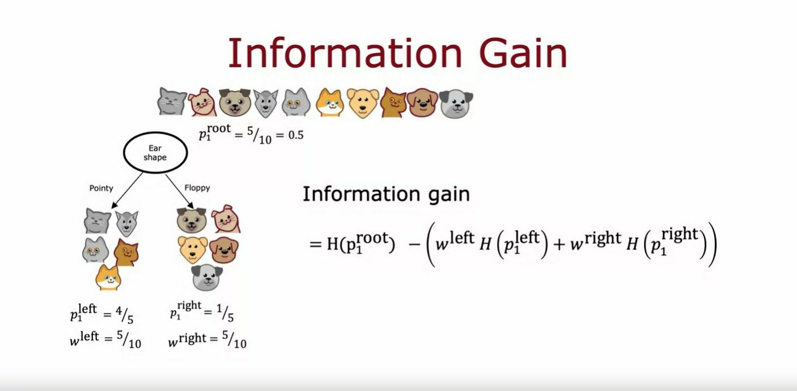

## Measuring purity

In this video, we'll look at the way of measuring the purity of a set of examples. 

If the examples are all cats of a single class then that's very pure, if it's all not cats that's also very pure, but if it's somewhere in between how do you quantify how pure is the set of examples? 

### Entropy definition

Let's take a look at the definition of entropy which is a measure of the impurity of a set of data. 

Given a set of six examples like this, we have three cats and three dogs, let's define $p_1$ to be the fraction of examples that are cats, 

$$ p_1 \text{ = fraction of examples that are cats}$$

that is, the fraction of examples with label one, that's what the subscript one indicates. And so, in this example $p_1=\frac{3}{6}=0.5$

### Entropy function *H(p)*

We're going to measure the impurity of a set of examples using a function called *The entropy function* which looks like this. The entropy function is conventionally denoted as capital H of this number $p_1$, this is $H(p_1)$ and the function looks like this curve over here where the horizontal axis is $p_1$, the fraction of cats in the sample, and the vertical axis is the value of the entropy.

#### Example 1
In this example, where $p_1=\frac{3}{6}=0.5$, the value of the entropy of $p_1 = 1$. 

So, you notice that this curve is highest when your set of examples is 50-50, so it's most impure as an impurity of one or with an entropy of one when your set of examples is 50-50, whereas in contrast if your set of examples was either all cats or all not cats then the entropy is zero. 

$\text{If } p_1 = 0.5, \text{then } H(p_1) = 1$

$\text{If } p_1 = 0, \text{then } H(p_1) = 0$

$\text{If } p_1 = 1, \text{then } H(p_1) = 0$

#### Example 2

Let's just go through a few more examples to gain further intuition about entropy and how it works. Here's a different set of examples with five cats and one dog, so $p_1$, the fraction of positive examples, a fraction of examples labeled one is 5/6 and so $p_1$ is about 0.83 and if you read off that value at about 0.83 we find that the entropy of $p_1$ is about 0.65. And here I'm writing it only to two significant digits. 

#### Example 3

Here's one more example. This sample of six images has all cats so $p_1$ is six out of six because all six are cats and the entropy of $p_1$ is this point over here which is zero. 

We see that as you go from 3 out of 6 cats, $p_1 = \frac{3}{6} = 0.5$, to 6 out of 6 cats, $p_1 = \frac{6}{6} = 1$, the impurity decreases from one to zero or in other words, the purity increases as you go from a 50-50 mix of cats and dogs to all cats. 

#### Example 4

Let's look at a few more examples. Here's another sample with two cats and four dogs, so $p_1$ here is 2/6 which is 1/3, and if you read off the entropy at 0.33 it turns out to be about 0.92. This is actually quite impure and in particular this set is more impure than this set because it's closer to a 50-50 mix, which is why the impurity here is 0.92 as opposed to 0.65. 

#### Example 5

Finally, one last example, if we have a set of all six dogs then $p_1$ is equal to 0 and the entropy of $p_1$ is just this number down here which is equal to 0 so there's zero impurity or this would be a completely pure set of all not cats or all dogs. 

### Equation for the entropy function H($p_1$)

Now, let's look at the actual equation for the entropy function H($p_1$). 

Recall that 

$$p_1 \text{ = is the fraction of examples that are equal to cats}$$ 

so if you have a sample that is 2/3 cats then that sample must have 1/3 not cats. 

So, let me define $p_0$: 

$$p_0 \text{ = is the fraction of examples that are NOT cats}$$ 

$$p_0 = 1 - p_1$$ 

The entropy function $H(p_1)$ is then defined as:

$$ H(p_1) = -p_1log_2(p_1) - p_0log_2(p_0) $$

> [!NOTE] 
> By convention when computing entropy we take logs to base *2* rather than to base *e*

Alternatively, this is also equal to: 

$$ H(p_1) = -p_1log_2(p_1) - (1-p_1)log_2(1-p_1) $$

If you were to plot this function in a computer you will find that it will be exactly this function on the left. 

> [!NOTE] 
>
> We take $log_2$ just to make the peak of this curve equal to one. If we were to take $log_e$ or the base of natural logarithms, then that just vertically scales this function and it will still work but the numbers become a bit hard to interpret because the peak of the function isn't a nice round number like one anymore. 

> [!NOTE] 
> One note on computing this entropy function H: 
> 
> If $p_1 = 0$ or $p_0 = 0$, then an expression like this will look like $0 * log(0)$ and $log(0)$ is technically undefined, it's actually negative infinity. 
> But, by convention, for the purposes of computing entropy, we'll take $0 * log(0) = 0$ and that will correctly compute the entropy $H(0) = 0$ or $H(1) = 0$

If you're thinking that this definition of entropy looks a little bit like the definition of the logistic loss that we learned about in the last course, there is actually a mathematical rationale for why these two formulas look so similar. 

But you don't have to worry about it and we won't get into it in this class. But applying this formula for entropy should work just fine when you're building a decision tree. 

## Summary 
 
To summarize, the entropy function is a measure of the impurity of a set of data. It starts from zero, it goes up to one, and then comes back down to zero as a function of the fraction of positive examples in your sample. 

There are other functions that look like this, they go from zero up to one and then back down. For example, if you look in open source packages you may also hear about something called the **Gini criteria**, which is another function that looks a lot like the entropy function, and that will work well as well for building decision trees but for the sake of simplicity, in these videos I'm going to focus on using the **entropy criteria** which will usually work just fine for most applications. 

Now that we have this definition of entropy, in the next video let's take a look at how you can actually use it to make decisions as to what feature to split on in the nodes of a decision tree.

## Choosing a split: Information Gain

When building a decision tree, the way we'll decide what feature to split on at a node will be based on what choice of feature reduces entropy the most (Reduces entropy or reduces impurity, or maximizes purity) 

In decision tree learning, the reduction of entropy is called *Information gain*

Let's take a look, in this video, at how to compute information gain and therefore choose what features to use to split on at each node in a decision tree. 

## How to compute Information Gain (Ig)

Let's use the example of deciding what feature to use at the root node of the decision tree we were building just now for recognizing cats vs not cats

### 1. Splitting on the ear shape feature

If we had split using the ear shape feature at the root node, this is what we would have gotten: Five examples on the left and five on the right and on the left, we would have four out of five cats, so $p_1 = \frac{4}{5} = 0.8$ and on the right, one out of five are cats, so $p_1 = \frac{1}{5} = 0.2$

If you apply the entropy formula 

$$ H(p_1) = -p_1log_2(p_1) - (1-p_1)log_2(1-p_1) $$

from the last video to both the left subset of data and right subset of data, we find that the degree of impurity on the left is entropy of 0.8, which is about 0.72, and on the right, the entropy of 0.2 turns out also to be 0.72. 

* For the left sub branch:

$$ H(p_1) = H(0.8) = 0.72 $$

* For the right sub branch:

$$ H(p_1) = H(0.2) = 0.72 $$

This would be the entropy at the left and right sub branches if we were to split on the ear shape feature. 

### 2. Splitting on the face shape feature

One other option would be to split on the face shape feature. 

If we'd done so then on the left, four of the seven examples would be cats, so $p_1 = \frac{4}{7} = 0.57$ and on the right, 1/3 are cats, so $p_1 = \frac{1}{3} = 0.33$

The entropy of 4/7 and the entropy of 1/3 are 0.99 and 0.92. 

* For the left sub branch:

$$ H(p_1) = H(4/7) = 0.99 $$

* For the right sub branch:

$$ H(p_1) = H(1/3) = 0.92 $$

So, the degree of impurity in the left and right nodes seems much higher, 0.99 and 0.92 compared to previously computed values of 0.72 and 0.72 when splitting on face shape

### 3. Splitting on the whiskers feature

Finally, the third possible choice of feature to use at the root node would be the whiskers feature in which case you split based on whether whiskers are present or absent. 

In this case, $p_1 = \frac{3}{4}$ on the left, $p_1 = \frac{2}{6}$ on the right, and the entropy values are as follows. 

* For the left sub branch:

$$ H(p_1) = H(3/4) = 0.81 $$

* For the right sub branch:

$$ H(p_1) = H(1/3) = 0.92 $$

## Which option works better?

So, the key question we need to answer is, given these three options of a feature to use at the root node, which one do we think works best? 

It turns out that rather than looking at these entropy numbers and comparing them, it would be useful to take a weighted average of them, and here's what I mean. 

If there's a node with a lot of examples in it with high entropy that seems worse than if there was a node with just a few examples in it with high entropy because entropy, as a measure of impurity, is worse if you have a very large and impure dataset compared to just a few examples and a branch of the tree that is very impure. 

So, the key decision is, of these three possible choices of features to use at the root node, which one do we want to use? 

Associated with each of these splits is two numbers:

1. The entropy on the left sub-branch and 
2. the entropy on the right sub-branch. 

In order to pick from these, we like to actually combine these two numbers into a single number so you can just pick of these three choices, which one does best.

## Weighted average entropy

The way we're going to combine these two numbers is by taking a weighted average because how important it is to have low entropy in, say, the left or right sub-branch also depends on how many examples went into the left or right sub-branch because if there are lots of examples in, say, the left sub-branch then it seems more important to make sure that that left sub-branch's entropy value is low. 

### 1. Ear shape calculus

In this example, we have five of the 10 examples went to the left sub-branch, so we can compute the weighted average as 5/10 times the entropy of 0.8, and then add to that 5/10 examples also went to the right sub-branch plus 5/10 times the entropy of 0.2. 

### 2. Face shape calculus

Now, for this example in the middle, the left sub-branch had received seven out of 10 examples and so we're going to compute 7/10 times the entropy of 0.57 plus the right sub-branch had three out of 10 examples, so plus 3/10 times entropy of 0.33 of 1/3. 

### 3. Whiskers calculus

Finally, on the right, we'll compute 4/10 times entropy of 0.75 plus 6/10 times entropy of 0.33. 

The way we will choose a split is by computing these three numbers and picking whichever one is lowest because that gives us the left and right sub-branches with the lowest average weighted entropy. 

## Computing the reduction in entropy

In the way that decision trees are built, we're actually going to make one more change to these formulas to stick to the convention in decision tree building but it won't actually change the outcome which is rather than computing this weighted average entropy, we're going to compute the reduction in entropy compared to if we hadn't split at all. 

So, if we go to the root node, remember that the root node we have started off with all 10 examples in the root node with five cats and five dogs and so at the root node, we had $p_1 = \frac{5}{10} = 0.5$ and the entropy of the root nodes is the entropy of 0.5 was actually equal to 1, $H(p_1) = H(0.5) = 1$. 

This was maximum impurity because it was five cats and five dogs. 

The formula that we're actually going to use for choosing a split is not this weighted entropy at the left and right sub-branches. Instead is going to be the entropy at the root node, which is entropy of 0.5, then minus this formula. 

In this example, if you work out the math, it turns out to be 0.28 for the face shape example, we can compute entropy of the root node, entropy of 0.5 minus this, which turns out to be 0.03, and for whiskers, compute that, which turns out to be 0.12. 

These numbers that we just calculated, 0.28, 0.03, and 0.12, these are called the **Information gain** and what it measures is the reduction in entropy that you get in your tree resulting from making a split because the entropy was originally one at the root node and by making the split, you end up with a lower value of entropy and the difference between those two values is a reduction in entropy and that's 0.28 in the case of splitting on the ear shape. 

## Reduction in entropy vs entropy at each sub branch

Why do we bother to compute reduction in entropy rather than just entropy at the left and right sub-branches? It turns out that one of the stopping criteria for deciding when to not bother to split any further is if the reduction in entropy is too small. In which case you could decide, you're just increasing the size of the tree unnecessarily and risking overfitting by splitting and just decide to not bother if the reduction in entropy is too small or below a threshold. 

In this other example, spitting on ear shape results in the biggest reduction in entropy: 0.28 is bigger than 0.03 or 0.12 and so we would choose to split onto ear shape feature at the root node. 

On the next slide, let's give a more formal definition of Information gain. 

By the way, one additional piece of notation that we'll introduce also in the next slide is these numbers, 5/10 and 5/10 I'm going to call them $w^{left}$ because that's the fraction of examples that went to the left branch, and I'm going to call this $w^{right}$ because that's the fraction of examples that went to the right branch whereas for this another example, $w^{left}$ would be 7/10, and $w^{right}$ will be 3/10

## General formula for how to compute information gain

Let's now write down the general formula for how to compute information gain.

## Left sub branch

Using the example of splitting on the ear shape feature, let me define $p_1^{left}$ to be equal to the fraction of examples in the left subtree that have a positive label, that are cats. 

In this example, $p_1^{left}$ will be equal to 4/5. 

Also, let me define $w^{left}$ to be the fraction of examples of all of the examples of the root node that went to the left sub-branch, and so in this example, $w^{left}$ would be 5/10. 

## Right sub branch

Similarly, let's define $p_1^{right}$ to be of all the examples in the right branch, the fraction that are positive examples and so one of the five of these examples being cats, there'll be 1/5, and similarly, $w^{right}$ is 5/10 the fraction of examples that went to the right sub-branch. 

## Root node

Let's also define $p_1^{root}$ to be the fraction of examples that are positive in the root node. In this case, this would be 5/10 or 0.5. 

## Information gain definition

Information gain is then defined as the entropy of $p_1^{root}$, so what's the entropy at the root node, minus that weighted entropy calculation that we had on the previous slide: This is, minus $w^{left}$, those were 5/10 in the example, times the entropy applied to $p_1^{left}$, that's entropy on the left sub-branch, plus $w^{right}$ the fraction of examples that went to the right branch, times entropy of $p_1^{right}$. 

$$ \text{Information gain =} H(p_1^{root}) - [w^{left} * H(p_1^{left}) + w^{right} * H(p_1^{right})] $$

With this definition of entropy, you can calculate the information gain associated with choosing any particular feature to split on in the node. 

> [!IMPORTANT] 
> Then, out of all the possible features you could choose to split on, you **choose the one that gives you the highest information gain**. The goal is for this split to **increase the purity of the resulting subsets on both the left and right branches of the decision tree**

## Summary

Now that you know how to calculate information gain or reduction in entropy, you know how to pick a feature to split on another node. Let's put all the things we've talked about together into the overall algorithm for building a decision tree given a training set. Let's go see that in the next video.

## Putting it together

The information gain criteria lets you decide how to choose one feature to split a one-node. Let's take that and use that in multiple places through a decision tree in order to figure out how to build a large decision tree with multiple nodes. 

### Overall process of building a decision tree

Here is the overall process of building a decision tree. 

1. It starts with all training examples at the root node of the tree
2. Then, it calculates the information gain for all possible features and pick the feature to split on that gives the highest information gain. 
3. Having chosen this feature, you would then split the dataset into two subsets according to the selected feature and create left and right branches of the tree and send the training examples to either the left or the right branch, depending on the value of that feature for that example. This allows you to have made a split at the root node. 
4. After that, you will then keep on repeating the splitting process on the left branch of the tree, on the right branch of the tree and so on and keep on doing that until the stopping criteria is met where the stopping criteria can be:
   - when a node is 100 % a single class, so one has reached entropy of zero 
   - or when further splitting a node will cause the tree to exceed the maximum depth that you had set 
   - or if the information gain from an additional splits is less than the threshold
   - or if the number of examples in a node is below a threshold. 
    
You will keep on repeating the splitting process until the stopping criteria that you've chosen, which could be one or more of these criteria is met.

## Illustration of the building tree process

Let's look at an illustration of how this process will work. 

We started all of the examples at the root node

and based on computing information gain for all three features, we decided that *ear shape* is the best feature to split on. 

Based on that, we create a left and right sub-branches and

sent the subsets of the data with pointy versus floppy ear to left and right sub-branches. 

Let me cover the root node and the right sub-branch and just focus on the left sub-branch where we have these five examples. 

> [!NOTE] 
> CRITERIA CHOSEN FOR SPLITTING: Split until a node is 100 % a single class.
> 
> Let's see off splitting criteria is to keep splitting until everything in the node belongs to a single class, so either all cats or all dogs. 

We will look at this node and see if it meets the splitting criteria, and it does not because there is a mix of cats and dogs here. 

The next step is to then pick a feature to split on. We then go through the features one at a time and compute the information gain of each of those features as if this node were the new root node of a decision tree that was trained using just five training examples shown here. 

So, we would compute the information gain for splitting on the whiskers feature and also on the face shape feature and it turns out that the information gain for splitting on ear shape will be zero because all of these have the same pointy ear shape.

Between the whiskers and face shape features, face shape turns out to have the highest information gain so we're going to split on face shape and 2 build left and right sub branches as shown above. 

For the left sub-branch, we check for the criteria for whether or not we should stop splitting and we have all cats here so thse stopping criteria is met and we create a leaf node that makes a prediction of cat. 

For the right sub-branch, we find that it is all dogs and we will also stop splitting since we've met the splitting criteria and put a leaf node there, that predicts not cat. 

### The right subtree side

Having built out this left subtree, we can now turn our attention to building the right subtree. Let me now again cover up the root node and the entire left subtree. 

To build out the right subtree, we have these five examples here. Again, the first thing we do is check if the criteria to stop splitting has been met, their criteria being met or not, all the examples are a single class, we've not met that criteria. 

So, we'll decide to keep splitting in this right sub-branch as well. 

In fact, the procedure for building the right sub-branch will be a lot like as if you were training a decision tree learning algorithm from scratch, where the dataset you have comprises just these five training examples. 

Again, computing information gain for all of the possible features to split on, you find that the whiskers feature use the highest information gain. 

Split this set of five examples according to whether whiskers are present or absent. 

Check if the criteria to stop splitting are met in the left and right sub-branches here and decide that they are and so you end up with leaf nodes that predict cat and dog cat. 

This is the overall process for building the decision tree. 

## Recursive algorithm

Notice that there's interesting aspects of what we've done, which is after we decided what to split on at the root node, the way we built the left subtree was by building a decision tree on a subset of five examples and the way we built the right subtree was by, again, building a decision tree on a subset of five examples. 

In computer science, this is an example of a recursive algorithm. 

All that means is the way you build a decision tree at the root is by building other smaller decision trees in the left and the right sub-branches.

Recursion in computer science refers to writing code that calls itself. 

The way this comes up in building a decision tree is you build the overall decision tree by building smaller sub-decision trees and then putting them all together. 

So, that's why if you look at software implementations of decision trees, you'll see sometimes references to a recursive algorithm but if you don't feel like you've fully understood this concept of recursive algorithms, don't worry about it, you still be able to fully complete this week's assignments, as well as use libraries to get decision trees to work for yourself. 

But if you're implementing a decision tree algorithm from scratch, then a recursive algorithm turns out to be one of the steps you'd have to implement. 

### Another splitting criteria: How to choose the max depth parameter

By the way, you may be wondering how to choose the maximum depth parameter: 

There are many different possible choices but some of the open-source libraries will have good default choices that you can use. 

One intuition is, the larger the maximum depth, the bigger the decision tree you're willing to build and this is a bit like fitting a higher degree polynomial or training a larger neural network: It lets the decision tree learn a more complex model but it also increases the risk of overfitting if this fitting a very complex function to your data. 

In theory, you could use cross-validation to pick parameters like the maximum depth, where you try out different values of the maximum depth and pick what works best on the cross-validation set. 

Although in practice, the open-source libraries have even somewhat better ways to choose this parameter for you. 

### Another splitting criteria: Information gain is less than a certain threshold

Or another criteria that you can use to decide when to stop splitting is if the information gain from an additional split is less than a certain threshold

So, if any feature is split on, achieves only a small reduction in entropy or a very small information gain, then you might also decide to not bother.

### Another splitting criteria: number of example in the node is below a certain threshold

Finally, you can also decide to stop splitting when the number of examples in the node is below a certain threshold

## Summary

That's the process of building a decision tree. 

Now that you've learned the decision tree, if you want to make a prediction, you can then follow the procedure that you saw in the very first video of this week, where you take a new example, say a test example, and start at a root node and keep on following the decisions down until you get to the leaf node, which then makes the prediction. 

Now that you know the basic decision tree learning algorithm, in the next few videos, I'd like to go into some further refinements of this algorithm. So far we've only used features to take on two possible values but sometimes you have a feature that takes on categorical or discrete values or maybe more than two values. Let's take a look in the next video at how to handle that case.

## Using one-hot encoding of categorical features

In the example we've seen so far each of the features could take on only one or two possible values: The ear shape was either pointy or floppy, the face shape was either round or not round and whiskers were either present or absent. 

But what if you have features that can take on more than two discrete values?

In this video we'll look at how you can use one-hot encoding to address features like that. 

Here's a new training set for our pet adoption center application where all the data is the same except for the ear shape feature. Rather than ear shape only being pointy and floppy, it can now also take on an oval shape. And so the initial feature is still a categorical value feature but it can take on three possible values instead of just two possible values and this means that when you split on this feature you end up creating three subsets of the data and end up building three sub branches for this tree.

But in this video I'd like to describe a different way of addressing features that can take on more than two values, which is the use the one-hot encoding.

### One hot encoding

In particular rather than using an ear shape feature that can take on any of three possible values we're instead going to create three new features where

- one feature is does this animal have pointy ears? 
- A second is does this animal have floppy ears? 
- and the third is does it have oval ears?

And so for the first example whereas we previously had ear shape as pointy, we are now instead say that this animal has a value for the pointy ear feature of 1 and 0 for floppy and oval, whereas previously for the second example, we previously said it had oval ears now we'll say that it has a value of 0 for pointy ears because it doesn't have pointy ears. It also doesn't have floppy ears but it does have oval ears which is why this value here is 1 and so on for the rest of the examples in the data set. 

And so instead of one feature taking on three possible values, we've now constructed three new features each of which can take on only one of two possible values, either 0 or 1. 

In a little bit more detail, if a categorical feature can take on *k* possible values (*k* was three in our example) then we will replace it by creating *k* binary features that can only take on the values 0 or 1.

And you notice that among all of these three features, if you look at any row here, exactly 1 of the values is equal to 1. And that's what gives this method of feature construction the **name one-hot encoding**. And because one of these features will always take on the value 1 that's the hot feature and hence the name one-hot encoding. 

And with this choice of features we're now back to the original setting of where each feature only takes on one of two possible values, and so the decision tree learning algorithm that we've seen previously will apply to this data with no further modifications. 

Just an aside, even though this week's material has been focused on training decision tree models the idea of using one-hot encodings to encode categorical features also works for training neural networks.

In particular if you were to take the face shape feature and replace round and not round with 1 and 0 respectively where round gets matter 1, not round gets matter 0 and so on and for whiskers similarly replace presence with 1 and absence with 0, then notice that we have taken all the categorical features we had where we had 3 possible values for ear shape, 2 for face shape and 2 for whiskers and encoded it as a list of these five features: 3 from the one-hot encoding of ear shape, 1 from face shape and 1 from whiskers and now this list of five features can also be fed to a neural network or to logistic regression to try to train a cat classifier. 

### Applications of One-hot encoding

So, one-hot encoding is a technique that works not just for decision tree learning but also lets you encode categorical features using ones and zeros, so that it can be fed as inputs to a neural network as well which expects numbers as inputs. 

## Summary 

So that's it, with a one-hot encoding you can get your decision tree to work on features that can take on more than two discrete values and you can also apply this to neural network or linear regression or logistic regression training.

But how about features that are numbers that can take on any value, not just a small number of discrete values. 

In the next video let's look at how you can get the decision tree to handle continuous value features that can be any number

## Continuous valued features

Let's look at how you can modify decision tree to work with features that aren't just discrete values but continuous values. That is features that can be any number. 

### Example

Let's start with an example. I have modified the cat adoption center of data set to add one more feature which is the weight of the animal in pounds.

On average between cats and dogs, cats are a little bit lighter than dogs, although there are some cats are heavier than some dogs but so the weight of an animal is a useful feature for deciding if it is a cat or not. 

So, how do you get a decision tree to use a feature like this? The decision tree learning algorithm will proceed similarly as before, except that rather than just splitting on ear shape, face shape, and whiskers, now you also have to consider splitting on ear shape, face shape, whiskers, or weight. If splitting on the weight feature gives better information gain than the other options, then you will split on the weight feature.

But how do you decide how to split on the weight feature? Let's take a look. 

Here's a plot of the data at the root node. I have plotted on the horizontal axis *x* the weight of the animal and on the vertical axis is cat on top and not cat below, so the vertical axis indicates the label *y* being 1 or 0. 

The way we will split on the weight feature would be if we were to split the data based on whether or not the weight is less than or equal to some value: Let's say 8 or some other number. That will be the job of the learning algorithm to choose. 

And what we should do when constraints splitting on the weight feature is to consider many different values of this threshold and then to pick the one that is the best and by the best I mean the one that results in the best information gain.

### Taking weight $\leq$ 8

So in particular, if you were considering splitting the examples based on whether the weight is less than or equal to 8, then you will be splitting this data set into two subsets where it will result that the subset on the left has two cats and zero dogs and the subset on the right has three cats and five dogs. 

So, if you were to calculate our usual Information gain calculation, you'll be computing the entropy as:

$$ \text{Information gain = } H(0.5) - [\frac{2}{10}*H(\frac{2}{2}) + \frac{8}{10}*H(\frac{3}{8})] = 0.24$$

So, this would be information gain if you were to split on whether the weight is less than equal to 8 but we should try other values as well. 

### Taking weight $\leq$ 9

So what if you were to split on whether or not the weight is less than equal to 9 and that corresponds to this new line over here and the information gain calculation becomes: 

$$ \text{Information gain = } H(0.5) - [\frac{4}{10}*H(\frac{4}{4}) + \frac{6}{10}*H(\frac{1}{6})] = 0.61$$

So, the information gain here looks much better is 0.61 information gain which is much higher than 0.24.

### Taking weight $\leq$ 13

Or we could try another value say 13. And the calculation turns out to look like this, which is 0.40.

$$ \text{Information gain = } H(0.5) - [\frac{7}{10}*H(\frac{5}{7}) + \frac{3}{10}*H(\frac{0}{3})] = 0.40$$

In the more general case, we'll actually try not just three values, but multiple values along the X axis and one convention would be to sort all of the examples according to the weight or according to the value on this feature and take all the values that are mid points between the sorted list of training examples as the values for consideration for this threshold over here. 

This way, if you have 10 training examples, you will test 9 different possible values for this threshold and then try to pick the one that gives you the highest information gain.

And finally, if the information gained from splitting on a given value of this threshold is better than the information gain from splitting on any other feature, then you will decide to split that node at that feature. And in this example an information gain of 0.61 turns out to be higher than that of any other feature.

It turns out there are actually two thresholds. And so assuming the algorithm chooses this feature to split on, you will end up splitting the data set according to whether or not the weight of the animal is less than equal to 9 pounds and so you end up with two subsets of the data like this and you can then build recursively additional decision trees using these two subsets of the data to build out the rest of the tree. 

## Summary 

So to summarize to get the decision tree to work on continuous valued features at every node when consuming splits, you would just:

- consider different values to split on
- carry out the usual information gain calculation and 
- decide to split on that continuous value feature if it gives the highest possible information gain. 

So that's how you get the decision tree to work with continuous value features:

- Try different thresholds
- Do the usual information gain calculation and 
- Split on the continuous value feature with the selected threshold if it gives you the best possible information gain out of all possible features to split on

And that's it for the required videos on the core decision tree algorithm.

After there's there is an optional video you can watch or not that generalizes the decision tree learning algorithm to regression trees: So far, we've only talked about using decision trees to make predictions that are classifications predicting a discrete category, such as cat or not cat. But what if you have a regression problem where you want to predict a number. 

In the next video, I'll talk about a generalization of decision trees to handle that.

## Regression Trees (optional)

So far we've only been talking about decision trees as classification algorithms. In this optional video, we'll generalize decision trees to be regression algorithms so that we can predict a number. Let's take a look. 

The example I'm going to use for this video will be to use these three valued features that we had previously, that is, these features X in order to predict the weight of the animal, Y. 

So just to be clear, the weight here, unlike the previous video is no longer an input feature instead, this is the target output Y that we want to predict rather than trying to predict whether or not an animal is or is not a cat. 

This is a regression problem because we want to predict a number, Y.

Let's look at what a regression tree will look like. Here I've already constructed a tree for this regression problem where the root node splits on ear shape and then the left and right sub tree split on face shape and also face shape here on the right. 

> [!NOTE]
> There's nothing wrong with a decision tree that chooses to split on the same feature in both the left and right sub branches. It's perfectly fine if the splitting algorithm chooses to do that. 

If during training, you had decided on these splits, then this node down here would have these four animals with weights 7.2, 8.4, 7.6 and 10.2. This node would have this one animal with weight 9.2 and so on for these remaining two nodes.

So, the last thing we need to fill in for this decision tree is if there's a test example that comes down to this node, what is there weights that we should predict for an animal with pointy ears and a round face shape? The decision tree is going to make a prediction based on taking the average of the weights in the training examples down here and by averaging these four numbers, it turns out you get 8.35

If on the other hand, an animal has pointy ears and a not round face shape, then it will predict 9.2 pounds because that's the weight of this one animal down here. And similarly, this will be 17.70 and 9.90. 

So, what this model will do is given a new test example, follow the decision nodes down as usual until it gets to a leaf node and then predict that value at the leaf node which I had just computed by taking an average of the weights of the animals that during training had gotten down to that same leaf node.

### Choosing a split

So, if you were constructing a decision tree from scratch using this data set in order to predict the weight, the key decision as you've seen earlier this week will be, how do you choose which feature to split on? 

Let me illustrate how to make that decision with an example. 

At the root node, one thing you could do is split on the ear shape and if you do that, you end up with left and right branches of the tree with five animals on the left and right with the following weights: 7.2, 9.2, 8.4, 7.6 and 10.2 for the left sub branch and 8.8, 15, 11, 18 and 20 for the right sub branch.

If you were to choose the split on the face shape, you end up with these animals on the left and right with the corresponding weights that are written below and if you were to choose to split on whiskers being present or absent, you end up with this. 

### How to pick the best possible feature? 

So, the question is, given these three possible features to split on at the root node, which one do you want to pick that gives the best predictions for the weight of the animal? 

When building a regression tree, rather than trying to reduce entropy, which was that measure of impurity that we had for a classification problem, we instead try to reduce the **variance** of the weight of the values Y at each of these subsets of the data. 

So, if you've seen the notion of variance in other contexts, that's great. This is the statistical mathematical notion of variance that we'll used in a minute but if you've not seen how to compute the variance of a set of numbers before, don't worry about it. 

All you need to know for this slide is that variance informally computes how widely a set of numbers varies. 

#### Calculating variance for the left branch (1st feature)

So, for this set of numbers 7.2, 9.2, 8.4, 7.6 and 10.2 it turns out the variance is 1.47, so it doesn't vary that much. 

#### Calculating variance for the right branch (1st feature)

Whereas, here 8.8, 15, 11, 18 and 20, these numbers go all the way from 8.8 all the way up to 20 and so the variance is much larger. It turns out to the variance of 21.87.

#### Calculating the quality of the split

And so the way we'll evaluate the quality of this split is, we'll compute same as before, $w^{left}$ and $w^{right}$ as the fraction of examples that went to the left and right branches. 

And the average variance after the split is going to be 5/10, which is $w^{left}$ times 1.47, which is the variance on the left and then plus 5/10 times the variance on the right, which is 21.87. 

So, this weighted average variance plays a very similar role to the weighted average entropy that we had used when deciding what split to use for a classification problem. And we can then repeat this calculation for the other possible choices of features to split on. 

### 2nd feature 

Here in the tree in the middle, the variance of these numbers here turns out to be 27.80. The variance here is 1.37. And so with $w^{left}$ equals seven-tenths and $w^{right}$ as three-tenths, and so with these values, you can compute the weighted variance as follows. 

### 3rd feature 

Finally, for the last example, if you were to split on the whiskers feature, this is the variance on the left and right, there's $w^{left}$ and $w^{right}$ and so the weight of variance is this. 

### Choosing a split

A good way to choose a split would be to just choose the value of the weighted variance that is lowest. 

Similar to when we're computing information gain, I'm going to make just one more modification to this equation. Just as for the classification problem, we didn't just measure the average weighted entropy, we measured the reduction in entropy and that was information gain. 

For a regression tree we'll also similarly measure the reduction in variance. 

> [!IMPORTANT]
> For classification problems, we measure the reduction in entropy
> 
> For regression problems, we measure the reduction in variance

It turns out, if you look at all of the examples in the training set, all ten examples, and compute the variance of all of them, the variance of all the examples turns out to be 20.51. And that's the same value for the roots node in all of these, of course, because it's the same ten examples at the roots node. 

### Reduction in variance for 1st feature

And so what we'll actually compute is the variance of the roots node, which is 20.51 minus this expression down here, which turns out to be equal to 8.84. And so at the roots node, the variance was 20.51 and after splitting on ear shape, the average weighted variance at these two nodes is 8.84 lower. So, the reduction in variance is 8.84. 

### Reduction in variance for 2nd feature

And similarly, if you compute the expression for reduction in variance for this example in the middle, it's 20.51 minus this expression that we had before, which turns out to be equal to 0.64. So, this is a very small reduction in variance. 

### Reduction in variance for 3rd feature

And for the whiskers feature you end up with this which is 6.22. 

## Selecting a feature

So, between all three of these examples, 8.84 gives you e largest reductithon in variance. So, just as previously we would choose the feature that gives you the largest information gain, for a regression tree, you will choose the feature that gives you the largest reduction in variance, which is why you choose ear shape as the feature to split on. 

Having chosen the ear shape feature to split on, you now have two subsets of five examples in the left and right sub branches and you would then, again, we say recursively, where you take these five examples and do a new decision tree focusing on just these five examples, again, evaluating different options of features to split on and picking the one that gives you the biggest variance reduction. And similarly on the right. 

And you keep on splitting until you meet the criteria for not splitting any further. 

## Summary

And so that's it. With this technique, you can get your decision tree to not just carry out classification problems, but also regression problems. 

So far, we've talked about how to train a single decision tree. It turns out if you train a lot of decision trees, we call this an ensemble of decision trees, you can get a much better result. Let's take a look at why and how to do so in the next video.

## Optional Lab 9 - Decision Trees