## Using multiple decision trees (Tree ensembles)

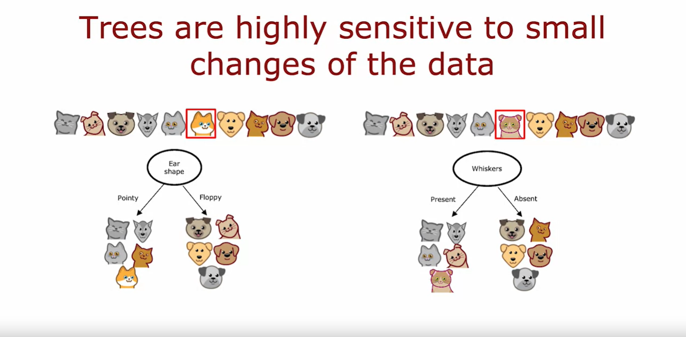

One of the weaknesses of using a single decision tree is that that decision tree can be highly sensitive to small changes in the data. 

One solution to make the algorithm less sensitive or more robust is to build not one decision tree but to build a lot of decision trees, and we call that a tree ensemble. Let's take a look. 

### Example

With the example that we've been using, the best feature to split on at the root node turned out to be the ear shape resulting in these two subsets of the data and then building further sub trees on these two subsets of the data. 

But it turns out that if you were to take just one of the ten examples and change it to a different cat so that instead of having pointy ears, round face, whiskers absent, this new cat has floppy ears, round face, whiskers present, with just changing a single training example, the highest information gain feature to split on becomes the whiskers feature instead of the ear shape feature. 

As a result of that, the subsets of data you get in the left and right sub-trees become totally different and as you continue to run the decision tree learning algorithm recursively, you build out totally different sub trees on the left and right. 

The fact that changing just one training example causes the algorithm to come up with a different split at the root and therefore a totally different tree, that makes this algorithm just not that robust. 

That's why when you're using decision trees, you often get a much better result, that is, you get more accurate predictions if you train not just a single decision tree but a whole bunch of different decision trees

## Tree ensembles

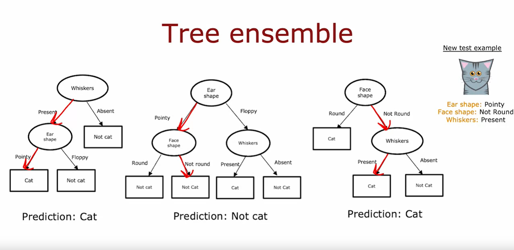

This is what we call a tree ensemble, which just means a collection of multiple trees. 

We'll see, in the next few videos, how to construct this ensemble of trees but if you had this ensemble three trees, each one of these is maybe a plausible way to classify cat vs not cat. 

If you had a new test example that you wanted to classify, then what you would do is run all three of these trees on your new example and get them to vote on whether it's the final prediction. 

This test example has pointy ears, a not round face shape and whiskers are present and so the first tree would carry out inferences like this and predict that it is a cat. 

The second tree's inference would follow this path through the tree and therefore predict that is not cat. 

The third tree would follow this path and therefore predict that it is a cat.

These three trees have made different predictions and so what we'll do is actually get them to vote and the majority votes of the predictions among these three trees is cat. 

So, the final prediction of this ensemble of trees is that this is a cat which happens to be the correct prediction. 

## Summary

The reason we use an ensemble of trees is by having lots of decision trees and having them vote, it makes your overall algorithm less sensitive to what any single tree may be doing because it gets only one vote out of three or one vote out of many, many different votes and it makes your overall algorithm more robust. 

But how do you come up with all of these different plausible but maybe slightly different decision trees in order to get them to vote? 

In the next video, we'll talk about a technique from statistics called **Sampling with replacement** and this will turn out to be a key technique that we'll use in the video after that in order to build this ensemble of trees. 

Let's go on to the next video to talk about Sampling with replacement

## Sampling with replacement

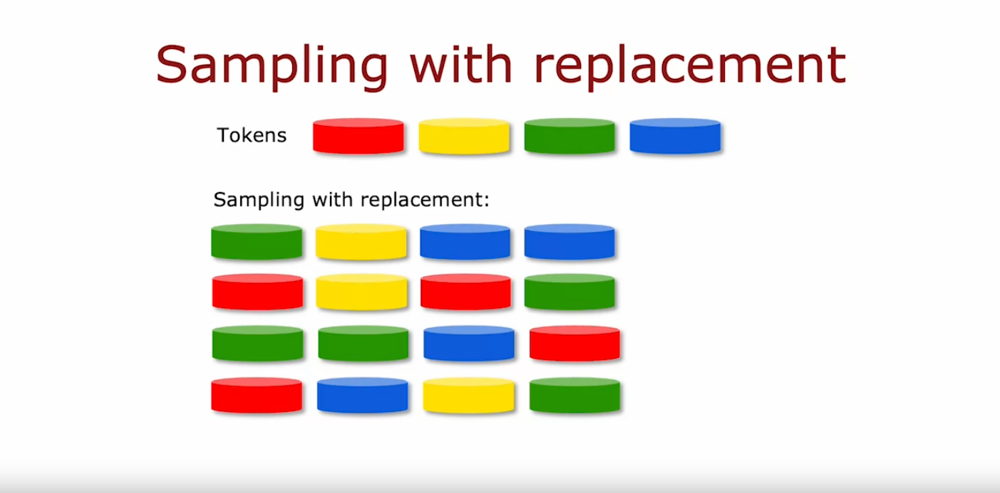

In order to build a tree ensemble, we're going to need a technique called Sampling with replacement. Let's take a look at what that means. 

In order to illustrate how Sampling with replacement works, I'm going to show you a demonstration of Sampling with replacement using four tokens that are colored red, yellow, green and blue. I actually have here with me four tokens of colors, red, yellow, green and blue and I'm going to demonstrate what Sampling with replacement using them look like. 

Here's a black velvet bag, empty and I'm going to take this example of four tokens and drop them in. I'm going to sample four times with replacement out of this bag. 

What that means, I'm going to shake it up, and can't see when I'm picking, pick out one token, turns out to be green. The term with replacement means that if I take out the next token, I'm going to take this, and put it back in, and shake it up again, and then take on another one, yellow. Replace it. That's a little replacement part. 

Then go again, it is blue, replace it again, and then pick on one more, which is blue again. That sequence of tokens I got was green, yellow, blue, blue. 

Notice that I got blue twice, and didn't get red even a single time. 

If you were to repeat this Sampling with replacement procedure multiple times, if you were to do it again, you might get red, yellow, red and green, or green, green, blue, red. Or you might also get red, blue, yellow, green. 

Notice that the with replacement part of this is critical because if I were not replacing a token every time I sample, then if I were to pour four tokens from my bag of four, I will always just get the same four tokens. That's why replacing a token after I pull it out each time is important to make sure I don't just get the same four tokens every single time

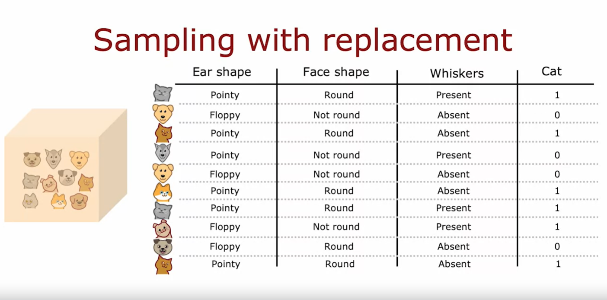

The way that Sampling with replacement applies to building an ensemble of trees is as follows: 

We are going to construct multiple random training sets that are all slightly different from our original training set. 

In particular, we're going to take our 10 examples of cats and dogs and we're going to put the 10 training examples in a theoretical bag. 

Please don't actually put a real cat or dog in a bag, that sounds inhumane, but you can take a training example and put it in a theoretical bag if you want. 

I'm using this theoretical bag, we're going to create a new random training set of 10 examples of the exact same size as the original data set. The way we'll do so is we're reaching and pick out one random training example. Let's say we get this training example. Then we put it back into the bag, and then again randomly pick out one training example and so you get that. You pick again and again and again. 

Notice now this fifth training example is identical to the second one that we had out there. But that's fine. You keep going and keep going, and we get another repeated example, and so on and so forth. Until eventually you end up with 10 training examples, some of which are repeats. You notice also that this training set does not contain all 10 of the original training examples, but that's okay. That is part of the Sampling with replacement procedure. 

> [!IMPORTANT]
> The process of Sampling with replacement lets you construct a new training set that is a little bit similar to but also pretty different from your original training set. It turns out that this would be the key building block for building an ensemble of trees

Let's take a look in the next video and how you could do that.

## 1st Tree Ensemble algorithm
### Random forest algorithm

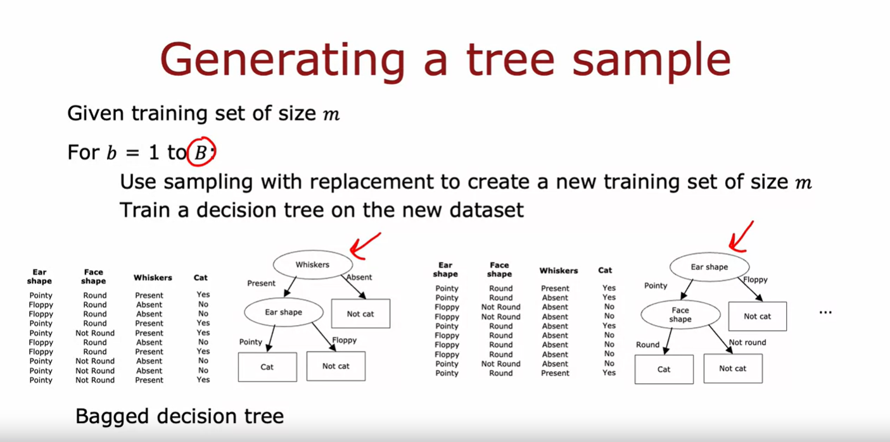

Now that we have a way to use Sampling with replacement to create new training sets that are a bit similar to but also quite different from the original training set we're ready to build our first tree ensemble algorithm.

In particular in this video, we'll talk about the random forest algorithm which is one powerful tree ensamble algorithm that works much better than using a single decision tree. 

Here's how we can generate an ensemble of trees. If you are given a training set of size *m*, then for $b=1$ to $B$ (so we do this capital *B* times), you can use Sampling with replacement to create a new training set of size *m*.

So, if you have 10 training examples, you will put the 10 training examples in that virtual bag and sample of replacement 10 times to generate a new training set with also 10 examples and then you would train a decision tree on this data set. 

So, here's the data set I've generated using Sampling with replacement. 

If you look carefully, you may notice that some of the training examples are repeated and that's okay. And if you train the decision tree algorithm on this data set you end up with this decision tree. 

And having done this once, we would then go and repeat this a second time: Use Sampling with replacement to generate another training set of *m* or 10 training examples. 

This again looks a bit like the original training set but it's also a little bit different. You then train the decision tree on this new data set and you end up with a somewhat different decision tree. And so on. 

### How many times (B) we have to repeat this procedure

And you may do this a total of capital *B* times. Typical choice of capital B the number of such trees you built might be around a 100. People recommend any value from say 64 to 128. And having built an ensemble of say 100 different trees, you would then when you're trying to make a prediction, get these trees all votes on the correct final prediction. 

It turns out that setting capital *B* to be larger, never hurts performance, but beyond a certain point, you end up with diminishing returns and it doesn't actually get that much better when *B* is much larger than say 100 or so. And that's why I never use say 1000 trees that just slows down the computation significantly without meaningfully increasing the performance of the overall algorithm.

Just to give this particular algorithm a name, this specific instantiation of a tree ensemble is sometimes also called a **bagged decision tree**. And that refers to putting your training examples in that virtual bag. And that's why also we use the letters lowercase *b* and uppercase *B* here because that stands for bag. 

### Random Forest algorithm

There's one modification to this album that will actually make it work even much better and that changes this algorithm, the bagged decision tree, into the random forest algorithm. 

The key idea is that even with this Sampling with replacement procedure sometimes you end up with always using the same split at the root node and very similar splits near the root note. 

That didn't happen in this particular example where a small change to the training set resulted in a different split at the root note but for other training sets it's not uncommon that for many or even all capital *B* training sets, you end up with the same choice of feature at the root node and at a few of the nodes near the root node.

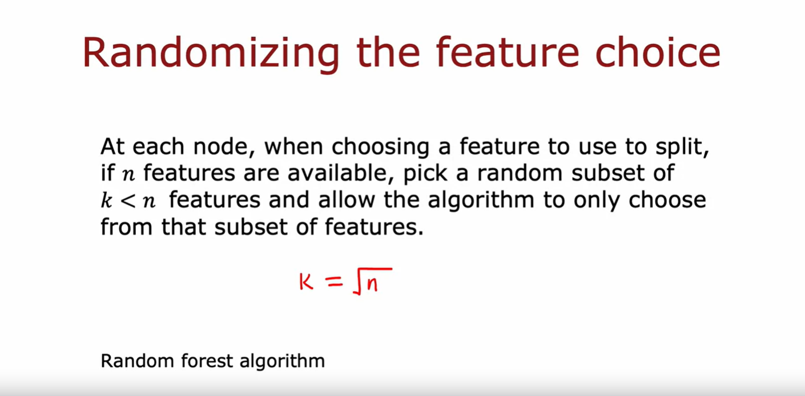

So, there's one modification to the algorithm to further try to randomize the feature choice at each node that can cause the set of trees you learn to become more different from each other. 

So, when you vote them, you end up with an even more accurate prediction. The way this is typically done is at every node when choosing a feature to use to split if *n* features are available (so in our example we had three features available) rather than picking from all *n* features, we will instead pick a random subset of $k<n$ features and allow the algorithm to choose only from that subset of *k* features. 

So, in other words, you would pick *k* features as the allowed features and then out of those *k* features choose the one with the highest information gain as the choice of feature to use to split. 

### What happens when *n* is large?

When *n* is large, say *n* is Dozens or 10's or even hundreds, a typical choice for the value of *k* would be to choose it to be 

$$ k = \sqrt{n} $$

In our example, we have only three features and this technique tends to be used more for larger problems with a larger number of features. 

And will just further change the algorithm you end up with the random Forest algorithm which will work typically much better and becomes much more robust than just a single decision tree. 

### Why is this more robust than using a single decision tree?

One way to think about why this is more robust to than a single decision tree is the Sampling with replacement procedure causes the algorithm to explore a lot of small changes to the data already and it is training different decision trees and is averaging over all of those changes to the data that the Sampling with replacement procedure causes. 

And so this means that any little change further to the training set makes it less likely to have a huge impact on the overall output of the overall random forest algorithm because it's already explored and it's averaging over a lot of small changes to the training set. 

## Summary 

Before wrapping up this video there's just one more thought I want to share with you which is, where does a machine learning engineer go camping? In a random forest.

The random forest is an effective algorithm and I hope you better use it in your work. Beyond the random forest It turns out there's one other algorithm that works even better which is a boosted decision tree. 

In the next video, let's talk about a boosted decision tree algorithm called XGBoost

## XGBoost

Over the years, machine learning researchers have come up with a lot of different ways to build decision trees and decision tree ensembles. Today by far the most commonly used way or implementation of decision tree ensembles or decision trees is an algorithm called XGBoost. 

It runs quickly, the open source implementations are easily used, has also been used very successfully to win many machine learning competitions as well as in many commercial applications. Let's take a look at how XGBoost works.

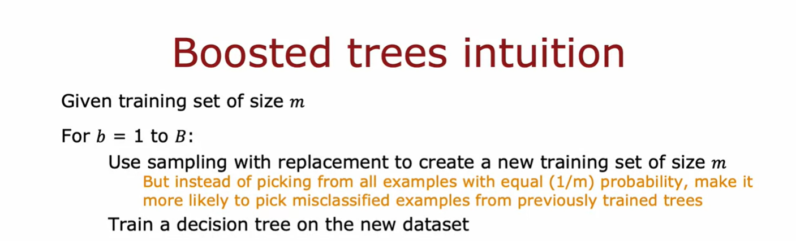

There's a modification to the bag decision tree algorithm that we saw in the last video that can make it work much better. 

Here again, is the algorithm that we had written down previously. Given a training set of size *m*, you repeat *B* times use sampling with replacement to create a new training set of size *m* and then train the decision tree on the new data set. 

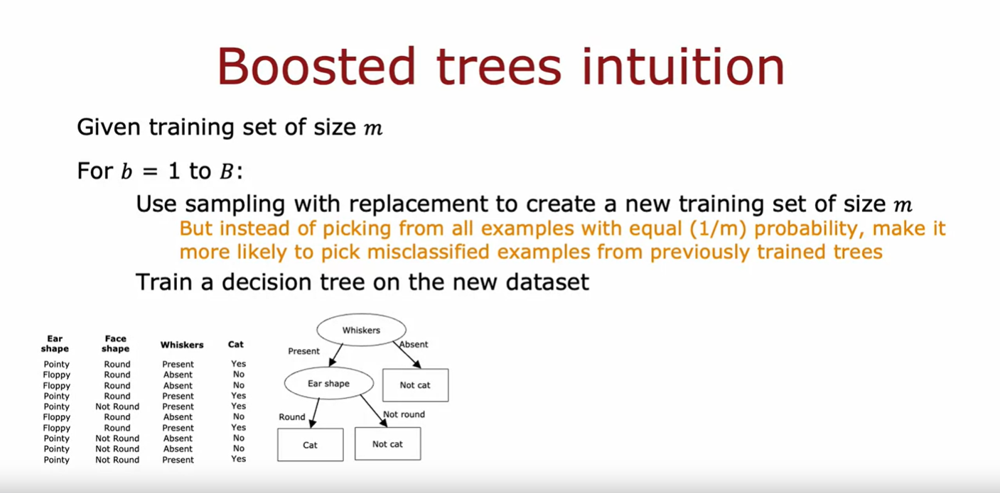

And so the first time through this loop, we may create a training set like that and train a decision tree like the shown in the image above. 

### Modification

But here's where we're going to change the algorithm which is: Every time through this loop, other than the first time, that is the second time, third time and so on, when sampling, instead of picking from all *m* examples of equal probability with one over m probability $probability = \frac{1}{m}$, let's make it more likely that we'll pick misclassified examples that the previously trained trees do poorly on.

### Deliberate practice concept

In training and education, there's an idea called **deliberate practice**. For example, if you're learning to play the piano and you're trying to master a piece on the piano rather than practicing the entire say five minute piece over and over, which is quite time consuming, if you instead play the piece and then focus your attention on just the parts of the piece that you aren't yet playing that well and practice those smaller parts over and over, then that turns out to be a more efficient way for you to learn to play the piano well. 

And so this idea of boosting is similar: We're going to look at the decision trees we've trained so far and look at what we're still not yet doing well on. And then when building the next decision tree, we're going to focus more attention on the examples that we're not yet doing well. 

So rather than looking at all the training examples, we focus more attention on the subset of examples is not yet doing well on and get the new decision tree, the next decision tree reporting ensemble to try to do well on them.

And this is the idea behind boosting and it turns out to help the learning algorithm learn to do better more quickly. 

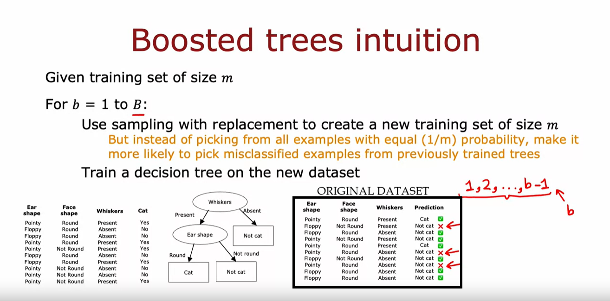

So, in detail, we will look at this tree that we have just built and go back to the original training set. Notice that this is the original training set, not one generated through sampling with replacement. 

And we'll go through all ten examples and look at what this learnt decision tree predicts on all ten examples. So, this fourth most column are their predictions and I have put a checkmark across next to each example, depending on whether the trees classification was correct or incorrect.

So, what we'll do in the second time through this loop is we will sort of use sampling with replacement to generate another training set of ten examples but every time we pick an example from these ten will give a higher chance of picking from one of these three examples that were still misclassifying. 

And so this focuses the second decision tree's attention via a process like deliberate practice on the examples that the algorithm is still not yet doing that well on and the boosting procedure will do this for a total of B times where on each iteration, you look at what the ensemble of trees for trees 1, 2 up through $b-1$, are not yet doing that well on and when you're building tree number *b*, you will then have a higher probability of picking examples that the ensemble of the previously sample trees is still not yet doing well on. 

The mathematical details of exactly how much to increase the probability of picking this versus that example are quite complex, but you don't have to worry about them in order to use boosted tree implementations.

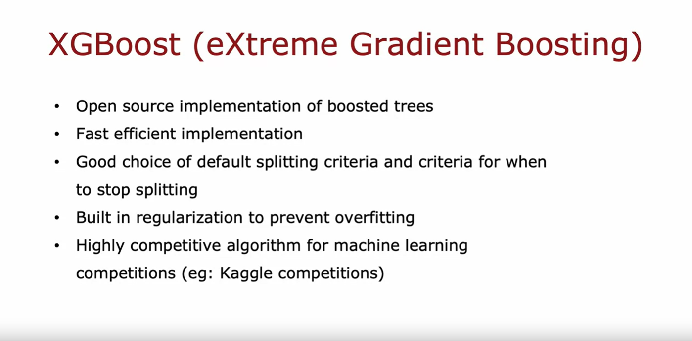

And of different ways of implementing boosting the most widely used one today is XGBoost, which stands for extreme gradient boosting, which is an open source implementation of boosted trees that is very fast and efficient. 

XGBoost also has a good choice of the default splitting criteria and criteria for when to stop splitting. And one of the innovations in XGBoost is that it also has built in regularization to prevent overfitting

And in machine learning competitions such as this widely used competition site called Kaggle, XGBoost is often a highly competitive algorithm. 

In fact, XGBoost and deep learning algorithms seem to be the two types of algorithms that win a lot of these competitions. And one technical note, rather than doing sampling with replacement, XGBoost actually assigns different weights to different training examples so it doesn't actually need to generate a lot of randomly chosen training sets and this makes it even a little bit more efficient than using a sampling with replacement procedure

But the intuition that you saw on the previous slide is still correct in terms of how XGBoost is choosing examples to focus on. 

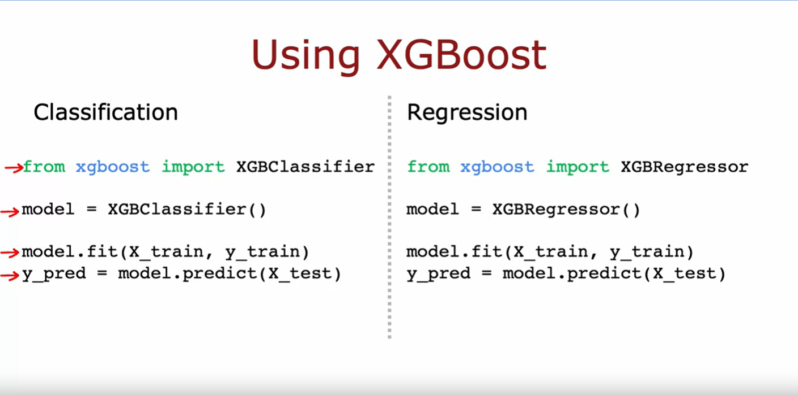

The details of XGBoost are quite complex to implement, which is why many practitioners will use the open source libraries that implement XGBoost. 

### XGBoost for Classification

This is all you need to do in order to use XGBoost for classification: 

- You will import the XGBoost library as follows
- Initialize a model as an XGBoost classifier
- Fit the model and then finally
- use model.predict() which allows you to make predictions using this boosted decision trees algorithm. 
  
I hope that you find this algorithm useful for many applications that you may build in the future. 

### XGBoost for Regression

Or alternatively, if you want to use XGBoost for regression rather than for classification, then this line here XGBClassifier() just becomes XGBRegressor() and the rest of the code works similarly. 

## Summary

So that's it for the XGBoost algorithm. We have just one last video for this week and for this course where we'll wrap up and also talk about when should you use a decision tree versus maybe use a neural network. 

Let's go on to the last and final video of this week

## When to use decision trees

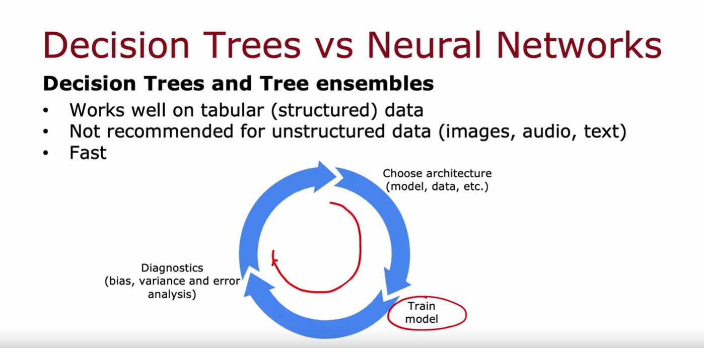

Both decision trees, including tree ensembles as well as neural networks are very powerful, very effective learning algorithms. When should you pick one or the other? Let's look at some of the pros and cons of each. 

### Using Decision Trees and tree ensembles

Decision trees and tree ensembles will often work well on tabular data, also called structured data. What that means is if your dataset looks like a giant spreadsheet then decision trees would be worth considering. 

For example, in the housing price prediction application we had a dataset with features corresponding to the size of the house, the number of bedrooms, the number of floors, and the age at the home and that type of data stored in a spreadsheet with either categorical or continuous valued features and both for classification or for regression task where you're trying to predict a discrete category or predict a number, all of these problems are ones that decision trees can do well on. 

In contrast, I will not recommend using decision trees and tree ensembles on unstructured data: That's data such as images, video, audio and texts that you're less likely to store in a spreadsheet format. 

Neural networks as we'll see in a second will tend to work better for unstructured data task. 

One huge advantage of decision trees and tree ensembles is that they can be very fast to train: You might remember this diagram from the previous week in which we talked about the iterative loop of machine learning development. If your model takes many hours to train then that limits how quickly you can go through this loop and improve the performance of your algorithm. 

But because decision trees, including tree ensembles, tend to be pretty fast to train, that allows you to go to this loop more quickly and maybe more efficiently improve the performance of your learning algorithm.

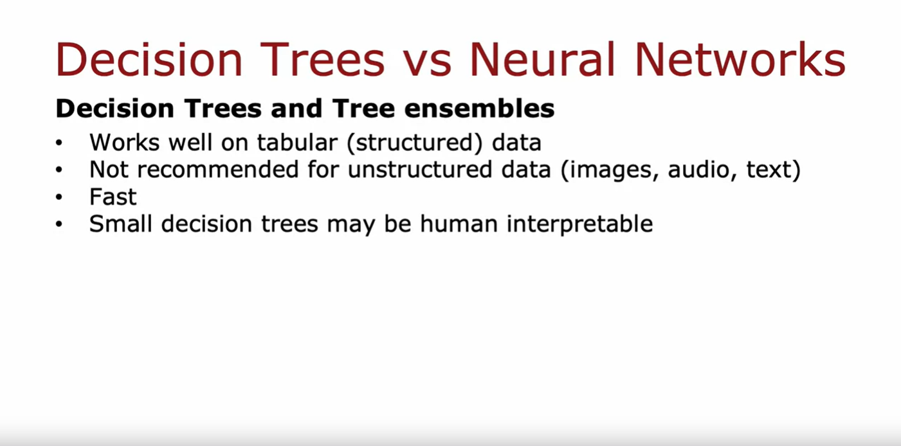

Finally, small decision trees may be human interpretable: If you are training just a single decision tree and that decision tree has only say a few dozen nodes you may be able to print out a decision tree to understand exactly how it's making decisions. 

I think that the interpretability of decision trees is sometimes a bit overstated because when you build an ensemble of 100 trees and if each of those trees has hundreds of nodes, then looking at that ensemble to figure out what it's doing does become difficult and may need some separate visualization techniques. 

But if you have a small decision tree you can actually look at it and see, oh, it's classifying whether something is a cat by looking at certain features in certain ways. 

> [!IMPORTANT]
> If you've decided to use a decision tree or tree ensemble, I would probably use *XGBoost* for most of the applications I will work on. 

> [!NOTE]
> One slight downside of a tree ensemble is that it is a bit more expensive than a single decision tree. If you had a very constrained computational budget you might use a single decision tree but other than that setting I would almost always use a tree ensemble and use XGBoost in particular

### Using Neural Networks

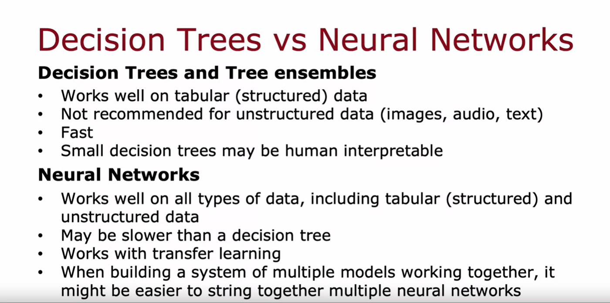

How about neural networks? In contrast to decision trees and tree ensembles, it works well on all types of data, including tabular or structured data as well as unstructured data as well as mixed data that includes both structured and unstructured components. 

Whereas on tabular structured data, neural networks and decision trees are often both competitive on unstructured data, such as images, video, audio, and text, a neural network will really be the preferred algorithm and not the decision tree or a tree ensemble. 

> [!NOTE]
> On the downside though, neural networks may be slower than a decision tree: A large neural network can just take a long time to train.

Other benefits of neural networks includes that it works with transfer learning and this is really important because for many applications we have only a small dataset. Being able to use transfer learning and carry out pre-training on a much larger dataset that is critical to getting competitive performance. 

Finally, if you're building a system of multiple machine learning models working together, it might be easier to string together and train multiple neural networks than multiple decision trees. 

The reasons for this are quite technical and you don't need to worry about it for the purpose of this course but it relates to that even when you string together multiple neural networks you can train them all together using gradient descent whereas for decision trees you can only train one decision tree at a time. 

## Summary 

That's it. You've reached the end of the videos for this course on Advanced Learning Algorithms. Thank you for sticking with me all this way and congratulations on getting to the end of the videos on advanced learning algorithms. 

You've now learned how to build and use both neural networks and decision trees and also heard about a variety of tips, practical advice on how to get these algorithms to work well for you. 

But even if all that you've seen on supervised learning, that's just part of what learning algorithms can do. 

Supervised learnings need labeled datasets with the labels *Y* on your training set. There's another set of very powerful algorithms called unsupervised learning algorithms where you don't even need labels *Y* for the algorithm to figure out very interesting patterns and to do things with the data that you have. 

So, I look forward to seeing you also in the third and final course of this specialization which should be on unsupervised learning. 

Now, before you finish up this course I hope you also enjoy practicing the ideas of decision trees in the practice quizzes and in the practice labs. 

I'd like to wish you the best of luck in the practice labs or for those of you that may be Star Wars fans, let me say, may the forest be with you

## [Optional Lab 10 - Tree Ensembles](./Optional%20Lab%2010%20-%20Tree%20Ensembles/)