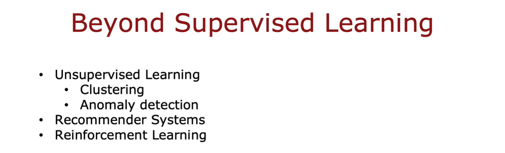

## Welcome!

Welcome to this third and final course of this specialization on unsupervised learning, recommender systems and reinforcement learning. 

Whereas in the first two courses, we spent a lot of time on supervised learning, in this third and final course, we'll talk about a new set of techniques that goes beyond supervised learning and will give you an extra set of powerful tools that I hope you enjoy adding to your toolset and by the time you finish this course and finish this specialization, I think you'll be well on your way to being an expert in machine learning. Let's take a look.

### Week 1: Unsupervised Learning

This week we'll start with unsupervised learning. In particular, you'll learn about clustering algorithms, which is a way of grouping data into clusters as well as anomaly detection. 

Both of these are techniques used by many companies today in important commercial applications. By the end of this week, you know how these algorithms work and be able to get them to work with yourself as well. 

### Week 2: Recommender systems

In the second week, you will learn about recommender systems. 

When you go to a online shopping websites or a video streaming website, how does it recommend products or movies to you? 

Recommender systems is one of the most commercially important machine learning technologies, it is moving many billions of dollars worth of value or products or other things around, it is one of the technologies that receives surprisingly little attention from academia despite how important it is but in the second week, I hope you learn how these systems work and be able to implement one for yourself. 

If you are curious about how online ads systems work, the description of recommender systems will also give you a sense for how those large online ad tech companies decide what ads to show you. 

### Week 3: Reinforcement learning

In the third and final week of this course, you'll learn about reinforcement learning. 

You may have read in the news about reinforcement learning being great at playing a variety of video games, even outperforming humans. I've also used reinforcement learning many times myself to control a variety of different robots. 

Even though reinforcement learning is a new and emerging technology, that is, the number of commercial applications of reinforcement learning is not nearly as large as the other techniques covered in this week or in the previous two courses of this specialization, this is a technology that is exciting and is opening up a new frontier to what you can get learning algorithms to do. 

In the final week, you implement reinforcement learning yourself and use it to land a simulated moon lander. When you see that working for yourself with your own code, later in this course, I think you'll be impressed by what you can get reinforcement learning to do. 

## Summary 

I'm really excited to be here with you to talk about unsupervised learning, recommender systems and reinforcement learning. Let's go on to the next video where you learn about an important unsupervised learning algorithm called a clustering algorithm.

## [IMPORTANT] Have questions, issues or ideas? Join our Forum!

Hey Learner!

Excited about this course? Join our Forum to:

- Chat with others: Share ideas, ask questions, and discuss AI.
- Work together: Collaborate on AI projects and build something awesome.
- Stay in the loop: Get updates on courses, events, and AI news.

Click [this link](https://community.deeplearning.ai/?utm_campaign=forum-engagement&utm_medium=long-form-courses&utm_source=coursera) to create your free account and connect with the global AI community!

*The DeepLearning.AI team*