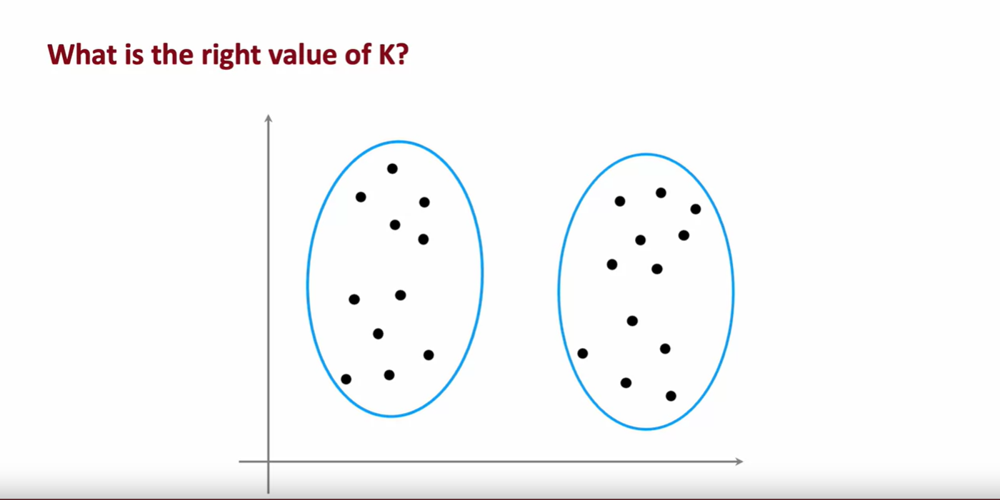

## What is clustering?

A clustering algorithm looks at a number of data points and automatically finds data points that are related or similar to each other. Let's take a look at what that means. 

### Contrasting Supervised with Unsupervised Learning

Let me contrast clustering, which is an Unsupervised Learning algorithm, with what you had previously seen with Supervised Learning for binary classification. 

#### Supervised Learning

Given a dataset like this with features $x_1$ and $x_2$, with Supervised Learning we had a training set with both the input features $x$ as well as the labels $y$. We could plot a dataset like the one shown above and fit, say, a logistic  regression algorithm or a neural network to learn a decision boundary like the red one shownin the picture. 

In Supervised Learning, the dataset included both the inputs $x$ as well as the target outputs $y$

#### Unsupervised Learning

In contrast, in Unsupervised Learning, you are given a dataset like this with just $x$, but not the labels or the target labels $y$. That's why when I plot a dataset, it looks like this, with just dots rather than two classes denoted by the red x's and the blue o's. Because we don't have target labels $y$, we're not able to tell the algorithm what is the "right answer $y$" that we wanted to predict. 

Instead, we're going to ask the algorithm to find something interesting about the data, that is to find some interesting structure about this data. 

### 1st Unsupervised Learning algorithm: Clustering algorithm

The first Unsupervised Learning algorithm that you will learn about is called a clustering algorithm, which looks for one particular type of structure in the data. Namely, look at the dataset like this and try to see if it can be grouped into clusters, meaning groups of points that are similar to each other. 

A clustering algorithm, in this case, might find that this dataset comprises of data from two clusters shown here

### Clustering algorithms

Here are some applications of clustering:

- Grouping similar news
- Market segmentation
- DNA Analysis
- Astronomical data analysis
- Many more...

In the first week of the first course, you heard me talk about grouping similar news articles together, like the story about Pandas or market segmentation, where at deeplearning.ai, we discovered that there are many learners that come here because you may want to grow your skills, or develop your careers, or stay updated with AI and understand how it affects your field of work. We want to help everyone with any of these skills to learn about machine learning, or if you don't fall into one of these clusters, that's totally fine too. I hope deeplearning.ai and Stanford Online's materials will be useful to you as well. 

Clustering has also been used to analyze DNA data, where you will look at the genetic expression data from different individuals and try to group them into people that exhibit similar traits. 

I find astronomy and space exploration fascinating. One application that I thought was very exciting was astronomers using clustering for astronomical data analysis to group bodies in space together for their own analysis of what's going on in space. 

One of the applications I found fascinating was astronomers using clustering to group bodies together to figure out which ones form one galaxy or which one form coherent structures in space. 

Clustering today is used for all of these applications and many more. 

In the next video, let's take a look at the most commonly used clustering algorithm called the k-means algorithm, let's take a look at how it works.

### 2nd Unsupervised Learning algorithm: K-means algorithm

## K-means intuition

Let's take a look at what the K-means clustering algorithm does. Let me start with an example. 

Here I've plotted a data set with 30 unlabeled training examples. So there are 30 points. And what we like to do is run K-means on this data set. 

The first thing that the K-means algorithm does is it will take a random guess at where might be the centers of the two clusters that you might ask it to find.

In this example I'm going to ask it to try to find two clusters. Later in this week we'll talk about how you might decide how many clusters to find. But the very first step is it will randomly pick two points, which I've shown here as a red cross and the blue cross, at where might be the centers of two different clusters. This is just a random initial guess and they're not particularly good guesses. But it's a start. 

> [!IMPORTANT]
> One thing I hope you take away from this video is that K-means will repeatedly do two different things:
> 1. Assign points to cluster centroids 
> 2. Move cluster centroids

Let's take a look at what this means. 

#### 1. Assign points to cluster centroids 

The first of the two steps is it will go through each of these points and look at whether it is closer to the red cross or to the blue cross. The very first thing that K-means does is it will take a random guess at where are the centers of the cluster. And the centers of the cluster are called **cluster centroids**. 

After it's made an initial guess at where the cluster centroid is, it will go through all of these examples, { $x^{(1)}, x^{(2)}, x^{(3)}, ..., x^{(30)}$ }, my 30 data points, and for each of them it will check if it is closer to the red cluster centroid, shown by the red cross, or if it's closer to the blue cluster centroid, shown by the blue cross and it will assign each of these points to whichever of the cluster centroids it is closer to. 

I'm going to illustrate that by painting each of these examples, each of these little round dots, either red or blue, depending on whether that example is closer to the red or to the blue cluster centroid. So, this point up here is closer to the red centroid, which is why it's painted red whereas this point down there is closer to the blue cluster centroid, which is why I've now painted it blue. 

So, that was the first of the two things that K-means does over and over which is assign points to clusters centroids and all that means is it will associate every point of one of the cluster centroids, which I'm illustrating with the color resulting in the next graph shown below:

#### 2. Move cluster centroids

The second of the two steps that K-means does is, it'll look at all of the red points and take an average of them. And it will move the red cross to whatever is the average location of the red dots, which turns out to be here. And so the red cross, that is the red cluster centroid will move here. 

And then we do the same thing for all the blue dots. Look at all the blue dots, and take an average of them, and move the blue cross over there. So, you now have a new location for the blue cluster centroid as well. 

In the next video we'll look at the mathematical formulas for how to do both of these steps. But now that you have these new and hopefully slightly improved guesses for the locations of the two cluster centroids, we'll look through all of the 30 training examples again and check for every one of them, whether it's closer to the red or the blue cluster centroid for the new locations and then we will associate them which are indicated by the color again, every point to the closer cluster centroid. 

And if you do that, you see that the field points change color. 

So, for example, this point is colored red, because it was closer to the red cluster centroid previously but if we now look again, it's now actually closer to the blue cluster centroid, because the blue and red cluster centroids have moved. 

So, if we go through and associate each point with the closer cluster centroids, you end up with this image shown above. 

And then we just repeat the second part of K-means again which is look at all of the red dots and compute the average 

and also look at all of the blue dots and compute the average location of all of the blue dots. 

And it turns out that you end up moving the red cross over there and the blue cross over here. And we repeat. 

Let's look at all of the points again and we color them, either red or blue, depending on which cluster centroid that is closer to. So you end up with this. And then again, look at all of the red dots and take their average location, and look at all the blue dots and take the average location, and move the clusters to the new locations. 

And it turns out that if you were to keep on repeating these two steps, that is look at each point and assign it to the nearest cluster centroid and then also move each cluster centroid to the mean of all the points with the same color. If you keep on doing those two steps, you find that there are no more changes to the colors of the points or to the locations of the clusters centroids. 

And so this means that at this point the K-means clustering algorithm has converged because applying those two steps over and over, results in no further changes to either the assignment to point to the centroids or the location of the cluster centroids. 

In this example, it looks like K-means has done a pretty good job. It has found that these points up here correspond to one cluster, and these points down here correspond to a second cluster. 

## Summary

So, now you've seen an illustration of how K-means works. The two key steps are:

1. Assign every point to the cluster centroid, depending on what cluster centroid is nearest to. 
2. And move each cluster centroid to the average or the mean of all the points that were assigned to it. 

In the next video, we'll look at how to formalize this and write out the algorithm that does what you just saw in this video. Let's go on to the next video.

## K-means algorithm

In the last video, you saw an illustration of the k-means algorithm running. Now, let's write out the K-means algorithm in detail so that you'd be able to implement it for yourself. 

Here's the K-means algorithm. 

### K-means algorithm - Step 1: Assign points to cluster centroids

The first step is to randomly initialize *K* cluster centroids $\mu_1$, $\mu_2$, ..., $\mu_K$

In the example that we had, this corresponded to when we randomly chose a location for the red cross and for the blue cross corresponding to the two cluster centroids. 

In our example, $K = 2$. So, if the red cross was cluster centroid one and the blue cross was cluster centroid two, these are just two indices to denote the first and the second cluster, then the red cross would be the location of $\mu_1$ and the blue cross would be the location of $\mu_2$. 

Just to be clear, $\mu_1$ and $\mu_2$ are vectors which have the same dimension as your training examples, $x^{(1)}, x^{(2)}, ..., x^{(30)}$, in our example. So, all of these are lists of two numbers or they're two-dimensional vectors or whatever dimension the training data had. 

So, we had $n = 2$ features for each of the training examples, then $\mu_1$ and $\mu_2$ will also be two-dimensional vectors, meaning vectors with two numbers in them.

Having randomly initialized the *K* cluster centroids, K-means will then repeatedly carry out the two steps that you saw in the last video. 

1. The first step is to assign points to clusters centroids, meaning color, each of the points, either red or blue, corresponding to assigning them to cluster centroids one or two when $K = 2$. 

Rinse it out enough that means that we're going to $\text{for i} = 1 \text{ to m}$ for all *m* training examples, we're going to set $c^{(i)}$ to be equal to the index, which can be anything from 1 to K of the cluster centroid closest to the training example $x^{(i)}$

Mathematically, you can write this out as computing the distance between $x^{(i)}$ and $\mu_k$. In math, the distance between two points is often written like this:

$$ min_k ||x^{(i)} - \mu_k||$$

It is also called the **L2 norm** and what you want to find is the value of *k* that minimizes this because that corresponds to the cluster centroid $\mu_k$ that is closest to the training example $x^{(i)}$. Then, the value of *k* that minimizes this is what gets set to $c^{(i)}$

When you implement this algorithm, you find that it's actually a little bit more convenient to minimize the squared distance because the cluster centroid with the smallest square distance should be the same as the cluster centroid with the smallest distance

$$ min_k ||x^{(i)} - \mu_k||^2$$

When you look at this week's optional labs and practice labs, you see how to implement this in code for yourself. 

As a concrete example, this point up here is closer to the red cross or to the cluster centroid 1, so if this was the training example $x^{(1)}$, we will set $c^{(1)} = 1$ 

$$ x^{(1)}, c^{(1)} = 1 $$

whereas this point over here, if this was $x^{(12)}$, the 12th training example, this is closer to the second cluster centroid, the blue one and so we will set this, the corresponding cluster assignment variable, to 2 because it's closer to cluster centroid 2. 

$$ x^{(12)}, c^{(12)} = 2 $$

That's the first step of the K-means algorithm: Assign points to cluster centroids

### K-means algorithm - Step 2: Move the cluster centroids

The second step is to move the cluster centroids and what that means is for lowercase $k = 1$ to capital *K*, the number of clusters, we're going to set the cluster centroids location to be updated to be the average or the mean of the points assigned to that cluster *k*. 

Concretely, what that means is, we'll look at all of these red points, say, and look at their position on the horizontal axis and look at the value of the first feature $x^{(1)}$ and average that out and compute the average value on the vertical axis as well. 

And after computing those two averages, you find that the mean is here, which is why $\mu_1$, that is the location that the red cluster centroid, gets updated as follows (it is moved from the last position to a new one. This new location can now be seen in the image above)

Similarly, we will look at all of the points that were colored blue, that is, with $c^{(i)} = 2$ and compute the average of the value on the horizontal axis, the average of their feature $x^{(1)}$, compute the average of the feature $x^{(2)}$ and those two averages give you the new location of the blue cluster centroid, which therefore moves over here (again, the position for the blue cross is moved to a new location, shown in the same image above)

Just to write those out in math: If the first cluster had assigned to it training examples 

$$ x^{(1)} x^{(5)} x^{(6)} x^{(10)} $$

just as an example, then what that means is you will compute the average this way. 

$$ \mu_1 = \frac{1}{4} [x^{(1)} + x^{(5)} + x^{(6)} + x^{(10)}] $$

Notice that $x^{(1)}, x^{(5)}, x^{(6)} \text{, and } x^{(10)}$ are training examples. We have four training examples, so we divide by 4 and this gives you the new location of $\mu_1$, the new cluster centroid for cluster 1. 

To be clear, each of these x values are vectors with two numbers in them, or *n* numbers in them if you have *n* features, and so $\mu$ will also have two numbers in it or *n* numbers in it if you have *n* features instead of two.

### Corner case for this algorithm

Now, there is one corner case of this algorithm which is: 

*What happens if a cluster has zero training examples assigned to it?*

#### Problem

In that case, the second step, $\mu_k$ would be trying to compute the average of zero points and that's not well-defined. 

#### Solution 1

If that ever happens, the most common thing to do is to just eliminate that cluster so you end up with $K = K - 1$ clusters.

#### Solution 2

Or if you really, really need *K* clusters, an alternative would be to just randomly reinitialize that cluster centroid and hope that it gets assigned at least some points next time round. 

#### Most common solution? Solution 1
But it's actually more common when running K-means to just eliminate a cluster if no points are assigned to it

### Clusters not well separated

Even though I've mainly been describing K-means for clusters that are well separated so clusters that may look like this where if you asked to find three clusters, hopefully they will find these three distinct clusters. 

It turns out that K-means is also frequently applied to data sets where the clusters are not that well separated: For example, if you are a designer and manufacturer of cool t-shirts, and you want to decide, how do I size my small, medium, and large t-shirts, How small should a small be, how large should a large be, and what should a medium-size t-shirt really be? 

One thing you might do is collect data of people likely to buy your t-shirts based on their heights and weights and you find that the height and weight of people tend to vary continuously on the spectrum without some very clear clusters. 

Nonetheless, if you were to run K-means with say, three clusters centroids, you might find that K-means would group these points into one cluster, these points into a second cluster, and these points into a third cluster. 

And so if you're trying to decide exactly how to size your small, medium, and large t-shirts, you might then choose the dimensions of your small t-shirt to try to make it fit these individuals well, the medium-size t-shirt to try to fit these individuals well and the large t-shirt to try to fit these individuals well with potentially the cluster centroids giving you a sense of what is the most representative height and weight that you will want your three t-shirt sizes to fit. 

So, this is an example of K-means working just fine and giving a useful results even if the data does not lay in well-separated groups or clusters. 

## Summary

So, that was the K-means clustering algorithm: Assign cluster centroids randomly and then repeatedly assign points to cluster centroids and move the cluster centroids.

But what this algorithm is really doing and do we think this algorithm will converge or they just keep on running forever and never converge. 

To gain deeper intuition about the K-means algorithm and also see why we might hope this algorithm does converge, let's go on to the next video where you see that K-means is actually trying to optimize a specific cost function.

Let's take a look at that in the next video.

## Optimization objective

In the earlier courses, courses one and two of this specialization, you saw a lot of supervised learning algorithms as taking a training set, posing a cost function and then using grading descent or some other algorithms to optimize that cost function.

It turns out that the K-means algorithm that you saw in the last video is also optimizing a specific cost function. Although the optimization algorithm that it uses to optimize that is not gradient descent is actually the algorithm that you already saw in the last video. Let's take a look at what all this means. 

Let's take a look at what is the cost function for K-means: 

#### Notation

To get started as a reminder this is a notation we've been using where 

* $c^{(i)}$ is the index of the cluster, so $c^{(i)}$ is some number from 1 through K of the index of the cluster to which training example $x^{(i)}$ is currently assigned
* $\mu_k$ is the location of cluster centroid *k*

Let me introduce one more piece of notation:

* which is when $k = c^{(i)}$. So, $\mu_{c^{(i)}}$ is the cluster centroid of the cluster to which example $x^{(i)}$ has been assigned. 

So, for example, if I were to look at some training example, say the training example 10, $x^{(10)}$, and I were to ask: What's the location of the cluster centroid to which the 10th training example has been assigned? 

Well, I would then look up $c^{(10)}$ and this will give me a number from 1 to K that tells me was example 1s0 asigned to the red or the blue or some other cluster centroid and then $\mu_{c^{(10)}}$ is the location of the cluster centroid to which $x^{(10)}$ has been assigned. 

#### Cost function J

So, armed with this notation, let me now write out the cost function that K-means turns out to be minimizing. 

The cost function J, which is a function of $c^{(1)}$ through $c^{(m)}$, (these are all the assignments of points to clusters centroids) as well as $\mu_1$ through $\mu_K$ (these are the locations of all the clusters centroids) is defined as this expression shown below:

$$ J(c^{(1)}, ..., c^{(m)}, \mu_1, ..., \mu_K) = \frac{1}{m} \sum_{i=1}^m{||x^{(i)} - \mu_{c^{(i)}}||^2} $$

It is the average, so one over m of sum from $i = 1 \text{ to m}$ of the squared distance between every training example $x^{(i)}$ and $\mu_{c^{(i)}}$

In other words, the cost function for K-means is the average squared distance between every training example $x^{(i)}$ and the location of the cluster centroid $\mu_{c^{(i)}}$ to which the training example $x^{(i)}$ has been assigned

So, for this example up here we've been measuring the distance between $x^{(10)}$ and $\mu_{c^{(10)}}$, the cluster centroid to which $x^{(10)}$ has been assigned, and taking the square of that distance and that would be one of the terms over here that we're averaging over. 

And it turns out that what the K-means algorithm is doing is trying to find assignments of points of clusters centroid as well as find locations of clusters centroid that minimizes the squared distance

### Visual representation

Visually, here's what you saw part way into the run of K-means in the earlier video and at this step the cost function if you were to compute it would be to look at everyone at the blue points and measure these distances and compute the square and then also similarly look at every one of the red points and compute these distances and compute the square. 

And then the average of the squares of all of these differences for the red and the blue points is the value of the cost function J, at this particular configuration of the parameters for K-means. 

And what they will do on every step is try to update the cluster assignments $c^{(1)}$ through $c^{(30)}$ in this example or update the positions of the cluster centroids, $\mu_1$ and $\mu_2$, in order to keep on reducing this cost function J

By the way, this cost function J also has a name in the literature. It is called the **distortion function**. I don't know that this is a great name. But if you hear someone talk about the K-means algorithm and the distortion or the distortion cost function, that's just what this formula J is computing

## A closer look at the algorithm

Let's now take a deeper look at the algorithm and why the algorithm is trying to minimize this cost function J or why is trying to minimize the distortion.

Here on top I have copied over the cost function J from the previous slide

$$ J(c^{(1)}, ..., c^{(m)}, \mu_1, ..., \mu_K) = \frac{1}{m} \sum_{i=1}^m{||x^{(i)} - \mu_{c^{(i)}}||^2} $$

It turns out that the first part of K-means where you assign points to cluster centroids (the Step 1) that turns out to be trying to update $c^{(1)}$ through $c^{(m)}$ to try to minimize the cost function J as much as possible while holding $\mu_1$ through $\mu_k$ fixed

And the second step, in contrast, where you move the cluster centroid, it turns out that is trying to leave $c^{(1)}$ through $c^{(m)}$ fixed but to update $\mu_1$ through $\mu_k$ to try to minimize the cost function J or the distortion as much as possible. 

Let's take a look at why this is the case: During the first step, if you want to choose the values of $c^{(1)}$ through $c^{(m)}$ or say a particular value of $c^{(i)}$ to try to minimize this, well, what would make $x^{(i)}$ - $\mu_{c^{(i)}}$ as small as possible? This is the distance or the squared distance between a training example $x^{(i)}$ and the location of the cluster centroid to which has been assigned

So, if you want to minimize this distance or the squared distance, what you should do is assign $x^{(i)}$ to the closest cluster centroid

### A simplified example for the step 1

So, to take a simplified example, if you have two clusters centroids, say clusters centroids one (blue cross) and two (red cross), and just a single training example, $x^{(i)}$, then if you were to assign it to the cluster centroid one, this squared distance here would be this large distance ($distance = 7 - 1 = 6$), well squared distance: $distance = (7 - 1)^2 = 6^2 = 36$

> [!NOTE]
> There are two errors in the image above:
> 
> The values 6 and 2 on the right side should be 36 and 4, respectively.
> 
> The issue lies in the fact that the calculation was performed without applying square differentiation—only simple differentiation was used.

And if you were to assign it to cluster centroid 2 then this squared distance would be the square of this much smaller distance: $distance = (7 - 9)^2 = (-2)^2 = 4$

So, if you want to minimize this term, you will take $x^{(i)} and assign it to the closer centroid, which is exactly what the algorithm is doing up here.

So, that's why the step where you assign points to a cluster centroid is choosing the values for $c^{(i)}$ to try to minimize J without changing $\mu_1$ through $\mu_k$ for now but just choosing the values of $c^{(1)}$ through $c^{(m)}$ to try to make these terms as small as possible.

## 2nd step: Moving the cluster centroids

How about the second step of the K-means algorithm that is to move to cluster centroids? It turns out that choosing $\mu_k$ to be average or the mean of the points assigned is the choice of these terms $\mu$ that will minimize this expression of the cost function J

### A simplified example for the step 2

To take a simplified example, say you have a cluster with just two points assigned to it shown as follows (points are at positions 1 and 11) and so with the cluster centroid $\mu$ here ($\mu$ is at the position 2), the average of the square distances would be a distance of one here squared plus this distance here, which is 9 squared, and then you take the average of these two numbers. And so that turns out to be one half of 1 plus 81, which turns out to be 41.

$$ \frac{1}{2} (1^2 + 9^2) = \frac{1}{2} (1+81) = \frac{82}{2} = 41 $$

But if you were to take the average of these two points, so 

$$ \frac{1}{2} (1 + 11) = \frac{1}{2} 12 = 6 $$

and if you were to move the cluster centroid over here to middle, then the average of these two squared distances, turns out to be a distance of five and five here. So you end up with one half of 5 squared plus 5 squared, which is equal to 25. And this is a much smaller average squared distance than 41 and in fact, you can play around with the location of this cluster centroid and maybe convince yourself that taking this mean location, this average location in the middle of these two training examples, that is really the value that minimizes the squared distance

## Final ideas

So, the fact that the K-means algorithm is optimizing a cost function J means that it is guaranteed to converge. That is, on every single iteration, the distortion cost function J should go down or stay the same but if it ever fails to go down or stay the same, in the worst case, if it ever goes up, that means there's a bug in the code, it should never go up because every single step of K-means is setting the values $c^{(i)}$ and $\mu_k$ to try to reduce the cost function. 

Also, if the cost function ever stops going down, that also gives you one way to test if K-means has converged: Once there's a single iteration where it stays the same, that usually means K-means has converged and you should just stop running the algorithm even further

Or in some rare cases you will run K-means for a long time and the cost function or the distortion is just going down very, very slowly and that's a bit like gradient descent where maybe running even longer might help a bit but if the rate at which the cost function is going down has become very, very slow you might also just say this is good enough. I'm just going to say it's close enough to convergence and not spend even more compute cycles running the algorithm for even longer. 

So, these are some of the ways that computing the cost function is helpful. It helps you figure out if the algorithm has converged. 

It turns out that there's one other very useful way to take advantage of the cost function which is to use multiple different random initializations of the cluster centroids. It turns out if you do this, you can often find much better clusters using K-means. 

Let's take a look at the next video of how to do that.

## Initializing K-means

The very first step of the K-means clustering algorithm was to choose random locations as the initial guesses for the cluster centroids $\mu_1$ through $\mu_K$

But how do you actually take that random guess? 

Let's take a look at that in this video as well as how you can take multiple attempts at the initial guesses with $\mu_1$ through $\mu_K$ that will result in you finding a better set of clusters. Let's take a look. 

Here again is the K-means algorithm and in this video let's take a look at how you can implement this first step

### Random initialization

### Choose $K < m$

When running K-means, you should pretty much always choose the number of cluster centroids $K$ to be **less than** the number of training examples $m$. It doesn't really make sense to have $K$ greater than $m$ because then there wouldn't even be enough training examples to assign at least one per cluster centroid. So, in our earlier example, we had $K = 2$ and $m = 30$

### Randomly pick $K$ training examples

In order to choose the cluster centroids, the most common way is to randomly pick $K$ training examples. So, here is a training set where if I were to randomly pick two training examples, maybe I end up picking this one and this one 

### Set $\mu_1$ through $\mu_K$ equal to these $K$ examples

and then we would set $\mu_1$ through $\mu_K$ equal to these $K$ training examples

So, I might initialize my red cluster centroid here and initialize my blue cluster centroid over here, in the example where $K = 2$. And it turns out that if this was your random initialization and you were to run K-means you probably end up with K-means deciding that these are the two classes in the data set. 

> [!NOTE]
> Note that this method of initializing the cluster centroids is a little bit different than what I had used in the illustration in the earlier videos. 
> 
> In those videos I was initializing the cluster centroids $\mu_1$ and $\mu_2$ to be just random points rather than sitting on top of specific training examples. I've done that to make the illustrations clearer in the earlier videos but what I'm showing in this slide is actually a much more commonly used way of initializing the clusters centroids

Now, with this method, there is a chance that you end up with an initialization of the cluster centroids where the red cross is here and maybe the blue cross is here and depending on how you choose the random initial cluster centroids, K-means will end up picking a difference set of clusters for your dataset

### A more complex example

Let's look at a slightly more complex example where we're going to look at this data set on the left and try to find three clusters so $K = 3$ in this data

#### Case 1 (on top)

If you were to run K-means with one random initialization of the cluster centroid, you may get this result up here and this looks like a pretty good choice, a pretty good clustering of the data into three different clusters. 

#### Case 2 (below and left)

But with a different initialization, say you had happened to initialize two of the cluster centroids within this group of points and one within this group of points (you can check this by looking on the graph and noting that red and green cluster centroids near and then the blue one is in another location) after running K-means you might end up with this clustering, which doesn't look as good. 

And this turns out to be a local optima, in which K-means is trying to minimize the distortion cost function, that cost function J that you saw in the last video but with this less fortunate choice of random initialization, it had just happened to get stuck in a local minimum.

#### Case 3 (below and right)

And here's another example of a local minimum where a different random initialization caused K-means to find this clustering of the data into three clusters which again doesn't seem as good as the one that you saw up here on top

> [!IMPORTANT]
> So, if you want to give K-means multiple shots at finding the best local optimum, if you want to try multiple random initializations, so give it a better chance of finding this good clustering up on top, one other thing you could do with the K-means algorithm is to run it multiple times and then to try to find the best local optima.

And it turns out that if you were to run K-means three times say, and end up with these three distinct clusterings, then one way to choose between these three solutions, is to compute the cost function J for all three of these solutions, all three of these choices of clusters found by K-means and then to **pick one of these three according to which one of them gives you the lowest value for the cost function J**

### Analyzing cost function J by looking at the set of clusters on each example

For the case 1, in fact, if you look at this grouping of clusters up here, this green cross has relatively small squared distances all the green dots, the red cross is relatively small distance and red dots and similarly the blue cross and so the cost function J will be relatively small for this example on top

For the case 2, the blue cross has larger distances to all of the blue dots

For the case 3, the red cross has larger distances to all of the red dots, which is why the cost function J for these examples down below (cases 2 and 3) would be larger.

Which is why if you pick from these three options, the one with the smallest distortion or the smallest cost function J, you end up selecting this choice on top of the cluster centroids (case 1)

So, let me write this out more formally into an algorithm, and wish you would run K-means multiple times using different random initializations

### Random initialization algorithm

Here's the algorithm.

If you want to use 100 random initializations for K-means, then you would run 100 times randomly initialized K-means using the method that you saw earlier in this video: Pick $K$ training examples and let the cluster centroids initially be the locations of those $K$ training examples. 

Using that random initialization, run the K-means algorithm to convergence and that will give you a choice of cluster assignments and cluster centroids. And then finally, you would compute the distortion, compute the cost function as follows.

After doing this, say 100 times, you would finally pick the set of clusters, that gave the lowest cost and it turns out that if you do this, it will often give you a much better set of clusters with a much lower distortion function than if you were to run K-means only a single time. 

> [!NOTE]
> I plugged in the number up here as 100: When I'm using this method, doing this somewhere between say 50 to 1000 times would be pretty common where, if you run this procedure a lot more than 1000 times, it tends to get computational expensive and you tend to have diminishing returns when you run it a lot of times whereas trying at least maybe 50 or 100 random initializations, it will often give you a much better result than if you only had one shot at picking a good random initialization.

But with this technique you are much more likely to end up with this good choice of clusters on top and these less superior local minima down at the bottom. 

## Summary

So, that's it. When I'm using the K-means algorithm myself, I will almost always use more than one random initialization because it just causes K-means to do a much better job minimizing the distortion cost function J and finding a much better choice for the cluster centroids.

Before we wrap up our discussion of K-means, there's just one more video in which I hope to discuss with you: The question of how do you choose the number of clusters centroids? How do you choose the value of K? Let's go on to the next video to take a look at that

## Choosing the number of clusters

The k-means algorithm requires as one of its inputs, $K$, the number of clusters you want it to find, but how do you decide how many clusters to use?.Do you want two clusters or three clusters of five clusters or 10 clusters? Let's take a look

For a lot of clustering problems, the right value of $K$ is truly ambiguous. If I were to show different people the same data set and ask, how many clusters do you see? 

There will definitely be people that will say, it looks like there are two distinct clusters and they will be right

There would also be others that will see actually four distinct clusters and they would also be right. 

Because clustering is an unsupervised learning algorithm, you're not given the quote right answers in the form of specific labels to try to replicate and so there are lots of applications where the data itself does not give a clear indicator for how many clusters there are in it. 

I think it truly is ambiguous if this data has two or four, or maybe three clusters. If you take say, the red one here and the two blue ones here say.

### Choosing the value of $K$

If you look at the academic literature on K-means, there are a few techniques to try to automatically choose the number of clusters to use for a certain application

I'll briefly mention one here that you may see others refer to, although I had to say, I personally do not use this method myself. 

#### 1. A not recommended method to choose the value of $K$: The elbow method

But one way to try to choose the value of $K$ is called the elbow method and what that does is you would run K-means with a variety of values of $K$ and plot the cost function or the distortion function J as a function of the number of clusters. 

What you find is that when you have very few clusters, say one cluster, the distortion function or the cost function J will be high and as you increase the number of clusters, it will go down, maybe as follows, and if the curve looks like this, you say, well, it looks like the cost function is decreasing rapidly until we get to three clusters but the decrease is more slowly after that, so let's choose $K = 3$ and this is called an elbow, by the way, because think of it as analogous to that's your hand and that's your elbow over here. 

So, plotting the cost function J as a function of $K$ could help, it could help you gain some insight. I personally hardly ever use the the elbow method myself to choose the right number of clusters because I think for a lot of applications, the right number of clusters is truly ambiguous.

and you find that a lot of cost functions look like this where just decreases smoothly and it doesn't have a clear elbow by which you could use to pick the value of $K$

#### 2. Another not recommended method to choose the value of $K$: Choose K so as to minimize the cost function J

By the way, one technique that does not work is to choose $K$ so as to minimize the cost function J because doing so would cause you to almost always just choose the largest possible value of $K$ because having more clusters will pretty much always reduce the cost function J. So, choosing $K$ to minimize the cost function J is not a good technique

#### 3. Recommended method to choose the value of $K$: Based on how well it performs for a later downstream purpose

So, how do you choose the value of $K$ in practice?

Often, you're running K-means in order to get clusters to use for some later or some downstream purpose. That is, you're going to take the clusters and do something with those clusters. 

So, what I usually do and what I recommend you do is to evaluate K-means based on how well it performs for that later downstream purpose. 

##### Using the previous T-shirt sizing example

Let me illustrate to the example of t-shirt sizing. 

One thing you could do is run K-means on this data set to find 3 clusters ($K = 3$), in which case, you may find clusters like that and this would be how you size your small, medium, and large t-shirts. 

But how many t-shirt sizes should there be? Well, it's ambiguous. If you were to also run K-means with five clusters ($K = 5$), you might get clusters that look like this and this will let you size t-shirts according to extra small, small, medium, large, and extra large. 

Both of these are completely valid and completely fine groupings of the data into clusters but whether you want to use three clusters or five clusters can now be decided based on what makes sense for your t-shirt business. 

There is a trade-off between how well the t-shirts will fit, depending on whether you have three sizes or five sizes, but there will be extra costs as well associated with manufacturing and shipping five types of t-shirts instead of three different types of t-shirts. 

So, what I would do in this case is to run K-means with $K = 3$ and $K = 5$ and then look at these two solutions to see based on the trade-off between fits of t-shirts with more sizes, results in better fit versus the extra cost of making more t-shirts where making fewer t-shirts is simpler and less expensive to try to decide what makes sense for the t-shirt business. 

### About the programming exercise on this week

When you get to the programming exercise, you also see there an application of K-means to image compression: This is actually one of the most fun visual examples of K-means and there you will see that there'll be a trade-off between the quality of the compressed image, that is, how good the image looks versus how much you can compress the image to save the space. 

In that programming exercise, you see that you can use that trade-off to maybe manually decide what's the best value of $K$ based on how good do you want the image to look versus how large you want the compress image size to be. 

## Summary

That's it for the K-means clustering algorithm. 

Congrats on learning your first unsupervised learning algorithm. You now know not just how to do supervised learning, but also unsupervised learning. 

I hope you also have fun with the practice lab, it is actually one of the most fun exercises I know of the K-means. 

### Next topic: Anomaly detection

With that, we're ready to move on to our second unsupervised learning algorithm which is anomaly detection. 

How do you look at the data set and find unusual or anomalous things in it? This turns out to be another, one of the most commercially important applications of unsupervised learning. I've used this myself many times in many different applications. Let's go on to the next video to talk about anomaly detection

## [04-practice-lab-1](../04-practice-lab-1/)
