## Finding unusual events

Let's look at our second unsupervised learning algorithm. 

### 2nd Unsupervised Learning algorithm: Anomaly detection

Anomaly detection algorithms looks at an unlabeled dataset of normal events and thereby learns to detect or to raise a red flag for if there is an unusual or an anomalous event. Let's look at an example. 

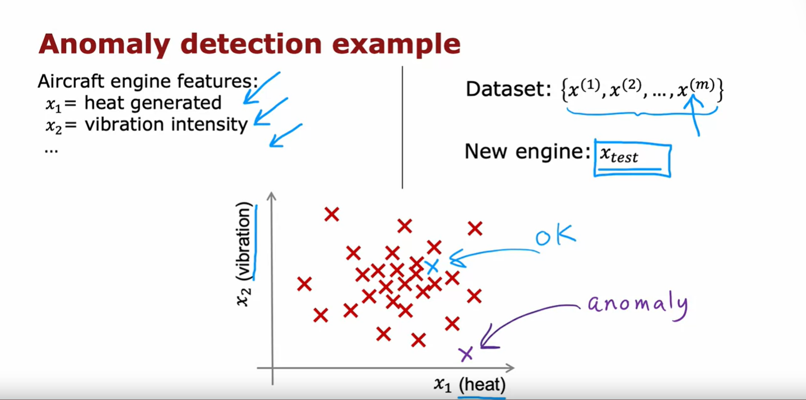

### Anomaly detection example

Some of my friends were working on using Anomaly Detection to detect possible problems with aircraft engines that were being manufactured. When a company makes an aircraft engine, you really want that aircraft engine to be reliable and function well because an aircraft engine failure has very negative consequences. So, some of my friends were using Anomaly Detection to check if an aircraft engine, after it was manufactured, seemed anomalous or if there seemed to be anything wrong with it

Here's the idea: After an aircraft engine rolls off the assembly line, you can compute a number of different features of the aircraft engine. So, say feature $x_1$ measures the heat generated by the engine and feature $x_2$ measures the vibration intensity and so on and so forth for additional features as well but to simplify the slide a bit, I'm going to use just two features $x_1$ and $x_2$ corresponding to the heat and the vibrations of the engine

Now, it turns out that aircraft engine manufacturers don't make that many bad engines and so the easier type of data to collect would be if you have manufactured $m$ aircraft engines to collect the features $x_1$ and $x_2$ about how these $m$ engines behave and probably most of them are just fine than normal engines rather than ones with a defect or flaw in them.

And the Anomaly Detection problem is, after the learning algorithm has seen these $m$ examples of how aircraft engines typically behave in terms of how much heat is generated and how much they vibrate, if a brand new aircraft engine were to roll off the assembly line and it had a new feature vector given by $x_{test}$, we'd like to know: 
- Does this engine look similar to ones that have been manufactured before? 
- So, is this probably okay? 
- Or is there something really weird about this engine which might cause its performance to be suspect? meaning that maybe we should inspect it even more carefully before we let it get shipped out and be installed in an airplane and then hopefully nothing will go wrong with it. 

### How an Anomaly Detection algorithm works

Here's how an Anomaly Detection algorithm works. Let me plot the examples $x_1$ through $x^{(m)}$ over here via these red crosses where each cross/each data point in this plot corresponds to a specific engine with a specific amount of heat and specific amount of vibrations. 

If this new aircraft engine $x_{test}$ rolls off the assembly line and if you were to plot these values of $x_1$ and $x_2$ and if it were here, you say, okay, that looks probably okay, it looks very similar to other aircraft engines, maybe I don't need to worry about this one.

But if this new aircraft engine has a heat and vibration signature that is say all the way down here (purple cross on the graph), then this data point down here looks very different than ones we saw up on top and so we will probably say, boy, this looks like an anomaly, this doesn't look like the examples I've seen before, we better inspect this more carefully before we let this engine get installed on an airplane. 

How can you have an algorithm address this problem?

### Density estimation

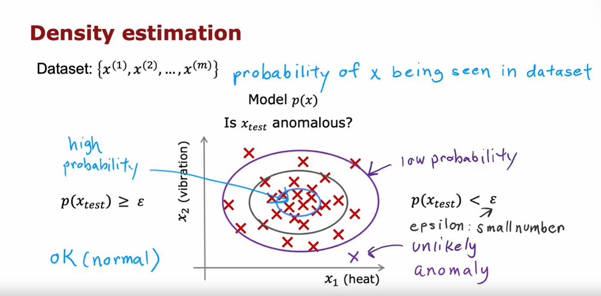

The most common way to carry out Anomaly Detection is through a technique called **density estimation** and what that means is, when you're given your training sets of these $m$ examples, the first thing you do is build a model for the probability of $x$: Model $p(x)$. 

In other words, the learning algorithm will try to figure out what are the values of the features $x_1$ and $x_2$ that have high probability and what are the values that are less likely or have a lower chance or lower probability of being seen in the data set. 

In this example that we have here, I think it is quite likely to see examples in that little ellipse in the middle, so that region in the middle would have high probability, maybe things in this other ellipse have a little bit lower probability, maybe things in this other ellipse of this oval have even lower probability and things outside have even lower probability. 

The details of how you decide from the training set what regions are higher versus lower probability is something we'll see in the next few videos and having learned to model for $p(x)$ when you are given the new test example $x_{test}$, what you will do is then compute the probability of $x_{test}$, this is $p(x_{test})$.

### Case 1: $p(x_{test}) < \epsilon$

And if it is small or more precisely, if it is less than some small number that I'm going to call epsilon $\epsilon$, this is a greek alphabet epsilon $\epsilon$, so what you should think of as a small number, which means that $p(x)$ is very small or in other words, the specific value of $x$ that you saw for a certain user was very unlikely, relative to other usage that you have seen

But the $p(x_{test})$ is less than some small threshold or some small number epsilon $\epsilon$, we will raise a flag to say that this could be an anomaly. So, for example, if $x_{test}$ was all the way down here (purple cross), the probability of an example landing all the way out here is actually quite low and so hopefully $p(x_{test})$ for this value of $x_{test}$ will be less than epsilon $\epsilon$ and so we would flag this as an anomaly. 

### Case 2: $p(x_{test}) >= \epsilon$

Whereas in contrast, if $p(x_{test})$ is not less than epsilon $\epsilon$, if $p(x_{test})$ is greater than equal to epsilon $\epsilon$, then we will say that it looks okay, this doesn't look like an anomaly and that response to if you had an example in here say where our model $p(x)$ will say that examples near the middle here, they're actually quite high probability, there's a very high chance that the new airplane engine will have features close to these inner ellipses and so $p(x_{test})$ will be large for those examples and we'll say it's okay and it's not an anomaly.

### Applications of Anomaly detection

Anomaly detection is used today in many applications. 

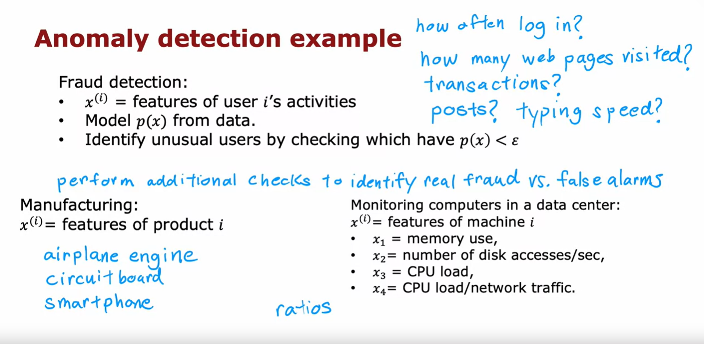

#### Fraud detection

It is frequently used in fraud detection where for example if you are running a website with many different features, if you compute $x^{(i)}$ to be the features of user i's activities and examples of features might include:

- How often does this user login? 
- How many web pages do they visit? 
- How many transactions are they making?
- How many posts on the discussion forum are they making?
- What is their typing speed? 
- How many characters per second do they seem able to type?

With data like this you can then model $p(x)$ from data to model what is the typical behavior of a given user. 

In the common workflow of fraud detection, you wouldn't automatically turn off an account just because it seemed anomalous but instead you may ask the security team to take a closer look or put in some additional security checks such as ask the user to verify their identity with a cell phone number or ask them to pass a capture to prove that they're human and so on. 

But algorithms like this are routinely used today to try to find unusual or maybe slightly suspicious activity so you can more carefully screen those accounts to make sure there isn't something fraudulent. 

And this type of fraud detection is used both to find fake accounts and this type of algorithm is also used frequently to try to identify financial fraud such as if there's a very unusual pattern of purchases then that may be something well worth a security team taking a more careful look at. 

#### Manufacturing detection

Anomaly detection is also frequently used in manufacturing. You saw an example on the previous slide with aircraft engine manufacturing but many manufacturers in multiple continents in many, many factories were routinely use Anomaly Detection to see if whatever they just manufactured. 

Anything from an airplane engine to a printed circuit board to a smartphone to a motor, to many, many things to see if you've just manufactured the unit that somehow behaves strangely because that may indicate that there's something wrong with your airplane engine or printed circuit boards or what have you that might cause you to want to take a more careful look before you ship that object to the customer. 

#### Monitoring computers in a datacenter

It is also used to monitor computers in clusters and in data centers where if $x^{(i)}$ are the features of a certain machine $i$ such as if the features captured the memory usage, the number of disk accesses per second, CPU load features can also be ratios, such as the ratio of CPU load to network traffic, then if ever a specific computer behaves very differently than other computers, it might be worth taking a look at that computer to see if something is wrong with it such as if it has had a hard disk failure or network card failure or something's wrong with it or if maybe it has been hacked into

## Summary

Anomaly detection is one of those algorithms that is very widely used even though you don't seem to hear people talk about it that much. 

I remember the first time I worked on the commercial application of Anomaly Detection was when I was helping a telco company put in place Anomaly Detection to see when any one of the cell towers was behaving in an unusual way because that probably meant there was something wrong with the cell tower and so they want to get a technician to take so hopefully that helped more people get good cell phone coverage. 

And I've also used Anomaly Detection to find fraudulent financial transactions and these days I often use it to help manufacturing companies find anomalous parts that they may have manufactured but should inspect more often. 

So, it is a very useful tool to have in your tool chest and in the next few videos we'll talk about how you can build and get these algorithms to work for yourself. 

In order to get anonymous detection algorithms to work, we'll need to use a Gaussian distribution to model the data $p(x)$. So, let's go on to the next video to talk about Gaussian distributions

## Gaussian (normal) distribution

In order to apply Anomaly Detection, we're going to need to use the Gaussian distribution, which is also called the normal distribution. When you hear me say either Gaussian distribution or normal distribution, they mean exactly the same thing and if you've heard the bell-shaped distribution, that also refers to the same thing but if you haven't heard of the bell-shaped distribution, that's fine too. 

But let's take a look at what is the Gaussian or the normal distribution. 

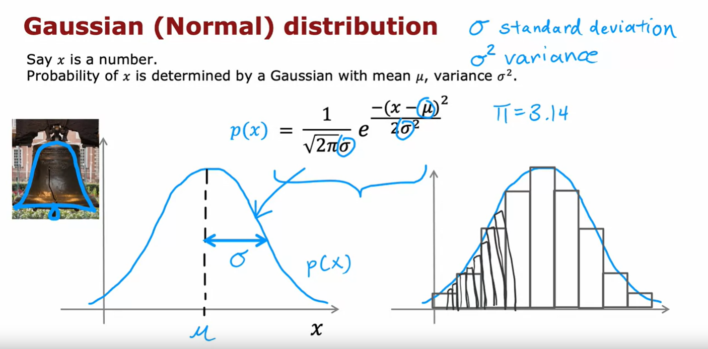

Say $x$ is a number, and if $x$ is a random number, sometimes called the random variable, $x$ can take on random values and if the probability of $x$ is given by a Gaussian or normal distribution with mean parameter Mu $\mu$, and with variance Sigma squared $\sigma^2$, what that means is that the probability of $x$, $p(x)$, looks like a curve that goes like the one shown above

The center or the middle of the curve is given by the mean Mu $\mu$ and the standard deviation or the width of this curve is given by that variance parameter Sigma. 

Technically, Sigma is called the standard deviation $\sigma$ and the square of Sigma or Sigma squared $\sigma^2$ is called the variance of the distribution and this curve here shows what is $p(x)$ or the probability of $x$

If you've heard of the bell-shaped curve, this is that bell-shaped curve because a lot of classic bells say in towers were kind of shaped like this with the bell clapper hanging down here and so the shape of this curve is vaguely reminiscent of the shape of the large bells that you will still find in some old buildings today. 

Better looking than my hand-drawn one, there's a picture of the Liberty Bell, indeed, the Liberty Bell's shape on top is vaguely bell-shaped curve. 

### Interpretation of $p(x)$

If you're wondering what does $p(x)$ really means, here's one way to interpret it: It means that if you were to get, say, 100 numbers drawn from this probability distribution and you were to plot a histogram of these 100 numbers drawn from this distribution, you might get a histogram that looks like the one shown above, next to the bell shaped curve.

It looks vaguely bell-shaped and what this curve on the left indicates is not if you have just 100 examples or 1,000 or a million or a billion but if you had a practically infinite number of examples and you were to draw a histogram of this practically infinite number of examples with a very fine histogram bin, then you end up with essentially this bell-shaped curve here on the left. 

The formula for $p(x)$ is given by this expression:

$$ p(x) = \frac{1}{\sqrt{2\pi}\sigma} e^-{\frac{(x - \mu)^2}{2\sigma^2}} $$

And for any given value of Mu $\mu$ and Sigma $\sigma$, if you were to plot this function as a function of $x$, you get this type of bell-shaped curve that is centered at Mu $\mu$ and with the width of this bell-shaped curve being determined by the parameter Sigma $\sigma$

### Gaussian distribution example

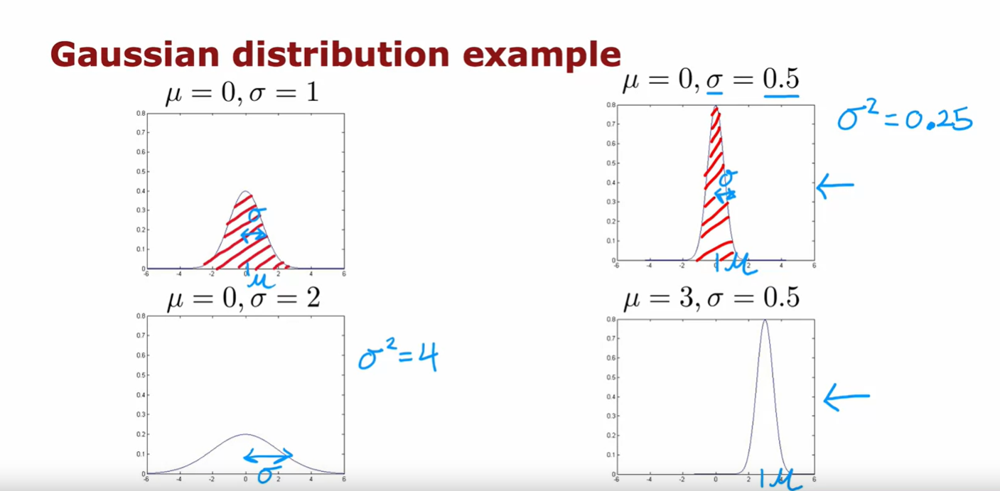

Now let's look at a few examples of how changing Mu $\mu$ and Sigma will affect the Gaussian distribution. 

#### Example 1: $\mu = 0$ and $\sigma = 1$

First, let me set Mu $\mu$ equals 0 and Sigma equals 1. Here's my plot of the Gaussian distribution with mean 0 and standard deviation Sigma equals 1. 

You notice that this distribution is centered at zero and that is the standard deviation Sigma is equal to 1. 

#### Example 2: $\mu = 0$ and $\sigma = 0.5$

Now, let's reduce the standard deviation Sigma to 0.5. 

If you plot the Gaussian distribution with Mu $\mu$ equals 0 and Sigma equals 0.5, it now it looks like this. Notice that it's still centered at zero because Mu $\mu$ is zero but it's become a much thinner curve because Sigma is now 0.5. You might recall that Sigma is the standard deviation is 0.5, whereas Sigma squared $\sigma^2$ is also called the variance and so that's equal to 0.5 squared or 0.25. 

You may have heard that probabilities always have to sum up to one, so that's why the area under the curve is always equal to one, which is why when the Gaussian distribution becomes skinnier, it has to become taller as well.

#### Example 3: $\mu = 0$ and $\sigma = 2$

Let's look at another value of Mu $\mu$ and Sigma. Now, I'm going to increase Sigma to 2, so the standard deviation is 2 and the variance is 4. 

This now creates a much wider distribution because Sigma here is now much larger and because it's now a wider distribution is become shorter as well because the area under the curve is still equals 1. 

#### Example 4: $\mu = 3$ and $\sigma = 0.5$

Finally, let's try changing the mean parameter Mu $\mu$ and I'll leave Sigma equals 0.5. In this case, the center of the distribution Mu $\mu$ moves over here to the right but the width of the distribution is the same as the one on top because the standard deviation is 0.5 in both of these cases on the right. 

## Parameter estimation

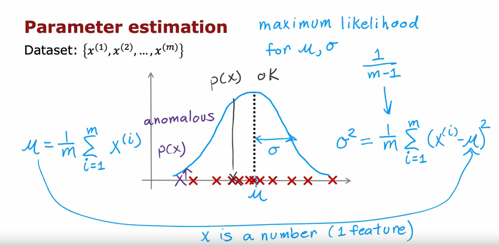

So, this is how different choices of Mu $\mu$ and Sigma $\sigma$ affect the Gaussian distribution

When you're applying this to Anomaly Detection, here's what you have to do.

You are given a dataset of $m$ examples and here $x$ is just a number and here are plots of the training sets with 11 examples and what we have to do is try to estimate what a good choice is for the mean parameter Mu $\mu$ as well as for the variance parameter Sigma squared $\sigma^2$

And given a dataset like this, it would seem that a Gaussian distribution maybe looking like that with a center here on $\mu$ and a standard deviation $\sigma$ like that, this might be a pretty good fit to the data. 

The way you would compute Mu $\mu$ and Sigma squared $\sigma^2$ mathematically is:

Our estimate for Mu $\mu$ will be just the average of all the $m$ training examples, so:

$$ \mu = \frac{1}{m} \sum_{i = 1}^{m}{x^{(i)}} $$

The value we will use to estimate Sigma squared $\sigma^2$ will be the average of the squared difference between each one of the $m$ training examples and that Mu $\mu$ that you just estimated before

$$ \sigma^2 = \frac{1}{m} \sum_{i = 1}^{m}{(x^{(i)} - \mu)^2} $$

It turns out that if you implement these two formulas in code with this value for Mu $\mu$ and this value for Sigma squared $\sigma^2$, then you pretty much get the Gaussian distribution that I hand drew on top. 

This will give you a choice of Mu $\mu$ and Sigma $\sigma$ for a Gaussian distribution so that it kind of looks like the 11 training examples might have been drawn from this Gaussian distribution

### Concept of maximum likelihood for $\mu$ and $\sigma$

If you've taken an advanced statistics class, you may have heard that these formulas for Mu $\mu$ and Sigma squared $\sigma^2$ are technically called the maximum likelihood estimates for Mu $\mu$ and Sigma

Some statistics classes will tell you to use the formula *1 over m minus 1* instead of *1 over m*: 

$$ \sigma^2 = \frac{1}{m} \sum_{i = 1}^{m}{(x^{(i)} - \mu)^2}$$

$$ \sigma^2 = \frac{1}{m-1} \sum_{i = 1}^{m}{(x^{(i)} - \mu)^2}$$

In practice, using *1 over m* or *1 over m minus 1* makes very little difference. I always use *1 over m* but there are some other properties of dividing by *m minus 1* that some statisticians prefer but if you don't understand what they just said, don't worry about it. 

All you need to know is that if you set Mu $\mu$ according to this formula and Sigma squared $\sigma^2$ according to this formula, you'd get a pretty good estimate of Mu and Sigma and in particular, you get a Gaussian distribution that will be a possible probability distribution in terms of what's the probability distribution that the training examples had come from

You can probably guess what comes next. If you were to get an example over here, then $p(x)$ is pretty high whereas if you were to get an example, we are here and then $p(x)$ is pretty low which is why we would consider this example, okay, not really anomalous, not a lot like the other ones whereas an example we are here to be pretty unusual compared to the examples we've seen, and therefore more anomalous because $p(x)$, which is the height of this curve, is much lower over here on the left compared to this point over here, closer to the middle. 

Now, we've done this only for when $x$ is a number as if you had only a single feature for your Anomaly Detection problem. For practical Anomaly Detection applications, you usually have a lot of different features

### Summary

So, you've now seen how the Gaussian distribution works: If $x$ is a single number, this corresponds to if, say you had just one feature for your Anomaly Detection problem. But for practical Anomaly Detection applications, you will have many features, two or three or some even larger number n of features. Let's take what you saw for a single Gaussian and use it to build a more sophisticated Anomaly Detection algorithm they can handle multiple features. 

Let's go do that in the next video.

## Anomaly detection algorithm

Now that you've seen how the Gaussian or the normal distribution works for a single number, we're ready to build our Anomaly Detection algorithm. Let's dive in.

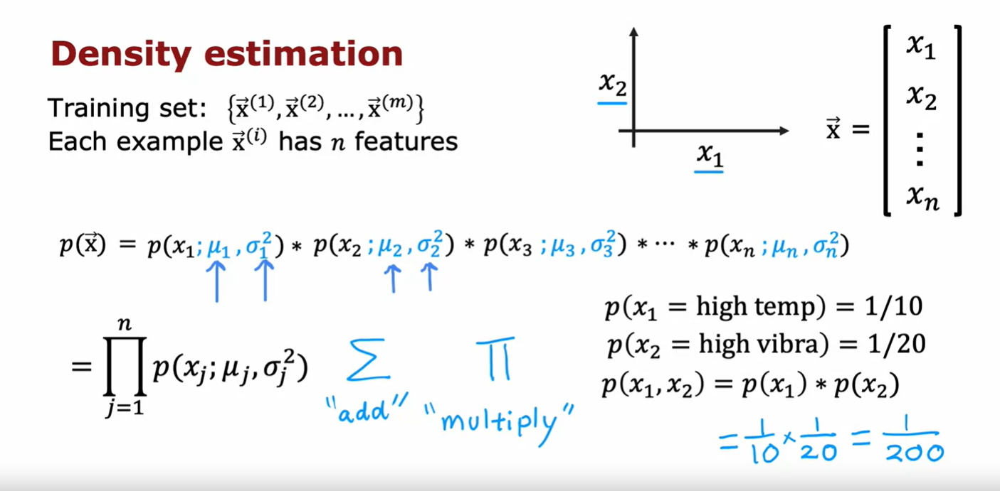

You have a training set $x_1$ through $x_m$, where here each example $x$ has $n$ features. So, each example $x$ is a vector with $n$ numbers. 

In the case of the airplane engine example, we had two features corresponding to the heat and the vibrations and so, each of these $x^{(i)}$'s would be a two dimensional vector and $n=2$

But for many practical applications $n$ can be much larger and you might do this with dozens or even hundreds of features. 

Given this training set, what we would like to do is to carry out density estimation and all that means is we will build a model or estimate the probability for $p(x)$: What's the probability of any given feature vector? 

And our model for $p(x)$ is going to be as follows: $x$ is a feature vector with values $x_1$, $x_2$ and so on down to $x_n$ and I'm going to model $p(x)$ as the probability of $x_1$ times the probability of $x_2$ times the probability of $x_3$ times the probability of $x_n$ for the $n_{th}$ features in the feature vectors

If you've taken an advanced class in probably in statistics before, you may recognize that this equation corresponds to assuming that the features $x_1$, $x_2$ and so on up to $x_m$ are statistically independent but it turns out this algorithm often works fine even that the features are not actually statistically independent

But if you don't understand what I just said, don't worry about it. Understanding statistical independence is not needed to fully complete this class and also be able to very effectively use Anomaly Detection algorithm.

Now, to fill in this equation a little bit more, we are saying that the probability of all the features of this vector features $x$, is the product of $p(x_1)$ and $p(x_2)$ and so on up through $p(x_n)$

#### Modelling $p(x_1)$

And in order to model the probability of $x_1$, say the heat feature in this example, we're going to have two parameters: $\mu_1$ and $\sigma_1^2$ and what that means is we're going to estimate the mean of the feature $x_1$ and also the variance of feature $x_1$ and that will be $\mu_1$ and $\sigma_1^2$

#### Modelling $p(x_2)$

To model $p(x_2)$, $x_2$ is a totally different feature measuring the vibrations of the airplane engine. We're going to have two different parameters, which I'm going to write as $\mu_2$, $\sigma_2^2$ and it turns out this will correspond to the mean or the average of the vibration feature and the variance of the vibration feature

#### Modelling $p(x_n)$

And so on, if you have additional features $\mu_3$, $\sigma_3^2$ up through $\mu_n$, $\sigma_n^2$

#### Why are we multiplying probabilities

In case you're wondering why we multiply probabilities, maybe here's one example that could build intuition: Suppose for an aircraft engine there's a 1/10 chance that it is really hot, unusually hot and maybe there is a 1 in 20 chance that it vibrates really hard. 

Then, what is the chance that it runs really hot and vibrates really hard? We're saying that the chance of that is 1/10 times 1/20 which is 1/200. So, it's really unlikely to get an engine that both run really hot and vibrates really hard. It's the product of these two probabilities. 

### Notation

A somewhat more compact way to write this equation up here is to say that this is equal to:

$$ \prod_{j = 1}^{n} p(x_j; \mu_j, \sigma_j^2) $$

This is the product from j=1 through n of $p(x_j)$ with parameters $\mu_j$ and $\sigma_j^2$ and this symbol here is a lot like the summation symbol except that whereas the summation symbol corresponds to addition, this symbol here instead corresponds to multiplying these terms over here for j=1 through n. 

## Anomaly detection algorithm

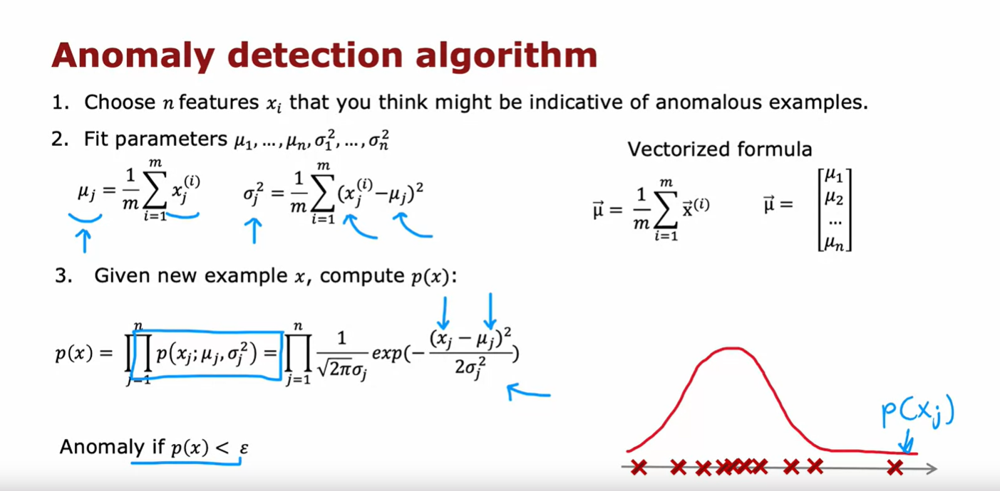

So, let's put it all together to see how you can build an Anomaly Detection system. 

### Step 1

The first step is to choose features $x_i$ that you think might be indicative of anomalous examples

### Step 2

Having come up with the features you want to use, you would then fit the parameters $\mu_1$ through $\mu_n$ and $\sigma_1^2$ through $\sigma_n^2$, for the $n$ features in your data set. 

As you might guess, the parameter $\mu_j$ will be just the average of $x_j$ of the feature $j$ of all the examples in your training set, this is:

$$ \mu_j = \frac{1}{m} \sum_{i = 1}^{m}{x_j^{(i)}} $$

and $\sigma_j^2$ will be the average of the square difference between the feature and the value $\mu_j$ that you just computed, so we have:

$$ \sigma_j^2 = \frac{1}{m} \sum_{i = 1}^{m}{(x_j^{(i)} - \mu_j)^2} $$

##### Vectorized formula

And by the way, if you have a vectorized implementation, you can also compute $\vec{\mu}$ as the average of the training examples as follows, where here $\vec{x}$ and $\vec{\mu}$ are both vectors:

$$ \vec{\mu} = \frac{1}{m} \sum_{i = 1}^{m}{\vec{x}^{(i)}} $$

And so this would be the vectorized way of computing mu 1 through mu and all at the same time. 

$$
\vec{\mu} =
\begin{bmatrix}
\mu_1 \\
\mu_2 \\
\vdots \\
\mu_n
\end{bmatrix}
$$

And by estimating these parameters on your unlabeled training set, you've now computed all the parameters of your model

### Step 3

Finally, when you are given a new example, $x_{test}$ or I'm just going to write a new example as $x$ here, what you would do is compute $p(x)$ and see if it's large or small. 

So, $p(x)$ as you saw on the last slide is the product from j = 1 through n of the probability of the individual features. So, $p(x_j)$ with parameters $\mu_j$ and $\sigma_j^2$

$$ p(x) = \prod_{j = 1}^{n} p(x_j; \mu_j, \sigma_j^2) $$

And if you substitute in the formula for this probability you end up with this expression:

$$ p(x) = \prod_{j = 1}^{n} \frac{1}{\sqrt{2\pi}\sigma_j} exp(-{\frac{(x_j - \mu_j)^2}{2\sigma_j^2}}) $$

And so $x_j$ are the features, this is a $j$ feature of your new example, $\mu_j$ and $\sigma_j$ are numbers or parameters you have computed in the previous step and if you compute out this formula, you get some number for $p(x)$

### Step 4

And the final step is to see a $p(x)$ is less than epsilon $\epsilon$ ($p(x) < \epsilon$) and if it is then you flag that it is an anomaly.

## Algorithm intuition

One intuition behind what this algorithm is doing is that it will tend to flag an example as anomalous if 1 or more of the features are either very large or very small relative to what it has seen in the training set. 

So, for each of the features $x_j$, you're fitting a Gaussian distribution like this and so if even one of the features of the new example was way out here, say, then $p(x_j)$ would be very small and if just one of the terms in this product is very small, then this overall product, when you multiply together will tend to be very small and does $p(x)$ will be small. 

And what Anomaly Detection is doing in this algorithm is a systematic way of quantifying whether or not this new example $x$ has any features that are unusually large or unusually small.

## Anomaly detection example

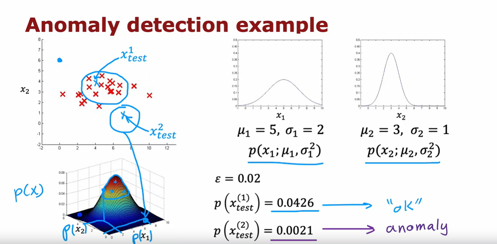

Now, let's take a look at what all this actually means on one example. 

Here's the data set with features $x_1$ and $x_2$ and you notice that the features $x_1$ take on a much larger range of values than the features $x_2$

### $x_1$

If you were to compute the mean of the features $x_1$, you end up with five, (so, $\mu_1 = 5$) and it turns out that for this data set if you compute $\sigma_1$ it will be equal to about 2 ($\sigma_1 = 2$)

### $x_2$

And if you were to compute $\mu_2$, the average of the features on $x_2$, the average is three ($\mu_2 = 3$) and similarly its variance or standard deviation is much smaller, which is why ($\sigma_2 = 1$). 

So, that corresponds to this Gaussian distribution for $x_1$ and this Gaussian distribution for $x_2$. 

If you were to actually multiply $p(x_1)$ and $p(x_2)$, then you end up with this 3D surface plot for $p(x)$ where at any point, the height of this is the product of $p(x_1)$ times $p(x_2)$ for the corresponding values of $x_1$ and $x_2$. 

And this signifies that values where $p(x)$ is higher or more likely, so, values near the middle kind of here are more likely whereas values far out here, values out here are much less likely, I have much lower chance.

### Let's pick 2 test examples

Now, let me pick two test examples: The first one here, I'm going to write this $x_{test}^1$ and the second one down here as $x_{test}^2$

And let's see which of these 2 examples the algorithm will flag as anomalous.

#### Picking the 1st test example

I'm going to pick the parameter ε to be equal to 0.02 ($\epsilon = 0.02$) and if you were to compute $p(x_{test}^1)$, it turns out to be about 0.4 and this is much bigger than epsilon $\epsilon$ and so the algorithm will say this looks okay, doesn't look like an anomaly. 

#### Picking the 2nd test example

Whereas in contrast, if you were to compute $p(x)$ for this point down here, $p(x_{test}^2)$, corresponding to $x_1 \approx 8$ and $x_2 \approx 0.5$, kind of down here, then $p(x_{test}^2) = 0.0021$, so this is much smaller than epsilon $\epsilon$ and so the algorithm will flag this as a likely anomaly. 

So, pretty much as you might hope, it decides that $x_{test}^1$ looks pretty normal whereas $x_{test}^2$ which is much further away than anything you see in the training set, looks like it could be an anomaly. 

## Summary

So, you've seen the process of how to build an Anomaly Detection system. 

But how do you choose the parameter epsilon $\epsilon$? And how do you know if your Anomaly Detection system is working well? 

In the next video, let's dive a little bit more deeply into the process of developing and evaluating the performance of an Anomaly Detection system.

Let's go on to the next video

## Developing and evaluating an Anomaly Detection system

I'd like to share with you some practical tips for developing an Anomaly Detection system. One of the key ideas will be that if you can have a way to evaluate a system, even as it's being developed, you'll be able to make decisions and change the system and improve it much more quickly. Let's take a look at what that means.

### The importance of real-number evaluation

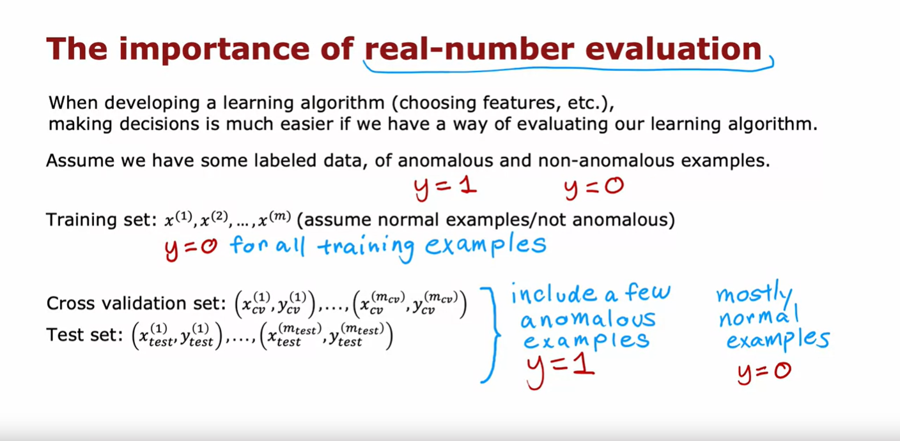

When you are developing a learning algorithm, say choosing different features or trying different values of the parameters like epsilon $\epsilon$, making decisions about whether or not to change a feature in a certain way or to increase or decrease epsilon $\epsilon$ or other parameters, making those decisions is much easier if you have a way of evaluating the learning algorithm. 

This is sometimes called **real number evaluation**, meaning that if you can quickly change the algorithm in some way, such as change a feature or change a parameter and have a way of computing a number that tells you if the algorithm got better or worse, then it makes it much easier to decide whether or not to stick with that change to the algorithm. 

### Real number evaluation applied to Anomaly Detection

This is how it's often done in Anomaly Detection which is, even though we've mainly been talking about unlabeled data, I'm going to change that assumption a bit and assume that we have some labeled data, including just a small number usually of previously observed anomalies. 

So, maybe after making airplane engines for a few years, you've just seen a few airplane engines that were anomalous and 

- for examples that you know are anomalous, I'm going to associate a label $y = 1$ to indicate this anomalous and 
- for examples that we think are normal, I'm going to associate the label $y = 0$

And so, the training set that the Anomaly Detection algorithm will learn from is still this unlabeled training set of 

$$ x^{(1)}, x^{(2)}, ..., x^{(m)} $$

and I'm going to think of all of these examples as ones that we'll just assume are normal (not anomalous), so $y = 0$ for all training examples

In practice, if a few anomalous examples were to slip into this training set, your algorithm will still usually do okay. 

### How to evaluate the algorithm

To evaluate your algorithm, to come up with a way for you to have a real number evaluation, it turns out to be very useful if you have a small number of anomalous examples so that you can create a cross validation set, which I'm going to denote it as:

$$ (x_{cv}^{(1)}, y_{cv}^{(1)}), ..., (x_{cv}^{(m_{cv})}, y_{cv}^{(m_{cv})}) $$

This is similar notation as you had seen in the second course of this specialization and similarly have a test set denoted as: 

$$ (x_{test}^{(1)}, y_{test}^{(1)}), ..., (x_{test}^{(m_{test})}, y_{test}^{(m_{test})}) $$

of some number of examples where both the cross validation and test sets hopefully includes a few anomalous examples. 

In other words, the cross validation and test sets will have a few examples of $y = 1$ but also a lot of examples where $y = 0$. 

Again, in practice, Anomaly Detection algorithm will work okay if there are some examples that are actually anomalous but they were accidentally labeled with $y = 0$

### Aircraft engines monitoring example

Let's illustrate this with the aircraft engine example. 

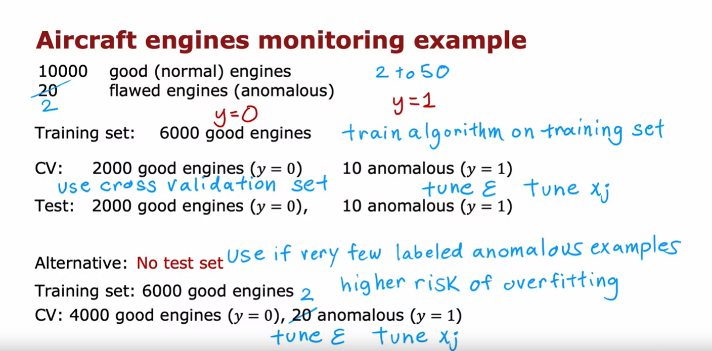

Let's say you have been manufacturing aircraft engines for years and so you've collected data from 10,000 good or normal engines but over the years you had also collected data from 20 flawed or anomalous engines. 

Usually, the number of anomalous engines, that is $y = 1$, will be much smaller and so it will not be a typical to apply this type of algorithm with anywhere from, say, 2-50 known anomalies. 

#### Splitting the algorithm into training, cross-validation and test sets

We're going to take this dataset and break it up into a training set, a cross validation set, and the test set. Here's one example. 

I'm going to put 6,000 good engines into the training set. Again, if there are couple of anomalous engines that got slipped into this set is actually okay, I wouldn't worry too much about that. 

Then let's put 2,000 good engines and 10 of the known anomalies into the cross-validation set, and a separate 2,000 good and 10 anomalous engines into the test set. 

What you can do then is train the algorithm on the training set, fit the Gaussian distributions to these 6,000 examples and then on the cross-validation set, you can see how many of the anomalous engines it correctly flags. 

For example, you could use the cross validation set to tune the parameter epsilon $\epsilon$ and set it higher or lower depending on whether the algorithm seems to be reliably detecting these 10 anomalies without taking too many of these 2,000 good engines and flagging them as anomalies. 

And after you have tuned the parameter epsilon $\epsilon$ and maybe also added or subtracted or tuned the features $x_j$, you can then take the algorithm and evaluate it on your test set to see how many of these 10 anomalous engines it finds, as well as how many mistakes it makes by flagging the good engines as anomalous ones. 

Notice that this is still primarily an unsupervised learning algorithm because the training sets really has no labels or they all have labels that we're assuming to be $y = 0$ and so we learned from the training set by fitting the Gaussian distributions as you saw in the previous video. 

When building a practical Anomaly Detection system, having a small number of anomalies in the cross-validation and test sets is very helpful for evaluating and fine-tuning the algorithm.

#### An alternative to evaluate the model

Because the number of flawed engines is so small, there's one other alternative that I often see people use for Anomaly Detection, which is to not use a test set, like to have just a training set and a cross-validation set. 

In this example, you will set train on 6,000 good engines, but take the remainder of the data, the 4,000 remaining good engines as well as all the anomalies, and put them in the cross validation set. 

And you would then tune the parameters epsilon $\epsilon$ and add or subtract features $x_j$ to try to get it to do as well as possible as evaluated on the cross validation set. 

If you have very few flawed engines, so if you had only two flawed engines, then this really makes sense to put all of that in the cross validation set. You just don't have enough data to create a totally separate test set that is distinct from your cross-validation set. 

The downside of this alternative here is that after you've tuned your algorithm, you don't have a fair way to tell how well this will actually do on future examples because you don't have a test set but when your dataset is small, especially when the number of anomalies you have in your dataset is small, this might be the best alternative you have and so I see this done quite often as well when you just don't have enough data to create a separate test set. 

And if this is the case, just be aware that there's a higher risk that you will have over-fit some of your decisions around epsilon $\epsilon$ and choice of features and so on to the cross-validation set and so its performance on real data in the future may not be as good as you were expecting

## Algorithm evaluation

Now, let's take a closer look at how to actually evaluate the algorithm on your cross-validation set or on the test set. Here's what you'd do. 

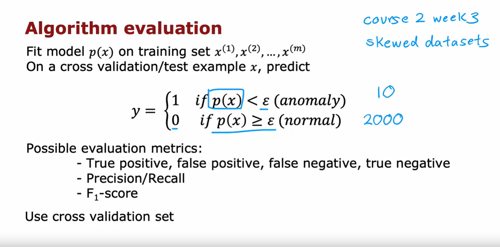

You would:

- First fit the model $p(x)$ on the training set. This was a 6,000 examples of goods engines. 

- Then, on any cross validation or test example x, you would compute $p(x)$ and you will predict $y = 1$, that is anomalous, if $p(x)$ is less than epsilon $\epsilon$ and you will predict $y = 0$, if $p(x)$ is greater than or equal to epsilon $\epsilon$. 

- And based on this, you can now look at how accurately this algorithm's predictions on the cross validation or test set matches the labels $y$ that you have in the cross validation or the test sets. 

### Skewed datasets

In the [third week of the second course (Skewed datasets (Optional))](../../../course_2-advanced-learning-algorithms/week3/7-Skewed%20datasets%20(optional)/), we had had a couple of optional videos on how to handle highly skewed data distributions where the number of positive examples, $y = 1$, can be much smaller than the number of negative examples where $y = 0$. 

This is the case as well for many Anomaly Detection in the applications where the number of anomalies in your cross-validation set is much smaller. 

In our previous example, we had maybe 10 positive examples and 2,000 negative examples because we had 10 anomalies and 2,000 normal examples. 

#### Possible evaluation metrics

If you saw those optional videos, you may recall that we saw it can be useful to compute things like the true positive, false positive, false negative, and true negative rates also compute precision recall or $F_1$-score and that these are alternative metrics and classification accuracy that could work better when your data distribution is very skewed. 

If you saw that video, you might consider applying those types of evaluation metrics as well to tell how well your learning algorithm is doing at finding that small handful of anomalies or positive examples amidst this much larger set of negative examples of normal plane engines. 

If you didn't watch that video, don't worry about it. It's okay. 

The intuition I hope you get is to use the cross-validation set to just look at how many anomalies is finding and also how many normal engines is incorrectly flagging as an anomaly and then to just use that to try to choose a good choice for the parameter epsilon $\epsilon$. 

### Summary

So, you find that the practical process of building an Anomaly Detection system is much easier if you actually have just a small number of labeled examples of known anomalies. 

Now, this does raise the question, if you have a few labeled examples, since you'll still be using an unsupervised learning algorithm, why not take those labeled examples and use a Supervised Learning algorithm instead? 

In the next video, let's take a look at a comparison between Anomaly Detection and Supervised Learning and when you might prefer one over the other. 

Let's go on to the next video.

## Anomaly detection vs. Supervised Learning

When you have a few positive examples with $y = 1$ and a large number of negative examples say $y = 0$, when should you use Anomaly Detection and when should you use Supervised Learning? The decision is actually quite subtle in some applications, so let me share with you some thoughts and some suggestions for how to pick between these two types of algorithms.

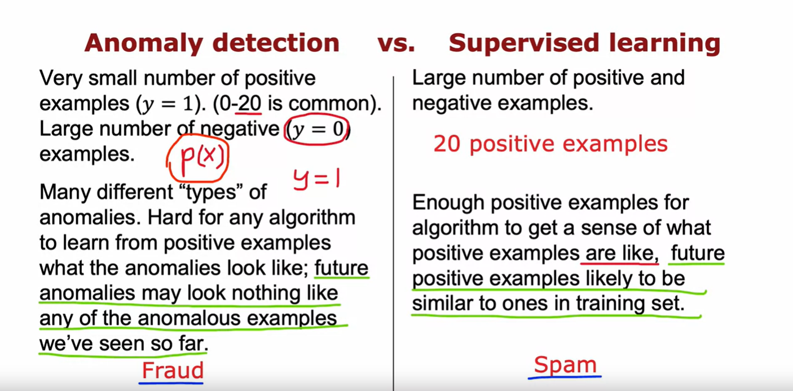

An Anomaly Detection algorithm will typically be the more appropriate choice when you have a very small number of positive examples, 0-20 positive examples is not uncommon and a relatively large number of negative examples with which to try to build a model for $p(x)$. 

What you recall that the parameters for $p(x)$ are learned only from the negative examples and this much smaller set of positive examples is only used in your cross validation set and test set for parameter tuning and for evaluation. 

In contrast, if you have a larger number of positive and negative examples, then Supervised Learning might be more applicable. 

Now, even if you have only 20 positive training examples, it might be okay to apply a Supervised Learning algorithm but it turns out that the way Anomaly Detection looks at the data set versus the way Supervised Learning looks at the data set are quite different. Here is the main difference, which is that if you think there are many different types of anomalies or many different types of positive examples, then Anomaly Detection might be more appropriate.

When there are many different ways for an aircraft engine to go wrong and if tomorrow there may be a brand new way for an aircraft engine to have something wrong with it, then your 20 say positive examples may not cover all of the ways that an aircraft engine could go wrong. 

That makes it hard for any algorithm to learn from the small set of positive examples what the anomalies, what the positive examples look like and future anomalies may look nothing like any of the anomalous examples we've seen so far. 

If you believe this to be true for your problem, then I would gravitate to using an Anomaly Detection algorithm because what Anomaly Detection does is it looks at the normal examples that is the $y = 0$ or negative examples and just try to model what they look like. 

And anything that deviates a lot from normal, it flags as an anomaly including if there's a brand new way for an aircraft engine to fail that had never been seen before in your data set. 

In contrast, Supervised Learning has a different way of looking at the problem. When you're applying Supervised Learning ideally you would hope to have enough positive examples for the algorithm to get a sense of what the positive examples are like and with Supervised Learning, we tend to assume that the future positive examples are likely to be similar to the ones in the training set. 

So, let me illustrate this with one example: If you are using a system to find, say financial fraud, there are many different ways unfortunately that some individuals are trying to commit financial fraud and unfortunately there are new types of financial fraud attempts every few months or every year and what that means is that because they keep on popping up completely new and unique forms of financial fraud Anomaly Detection is often used to just look for anything that's different, then transactions we've seen in the past. 

In contrast, if you look at the problem of email spam detection, well, there are many different types of spam email, but even over many years, spam emails keep on trying to sell similar things or get you to go to similar websites and so on. 

Spam email that you will get in the next few days is much more likely to be similar to spam emails that you have seen in the past. So, that's why Supervised Learning works well for spam because it's trying to detect more of the types of spam emails that you have probably seen in the past in your training set. Whereas if you're trying to detect brand new types of fraud that have never been seen before, then Anomaly Detection maybe more applicable. 

### More examples 

Let's go through a few more examples

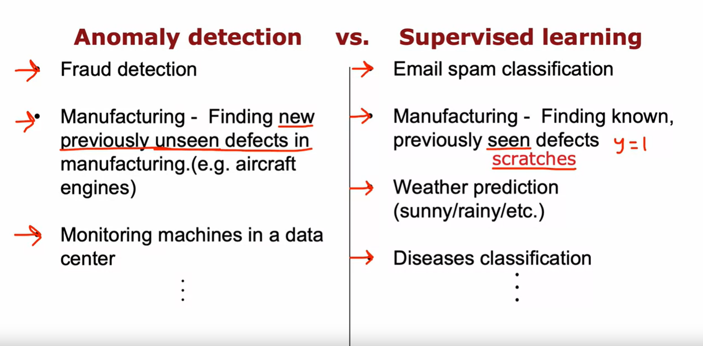

#### Fraud detection vs Email spam classification

We have already seen fraud detection being one use case of Anomaly Detection. Although Supervised Learning is used to find previously observed forms of fraud and we've seen email spam classification typically being address using Supervised Learning. 

#### Manufacturing

You've also seen the example of manufacturing where you may want to find new previously unseen defects such as if there are brand new ways for an aircraft engine to fail in the future that you still want to detect even if you don't have any positive example like that in your training set. 

It turns out that the manufacturing Supervised Learning is also used to find defects. The more for finding known and previously seen defects. For example, if you are a smartphone maker, you're making cell phones, and you know that occasionally your machine for making the case of the smartphone will accidentally scratch the cover. So, scratches are a common defect on smartphones and so you can get enough training examples of scratched smartphones coresponding to label $y=1$ and just train the system to decide if a new smartphone that you just manufactured has any scratches in it. 

And the difference is if you just see scratched smartphones over and over and you want to check if your phones are scratched, then Supervised Learning works well whereas if you suspect that they're going to be brand new ways for something to go wrong in the future, then Anomaly Detection will work well

#### Monitoring machines vs Weather prediction / Diseases classification

Some other examples you've heard me talk about monitoring machines in the data center, especially the machine's been hacked. It can behave differently in a brand new way unlike any previous way in his behavior. So, that would feel more like an Anomaly Detection application. 

In fact, one theme is that many security related applications because hackers are often finding brand new ways to hack into systems. Many security related applications will use Anomaly Detection. 

Whereas returning to Supervised Learning, if you want to learn to predict the weather, well, there's only a handful types of weather that you typically see. Is it sunny, rainy, is it going to snow? And so because you see the same output labels over and over, weather prediction would tend to be a Supervised Learning task. 

Or if you want to use the symptoms of the patient to see if the patient has a specific disease that you've seen before. 

Then that would also tend to be a Supervised Learning application. 

### Summary

So, I hope that gives you a framework for deciding when you have a small set of positive examples as well as maybe a large set of negative examples whether to use Anomaly Detection or Supervised Learning. 

Anomaly detection tries to find brand new positive examples that may be unlike anything you've seen before, while Supervised Learning looks at your positive examples and tries to decide if a future example is similar to the positive examples that you've already seen

Now, it turns out that when building an Anomaly Detection algorithm, the choice of features is very important and when building Anomaly Detection systems I often spend a bit of time trying to tune the features I use for the system

In the next video, let me share some practical tips on how to tune the features you feed to Anomaly Detection algorithm

## Choosing what features to use

When building an Anomaly Detection algorithm, I found that choosing a good choice of features turns out to be really important. 

In Supervised Learning, if you don't have the features quite right, or if you have a few extra features that are not relevant to the problem, that often turns out to be okay because the algorithm has to supervise signal, that is enough labels $y$ for the algorithm to figure out what features ignore or how to re scale a feature and to take the best advantage of the features you do give it. 

But for Anomaly Detection which runs or learns just from unlabeled data, is harder for the algorithm to figure out what features to ignore. So, I found that carefully choosing the features, is even more important for Anomaly Detection, than for Supervised Learning approaches. 

Let's take a look at this video as some practical tips for how to tune the features for Anomaly Detection to try to get you the best possible performance

### Use gaussian features to help the algorithm

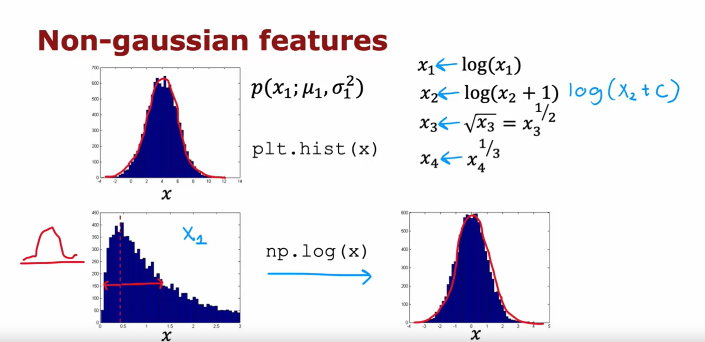

One step that can help your Anomaly Detection algorithm, is to try to make sure the features you give it are more or less Gaussian. And if your features are not Gaussian, sometimes you can change it to make it a little bit more Gaussian. Let me show you what I mean. 

If you have a feature $x$, I will often plot a histogram of the feature which you can do using the python command 

```python
plt.hist(x)
```

You will see this in the practice lab as well in order to look at the histogram of the data. This distribution here (the one on top) looks pretty Gaussian so this would be a good candidate feature if you think this is a feature that helps distinguish between anomalies and normal examples

But quite often when you plot a histogram of your features, you may find that the feature has a distribution like this (the one on left bottom). This does not at all look like that symmetric bell shaped curve. 

When that is the case, I would consider if you can take this feature $x$ and transform it in order to make a more Gaussian. 

For example, maybe if you were to compute the $log(x)$ and plot a histogram of $log(x)$, it looks like this (the one on right bottom) and this looks much more Gaussian. 

And so if this feature was feature $x_1$, then instead of using the original feature $x_1$ which looks like this on the left, you might instead replace that feature with $log(x_1)$ to get this distribution over here because when $x_1$ is made more Gaussian, when Anomaly Detection models $p(x_1)$ using a Gaussian distribution like that, is more likely to be a good fit to the data

Other than the log function, other things you might do is, given a different feature $x_2$, you may replace it with $log(x_2 + 1)$. This would be a different way of transforming $x_2$

And more generally, $log(x_2 + C)$, would be one example of a formula you can use to change $x_2$ to try to make it more Gaussian. 

Alternatively, for a different feature $x_3$, you could apply the square root by raising $x$ to the power of 1/2. This transformation adjusts the feature's scale and behavior

Similarly, for another feature, say $x_4$, you might raise it to the power of 
1/3 as an example of another transformation. These adjustments allow you to explore different non-linear relationships between variables.

So when I'm building an Anomaly Detection system, I'll sometimes take a look at my features, and if I see any highly non Gaussian by plotting histogram, I might choose transformations like these or others in order to try to make it more Gaussian. 

It turns out a larger value of *c* will end up transforming this distribution less but in practice I just try a bunch of different values of *c*, and then try to take a look to pick one that looks better in terms of making the distribution more Gaussian

### Jupyter notebook

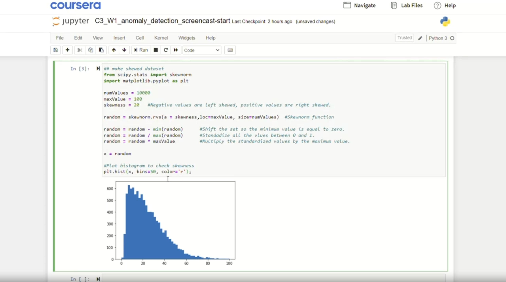

Now, let me illustrate how I actually do this and that you put a notebook. So, this is what the process of exploring different transformations in the features might look like.

When you have a feature $x$, you can plot a histogram of it as the blue one shown above. It actually looks like there's a pretty cause histogram. Let me increase the number of bins in my histogram to 50. 

So, bins equals 50. That's what histogram bins. And by the way, if you want to change the color, you can also do so as follows. 

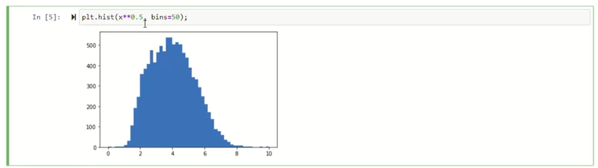

And if you want to try a different transformation, you can try for example to plot square root of $x$, so $x$ to the power of 0.5 with again 50 histogram bins, in which case it might look like above. 

And this actually looks somewhat more Gaussian but not perfectly and let's try a different parameter. So, let me try to the power of 0.25. Maybe I just a little bit too far. It's the 0.4 that looks pretty Gaussian. So, one thing you could do is replace $x$ with $x^{0.4}$. And so you would set $x$ to be equal to X to the power of 0.4. And just use the value of X in your training process instead. 

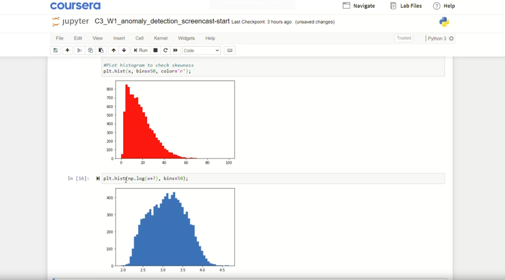

Or let me show you another transformation. Here, I'm going to try taking the $log(x)$. So, $log(x)$ spotted with 50 bins, I'm going to use the numpy log function as follows. And it turns out you get an error, because it turns out that x in this example has some values that are equal to zero, and log of zero is negative infinity is not defined. So, a common trick is to add just a very tiny number there like adding 0.0001, so x + 0.001 becomes non negative and so you get the histogram that looks like this. 

But if you want the distribution to look more Gaussian, you can also play around with this term to try to see if there's a value of that causes your data to look more symmetric and maybe look more Gaussian as follows. 

And just as I'm doing right now in real time, you can see that, you can very quickly change these parameters and plot the histogram in order to try to take a look and try to get something a bit more Gaussian than was the original data. 

If you read the machine learning literature, there are some ways to automatically measure how close these distributions are to Gaussian but I found it in practice, it doesn't make a big difference, if you just try a few values and pick something that looks right to you, that will work well for all practical purposes. So, by trying things out in Jupiter notebook, you can try to pick a transformation that makes your data more Gaussian. 

> [!WARNING]
> And just as a reminder, whatever transformation you apply to the training set, please remember to apply the same transformation to your cross validation and test set data as well

### Error analysis for anomaly detection

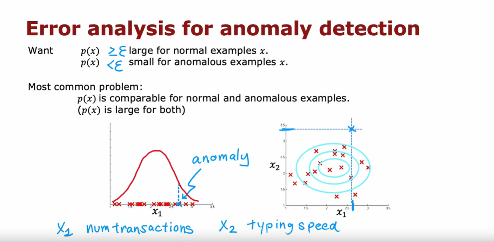

Other than making sure that your data is approximately Gaussian, after you've trained your Anomaly Detection algorithm, if it doesn't work that well on your cross validation set, you can also carry out an error analysis process for Anomaly Detection

In other words, you can try to look at where the algorithm is not yet doing well, where is making errors, and then use that to try to come up with improvements

So, as a reminder, what we want is for $p(x)$ to be large for normal examples $x$, so greater than or equal to epsilon $\epsilon$ and $p(x)$ to be small or less than epsilon $\epsilon$ for the anomalous examples $x$. 

When you've learned the model $p(x)$ from your unlabeled data, the most common problem that you may run into is that, $p(x)$ is comparable in value say is, large for both normal and for anomalous examples. 

As a concrete example, if this is your data set (look at the left graph), you might fit that Gaussian into it and if you have an example in your cross validation set or test set, that is over here (blue cross marked as anomaly with an arrow), that is anomalous, then this has a pretty high probability and in fact, it looks quite similar to the other examples in your training set. 

And so, even though this is an anomaly, $p(x)$ is actually pretty large and so the algorithm will fail to flag this particular example as an anomaly. 

In that case, what I would normally do is try to look at that example and try to figure out what is it that made me think is an anomaly, even if this feature $x_1$ took on values similar to other training examples. 

And if I can identify some new feature say $x_2$, that helps distinguish this example from the normal examples, then adding that feature can help improve the performance of the algorithm. 

Here's a picture showing what I mean (right graph). If I can come up with a new feature $x_2$, say, I'm trying to detect fraudulent behavior, and if $x_1$ is the number of transactions they make, maybe this user looks like they're making some of the transactions as everyone else but if I discover that this user has some insanely fast typing speed, and if I were to add a new feature $x_2$, that is the typing speed of this user and if it turns out that when I plot this data using the old feature $x_1$ and this new feature $x_2$, causes $x_2$ to stand out over here. 

Then it becomes much easier for the Anomaly Detection algorithm to recognize an $x_2$ is an anomalous user because when you have this new feature $x_2$, the learning algorithm may fit a Gaussian distribution that assigns high probability to points in this region, a bit lower in this region, and a bit lower in this region and so this example, because of the very anomalous value of $x_2$, becomes easier to detect as an anomaly. 

So, just to summarize: The development process will often go through is: 

- to train the model
- and then to see what anomalies in the cross validation set the algorithm is failing to detect
- And then to look at those examples to see if that can inspire the creation of new features that would allow the algorithm to spot that example takes on unusually large or unusually small values on the new features, so that you can now successfully flag those examples as anomalies

### Monitoring computers in a data center

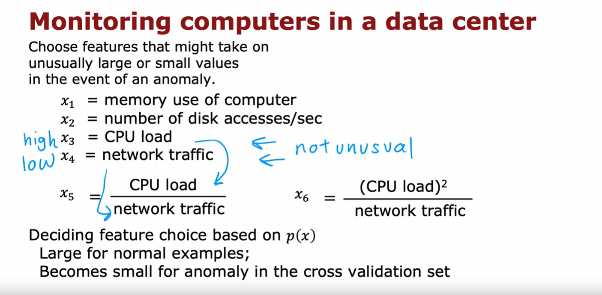

Just as one more example, let's say you're building an Anomaly Detection system to monitor computers in the data center. To try to figure out if a computer may be behaving strangely and deserves a closer look, maybe because of a hardware failure, or because it's been hacked into or something. 

So, what you'd like to do is, to choose features that might take on unusually large or small values in the event of an anomaly. You might start off with features like $x_1$ is the memory use, $x_2$ is the number of disk accesses per second, then $x_3$ is the CPU load, and $x_4$ the volume of network traffic. 

### Creating new features by combining old features

And if you train the algorithm, you may find that it detects some anomalies but fails to detect some other anomalies. In that case, it's not unusual to create new features by combining old features. 

So, for example, if you find that there's a computer that is behaving very strangely, but neither is CPU load nor network traffic is that unusual but what is unusual is, it has a really high CPU load, while having a very low network traffic volume. 

If you're running the data center that streams videos, then computers may have high CPU load and high network traffic or low CPU load and no network traffic but what's unusual about this one machine is this is a very high CPU load, despite a very low traffic volume. 

In that case, you might create a new feature $x_5$, which is a ratio of CPU load to network traffic. And this new feature with hope, the Anomaly Detection algorithm flag future examples like the specific machine you may be seeing as anomalous or you can also consider other features like $x_6$ the square of the CPU load divided by the network traffic volume. 

And you can play around with different choices of these features in order to try to get it so that $p(x)$ is still large for the normal examples but it becomes small in the anomalies in your cross validation set. 

### Summary

So, that's it. Thanks for sticking with me to the end of this week. I hope you enjoy hearing about both clustering algorithms and Anomaly Detection algorithms and that you also enjoy playing with these ideas in the practice labs.

Next week, we'll go on to talk about recommender systems: When you go to a website and recommends products, or movies, or other things to you, how does that algorithm actually work? This is one of the most commercially important algorithms in machine learning that gets talked about surprisingly little but next week we'll take a look at how these algorithms work so that you understand the next time you go to the website and then recommend something to you, maybe how that came about, as well as you'll be able to build other algorithms like that for yourself as well. 

So, have fun with the labs and they look forward to seeing you next week.

## [Practice quiz: Anomaly detection](../06-practice-quiz-anomaly-detection/)

## [Practice lab 2: Anomaly detection](../07-practice-lab-2/)
