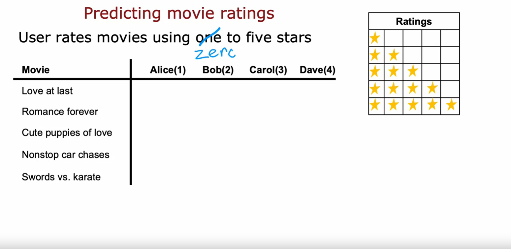
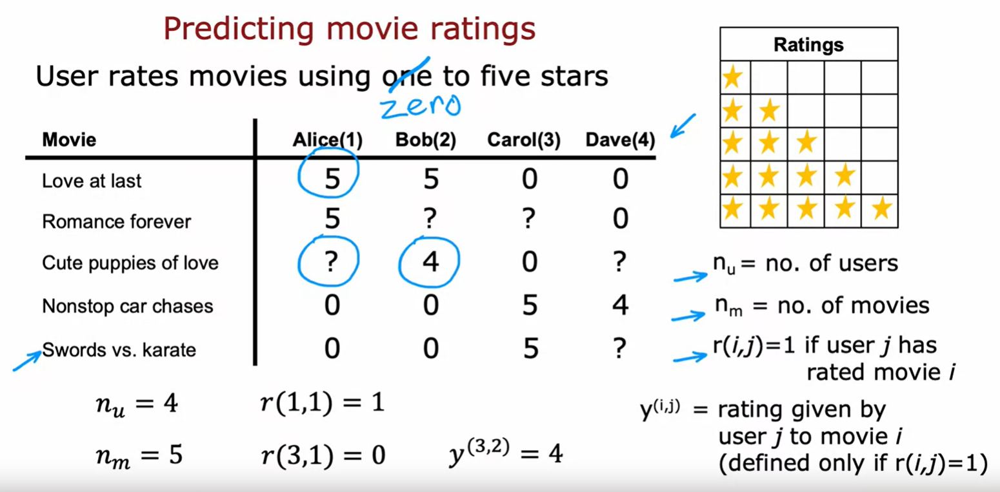
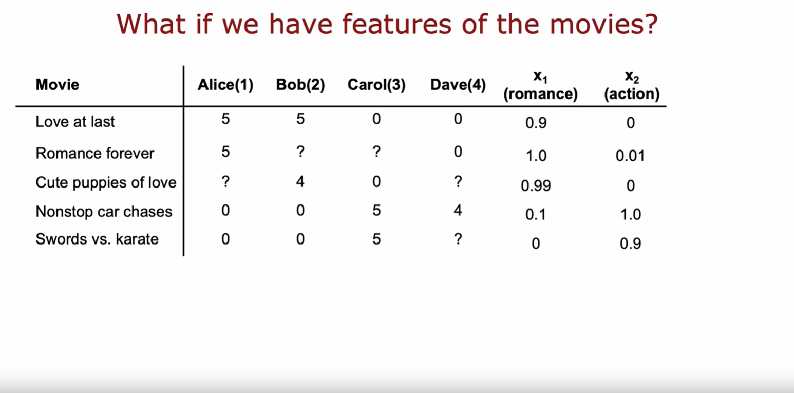
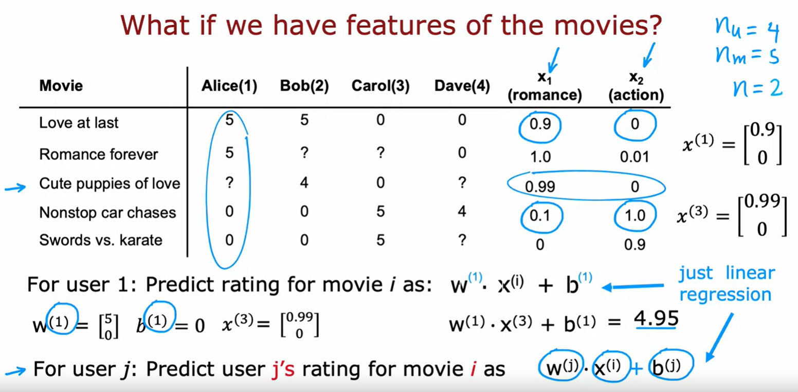
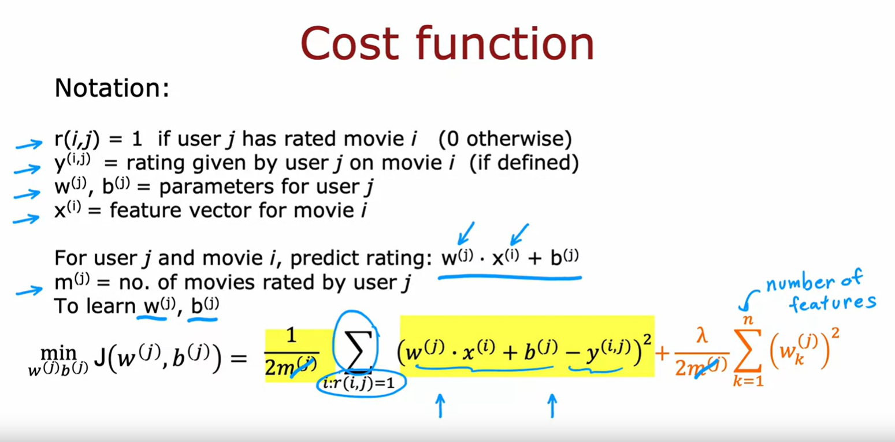
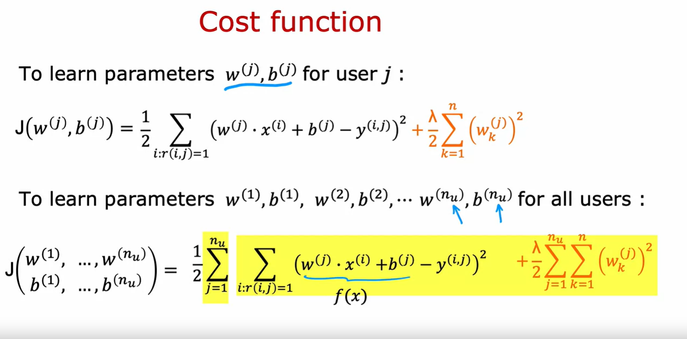

## Making recommendations

Welcome to this second to last week of the machine learning specialization. I'm really happy that together, almost all the way to the finish line. What we'll do this week is discuss recommender systems. 

This is one of the topics that has received quite a bit of attention in academia but the commercial impact and the actual number of practical use cases of recommended systems seems to me to be even vastly greater than the amount of attention it has received in academia. 

Every time you go to an online shopping website like Amazon or a movie streaming sites like Netflix or go to one of the apps or sites that do food delivery, many of these sites will recommend things to you that they think you may want to buy or movies they think you may want to watch or restaurants that they think you may want to try out. And for many companies, a large fraction of sales is driven by their recommended systems. 

So, today for many companies, the economics or the value driven by recommended systems is very large and so what we're doing this week is take a look at how they work. So, with that let's dive in and take a look at what is a recommender system

I'm going to use as a running example, the application of predicting movie ratings. So, say you run a large movie streaming website and your users have rated movies using one to five stars and so in a typical recommended system you have a set of users, here we have four users Alice, Bob Carol and Dave which have numbered users 1,2,3,4 as well as a set of movies *Love at last*, *Romance forever*, *Cute puppies of love* and then *Nonstop car chases* and *Sword versus karate* and what the users have done is rated these movies one to five stars or in fact to make some of these examples a little bit easier I'm not going to let them rate the movies from zero to five stars.

### Alice rating

So, say Alice has rated *Love at last* five stars, Romance forever five stars, maybe she has not yet watched *Cute puppies of love* so you don't have a rating for that and I'm going to denote that via a question mark and she thinks *Nonstop car chases* and *Sword versus karate* deserve zero stars

### Bob rating

Bob race at five stars, has not watched that, so you don't have a rating race at, four stars, 0 and 0 

### Carol rating

Carol, on the other hand, thinks that deserve zero stars, has not watched that, zero stars and she loves nonstop car chases and swords versus karate, so 5 to both of them

### Dave rating

Dave rates the movies as follows: 0, 0, ?, 4, ?

## Notation

In the typical recommended system, you have some number of users as well as some number of items. In this case, the items are movies that you want to recommend to the users and even though I'm using movies in this example, the same logic or the same thing works for recommending anything from products or websites to my self, to restaurants, to even which media articles, the social media articles to show to the user that may be more interesting for them. 

### 1. Notation: $n_u$ and $n_m$

The notation I'm going to use is I'm going to use $n_u$ to denote the number of users. So, in this example $n_u = 4$ because you have four users and $n_m$ to denote the number of movies or really the number of items, so in this example $n_m = 5$ because we have five movies. 

### 2. Notation: $r(i,j)$

I'm going to set $r(i,j)=1$, if user $j$ has rated movie $i$. 

So, for example, user 1, that is Alice, has rated movie one but has not rated movie three and so $r(1,1)=1$, because she has rated movie one, but $r(3,1)=0$ because she has not rated movie number three. 

### 3. Notation: $y^{(i,j)}$

Then, finally I'm going to use $y^{(i,j)}$ to denote the rating given by user $j$ to movie $i$. So, for example, this rating here from user Bob would be that movie three ($i=3$) was rated by user 2 ($j=2$) to be equal to four, this is $y^{(3,2)} = 4$

> [!WARNING]
> Notice that not every user rates every movie and it's important for the system to know which users have rated which movies. That's why we're going to define $r(i,j)=1$ if user $j$ has rated movie $i$ and $r(i,j)=0$ if user $j$ has NOT rated movie $i$

So, with this framework for recommended systems, one possible way to approach the problem is to look at the movies that users have not rated and to try to predict how users would rate those movies because then we can try to recommend to users things that they are more likely to rate as five stars.

And in the next video we'll start to develop an algorithm for doing exactly that but making one very special assumption which is we're going to assume temporarily that we have access to features or extra information about the movies such as which movies are romance movies, which movies are action movies and using that will start to develop an algorithm but later this week will actually come back and ask what if we don't have these features, how can you still get the algorithm to work then? 

But let's go on to the next video to start building up this algorithm.

## Using per-item features

So, let's take a look at how we can develop a recommender system if we had features of each item, or features of each movie. 

So, here's the same data set that we had previously with the four users having rated some but not all of the five movies. What if we additionally have features of the movies? So, here I've added two features $x_1$ and $x_2$, that tell us how much each of these is a romance movie and how much each of these is an action movie. 

So, for example, *Love at Last* is a very romantic movie, so this feature takes on 0.9, but it's not at all an action movie. So, this feature takes on 0. But it turns out *Nonstop Car chases* has just a little bit of romance in it, so it's 0.1, but it has a ton of action so that feature takes on the value of 1.0

So, you recall that I had used the notation $n_u$ to denote the number of users, which is $n_u=4$ and $n_m$ to denote the number of movies which is $n_m = 5$

I'm going to also introduce $n$ to denote the number of features we have here. And so $n=2$, because we have two features $x_1$ and $x_2$ for each movie.

With these features we have for example that the features for movie one, that is the movie *Love at Last*, would be 0.9 and 0 

$$
x^{(1)} =
\begin{bmatrix}
0.9 \\
0
\end{bmatrix}
$$

and the features for the third movie *Cute puppies of Love* would be 0.99 and 0. 

$$
x^{(3)} =
\begin{bmatrix}
0.99 \\
0
\end{bmatrix}
$$

More generally, this would be expressed as:

$$
x^{(i)} =
\begin{bmatrix}
x_1 \\
x_2 \\
\vdots \\
x_n
\end{bmatrix}
$$

where 
- $i$ denotes the movie $i$
- $n$ denotes the number of features per item (in this case, the number of features per movie)

### Predictions for user 1: Alice

And let's start by taking a look at how we might make predictions for Alice's movie ratings. 

So, for user one, that is Alice, let's say we predict the rating for movie $i$ as: 

$$ w \cdot x^{(i)} + b $$

So, this is just a lot like Linear Regression.

For example, if we end up choosing the parameter:

$$
w^{(1)} =
\begin{bmatrix}
5 \\
0
\end{bmatrix}
$$

and say 

$$ b^{(1)} = 0 $$

then the prediction for movie three (*Cute Puppies of Love*) where the features are 0.99 and 0, which is just copied from here, first feature 0.99, second feature 0. 

$$
x^{(3)} =
\begin{bmatrix}
0.99 \\
0
\end{bmatrix}
$$

Our prediction would be 

$$ w^{(1)} \cdot x^{(3)} + b^{(1)} = $$

$$ 
\begin{bmatrix}
5 \\
0
\end{bmatrix} \cdot
\begin{bmatrix}
0.99 \\
0
\end{bmatrix} + 0 = $$

$$ 5 * 0.99 + 0 * 0 + 0 = $$

$$ 4.95 $$

And this rating seems pretty plausible: It looks like Alice has given high ratings to *Love at Last* and *Romance Forever*, to two highly romantic movies but given low ratings to the action movies, *Nonstop Car Chases* and *Swords vs Karate*. So, if we look at *Cute Puppies of Love*, well predicting that she might rate that 4.95 seems quite plausible. 

And so these parameters $w$ and $b$ for Alice seems like a reasonable model for predicting her movie ratings. 

### Notation

Just add a little the notation because we have not just one user but multiple users, or really $n_u=4$ users. 

I'm going to add a superscript 1 here to denote that this is the parameter w(1) for user 1 and add a superscript 1 there as well. And similarly here and here as well, so that we would actually have different parameters for each of the 4 users on data set. 

And more generally in this model for user $j$, not just for user 1 like now, we can predict user $j$'s rating for movie $i$ as: 

$$ w^{(j)} \cdot x^{(i)} + b^{(j)} $$ 

So, here the parameters $w^{(j)}$ and $b^{(j)}$ are the parameters used to predict user $j$'s rating for movie $i$ which is a function of $x^{(i)}$, which is the feature of movie $i$. And this is a lot like Linear Regression, except that we're fitting a different Linear Regression model for each of the 4 users in the dataset.

## How to formulate the Cost function

So, let's take a look at how we can formulate the cost function for this algorithm. 

- As a reminder, our notation is that $r(i,j)=1$ if user $j$ has rated movie $i$ or 0 otherwise. 

- $y^{(i,j)}$ is the rating given by user $j$ on movie $i$
- On the previous side we defined $w^{(j)}$, $b^{(j)}$ as the parameters for user $j$. 
- $x^{(i)}$ is the feature vector for movie $i$. 

So, the model we have is for user $j$ and movie $i$ predict the rating to be 

$$ w^{(j)} \cdot x^{(i)} + b^{(j)} $$ 

I'm going to introduce just one new piece of notation, which is:

- I'm going to use $m^{(j)}$ to denote the number of movies rated by user $j$. So, if the user has rated 4 movies, then $m^{(j)} = 4$. 
And if the user has rated 3 movies then $m^{(j)} = 3$.

So, what we'd like to do is to learn the parameters $w^{(j)}$ and $b^{(j)}$, given the data that we have. That is given the ratings a user has given of a set of movies. 

So, the algorithm we're going to use is very similar to Linear Regression. 

Let's write out the cost function for learning the parameters $w^{(j)}$ and $b^{(j)}$ for a given user $j$. And let's just focus on one user: on user $j$ for now. 

I'm going to use the mean squared error criteria so the cost will be as follows: 

We have the prediction, which is w(j).X(i)+b(j) minus the actual rating that the user had given so minus y(i,j) squared and we're trying to choose parameters w and b to minimize the squared error between the predicted rating and the actual rating that was observed. 

But the user hasn't rated all the movies, so if we're going to sum over this, we're going to sum only over the values of i where r(i,j)=1. 

So we're going to sum only over the movies i that user j has actually rated. So that's what this denotes, sum of all values of i where r(i,j)=1 meaning that user j has rated that movie i. 

And then finally we can take the usual normalization 1 over 2 $m^{(j)}$. And this is very much like the cost function we have for Linear Regression with $m^{(j)}$ training examples where you're summing over the $m^{(j)}$ movies for which you have a rating taking a squared error and the normalizing by this 1 over 2 $m^{(j)}$

And this is going to be a cost function J of w(j), b(j) and if we minimize this as a function of w(j) and b(j), then you should come up with a pretty good choice of parameters w(j) and b(j) for making predictions for user j's ratings.

$$ \text{min}_{w^{(j)}, b^{(j)}} J(w^{(j)}, b^{(j)}) = \frac{1}{2m^{(j)}} \sum_{i: r(i, j)=1}{[ w^{(j)} \cdot x^{(i)} + b^{(j)} - y^{(i, j)} ]^2} $$

#### Adding the regularization term to this cost function

Let me have just one more term to this cost function, which is the regularization term to prevent overfitting:

$$ \frac{\lambda}{2m^{(j)}} \sum_{k=1}^{n} [w_k^{(j)}]^2 $$

and so here's our usual regularization parameter lambda $\lambda$ divided by 2 $m^{(j)}$ and then times as sum of the squared values of the parameters $w$ 

And so $n$ is the number of features. Also, $x^{(i)}$ and that's the same as a number of numbers in w(j). 

If you were to minimize this cost function $J$ as a function of w and b, you should get a pretty good set of parameters for predicting user j's ratings for other movies. 

$$ \text{min}_{w^{(j)}, b^{(j)}} J(w^{(j)}, b^{(j)}) = \frac{1}{2m^{(j)}} \sum_{i: r(i, j)=1}{[ w^{(j)} \cdot x^{(i)} + b^{(j)} - y^{(i, j)} ]^2} + \frac{\lambda}{2m^{(j)}} \sum_{k=1}^{n} [w_k^{(j)}]^2 $$

### Eliminating $m^{(j)}$ from the cost function

Now, before moving on, it turns out that for recommender systems it would be convenient to actually eliminate this division by $m^{(j)}$ term.

$m^{(j)}$ is just a constant in this expression and so, even if you take it out, you should end up with the same value of w and b. 

$$ \text{min}_{w^{(j)}, b^{(j)}} J(w^{(j)}, b^{(j)}) = \frac{1}{2} \sum_{i: r(i, j)=1}{[ w^{(j)} \cdot x^{(i)} + b^{(j)} - y^{(i, j)} ]^2} + \frac{\lambda}{2} \sum_{k=1}^{n} [w_k^{(j)}]^2 $$

Now let me take this cost function down here to the bottom and copy it to the next slide.

## Cost function

### Cost function for all the $n_u$ users

So, we have that to learn the parameters w(j), b(j) for user j we would minimize this cost function as a function of w(j) and b(j) but instead of focusing on a single user, let's look at how we learn the parameters for all of the users. 

To learn the parameters $w^{(1)}, b^{(1)}, w^{(2)}, b^{(2)}, ..., w^{(n_u)}, b^{(n_u)}$ we would take this cost function on top and sum it over all the $n_u$ users. 

$$ J(w^{(1)}, ..., w^{(n_u)}, b^{(1)}, ..., b^{(n_u)}) = \frac{1}{2} \sum_{j=1}^{n_u} \sum_{i: r(i, j)=1}{[ w^{(j)} \cdot x^{(i)} + b^{(j)} - y^{(i, j)} ]^2} + \frac{\lambda}{2} \sum_{j=1}^{n_u} \sum_{k=1}^{n} [w_k^{(j)}]^2 $$

So, we would have the sum from $j=1$ to $n_u$ of the same cost function that we had written up above and this becomes the cost function for learning all the parameters for all of the users. 

And if we use gradient descent or any other optimization algorithm to minimize this as a function of $w^{(1)}, b^{(1)}$ all the way through $w^{(n_u)}, b^{(n_u)}$, then you have a pretty good set of parameters for predicting movie ratings for all the users. 

And you may notice that this algorithm is a lot like Linear Regression, where 

$$ w^{(j)} \cdot x^{(i)} + b^{(j)} $$

plays a role similar to the output $f(x)$ of Linear Regression. Only now we're training a different Linear Regression model for each of the $n_u$ users

### Summary

So, that's how you can learn parameters and predict movie ratings, **if you had access to these features $x_1$ and $x_2$** that tell you how much is each of the movies, a romance movie and how much is each of the movies an action movie.

But, where do these features come from? And what if you don't have access to such features that give you enough detail about the movies with which to make these predictions? 

In the next video, we'll look at the modification of this algorithm. They'll let you make predictions, let you make recommendations even if you don't have, in advance, features that describe the items or the movies in sufficient detail to run the algorithm that we just saw. 

Let's go on and take a look at that in the next video

## Collaborative filtering algorithm 

## Binary labels: favs, likes and clicks