## Making recommendations

Welcome to this second to last week of the machine learning specialization. I'm really happy that together, almost all the way to the finish line. What we'll do this week is discuss recommender systems. 

This is one of the topics that has received quite a bit of attention in academia but the commercial impact and the actual number of practical use cases of recommended systems seems to me to be even vastly greater than the amount of attention it has received in academia. 

Every time you go to an online shopping website like Amazon or a movie streaming sites like Netflix or go to one of the apps or sites that do food delivery, many of these sites will recommend things to you that they think you may want to buy or movies they think you may want to watch or restaurants that they think you may want to try out. And for many companies, a large fraction of sales is driven by their recommended systems. 

So, today for many companies, the economics or the value driven by recommended systems is very large and so what we're doing this week is take a look at how they work so, with that let's dive in and take a look at what is a recommender system

I'm going to use as a running example, the application of predicting movie ratings so, say you run a large movie streaming website and your users have rated movies using one to five stars and so in a typical recommended system you have a set of users, here we have four users Alice, Bob Carol and Dave which have numbered users 1,2,3,4 as well as a set of movies *Love at last*, *Romance forever*, *Cute puppies of love* and then *Nonstop car chases* and *Sword versus karate* and what the users have done is rated these movies one to five stars or in fact to make some of these examples a little bit easier I'm not going to let them rate the movies from zero to five stars.

### Alice rating

So, say Alice has rated *Love at last* five stars, Romance forever five stars, maybe she has not yet watched *Cute puppies of love* so you don't have a rating for that and I'm going to denote that via a question mark and she thinks *Nonstop car chases* and *Sword versus karate* deserve zero stars

### Bob rating

Bob race at five stars, has not watched that, so you don't have a rating race at, four stars, 0 and 0 

### Carol rating

Carol, on the other hand, thinks that deserve zero stars, has not watched that, zero stars and she loves nonstop car chases and swords versus karate, so 5 to both of them

### Dave rating

Dave rates the movies as follows: 0, 0, ?, 4, ?

## Notation

In the typical recommended system, you have some number of users as well as some number of items. In this case, the items are movies that you want to recommend to the users and even though I'm using movies in this example, the same logic or the same thing works for recommending anything from products or websites to my self, to restaurants, to even which media articles, the social media articles to show to the user that may be more interesting for them. 

### 1. Notation: $n_u$ and $n_m$

The notation I'm going to use is I'm going to use $n_u$ to denote the number of users so, in this example $n_u = 4$ because you have four users and $n_m$ to denote the number of movies or really the number of items, so in this example $n_m = 5$ because we have five movies. 

### 2. Notation: $r(i,j)$

I'm going to set $r(i,j)=1$, if user $j$ has rated movie $i$. 

So, for example, user 1, that is Alice, has rated movie one but has not rated movie three and so $r(1,1)=1$, because she has rated movie one, but $r(3,1)=0$ because she has not rated movie number three. 

### 3. Notation: $y^{(i,j)}$

Then, finally I'm going to use $y^{(i,j)}$ to denote the rating given by user $j$ to movie $i$ so, for example, this rating here from user Bob would be that movie three ($i=3$) was rated by user 2 ($j=2$) to be equal to four, this is $y^{(3,2)} = 4$

> [!WARNING]
> Notice that not every user rates every movie and it's important for the system to know which users have rated which movies. That's why we're going to define $r(i,j)=1$ if user $j$ has rated movie $i$ and $r(i,j)=0$ if user $j$ has NOT rated movie $i$

So, with this framework for recommended systems, one possible way to approach the problem is to look at the movies that users have not rated and to try to predict how users would rate those movies because then we can try to recommend to users things that they are more likely to rate as five stars.

And in the next video we'll start to develop an algorithm for doing exactly that but making one very special assumption which is we're going to assume temporarily that we have access to features or extra information about the movies such as which movies are romance movies, which movies are action movies and using that will start to develop an algorithm but later this week will actually come back and ask what if we don't have these features, how can you still get the algorithm to work then? 

But let's go on to the next video to start building up this algorithm.

## Using per-item features

So, let's take a look at how we can develop a recommender system if we had features of each item, or features of each movie. 

So, here's the same data set that we had previously with the four users having rated some but not all of the five movies. What if we additionally have features of the movies? So, here I've added two features $x_1$ and $x_2$, that tell us how much each of these is a romance movie and how much each of these is an action movie. 

So, for example, *Love at Last* is a very romantic movie, so this feature takes on 0.9, but it's not at all an action movie so, this feature takes on 0 but it turns out *Nonstop Car chases* has just a little bit of romance in it, so it's 0.1, but it has a ton of action so that feature takes on the value of 1.0

So, you recall that I had used the notation $n_u$ to denote the number of users, which is $n_u=4$ and $n_m$ to denote the number of movies which is $n_m = 5$

I'm going to also introduce $n$ to denote the number of features we have here. And so $n=2$, because we have two features $x_1$ and $x_2$ for each movie.

With these features we have for example that the features for movie one, that is the movie *Love at Last*, would be 0.9 and 0 

$$
x^{(1)} =
\begin{bmatrix}
0.9 \\
0
\end{bmatrix}
$$

and the features for the third movie *Cute puppies of Love* would be 0.99 and 0. 

$$
x^{(3)} =
\begin{bmatrix}
0.99 \\
0
\end{bmatrix}
$$

More generally, this would be expressed as:

$$
x^{(i)} =
\begin{bmatrix}
x_1 \\
x_2 \\
\vdots \\
x_n
\end{bmatrix}
$$

where 
- $i$ denotes the movie $i$
- $n$ denotes the number of features per item (in this case, the number of features per movie)

### Predictions for user 1: Alice

And let's start by taking a look at how we might make predictions for Alice's movie ratings. 

So, for user one, that is Alice, let's say we predict the rating for movie $i$ as: 

$$ w \cdot x^{(i)} + b $$

So, this is just a lot like Linear Regression.

For example, if we end up choosing the parameter:

$$
w^{(1)} =
\begin{bmatrix}
5 \\
0
\end{bmatrix}
$$

and say 

$$ b^{(1)} = 0 $$

then the prediction for movie three (*Cute Puppies of Love*) where the features are 0.99 and 0, which is just copied from here, first feature 0.99, second feature 0. 

$$
x^{(3)} =
\begin{bmatrix}
0.99 \\
0
\end{bmatrix}
$$

Our prediction would be 

$$ w^{(1)} \cdot x^{(3)} + b^{(1)} = $$

$$ 
\begin{bmatrix}
5 \\
0
\end{bmatrix} \cdot
\begin{bmatrix}
0.99 \\
0
\end{bmatrix} + 0 = $$

$$ 5 * 0.99 + 0 * 0 + 0 = $$

$$ 4.95 $$

And this rating seems pretty plausible: It looks like Alice has given high ratings to *Love at Last* and *Romance Forever*, to two highly romantic movies but given low ratings to the action movies, *Nonstop Car Chases* and *Swords vs Karate* so, if we look at *Cute Puppies of Love*, well predicting that she might rate that 4.95 seems quite plausible. 

And so these parameters $w$ and $b$ for Alice seems like a reasonable model for predicting her movie ratings. 

### Notation

Just add a little the notation because we have not just one user but multiple users, or really $n_u=4$ users. 

I'm going to add a superscript 1 here to denote that this is the parameter w(1) for user 1 and add a superscript 1 there as well. And similarly here and here as well, so that we would actually have different parameters for each of the 4 users on data set. 

And more generally in this model for user $j$, not just for user 1 like now, we can predict user $j$'s rating for movie $i$ as: 

$$ w^{(j)} \cdot x^{(i)} + b^{(j)} $$ 

So, here the parameters $w^{(j)}$ and $b^{(j)}$ are the parameters used to predict user $j$'s rating for movie $i$ which is a function of $x^{(i)}$, which is the feature of movie $i$. And this is a lot like Linear Regression, except that we're fitting a different Linear Regression model for each of the 4 users in the dataset.

## How to formulate the Cost function

So, let's take a look at how we can formulate the cost function for this algorithm. 

- As a reminder, our notation is that $r(i,j)=1$ if user $j$ has rated movie $i$ or 0 otherwise. 

- $y^{(i,j)}$ is the rating given by user $j$ on movie $i$
- On the previous side we defined $w^{(j)}$, $b^{(j)}$ as the parameters for user $j$. 
- $x^{(i)}$ is the feature vector for movie $i$. 

So, the model we have is for user $j$ and movie $i$ predict the rating to be 

$$ w^{(j)} \cdot x^{(i)} + b^{(j)} $$ 

I'm going to introduce just one new piece of notation, which is:

- I'm going to use $m^{(j)}$ to denote the number of movies rated by user $j$ so, if the user has rated 4 movies, then $m^{(j)} = 4$. 
And if the user has rated 3 movies then $m^{(j)} = 3$.

So, what we'd like to do is to learn the parameters $w^{(j)}$ and $b^{(j)}$, given the data that we have. That is given the ratings a user has given of a set of movies. 

So, the algorithm we're going to use is very similar to Linear Regression. 

Let's write out the cost function for learning the parameters $w^{(j)}$ and $b^{(j)}$ for a given user $j$. And let's just focus on one user: on user $j$ for now. 

I'm going to use the mean squared error criteria so the cost will be as follows: 

We have the prediction, which is w(j).X(i)+b(j) minus the actual rating that the user had given so minus y(i,j) squared and we're trying to choose parameters w and b to minimize the squared error between the predicted rating and the actual rating that was observed. 

But the user hasn't rated all the movies, so if we're going to sum over this, we're going to sum only over the values of i where r(i,j)=1. 

So we're going to sum only over the movies i that user j has actually rated so that's what this denotes, sum of all values of i where r(i,j)=1 meaning that user j has rated that movie $i$. 

And then finally we can take the usual normalization 1 over 2 $m^{(j)}$. And this is very much like the cost function we have for Linear Regression with $m^{(j)}$ training examples where you're summing over the $m^{(j)}$ movies for which you have a rating taking a squared error and the normalizing by this 1 over 2 $m^{(j)}$

And this is going to be a cost function J of w(j), b(j) and if we minimize this as a function of w(j) and b(j), then you should come up with a pretty good choice of parameters w(j) and b(j) for making predictions for user j's ratings.

$$ \text{min}_{w^{(j)}, b^{(j)}} J(w^{(j)}, b^{(j)}) = \frac{1}{2m^{(j)}} \sum_{i: r(i, j)=1}{[ w^{(j)} \cdot x^{(i)} + b^{(j)} - y^{(i, j)} ]^2} $$

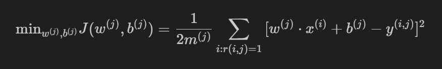

#### Adding the regularization term to this cost function

Let me have just one more term to this cost function, which is the regularization term to prevent overfitting:

$$ \frac{\lambda}{2m^{(j)}} \sum_{k=1}^{n} [w_k^{(j)}]^2 $$

and so here's our usual regularization parameter lambda $\lambda$ divided by 2 $m^{(j)}$ and then times as sum of the squared values of the parameters $w$ 

And so $n$ is the number of features. Also, $x^{(i)}$ and that's the same as a number of numbers in w(j). 

If you were to minimize this cost function $J$ as a function of w and b, you should get a pretty good set of parameters for predicting user j's ratings for other movies. 

$$ \text{min}_{w^{(j)}, b^{(j)}} J(w^{(j)}, b^{(j)}) = \frac{1}{2m^{(j)}} \sum_{i: r(i, j)=1}{[ w^{(j)} \cdot x^{(i)} + b^{(j)} - y^{(i, j)} ]^2} + \frac{\lambda}{2m^{(j)}} \sum_{k=1}^{n} [w_k^{(j)}]^2 $$

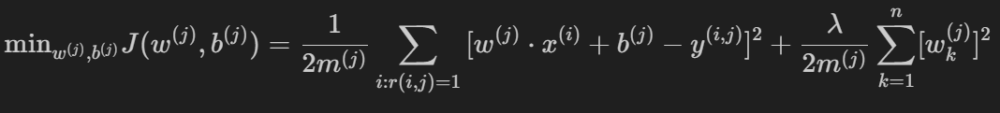

### Eliminating $m^{(j)}$ from the cost function

Now, before moving on, it turns out that for recommender systems it would be convenient to actually eliminate this division by $m^{(j)}$ term.

$m^{(j)}$ is just a constant in this expression and so, even if you take it out, you should end up with the same value of w and b. 

$$ \text{min}_{w^{(j)}, b^{(j)}} J(w^{(j)}, b^{(j)}) = \frac{1}{2} \sum_{i: r(i, j)=1}{[ w^{(j)} \cdot x^{(i)} + b^{(j)} - y^{(i, j)} ]^2} + \frac{\lambda}{2} \sum_{k=1}^{n} [w_k^{(j)}]^2 $$

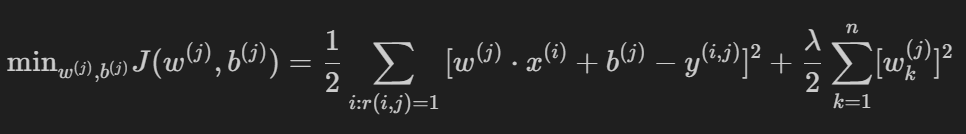

Now, let me take this cost function down here to the bottom and copy it to the next slide.

## Cost function

### Cost function for all the $n_u$ users

So, we have that to learn the parameters w(j), b(j) for user j we would minimize this cost function as a function of w(j) and b(j) but instead of focusing on a single user, let's look at how we learn the parameters for all of the users. 

To learn the parameters $w^{(1)}, b^{(1)}, w^{(2)}, b^{(2)}, ..., w^{(n_u)}, b^{(n_u)}$ we would take this cost function on top and sum it over all the $n_u$ users. 

$$ J(w^{(1)}, ..., w^{(n_u)}, b^{(1)}, ..., b^{(n_u)}) = \frac{1}{2} \sum_{j=1}^{n_u} \sum_{i: r(i, j)=1}{[ w^{(j)} \cdot x^{(i)} + b^{(j)} - y^{(i, j)} ]^2} + \frac{\lambda}{2} \sum_{j=1}^{n_u} \sum_{k=1}^{n} [w_k^{(j)}]^2 $$

So, we would have the sum from $j=1$ to $n_u$ of the same cost function that we had written up above and this becomes the cost function for learning all the parameters for all of the users. 

And if we use gradient descent or any other optimization algorithm to minimize this as a function of $w^{(1)}, b^{(1)}$ all the way through $w^{(n_u)}, b^{(n_u)}$, then you have a pretty good set of parameters for predicting movie ratings for all the users. 

And you may notice that this algorithm is a lot like Linear Regression, where 

$$ w^{(j)} \cdot x^{(i)} + b^{(j)} $$

plays a role similar to the output $f(x)$ of Linear Regression. Only now we're training a different Linear Regression model for each of the $n_u$ users

### Summary

So, that's how you can learn parameters and predict movie ratings, **if you had access to these features $x_1$ and $x_2$** that tell you how much is each of the movies, a romance movie and how much is each of the movies an action movie.

But, where do these features come from? And what if you don't have access to such features that give you enough detail about the movies with which to make these predictions? 

In the next video, we'll look at the modification of this algorithm. They'll let you make predictions, let you make recommendations even if you don't have, in advance, features that describe the items or the movies in sufficient detail to run the algorithm that we just saw. 

Let's go on and take a look at that in the next video

## Collaborative filtering algorithm 

In the last video, you saw how if you have features for each movie, such as features $x_1$ and $x_2$ that tell you how much is this a romance movie and how much is this an action movie, then you can use basically Linear Regression to learn to predict movie ratings. 

But what if you don't have those features, $x_1$ and $x_2$? Let's take a look at how you can learn or come up with those features $x_1$ and $x_2$ from the data. 

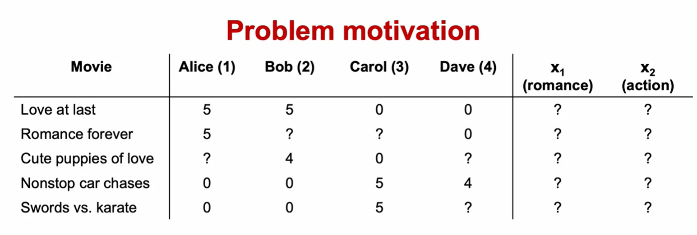

So, here's the data that we had before but what if instead of having these numbers for $x_1$ and $x_2$, we didn't know in advance what the values of the features $x_1$ and $x_2$ are? I'm going to replace them with question marks over here. Now, just for the purposes of illustration, let's say we had somehow already learned the parameters for the four users

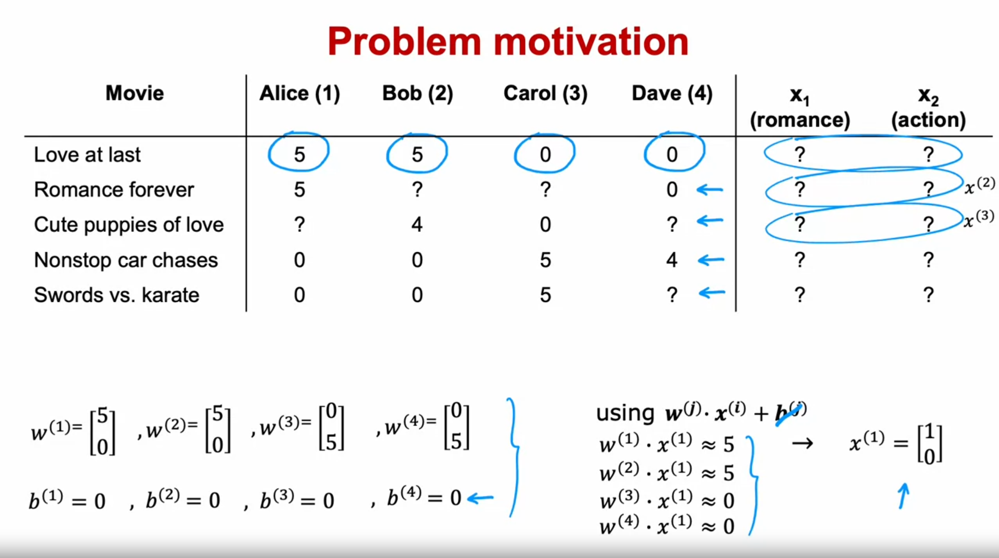

So, let's say that we learned the following parameters for each of the users: 

### For user 1:

$$
w^{(1)} =
\begin{bmatrix}
5 \\
0
\end{bmatrix}
$$

$$ 
b^{(1)} = 0
$$

### For user 2:

$$
w^{(2)} =
\begin{bmatrix}
5 \\
0
\end{bmatrix}
$$

$$ 
b^{(2)} = 0
$$

### For user 3:

$$
w^{(3)} =
\begin{bmatrix}
0 \\
5
\end{bmatrix}
$$

$$ 
b^{(3)} = 0
$$

### For user 4:

$$
w^{(4)} =
\begin{bmatrix}
0 \\
5
\end{bmatrix}
$$

$$ 
b^{(4)} = 0
$$

We'll worry later about how we might have come up with these parameters, $w$ and $b$ but let's say we have them already. 

As a reminder, to predict user $j$'s rating on movie $i$, we're going to use $w^{(j)} \cdot x^{(i)} + b^{(j)}$

> [!NOTE]
> To simplify this example, all the values of $b$ are actually equal to 0. Just to reduce a little bit of writing, I'm going to ignore $b$ for the rest of this example. 

Let's take a look at how we can try to guess what might be reasonable features for movie one: If these are the parameters you have on the left, we should have that:

- $w^{(1)} \cdot x^{(1)} \approx 5$ because Alice rated movie one with 5 
- $w^{(2)} \cdot x^{(1)} \approx 5$ because Bob rated it 5 and
- $w^{(3)} \cdot x^{(1)} \approx 0$ because Carol rated it 0 and 
- $w^{(4)} \cdot x^{(1)} \approx 0$ because Dave rated it 0 as well

So, the question is, given these values for $w$ that we have up here, what choice for $x_1$ will cause these values to be right? Well, one possible choice would be if the features for that first movie were: 

$$
x^{(1)} =
\begin{bmatrix}
1 \\
0
\end{bmatrix}
$$

in which case,

$$ w^{(1)} \cdot x^{(1)} = $$

$$ \begin{bmatrix}
5 \\
0
\end{bmatrix} \cdot 
\begin{bmatrix}
1 \\
0
\end{bmatrix} = $$

$$ 5*1 + 0 * 0 = 5 $$

##

$$ w^{(2)} \cdot x^{(1)} = $$

$$ \begin{bmatrix}
5 \\
0
\end{bmatrix} \cdot 
\begin{bmatrix}
1 \\
0
\end{bmatrix} = $$

$$ 5*1 + 0 * 0 = 5 $$

##

$$ w^{(3)} \cdot x^{(1)} = $$

$$ \begin{bmatrix}
0 \\
5
\end{bmatrix} \cdot 
\begin{bmatrix}
1 \\
0
\end{bmatrix} = $$

$$ 0*1 + 5 * 0 = 0 $$

##

$$ w^{(4)} \cdot x^{(1)} = $$

$$ \begin{bmatrix}
0 \\
5
\end{bmatrix} \cdot 
\begin{bmatrix}
1 \\
0
\end{bmatrix} = $$

$$ 0*1 + 5 * 0 = 0 $$

So, what we have is that if you have the parameters for all four users here, and if you have four ratings in this example that you want to try to match, you can take a reasonable guess at what is a feature vector $x_1$ for movie one that would make good predictions for these four ratings up on top.

Similarly, if you have these parameter vectors, you can also try to come up with a feature vector $x_2$ for the second movie, a feature vector $x_3$ for the third movie, and so on to try to make the algorithm's predictions on these additional movies close to what was actually the ratings given by the users. 

### Cost function

Let's come up with a cost function for actually learning the values of $x_1$ and $x_2$ and, by the way, notice that this works only because we have parameters for four users. That's what allows us to try to guess appropriate features, $x_1$. 

This is why in a typical Linear Regression application if you had just a single user, you don't actually have enough information to figure out what would be the features, $x_1$ and $x_2$, which is why in the Linear Regression context that you saw in course 1, you can't come up with features $x_1$ and $x_2$ from scratch but in collaborative filtering it is because you have ratings from multiple users of the same item with the same movie. That's what makes it possible to try to guess what are possible values for these features.

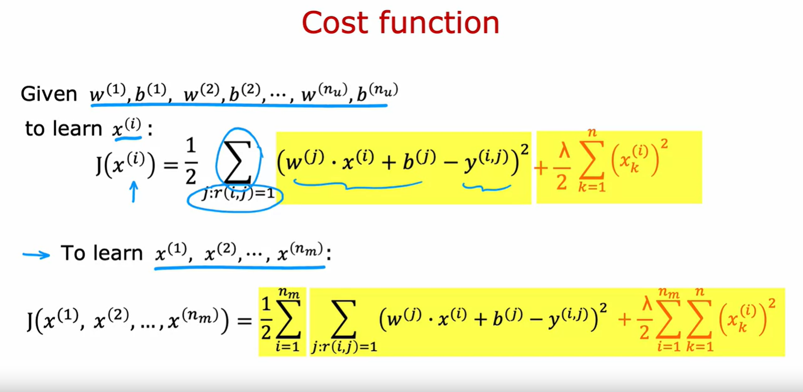

So, given $w^{(1)}, b^{(1)}, w^{(2)}, b^{(2)}, ..., w^{(n_u)}, b^{(n_u)}$ for the $n_u$ users, if you want to learn the features $x^{(i)}$ for a specific movie $i$, here is a cost function we could use which is:

I'm going to want to minimize squared error as usual, so if the predicted rating by user $j$ on movie $i$ is given by this, let's take the squared difference from the actual movie rating $y^{(i, j)}$ and as before let's sum over all the users $j$ but this will be a sum over all values of $j$ where $r(i, j)=1$ and I'll add one half there as usual. 

And so as I defined this as a cost function for $x^{(i)}$, then if we minimize this as a function of $x^{(i)}$, you will be choosing the features $x^{(i)}$ for movie $i$ so for all the users $j$ that have rated movie $i$, we will try to minimize the squared difference between what your choice of features $x^{(i)}$ results in terms of the predicted movie rating minus the actual movie rating that the user had given it.

Then finally, if we want to add a regularization term:

$$ \frac{\lambda}{2} \sum_{k=1}^{n} [ x_k^{(i)} ]^2 $$

where $n$ is the number of features

### Learning all the features $x^{(1)}$ through $x^{(n_m)}$

Lastly, to learn all the features $x^{(1)}$ through $x^{(n_m)}$ because we have $n_m$ movies, we can take this cost function on top and sum it over all the movies: So, sum from $i=1$ through $n_m$, the number of movies, and then just take this term from above and this becomes a cost function for learning the features for all of the movies in the dataset.

And so if you have parameters $w$ and $b$, all the users, then minimizing this cost function as a function of $x^{(1)}$ through $x^{(n_m)}$ using Gradient Descent or some other algorithm, this will actually allow you to take a pretty good guess at learning good features for the movies. 

And this is pretty remarkable: 

For most machine learning applications, the features had to be externally given but in this algorithm, we can actually learn the features for a given movie but in what we've done so far in this video, we assumed you had those parameters $w$ and $b$ for the different users but where do you get those parameters from? Well, let's put together the algorithm from the last video (for learning $w$ and $b$) and what we just talked about in this video for learning $x$ and that will give us our collaborative filtering algorithm

### Collaborative filtering algorithm

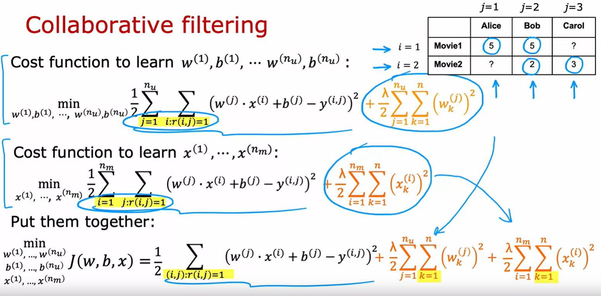

Here's the cost function for learning the features:

This is what we had derived on the last slide. Now, it turns out that if we put these two together, this term here is exactly the same as this term here. Notice that sum over j of all values of i is that r,i,j equals 1 is the same as summing over all values of i with all j where r,i,j is equal to 1. 

This summation is just summing over all user movie pairs where there is a rating and so what I'm going to do is put these two cost functions together and have this new one (look at the equation at the bottom) where I'm just writing out the summation more explicitly as summing over all pairs i and j, where we do have a rating of the usual squared cost function and then let me take the regularization term from learning the parameters $w$ and $b$, and put that here and take the regularization term from learning the features $x$ and put them here and this ends up being our overall cost function for learning $w, b, x$.

It turns out that if you minimize this cost function as a function of $w$ and $b$ as well as $x$, then this algorithm actually works. 

Here's what I mean: If we had three users and two movies and if you have ratings for these four movies, but not those two, over here does, is it sums over all the users and for user 1 has determined the costfunction for th is, for user 2 has determined the cost function for this, for user 3 has determined the cost function for this so we're summing over users first and then having one term for each movie where there is a rating.

But an alternative way to carry out the summation is to first look at movie 1, that's what this summation here does, and then to include all the users that rated movie 1, and then look at movie 2 and have a term for all the users that had rated movie 2. 

And you will see that in both cases we're just summing over these four areas where the user had rated the corresponding movie so that's why this summation on top and this summation here are the two ways of summing over all of the pairs where the user had rated the movie.

### Gradient Descent

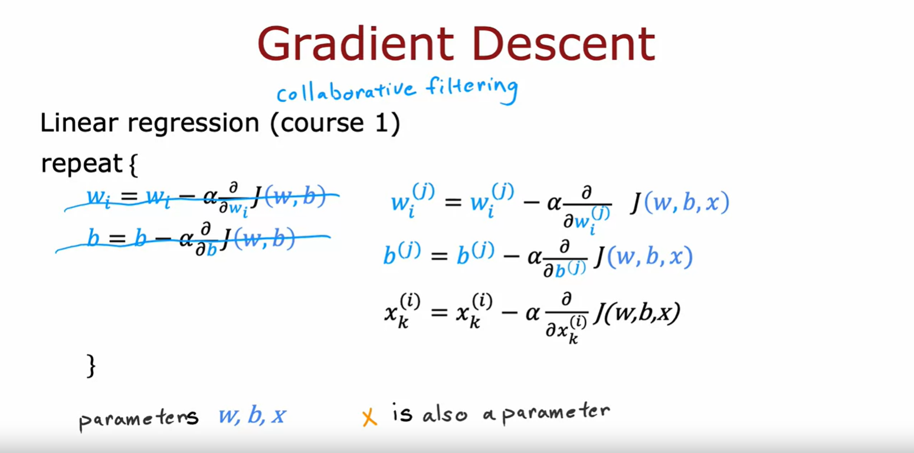

So, how do you minimize this cost function as a function of $w$, $b$ and $x$? One thing you could do is to use gradient descent

#### Gradient Descent with Linear Regression

In course 1, when we learned about Linear Regression, this is the gradient descent algorithm you had seen, where we had the cost function J, which is a function of the parameters $w$ and $b$, and we'd apply gradient descent as follows. 

#### Gradient Descent with Collaborative filtering

With collaborative filtering, the cost function is not a function of just $w$ and $b$ but it is now a function of $w$, $b$ and $x$. 

I'm using w and b here to denote the parameters for all of the users and x here just informally to denote the features of all of the movies but if you're able to take partial derivatives with respect to the different parameters, you can then continue to update the parameters as follows but now we need to optimize this with respect to $x$ as well. 

So, we also will want to update each of these parameters $x$ using gradient descent as follows. 

And it turns out that if you do this, then you actually find pretty good values of $w$ and $b$ as well as $x$. 

And in this formulation of the problem, the parameters are $w$ and $b$ and $x$ is also a parameter. 

Then finally, to learn the values of $x$ we also will update $x$ as $x$ minus the partial derivative respect to $x$ of the cost function $w$, $b$, $x$ 

I'm using the notation here a little bit informally and not keeping very careful track of the superscripts and subscripts but the key takeaway I hope you have from this is that the parameters to this model are $w$ and $b$ and $x$ now is also a parameter, which is why we minimize the cost function as a function of all three of these sets of parameters, $w$ and $b$ as well as $x$ 

### Summary

So, the algorithm we have just arrived is called *Collaborative filtering* and the name collaborative filtering refers to the sense that because multiple users have rated the same movie collaboratively, given you a sense of what this movie maybe like, that allows you to guess what are appropriate features for that movie and this in turn allows you to predict how other users that haven't yet rated that same movie may decide to rate it in the future. 

So, this collaborative filtering is this gathering of data from multiple users. This collaboration between users to help you predict ratings for even other users in the future.

So far, our problem formulation has used movie ratings from 1 to 5 stars or from 0 to 5 stars: A very common use case of recommender systems is when you have binary labels such as that the user favorites, or like, or interact with an item. 

In the next video, let's take a look at a generalization of the model that you've seen so far to binary labels. 

Let's go see that in the next video.

## Binary labels: favs, likes and clicks

Many important applications of recommender systems or collaborative filtering algorithms involve binary labels where instead of a user giving you a one to five star or zero to five star rating, they just somehow give you a sense of they like this item or they did not like this item. Let's take a look at how to generalize the algorithm you've seen to this setting. The process we'll use to generalize the algorithm will be very much reminiscent to how we have gone from Linear Regression to Logistic Regression to predicting numbers to predicting a binary label back in course one, let's take a look.

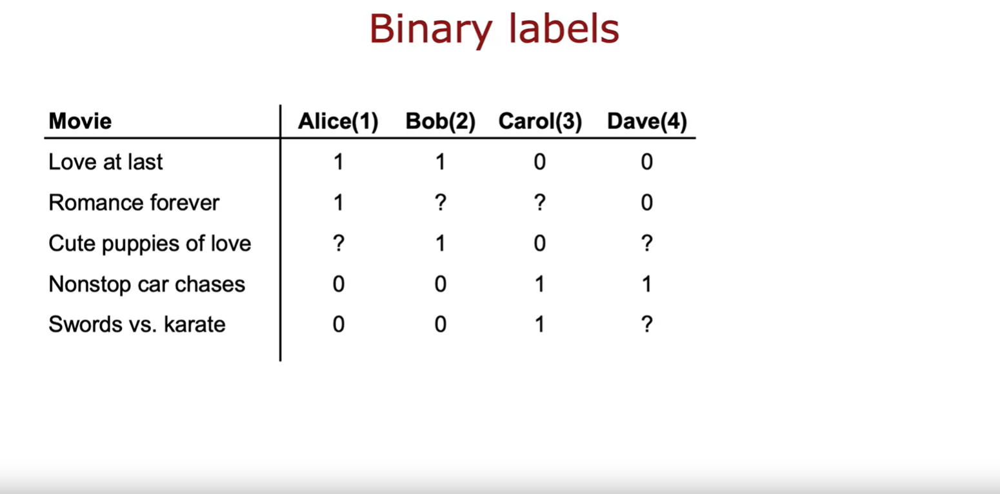

Here's an example of a collaborative filtering data set with binary labels.

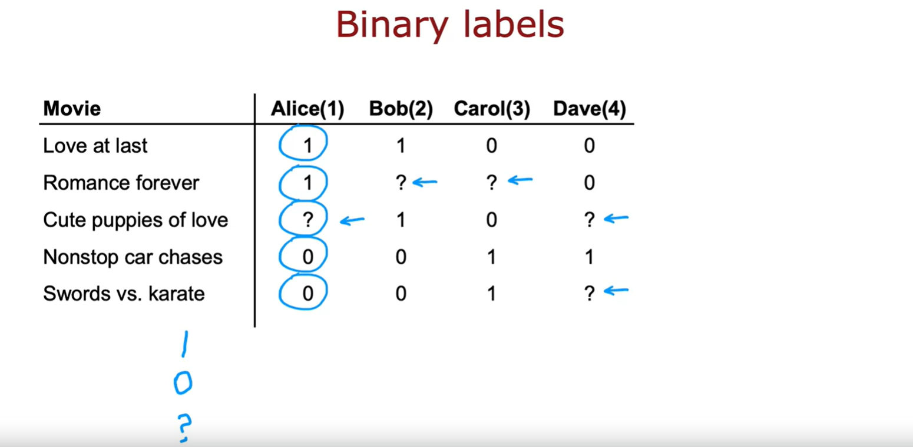

A one denotes that the user liked or engaged with a particular movie. So, label one could mean that Alice watched the movie Love at last all the way to the end and watch Romance forever all the way to the end but after playing a few minutes of nonstop car chases decided to stop the video and move on. Or it could mean that she explicitly hit like or favorite on an app to indicate that she liked these movies but after checking out nonstop car chasers and swords versus karate did not hit like. And the question mark usually means the user has not yet seen the item and so they weren't in a position to decide whether or not to hit like or favorite on that particular item. 

So, the question is how can we take the collaborative filtering algorithm that you saw in the last video and get it to work on this dataset? And by predicting how likely Alice, Bob carol and Dave are to like the items that they have not yet rated, we can then decide how much we should recommend these items to them. 

There are many ways of defining what is the label one and what is the label zero, and what is the label question mark in collaborative filtering with binary labels. Let's take a look at a few examples.

### Example applications

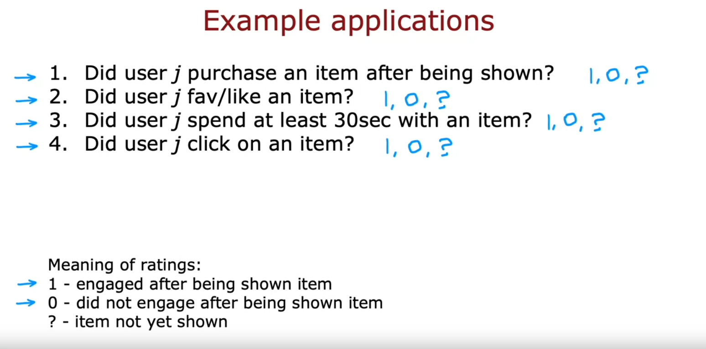

In an online shopping website, the label could denote whether or not user $j$ chose to purchase an item after they were exposed to it, after they were shown the item. So, one would denote that they purchased it, zero would denote that they did not purchased it and the question mark would denote that they were not even shown were not even exposed to the item. 

Or in a social media setting, the labels one or zero could denote did the user favorite or like an item after they were shown it and question mark would be if they have not yet been shown the item

Or many sites instead of asking for explicit user rating will use the user behavior to try to guess if the user liked the item. So, for example, you can measure if a user spends at least 30 seconds of an item and if they did, then assign that a label one because the user found the item engaging or if a user was shown an item but did not spend at least 30 seconds with it, then assign that a label zero or if the user was not shown the item yet, then assign it a question mark. 

Another way to generate a rating implicitly as a function of the user behavior will be to see that the user click on an item. This is often done in online advertising where if the user has been shown an ad, if they clicked on it assign it the label one, if they did not click assign it the label zero and the question mark were referred to if the user has not even been shown that ad in the first place. 

So, often these binary labels will have a rough meaning as follows: A labor of one means that the user engaged after being shown an item and engaged could mean that they clicked or spend 30 seconds or explicitly favorite or like to purchase the item. 

A zero will reflect the user not engaging after being shown the item

The question mark will reflect the item not yet having been shown to the user.

### From regression to binary classification

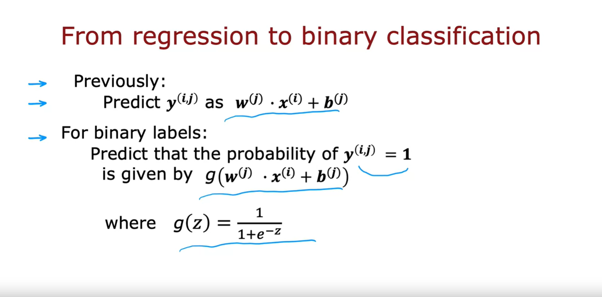

So, given these binary labels, let's look at how we can generalize our algorithm which is a lot like Linear Regression from the previous couple videos to predicting these binary outputs. 

Previously, we were predicting label $y^{(i, j)}$ as $w^{(j)} \cdot x^{(i)} + b^{(j)}$

So, this was a lot like a Linear Regression model. 

For binary labels, we're going to predict that the probability of $y^{(i, j)}$ being 1 is given by not $w^{(j)} \cdot x^{(i)} + b^{(j)}$ but instead by $g$ of this formula, where now $g(z) = \frac{1}{1 + e^{(-z)}}$

So, this is the Logistic function just like we saw in Logistic Regression. And what we would do is take what was a lot like a Linear Regression model and turn it into something that would be a lot like a Logistic Regression model where will now predict the probability of $y^{(i, j)}$ being 1 that is of the user having engaged with or like the item using this model

### Cost function for binary application

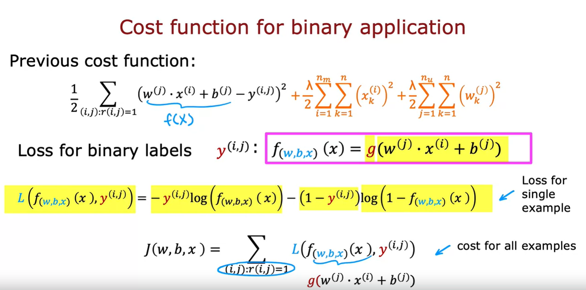

In order to build this algorithm, we'll also have to modify the cost function from the squared error cost function to a cost function that is more appropriate for binary labels for a Logistic Regression like model. 

So, previously, this was the cost function that we had where this term play their role similar to $f(x)$, the prediction of the algorithm. 

When you now have binary labels, $y^{(i, j)}$ when the labels are one or zero or question mark, then the prediction $f(x)$ becomes instead of $w^{(j)} \cdot x^{(i)} + b^{(j)}$, it becomes $g$ of this where $g$ is the Logistic function. 

And similar to when we had derived Logistic Regression, we had written out the following loss function for a single example which was at the loss if the algorithm predicts $f(x)$ and the true label was $y$, the loss was this: It was -y log f-y log 1-f. 

This is also sometimes called the binary cross entropy cost function but this is a standard cost function that we used for Logistic Regression as well as for the binary classification problems when we're training neural networks.

And so to adapt this to the collaborative filtering setting, let me write out the cost function which is now a function of all the parameters $w$ and $b$ as well as all the parameters $x$ which are the features of the individual movies or items of we now need to sum over all the pairs $(i, j):r(i, j)=1$ where $r(i, j)=1$. Notice this is just similar to this summation up on top and now instead of this squared error cost function, we're going to use that loss function that is a function of $f(x)$ and $y^{(i, j)}$ where $f(x)$ here that's my abbreviation, my shorthand for $g(w^{(j)} \cdot x^{(i)} + b^{(j)})$ and you plug this into here, then this gives you the cost function they could use for collaborative filtering on binary labels

### Summary

So, that's it. That's how you can take the Linear Regression like collaborative filtering algorithm and generalize it to work with binary labels. And this actually very significantly opens up the set of applications you can address with this algorithm.

Now, even though you've seen the key structure and cost function of the algorithm, there are also some implementations or tips that will make your algorithm work much better. 

Let's go on to the next video to take a look at some details of how you implement this and some little modifications that make the algorithm run much faster. 

Let's go on to the next video.