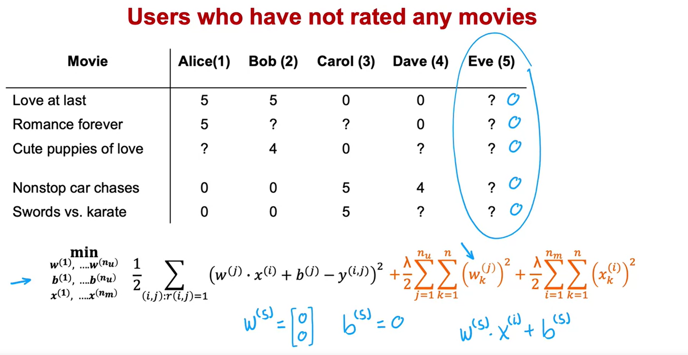
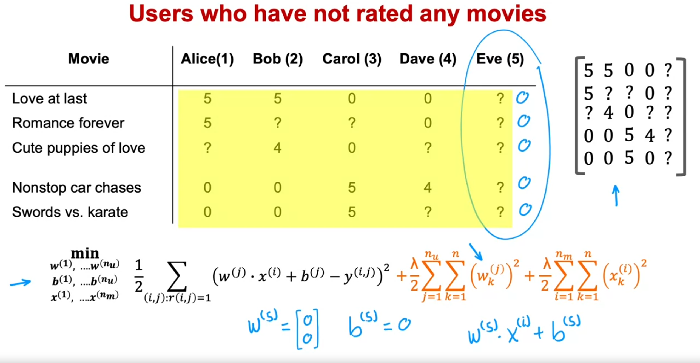
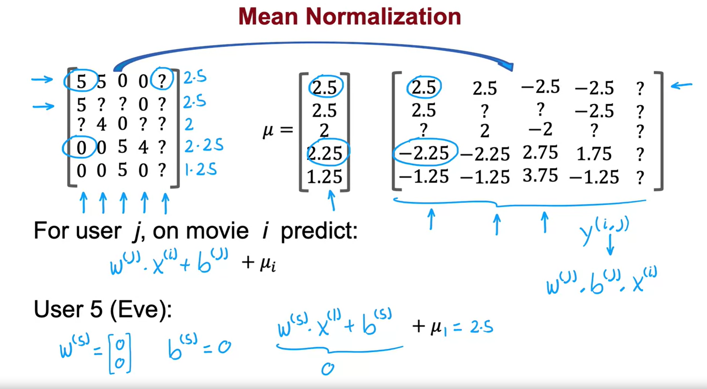
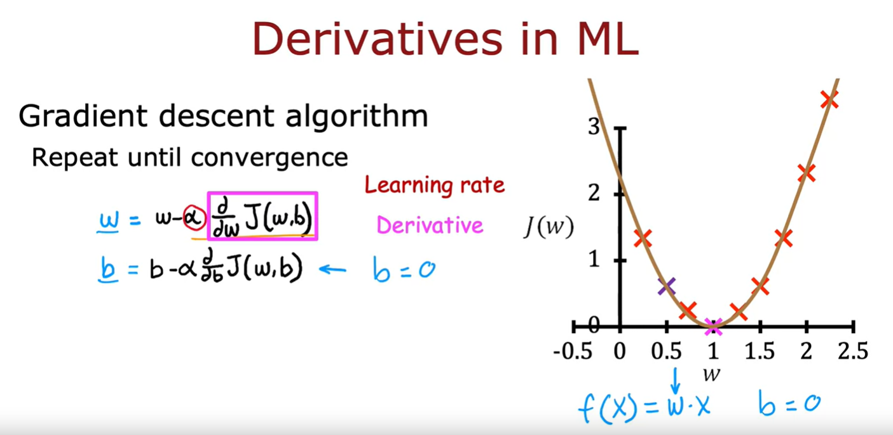
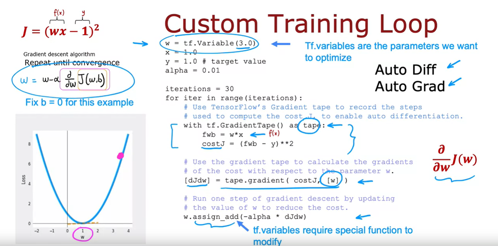
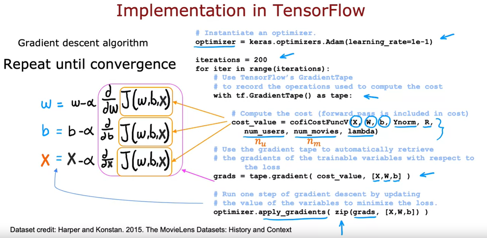
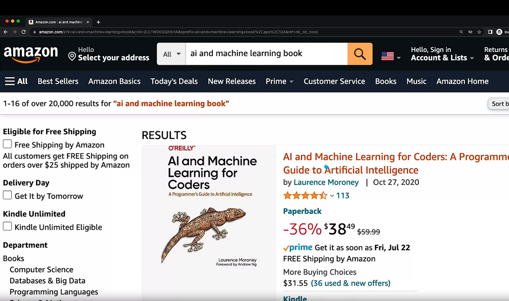
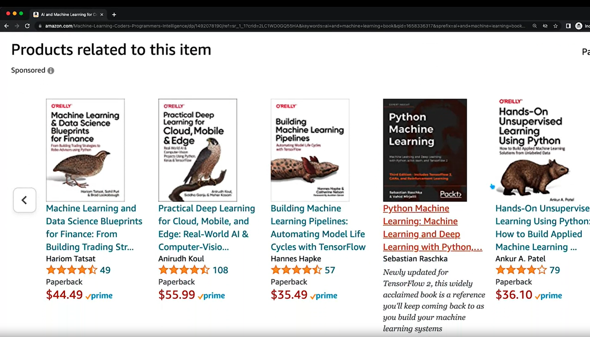
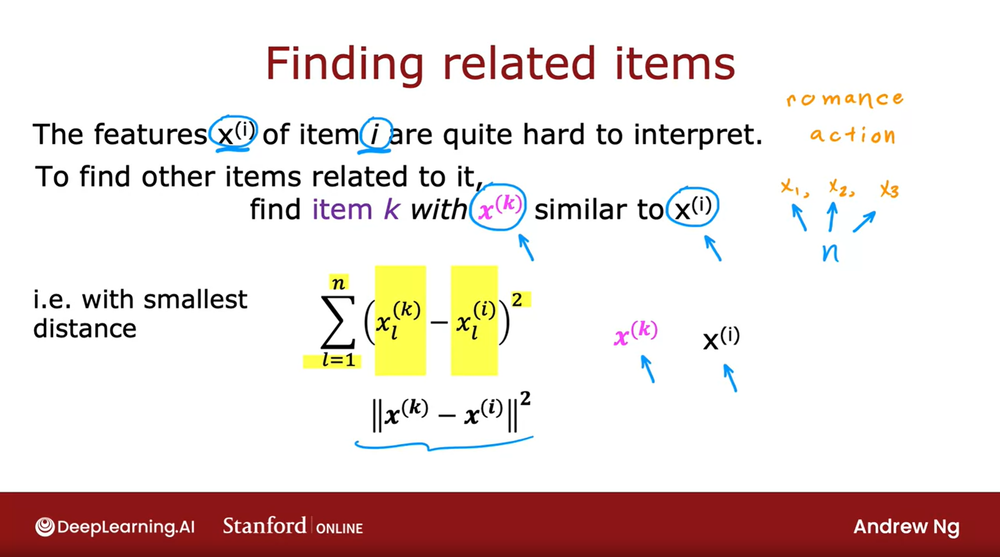
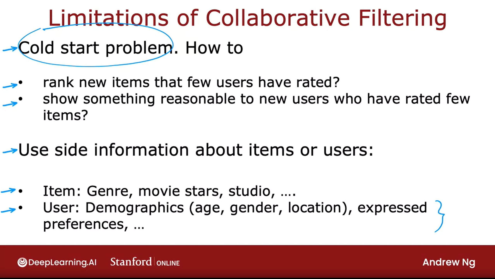

## Mean normalization

Back in the first course, you have seen how for Linear Regression, feature normalization can help the algorithm run faster. 

In the case of building a recommender system with numbers wide such as movie ratings from one to five or zero to five stars, it turns out your algorithm will run more efficiently and also perform a bit better if you first carry out mean normalization. 

That is if you normalize the movie ratings to have a consistent average value, let's take a look at what that means. 

So, here's the data set that we've been using and down below is the cost function you used to learn the parameters for the model. 

In order to explain mean normalization, I'm actually going to add fifth user Eve who has not yet rated any movies and you will see in a little bit that adding mean normalization will help the algorithm make better predictions on the user Eve. 

In fact, if you were to train a collaborative filtering algorithm on this data, then because we are trying to make the parameters $w$ small because of this regularization term, if you were to run the algorithm on this dataset, you actually end up for the fifth user, Eve, with the parameters $w$ 

$$
w^{(5)} =
\begin{bmatrix}
0 \\
0
\end{bmatrix}
$$ 

as well as quite likely 

$$ b^{(5)} = 0 $$

because Eve hasn't rated any movies yet, the parameters $w$ and $b$ don't affect this first term in the cost function because none of Eve's movie's rating play a role in this squared error cost function and so minimizing this means making the parameters $w$ as small as possible. 

We didn't really regularize $b$ but if you initialize $b=0$ as the default, you end up with $b^{(5)} = 0$ as well but if these are the parameters for user 5 that is for Eve, then what the average will end up doing is predict that all of Eve's movies ratings would be:

$$ w^{(5)} \cdot x^{(i)} + b^{(5)} = 0 $$

for movie $i$ if $w$ and $b$ above equals 0.

So, this algorithm will predict that if you have a new user that has not yet rated anything, we think they'll rate all movies with zero stars and that's not particularly helpful. 

> [!IMPORTANT]
> So, in this video, we'll see that mean normalization will help this algorithm come up with better predictions of the movie ratings for a new user that has not yet rated any movies. 

In order to describe mean normalization, let me take all of the values here including all the question marks for Eve and put them in a two dimensional matrix like the one shown above, just to write out all the ratings including the question marks in a more sustained and more compact way

### Carry out mean normalization

To carry out mean normalization, what we're going to do is take all of these ratings and for each movie, compute the average rating that was given. 

- So, movie 1 had two 5s and two 0s and so the average rating is 2.5
- Movie 2 had a 5 and a 0, so that averages out to 2.5. 
- Movie 3 had 4 and 0 rating, so it averages out to 2. 
- Movie 4 averages out to 2.25 rating and 
- Movie five not that popular, has an average 1.25 rating. 
  
So, I'm going to take all of these five numbers and gather them into a vector which I'm going to call $\mu$ because this is the vector of the average ratings that each of the movies had, averaging over just the users that did read that particular movie. 

Instead of using these original 0 to 5 star ratings over here, I'm going to take this and subtract from every rating the mean rating that it was given.

- So, for example this movie rating was 5: I'm going to subtract 2.5 giving me 2.5 over here. 
- This movie had a 0 star rating: I'm going to subtract 2.25 giving me a -2.25 rating and so on for all of the now five users including the new user Eve as well as for all five movies. 

Then, these new values on the right become your new values of $y^{(i,j)}$. 

We're going to pretend that user 1 had given a 2.5 rating to movie 1 and a -2.25 rating to movie 4.

And using this, you can then learn $w^{(j)}$, $b^{(j)}$ and $x^{(i)}$.

Same as before, for user $j$ on movie $i$, you would predict:

$$ w^{(j)} \cdot x^{(i)} + b^{(j)} $$

but because we had subtracted off $\mu_i$ for movie $i$ during this mean normalization step, in order to predict not a negative star rating which is impossible for user rates from 0 to 5 stars, we have to add back this $\mu_i$ which is just the value we have subtracted out. 

#### Example on user 5, Eve

So, as a concrete example, if we look at what happens with user 5 ($j=5$), the new user Eve, because she had not yet rated any movies, the average might learn parameters:

$$
w^{(5)} =
\begin{bmatrix}
0 \\
0
\end{bmatrix}
$$ 

and say

$$ b^{(5)} = 0 $$

and so if we look at the predicted rating for movie one ($i=1$), we will predict that Eve will rate it 

$$ w^{(j)} \cdot x^{(i)} + b^{(j)} + \mu_i $$

$$ w^{(5)} \cdot x^{(1)} + b^{(5)} + \mu_1 $$

$$ 
\begin{bmatrix}
0 \\
0
\end{bmatrix} \cdot x^{(1)} + 0 + 2.5 = 2.5
$$

So, this seems more reasonable to think Eve is likely to rate this movie 2.5 rather than think Eve will rate all movie zero stars just because she hasn't rated any movies yet. 

> [!IMPORTANT]
> And, in fact, the effect of this algorithm is it will cause the initial guesses for the new user Eve to be just equal to the **mean** of whatever other users have rated these five movies and that seems more reasonable to take the **average rating** of the movies rather than to guess that all the ratings by Eve will be zero. 

It turns out that by normalizing the mean of the different movies ratings to be zero, the optimization algorithm for the recommender system will also run just a little bit faster but it does make the algorithm behave much better for users who have rated no movies or very small numbers of movies and the predictions will become more reasonable. 

> [!NOTE]
> In this example, what we did was normalize each of the rows of this matrix to have zero mean and we saw this helps when there's a new user that hasn't rated a lot of movies yet.

### Another alternative to normalize: Normalize the columns

There's one other alternative that you could use which is to instead normalize the columns of this matrix to have zero mean and that would be a reasonable thing to do too but I think in this application, normalizing the rows so that you can give reasonable ratings for a new user, seems more important than normalizing the columns. 

Normalizing the columns would help if there was a brand new movie that no one has rated yet but if there's a brand new movie that no one has rated yet, you probably shouldn't show that movie to too many users initially because you don't know that much about that movie. 

So, normalizing columns the help with the case of a movie with no ratings seems less important to me than normalizing the rows to help with the case of a new user that's hardly rated any movies yet

And when you are building your own recommender system in this week's practice lab, normalizing just the rows should work fine. 

### Summary

So, that's mean normalization. It makes the algorithm run a little bit faster but even more important, it makes the algorithm give much better, much more reasonable predictions when there are users that rated very few movies or even no movies at all. 

This implementation detail of mean normalization will make your recommender system work much better. 

Next, let's go into the next video to talk about how you can implement this for yourself in TensorFlow.

## TensorFlow implementation of collaborative filtering

In this video, we'll take a look at how you can use TensorFlow to implement the collaborative filtering algorithm. 

You might be used to thinking of TensorFlow as a tool for building neural networks and it is. It's a great tool for building neural networks and it turns out that TensorFlow can also be very helpful for building other types of learning algorithms as well like the collaborative filtering algorithm. 

One of the reasons I like using TensorFlow for tasks like these is that for many applications in order to implement Gradient Descent, say you need to find the derivatives of the cost function, but TensorFlow can automatically figure out for you what are the derivatives of the cost function. 

All you have to do is implement the cost function and without needing to know any calculus, without needing to take derivatives yourself, you can get TensorFlow, with just a few lines of code, to compute that derivative term, that can later be used to optimize the cost function. 

Let's take a look at how all this works. 

You might remember this diagram here on the right from course one. This is exactly the diagram that we had looked at when we talked about optimizing $w$ when we were working through our first linear regression example. 

And at that time we had set $b=0$ and so the model was just predicting $f(x)=w * x$ and we wanted to find the value of $w$ that minimizes the cost function $J$. 

So, the way we were doing that was via a Gradient Descent update, which looked like this, where $w$ gets repeatedly updated as $w$ minus the learning rate alpha $\alpha$ times the derivative term. 

If you are updating $b$ as well, this is the expression you will use. But if you said $b=0$, you just forgo the second update and you keep on performing this Gradient Descent update until convergence. Sometimes, computing this derivative or partial derivative term can be difficult and it turns out that TensorFlow can help with that. Let's see how. 

### Custom training loop

I'm going to use a very simple cost function $J=(w*x-1)^2$

So, $w*x$ is our simplified $f(w, x)$ and $y=1$ and so this would be the cost function if we had $f(x)=wx$, $y=1$ for the one training example that we have, and if we were not optimizing this respect to $b$. 

So, the Gradient Descent algorithm will repeat until convergence this update over here. It turns out that if you implement the cost function $J$ over here, TensorFlow can automatically compute for you this derivative term and thereby get Gradient Descent to work. 

I'll give you a high level overview of what this code does:

- $w=tf.Variable(3.0)$ takes the parameter $w$ and initializes it to the value of 3.0. Telling TensorFlow that $w$ is a variable is how we tell it that $w$ is a parameter that we want to optimize. 

- I'm going to set $x=1.0$, $y=1.0$ and the learning rate alpha $\alpha=0.01$

- And let's run Gradient Descent for 30 iterations. So, in this code will still do *for iter in range(iterations)*, so for 30 iterations

This is the syntax to get TensorFlow to automatically compute derivatives for you:

- TensorFlow has a feature called a **GradientTape()** and if you write this *with tf.GradientTape() as tape*, f this is compute f(x) as w*x and compute J as f(x)-y squared. 
  
Then by telling TensorFlow how to compute the cost J and by doing it with the gradient taped syntax as follows, TensorFlow will automatically record the sequence of steps, the sequence of operations needed to compute the cost J.

And this is needed to enable automatic differentiation. 

- Next TensorFlow will have saved the sequence of operations in tape, in the gradient tape and with this syntax, $tape.gradient(costJ, [w])$, TensorFlow will automatically compute this derivative term, which I'm going to call dJdw. 

And TensorFlow knows you want to take the derivative respect to $w$, that $w$ is the parameter you want to optimize because you had told it so up here and because we're also specifying it down here. 

So, now that you haved computed the derivatives, finally you can carry out this update by taking $w$ and subtracting from it the learning rate alpha times that derivative term that we just got from up above. 

TensorFlow variables, $tf$ variables, require special handling which is why instead of setting $w$ to be $w$ minus alpha times the derivative in the usual way, we use this **assign_add** function but when you get to the practice lab, don't worry about it, we'll give you all the syntax you need in order to implement the collaborative filtering algorithm correctly. 

So, notice that with the **GradientTape()** feature of TensorFlow, the main work you need to do is to tell it how to compute the cost function J and the rest of the syntax causes TensorFlow to automatically figure out for you what is that derivative. 

And with this, TensorFlow will start with finding the slope of this at 3 shown by this dash line, take a gradient step and update $w$ and compute the derivative again and update $w$ over and over until eventually it gets to the optimal value of $w$, which is at $w=1$. 

So, this procedure allows you to implement Gradient Descent without ever having to figure out yourself how to compute this derivative term. 

This is a very powerful feature of TensorFlow called *Auto Diff* and some other machine learning packages like PyTorch also support Auto Diff. 
Sometimes, you hear people call this *Auto Grad*: The technically correct term is Auto Diff, and Auto Grad is actually the name of the specific software package for doing automatic differentiation, for taking derivatives automatically but sometimes if you hear someone refer to Auto Grad, they're just referring to this same concept of automatically taking derivatives. 

So, let's take this and look at how you can implement the collaborative filtering algorithm using Auto Diff and in fact, once you can compute derivatives automatically, you're not limited to just **Gradient Descent**. You can also use a more powerful optimization algorithm, like the **Adam optimization algorithm**

### Collaborative filtering implementation in TensorFlow

In order to implement the collaborative filtering algorithm in TensorFlow, this is the syntax you can use. Let's start with specifying that the optimizer is $keras.optimizers.Adam$ with learning rate specified here. 

And then for say, 200 iterations, here's the syntax as before:

*with tf.GradientTape() as tape*, you need to provide code to compute the value of the cost function $J$. So, recall that in collaborative filtering, the cost function $J$ takes as input parameters $x$, $w$ and $b$ as well as the ratings mean normalized, so that's why I'm writing $Ynorm$, $R$, this is $r^{(i,j)}$ specifying which values have a rating, number of users or $n_u$ in our notation, number of movies or $n_m$ in our notation as well as the regularization parameter lambda $\lambda$. 

And if you can implement this cost function $J$, then this syntax will cause TensorFlow to figure out the derivatives for you. Then this syntax will cause TensorFlow to record the sequence of operations used to compute the cost and then by asking it to give you *grads=tape.gradient()*, this will give you the derivative of the cost function with respect to $x$, $w$ and $b$ and finally with the optimizer that we had specified up on top, as the adam optimizer, you can use the optimizer with the gradients that we just computed 

And the *zip* function in Python is just a function that rearranges the numbers into an appropriate ordering for the applied gradients function. 

If you are using Gradient Descent for collateral filtering, recall that the cost function $J$ would be a function of $w$, $b$ as well as $x$ and if you are applying Gradient Descent, you take the partial derivative respect the $w$ and then update $w$ as follows and you would also take the partial derivative of this respect to $b$ and update $b$ as follows and similarly update the features $x$ as follows and you repeat until convergence. 

But as I mentioned earlier with TensorFlow and Auto Diff you're not limited to just Gradient Descent: You can also use a more powerful optimization algorithm like the Adam optimizer. 

The data set you will use in the practice lab is a real data set comprising actual movies rated by actual people. This is *The MovieLens Datasets: History and Context* and it's due to Harper and Konstan and I hope you enjoy running this algorithm on a real data set of movies and ratings and see for yourself the results that this algorithm can get

### Summary

So that's it. That's how you can implement the collaborative filtering algorithm in TensorFlow. 

If you're wondering why do we have to do it this way? Why couldn't we use a Dense layer and then **model.compile** and **model.fit**? 

The reason we couldn't use that old recipe is, the collateral filtering algorithm and cost function, it doesn't neatly fit into the Dense layer or the other standard neural network layer types of TensorFlow. 

That's why we had to implement it this other way where we would implement the cost function ourselves but then use TensorFlow's tools for automatic differentiation also called Auto Diff and use TensorFlow's implementation of the Adam optimization algorithm to let it do a lot of the work for us of optimizing the cost function. 

If the model you have is a sequence of Dense neural network layers or other types of layers supported by TensorFlow and the old implementation recipe of *model.compile* and *model.fit* works but even when it isn't, these tools TensorFlow give you a very effective way to implement other learning algorithms as well.

And so I hope you enjoy playing more with the collaborative filtering exercise in this week's practice lab and it looks like there's a lot of code and lots of syntax, don't worry about it. Make sure you have what you need to complete that exercise successfully and in the next video, I'd like to also move on to discuss more of the nuances of collaborative filtering and specifically the question of how do you find related items given one movie, whether other movies similar to this one?. Let's go on to the next video

## Finding related items

If you go to an online shopping website and you're looking at a specific item, say maybe a specific book,

the website may show you things like, "Here are some other books similar to this one"

or if you're browsing a specific movie, it may say, "Here are some other movies similar to this one." How do the websites do that?

So that when you're looking at one item, it gives you other similar or related items to consider. 

It turns out the collaborative filtering algorithm that we've been talking about gives you a nice way to find related items. Let's take a look. 

### Collaborative filtering algorithm: Finding related items

As part of the collaborative filtering we've discussed, you learned features $x^{(i)}$ for every item $i$, for every movie $i$ or other type of item they're recommending to users. Whereas early this week, I had used a hypothetical example of the features representing how much a movie is a romance movie versus an action movie. 

In practice, when you use this algorithm to learn the features $x^{(i)}$ automatically, looking at the individual features like $x_1$, $x_2$, $x_3$ you find them to be quite hard to interpret. 

It is quite hard to look and learn features and say, $x_1$ is an action movie and $x_2$ is as a foreign film and so on. But nonetheless, these learned features, collectively, $x_1$ and $x_2$ or $x_1$, $x_2$ and $x_3$, other many features $n$ you have, collectively these features do convey something about what that movie is like. 

And it turns out that given features $x^{(i)}$ of item $i$, if you want to find other items, say other movies related to movie $i$, then what you can do is try to find the item $k$ with features $x^{(k)}$ that is similar to $x^{(i)}$. 

In particular, given a feature vector $x^{(k)}$, the way we determine whether or not is similar to the feature $x^{(i)}$ is as follows: 

$$ \sum_{l=1}^{n} (x_{l}^{(k)} - x_{l}^{(i)})^2 $$

It is the sum from $l=1$ through $n$ (with $n$ features) of $(x_{l}^{(k)}$ - $x_{l}^{(i)})^2$

This turns out to be the squared distance between $x^{(k)}$ and $x^{(i)}$ and in math, this squared distance between these two vectors, $x^{(k)}$ and $x^{(i)}$, is sometimes written as follows as well:

$$ || x^{(k)} - x^{(i)} ||^2 $$

If you find not just the one movie with the smallest distance between $x^{(k)}$ and $x^{(i)}$ but find say, the 5 or 10 items with the most similar feature vectors, then you end up finding 5 or 10 related items to the item $x^{(i)}$ 

So, if you're building a website and want to help users find related products to a specific product they are looking at, this would be a nice way to do so because the features $x^{(i)}$ give a sense of what item $i$ is about, other items $x^{(k)}$ with similar features will turn out to be similar to item $i$.

It turns out later this week, this idea of finding related items will be a small building block that we'll use to get to an even more powerful recommender system as well

### Limitations of collaborative filtering

Before wrapping up this section, I want to mention a few limitations of collaborative filtering

#### Limitation 1: Cold start problem

In collaborative filtering, you have a set of items and set of users and the users have rated some subset of items. 

One of this weaknesses is that is not very good at the cold start problem: 

For example, if there's a new item $i$ in your catalog, say someone's just published a new movie and hardly anyone has rated that movie yet, how do you rank the new item $i$ if very few users have rated it before? 

Similarly, for new users that have rated only a few items, how can we make sure we show them something reasonable? We could see in an earlier video, how mean normalization can help with this and it does help a lot but perhaps even better ways to show users that rated very few items, things that are likely to interest them. 

This is called the **cold start problem** because when you have a new item that few users have rated, or when you have a new user that's rated very few items, the results of collaborative filtering for that item or for that user may not be very accurate. 

#### Limitation 2:

The second limitation of collaborative filtering is it doesn't give you a natural way to use side information or additional information about items or users. 

For example, for a given movie in your catalog, you might know what is the genre of the movie, who had a movie stars, what is the studio, what is the budget, and so on. You may have a lot of features about a given movie. 

Or for a single user, you may know something about their demographics, such as their age, gender, location. They express preferences, such as if they tell you they like certain movies genres but not other movies genres, or it turns out if you know the user's IP address, that can tell you a lot about a user's location, and knowing the user's location might also help you guess what might the user be interested in, or if you know whether the user is accessing your site on a mobile or on a desktop, or if you know what web browser they're using. 

It turns out all of these are little cues you can get. They can be surprisingly correlated with the preferences of a user. 

It turns out, by the way, that it is known that users that use the Chrome versus Firefox versus Safari versus the Microsoft Edge browser, they actually behave in very different ways. 

So, even knowing the user web browser can give you a hint when you have collected enough data of what this particular user may like. 

### Summary

So, even though collaborative filtering, where you have multiple users give you ratings of multiple items, is a very powerful set of algorithms, it also has some limitations. 

In the next video, let's go on to develop content-based filtering algorithms, which can address a lot of these limitations. 

Content-based filtering algorithms are a state of the art technique used in many commercial applications today. Let's go take a look at how they work

## [Practice lab 1: Programming Assignment: Collaborative Filtering Recommender Systems](../04-practice-lab-1/)