## Collaborative filtering vs Content-based filtering
In this video, we'll start to develop a second type of recommender system called a content-based filtering algorithm. 

To get started, let's compare and contrast the collaborative filtering approach that we'll be looking at so far with this new content-based filtering approach. Let's take a look. 

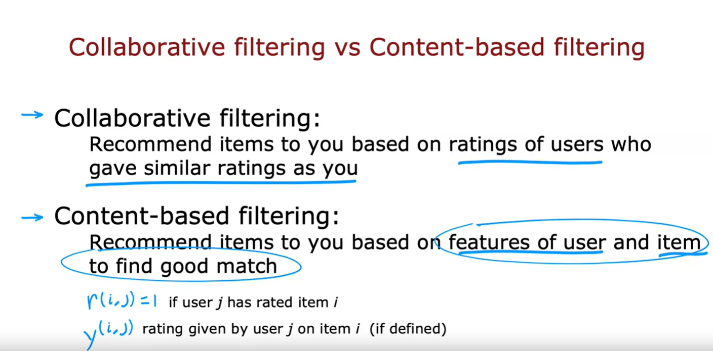

With collaborative filtering, the general approach is that we would recommend items to you based on ratings of users who gave similar ratings as you. So, we have some number of users give some ratings for some items and the algorithm figures out how to use that to recommend new items to you. 

In contrast, content-based filtering takes a different approach to deciding what to recommend to you. 

A content-based filtering algorithm will recommend items to you based on the features of users and features of the items to find a good match. In other words, it requires having some features of each user, as well as some features of each item and it uses those features to try to decide which items and users might be a good match for each other. 

With a content-based filtering algorithm, you still have data where users have rated some items. So, with content-based filtering we will continue to use $r^{(i, j)}$ to denote whether or not user $j$ has rated item $i$ and we will continue to use $y^{(i, j)}$ to denote the rating that user $j$ is given item $i$ if it's defined. 

But the key to content-based filtering is that we will be able to make good use of features of the user and of the items to find better matches than potentially a pure collaborative filtering approach might be able to.

### Examples of user and item features

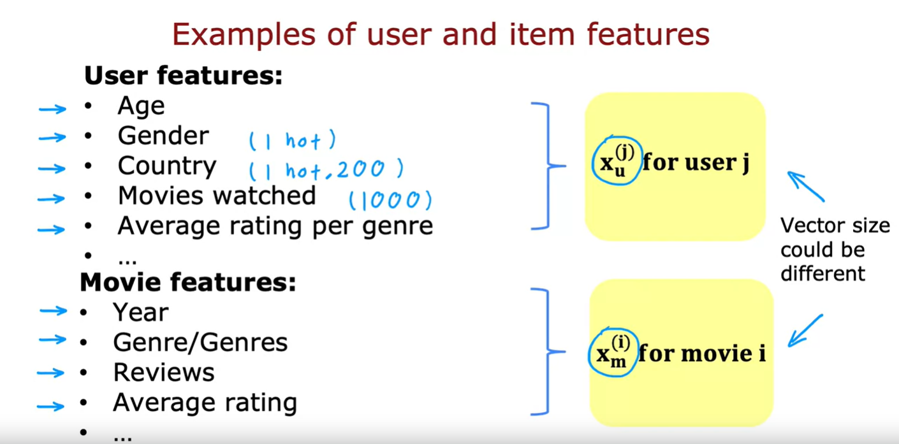

Let's take a look at how this works. In the case of movie recommendations, here are some examples of features. You may know the age of the user, or you may have the gender of the user, so, this could be a one-hot feature similar to what you saw when we were talking about decision trees where you could have a one-hot feature with the values based on whether the user's self-identified gender is male or female or unknown, and you may know the country of the user, so, if there are about 200 countries in the world then also be a one-hot feature with about 200 possible values. 

You can also look at past behaviors of the user to construct this feature vector. For example, if you look at the top thousand movies in your catalog, you might construct a thousand features that tells you of the thousand most popular movies in the world which of these has the user watched. 

In fact, you can also take ratings the user might have already given in order to construct new features, so, it turns out that if you have a set of movies and if you know what genre each movie *i*s in, then the average rating per genre that the user has given. So, of all the romance movies that the user has rated, what was the average rating? 

Of all the action movies that the user has rated, what was the average rating? And so on for all the other genres. 

This too can be a powerful feature to describe the user. 

One interesting thing about this feature is that it actually depends on the ratings that the user had given but there's nothing wrong with that. Constructing a feature vector that depends on the user's ratings is a completely fine way to develop a feature vector to describe that user. 

So, with features like these you can then come up with a feature vector $x_u^{(j)}$ where *u* stands for *user* and *j* for user $j$. 

Similarly, you can also come up with a set of features for each movie of each item, such as what was the year of the movie? What's the genre or genres of the movie *i* if known? If there are critic reviews of the movie, you can construct one or multiple features to capture something about what the critics are saying about the movie. Or once again, you can actually take user ratings of the movie to construct a feature of, say, the average rating of this movie. 

This feature again depends on the ratings that users are given but again, does nothing wrong with that: You can construct a feature for a given movie that depends on the ratings that movie had received, such as the average rating of the movie. Or if you wish, you can also have average rating per country or average rating per user demographic as they want to construct other types of features of the movies as well. 

With this, for each movie, you can then construct a feature vector, which I'm going to denote $x_m^{(i)}$ where *m* stands for movie, and superscript *i* for movie *i*. 

> [!IMPORTANT]
> Given features like this, the task is to try to figure out whether a given movie *i* is going to be good match for a user $j$. Notice that the user features and movie features can be very different in size. For example, maybe the user features could be 1500 numbers and the movie features could be just 50 numbers and that's okay too

### Content-based filtering: Learning to match

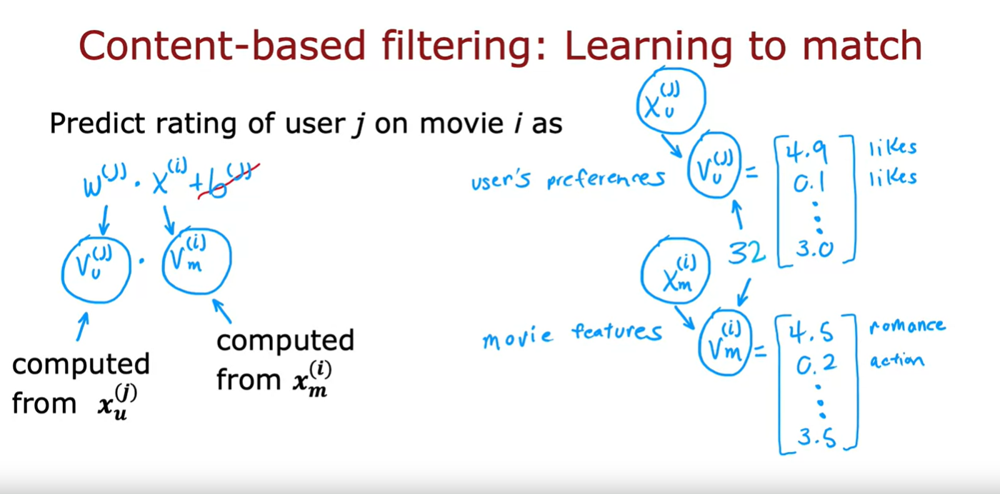

In content-based filtering, we're going to develop an algorithm that learns to match users and movies. 

Previously, we were predicting the rating of user $j$ on movie $i$ as 

$$ w^{(j)} \cdot x^{(i)} + b^{(j)} $$

In order to develop content-based filtering, I'm going to get rid of $b^{(j)}$

It turns out this won't hurt the performance of the content-based filtering at all and instead of writing $w^{(j)}$ for a user $j$ and $x^{(i)}$ for a movie $i$, I'm instead going to just replace this notation with 

$$ v_u^{(j)}  $$

This *v* here stands for a *vector*. There'll be a list of numbers computed for user $j$ and the *u* subscript here stands for *user*. 

And instead of $x^{(i)}$, I'm going to compute 

$$ v_m^{(i)}  $$

a separate vector where *m* stands for the *movie* and for movie *i*s what a superscript stands for. 

So, $v_u^{(j)}$ is a vector as a list of numbers computed from the features of user $j$ and $v_m^{(i)}$ is a list of numbers computed from the features like the ones you saw on the previous slide of movie $i$. 

If we're able to come up with an appropriate choice of these vectors, $v_u^{(j)}$ and $v_m^{(i)}$, then hopefully the dot product between these two vectors will be a good prediction of the rating that user $j$ gives movie $i$. 

Just to illustrate what a learning algorithm could come up with: If $v_u$ that is a user vector, turns out to capture the user's preferences, say is 4.9, 0.1, and so on. Lists of numbers like that. 

And then the first number captures how much do they like romance movies, then the second number captures how much do they like action movies and so on. 

Then $v_m$, the movie vector is 4.5, 0.2, and so on and so forth of these numbers capturing how much is this a romance movie, how much is this an action movie, and so on. 

Then, the dot product, which multiplies these lists of numbers element-wise and then takes a sum, hopefully, will give a sense of how much this particular user will like this particular movie. 

So, the challenge is, given features of a user, say $x_u^{(j)}$, how can we compute this vector $v_u^{(j)}$ that represents succinctly or compactly the user's preferences? 

And similarly, given features of a movie $x_m^{(i)}$, how can we compute $v_m^{(i)}$? 

> [!NOTE]
> Notice that whereas $x_u$ and $x_m$ could be different in size, one could be very long lists of numbers, one could be much shorter list, $v$ has to be the same size because if you want to take a dot product between $v_u$ and $v_m$, then both of them have to have the same dimensions such as maybe both of these are say 32 numbers

### Summary

To summarize, in collaborative filtering, we had number of users give ratings of different items. 

In contrast, in content-based filtering, we have features of users and features of items and we want to find a way to find good matches between the users and the items and the way we're going to do so is to compute these vectors, $v_u$ for the users and $v_m$ for the items over the movies and then take dot product between them to try to find good matches. 

How do we compute the $v_u$ and $v_m$? Let's take a look at that in the next video.

## Deep learning for content-based filtering

A good way to develop a content-based filtering algorithm is to use deep learning. The approach you will see in this video is the way that many important commercial state-of-the-art content-based filtering algorithms are built today. Let's take a look.

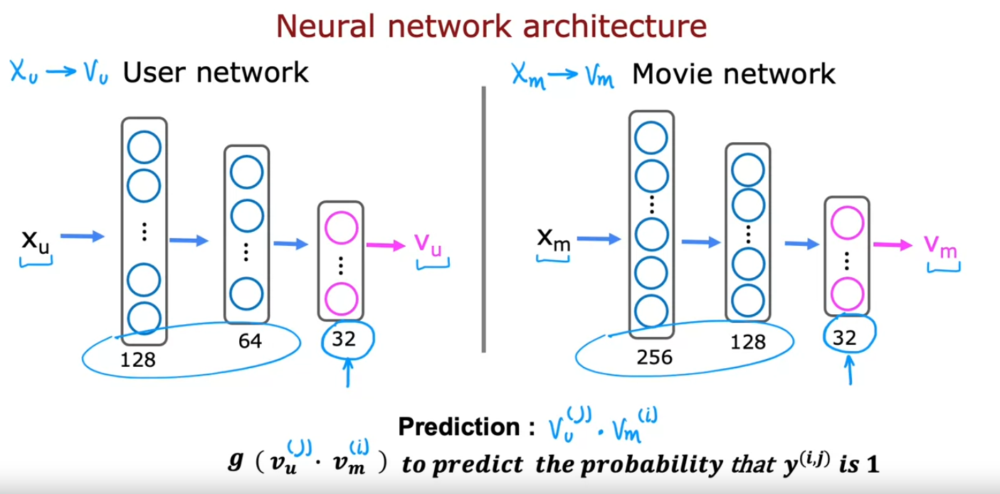

Recall that in our approach, given a feature vector describing a user, such as age, gender, country and so on, we have to compute a vector $v_u$, and similarly, given a vector describing a movie such as year of release, the stars in the movie, and so on, we have to compute a vector $v_m$. 

### Building the user network

In order to do the former, we're going to use a neural network. The first neural network will be what we'll call the user network. 

Here's an example of user network: It takes as input the list of features of the user, $x_u$, so the age, the gender, the country of the user, and so on and then using a few layers, say dense neural network layers, it will output this vector $v_u$ that describes the user. 

Notice that in this neural network, the output layer has 32 units, and so $v_u$ is actually a list of 32 numbers unlike most of the neural networks that we were using earlier, the final layer is not a layer with one unit, it's a layer with 32 units. 

### Building the movie network

Similarly, to compute $v_m$ for a movie, we can have a movie network as follows: It takes as input features of the movie and through a few layers of a neural network ends up outputting $v_m$, that vector that describes the 
movie. 

### Computing the prediction

Finally, we'll predict the rating of this user on that movie as:

$$ v_u \cdot v_m $$

> [!NOTE]
> Notice that the user network and the movie network can hypothetically have different numbers of hidden layers and different numbers of units per hidden layer. Only the output layer needs to have the same size or the same dimension

### Dealing with binary labels

In the description you've seen so far, we were predicting the 1-5 or 0-5 star movie rating. If we had binary labels, if *y* was to the user like or favorite an item, then you can also modify this algorithm to output instead of $v_u \cdot v_m$, you can apply the sigmoid function *g* to that so we would compute

$$ g(v_u \cdot v_m) $$ 

and use this to predict the probability that $y^{(i, j)}$ is 1.

And to flesh out this notation, we can also add superscripts *i* and *j* here if we want to emphasize that this is the prediction by user *j* on movie *i*. 

I've drawn here the user network and the movie network as two separate neural networks but it turns out that we can actually draw them together in a single diagram as if it was a single neural network

## Neural network architecture

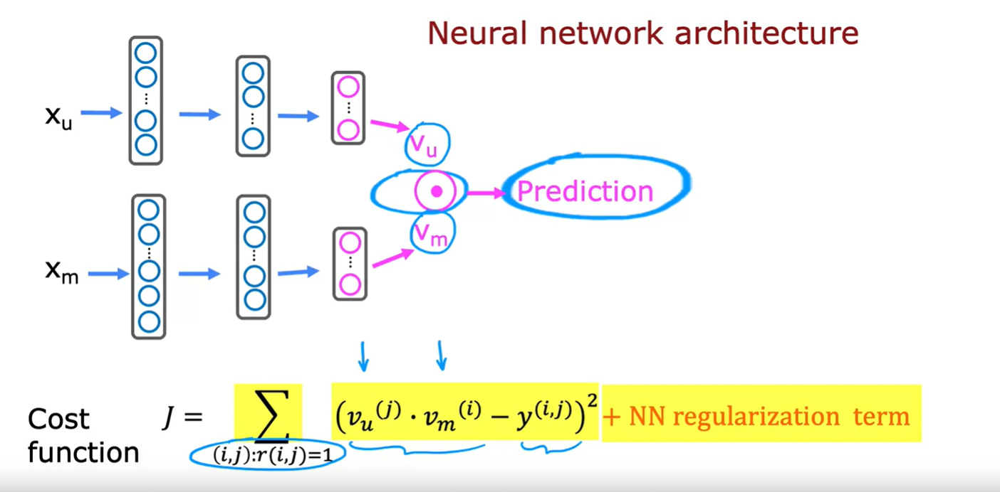

This is what it looks like. On the upper portion of this diagram, we have the user network which inputs $x_u$ and ends up computing $v_u$ and on the lower portion of this diagram, we have what was the movie network, the input is $x_m$ and ends up computing $v_m$ and these two vectors are then dot-product together. This dot here represents dot product and this gives us our prediction. 

Now, this model has a lot of parameters: Each of these layers of a neural network has a usual set of parameters of the neural network. 

So, how do you train all the parameters of both the user network and the movie network? What we're going to do is construct a cost function *J*, which is going to be very similar to the cost function that you saw in collaborative filtering as follows:

$$ \text{Cost function J} = \sum_{(i, j):r(i, j)=1} (v_{u}^{(j)} \cdot v_{m}^{(i)} - y^{(i, j)})^2 + \text{network regularization term} $$

which is assuming that you do have some data of some users having rated some movies, we're going to sum over all pairs $(i, j)$ of where you have labels, where $(i, j)=1$, of the difference between the prediction, so that would be:

$$ [v_{u}^{(j)} \cdot v_{m}^{(i)} - y^{(i, j)}]^2 $$

The way we would train this model is depending on the parameters of the neural network, you end up with different vectors here for the users $v_{u}^{(j)}$ and for the movies $v_{m}^{(i)}$ and so what we'd like to do is train the parameters of the neural network so that you end up with vectors for the users and for the movies that result in small squared error into predictions you get out here. 

To be clear, there's no separate training procedure for the user and movie networks. This expression down here, this is the cost function used to train all the parameters of the user and the movie networks. 

We're going to judge the two networks according to how well $v_u$ and $v_m$ predict $y^{(i, j)}$, and with this cost function, we're going to use gradient descent or some other optimization algorithm to tune the parameters of the neural network to cause the cost function *J* to be as small as possible. 

#### About the regularization term

If you want to regularize this model, we can also add the usual neural network regularization term to encourage the neural networks to keep the values of their parameters small. 

### Learned user and item vectors

It turns out, after you've trained this model, you can also use this to find similar items. This is akin to what we have seen with collaborative filtering features, helping you find similar items as well. Let's take a look.

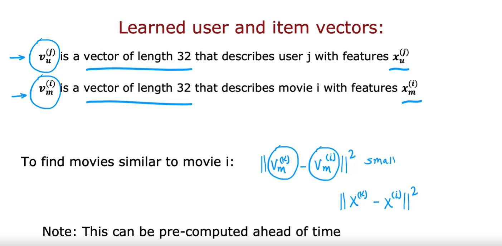

So, $v_{u}^{(j)}$ is a vector of length 32 that describes a user *j* that have features $x_{u}^{(j)}$ and similarly, $v_{m}^{(i)}$ is a vector of length 32 that describes a movie with these features over here $x_{m}^{(i)}$.

So, given a specific movie, what if you want to find other movies similar to it? Well, this vector $v_{m}^{(i)}$ describes the movie *i*. So, if you want to find other movies similar to it, you can then look for other movies *k* so that the distance between the vector describing movie *k* and the vector describing movie *i*, that the squared distance is small. 

$$ ||v_{m}^{(k)} - v_{m}^{(i)}||^2 $$

This expression plays a role similar to what we had previously with collaborative filtering,

$$ ||x^{(k)} - x^{(i)}||^2 $$

where we talked about finding a movie with features $x^{(k)}$ that was similar to the features $x^{(i)}$:

And thus, with this approach, you can also find items similar to a given item. 

> [!NOTE]
> One final note: This can be pre-computed ahead of time. By that I mean, you can run a compute server overnight to go through the list of all your movies and for every movie find similar movies to it, so that tomorrow, if a user comes to the website and they're browsing a specific movie, you can already have pre-computed to 10 or 20 most similar movies to show to the user at that time. 

> [!IMPORTANT]
> The fact that you can pre-compute ahead of time what's similar to a given movie, will turn out to be important later when we talk about scaling up this approach to a very large catalog of movies

### Summary

That's how you can use deep learning to build a content-based filtering algorithm. 

You might remember when we were talking about decision trees and the pros and cons of decision trees versus neural networks. I mentioned that one of the benefits of neural networks is that it's easier to take multiple neural networks and put them together to make them work in concert to build a larger system. 

And what you just saw was actually an example of that: Where we could take a user network and a movie network and put them together, and then take the inner product of the outputs and this ability to put two neural networks together this how we've managed to come up with a more complex architecture that turns out to be quite powerful. 

> [!NOTE]
> One note: If you're implementing these algorithms in practice, I find that developers often end up spending a lot of time carefully designing the features needed to feed into these content-based filtering algorithms. 

If we end up building one of these systems commercially, it may be worth spending some time engineering good features for this application as well. 

In terms of these applications, one limitation that the algorithm as we've described it is it can be computationally very expensive to run if you have a large catalog of a lot of different movies you may want to recommend. 

In the next video, let's take a look at some of the practical issues and how you can modify this algorithm to make it scale that are working on even very large item catalogs. Let's go see that in the next video.

## Recommending from a large catalogue

Today's recommender systems will sometimes need to pick a handful of items to recommend from a catalog of thousands or millions or 10s of millions or even more items. How do you do this efficiently computationally? Let's take a look. 

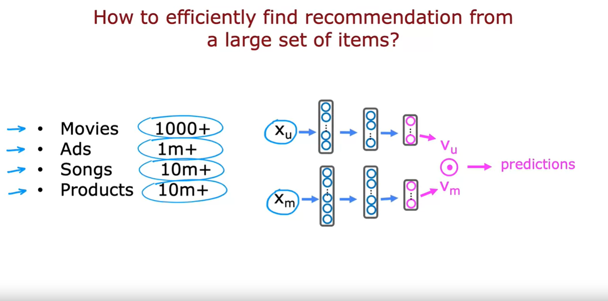

Here's the neural network we've been using to make predictions about how a user might rate an item. Today, a large movie streaming site may have thousands of movies or a system that is trying to decide what ad to show may have a catalog of millions of ads to choose from or a music streaming sites may have 10s of millions of songs to choose from and large online shopping sites can have millions or even 10s of millions of products to choose from. 

#### The problem

When a user shows up on your website, they have some feature $x_u$ but if you need to take thousands of millions of items to feed through this neural network in order to compute the inner product to figure out which products you should recommend, then having to run neural network inference, thousands of millions of times every time a user shows up on your website, becomes computationally infeasible

### Two steps: Retrieval and Ranking

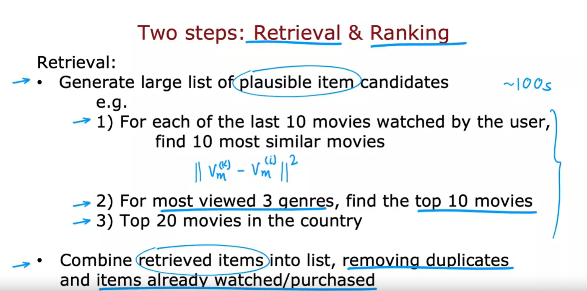

Many large scale recommender systems are implemented as two steps which are called the retrieval and ranking steps. 

#### Main idea of the retrieval step

The idea is during the retrieval step will generate a large list of plausible item candidates that tries to cover a lot of possible things you might recommend to the user and it's okay during the retrieval step if you include a lot of items that the user is not likely to like

#### Main idea of the ranking step

Then, during the ranking step will fine tune and pick the best items to recommend to the user. 

#### Example

So, here's an example: During the retrieval step we might do something like: For each of the last 10 movies that the user has watched, find the 10 most similar movies. So, this means for example if a user has watched the movie *i* with vector $v_{m}^{(i)}$, you can find the movies *k* with vector $v_{m}^{(k)}$ that is similar to that. 

And, as you saw in the last video, finding the similar movies to a given movie can be pre computed. So, having pre computed the most similar movies to a given movie, you can just pull up the results using a look up table. 

This would give you an initial set of maybe somewhat plausible movies to recommend to user that just showed up on your website. Additionally, you might decide to add to it for whatever are the most viewed three genres of the user, say that the user has watched a lot of romance movies and a lot of comedy movies and a lot of historical dramas, then we would add to the list of possible item candidates the top 10 movies in each of these three genres.

And then maybe we will also add to this list the top 20 movies in the country of the user. So, this retrieval step can be done very quickly and you may end up with a list of 100 or maybe 100s of plausible movies to recommend to the user and hopefully this list will recommend some good options but it's also okay if it includes some options that the user won't like at all. 

> [!IMPORTANT]
> The goal of the **retrieval step** is to ensure broad coverage to have enough movies at least have many good ones in there. 

Finally, we would then take all the items we retrieve during the retrieval step and combine them into a list, removing duplicates and removing items that the user has already watched or that the user has already purchased and that you may not want to recommend to them again

## 2nd step: Ranking

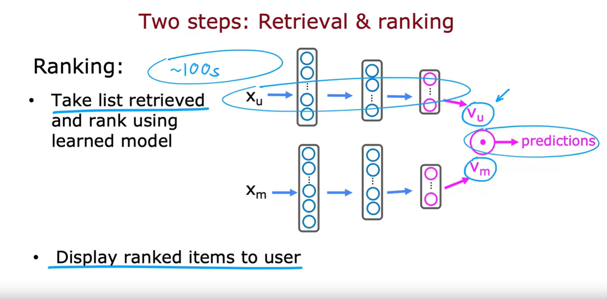

The second step of this is then the ranking step. 

During the ranking step, you will take the list retrieved during the retrieval step, so this may be just hundreds of possible movies, and rank them using the learned model.

And what that means is you will feed the user feature vector $x_u$ and the movie feature vector $x_m$ into this neural network and for each of the user movie pairs compute the predicted rating. 

And based on this, you now have all of the say 100+ movies, the ones that the user is most likely to give a high rating to and then you can just display the rank list of items to the user depending on what you think the user will give the highest rating to.

### Additional optimization

One additional optimization is that if you have computed $v_m$ for all the movies in advance, then all you need to do is to do inference on this part of the neural network (the user network) a single time to compute $v_u$ and then take that $v_u$ that you just computed for the user on your website right now and take the inner product between $v_u$ and $v_m$ for the movies that you have retrieved during the retrieval step. 

So, this computation can be done relatively quickly if the retrieval step just brings up say 100s of movies. 

One of the decisions you need to make for this algorithm is: How many items do you want to retrieve during the retrieval step to feed into the more accurate ranking step?

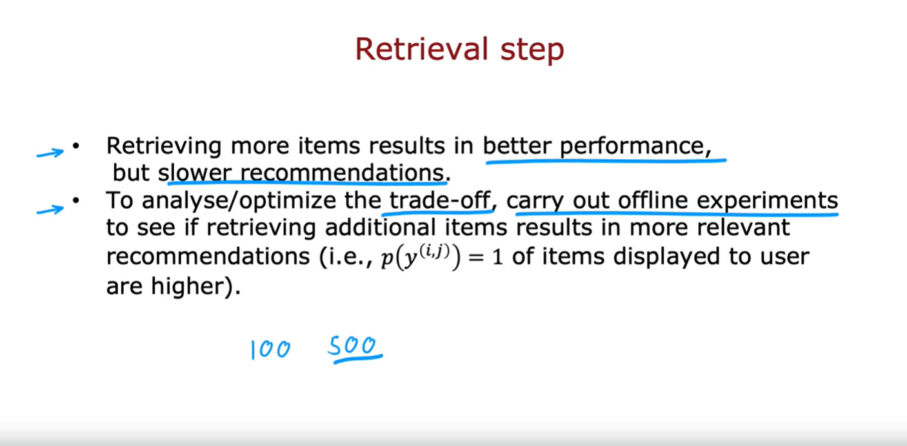

During the retrieval step, retrieving more items will tend to result in better performance but the algorithm will end up being slower.

To analyze or to optimize the trade off between how many items to retrieve to retrieve 100 or 500 or 1000 items, I would recommend carrying out offline experiments to see how much retrieving additional items results in more relevant recommendations and in particular, if the estimated probability that $y^{(i, j)} = 1$ according to your neural network model or if the estimated rating of *y* being high of the retrieved items according to your model's prediction ends up being much higher if only you were to retrieve say 500 items instead of only 100 items, then that would argue for maybe retrieving more items even if it slows down the algorithm a bit. 

But with the separate retrieval step and the ranking step, this allows many recommender systems today to give both fast as well as accurate results because the retrieval step tries to prune out a lot of items that are just not worth doing the more detailed influence and inner product on and then the ranking step makes a more careful prediction for what are the items that the user is actually likely to enjoy

### Summary

So, that's it. This is how you make your recommender system work efficiently even on very large catalogs of movies or products or what have you. 

Now, it turns out that as commercially important as our recommender systems, there are some significant ethical issues associated with them as well and unfortunately there have been recommender systems that have created harm. 

So, as you build your own recommender system, I hope you take an ethical approach and use it to serve your users and society as large as well as yourself and the company that you might be working for. 

Let's take a look at the ethical issues associated with recommender systems in the next video

## Ethical use of recommender systems

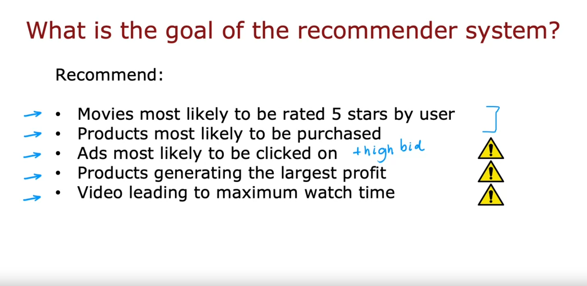

Even though recommender systems have been very profitable for some businesses, that happens, some use cases that have left people and society at large worse off. However, you use recommender systems or for that matter other learning algorithms, I hope you only do things that make society at large and people better off. Let's take a look at some of the problematic use cases of recommender systems, as well as ameliorations to reduce harm or to increase the amount of good that they can do. As you've seen in the last few videos, there are many ways of configuring a recommender system. When we saw binary labels, the label y could be, does a user engage or did they click or did they explicitly like an item? When designing a recommender system, choices in setting the goal of the recommender system and a lot of choices and deciding what to recommend to users. For example, you can decide to recommend to users movies most likely to be rated five stars by that user. That seems fine. That seems like a fine way to show users movies that they would like. Or maybe you can recommend to the user products that they are most likely to purchase. That seems like a very reasonable use of a recommender system as well. Versions of recommender systems can also be used to decide what ads to show to a user. One thing you could do is to recommend or really to show to the user ads that are most likely to be clicked on. Actually, what many companies will do is try to show ads that are likely to be clicked on and where the advertiser had put in a high bid because for many ad models, the revenue that the company collects depends on whether the ad was clicked on and what the advertiser had bid per-click. While this is a profit-maximizing strategy, there are also some possible negative implications of this type of advertising. I'll give a specific example on the next slide. One other thing that many companies do is try to recommend products that generate the largest profit. If you go to a website and search for a product today, there are many websites that are not showing you the most relevant product or the product that you are most likely to purchase. But is instead trying to show you the products that will generate the largest profit for the company. If a certain product is more profitable for them, because they can buy it more cheaply and sell it at a higher price, that gets ranked higher in the recommendations. Now, many companies view a pressure to maximize profit. This doesn't seem like an unreasonable thing to do but on the flip side, from the user perspective, when a website recommends to you a product, sometimes it feels it could be nice if the website was transparent with you about the criteria by which it is deciding what to show you. Is it trying to maximize their profits or trying to show you things that are most useful to you? On video websites or social media websites, a recommender system can also be modified to try to show you the content that leads to the maximum watch time. Specifically, websites that are an ad revenue tend to have an incentive to keep you on the website for a long time. Trying to maximize the time you spend on the site is one way for the site to try to get more of your time so they can show you more ads. Recommender systems today are used to try to maximize user engagement or to maximize the amount of time that someone spends on a site or a specific app. Whereas the first two of these seem quite innocuous, the third, fourth, and fifth, they may be just fine. They may not cause any harm at all. Or they could also be problematic use cases for recommender systems. Let's take a deeper look at some of these potentially problematic use cases.

Let me start with the advertising example. It turns out that the advertising industry can sometimes be an amplifier of some of the most harmful businesses. They can also be an amplifier of some of the best and the most fruitful businesses. Let me illustrate with a good example and a bad example. Take the travel industry. I think in the travel industry, the way to succeed is to try to give good travel experiences to users, to really try to serve users. Now it turns out that if there's a really good travel company, they can sell you a trip to fantastic destinations and make sure you and your friends and family have a lot of fun. Then a good travel business, I think will often end up being more profitable. The other business is more profitable. They can then bid higher for ads. It can afford to pay more to get users. Because it can afford to bid higher for ads an online advertising site will show its ads more often and drive more users to this good company. This is a virtuous cycle where the more users you serve well, the more profitable the business, and the more you can bid more for ads and the more traffic you get and so on. Just virtuous circle will maybe even tend to help the good travel companies do even better statistically example. Let's look at the problematic example. The payday loan industry tends to charge extremely high-interest rates, often to low-income individuals. One of the ways to do well in the payday loan business is to be really efficient as squeezing customers for every single dollar you can get out of them. If there's a payday loan company that is very good at exploiting customers, really squeezing customers for every single dollar, then that company will be more profitable. Thus they can be higher for ads. Because they can get bid higher for ads they will get more traffic sent to them. This allows them to squeeze even more customers and explore even more people for profit. This in turn, also increase a positive feedback loop. Also, a positive feedback loop that can cause the most exploitative, the most harmful payday loan companies to get sent more traffic. This seems like the opposite effect than what we think would be good for society. I don't know that there's an easy solution to this. These are very difficult problems that recommender systems face. One amelioration might be to refuse to set ads from exploitative businesses. Of course, that's easy to say. But how do you define what is an exploitative business and what is not, is a very difficult question. But as we build recommender systems for advertising or for other things, I think these are questions that each one of us working on these technologies should ask ourselves so that we can hopefully invite open discussion and debate, get multiple opinions from multiple people, and try to come up with design choices that allows our systems to try to do much more good than potential harm

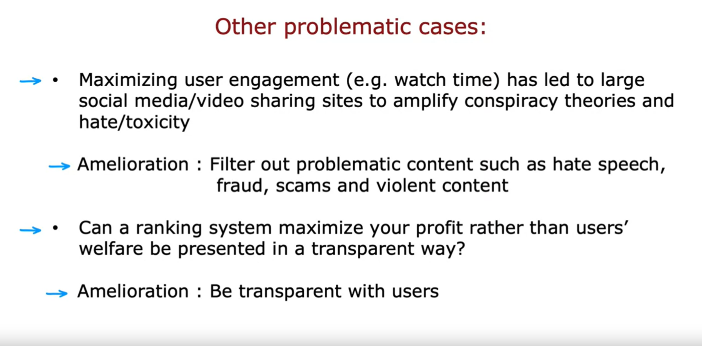

Let's look at some other examples. It's been widely reported in the news that maximizing user engagement such as the amount of time that someone watches videos on a website or the amount of time someone spends on social media. This has led to large social media and video sharing sites to amplify conspiracy theories or hate and toxicity because conspiracy theories and certain types of hate toxic content is highly engaging and causes people to spend a lot of time on it. Even if the effect of amplifying conspiracy theories amplify hidden toxicity turns out to be harmful to individuals and to society at large. One amelioration for this partial and imperfect is to try to filter out problematic contents such as hate speech, fraud, scams, maybe certain types the violent content. Again, the definitions of what exactly we should filter out is surprisingly tricky to develop. And this is a set of problems that I think companies and individuals and even governments have to continue to wrestle with. Just one last example. When a user goes to many apps or websites, I think users think the app or website I tried to recommend to the user thinks that they will like. I think many users don't realize that many apps and websites are trying to maximize their profit rather than necessarily the user's enjoyment of the media items that are being recommended. I would encourage you and other companies if at all possible, to be transparent with users about a criteria by which you're deciding what to recommend to them. I know this isn't always easy, but ultimately, I hope that being more transparent with users about why we're showing them and why will increase trust and also cause our systems to do more good for society. 

### Summary

Recommender systems are very powerful technology, a very profitable, a very lucrative technology. There are also some problematic use cases. If you are building one of these systems using recommender technology or really any other machine learning or other technology. I hope you think through not just the benefits you can create, but also the possible harm and invite diverse perspectives and discuss and debate. Please only build things and do things that you really believe can be society better off. I hope that collectively, all of us in AI can only do work that makes people better off. Thanks for listening. We have just one more video to go in recommender systems in which we take a look at some practical tips for how to implement a content-based filtering algorithm in TensorFlow. Let's go on to that last video on recommender systems.

## TensorFlow implementation of content-based filtering

In the practice lab, you will see how to implement content-based filtering in TensorFlow. What I'd like to do in this video is just set through of you a few of the key concepts in the code that you get to play with. Let's take a look.

Recall that our code has started with a user network as well as a movie network

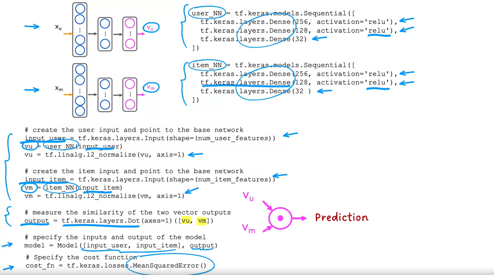

The way you can implement this in TensorFlow is very similar to how we have previously implemented a neural network with a set of dense layers.

### 1. The user network

We're going to use a sequential model. We then in this example have two dense layers with the number of hidden units specified here, and the final layer has 32 units and it outputs 32 numbers. 

### 2. The movie network

Then for the movie network, I'm going to call it the item network, because the movies are the items here, this is what the code looks like: Once again, we have a couple of dense hidden layers, followed by this layer, which outputs 32 numbers and for the hidden layers, we'll use our default choice of activation function, which is the RELU activation function. 

### 3a. Feeding the user features to the user neural network

Next, we need to tell TensorFlow Keras how to feed the user features or the item features, that is the movie features, to the two neural networks. This is the syntax for doing so. That extracts out the input features for the user and then feeds it to the user neural network that we had defined up here to compute $v_u$, the vector for the user. 

### 3b. Normalizing the vector $v_u$

Then one additional step that turns out to make this algorithm work a bit better is at this line here, which normalizes the vector $v_u$ to have length one. This normalizes the length, also called the l2 norm, but basically the length of the vector $v_u$ to be equal to one. 

### 4a. Feeding the movie features to the movie neural network

Then we do the same thing for the item network, for the movie network. This extracts out the item features and feeds it to the item neural network that we defined up there This computes the movie vector $v_m$. 

### 4b. Normalizing the vector $v_m$

Then finally, this step also normalizes that vector to have length one. 

### 5. Take the dot product between $v_u$ and $v_m$

After having computed $v_u$ and $v_m$, we then have to take the dot product between these two vectors. This is the syntax for doing so. Keras has a special layer type, notice we had here *tf.keras.layers.Dense*, here this is *tf.keras.layers.Dot*

It turns out that there's a special Keras layer, they just takes a dot product between two numbers and so we're going to use that to take the dot product between the vectors $v_u$ and $v_m$ and this gives the *output* of the neural network, this gives the final prediction. 

### 6. Specifying the inputs and the output of the model

Finally, to tell keras what are the inputs and outputs of the model, this line tells it that the overall model is a model with inputs being the user features and the movie or the item features and the output, this is output that we just defined up above. 

### 7. Specifying the cost function

The cost function that we'll use to train this model is going to be the mean squared error cost function. 

These are the key code snippets for implementing content-based filtering as a neural network and you will see the rest of the code in the practice lab but hopefully you'll be able to play with that and see how all these code snippets fit together into the working TensorFlow implementation of a content-based filtering algorithm. 

#### About the *tf.linalg.l2_normalize()* normalization

It turns out that there's one other step that I didn't talk about previously, but if you do this, which is normalize the length of the vector $v_u$, that makes the algorithm work a bit better. 

TensorFlow has this l2 normalized function that normalizes the vector. It is also called normalizing the l2 norm of the vector hence the name of the function. 

### Summary

So, that's it. Thanks for sticking with me through all this material on recommender systems, it is an exciting technology. 

I hope you enjoy playing with these ideas in code in the practice labs for this week. 

That takes us to the lots of these videos on recommender systems and to the end of the next to final week for this specialization. I look forward to seeing you next week as well. We'll talk about the exciting technology of reinforcement learning. 

Hope you have fun with the quizzes and with the practice labs and I look forward to seeing you next week.

## [Practice Quiz: Content-based filtering](../07-practice-quiz-content-based-filtering/)

## [Practice lab 2: Deep Learning for Content-Based Filtering](../08-practice-lab-2/)