## What is Reinforcement Learning?

Welcome to this final week of the machine learning specialization. It's a little bit bittersweet for me that we're approaching the end of this specialization, but I'm looking forward to this week, sharing with you some exciting ideas about reinforcement learning.

In machine learning, reinforcement learning is one of those ideas that while not very widely applied in commercial applications yet today, is one of the pillars of machine learning and has lots of exciting research backing it up and improving it every single day. 

So, let's start by taking a look at what is reinforcement learning. 

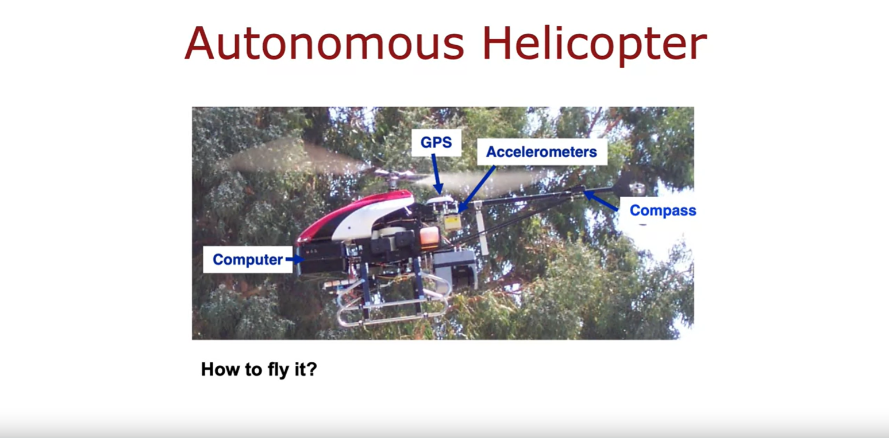

Let's start with an example. Here's a picture of an autonomous helicopter. This is actually the Stanford autonomous helicopter, it weights 32 pounds and it's actually sitting in my office right now. Like many other autonomous helicopters, it's instrumented with an onboard computer, GPS, accelerometers, and gyroscopes and the magnetic compass so it knows where it is at all times quite accurately and if I were to give you the keys to this helicopter and ask you to write a program to fly it, how would you do so?

Radio controlled helicopters are controlled with joysticks like these and so the task is ten times per second you're given the position and orientation and speed and so on of the helicopter and you have to decide how to move these two control sticks in order to keep the helicopter balanced in the air. 

By the way, I've flown radio controlled helicopters as well as quad rotor drones myself and radio controlled helicopters are actually quite a bit harder to fly, quite a bit harder to keep balanced in the air. 

So, how do you write a program to do this automatically? Let me show you a fun video of something we got a Stanford autonomous helicopter to do. Here's a video of it flying under the control of a reinforcement learning algorithm and let me play the video. I was actually the cameraman that day and this is how the helicopter flying on the computer control and if I zoom out the video, you see the trees planted in the sky. So, using reinforcement learning, we actually got this helicopter to learn to fly upside down. 

We told it to fly upside down and so reinforcement learning has been used to get helicopters to fly a wide range of stunts or we call them aerobatic maneuvers. 

By the way, if you're interested in seeing other videos, you can also check them out at this [URL: Heli Stanford](http://heli.stanford.edu)

### Reinforcement learning

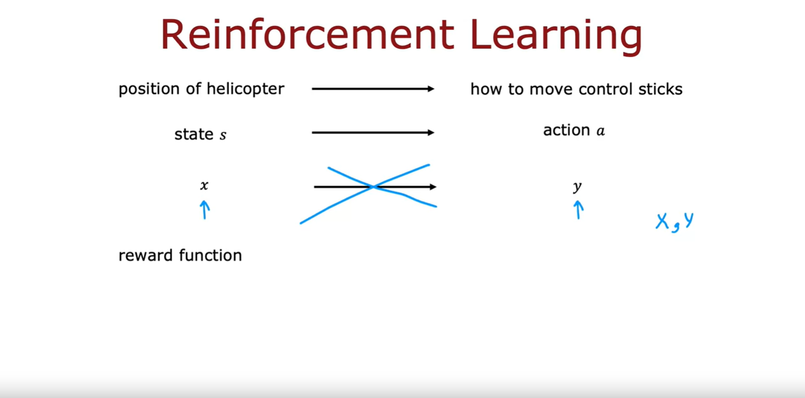

So, how do you get a helicopter to fly itself using reinforcement learning? The task is given the position of the helicopter to decide how to move the control sticks. 

In reinforcement learning, we call the position and orientation and speed and so on of the helicopter the **state s** and so the task is to find a function that maps from the state of the helicopter to an **action a**, meaning how far to push the two control sticks in order to keep the helicopter balanced in the air and flying and without crashing. 

#### Use supervised learning for it? No

One way you could attempt this problem is to use supervised learning. It turns out this is not a great approach for autonomous helicopter flying but you could say, well if we could get a bunch of observations of states x and maybe have an expert human pilot tell us what's the best action y to take you could then train a neural network using supervised learning to directly learn the mapping from the states s which I'm calling x here, to an action a which I'm calling the label y here.

But it turns out that when the helicopter is moving through the air is actually very ambiguous, what is the exact one right action to take. Do you tilt a bit to the left or a lot more to the left or increase the helicopter stress a little bit or a lot? It's actually very difficult to get a data set of x and the ideal action y. So, that's why for a lot of task of controlling a robot like a helicopter and other robots, the supervised learning approach doesn't work well and we instead use reinforcement learning. 

#### Reward function

Now, a key input to a reinforcement learning is something called the reward or the reward function which tells the helicopter when it's doing well and when it's doing poorly

So, the way I like to think of the reward function is a bit like training a dog: When I was growing up, my family had a dog and it was my job to train the dog or the puppy to behave. So, how do you get a puppy to behave well? Well, you can't demonstrate that much to the puppy. Instead you let it do its thing and whenever it does something good, you go, good dog and whenever they did something bad, you go, bad dog and then hopefully it learns by itself how to do more of the good dog and fewer of the bad dog things. 

So, training with the reinforcement learning algorithm is like that: When the helicopter's flying well, you go, good helicopter and if it does something bad like crash, you go, bad helicopter and then it's the reinforcement learning algorithm's job to figure out how to get more of the good helicopter and fewer of the bad helicopter outcomes. 

One way to think of why reinforcement learning is so powerful is you have to **tell it what to do rather than how to do it** and specifying the **reward function rather than the optimal action** gives you a lot more flexibility in how you design the system

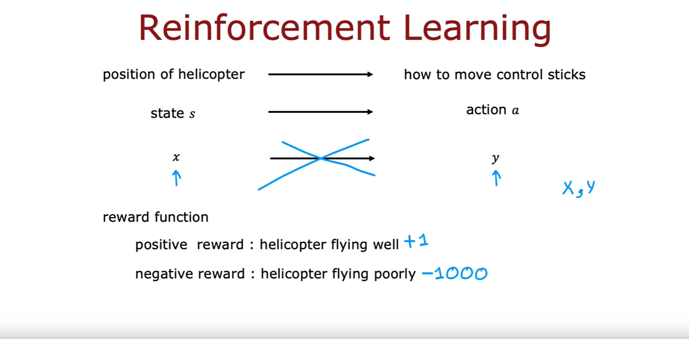

Concretely, for flying the helicopter, whenever it is flying well, you may give it a reward of plus one every second it is flying well and maybe whenever it's flying poorly you may give it a negative reward or if it ever crashes, you may give it a very large negative reward like negative 1,000 and so this would incentivize the helicopter to spend a lot more time flying well and hopefully to never crash

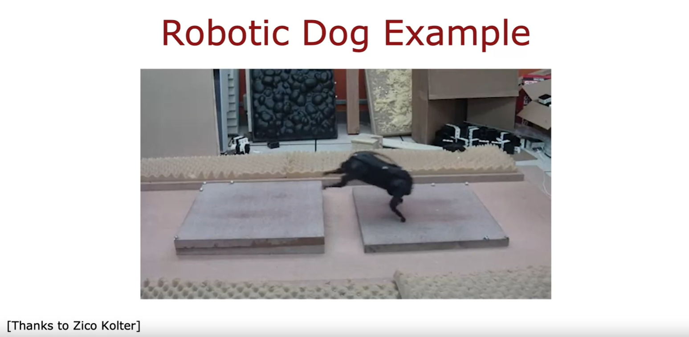

By the way, here's another fun video. I was using the good dog-bad dog analogy for reinforcement learning for many years. 

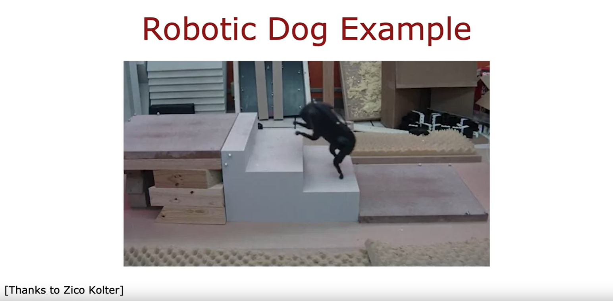

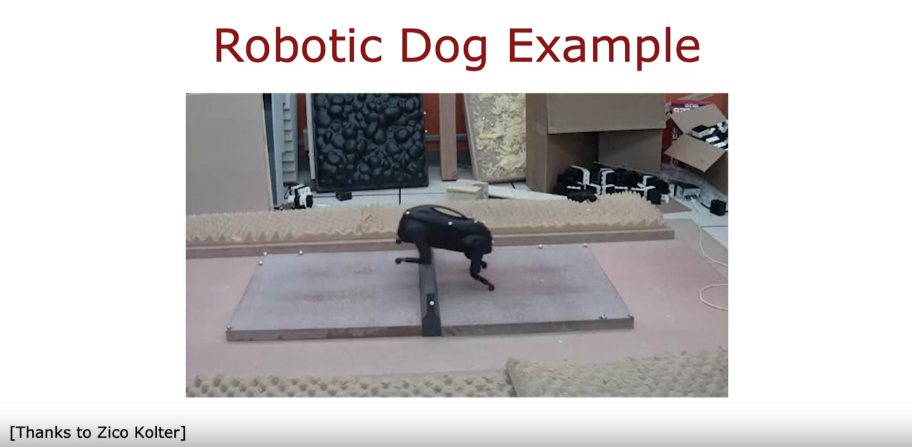

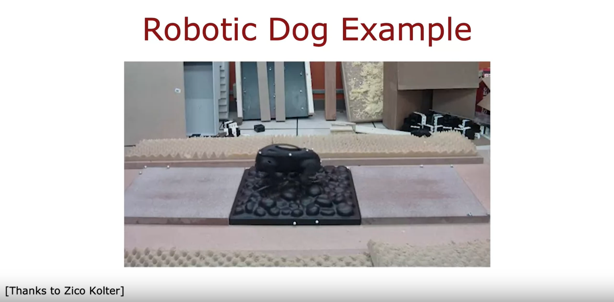

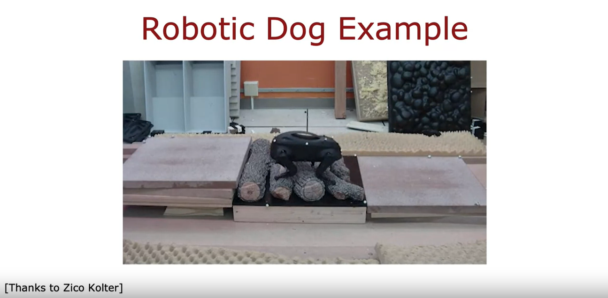

And then one day I actually managed to get my hands on a robotic dog and could actually use this reinforcement learning good dog-bad dog methodology to train a robot dog to get over obstacles. 

So, this is a video of a robot dog that using reinforcement learning, which rewards it moving toward the left of the screen has learned how to place its feet carefully or climb over a variety of obstacles and if you think about what it takes to program a dog like this, I have no idea, I really don't know how to tell it what's the best way to place its legs to get over a given obstacle. 

All of these things were figured out automatically by the robot just by giving it rewards that incentivizes it, making progress toward the goal on the left of the screen.

### Applications

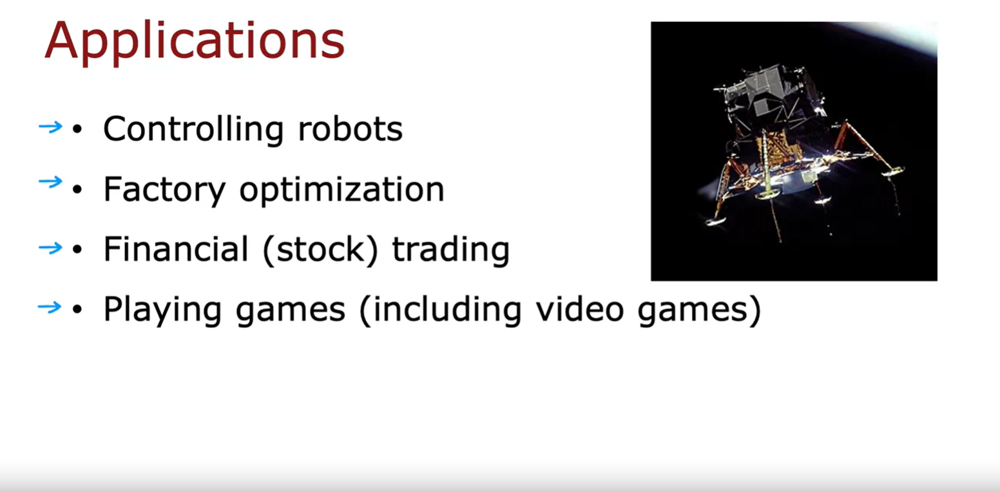

Today, reinforcement learning has been successfully applied to a variety of applications ranging from controlling robots and in fact later this week in the practice lab, you implement for yourself a reinforcement learning algorithm to land a lunar lander in simulation. 

It's also been used for factory optimization: How do you rearrange things in the factory to maximize throughput and efficiency as well as financial stock trading. For example, one of my friends was working on efficient stock execution. So, if you decided to sell a million shares over the next several days, well, you may not want to dump a million shares on the stock market suddenly because that will move prices against you. So, what's the best way to sequence out your trades over time so that you can sell the shares you want to sell and hopefully get the best possible price for them? 

Finally, there have also been many applications of reinforcement learning to playing games, everything from checkers to chess to the card game of bridge to go as well as for playing many video games

### Summary

So, that's reinforcement learning. Even though reinforcement learning is not used nearly as much as supervised learning, it is still used in a few applications today and the key idea is rather than you needing to tell the algorithm what is the right output *y* for every single input, all you have to do instead is specify a reward function that tells it when it's doing well and when it's doing poorly and it's the job of the algorithm to automatically figure out how to choose good actions. 

With that, let's now go into the next video where we'll formalize the reinforcement learning problem and also start to develop algorithms for automatically picking good actions

## Mars rover example

To fresh out the reinforcement learning formalism, instead of looking at something as complicated as a helicopter or a robot dog, we can use a simplified example that's loosely inspired by the Mars rover. 

This is adapted from the example due to Stanford professor Emma Branskill and one of my collaborators, Jagriti Agrawal, who had actually written code that is actually controlling the Mars rover right now that also helped me talk through and helped develop this example. Let's take a look. 

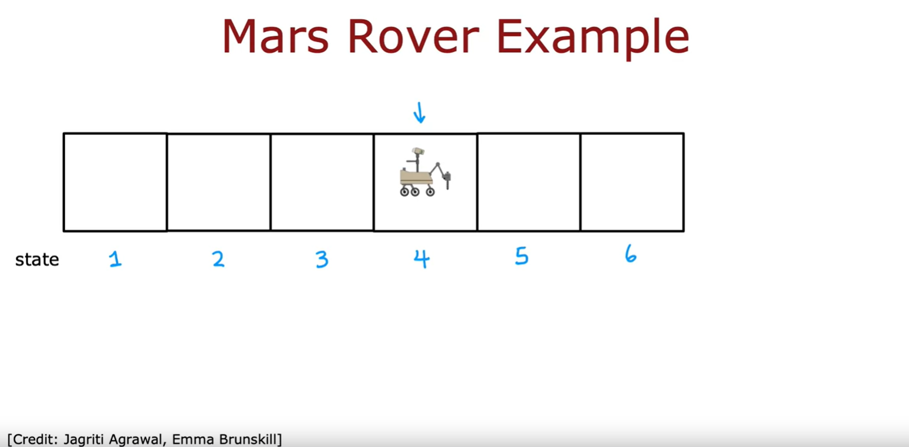

We'll develop reinforcement learning using a simplified example inspired by the Mars rover. 

In this application, the rover can be in any of six positions, as shown by the six boxes here and the rover might start off, say, in this position, in the fourth box shown here. 

The position of the Mars rover is called the **state** in reinforcement learning, and I'm going to call these six states, state 1, state 2, state 3, state 4, state 5, and state 6, and so the rover is starting off in state 4. 

Now, the rover was sent to Mars to try to carry out different science missions. It can go to different places, to use its sensors such as a drill, or a radar, or a spectrometer to analyze the rock at different places on the planet, or go to different places to take interesting pictures for scientists on earth to look at.

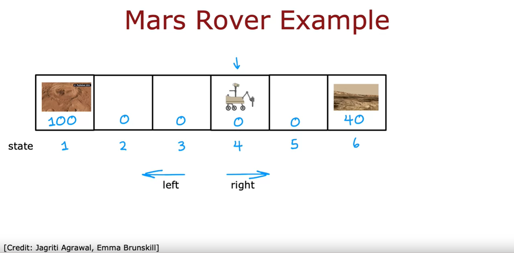

In this example, state 1 here on the left has a very interesting surface that scientists would love for the rover to sample and state 6 also has a pretty interesting surface that scientists would quite like the rover to sample, but not as interesting as state 1. 

We would more likely to carry out the science mission at state 1 than at state 6, but state 1 is further away. The way we will reflect state 1 being potentially more valuable is through the reward function. 

So, the reward at state 1 is a 100, and the reward at stage 6 is 40, and the rewards at all of the other states in-between, I'm going to write as a reward of zero because there's not as much interesting science to be done at these states 2, 3, 4, and 5. 

On each step, the rover gets to choose one of two actions: It can either go to the left or it can go to the right. So, the question is, what should the rover do? In reinforcement learning, we pay a lot of attention to the rewards because that's how we know if the robot is doing well or poorly.

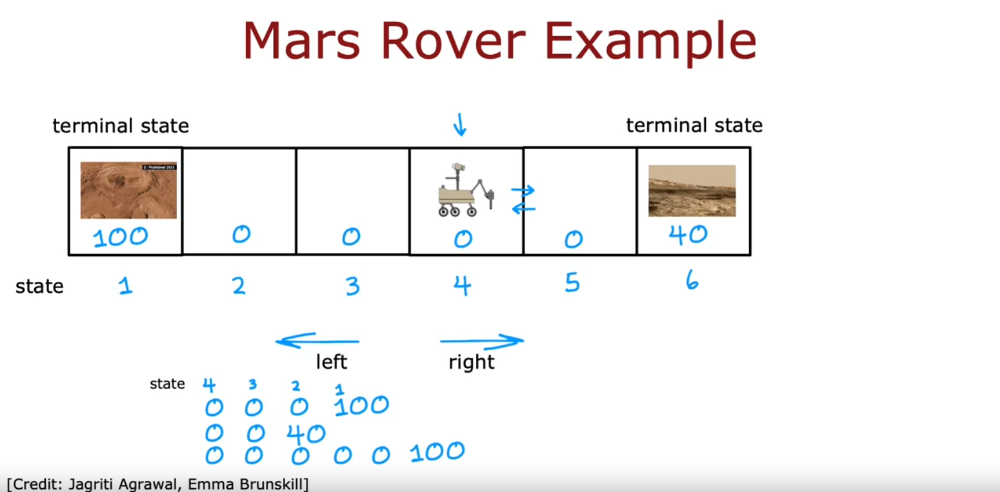

Let's look at some examples of what might happen:

#### Situation 1: Robot goes to the left

If the robot were to go left, starting from state 4, then initially starting from state 4, it will receive a reward of zero and after going left, it gets to state 3, where it receives again a reward of zero, then it gets to state 2, receives a reward of 0, and finally just to state 1, where it receives a reward of 100. 

### Terminal state concept

For this application, I'm going to assume that when it gets either state 1 or state 6, that the day ends. In reinforcement learning, we sometimes call this a **terminal state** and what that means is that, after it gets to one of these terminals states, gets a reward at that state, but then nothing more happens after that. Maybe the robots run out of fuel or ran out of time for the day, which is why it only gets to either enjoy the 100 or the 40 reward, but then that's it for the day. It doesn't get to earn additional rewards after that.

#### Situation 2: Robot goes to the right

Now, instead of going left, the robot could also choose to go to the right, in which case from state 4, it would first have a reward of zero, and then it'll move right and get to state 5, have another reward of zero, and then it will get to this other terminal state on the right, state 6 and get a reward of 40.

#### Situation 3: Robot goes to the right and then to the left

But going left and going right are the only options. One thing the robot could do is it can start from state 4 and decide to move to the right. So, it goes from state 4-5, gets a reward of zero in state 4 and a reward of zero in state 5, and then maybe it changes its mind and decides to start going to the left as follows, in which case, it will get a reward of zero at state 4, at state 3, at state 2, and then the reward of 100 when it gets to state 1. 

In this sequence of actions and states, the robot is wasting a bit of time. So this maybe isn't such a great way to take actions, but it is one choice that the algorithm could pick, but hopefully you won't pick this one

#### $(s, a, R(s), s')$

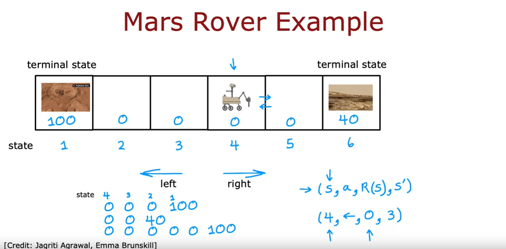

So, to summarize, at every time step, the robot is in some state, which I'll call *s*, and it gets to choose an action *a*, and it also enjoys some rewards, *R(s)* that it gets from that state s and as a result of this action *a*, it gets to some new state $s'$:

$$ (s, a, R(s), s') $$

As a concrete example, when the robot was in state 4 and it took the action "go left", it maybe didn't enjoy the reward of zero associated with that state 4 and it won't have any new state 3:

$$ (4, \leftarrow , 0, 3) $$

When you learn about specific reinforcement learning algorithms, you see that these four things: 

- the state $s$
- the action $a$
- the reward $R(s)$
- the next state $s'$

which is what happens basically every time you take an action that just be a core elements of what reinforcement learning algorithms will look at when deciding how to take actions. 

Just for clarity, the reward here, $R(s)$, this is the reward associated with this state *s*, this reward of zero is associated with state 4, $s$, rather than with state 3, $s'$

### Summary

That's the formalism of how a reinforcement learning application works. 

In the next video, let's take a look at how we specify exactly what we want the reinforcement learning algorithm to do. 

In particular, we'll talk about an important idea in reinforcement learning called **the return**. 

Let's go on to the next video to see what that means.

## The Return in reinforcement learning

You saw in the last video, what are the states of reinforcement learning application, as well as how depending on the actions you take, you go through different states and also get to enjoy different rewards. 

But how do you know if a particular set of rewards is better or worse than a different set of rewards? The return in reinforcement learning, which we'll define in this video, allows us to capture that. 

As we go through this, one analogy that you might find helpful is if you imagine you have a five-dollar bill at your feet, you can reach down and pick up, or half an hour across town, you can walk half an hour and pick up a 10-dollar bill. Which one would you rather go after? Ten dollars is much better than five dollars, but if you need to walk for half an hour to go and get that 10-dollar bill, then maybe it'd be more convenient to just pick up the five-dollar bill instead. 

So, the concept of a return captures that rewards you can get quicker are maybe more attractive than rewards that take you a long time to get to. Let's take a look at exactly how that works.

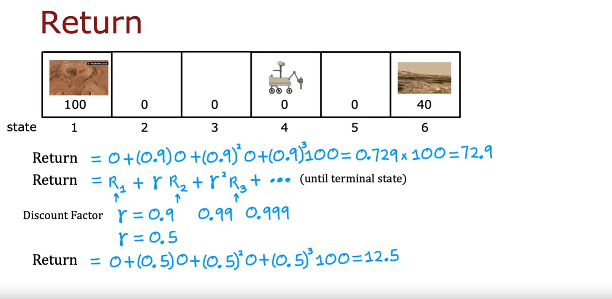

Here's a Mars Rover example. 

If starting from state 4, you go to the left, we saw that the rewards you get would be zero on the first step from state 4, zero from state 3, zero from state 2, and then 100 at state 1, the terminal state. 

The return is defined as the sum of these rewards but weighted by one additional factor, which is called the discount factor gamma $\gamma$. 

The discount factor is a number a little bit less than 1, so let me pick 0.9 as the discount factor. I'm going to weight the reward in the first step is just zero, the reward in the second step is a discount factor, 0.9 times that reward, and then plus the discount factor^2 times that reward, and then plus the discount factor^3 times that reward. 

If you calculate this out, this turns out to be 0.729 times 100, which is 72.9

The more general formula for the return is that if your robot goes through some sequence of states and gets reward $R_1$ on the first step, and $R_2$ on the second step, and $R_3$ on the third step, and so on, then the return is $R_1$ plus the discount factor gamma $\gamma$, this Greek alphabet gamma $\gamma$ which I've set to 0.9 in this example, the gamma $\gamma * R_2$ plus gamma $\gamma^2 * R_3$ plus gamma $\gamma^3 * R_4$, and so on, until you get to the terminal state. 

### What really gamma does. Its impact

What the discount factor gamma $\gamma$ does is it has the effect of making the reinforcement learning algorithm a little bit impatient because the return gives full credit to the first reward is 100 percent is $1 * R_1$, but then it gives a little bit less credit to the reward you get at the second step is multiplied by 0.9, and then even less credit to the reward you get at the next time step $R_3$, and so on, and so getting rewards sooner results in a higher value for the total return. 

In many reinforcement learning algorithms, a common choice for the discount factor will be a number pretty close to 1, like 0.9, or 0.99, or even 0.999 but for illustrative purposes in the running example I'm going to use, I'm actually going to use a discount factor of 0.5. 

So, this very heavily down weights or very heavily we say discounts rewards in the future, because with every additional passing time step, you get only half as much credit as rewards that you would have gotten one step earlier. 

If gamma $\gamma = 0.5$, the return under the example above would have been 0 plus 0.5 times 0, replacing this equation on top, plus 0.5^2, 0 plus 0.5^3 times 100. That's the last reward because state 1 is a terminal state, and this turns out to be a return of 12.5

### Applications of the discount factor $\gamma$ on other industries

In financial applications, the discount factor also has a very natural interpretation as the interest rate or the time value of money. 

If you can have a dollar today, that may be worth a little bit more than if you could only get a dollar in the future because even a dollar today you can put in the bank, earn some interest, and end up with a little bit more money a year from now. 

So, for financial applications, often, that discount factor represents how much less is a dollar in the future where I've compared to a dollar today. 

### Examples of returns

Let's look at some concrete examples of returns. 

The return you get depends on the rewards, and the rewards depends on the actions you take, and so the return depends on the actions you take. 

#### Example 1: Always go to the left

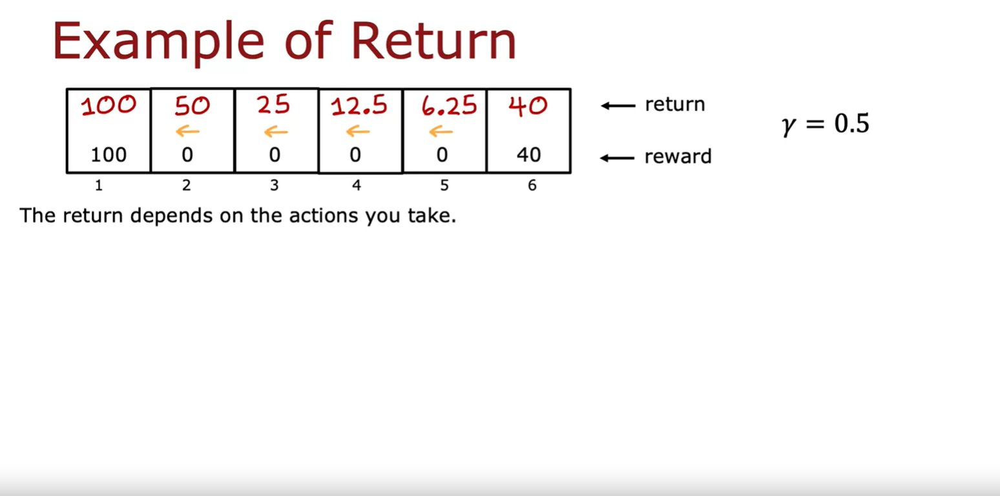

Let's use our usual example and say for this example, I'm going to always go to the left. We already saw previously that if the robot were to start off in state 4, the return is 12.5 as we worked out on the previous slide. 

It turns out that if it were to start off in state three, the return would be 25 because it gets to the 100 reward one step sooner, and so it's discounted less. 

If it were to start off in state 2, the return would be 50 and if it were to just start off and state 1, well, it gets the reward of 100 right away, so it's not discounted at all and so the return if we were to start out in state 1 will be 100 and then the return in these two states are 6.25. 

It turns out if you start off in state 6, which is terminal state, you just get the reward and thus the return of 40

#### Example 2: Always go to the right

Now, if you were to take a different set of actions, the returns would actually be different

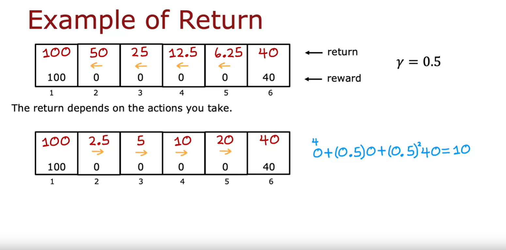

For example, if we were to always go to the right, if those were our actions, then if you were to start in state 4, get a reward of 0, then you get to state 5, get a reward of 0, and it gets to state 6 and get a reward of 40. 

In this case, the return would be 0 plus 0.5, the discount factor times 0 plus 0.5 squared times 40, and that turns out to be equal to 0.5 squared is 1/4, so 1/4 of 40 is 10 and so, the return from this state, from state 4 is 10, if you were to take actions, always go to the right. 

Through similar reasoning, the return from this state 5 is 20, the return from this state 3 is five, the return from this state 2 is 2.5 and then the return from the terminal state 1 is 100 and the return from the state 6 is 40. 

By the way, if these numbers don't fully make sense, feel free to pause the video and double-check the math and see if you can convince yourself that these are the appropriate values for the return for if you start from different states, and if you were to always go to the right. 

We see that if it would always go to the right, the return you expect to get is lower for most states. Maybe always going to the right isn't as good an idea as always going to the left

#### Example 3: Not always go to the left or to the right

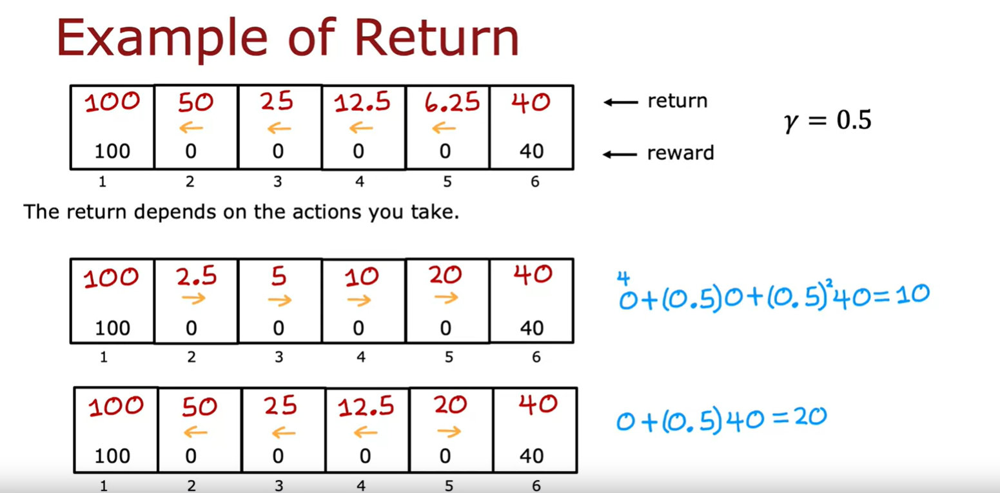

But it turns out that we don't have to always go to the left or always go to the right: We could also decide: if you're in state 2, go left. If your in state 3, go left. If you're in state 4, go left but if you're in state 5, then you're so close to this reward, let's go right. 

This will be a different way of choosing actions to take based on what state you're in. 

It turns out that the return you get from the different states will be 100, 50, 25, 12.5, 20, and 40

Just to illustrate one case: If you were to start off in state 5, here you would go to the right, and so the rewards you get would be: zero first in state 5, and then 40 and so the return is zero, the first reward, plus the discount factor is 0.5 times 40, which is 20, which is why the return from this state is 20 if you take actions shown here.

### Summary

To summarize, the return in reinforcement learning is the sum of the rewards that the system gets but weighted by the discount factor gamma $\gamma$, where rewards in the far future are weighted by the discount factor raised to a higher power. 

Now, this actually has an interesting effect when you have systems with negative rewards. 

In the example we went through, all the rewards were zero or positive but if there are any rewards are negative, then the discount factor actually incentivizes the system to push out the negative rewards as far into the future as possible. 

Taking a financial example, if you had to pay someone $10, maybe that's a negative reward of minus 10 but if you could postpone payment by a few years, then you're actually better off because $10 a few years from now because of the interest rate is actually worth less than $10 that you had to pay today

For systems with negative rewards, it causes the algorithm to try to push out the negative rewards as far into the future as possible and for financial applications and for other applications, that actually turns out to be right thing for the system to do. 

You now know what is the **return** in reinforcement learning, let's go on to the next video to formalize the goal of reinforcement learning algorithm

## Making decisions: Policies in reinforcement learning

Let's formalize how a reinforcement learning algorithm picks actions. 

In this video, you'll learn about what is a policy in reinforcement learning algorithm. Let's take a look. 

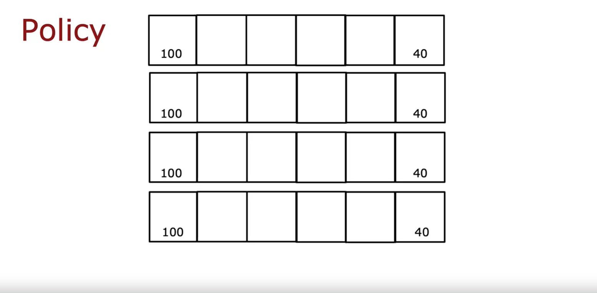

As we've seen, there are many different ways that you can take actions in the reinforcement learning problem.

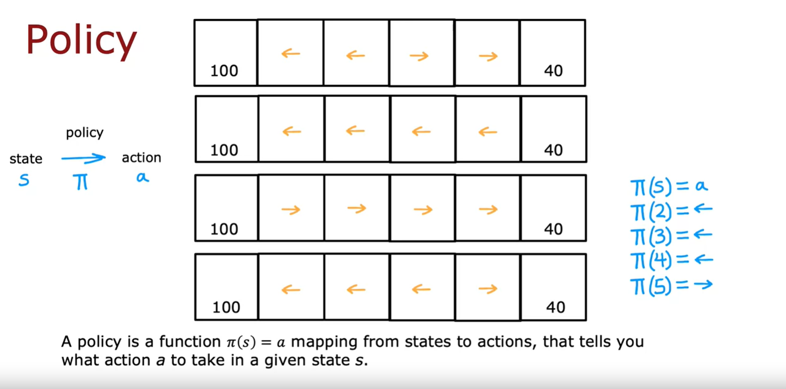

#### Example 1: Always go for the nearer reward

For example, we could decide to always go for the nearer reward: So, you go left if this leftmost reward is nearer or go right if this rightmost reward is nearer.

#### Example 2: Always go for the larger reward

Another way we could choose actions is to always go for the larger reward

#### Example 3: Always go for the smaller reward

Or we could always go for the smaller reward, doesn't seem like a good idea, but it is another option

#### Example 4: Always go for the smaller reward

Or you could choose to go left unless you're just one step away from the lesser reward, in which case, you go for that one. 

### Concept of policy

In reinforcement learning, our goal is to come up with a function which is called a Policy $\pi$, whose job it is to take as input any state $s$ and map it to some action $a$ that it wants us to take. 

#### Example of policy

For example, for this policy here at the bottom (the 4th one), this policy would say that if you're in state 2, then it maps us to the left action. If you're in state 3, the policy says go left. If you are in state 4 also go left and if you're in state 5, go right.

So, pi applied to state $s$ tells us what action $a$ it wants us to take in that state $s$: 

$$ \pi(s) = a $$

### The goal of reinforcement learning

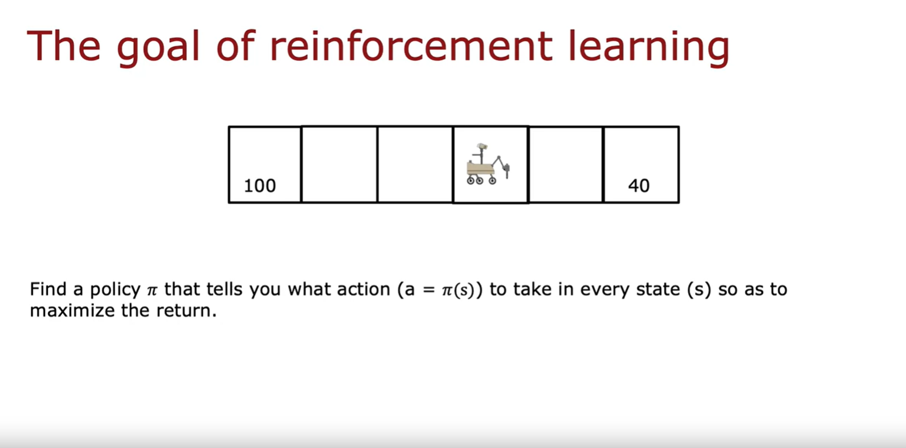

The goal of reinforcement learning is to find a policy $\pi$ or $\pi(s)$ that tells you what action to take in every state so as to maximize the return. 

By the way, I don't know if policy is the most descriptive term of what pi is, but it's one of those terms that's become standard in reinforcement learning. 

Maybe calling Pi a controller rather than a policy would be more natural terminology but policy is what everyone in reinforcement learning now calls this

### Summary

In the last video, we've gone through quite a few concepts in reinforcement learning from states to actions to reward to returns to policies. 

Let's do a quick review of them in the next video and then we'll go on to start developing algorithms for finding that policies. Let's go on to the next video.

## Review of key concepts

We've developed a reinforcement learning formalism using the six state Mars rover example. Let's do a quick review of the key concepts and also see how this set of concepts can be used for other applications as well. 

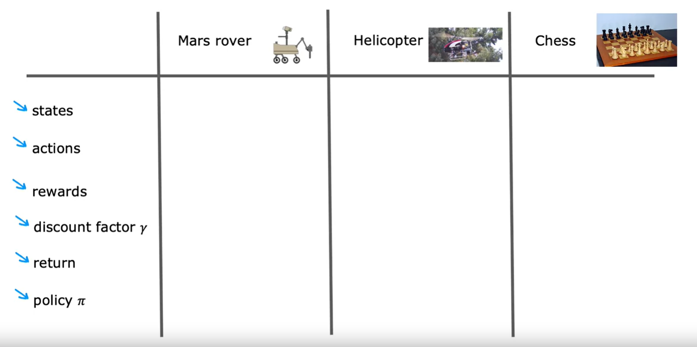

Some of the concepts we've discussed are:

- states of a reinforcement learning problem,
- the set of actions, 
- the rewards, 
- a discount factor, 
- then how rewards and the discount factor are together used to compute the return, 
- and then finally, a policy whose job it is to help you pick actions so as to maximize the return.

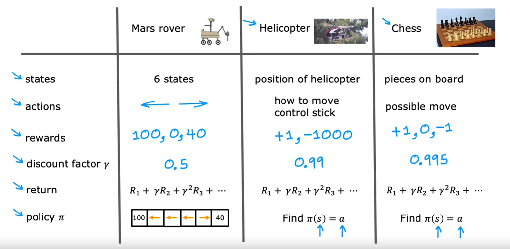

### Mars rover example

For the Mars rover example, we had six states that we numbered 1-6 and the actions were to go left or to go right. The rewards were 100 for the leftmost state, 40 for the rightmost state, and zero in between and I was using a discount factor of 0.5. The return was given by this formula and we could have different policies Pi to pick actions depending on what state you're in. 

### Helicopter example

This same formalism of states, actions, rewards, and so on can be used for many other applications as well. Take the problem of find an autonomous helicopter. To set a state would be the set of possible positions and orientations and speeds and so on of the helicopter. The possible actions would be the set of possible ways to move the controls stick of a helicopter, and the rewards may be a plus one if it's flying well, and a negative 1,000 if it doesn't fall really bad or crashes. Reward function that tells you how well the helicopter is flying. The discount factor, a number slightly less than one maybe say, 0.99 and then based on the rewards and the discount factor, you compute the return using the same formula. The job of a reinforcement learning algorithm would be to find some policy $\pi(s)$ so that given as input, the position of the helicopter s, it tells you what action to take. That is, tells you how to move the control sticks. 

### Chess example

Here's one more example. Here's a game-playing one. Say you want to use reinforcement learning to learn to play chess. The state of this problem would be the position of all the pieces on the board. By the way, if you play chess and know the rules well, I know that there is a little bit more information than just the position of the pieces is important for chess, but I'll simplify it a little bit for this video. The actions are the possible legal moves in the game, and then a common choice of reward would be if you give your system a reward of plus one if it wins a game, minus one if it loses the game, and a reward of zero if it ties a game. For chess, usually a discount factor very close to one will be used, so maybe 0.99 or even 0.995 or 0.999 and the return uses the same formula as the other applications. Once again, the goal is given a board position to pick a good action using a policy Pi.

### Markov Decision Process (MDP)

This formalism of a reinforcement learning application actually has a name. It's called a Markov decision process, and I know that sounds like a big technical complicated term but if you ever hear this term *Markov decision process* or MDP for short, that's just the formalism that we've been talking about in the last few videos. 

> [!IMPORTANT]
> The term Markov in the MDP or Markov decision process refers to that the future only depends on the current state and not on anything that might have occurred prior to getting to the current state. 

In other words, in a Markov decision process, the future depends only on where you are now, not on how you got here. 

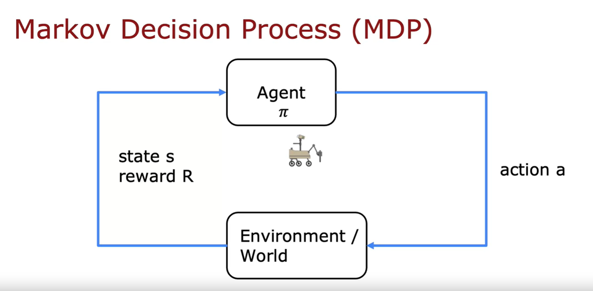

One other way to think of the Markov decision process formalism is that we have a robot or some other agent that we wish to control and what we get to do is choose actions $a$ and based on those actions, something will happen in the world or in the environment, such as our position in the world changes or we get to sample a piece of rock and execute the science mission. 

The way we choose the action $a$ is with a policy Pi and based on what happens in the world, we then get to see or we observe back what state we're in, as well as what rewards are that we get. 

You sometimes see different authors use a diagram like this to represent the Markov decision process or the MDP formalism but this is just another way of illustrating the set of concepts that you learned about in the last few videos. 

### Summary

You now know how a reinforcement learning problem works. 

In the next video we'll start to develop an algorithm for picking good actions. 

The first step toward that will be to define and then eventually learn to compute the state action value function. 

This turns out to be one of the key quantities for when we want to develop a learning algorithm. 

Let's go on to the next video to see what is this **state action value function**

## [Practice quiz: Reinforcement learning introduction](../02-practice-quiz-reinforcement-learning-introduction/)