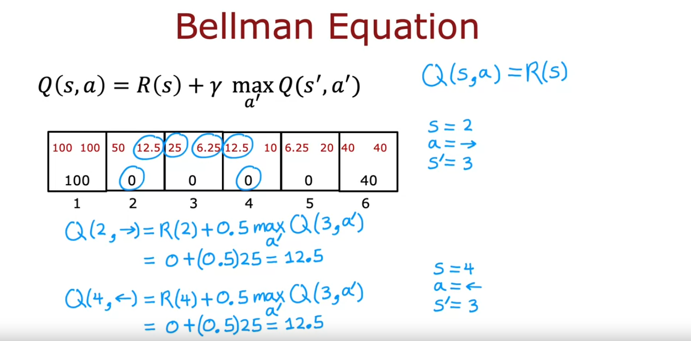

## state-action value function definition

When we start to develop Reinforcement Learning algorithms later this week, you will see that there's a key quantity that Reinforcement Learning algorithms will try to compute and that's called the state action value function. Let's take a look at what this function is. 

The state action value function is a function typically denoted by the letter uppercase *Q* and it's a function of a state $s$ you might be in as well as the action *a* you might choose to take in that state $s$

And $Q(s, a)$ will give a number that equals the return if you start in that state $s$ and take the action *a* just once and after taking action *a* once you then behave optimally after that. 

So, after that you take whatever actions will result in the highest possible return. 

Now, you might be thinking there's something a little bit strange about this definition because how do we know what is the optimal behavior? And if we knew what the optimal behavior, if we already knew what's the best action to take in every state, why do we still need to compute $Q(s, a)$ because we already have the optimal policy. 

So, I do want to acknowledge that there's something a little bit strange about this definition. There's almost something a little bit circular about this definition but rest assured when we look at specific Reinforcement Learning algorithms later will resolve this slightly circular definition and will come up with a way to compute the *Q function* even before we've come up with the optimal policy but you will see that in a later video, so don't worry about this for now. 

### Example

Let's look at an example. 

We saw previously that this is a pretty good policy: 

"Go left from states 2, 3 and 4 and go right from state 5"

It turns out that this is actually the optimal policy for the mars rover application when the discount factor gamma $\gamma = 0.5$

So, $Q(s, a)$ will be equal to the total return if you start from state $s$, take the action *a* and then behave optimally after that meaning take actions according to this policy shown over here. 

Let's figure out what $Q(s, a)$ is for a few different states: 

#### Situation 1: $Q(2, \rightarrow)$

Let's look at say Q of state 2 and what if we take the action to go right: 

Well, if you're in state two and you go right, then you end up at state three and then after that you behave optimally you're going to go left from state three and then go left from state two and then eventually you get the reward of 100. 

In this case, the rewards you get would be: zero from state 2, zero when you get to state 3, zero when you get back to state 2 and then 100 when you finally get to the terminal state 1 and so the return will be: zero plus 0.5 times that plus 0.5 squared times times that plus 0.5 cubed times 100 and this turns out to be 12.5 and so $Q(2, \rightarrow) = 12.5$

Note that this passes, no judgment on whether going right is a good idea or not. It's actually not that good an idea from state two to go right, but it just faithfully reports out the return if you take action *a* and then behave optimally afterwards. 

#### Situation 2: $Q(2, \leftarrow)$

Here's another example. 

If you're in state 2 and you were to go left, then the sequence of rewards you get will be zero when you're in state two followed by 100 and so the return is zero plus 0.5 times 100 and that's equal to 50, $Q(2, \leftarrow) = 50$

In order to write down the values of $Q(s, a)$ in this diagram, I'm going to write 12.5 here on the right to denote that this is Q of state two going to the right and then when I write a little 50 here on the left to denote that this is Q of state two and going to the left

#### Situation 3: $Q(4, \leftarrow)$

Just to take one more example What if we're in state four and we decide to go left. 

Well, if you're in state four you go left, you get rewards zero and then you take action left here. So, zero again, take action left here, zero and then 100, so $Q(4, \leftarrow) = 12.5$

So, $Q(4, \leftarrow)$ results in rewards zero because the first action is left and then because we followed the optimal policy afterwards, you can reward 0, 0, 100 and so the return is zero plus 0.5 times that plus 0.5 squared times that plus 0.5 cubed times that which is therefore equal to 12.5 so, $Q(4, \leftarrow) = 12.5$

#### Situation 4: All the other combinations

And it turns out if you were to carry out this exercise for all of the other states and all of the other actions, you end up with this being the $Q(s, a)$ for different states and different actions

And then finally at the terminal state well it doesn't matter what you do, you just get that terminal reward 100 or 40. So, just write down those terminal awards over here. 

So, this is $Q(s, a)$ for every state state one through six and for the two actions, action left and action right. 

Because the state action value function is almost always denoted by the letter Q, this is also often called the *Q function*. So, the terms **Q-function** and **state action value function** are used interchangeably and it tells you what are your returns? or really what is the value? How good is it? Just take action *a* and state $s$ and then behave optimally after that

### Picking actions

Now, it turns out that once you can compute the *Q function*, this will give you a way to pick actions as well. 

Here's the policy and return and here are the values $Q(s, a)$ from the previous slide. 

> [!NOTE]
> You notice one interesting thing when you look at the different states which is that if you take state two taking the action left results in a q value or state action value of 50 which is actually the best possible return you can get from that state. 
> 
> In state three, $Q(s, a)$ for the action *a* being left also gives you that higher return, in state four the action left gives you the return you want and in state five is actually the action going to the right that gives you that higher return of 20 

So, it turns out that the best possible return from any state $s$ is the largest value of $Q(s, a)$ maximizing over *a*:

$$ \text{max}_a \text{ } Q(s, a) $$

Just to make sure this is clear what I'm saying is that in say state 4, there is Q of state four left which is 12.5 and Q of state four right which turns out to be 10 and the larger of these two values which is 12.5 is the best possible return from that state four. 

In other words, the highest return you can hope to get from state 4 is 12.5 and it's actually the larger of these two numbers 12.5 and 10

And moreover, if you want your Mars Rover to enjoy a return of 12.5 rather than say 10 then the action you should take is the action *a* that gives you the larger value of $Q(s, a)$. 

So, the best possible action in state $s$ is the action *a* that actually maximizes $Q(s, a)$. 

So, this might give you a hint for why computing $Q(s, a)$ is an important part of the Reinforcement Learning algorithm that we will build later. 

Namely, if you have a way of computing $Q(s, a)$ for every state $s$ and for every action *a*, then when you're in some state $s$, all you have to do is look at the different actions *a* and pick the action *a* that maximizes $Q(s, a)$ and so $\pi(s)$ can just pick the action *a* that gives the largest value of $Q(s, a)$ and that will turn out to be a good action *a* 

In fact, it turned out to be the optimal action *a* 

Another intuition about why this makes sense is $Q(s, a)$ is returned if you start in state $s$ and take the action *a* and then behave optimally after that. So, in order to earn the biggest possible return, what you really want is to take the action *a* that results in the biggest total return. 

That's why if only we have a way of computing $Q(s, a)$ for every state taking the action *a* that maximizes return under these circumstances seems like it's the best action to take in that state. 

Although this isn't something you need to know for this course, I want to mention also that if you look online or look at the Reinforcement Learning literature, sometimes you will also see this *Q function* written as Q star, $Q*$ instead of Q and this *Q function* is sometimes also called the **optimal Q function**

These terms just refer to the *Q function* exactly as we've defined it. So, if you look at the Reinforcement Learning literature and read about Q star or the optimal Q function, that just means the state action value function that we've been talking about but for the purposes of this course you don't need to worry about this. 

So, to summarize, if you can compute $Q(s, a)$ for every state $s$ and every action *a*, then that gives us a good way to compute the optimal policy $\pi(s)$

### Summary

So, that's the state action value function or the *Q function*. 

We'll talk later about how to come up with an algorithm to compute it despite the slightly circular aspect of the definition of the *Q function* but first let's take a look at the next video at some specific examples of what these values $Q(s, a)$ actually look like

## state-action value function example

Using the Mars Rover example, you're seeing what the values of $Q(s, a)$ are like. 

In order to keep holding our intuition about Reinforcement Learning problems and how the values of $Q(s, a)$ change depending on the problem, we have provided an optional lab that lets you play around, modify the mars rover example and see for yourself how $Q(s, a)$ will change. Let's take a look. 

Here's a Jupyter Notebook that I hope you play with after watching this video. I'm going to run these helper functions (numpy and utils), now notice here that this specifies the number six for the amount of states $s$ and also the two actions *a* (left and right), so I wouldn't change these and this specifies the terminal left in the terminal right rewards which has been 100 and 40 and then zero was the rewards of the intermediate states. 

The discount factor gamma 0.5 and let's ignore the misstep probability for now, we'll talk about that in a later video. 

And with these values, if you run this code, this will compute and visualize the optimal policy as well as the Q function $Q(s, a)$. 

You will learn later about how to develop a learning algorithm to estimate or compute $Q(s, a)$ yourself so for now don't worry about what code we have written to compute $Q(s, a)$ but you see that the values here $Q(s, a)$ are the values we saw in the lecture. 

### Example 1:
#### Changing the terminal right reward from 40 to 10

Now here's where the fun starts.

Let's change around some of the values and see how these things change. I'm going to update the terminal right reward to a much smaller value says only 10. If I now rerun the code, look at how $Q(s, a)$ changes and now thinks that if you're in state 5, then if you go left and behave optimally you get 6.25 whereas if you go right and behave optimally after that you get a return of only five. 

So, now when the reward at the right is so small (it's only 10), even when you're so close to you rather go left all the way and in fact the optimal policy is now to go left from every single state $s$

### Example 2:
#### Setting the terminal right reward back to 40 and changing $\gamma = 0.5$ to $\gamma = 0.9$

Let's make some other changes. I'm going to change the terminal right reward back to 40 but let me change the discount factor to 0.9. 

With a discount factor that's closer to one, this makes the Mars Rover less impatient. It is willing to take longer to hold out for a higher reward because rewards in the future are not multiplied by 0.5 to some high power but instead is multiplied by 0.9 to some high power and so is willing to be more patient because rewards in the future are not discounted or multiplied by as small a number as when the discount was 0.5. 

So, let's rerun the code and now you see this is $Q(s, a)$ for the different states and now for state 5 going left actually gives you a higher reward of 65.61 compared to 36. Notice by the way that 36 is 0.9 times this terminal reward of 40 so these numbers make sense but when a small patient is willing to go to the left, even when you're in state 5.

### Example 3:
#### Changing $\gamma = 0.9$ to $\gamma = 0.3$

Now, let's change gamma to a much smaller number like 0.3

So, this very heavily discounts rewards in the future. This makes it incredibly impatient. 

So, let me rerun this code and now the behavior has changed: Notice that now in state 4 is not going to have the patience to go for the larger 100 reward, because the discount factor gamma is now so small (It is 0.3)

It would rather go for the reward of 40 even though it's a much smaller reward is closer and that's whether we choose to do. 

So, I hope that you can get a sense by playing around with these numbers yourself and running this code how the values of $Q(s, a)$ change as well as how the optimal return which you notice is the larger of these two numbers $Q(s, a)$ how that changes as well as how the optimal policy also changes.

### Summary

So, I hope you go and play with the optional lab and 

- change the reward function and 
- change the discount factor gamma $\gamma$

and try different values and see for yourself:

- how the values of $Q(s, a)$ change
- how the optimal return from different states change and 
- how the optimal policy changes depending on these different values

And by doing so, I hope that will sharpen your intuition about how these different quantities are affected depending on the rewards and so on in Reinforcement Learning application. 

After you play to the lab, we then be ready to come back and talk about what's probably the single most important equation in Reinforcement Learning, which is something called the **Bellman equation**. So, I hope you have fun playing with the optional lab and after that let's come back to talk about bellman equations.

## [State-action value function optional lab](./State-action%20value%20function%20optional%20lab/)

## Bellman Equation

Let me summarize where we are: 

If you can compute the state action value function $Q(s, a)$, then it gives you a way to pick a good action from every state. 

Just pick the action *a* that gives you the largest value of $Q(s, a)$

So, the question is, how do you compute these values $Q(s, a)$? In Reinforcement Learning, there's a key equation called the **Bellman equation** that will help us to compute the state action value function. 

Let's take a look at what is this equation. 

As a reminder, this is the definition of $Q(s, a)$: It is the return if we start in state s, take the action *a* once and they behave optimally after that. 

### Bellman equation notation

In order to describe the Bellman equation, I'm going to use the following notation:

- I'm going to use $s$ to denote the current state. 
- Next, I'm going to use $R(s)$ to denote the rewards of the current state. So, for our little MDP example, we will have that $R(1) = 100$ and $R(2) = 0$, the reward of state 2 is 0, and so on, $R(6) = 40$, the reward of state 6 is 40. 
- I'm going to use the alphabet $a$ to denote the current action so the action that you take in the state $s$. 
- After you take the action *a*, you get to some new state. For example, if you're in state 4 and you take the action left, then you get to state 3 and so I'm going to use $s'$ to denote the state you get to after taking that action *a* from the current state $s$. 
- I'm also going to use $a'$ to denote the action that you might take in state $s´$, the new state you got to

The notation convention, by the way, is that $s$ and $a$ correspond to the current state and action and when we add the prime, that's the next state and then the next action. 

### The Bellman equation

The Bellman equation is the following: 

$$ Q(s, a) = R(s) + \gamma * max_{a'} Q(s', a') $$

It says that $Q(s, a)$, that is the return under this set of assumptions, is equal to $R(s)$, the reward you get for being in that state, plus the discount factor gamma times max over all possible actions $a'$ of the new state $s'$ you just got to and then $a'$

There's a lot going on in this equation so let's first take a look at some examples. We'll come back to see why this equation might make sense

### Example 1: $Q(2, \rightarrow)$

Let's look at an example. Let's look at Q of state 2 and action right and apply Bellman Equation to this to see what value it gives us. 

So, if the current state is state two and if the action is to go right, then the next state you get to, after going right $s'$ would be the state 3. 

So, the Bellman equation says $Q(2, \rightarrow)$ is $R(s)$, so $R(2)$ which is just the rewards zero plus the discount factor Gamma, which we set to 0.5 in this example, times max of the Q values in state $s´$, so in state 3. 

This is going to be the max of 25 and 6.25 since this is max over $a'$ of q of $s'$ comma $a'$. This is taking the larger of 25 or 6.25 because those are the two choices for state 3. 

And this turns out to be equal to zero plus 0.5 times 25, which is equal to 12.5, which fortunately is Q of two and then the action right. 

### Example 2: $Q(4, \rightarrow)$

Let's look at just one more example. Let me take the state 4 and see what is Q of state 4 if you decide to go left. 

In this case, the current state is four, current action is to go left and so the next state, if you can start from four going left, you end up also at state 3. So, $s'$ is 3 again.

The Bellman Equation will say this is equal to $R(s)$, so our state four, which is zero plus 0.5 the discount factor Gamma of max over $a'$ of q of $s'$ that is the state 3 again comma $a'$. 

So, once again, the Q values for state 3 are 25 and 6.25 and the larger of these is 25 and so this works out to be R(4) is 0 plus 0.5 times 25, which is again equal to 12.5. 

So, that's why Q of four with the action left is also equal to 12.5

Just one note, if you're in a terminal state, then Bellman Equation simplifies to $Q(s, a) = R(s)$ because there is no state $s´$ and so that second term would go away which is why $Q(s, a)$ in the terminal states is just 100, 100 or 40 40. 

If you wish feel, free to pause the video and apply the Bellman Equation to any other state action in this MDP and check for yourself if this math works out.

### Explanation of Bellman Equation

Just to recap, this is how we had define $Q(s, a)$ and we saw earlier that the best possible return from any state $s$ is max over a $Q(s, a)$. 

In fact, just to rename $s$ and $a$, it turns out that the best possible return from a state $s´$ is max over $s'$ and $a'$ 

I didn't really do anything other than rename $s$ to $s'$ and $a$ to $a'$ but this will make some of the intuitions a little bit easier later

But for any state $s´$ like state 3, the best possible return from, say, state 3 is the max over all possible actions of $Q(s', a')$ 

#### Intuition of the Bellman Equation

Here again is the Bellman equation and the intuition that this captures is if you're starting from state $s$ and you're going to take action *a* and then act optimally after that, then you're going to see some sequence of rewards over time. 

In particular, the return will be computed from the reward at the first step, plus Gamma times the reward at the second step plus Gamma squared times reward at the third step, and so on plus dot, dot, dot until you get to the terminal state. 

And what Bellman equation says is this sequence of rewards, what the discount factor is, can be broken down into two components: 

1. First, this $R(s)$, that's the reward you get right away. In the Reinforcement Learning literature, this is sometimes also called the **immediate reward** but that's what $R_1$ is. It's the reward you get for starting out in some state $s$. 
 
2. The second term then is the following: After you start in state $s$ and take an action $a$, you get to some new state $s´$. The definition of $Q(s, a)$ assumes we're going to behave optimally after that so after we get to $s'$, we are going to behave optimally and get the best possible return from the state $s´$

And so what this is, max over $a'$ of $Q(s', a')$, this is the return from behaving optimally, starting from the state $s´$. That's exactly what we had written up here: It is the best possible return for when you start from state $s´$. 

Another way of phrasing this is: This total return down here is also equal to R_1 plus, and then we're going to factor out Gamma in the map, is Gamma times R_2 plus, and instead of Gamma squared is just Gamma times R_3 plus Gamma squared times R_4 plus dot dot dot. 

Notice that if you were starting from state $s´$, the sequence of rewards you get will be R_2, R_3, then R_4, and so on and that's why this expression here, that's the total return if you were to start from state $s´$ and if you were to behave optimally, then this expression should be the best possible return for starting from state $s´$, which is why this sequence of discount rewards equals that max over $a'$ of $Q(a', s')$ and there were also leftover with this extra discount factor Gamma there, which is why $Q(s, a)$ is also equal to this expression over here. 

In case you think this is quite complicated and you aren't following all the details, don't worry about it. So long as you apply this equation, you will manage to get the right results but the high level intuition I hope you take away is that:

> [!IMPORTANT]
> the total return you get in a Reinforcement Learning problem has two parts: The first part is this reward that you get right away and then the second part is gamma times the return you get starting from the next state $s´$ and add these two components together, $R(s)$ plus Gamma times the return from the next state, that is equal to the total return from the current state $s$
> 
>  That is the essence of the Bellman equation

### Coming back to the earlier example

Just to relate this back to our earlier example, $Q(4, \leftarrow)$, that's the total return for starting from state 4 and going left. 

If you were to go left in state 4, the rewards you get are 0 in state 4, 0 in state 3, 0 in state 2, and then 100, which is why the total return is this: 0.5 squared plus 0.5 cubed, which was 12.5. 

And what Bellman equation is saying is that we can break this up into two pieces: There is this zero, which is R of the state four, and then plus 0.5 times this other sequence: 0 plus 0.5 times 0 plus 0.5 squared times 100 but if you look at what this sequence is, this is really the optimal return from the next state $s´$ that you got to after taking the action left from state four. 

So, that's why this is equal to the reward 4 plus 0.5 times the optimal return from state 3 because if you were to start from state 3, the rewards you get would be zero followed by zero followed by 100, so this is optimal return from state 3 and that's why this is just R of 4 plus 0.5 max over $a'$ Q of state 3, $a'$. 

I know the Bellman equation, this is somewhat complicated equation, breaking down your total returns into the reward you're getting right away, the immediate reward, plus Gamma times the returns from the next state $s´$

### Summary

If it makes sense to you, but not fully, it's okay. Don't worry about it. 

You can still apply Bellman's equations to get a Reinforcement Learning algorithm to work correctly but I hope that at least the high level intuition of why breaking down the rewards into what you get right away plus what you get in the future. I hope that makes sense. 

Before moving on to develop a Reinforcement Learning algorithm, we have coming up next an optional video on Stochastic Markov decision processes or on Reinforcement Learning applications where the actions, if you take, can have a slightly random effect. 

Take look at the optional video if you wish and then after that we'll start to develop a Reinforcement Learning algorithm.

## Random (stochastic) environment (Optional)

In some applications, when you take an action, the outcome is not always completely reliable. For example, if you command your Mars rover to go left maybe there's a little bit of a rock slide, or maybe the floor is really slippery and so it slips and goes in the wrong direction. 

In practice, many robots don't always manage to do exactly what you tell them because factors like wind can blow them off course, or their wheels can slip, among other issues. So, there's a generalization of the reinforcement learning framework we've talked about so far, which models random or stochastic environments. 

In this optional video, we'll talk about how these reinforcement learning problems work

Continuing with our simplified Mars Rover example, let's say you take the action and command it to go left. Most of the time you'll succeed but what if 10 percent of the time or 0.1 of the time, it actually ends up accidentally slipping and going in the opposite direction? 

So, if you command it to go left, it has a 90 percent chance or 0.9 chance of correctly going in the left direction but the 0.1 chance of actually heading to the right so that it has a 90 percent chance of ending up in state three in this example and a 10 percent chance of ending up in state five

Conversely, if you were to command it to go right and take the action right, it has a 0.9 chance of ending up in state five and 0.1 chance of ending up in state three. This would be an example of a stochastic environment.

### Example

Let's see what happens in this reinforcement learning problem. 

Let's say you use this policy shown here, where you go left in states 2, 3 and 4 and go right or try to go right in state five. 

If you were to start in state four and you were to follow this policy, then the actual sequence of states you visit may be random. 

For example, in state four, you will go left and maybe you're a little bit lucky, and it actually gets the state three and then you try to go left again, and maybe it actually gets there, you tell it to go left again, and it gets to that state. 

If this is what happens, you end up with the sequence of rewards 0, 0, 0, 100 but if you were to try this exact same policy a second time, maybe you're a little less lucky: The second time you start here, try to go left and say it succeeds so a zero from state four, zero from state three, here you tell it to go left, but you've got unlucky this time and the robot slips and ends up heading back to state four instead. 

Then you tell it to go left, and left, and left, and eventually get to that reward of 100. In that case, this will be the sequence of rewards you observe. This one from four to three to four three two then one

Or is even possible, if you tell from state four to go left following the policy you may get unlucky even on the first step and you end up going to state five because it slipped and then state five, you command it to go right, and it succeeds as you end up here and in this case, the sequence of rewards you see will be 0, 0, 40 because it went from four to five, and then state six

We had previously written out the return as this sum of discounted rewards: 

$$ R_1 + \gamma R_2 + \gamma^2 R_3 + \gamma^3 R_4 + ... $$

but when the reinforcement learning problem is stochastic, there isn't one sequence of rewards that you see for sure instead you see this sequence of different rewards. 

In a stochastic reinforcement learning problem, what we're interested in is not maximizing the return because that's a random number. What we're interested in is maximizing the average value of the sum of discounted rewards. 

$$ Return = Average(R_1 + \gamma R_2 + \gamma^2 R_3 + \gamma^3 R_4 + ...) $$

By average value, I mean, if you were to take your policy and try it out a thousand times or a 100,000 times or a million times, you get lots of different reward sequences like that and if you were to take the average over all of these different sequences of the sum of discounted rewards, then that's what we call the **expected return** 

$$ \text{Expected Return = } Average(R_1 + \gamma R_2 + \gamma^2 R_3 + \gamma^3 R_4 + ...) $$

In statistics, the term expected is just another way of saying average but what this means is we want to maximize what we expect to get on average in terms of the sum of discounted rewards. 

The mathematical notation for this is to write this as **E** which stands for expected value of R1 plus Gamma R2 plus, and so on. 

$$ \text{Expected Return = } E[R_1 + \gamma R_2 + \gamma^2 R_3 + \gamma^3 R_4 + ...] $$

The job of reinforcement learning algorithm is to choose a policy Pi $\pi$ to maximize the average or the expected sum of discounted rewards.

### Expected return

To summarize, when you have a stochastic reinforcement learning problem or a stochastic Markov decision process, the goal is to choose a policy to tell us what action to take in state $s$ so as to maximize the expected return. 

The last way that this changes what we've talked about is it modifies Bellman equation a little bit. Here's the Bellman equation exactly as we've written down 

$$ Q(s, a) = R(s) + \gamma * max_{a'} Q(s', a') $$

but the difference now is that when you take the action $a$ in state $s$, the next state $s'$ you get to is random. 

When you're in state 3 and you tell it to go left, the next state $s'$ could be the state 2 or it could be the state 4. 

$s'$ is now random, which is why we also put an average operator or an expected operator here:

$$ Q(s, a) = R(s) + \gamma * E[max_{a'} Q(s', a')] $$

We say that the total return from state $s$, taking action $a$, once in a behaving optimally, is equal to the reward you get right away, also called the immediate reward plus the discount factor Gamma plus what you expect to get on average of the future returns.

If you want to sharpen your intuition about what happens with these stochastic reinforcement learning problems, you'd go back to the optional lab that I had shown you just now, where this parameter **misstep_prob** is the probability of your Mars Rover going in the opposite direction, than you had commanded it to. 

If we said *misstep_prob=0.1* and re-execute the notebook and so these numbers up here are the optimal return if you were to take the best possible actions, take this optimal policy but the robot were to step in the wrong direction 10 percent of the time and these are the Q values for this stochastic MDP (Markov Decision Process)

Notice that these values are now a little bit lower. Because you can't control the robot as well as before, the Q values as well as the optimal returns have gone down a bit. 

In fact, if you were to increase the misstep probability, say 40 percent of the time, the robot doesn't even go into directions. You're commanding it to only 60 percent of the time. It goes where you told it to, then these values end up even lower because your degree of control over the robot has decreased

### Summary

I encourage you to play with the optional lab and change the value of the misstep probability and see how that affects the optimal return or the optimal expected return as well as the Q values, $Q(s, a)$. 

Now, in everything we've done so far, we've been using this Markov decision process, this Mars rover with just six states. 

For many practical applications, the number of states will be much larger. 

In the next video, we'll take the reinforcement learning or Markov decision process framework we've talked about so far and generalize it to this much richer and maybe even more interesting set of problems with much larger and in particular with continuous state spaces. Let's take a look at that in the next video.