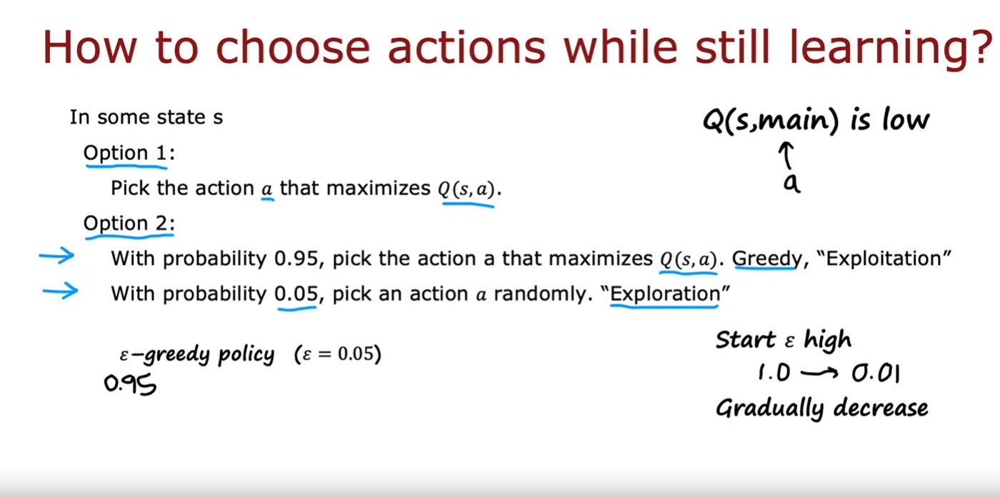

## Example of continuous state space applications

Many robotic control applications, including the lunar lander application that you will work on in the practice lab, have continuous state spaces. 

Let's take a look at what that means and how to generalize the concept we've talked about to these continuous state spaces. 

A simplified Mars rover example we use, I use a discrete set of states and what that means is that simplify Mars rover could only be in one of six possible positions. 

But most robots can be in more than one of six or any discrete number of positions, instead, they can be in any of a very large number of continuous value positions. 

#### Example 1

For example, if the Mars rover could be anywhere on a line, so its position was indicated by a number ranging from 0-6 kilometers where any number in between is valid. That would be an example of a continuous state space because the position would be represented by a number such as that is 2.7 kilometers along or 4.8 kilometers or any other number between zero and six. 

#### Example 2

Let's look at another example. I'$m$ going to use for this example, the application of controlling a car or a truck. Here's a toy car, or actually a toy truck. This one belongs to my daughter. If you're building a self-driving car or self-driving truck and you want to control this to drive smoothly, then the state of this truck might include a few numbers such as its x position, its y position, maybe its orientation, what way is it facing.

Assuming the truck stays on the ground, you probably don't need to worry about how tall is, how high up it is. This is state will include x, y and is angle Theta as well as maybe its speeds in x-direction, the speed in the y-direction and how quickly it's turning: Is it turning at one degree per second or is it turning at 30 degrees per second or is it turning really quickly at 90 degrees per second? 

So, for a truck or a car, the state might include not just one number, like how many kilometers of this along on this line,

but they might includes six numbers: 

$$
s = \begin{bmatrix}
x \\
y \\
\theta \\
\dot{x} \\
\dot{y} \\
\dot{\theta}
\end{bmatrix}
$$

its $x$ position, its $y$ position, its orientation, which I'$m$ going to denote using Greek alphabet Theta $\theta$, as well its velocity in the x-direction, which I will denote using $\dot{x}$, so that means how quickly is this x-coordinate changing, $\dot{y}$ how quickly is the y coordinate changing and then finally, $\dot{\theta}$, which is how quickly is the angle of the car changing. 

Whereas for the six state Mars rover example, the state was just one of six possible numbers: It could be one, two, three, four, five or six. 

For the car, the state would comprise this vector of six numbers and any of these numbers can take on any value within its valid range. For example, Theta should range between zero and 360 degrees

#### Example 3: Autonomous Helicopter

Let's look at another example. 

What if you're building a Reinforcement Learning algorithm to control an autonomous helicopter? 

How would you characterize the position of a helicopter? 

To illustrate, I have with me here a small toy helicopter. The positioning of the helicopter would include its $x$ position, such as how far north or south is a helicopter, its $y$ position, maybe how far on the east-west axis is the helicopter and then also $z$, the height of the helicopter above ground. 

But other than the position, the helicopter also has an orientation and conventionally, one way to capture its orientation is with three additional numbers, one of which captures of the roll of the helicopter, Is it rolling to the left or the right? 

The pitch, is it pitching forward or pitching up, pitching back and then finally the yaw which is what is the compass orientation is it facing. If facing north or east or south or west? 

To summarize, the state of the helicopter includes its position in the say, north-south direction, its position in the east-west direction, y is height above ground and also the roll, the pitch and also that yaw of helicopter. 

To write this down, the state therefore includes the position $x$, $y$, $z$ and then the row, pitch and yaw denoted with the Greek alphabets $\phi$, $\theta$ and $\omega$ 

But to control the helicopter, we also need to know its speed in the x-direction, in the y-direction and in the z direction, as well as its rate of turning, also called the angular velocity, so how fast is this roll changing and how fast is this pitch changing and how fast is its yaw changing? 

This is actually the state used to control autonomous helicopters. Is this list of 12 numbers that is input to a policy and the job of a policy is look at these 12 numbers and decide what's an appropriate action to take in a helicopter.

### Summary

So, in a continuous state Reinforcement Learning problem or a continuous state Markov Decision Process, continuous MDP, the state of the problem isn't just one of a small number of possible discrete values, like a number from 1-6. 

Instead, it's a vector of numbers, any of which could take any of a large number of values. 

In the practice lab for this week, you get to implement for yourself a Reinforcement Learning algorithm applied to a simulated lunar lander application. 

Landing something on the moon in simulation. 

Let's take a look in the next video at what that application entails, since there will be another continuous state application

## Lunar lander

The lunar lander lets you land a simulated vehicle on the moon. It's like a fun little video game that's been used by a lot of Reinforcement Learning researchers. Let's take a look at what it is.

In this application, you're in command of a lunar lander that is rapidly approaching the surface of the moon and your job is the fire thrusters at the appropriate times to land it safely on a landing pad.

To give you a sense of what it looks like. This is the lunar lander landing successfully and it's firing thrusters downward and to the left and right to position itself to land between these two yellow flags.

Or if the Reinforcement Learning algorithm policy does not do well then this is what it might look like where the lander unfortunately has crashed on the surface of the moon.

### Lunar lander actions

In this application you have four possible actions on every time step:

- You could either do **nothing**, in which case the forces of inertia and gravity pull you towards the surface of the moon. 
- Or you can fire a **left** thruster. When you see a little red dot come out on the left, that's firing the left thruster. They'll tend to push the lunar lander to the right 
- Or you can fire the **main** engine that's thrusting down the bottom here. 
- Or you can fire the **right** thruster and that's firing the right thruster which will push you to the left 

And your job is to keep on picking actions over time. So, it's the lunar lander safely between these two flags here on the landing pad. 

In order to give the actions a shorter name I'$m$ sometimes going to call the actions **nothing** meaning do nothing or **left** meaning fire the left thruster or **main** meaning fire the main engine downward or **right**

So I'$m$ going to call the actions nothing, left, main and right for short later in this video. 

### State space

How about the state space of this Markov Decision Process (MDP)? The states are:

- Its position $x$ and $y$: How far to the left or right and how high up is it
- Its velocity $\dot{x}$, $\dot{y}$: How fast is it moving in the horizontal and vertical directions
- Its angle $\theta$: How far is the lunar lander tilted to the left or tilted to the right
- Its angular velocity $\dot{\theta}$

And then finally, because a small difference in positioning makes a big difference in whether or not it's landed, we're going to have two other variables in the state vector which we will call:

- $l$ and $r$ which corresponds to whether the left leg is grounded, meaning whether or not the left leg is sitting on the ground
- $r$ which corresponds to whether or not the right leg is sitting on the ground. 

So, whereas $x$, $y$, $\dot{x}$, $\dot{y}$, $\theta$, $\dot{\theta}$ are numbers, $l$ and $r$ will be binary valued and can take on only values 0 or 1 depending on whether the left and right legs are touching the ground

### The reward function

Finally, here is the reward function for the lunar lander:

- If it manages to get to the landing pad, then it receives a reward between 100 and 140 depending on how well it's flown when gotten to the center of the landing pad. 
- We also give it an additional reward for moving toward or away from the pad so if it moves closer to the pad, it receives a positive reward and if it moves away/drifts away, it receives a negative reward. 
- If it crashes, it gets a large -100 reward
- If it achieves a soft landing, that is a landing that is not a crash, it gets a +100 reward
- For each leg, the left leg or the right leg, that it gets grounded, it receives a +10 reward 
- And then finally to encourage it not to waste too much fuel and fire thrusters that aren't necessarily, every time it fires the main engine we give it a -0.3 reward and every time it fires the left or the right side thrusters we give it a -0.03 reward. 

> [!NOTE]
> Notice that this is a moderately complex reward function. The designers of the lunar lander application actually put some thought into exactly what behavior you want and codified it in the reward function to incentivize more of the behaviors you want and fewer of the behaviors like crashing that you don't want. 

When building your own Reinforcement Learning application, it usually takes some thought to specify exactly what you want or don't want and to codify that in the reward function. However, specifying the reward function should still be much easier than specifying the exact right action to take from every single state, which is much harder for this and many other Reinforcement Learning applications.

### The lunar lander problem

So, the lunar lander problem is as follows: 

$$
\mathbf{s} =
\begin{bmatrix}
x \\
y \\
\dot{x} \\
\dot{y} \\
\theta \\
\dot{\theta} \\
l \\
r
\end{bmatrix}
$$

Our goal is to learn a policy pi $\pi$ that when given a state $s$ as written here picks an action $a = \pi(s)$ so as to maximize the return, the sum of discounted rewards

And usually for the lunar lander we will use a fairly large value for gamma. We will use a value of $\gamma = 0.985$, so pretty close to one. And if you can learn a policy pi $\pi$ that does this, then you will successfully land this lunar lander

### Summary

Exciting application and we're now finally ready to develop a learning algorithm which will turn out to use deep learning or neural networks to come up with a policy to land the lunar lander. 

Let's go on into the next video where we will start to learn about deep Reinforcement Learning

## Learning the state-value function

Let's see how we can use Reinforcement Learning to control the Lunar Lander or for other Reinforcement Learning problems. 

> [!IMPORTANT]
> The key idea is that we're going to train a neural network to compute or to approximate the state action value function $Q(s, a)$ and that in turn will let us pick good actions. 

Let's see how it works. 

### Deep Reinforcement Learning

The heart of the learning algorithm is we're going to train a neural network that inputs the current state $s$ and the current action $a$ and computes or approximates $Q(s, a)$

In particular, for the Lunar Lander, we're going to take the state $s$ and any action $a$ and put them together. 

#### States

Concretely, the state was that list of eight numbers that we saw previously, so you have $x$, $y$, $\dot{x}$, $\dot{y}$, $\theta$, $\dot{\theta}$ and then $l$ and $r$ for whether the left and right legs are grounded, so that's a list of eight numbers that describe the state. 

#### Actions

Then, finally, we have four possible actions: nothing, left, main or main engine and right. We can encode any of those four actions using a one-hot feature vector

So, if action were the first action, we may encode it using 1, 0, 0, 0 or if it was the second action to fire the left cluster, we may encode it as 0, 1, 0, 0.

#### Input vector $\vec{x}$ 

This list of 12 numbers, eight numbers for the state and then four numbers, a one-hot encoding of the action, are the inputs we'll have to the neural network and I'$m$ going to call this $\vec{x}$ 

We'll then take these 12 numbers and feed them to a neural network with say, 64 units in the first hidden layer, 64 units in the second hidden layer and then a single output in the output layer. 

The job of the neural network is to output $Q(s, a)$, the state action-value function for the Lunar Lander given the inputs $s$ and $a$. 

And because we'll be using neural network training algorithms in a little bit, I'$m$ also going to refer to this value $Q(s, a)$ as the target value $y$ that we're training the neural network to approximate.

Notice that I did say Reinforcement Learning is different from Supervised Learning but what we're going to do is not input a state and have it output an action, what we're going to do is input a state action pair and have it try to output $Q(s, a)$ and using a neural network inside the Reinforcement Learning algorithm this way will turn out to work pretty well. We'll see the details in a little bit so don't worry about it if it doesn't make sense yet. 

But if you can train a neural network with appropriate choices of parameters in the hidden layers and in the output layer to give you good estimates of $Q(s, a)$, then whenever your Lunar Lander is in some state $s$, you can then use the neural network to compute $Q(s, a)$ for all four actions, you can compute $Q(s, nothing)$, $Q(s, left)$, $Q(s, main)$, $Q(s, right)$ and then finally, whichever of these has the highest value, you pick the corresponding action $a$. 

#### Example

For example, if out of these four values, $Q(s, main)$ is largest, then you would decide to go and fire the main engine of the Lunar Lander. 

The question becomes, how do you train a neural network to output $Q(s, a)$? 

It turns out the approach will be to use Bellman's equations to create a training set with lots of examples $x$ and $y$ and then we'll use Supervised Learning exactly as you learned in the second course when we talked about neural networks to learn using Supervised Learning, a mapping from $x$ to $y$, that is a mapping from the state action pair to this target value $Q(s, a)$. 

But how do you get the training set with values for $x$ and $y$ that you can then train a neural network on? Let's take a look

### Bellman equation

Here's the Bellman equation: 

$$ Q(s, a) = R(s) + \gamma \max\limits_{a'} Q(s', a') $$

The right-hand side is what you want $Q(s, a)$ to be equal to, so I'$m$ going to call this value on the right-hand side $y$ and the input to the neural network is a state and an action so I'$m$ going to call that $x$:

$$ 
\underbrace{$Q(s, a)$}_{x} = \underbrace{R(s) + \gamma \max\limits_{a'} Q(s', a')}_{y} 
$$

The job of the neural network is to input $x$, that is input the state action pair and try to accurately predict what will be the value on the right. 

In Supervised Learning, we were training a neural network to learn a function $f$, which depends on a bunch of parameters, $w$ and $b$, the parameters of the various layers of the neural network and it was the job of the neural network to input $x$ and hopefully, I'll put something close to the target value $y$. 

$$ f_{w, b}(x) \approx y $$

The question is, how can we come up with a training set with values $x$ and $y$ for a neural network to learn from?

Here's what we're going to do: 

We're going to use the lunar lander and just try taking different actions in it. If we don't have a good policy yet, we'll take actions randomly, fire the left thruster, fire the right thruster, fire the main engine, do nothing and by just trying out different things in the lunar lander simulator, we'll observe a lot of examples of when we're in some state and we took some action, may be a good action, maybe a terrible action, either way and then we got some reward $R(s)$ for being in that state and as a result of our action, we got to some new state $s'$

As you take different actions in the lunar lander, you will see this 

$$ (s, a, R(s), s') $$ 

and we call them tuples in Python code many times. 

#### Example 1

For example, maybe one time you're in some state $s$ and just to give this an index we will call this $s^{(1)}$ and you happen to take some action $a^{(1)}$, this could be nothing, left, main thrusters or right and as a result of which you've got some reward $R(s^{(1)})$ and you wound up at some state $s'^{(1)}$:

$$ (s^{(1)}, a^{(1)}, R(s^{(1)}), s'^{(1)}) $$ 

#### Example 2

Maybe at different times you're in some other state $s^{(2)}$, you took some other action $a^{(2)}$, could be good action, could be bad action, could be any of the four actions, and you got the reward $R(s^{(2)})$ and then you wound up with $s'^{(2)}$:

$$ (s^{(2)}, a^{(2)}, R(s^{(2)}), s'^{(2)}) $$ 

#### Example 3

and so on multiple times. 

$$ (s^{(3)}, a^{(3)}, R(s^{(3)}), s'^{(3)}) $$ 

Maybe you've done this 10,000 times or even more than 10,000 times, so you would have to save the way with not just $s^{(1)}$, $a^{(1)}$ and so on but up to $s^{(10,000)}$, $a^{(10,000)}$ 

#### Building training examples

It turns out that each of list of 4 elements, each of these tuples will be enough to create a single training example: $x^{(1)}$, $y^{(1)}$

In particular, here's how you do it:

There are four elements in this first tuple:

$$ (s^{(1)}, a^{(1)}, R(s^{(1)}), s'^{(1)}) $$ 

The first two will be used to compute $x^{(1)}$ and the second two would be used to compute $y^{(1)}$:

$$ (\underbrace{s^{(1)}, a^{(1)}}_{x^{(1)}}, \underbrace{R(s^{(1)}), s'^{(1)}}_{y^{(1)}}) $$

In particular, $x^{(1)}$ is just going to be $s^{(1)}$, $a^{(1)}$ put together:

$$ x^{(1)} = (s^{(1)}, a^{(1)}) $$

- $s^{(1)}$ would be eight numbers, the state of the lunar lander
- $a^{(1)}$ would be four numbers, the one-hot encoding of whatever action this was
- $y^{(1)}$ would be computed using the right-hand side of the Bellman equation

In particular, the Bellman equation says: 

When you input $(s^{(1)}, a^{(1)})$ you want:

$$ 
Q(s^{(1)}, a^{(1)}) = R(s^{(1)}) + \gamma \max\limits_{a'} Q(s'^{(1)}, a') 
$$

Notice that these two elements of the tuple on the right:

$$ R(s^{(1)}), s'^{(1)} $$ 

give you enough information to compute this. 

You know what is $R(s^{(1)})$: That's the reward you've saved the way here plus the discount factor gamma times max over all actions $a'$ of $Q(s'^{(1)}, a')$, that's a state you got to in this example and then take the maximum over all possible actions $a'$ 

And so I'$m$ going to call this $y^{(1)}$:

$$ 
y^{(1)} = R(s^{(1)}) + \gamma \max\limits_{a'} Q(s'^{(1)}, a') 
$$

and when you compute this, this will be some number like 12.5 or 17 or 0.5 or some other number and we'll save that number here as $y^{(1)}$, so that this pair $(x^{(1)}, y^{(1)})$ becomes the first training example in this little dataset we're computing

### Where does $Q(s'^{(1)}, a')$ come from?

Now, you may be wondering, where does $Q(s', a')$ or $Q(s'^{(1)}, a')$ come from? Well, initially we don't know what is the Q function but it turns out that when you don't know what is the Q function, you can start off with taking a totally random guess of what is the Q function

We'll see on the next slide that the algorithm will work nonetheless but in every step Q here is just going to be some guess that will get better over time, it turns out of what is the actual Q function. 

#### A second example

Let's look at a second example:

$$ (s^{(2)}, a^{(2)}, R(s^{(2)}), s'^{(2)}) $$ 

If you had a second experience where you are in state $s^{(2)}$, took an action $a^{(2)}$, got that reward $R(s^{(2)})$ and then got to that state $s'^{(2)}$, then we would create a second training example in this dataset called $x^{(2)}$ where the input is now $(s^{(2)}, a^{(2)})$, so the first two elements go to computing the input $x$ and then $y^{(2)}$ will be equal to: 

$$ 
R(s^{(2)}) + \gamma \max\limits_{a'} Q(s'^{(2)}, a') 
$$

and whatever this number is $y^{(2)}$ we put this over here in our small but growing training set

And so on and so forth, until maybe you end up with 10,000 training examples with these $(x, y)$ pairs: $(x^{(10,000)}, y^{(10,000)})$

What we'll see later is that we'll actually take this training set where the $x$'s are inputs with 12 features and the $y$'s are just numbers. 

We'll train a neural network with, say, the mean squared error loss to try to predict $y$ as a function of the input $x$. 

So, what I have described here is just one piece of the learning algorithm we'll use. Let's put it all together on the next slide and see how it all comes together into a single algorithm. 

### Learning algorithm

Let's take a look at what the full algorithm for learning the Q-function is like.

#### Step 1: Initialize NN randomly as guess of $Q(s, a)$

First, we're going to take our neural network and initialize all the parameters of the neural network randomly: Initially, we have no idea whether it’s a Q-function, so we’ll just pick totally random values for the weights and pretend that this neural network is our initial random guess for the Q-function.

This is a little bit like when you are training linear regression and you initialize all the parameters randomly and then use gradient descent to improve the parameters. 

Initializing it randomly for now is fine. What's important is whether the algorithm can slowly improve the parameters to get a better estimate. 

#### Step 2: Repeat the following steps

Next, we will repeatedly do the following: 

##### Step 2 a): Take actions in the lunar lander. Get $(s, a, R(s), s')$
We will take actions in the lunar lander, so fly around randomly, take some good actions, take some bad actions, it's okay either way but you get lots of these tuples:

$$ (s, a, R(s), s') $$ 

of when it was in some state, you took some action $a$ get a reward $R(s)$ and you got to some state $s'$.

##### Step 2 b): Store 10,000 most recent $(s, a, R(s), s')$ tuples

What we will do is store the 10,000 most recent examples of these tuples. 

As you run this algorithm, you will see many steps in the lunar lander, maybe hundreds of thousands of steps but to make sure we don't end up using excessive computer memory, common practice is to just remember the 10,000 most recent such tuples that we saw taking actions in the Markov Decision Process (MDP) 

###### Replay buffer concept

This technique of storing the most recent examples only is sometimes called the **Replay buffer** in a Reinforcement Learning algorithm. 

For now, we're just flying the lunar lander randomly, sometimes crashing, sometimes not and getting these tuples as experience for our learning algorithm. 

##### Step 2 c): Train the NN

Occasionally then we will train the neural network

In order to train the neural network, here's what we'll do:

###### Step 2 c) A: Create training set of 10,000 examples 

We'll look at these 10,000 most recent tuples we have saved and create a training set of 10,000 examples. 

So, the training set needs lots of pairs of $x$ and $y$ and for our training examples:

$$ x = (s, a) $$

from this part of the tuple. So, there'll be a list of 12 numbers: the 8 numbers for the state and the 4 numbers for the one-hot encoding of the action. 

And the target value $y$ that we want a neural network to try to predict would be:

$$ 
y = R(s) + \gamma \max\limits_{a'} Q(s', a') 
$$

How do we get this value of Q? Well, initially is this neural network that we had randomly initialized so it may not be a very good guess but it's a guess. 

###### Step 2 c) B: Train $Q_{new}$ such that $Q_{new}(s, a) \approx y$

After creating these 10,000 training examples, we'll have training examples: 

$$ (x^{(1)}, y^{(1)}) $$ 

$$ \dots $$

$$ (x^{(10,000)}, y^{(10,000)}) $$

and so we'll train a neural network and I'$m$ going to call the new neural network $Q_{new}$, such that $Q_{new}(s, a) \approx y$

This is exactly training that neural network to output f with parameters $w$ and $b$, to input x to try to approximate the target value y. 

$$ f_{w, b}(x) \approx y $$

Now, this neural network should be a slightly better estimate of what the Q function or the state action value function should be. 

##### Step 2 d): Set $Q = Q_{new}$

And so what we'll do is we're going to take Q and set it to this new neural network that we had just learned. 

### Credits to Mnih et al

Many of the ideas in this algorithm are due to **Mnih et al**. 

The phrase "are due to Mnih et al." means that many of the ideas in this algorithm are attributed to Mnih and his team or collaborators. It’s a way of giving credit or recognition to those people (in this case, Mnih and other authors) for developing or influencing the ideas being mentioned.

For example, Mnih et al. typically refers to the team of researchers led by Volodymyr Mnih, known for their pioneering work in using deep neural networks for Reinforcement Learning, such as developing the DQN (Deep Q-Network) algorithm.

It turns out that if you run this algorithm where you start with a really random guess of the Q function, then use Bellman's equations to repeatedly try to improve the estimates of the Q function, then by doing this over and over, taking lots of actions and training a model, that will improve your guess for the Q-function and so for the next model you train, you now have a slightly better estimate of what is the Q function and then the next model you train will be even better and when you update $Q=Q_{new}$, then for the next time you train a model, $Q(s', a')$ will be an even better estimate. 

And so as you run this algorithm on every iteration, $Q(s', a')$ hopefully becomes an even better estimate of the Q function so that when you run the algorithm long enough, this will actually become a pretty good estimate of the true value of $Q(s, a)$ so that you can then use this to pick, hopefully good actions for the MDP

### Summary

The algorithm you just saw is sometimes called the **DQN algorithm** which stands for **Deep Q-Network** because you're using deep learning and neural network to train a model to learn the Q function

So, hence DQN or Deep Q networks, Deep Q using a neural network. 

If you use the algorithm as I described it, it will kind of work OK on the lunar lander. Maybe it'll take a long time to converge, maybe it won't land perfectly but it will sort of work but it turns out that with a couple of refinements to the algorithm, it can work much better. 

In the next few videos, let's take a look at some refinements to the algorithm that you just saw

## Algorithm refinement: Improved neural network architecture

In the last video, we saw a neural network architecture that will input the state and action and attempt to output the Q function, $Q(s, a)$. It turns out that there's a change to neural network architecture that make this algorithm much more efficient. So, most implementations of DQN actually use this more efficient architecture that we'll see in this video. Let's take a look. 

This was the neural network architecture we saw previously, where it would input 12 numbers and output $Q(s, a)$. Whenever we are in some state $s$, we would have to carry out inference in the neural network separately four times to compute these four values so as to pick the action $a$ that gives us the largest Q value. 

### The problem

This is inefficient because we have to carry our inference four times from every single state. 

### The solution

Instead, it turns out to be more efficient to train a single neural network to output all four of these values simultaneously. Those values are:

$$ Q(s, nothing), Q(s, left), Q(s, main), Q(s, right) $$

### A modified neural network architecture

This is what it looks like. 

Here's a modified neural network architecture where the input is eight numbers corresponding to the state of the lunar lander. 

It then goes through the neural network with 64 units in the first hidden layer, 64 units in the second hidden layer and now the output unit has four output units and the job of the neural network is to have the four output units output $Q(s, nothing)$, $Q(s, left)$, $Q(s, main)$ and $Q(s, right)$. 

The job of the neural network is to compute simultaneously the Q value for all four possible actions for when we are in the state $s$. 

This turns out to be more efficient because given a state $s$ we can run inference just once and get all four of these values and then very quickly pick the action $a$ that maximizes $Q(s, a)$

### Another improvement on the Bellman's equation

You notice also in Bellman's equations, there's a step in which we have to compute:

$$ 
R(s) + \gamma \max\limits_{a'} Q(s', a') 
$$

This neural network also makes it much more efficient to compute this because we're getting $Q(s', a')$ for all actions $a'$ at the same time. 

So, you can then just pick the max to compute this value for the right-hand side of Bellman's equation

### Summary

This change to the neural network architecture makes the algorithm much more efficient and so we will be using this architecture in the practice lab.

Next, there's one other idea that'll help the algorithm a lot which is something called an Epsilon-greedy policy which affects how you choose actions even while you're still learning. 

Let's take a look at the next video and what that means

## Algorithm refinement: ϵ-greedy policy

In the learning algorithm that we developed, even while you're still learning how to approximate $Q(s, a)$, you need to take some actions in the lunar lander. So, how do you pick those actions while you're still learning? The most common way to do so is to use something called an Epsilon-greedy policy. Let's take a look at how that works. 

Here's the algorithm that you saw earlier. One of the steps in the algorithm is to take actions in the lunar lander. So, when the learning algorithm is still running, we don't really know what's the best action to take in every state. If we did, we'd already be done learning but even while we're still learning and don't have a very good estimate of $Q(s, a)$ yet, how do we take actions in this step of the learning algorithm? Let's look at some options.

When you're in some state $s$, we might not want to take actions totally at random because that will often be a bad action. 

### Option 1

So, one natural option would be to pick whenever in state $s$, pick an action $a$ that maximizes $Q(s, a)$. We may say, even if $Q(s, a)$ is not a great estimate of the Q function, let's just do our best and use our current guess of $Q(s, a)$ and pick the action $a$ that maximizes it. 

It turns out this may work okay, but isn't the best option. 

### Option 2

Instead, here's what is commonly done. Here's option 2 which is most of the time, let's say with probability of 0.95, pick the action that maximizes $Q(s, a)$.

So, most of the time we try to pick a good action using our current guess of $Q(s, a)$ but the small fraction of the time, let's say, five percent of the time, we'll pick an action $a$ randomly. 

Why do we want to occasionally pick an action randomly? Well, here's why. Suppose there's some strange reason that $Q(s, a)$ was initialized randomly so that the learning algorithm thinks that firing the main thruster is never a good idea. Maybe the neural network parameters were initialized so that $Q(s, main)$ is always very low. 

If that's the case, then the neural network because it's trying to pick the action $a$ that maximizes $Q(s, a)$, it will never ever try firing the main thruster and because it never ever tries firing the main thruster, it will never learn that firing the main thruster is actually sometimes a good idea. 

Because of the random initialization, if the neural network somehow initially gets stuck in this mind that some things are bad idea, just by chance, then option 1, it means that it will never try out those actions and discover that maybe is actually a good idea to take that action, like fire the main thrusters sometimes. 

So, under option 2 on every step, we have some small probability of trying out different actions so that the neural network can learn to overcome its own possible preconceptions about what might be a bad idea that turns out not to be the case. 

This idea of picking actions randomly is sometimes called an **exploration step** because we're going to try out something that may not be the best idea but we're going to just try out some action in some circumstances, explore and learn more about an action in the circumstance where we may not have had as much experience before. 

Taking an action that maximizes $Q(s, a)$, sometimes this is called a **greedy action** because we're trying to actually maximize our return by picking this. 

Or in the Reinforcement Learning literature, sometimes you'll also hear this as an **exploitation step**. I know that exploitation is not a good thing, nobody should ever exploit anyone else but historically, this was the term used in Reinforcement Learning to say, let's exploit everything we've learned to do the best we can. 

So, in the Reinforcement Learning literature, sometimes you hear people talk about the exploration versus exploitation trade-off, which refers to how often do you take actions randomly or take actions that may not be the best in order to learn more versus trying to maximize your return by say, taking the action that maximizes $Q(s, a)$. 

This approach, that is option 2, has a name and it is called an **Epsilon-greedy policy**, where here epsilon $\epsilon = 0.05$. It is the probability of picking an action randomly and this is the most common way to make your Reinforcement Learning algorithm explore a little bit even whilst occasionally or maybe most of the time taking greedy actions. 

By the way, lot of people have commented that the name Epsilon-greedy policy is confusing because you're actually being greedy 95 percent of the time, not five percent of the time. So, maybe **1 minus Epsilon-greedy policy** because it's 95 percent greedy, five percent exploring, that's actually a more accurate description of the algorithm but for historical reasons, the name Epsilon-greedy policy is what has stuck. 

This is the name that people use to refer to the policy that explores actually epsilon $\epsilon$ fraction of the time rather than this greedy epsilon $\epsilon$ fraction of the time. 

### Trick on the epsilon value: Start high and gradually decrease it

Lastly, one of the trick that's sometimes used in Reinforcement Learning is to start off epsilon $\epsilon$ high: So, initially, you are taking random actions a lot at a time and then gradually decrease it, so that over time you are less likely to take actions randomly and more likely to use your improving estimates of the Q-function to pick good actions. 

For example, in the lunar lander exercise, you might start off with epsilon $\epsilon$ very, very high, maybe even epsilon $\epsilon = 1.0$ so you're just picking actions completely at random initially and then gradually decrease it all the way down to say $\epsilon = 0.01$ so that eventually you're taking greedy actions 99 percent of the time and acting randomly only a very small one percent of the time. 

If this seems complicated, don't worry about it. We'll provide the code in the Jupiter lab that shows you how to do this. 

### Summary

If you were to implement the algorithm as we've described it with the more efficient neural network architecture and with an Epsilon-greedy exploration policy, you find that they work pretty well on the lunar lander. 

One of the things that I've noticed for Reinforcement Learning algorithm is that compared to Supervised Learning, they're more finicky in terms of the choice of hyper parameters. 

For example, in Supervised Learning, if you set the learning rate a little bit too small, then maybe the algorithm will take longer to lear, maybe it takes three times as long to train, which is annoying, but maybe not that bad whereas in Reinforcement Learning, find that if you set the value of epsilon $\epsilon$ not quite as well or set other parameters not quite as well, it doesn't take three times as long to learn, instead it may take 10 times or a 100 times as long to learn. 

Reinforcement Learning algorithms, I think because they're are less mature than Supervised Learning algorithms, are much more finicky to little choices of parameters like that and it actually sometimes is frankly more frustrating to tune these parameters with Reinforcement Learning algorithm compared to a Supervised Learning algorithm

But again, if you're worried about the practice lab, the program exercise, we'll give you a sense of good parameters to use in the program exercise so that you should be able to do that and successfully learn the lunar lander, hopefully without too many problems. 

In the next optional video, I want us to drive a couple more algorithm refinements of mini batching and also using soft updates. 

Even without these additional refinements, the algorithm will work okay, but these are additional refinements that make the algorithm run much faster.

It's okay if you skip this video; we've provided everything you need in the practice lab to successfully complete it. However, if you're interested in learning more about the details of some tuned Reinforcement Learning algorithms, join me in the next video, where we'll explore mini-batching and soft updates.

## Algorithm refinement:  Mini-batch and soft updates (optional)

In this video, we'll look at two further refinements to the Reinforcement Learning algorithm you've seen. 

The first idea is called using mini-batches, and this turns out to be an idea they can both speedup your Reinforcement Learning algorithm and it's also applicable to supervised learning and can help you speed up your supervised learning algorithm as well, like training a neural network, or training a linear regression, or logistic regression model. 

The second idea we'll look at is soft updates which it turns out will help your Reinforcement Learning algorithm do a better job to converge to a good solution. Let's take a look at mini-batches and soft updates. 

### Refinement 1: Using mini-batches

To understand mini-batches, let's just look at supervised learning to start.

Here's the dataset of housing sizes and prices that you had seen way back in the first course of this specialization on using linear regression to predict housing prices. 

There we had come up with this cost function for the parameters $w$ and $b$, it was 1 over 2m, sum of the prediction minus the actual value y^​2 and the gradient descent algorithm was to repeatedly update w as w minus the learning rate alpha times the partial derivative respect to w of the cost J of wb and similarly to update b as follows. Let me just take this definition of J of wb and substitute it in here.

Now, when we looked at this example way back when were starting to talk about linear regression and supervised learning, the training set size $m$ was pretty small. I think we had 47 training examples. 

But what if you have a very large training set? Say $m=100,000,000$

There are many countries including the United States with over a 100 million housing units, and so a national census will give you a dataset that is this order of magnitude or size. 

The problem with this algorithm when your dataset is this big, is that every single step of gradient descent requires computing this average over 100 million examples and this turns out to be very slow. 

Every step of gradient descent means you would compute this sum or this average over 100 million examples, then you take one tiny gradient descent step and you go back and have to scan over your entire 100 million example dataset again to compute the derivative on the next step, they take another tiny gradient descent step and so on and so on. 

When the training set size is very large, this gradient descent algorithm turns out to be quite slow. 

The idea of mini-batch gradient descent is to not use all 100 million training examples on every single iteration through this loop. Instead, we may pick a smaller number, let me call it $m'=1,000$

On every step, instead of using all 100 million examples, we would pick some subset of 1,000 or $m'$ examples. This inner term becomes 1 over 2m prime is sum over sum $m'$ examples. 

Now, each iteration through gradient descent requires looking only at the 1,000 rather than 100 million examples and every step takes much less time and just leads to a more efficient algorithm. 

What mini-batch gradient descent does is on the first iteration through the algorithm, may be it looks at that subset of the data. On the next iteration, maybe it looks at that subset of the data, and so on. For the third iteration and so on, so that every iteration is looking at just a subset of the data so each iteration runs much more quickly. 

To see why this might be a reasonable algorithm, here's the housing dataset. If on the first iteration we were to look at just say five examples, this is not the whole dataset but it's slightly representative of the string line you might want to fit in the end, and so taking one gradient descent step to make the algorithm better fit these five examples is okay

But then on the next iteration, you take a different five examples like that shown here. You take one gradient descent step using these five examples, 

and on the next iteration you use a different five examples and so on and so forth. 

You can scan through this list of examples from top to bottom. That would be one way. Another way would be if on every single iteration you just pick a totally different five examples to use.

You might remember with batch gradient descent, if these are the contours of the cost function J,

then batch gradient descent would say, start here and take a step, take a step, take a step, take a step, take a step. Every step of gradient descent causes the parameters to reliably get closer to the global minimum of the cost function here in the middle. 

In contrast, mini-batch gradient descent or a mini-batch learning algorithm will do something like this. If you start here, then the first iteration uses just five examples so it will kind of hit in the right direction but maybe not the best gradient descent direction. 

Then the next iteration they may do that, the next iteration that, and that and sometimes just by chance, the five examples you chose may be an unlucky choice and even head in the wrong direction away from the global minimum, and so on and so forth. But on average, mini-batch gradient descent will tend toward the global minimum, not reliably and somewhat noisily, but every iteration is much more computationally inexpensive and so mini-batch learning or mini-batch gradient descent turns out to be a much faster algorithm when you have a very large training set

In fact, for supervised learning, where you have a very large training set, mini-batch learning or mini-batch gradient descent or a mini-batch version with other optimization algorithms like Adam is used more common than batch gradient descent

### Mini-batch applied to a Reinforcement Learning algorithm

Going back to our Reinforcement Learning algorithm, this is the algorithm that we had seen previously. The mini-batch version of this would be, even if you have stored the 10,000 most recent tuples in the replay buffer, what you might choose to do is not use all 10,000 every time you train a model. 

Instead, what you might do is just take the subset. You might choose just 1,000 examples of these $(s, a, R(s), s')$ tuples and use it to create just 1,000 training examples to train the neural network. 

And it turns out that this will make each iteration of training a model a little bit more noisy but much faster and this will overall tend to speed up this Reinforcement Learning algorithm. 

That's how mini-batching can speed up both a supervised learning algorithm like linear regression as well as this Reinforcement Learning algorithm where you may use a mini-batch size of say 1,000 examples, even if you store it away, 10,000 of these tuples in your replay buffer. 

### Refinement 2: Using Soft updates

Finally, there's one other refinement to the algorithm that can make it converge more reliably, which is, I've written out this step here of Set $Q=Q_{new}$ 

But it turns out that this can make a very abrupt change to Q: If you train a new neural network $Q_{new}$, maybe just by chance is not a very good neural network, maybe is even a little bit worse than the old one, then you just overwrote your Q function with a potentially worse noisy neural network. 

So, the soft update method helps to prevent $Q_{new}$ from through just one unlucky step getting worse.

In particular, the neural network Q will have some parameters, $w$ and $b$, all the parameters for all the layers in the neural network and when you train the new neural network, you get some parameters $w_{new}$ and $b_{new}$. 

In the original algorithm as described on that slide, you would set:

$$ w = w_{new} $$ 

$$ b = b_{new} $$ 

that's what set $Q = Q_{new}$ means

With the soft update, what we do instead is set:

$$ w = 0.01 * w_{new} + 0.99 * w $$
 

In other words, we're going to make W to be 99 percent the old version of W plus one percent of the new version $w_{new}$. 

This is called a soft update because whenever we train a new neural network $w_{new}$, we're only going to accept a little bit of the new value. 

And similarly for b:

$$ b = 0.01 * b_{new} + 0.99 * b $$ 

These numbers, 0.01 and 0.99, these are hyperparameters that you could set, but it controls how aggressively you move $w$ to $w_{new}$ and these two numbers are expected to add up to one. 

One extreme would be if you were to set: 

$$ w = 1 * w_{new} + 0 * w $$

in which case, you're back to the original algorithm up here where you're just copying $w_{new}$ onto $w$. 

But a soft update allows you to make a more gradual change to Q or to the neural network parameters $w$ and $b$ that affect your current guess for the Q function $Q(s, a)$. 

It turns out that using the soft update method causes the Reinforcement Learning algorithm to converge more reliably. It makes it less likely that the Reinforcement Learning algorithm will oscillate or diverge or have other undesirable properties

### Summary

With these two final refinements to the algorithm, mini-batching, which actually applies very well to supervise learning as well, not just Reinforcement Learning, as well as the idea of soft updates, you should be able to get your lunar algorithm to work really well on the Lunar Lander. 

The Lunar Lander is actually a decently complex, decently challenging application and so that you can get it to work and land safely on the moon. 

I think that's actually really cool and I hope you enjoy playing with the practice lab. 

Now, we've talked a lot about Reinforcement Learning. Before we wrap up, I'd like to share with you my thoughts on the state of Reinforcement Learning so that as you go out and build applications using different machine learning techniques via supervised, unsupervised, Reinforcement Learning techniques that you have a framework for understanding where Reinforcement Learning fits in to the world of machine learning today. 

Let's go take a look at that in the next video.

## The state of Reinforcement Learning

Reinforcement learning is an exciting set of technologies. In fact, when I was working on my PhD thesis, reinforcement learning was the subject of my thesis so I was and still am excited about these ideas. 

Despite all the research momentum and excitement behind reinforcement learning though, I think there is a bit or maybe sometimes a lot of hype around it. So, what I hope to do is share with you a practical sense of where reinforcement learning is today in terms of its utility for applications. 

### Limitations of Reinforcement Learning

#### Limitation 1: Simulation vs real world environment

One of the reasons for some of the hype about reinforcement learning is, it turns out many of the research publications have been on simulated environments and having worked in both simulations and on real robots myself, I can tell you that it's much easier to get a reinforcement learning algorithm to work in a simulation or in a video game than in a real robot. 

So, a lot of developers have commented that even after they got it to work in simulation, it turned out to be surprisingly challenging to get something to work in the real world or the real robot and so if you apply these algorithms to a real application, this is one limitation that I hope you pay attention to to make sure what you do does work on the real application. 

#### Limitation 2: Fewer applications of Reinforcement learning compared to Supervised Learning or Unsupervised Learning

Second, despite all the media coverage about reinforcement learning, today there are far fewer applications of reinforcement learning than supervised and unsupervised learning. 

So, if you are building a practical application, the odds that you will find supervised learning or unsupervised learning useful or the right tool for the job, is much higher than the odds that you would end up using reinforcement learning. 

I have used reinforcement learning a few times myself especially on robotic control applications, but in my day to day applied work, I end up using supervised and unsupervised learning much more

#### A positive aspect/conclusion for Reinforcement Learning

There is a lot of exciting research in reinforcement learning right now, and I think the potential of reinforcement learning for future applications is very large. 

And reinforcement learning still remains one of the major pillars of machine learning and so having it as a framework as you develop your own machine learning algorithms, I hope will make you more effective at building working machine learning systems as well

### Summary

So, I hope you've enjoyed this week's materials on reinforcement learning, and specifically I hope you have fun getting the lunar lander to land for yourself. 

I hope will be a satisfying experience when you implement an algorithm and then see that lunar lander land safely on the moon because of code that you wrote. 

That brings us towards the end of this specialization. 

Let's go on to the last video where we wrap up

## [06-quiz-continuous-state-spaces](../06-quiz-continuous-state-spaces/)
