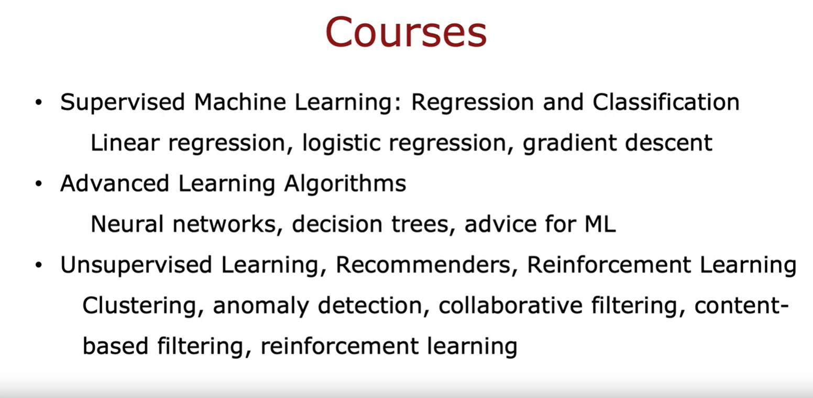
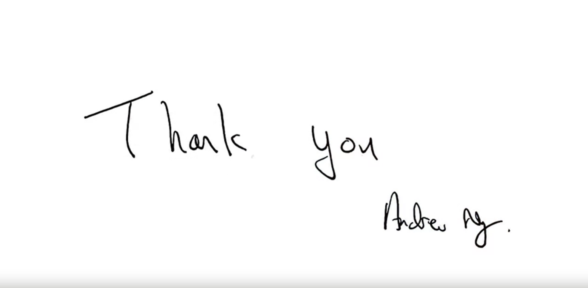

## Summary and thank you

Welcome to the final video of this machine learning specialization. 

We've been through a lot of videos together and this is the last one. 

Let's summarize the main topics we've gone over, and then I like to say a few words and then we'll wrap up the class. 

Looking back, I think we've been through a lot together. 

### 1st course

The first course we went through was on supervised machine learning, including regression and classification. Where you learned about linear regression, logistic regression, cost functions, and the gradient descent algorithm. 

### 2nd course

In the second course, we then looked at more advanced learning algorithms, including neural networks, decision tree ensembles, and also went through advice for machine learning such as bias and variance and how to use a train hold-out cross validation and test sets and how to improve your learning algorithm efficiently. 

### 3rd course

Then, the third course was on unsupervised learning recommenders and reinforcement learning, where we talked about clustering algorithms, anomaly detection algorithms, collaborative filtering and content-based filtering, and then in this past week, reinforcement learning. 

With this broad set of tools, you are now well qualified to build a huge range possible machine learning applications. 

Congratulations on making it all the way to this last video. If you've worked all the way through this specialization, you now have a very solid foundation in machine learning. 

I think you've made a great start to become an expert in machine learning. As you know, machine learning is having a huge impact on society as a powerful tool used by billions of people every day through web search, product recommendations, speech recognition, and many other applications. 

There's even improving human knowledge through hoping with scientific discovery is driving billions of dollars of value and is enabling new applications that were unimaginable just a few years ago. 

But I think the best application of machine learning are still yet to be invented, and that brings us to you: You are now well-qualified to wield the tools of machine learning, to build applications yourself, and to create things. I hope that you will use these skills to make other people's lives better. 

Before wrap up this class, I want to say just one last thing to you. This class has been fun for me to teach, but not long ago, I was a student myself, and so I know how time-consuming it is to learn this stuff. I know you're a busy person with many other things going on in your life, so that you took the time to watch the videos, go through the quizzes and labs. 

I know you've put a lot of time and put a lot of yourself into this class. I just want to say, thank you very much for having been a student in this class. I'm very grateful to you and appreciate all the time you spent with me and with the specialization. 

Thank you.